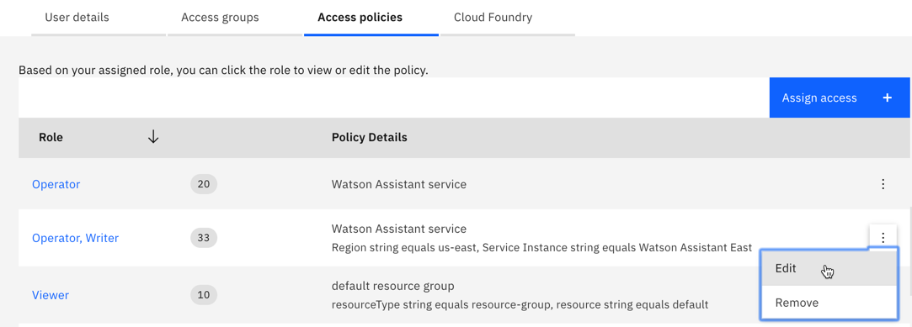
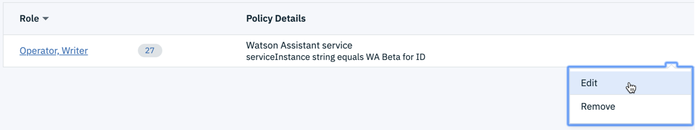
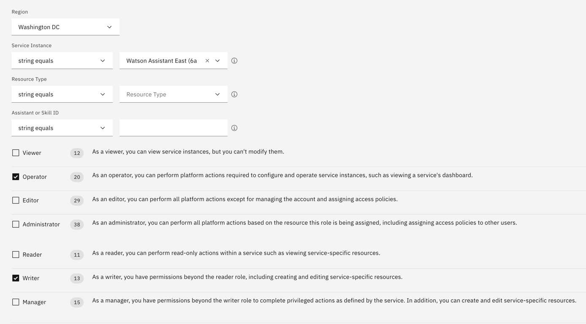

---

copyright:
  years: 2015, 2019
lastupdated: "2020-01-22"

subcollection: assistant

---

{:shortdesc: .shortdesc}
{:new_window: target="_blank"}
{:deprecated: .deprecated}
{:important: .important}
{:note: .note}
{:tip: .tip}
{:pre: .pre}
{:codeblock: .codeblock}
{:screen: .screen}
{:javascript: .ph data-hd-programlang='javascript'}
{:java: .ph data-hd-programlang='java'}
{:python: .ph data-hd-programlang='python'}
{:swift: .ph data-hd-programlang='swift'}

# Preventing loss of access
{: #access-control}

Access control is the ability to give other people access to your {{site.data.keyword.conversationshort}} resources, and control the level of access they get. Changes to how {{site.data.keyword.conversationshort}} access is managed are underway. Prepare your service instances for these access control changes today to prevent users from losing their current level of access when the feature updates are released.
{: shortdesc}

## Background
{: #access-control-pre}

Currently, the platform access role assignment that is applied to a {{site.data.keyword.conversationshort}} service instance from the IBM Cloud dashboard is used by IBM Cloud. However, the service access role assignments for users are ignored. Users with either Reader- or Writer-level access to a service instance effectively have Manager-level access. This behavior will change when the upcoming access control enhancements are released. When released, service-level access control will be enabled automatically in all service instances; you will not be able to disable it for individual instances.

When service access control is added to {{site.data.keyword.conversationshort}}, the service access role assignment will matter.
{: important}  

The service access roles will apply the following restrictions.

| Service Access Role | Privileges of the users in this role |
|------|---------------------------------------|
| Reader | Open and read an assistant or skill, but not edit it. |
| Writer | Read, edit, create, and delete an assistant or skill, but cannot view analytics. |
| Manager | Read, edit, create, and delete an assistant or skill, and view analytics. |
{: caption="Table 3. Service access role details" caption-side="top"}

## Prevent your collaborators from losing access
{: #access-control-admin-prep}

When you create a {{site.data.keyword.conversationshort}} service instance, you are assigned to a Manager service access role automatically. Your access will not change. 

If you invited people to your service instance and assigned them to a Reader or Writer service access role, then perform the following steps now.

If you aren't sure what role you assigned to the people you invited, then you can ask them. They will see a notification when they use the instance that tells them their current role. Otherwise, follow steps 1-5 to discover the person's role. If you assigned them to a role with limited privileges, take action now to reassign them to the appropriate role.

To change a collaborator's service access role:

1.  Click the User  icon in the page header.

1.  Make a note of the current service instance name, and then select **Manage Users** from the drop-down.

1.  From the navigation pane, click **Users**.

    People that you invited to collaborate with you on any service instance are listed. 
  
1.  To see the person's level of access to an instance, click the user's email address, and then click the **Access policies** tab.

    A list of your instances that this user can access is displayed. 

    

1.  Find the instance for which you want to change this person's access. (The service instance name is referred to as the *serviceInstance string*.)

    The user's platform access role is listed first. The user's service access role is listed second. 
    
    If only one role is displayed, then you might not have assigned a service access role to the user when you invited them to the instance. Complete the next step to assign a service access role to the user now.
    {: note}

1.  To change the user's role, click the *list of actions* icon for the entry, and then click **Edit**.

    

1.  Click the appropriate service access role checkbox.

    

1.  Click **Save**.

    The page closes and a confirmation message is displayed to indicate that the policy change was successfully saved.

## How to keep your access
{: #access-control-prep}

If you have a Manager service access role to a {{site.data.keyword.conversationshort}} service, then no action is required. You will have the same privileges and can do the same actions within the product after service-level access control is enabled.

If you have a Reader or Writer service access role, then what you can do will change when service-level access control is released.

- **I'm a Reader**

  With a Reader role, you cannot take any actions in the {{site.data.keyword.conversationshort}} application user interface. You can only view the assistants and skills pages. You cannot edit, create, or delete anything, and cannot view analytics.

- **I'm a Writer**

  With a Writer role, you can view, edit, create, and delete resources, such as assistants or skills. However, you cannot view analytics or user conversation log information. Only people with a Manager service access role can view the analytics page.

Act now to get the service instance owner to change your access level.

1.  Contact the person who invited you to work with them on the resources in the service instance. 

    There is no way from the IBM Cloud dashboard to determine who owns a service instance.
    {: note}

1.  Ask the owner of the service instance to change your service access role assignment.

    You can copy, edit, and then paste the following text into an email or message that you send to the instance owner.

    ```
    You are the owner of the {service instance name} {{site.data.keyword.conversationshort}} service instance. 
    I am currently a {role-you-have} of the instance. 
    Please change my service access role to {role-you-want}.
    For instructions, see https://cloud.ibm.com/docs/services/assistant?topic=assistant-access-control-admin-prep.
    ```
    {: codeblock}
