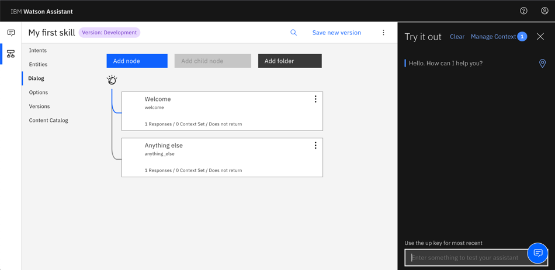

---

copyright:
  years: 2020
lastupdated: "2020-05-14"

subcollection: assistant

---

{:shortdesc: .shortdesc}
{:new_window: target="_blank"}
{:deprecated: .deprecated}
{:important: .important}
{:note: .note}
{:tip: .tip}
{:pre: .pre}
{:codeblock: .codeblock}
{:screen: .screen}
{:javascript: .ph data-hd-programlang='javascript'}
{:java: .ph data-hd-programlang='java'}
{:python: .ph data-hd-programlang='python'}
{:swift: .ph data-hd-programlang='swift'}

# Managing access to resources
{: #access-control}

You can give other people access to your {{site.data.keyword.conversationshort}} resources, and control the level of access they get.
{: shortdesc}

Maybe you want one development team to have access to a test assistant and another development team to have access to a production assistant. And you want data scientists to be able to view analytics for user conversation logs from both assistants. And maybe you want a writer to be able to author the dialog that is used by your assistant to converse with your customers. To manage who can do what with your skills and assistants, you can assign different access roles to different people.

## Before you grant access to others
{: #access-control-prereqs}

For each person to whom you grant access to your {{site.data.keyword.conversationshort}} service instance, decide whether you want to give the person a role with instance-level or resource-level access. Instance-level access applies to all of the assistants and skills in a single service instance. Resource-level access applies to individual skills and assistants within a service instance only.

Resource-level roles can be defined for service instances that are managed by Identity and Access Management (IAM) only, not instances managed by Cloud Foundry.
{: note}

## Granting users access to your resources
{: #access-control-task}

1.  If you plan to give a user access to a single skill or assistant in your service instance, get the ID for the skill or assistant. You need to provide the ID in a later step.

    - To get the assistant ID, go to the Assistants page. Click the overflow menu for the assistant, and then click **Settings > API Details**. Copy the assistant ID and paste it somewhere that you can access it from later.

    - To get the skill ID, go to the Skills page. Click the overflow menu for the skill, and then click **View API Details**. Copy the skill ID and paste it somewhere that you can access it from later.

1.  Click the User  icon in the page header.

1.  Make a note of the current instance name, and then click **Manage Users**.

    You are directed to the {{site.data.keyword.cloud}} Identity and Access Management (IAM) page.
1.  Click **Invite users**, and then enter the email addresses of the people to whom you want to grant access. 

    If you plan to grant specific resource-level access to different team members, then add one person at a time.
    {: tip}

1.  Expand *Assign users additional resources*, and then click **IAM services**.
1.  In the *No access* field, choose **Watson Assistant**. 

    You must choose **Account** as the resource group.
    {: important}

1.  Optionally select a specific region and service instance to share with this user. 

    Otherwise, the user access you define is applied to all of your services instances in all data center locations where you have instances.

    Remember, you made a note of the name of the current service instance in an earlier step.

1.  Optionally, indicate that you want to give this user access to a specific skill or assistant only by selecting an option from the **Resource Type** field. And then paste the associated ID (that you copied in an earlier step) into the **Assistant or Skill ID** field.
 
1.  Assign the person to the following role types for the service instance:

    - Platform
    - Service

    For help, see [Popular role assignments](#access-control-recommendations). For a description of all your options, see [Understanding roles](#access-control-iam-roles).

1.  **Optional**: Select a single resource, such as a skill or assistant, and then assign the person to the appropriate service role for the resource.

    For a description of your resource-level service options, see [Resource-level access roles](#access-control-resource-service-roles).

1.  Click **Add**.

1.  Click **Invite** to finish the process.

When more people contribute to the development of a dialog skill, unintended changes can occur, including skill deletions. Only one person can edit an intent, entity, or a dialog node at a time. If multiple people work on the same item at the same time, then the changes that are made by the person who saves their changes last are the only changes applied. Changes that are made at the same time by someone else and that are saved first are not retained. Coordinate the updates that you plan to make with your team members to prevent anyone from losing their work. Also, consider creating backup copies of your dialog skill regularly, so you can roll back to an earlier version if necessary. To create a backup, [download the skill as a JSON file](/docs/services/assistant?topic=assistant-skill-dialog-add#skill-dialog-add-download).
{: tip}

## Popular role assignments
{: #access-control-recommendations}

To get you started quickly, consider applying these roles at first.

- To give someone the same level of access to a {{site.data.keyword.conversationshort}} service instance as you have, assign the user to the following roles:

  - Instance platform role: **Administrator**
  - Instance service role: **Manager**

- To give someone manager access to a specific set of resources, but read-only access to everything else, assign the user to the following roles:

  - Instance platform role: **Viewer**
  - Instance service role: **Reader**

  Then, for each assistant or skill that you want the person to be able to manage, add another role assignment like this:

  - Instance platform role: **Viewer**
  - For an individual assistant or skill, assign the **Manager** role.

## Understanding roles
{: #access-control-iam-roles}

Access to {{site.data.keyword.conversationshort}}, its service instances and all of the resources that are used by the service is managed by {{site.data.keyword.cloud}}. To share a service instance with other users and control access to the instance, you must use the {{site.data.keyword.cloud_notm}} Identify and Access Management user interface. 

{{site.data.keyword.cloud_notm}} breaks down access definitions into the following role types:

- Instance-level platform roles
- Instance-level service roles
- Resource-level service roles

An instance-level access role is a role that applies to a service instance and all of the resources that are created as part of the instance. A resource-level service role gives you the ability to apply a finer-tuned level of access control to a single skill or assistant in an instance.

### Platform roles
{: #access-control-global-platform-roles}

A platform role controls a person's ability to access a service instance in {{site.data.keyword.cloud_notm}}. Choose a platform role to assign to the user.

| Role | Privileges of the users in this role |
|------|---------------------------------------|
| **Administrator** | Access and change all resources for the instance, and invite other people to access the instance. |
| **Viewer** | View the service instance, but cannot invite others to access the instance. |
{: caption="Table 1. Global platform role details" caption-side="top"}

The **Editor** and **Operator** platform roles are equivalent to the Administrator role.

At a minimum, you must give someone *Viewer* platform access to a service instance or they cannot access anything.
{: important}

### Service roles
{: #access-control-service-roles}

A service role controls what a person can do in {{site.data.keyword.conversationshort}}.

When you assign a service role, you can decide whether to apply the service role to an instance, which effectively applies to every assistant and skill in the instance, or to a specific resource, such as one skill or one assistant.

The resource-level service role assignment takes precedence over the instance-level assignment. For example, you can give someone Reader access to the service instance and Writer access to a single skill in the instance.

#### Instance-level service roles
{: #access-control-global-service-roles}

Choose a service role for the user that will apply to all of the skills and assistants in the instance.

| Role | Privileges of the users in this role |
|------|---------------------------------------|
| **Reader** | Open and read all assistants and skills in the service instance, but not edit them. |
| **Writer** | Read, edit, delete, or create assistants and skill in the service instance. |
| **Manager** | Read, edit, delete, or create assistants and skill in the service instance; view all dialog skill conversation logs; access the v1 API for all skills in the instance. |
{: caption="Table 2. Global service role details" caption-side="top"}
<!--| Logs | View conversation logs for all of the dialog skills in the service instance. |
| Creator | Create new assistants and skills. |-->

#### Resource-level service roles
{: #access-control-resource-service-roles}

To fine tune a person's level of access to individual skills and assistants within the instance, assign one or more resource-level service roles to the user.

You do not need to assign resource-level roles to people who already have access to all the resources based on their global service role. But, if you want to tailor a bit more who can read, edit, or add to specific assistants or skills within the instance, then apply resource-level roles.

| Role | Privileges of the users in this role |
|------|---------------------------------------|
| Reader | Open and read the assistant or skill, but not edit it. |
| Writer | Read, edit, delete, or create an assistant or skill. |
| Manager | Read, edit, delete, or create an assistant or skill, and view conversation logs. |
{: caption="Table 3. Resource service role details" caption-side="top"}
<!--| Administrator | Invite others to collaborate on the specific assistant or skill, but not read or edit it. |
| Logs | View conversation logs for the specific assistant or skill, but not edit anything. |-->

Anyone who creates an assistant or skill is automatically granted the Manager service role to that resource.

#### Service access examples
{: #access-control-ui-examples}

- Reader

  The following screen capture shows you what someone with Reader service access to a resource sees on the Dialog page.

  

  Most buttons, such as **Add node**, **Add folder**, and **Save new version** are disabled. There is no Analytics option in the navigation. The "Try it out" pane is available.
  {: note}

- Writer

  This screen capture shows you what someone with Writer service access to a resource sees on the same page.

  

  All of the buttons are available. There is no Analytics option in the navigation.
  {: note}

## Common role assignments
{: #access-control-common-roles}

| Goal | Instance-level platform role | Instance-level service roles | Resource-level service roles |
|------------------------|-----------------------------|-----------------------------|------------------------|
| Make someone a service instance co-owner | Administrator | Manager | N/A |
| Give someone reader access to only one skill or assistant in an instance | Viewer | N/A | Reader |
| Allow someone to edit and view logs of all the skills and assistants in the service instance | Viewer | Manager | N/A |
| Allow someone to edit a skill or assistant in the service instance, but not view logs | Viewer | Manager | Writer |
{: caption="Table 4. Common role assignments" caption-side="top"}

N/A stands for no assignment, meaning no role of the type is assigned.

<!--### Role assignments for lifecycle stages
{: #access-control-lifecycle-roles}

Use resource-level role assignments to limit who can edit live assistants that are interacting with your customers in a production environment. And protect customer data by limiting who can view analytics and user conversation logs.-->

## Resource-level role impact on available actions
{: #access-control-ui-impact}

The {{site.data.keyword.conversationshort}} user interface and API comply with the access roles that are defined for a service instance. When someone logs in to the user interface, it adjusts to show only what the current user can access, and it disables functions that the user does not have permissions to do. (For example, a person who is assigned to the Reader role for a dialog skill cannot create or edit entities, intents, or dialog nodes in the skill because the **Create {resource}** and **Edit** functions are disabled.) Similarly, the API allows access only to resources and methods that are permitted for the role that is associated with the specified API key.

If you cannot access the API Details page for a skill or assistant, you might not have the access that is required to use the instance-level API credentials. You can use a personal API key instead. For more information, see [Getting API information](/docs/assistant?topic=assistant-assistant-settings#assistant-settings-api-details).
{: note}

The following table shows the UI and API actions that can be performed by different resource-level service roles.

| Action | Reader | Writer | Manager |
|--------|--------|--------|---------|
| Open and view an assistant, skill, or integration |  |  |  |
| View API details for an assistant or skill | | |  |
| Create an assistant or skill | |  |  |
| Rename, edit, delete an assistant or skill | |  |  |
| Create, edit, or delete an integration | |  |  |
| Add, swap, or remove skills | |  |  |
| Swap skill versions for an assistant | |  |  |
| Revert to a previous skill version | |  |  |
| Save or delete skill versions | |  |  |
| Export a skill or skill version |  |  |  |
| Duplicate a skill | |  |  |
| Change bidirectional preferences | |  |  |
| Open and view intents and intent examples |  |  |  |
| Import, add (including from content catalog), edit, or delete intents or intent examples | |  |  |
| Export intents |  |  |  |
| Manage intent conflicts | |  |  |
| Open and view entities |  |  |  |
| Import, add, edit, or delete entities | |  |  |
| Export entities |  |  |  |
| Enable system entities and fuzzy matching | |  |  |
| Add contextual entities | |  |  |
| Open and view dialog nodes |  |  |  |
| Add, move, edit, or delete dialog nodes or folders | |  |  |
| Change dialog node settings | |  |  |
| Test and set context in dialog skill "Try it out" pane |  |  |  |
| Test in search skill "Try it out" pane |  |  |  |
| Improve data from dialog skill "Try it out" pane | |  |  |
| View analytics | | |  |
| View intent and intent example recommendations | | |  |
| v1 runtime API (`/message` endpoint) |  |  |  |
| v2 runtime API (`session` and `/message` endpoints) |  |  |  |
| v1 authoring and logs API (all but `/message` endpoint) | | |  |
{: row-headers}
{: class="comparison-table"}
{: caption="Table 5. Action privileges per service role" caption-side="top"}
{: summary="This table has row and column headers. The row headers identify the user interface or API actions. The column headers identify the different resource-level roles. To understand which roles can do an action, go to the row that describes the action, and find the columns for the role you are interested in."}

## Access control improvements
{: #access-control-new}

Before April 2020, the service access role assignments that were defined for a {{site.data.keyword.conversationshort}} service instance in the IBM Cloud dashboard were not applied. Users with either Reader- or Writer-level service access to an instance effectively had Manager-level access. This behavior changed for all data centers as of 2 April 2020. With the access control improvements released, service-level access role assignments are recognized by the product.

### Location support
{: #access-control-geos}

Service-level access role support was enabled in phases. The following table shows when support was added in different data centers.

| Location    | Service access support adoption date |
|-------------|--------------------------------------|
| Dallas      | 2 April 2020 |
| Frankfurt   | 1 April 2020 |
| Seoul       | 2 March 2020 |
| Sydney      | 16 March 2020 |
| Tokyo       |  2 March 2020 |
| London      | 16 March 2020 |
| Washington DC  | 16 March 2020 |
{: caption="Data centers with service access role support" caption-side="top"}

## How to keep your access
{: #access-control-prep}

Now that service level access control is supported for instances in your data center, if you have the wrong service level access role to an instance, you might be unable to do things you could do before. 

- If you have Manager service access to a {{site.data.keyword.conversationshort}} service, then no action is required. You have the same privileges and can do the same actions within the product now that service-level access control is enabled.
- If you have a Reader or Writer service access role, then what you can do has changed.

### I'm a Reader
{: #access-control-prep-reader}

With a Reader role, you cannot take any actions in the {{site.data.keyword.conversationshort}} application user interface. You can view only the assistants and skills pages. You cannot edit, create, or delete anything, and cannot view analytics.

### I'm a Writer
{: #access-control-prep-writer}

With a Writer role, you can view, edit, create, and delete resources, such as assistants or skills. However, you cannot view analytics or user conversation log information. Only people with a Manager service access role can view the analytics page.

Act now to get the service instance owner to change your access level.

1.  Contact the person who invited you to work with them on the resources in the service instance. 

    The email address of the owner of the service instance is displayed in the User account menu. Click the *User* icon from the page header.  
    {: tip}

1.  Ask the owner of the service instance to change your service access role assignment.

    You can copy, edit, and then paste the following text into an email or message that you send to the instance owner.

    ```
    You are the owner of the {service instance name} {{site.data.keyword.conversationshort}} service instance. 
    I am currently a {role-you-have} of the instance. 
    Please change my service access role to {role-you-want}.
    For instructions, see https://cloud.ibm.com/docs/assistant?topic=assistant-access-control#access-control-admin-prep.
    ```
    {: codeblock}

## Prevent your collaborators from losing their access
{: #access-control-admin-prep}

When you create a {{site.data.keyword.conversationshort}} service instance, you are assigned to a Manager service access role automatically. Your access has not changed. 

If you invited people to your service instance and assigned them to a Reader or Writer service access role, then perform the following steps now.

To change a collaborator's service access role:

1.  Click the User  icon in the page header.

1.  Make a note of the current service instance name, and then select **Manage Users** from the drop-down.

1.  From the navigation pane, click **Users**.

    People that you invited to collaborate with you on any service instance are listed. 
  
1.  To see the person's level of access to an instance, click the user's email address, and then click the **Access policies** tab.

    A list of your instances that this user can access is displayed. 

    

1.  Find the instance for which you want to change this person's access. (The service instance name is referred to as the *serviceInstance string*.)

    The user's platform access role is listed first. The user's service access role is listed second. 
    
    If only one role is displayed, then you might not have assigned a service access role to the user when you invited them to the instance. Complete the next step to assign a service access role to the user now.
    {: note}

1.  To change the user's role, click the *list of actions* icon for the entry, and then click **Edit**.

1.  Click the appropriate service access role checkbox.

    

1.  Click **Save**.

    The page closes and a confirmation message is displayed to indicate that the policy change was successfully saved.
