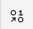

---

copyright:
  years: 2020, 2021
lastupdated: "2021-03-01"

subcollection: assistant

---

{:shortdesc: .shortdesc}
{:new_window: target="_blank"}
{:external: target="_blank" .external}
{:deprecated: .deprecated}
{:important: .important}
{:note: .note}
{:tip: .tip}
{:pre: .pre}
{:preview: .preview}
{:codeblock: .codeblock}
{:screen: .screen}
{:javascript: .ph data-hd-programlang='javascript'}
{:java: .ph data-hd-programlang='java'}
{:python: .ph data-hd-programlang='python'}
{:swift: .ph data-hd-programlang='swift'}
{:table: .aria-labeledby="caption"}

# Adding actions 
{: #actions}

Actions represent the discrete tasks or questions that your assistant is designed to help customers with.
{: shortdesc}

To learn more about the benefits of using an actions skill, [read this blog post on Medium.com](https://medium.com/ibm-watson/why-is-it-still-so-hard-to-build-a-useful-chatbot-daa46da6a00e){: external}.

To start quickly, add simple actions, such as ones that capture questions that require a text response only.

## A simple example
{: #actions-example}

Here's an example. A customer named Sally wants to know your store hours. The action you build so your assistant can help Sally might look like this:

- Training examples

  - Get store hours
  - What are your store hours?
  - What time do you open
  - Can you tell me your weekday hours?
  - when does the store in Boston open tomorrow?
  - What time does your downtown store close?

- Steps

  1.  **Assistant says** *We are open from 9:00 AM until 6:00 PM Monday through Saturday.*

When you are ready to start building a real assistant, you will need to do some prep work first. Spend time researching the most common requests that your customers need help with. Determine which of the requests you want your assistant to handle on behalf of your company. Start small.

## Creating actions
{: #actions-task}

Before you can create actions, you must create an actions skill. For more information, see [Creating an actions skill](/docs/assistant?topic=assistant-skill-actions-add). 

To create actions, complete the following steps:

1.  Open the actions skill, and click **Create a new action**.

1.  In the **Training examples** field, add phrases that your customers might use to articulate this request or question.

    Type a phrase, and then press return to add another phrase. 
    
    Add 10 or more variations of the wording that your customers commonly use. For example:
    
    - `What are your store hours?`
    - `Are you open on the weekend?`
    - `How late are you open today?`
    
    Each phrase can be up to 1,024 characters in length.

    By adding these simple examples, you are building the training data that the machine learning engine of Watson uses to create a natural language processing model for your assistant. The model it builds is customized to understand your uniquely defined actions.
    {: note}

    If you've ever created an intent and added intent user examples in a dialog skill, then this step might feel familiar. An intent is added to the underlying language model based on what you add to this step.
    {:tip}

1.  Click **New step**.

1.  Add the assistant's response in the **Assistant says** field.

    You can add a complete answer to the user's question or ask a follow-up question. Use the text editor tools to apply font styling, such as bold or italic, to the text. 
    
    The text styling is stored in Markdown format. The built-in integrations support Markdown. If you're using a custom client application that does not support Markdown, don't apply text styling to your text responses.
    {: note}

1.  If you ask a follow-up question, define the type of data that you want to collect from customers when they reply. Click **Define customer response**.

    Choose one of the supported data types, and then click **Select**. 
    
    For more information about the supported types, see [Applying reply constraints](#actions-response-types).

    When the customer makes a choice or submits a value, the assistant automatically checks whether the type of data that is submittted is valid. 
    
    The assistant checks whether the customer made a valid choice from the list of options or supplied a number when a number was requested. If not, the assistant lets the customer know, and explains what is expected. You can customize the message that is shown and how many times validation runs by clicking **Edit validation**. For more information, see [Customizing validation](#actions-response-types-validation).
    
    When a customer submits a valid reply, the data that is submitted is saved as a *variable*.

1.  Indicate what you want your assistant to do after this step is completed. At this point, you typically want to continue to the next step.

    What you can do next changes as you add steps to the action. For more information, see [Deciding what to do next](#actions-what-next).

1.  Test the action as you build it. 

    Click **Save** to save your latest changes first. With autosave enabled, many changes are saved automatically. But to be sure that changes you *just* made are applied, save them explicitly.
    {: tip}
    
    Open the Preview pane to submit test input and see how your assistant responds.

    For more information, see [Testing your action](#actions-test).

1.  If the customer's goal is not satistified by this first step, add another one. Click **New step**.

    If you can't see the **New step** button, you might need to minimize the Preview pane.
    {: tip}

    To insert a step between existing steps, select the step immediately before the place where you want to add the step, and then click **New step**. The step is added and the numbers of the following steps are adjusted automatically to account for the inserted step.

1.  **Optional**: If you want a step to be taken only when a requirement that you define is met, add a condition to the step. 

    A condition says, `Take this step only if {some statement} is true.`
    
    For more information, see [Defining step conditions](#actions-conditions).

1.  Continue to add steps until the action is complete.

    As you add steps, you can collect required data from the customer and store it as variables. The stored information can be referenced in later steps. For example, you can check variable values as you add step conditions. And perhaps more importantly, you can reference variables in the response text that you share with the customer or include in follow-up questions.

    By making clear references to information that the customer provided, you personalize the exchange between the assistant and the user. For more information, see [Adding and referencing variables](#actions-variables).

1.  To indicate that an action is complete, in the last step in a particular conversation thread, choose to *end the action* next.

    A single action can have more than one ending step. The number of ending steps depends on how many different threads of conversation (that is, how many different possible paths through the action steps) are needed to handle every supported outcome for the action.

1.  **Optional**: Change the action name.

    The first example message that you add to the action is used as the action name automatically.
    
    Change it to a short, customer-friendly description of what the action does. For example, `Get store hours`, `Open an account`, or `Get a weather forecast`.

    The name can be up to 64 characters in length. A longer example message that is used as the name by default will be truncated to 64 characters.

    In some situations, the action name is shown to customers or service desk personnel to express the purpose of the action. The name can be shown in a disambiguation list or in a chat summary, for example. It is worth taking some time to give the action a name that is concise and accurate. For more information, see [Disambiguation](#actions-disambiguation).
    {: tip}

1.  Click **Save**, and then click **Close**.

    Your action is displayed in the *custom* actions list. Two *system* actions are created for you automatically. To learn more about them, see [System actions explained](#actions-builtin).

1.  Add more actions to your skill to address other customer needs. To add another action, click **New action**.

    If you can't see the **New action** button, you might need to minimize the Preview pane.
    {: tip}

### Deleting a step
{: #actions-step-delete}

To delete a step, complete the following steps:

1.  Open the step that you want to delete.
1.  Click the *Step options* icon , and then choose **Delete step**.

### Applying reply constraints
{: #actions-response-types}

Guide the customer to provide the right type of information by adding a customer response type definition. The following response types are supported:

- **Numbers**: Collects a single numeric value. 

  The customer can specify the number value in either numerals (`100`) or words (`one hundred`). Negative and decimal values are recognized, but percent values (`2%` or `2 percent`) are not. If you expect the user to provide a percent value, add an instruction to ask that percent values be specified in decimals (use `0.02` to specify `2%`).

- **Options**: Presents a set of acceptable answers that customers can choose from.
    
  You can help your assistant recognize variations of an option value that customers might enter. For each option that you add, add synonyms in a comma-separated list.

  For example, you might define the following options:

  <table>
        <caption>Options example</caption>
        <tr>
          <th>Option value</th>
          <th>Synonyms</th>
        </tr>
        <tr>
          <td>Blue</td>
          <td>aqua, turquoise, navy</td>
        </tr>
        <tr>
          <td>Red</td>
          <td>burgundy, crimson, sangria</td>
        </tr>
        <tr>
          <td>Green</td>
          <td>lime, olive, forest</td>
        </tr>
  </table>

  If you've built a dialog skill before, this process might remind you of defining an entity. In fact, an entity is added to the underlying language model based on the options you add.
  {: tip}

  To select an option at run time, users can click an option button or list item, such as *Green*. Or they can type `Green` or one of its synonyms, such as `lime`.

  If your action asks for the same type of data in more than one step, select the **Always ask for this** option in the later step. For example, if Step 3 asks for the shirt color that the customer wants to buy and step 5 asks for the tie color, click **Always ask for this** in Step 5. Otherwise, the color that the customer specifies for the shirt in Step 3 is used automatically for the tie. And who wants to wear the same color shirt and tie together?

  The benefit of choosing not to always ask is that the assistant doesn't ask for information that has already been submitted by the customer. For example, if the original message from the customer is `I want to buy a blue shirt`, your assistant skips Step 3 altogether because it already knows the customer's shirt color preference.

  When you use the built-in integrations, if you define 5 or fewer options, they are displayed as buttons. For more than 5 options, a list is displayed. If you are using a custom client application, you must specify how you want the options to be displayed.

#### Customizing validation
{: #actions-response-types-validation}

When you apply contraints to the ways in which customers can reply, validation occurs automatically. Validation helps customers understand what is expected from them. For example, if the assistant expects a number, and the customer provides a sentence of text with no discernible number in it, you can show a message that explains that the assistant needs a number.

To customize the validation for a step, complete the following steps:

1.  On the customer response tile, click **Edit validation**.
1.  In the **Validation message** field, explain the type of information you want the customer to provide.

    *Please specify a number. You can specify the number with a numeral (2) or with words (two).*
1.  Specify how many times you want to show this same message to the customer in the **Number of tries** field. For example, choose *1* to show the message only once.
1.  In the **Message after last try** field, specify the response you want to show to explain that you can't continue to help them with their task because you don't have the information you need.

    *I'm afraid I don't understand your answer. I can't make a reservation for you without knowing the number of guests. Is there something else I can help you with?*

1.  Click **Apply**.

### Defining step conditions
{: #actions-conditions}

Not every step in an action needs to be shown to customers in every conversational exchange. Step conditions are how you determine whether to include a step in the exchange or not.

For example, imagine that your action is designed to help customers open a bank account. The first step asks customers which type of account they want to open, Checking or Savings. Some subsequent steps are designed to be shown only when the user is opening a savings account, and others only when the user is opening a checking account.

To add a step condition, complete the following steps:

1.  Open the step, and then click **Add a step condition**.

    What you can condition on changes as you add more steps to the action. The most likely information you will want to condition on is shown as a suggestion that you can edit or remove.

    - From the first step, the option to add a condition is not available. The first step is reserved for defining the goal of the action.
    - From the second step, only any session variables that you defined are shown as possible conditions. For more information about session variables, see [Defining session variables](#actions-variables-global).
    - When the action has more than two steps, the possibilities for conditions to add become more varied. They include:
    
      - A variable that is created from data that is saved when the customer replies to an earlier step
      
        For example, maybe step 2 asks `What type of account?` Step 3 can define the response to show when the customer chooses to open a checking account. To start, add the following step condition:

        `What type of account?` `is` `Checking`

        The step response can talk about the requirements for opening a checking account. Then, to handle the case where the customer wants to open a savings account instead, you can add a step 3 with a condition like this:

        `What type of account?` `is` `Savings`

      - A session variable

        For more information, see [Defining session variables](#actions-variables-global).
      - An expression
      
        Use expressions to define more complex conditions. For more information about expressions, see [Defining expressions](#actions-expressions).

1.  To add more than one condition to a step, after adding a condition, click **Add condition**.

    One use case where using more than one condition is helpful is if you need to capture a value range. For example, maybe a requirement of opening a checking account is that the customer deposit at least $100 into the account at creation time. You might ask the customer if they want to transfer funds to the account, and if so, how much? To continue with the transfer, the transfer amount must be $100 or more, but cannot exceed $1000. You can add a step with the following conditions: 

    - `How much to transfer?` `>` `99`
    - `How much to transfer?` `<` `1001`

    Specify whether all or any of the conditions must be met for the step to be included in the conversational flow.

1.  To add more than one group of conditions, after adding one group, click **Add new group**.

    Define one or more conditions in the new group. Each conditional group is numbered. Between each group, choose **and** or **or** to indicate whether the conditions in both conditional groups or only one of them must be met for the step to be included in the conversational flow.

### Adding and referencing variables
{: #actions-variables}

When customers reply to your assistant, they share information about themselves and what they want. Your assistant pays attention and remembers this information by storing the data as *variables*. Your assistant can show that it listens when you reference these variables in subsequent responses.

For each step that collects information from the customer, an action variable is created automatically. Each action variable is named after the step in which the data it stores is collected.

For example, your assistant might ask the customer about her favorite color in step 3 and reference it in step 10, when she's choosing a dress to buy. Step 10 can reference the data that was collected in step 3 by adding a reference to the variable named *3. What's your favorite color?*

We all like considerate people who listen and remember the things we share with them. Why not create an assistant that exhibits this kind of thoughtful behavior?

To reference a variable in a text response:

1.  In the text response field, add the text for the response. 
1.  When the cursor is at the place where you want the assistant to populate the data it saved earlier, add a variable reference. Click the *Insert a variable* icon () or add a dollar sign ($) character to see a list of variables to choose from.
1.  Click a variable to add a reference to it in the text.

### Defining session variables
{: #actions-variables-global}

Session variables are variables that you can set, change, or reference from any step of any action in your skill. All other variables exist for the duration of one action only.

You can use session variables to pass information from:

- an external client application to the actions skill
- one action to another action within the same actions skill
- a dialog skill to an action when the action is called from a dialog node
- an actions skill to a dialog skill as a return variable

To add a session variable, complete the following steps:

1.  Do one of the following things:

    - From within a step, click the *step options*  icon, and then choose **Set variable values**. Click **Set new value**, and then click **New session variable**.

      The option to create a new session variable is only available starting from step 2.
      {: tip}
    - From the main actions skill page, click to open the *Session variables* page. Click **New session variable**. 

      If you can't see the **New session variable** button, you might need to close the Preview pane.
      {: tip} 
1.  Add a name for the session variable.

    As you add the name, an ID is generated for you. Any spaces in the name are replaced with underscores (_) in the ID.
1.  **Optional**: Add a description.
1.  Click **Apply**.
1.  If it's not already set, set the session variable value.

    - Add a step to collect the data that you want to store in the session variable.
    - In a later step, click the *step options*  icon, and then choose **Set variable values**. Click **Set new value**.
    - Choose the session variable name, and then set it to the step variable for the step that collects the data.

      For example, this choice sets the `membership status` session variable value:

      Set `membership status` to `4. Are you a member of our rewards program?`

      Alternatively, you can use an expression to define the session variable value. For more information about expressions, see [Defining expressions](#actions-expressions).

When you reference a session variable elsewhere, such in a step condition expression, you refer to it by its variable ID. For example, to specify the session variable `membership_status` in an expression, use the syntax `${membership_status}`.

A session variable exists for the duration of a single session. A session is what we call an instance of a conversation between the assistant and a customer. Although the value of a session variable value can be accessed from any action in your skill, it must be referenced during the same session or within the inactivity timeout window of the session in which its value is set. When the session or timeout window ends, the session variable is reset to null. For more information about the inactivity timeout window, see [Working with your assistant](/docs/assistant?topic=assistant-assistant-settings#assistant-settings-change-timeout). 

### Defining expressions
{: #actions-expressions}

Use expressions to define values independent of values that are collected in steps or defined in session variables. You can use an expression to define a step condition or to define the value of a session variable.

Use an expression to do simple math equations, for example. Maybe a customer has $200 in a savings account and wants to transfer $150 from it to a new checking account. The funds transfer fee is $3, and the bank charges a fee when a savings account contains less than $50. You can add a step that warns the user that the requested transfer will bring the savings account balance below the $50 minimum and incur a fee. The step conditions on an expression like this:

```
${savings} - (${Step_232} + ${transfer_fee}) < 50
```
{: codeblock}

where:

- `${savings}` represents a session variable that stores the customer's savings account total.
- `${Step_232}` represents the step that asks for the amount the customer wants to transfer.
- `${transfer_fee}` represents a session variable that specifies the fee for a funds transfer. 

In this scenario, the step condition is met, so the step is processed. A message is shown that warns the user that if the transfer is completed, the savings account balance will fall below the $50 minimum and incur the fee.

To use an expression to define a complex step condition:

1.  From the step, click **Add condition**.

    A condition is generated automatically with the most likely choice, which is typically any variables that were set in the previous step.

1.  Click the first segment of the generated condition, and then scroll down and click **Expression**.

1.  Add the expression that you want to use.

To use an expression to define a session variable value:

1.  From the step, click the *step options*  icon, and then choose **Set variable values**. Click **Set new value**.

1.  Choose the session variable that you want to define a value for. 

1.  From the list of sources to derive the value from, click **Expression**.

1.  Add the expression that you want to use.

For a full list of supported expressions, see [Expression language methods](/docs/assistant?topic=assistant-dialog-methods).

The examples in the topic use a slightly different syntax. The variable names are not surrounded by braces (`{}`).
{: note}

### Deciding what to do next
{: #actions-what-next}

For each step, you can define what happens next. The choice you make defines how your customers interact with your assistant at run time. The choices can differ depending on where the current step falls in the order of steps in the action. The following table describes the options that are available.

| Option | Description |
|--------|-------------|
| Connect to agent | Transfers the conversation to a member of your support team. Requires that you have a service desk capability configured from whatever type of integration you use to deploy your assistant. For example, if you deploy your assistant by using the web chat integration, you must have enabled service desk support with Salesforce, Zendesk, or another provider. You can optionally [add messages to show when a transfer occurs](#actions-what-next-haa). |
| Continue to next step | Processes the next step in the steps list. As always, the conditions for the next step are evaluated first to determine whether to show the step's response to the customer. |
| End the action | Indicates that this action is complete. Any variable values that were defined based on choices that the customer made as she stepped through the action are reset. This option can be applied to more than one step in a single action because an action can define more than one branch of a conversation. For example, the open an account action might have one conversational flow for creating a checking account and a separate one for creating a savings account. Each branch might have its own final step. Identifying the final step helps analytical tools that follow a customer's progress through an action to identify the success or failure of the action. |
| Return to step | Processes a step that is listed earlier in the current action. The step might be one that the customer already completed or one that was skipped previously based on its step conditions. Any variable values that were defined based on choices that the customer made in the intervening steps in the action are reset. This option is only available from a step that comes third or later in the steps list. |
| Search for the answer | Finds a useful response from existing help content and knowledge bases that you own. The actions skill calls your search skill, which connects to {{site.data.keyword.discoveryshort}} to perform an AI-driven search of your data. Requires a search skill to be connected to your assistant. For more information about the search skill, see [Creating a search skill](/docs/assistant?topic=assistant-skill-search-add). You can optionally [configure the search](#actions-what-next-search).  |
{: caption="What to do next options" caption-side="top"}

There is no option to skip to a later step. Instead of jumping directly to a later step, control the flow through the intervening steps with step conditions.
{: note}

#### Configuring the search for an answer
{: #actions-what-next-search}

To configure the search that is performed in {{site.data.keyword.discoveryshort}, complete the following steps:

1.  Click **Edit settings**.

1.  Add values to one or both of the following fields:

    - **Custom query**. Add a word or phrase that you want to submit to {{site.data.keyword.discoveryshort}} as the query string for the search.

      For example, you can specify a string such as, `What cities do you fly to?`. 
      
      For a more dynamic string, you can include a variable. For example, `Do you have flights to ${destination}?`
      
      You are effectively defining the value that is used by the {{site.data.keyword.discoveryshort}} API as the `natural_language_query` parameter. For more information, see [Query parameters](/docs/discovery?topic=discovery-query-parameters#nlq){: external}.

      If you don't specify a text string, the action skill sends the most-recently-submitted user message as the search string. 
      
      If you want to use the original customer message that triggered the action as the query string instead, you need to plan ahead. You can follow these steps:
  
      1. Create a session variable to store the initial user input. For example, named `original message`.
      1. In Step 1, meaning the first step after the action trigger, set the value of the session variable. For more information about session variables, see [Defining session variables](#actions-variables-global).
      1. Set the value of the variable by using an expression that looks like this: `<? input.text ?>`. 
  
        This expression captures the complete message that was submitted by the customer. As a result, your variable captures the customer message that triggered this action.
      1. Add the session variable to the *Custom query* field. For example: `${original_message}`

    - **Customer filter**: Add a text string that defines information that must be present in any of the search results that are returned. 
    
      You are effectively defining the value that is used by the {{site.data.keyword.discoveryshort}} API as the `filter` parameter. For more information, see [Query parameters](/docs/discovery?topic=discovery-query-parameters#filter){: external}.

      The syntax to use for the filter value is not intuitive. Here are a few examples of common use cases:

      - To indicate that you want to return only documents with positive sentiment, for example, specify `enriched_text.sentiment.document.label:positive`.

      - To filter results to includes only documents that mention `Boston, MA`, specify `enriched_text.entities.text:"Boston, MA"`.

      - To filter results to includes only documents that mention a city name that you saved in a context variable named `$destination`, you can specify `enriched_text.entities.text:$destination`.

    If you add both a query and a filter value, the filter parameter is applied first to filter the data collection documents and cache the results. The query parameter then ranks the cached results.

1.  If you want the search for an answer to be the last step in the action, select **End the action after returning results**.

1.  Click **Apply**.

#### Adding messages to show when a transfer occurs
{: #actions-what-next-haa}

When you choose the *Connect to agent* option, a settings window is displayed where you can customize messages. Complete the following steps:

1.  Add messages to show to your customers:

    - **Response if agents are online**: Add a message to let customers know that they are being transferred to a human agent. If you know that your support site queue lasts 2 minutes, for example, you might want to warn customers that there could be a 2-minute wait.
    - **Response if agents are offline**: Inform customers that nobody is available to speak to them right now, and, if possible, give them an alternative action to take in the meantime.

    If you're using web chat, the hint text (the grayed-out text that is displayed as the example messages) is used if you don't specify your own messages.

1.  **Optional**: Add a message to show to the agent that the conversation is transferred to:

    - **Message to agent**: Let the human agent know what the assistant was helping the customer with at the time that the transfer occurred. For example, if the current step is part of an action that helps customers open an account, you might add text such as, `The customer needs help with opening an account.`

    Each message can be up to 100 characters in length.
    {: note}

### System actions explained
{: #actions-builtin}

A pair of built-in actions are created for you automatically. Because these actions are built in, they behave slightly differently from the actions that you add yourself. For example, you cannot delete or disable the system actions. However, you can customize the response text that is displayed by these actions or add steps to them to incorporate other interactions.

The following actions are created for you automatically:

- **Greet customer**: Triggered when the assistant starts a conversation with a customer. 

  For example, when the web chat is opened by a customer from their company website, this action defines how the assistant will greet the user. Use this action to define how you want the assistant to introduce itself to the customer and set the tone as it initiates a conversation.

  You might want to add a session variable to the *Greet customers* action response text so you can greet the customer by name.
  {: tip}

  This action is skipped in integrations where the customer starts the conversation with the assistant and not the other way around. For example, in the *Slack* and *Facebook* integrations, the assistant doesn't say anything until a customer addresses the assistant. In the *Web chat* integration, if you choose to add the home screen, then the greeting that is defined in this action is replaced by the greeting you specify for the home screen.
- **Retry when no action matches**: Triggered when a customer's request cannot be satisfied by any of the defined actions.

  For example, your assistant might know how to help with product orders, but not travel plans. If a customer asks for help with travel plans, your assistant must be able to convey that it understands what the customer wants, but that it can't help with that particular task. Ideally, your assistant can direct the customer to other resources that might help with the task, or can explain other tasks it can help with to keep the conversation going and headed in a positive direction.

  If there are common topics that your customers ask about, but that you don't want the assistant to help them with, you can add example messages to the *Additional retry examples* step. Add variations of the wording that customers use to articulate requests or questions that you want your assistant to ignore.

  These examples are stored in the underlying language model as counterexamples.
  {: tip}

To edit a system action, from the *Actions* page, click **System actions**, and then click an action to open it for editing.

## Testing your action
{: #actions-test}

As you make changes, test the action at any time to see whether the resulting interaction works as intended. The Preview pane shows you what customers see if they interact with your assistant through the web chat integration.

1.  Click **Preview**.

    Be sure to save any changes you just made. And make sure the system has finished training on your most recent changes before you start to test the action. If the system is still training, a message is displayed that says so.
    {: note}

1.  In the chat window, type some text and then press Enter.

1.  Check the response to see if your assistant correctly interpreted the input and performed the appropriate step.

    The Preview pane names the action that was recognized in the input.

1.  Continue to converse with your assistant to see how the conversation flows.

    To remove prior test utterances from the chat pane and start over, click the **Clear** link. Not only are the test utterances and responses removed, but this action also clears the values of any variables that were set as a result of your previous interactions.

Queries you submit through the Preview pane generate `/message` API calls, but they are not logged and do not incur charges.

If you add only an actions skill to the assistant, the action skill starts the conversation. If you add both a dialog skill and actions skill to an assistant, the dialog skill starts the conversation. You must add calls from the dialog to actions in the actions skill. Only then can your asssistant understand and respond to requests that are addressed by actions that are defined in the actions skill.
{: important}

You can [call actions in the actions skill from the dialog skill](/docs/assistant?topic=assistant-dialog-call-action). To test how an action behaves when it is called from a dialog skill, test it from the assistant that uses both of the skills together. You cannot recreate the interaction from the Preview pane of the actions skill. First, add the actions and dialog skills to an assistant. Then, you can create a *Preview* integration to test how the two skills interact with one another. Queries you submit through the *Preview* integration do incur charges. For more information about the *Preview* integration, see [Testing your assistant from a web page](/docs/assistant?topic=assistant-deploy-web-link).

## Disambiguation
{: #actions-disambiguation}

Disambiguation occurs when your assistant finds that more than one action can fulfill a customer's request, and asks the customer for clarification. Instead of guessing which action to take, your assistant shows a list of the possible actions to the customer, and asks the customer to pick the right one.


Every action that you add is eligible for disambiguation. The system actions are not.

When an action is displayed in the disambiguation list, it is represented by the text from its name field. If you don't specify a name for an action, the first example message that you add to it is used as the action name automatically.

### Customizing disambiguation
{: #actions-disambiguation-config}

You can control things like the wording your assistant uses to introduce the disambiguation list.

To customize disambiguation, complete the following steps:

1.  From the actions skill main page, click the *Skill settings* icon  in the page header.

1.  You can make the following changes:

    - **Assistant says**: Edit the text that is displayed before the list of disambiguation choices. 
    
      The default text is *Did you mean*. You can change it to something else, such as *What do you want to do?* or *Pick what to do next*.
    - **Label for the fallback choice**: Edit the label that is displayed for the choice that customers can click when none of the other choices are quite right. When a user picks this choice, the *Retry when no intent matches* system action is taken next.
    
      The label *None of the above* is used if you don't change it.  
      
      This fallback choice gives customers a way to get out of the disambiguation process if it's not helping them. If you don't want to give customers a fallback choice, remove the text from the field.

1.  Optionally, review and improve your action names. 

    If an action name is too long or doesn't reflect the purpose of the action, edit it. Use a name that is concise and represents the overall goal of the action.

### Disabling disambiguation
{: #actions-disambiguation-disable}

Every action that you add is used during disambiguation automatically. The system actions are not.

To disable disambiguation for all actions:

1.  From the actions skill main page, click the *Skill settings* icon  in the page header.
1.  Set the disambiguation switch to **Off**.
1.  Click **Save**, and then click **Close**.

To prevent a single action from being used during disambiguation:

1.  From the actions skill main page, look in the *Actions* table for the action that you never want shown as a disambiguation option.
1.  From the action's *Click to view actions* menu , choose **Don't disambiguate**.

    If the action is configured to not be used during disambiguation already, *Disambiguate* is shown in the menu instead. Only click *Disambiguate* if you want the action to be used during disambiguation.

## Action limits
{: #actions-limits}

The number of actions you can create per skill depends on your plan type.

| Plan     | Actions per skill | Steps per skill | Customer says phrases per skill |
|----------|------------------:|----------------:|--------------------------------:|
| Enterprise       |     2,000 |           5,000 |                          25,000 |
| Premium (legacy) |     2,000 |           5,000 |                          25,000 |
| Plus             |     2,000 |           5,000 |                          25,000 |
| Lite, Trial |       100 |           1,000 |                          25,000 |
{: caption="Plan details" caption-side="top"}

The system actions that are created for you automatically do count toward the total.

## What to do next
{: #actions-next-steps}

If you determine that the wrong actions are being triggered, you might need to modify the phrases you included in the *Customer says* field.

If the correct action is being triggered, but the wrong interactions are happening, review the steps that you defined for the action.

If you're ready to publish this set of actions so they can start helping your customers, add the actions skill to an assistant and deploy the assistant. See [Adding integrations](/docs/assistant?topic=assistant-deploy-integration-add).