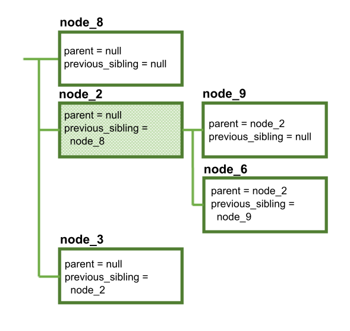

---

copyright:
  years: 2015, 2021
lastupdated: "2020-03-12"

subcollection: assistant


---

{:shortdesc: .shortdesc}
{:new_window: target="_blank"}
{:deprecated: .deprecated}
{:important: .important}
{:note: .note}
{:tip: .tip}
{:pre: .pre}
{:codeblock: .codeblock}
{:screen: .screen}
{:javascript: .ph data-hd-programlang='javascript'}
{:java: .ph data-hd-programlang='java'}
{:python: .ph data-hd-programlang='python'}
{:swift: .ph data-hd-programlang='swift'}

# Modifying a dialog using the API
{: #api-dialog-modify}

The {{site.data.keyword.conversationshort}} REST API supports modifying your dialog programmatically, without using the {{site.data.keyword.conversationshort}} tool. You can use the /dialog_nodes API to create, delete, or modify dialog nodes.

Remember that the dialog is a tree of interconnected nodes, and that it must conform to certain rules in order to be valid. This means that any change you make to a dialog node might have cascading effects on other nodes, or on the structure of your dialog. Before using the /dialog_nodes API to modify your dialog, make sure you understand how your changes will affect the rest of the dialog. You can make a backup copy of the current dialog by exporting the conversational skill in which it resides. See [Downloading a skill](/docs/assistant?topic=assistant-skill-dialog-add#skill-dialog-add-download) for details.

A valid dialog always satisfies the following criteria:

- Each dialog node has a unique ID (the `dialog_node` property).
- A child node is aware of its parent node (the `parent` property). However, a parent node is not aware of its children.
- A node is aware of its immediate previous sibling, if any (the `previous_sibling` property). This means that all siblings that share the same parent form a linked list, with each node pointing to the previous node.
- Only one child of a given parent can be the first sibling (meaning that its `previous_sibling` is null).
- A node cannot point to a previous sibling that is a child of a different parent.
- Two nodes cannot point to the same previous sibling.
- A node can specify another node that is to be executed next (the `next_step` property).
- A node cannot be its own parent or its own sibling.
- A node must have a type property that contains one of the following values. If no type property is specified, then the type is `standard`.

  - `event_handler`: A handler that is defined for a frame node or an individual slot node.

    From the tool, you can define a frame node handler by clicking the **Manage handlers** link from a node with slots. (The tool user interface does not expose the slot-level event handler, but you can define one through the API.)

  - `frame`: A node with one or more child nodes of type `slot`. Any child slot nodes that are required must be filled before the service can exit the frame node.

    The frame node type is represented as a node with slots in the tool. The node that contains the slots is represented as a node of type=`frame`. It is the parent node to each slot, which is represented as a child node of type `slot`.

  - `response_condition`: A conditional response.

    In the tool, you can add one or more conditional responses to a node. Each conditional response that you define is represented in the underlying JSON as an individual node of type=`response_condition`.

  - `slot`: A child node of a node of type `frame`.

    This node type is represented in the tool as being one of multiple slots added to a single node. That single node is represented in the JSON as a parent node of type `frame`.

  - `standard`: A typical dialog node. This is the default type.

- For nodes of type `slot` that have the same parent node, the sibling order (specified by the `previous_sibling` property) reflects the order in which the slots will be processed.
- A node of type `slot` must have a parent node of type `frame`.
- A node of type `frame` must have at least one child node of type `slot`.
- A node of type `response_condition` must have a parent node of type `standard` or `frame`.
- Nodes of type `response_condition` and `event_handler` cannot have children.
- A node of type `event_handler` must also have an `event_name` property that contains one of the following values to identify the type of node event:

  - `filled`: Defines what to do if the user provides a value that meets the condition specified in the *Check for* field of a slot, and the slot is filled in. A handler with this name is only present if a Found condition is defined for the slot.
  - `focus`: Defines the question to show to prompt the user to provide the information needed by the slot. A handler with this name is only present if the slot is required.
  - `generic`: Defines a condition to watch for that can address unrelated questions that users might ask while filling a slot or node with slots.
  - `input`: Updates the message context to include a context variable with the value that is collected from the user to fill the slot. A handler with this name must be present for each slot in the frame node.
  - `nomatch`: Defines what to do if the user's response to the slot prompt does not contain a valid value. A handler with this name is only present if a Not found condition is defined for the slot.

  The following diagram illustrates where in the tool user interface you define the code that is triggered for each named event.

  

- A node of type `event_handler` with an event_name of `generic` can have a parent of type `slot` or `frame`.
- A node of type `event_handler` with an event_name of `focus`, `input`, `filled`, or `nomatch` must have a parent of type `slot`.
- If more than one event_handler with the same event_name is associated with the same parent node, then the order of the siblings reflects the order in which the event handlers will be executed.
- For `event_handler` nodes with the same parent slot node, the order of execution is the same regardless of the placement of the node definitions. The events are triggered in this order by event_name:

  1. focus
  1. input
  1. filled
  1. generic*
  1. nomatch

  *If an `event_handler` with the event_name `generic` is defined for this slot or for the parent frame, then it is executed between the filled and nomatch event_handler nodes.

The following examples show how various modifications might cause cascading changes.

## Creating a node
{: #api-dialog-modify-create-node}

Consider the following simple dialog tree:


We can create a new node by making a POST request to /dialog_nodes with the following body:

```json
{
  "dialog_node": "node_8"
}
```

The dialog now looks like this:


Because **node_8** was created without specifying a value for `parent` or `previous_sibling`, it is now the first node in the dialog. Note that in addition to creating **node_8**, the service also modified **node_1** so that its `previous_sibling` property points to the new node.

You can create a node somewhere else in the dialog by specifying the parent and previous sibling:

```json
{
  "dialog_node": "node_9",
  "parent": "node_2",
  "previous_sibling": "node_5"
}
```

The values you specify for `parent` and `previous_node` must be valid:

- Both values must refer to existing nodes.
- The specified parent must be the same as the parent of the previous sibling (or `null`, if the previous sibling has no parent).
- The parent cannot be a node of type `response_condition` or `event_handler`.

The resulting dialog looks like this:


In addition to creating **node_9**, the service automatically updates the `previous_sibling` property of *node_6* so that it points to the new node.

## Moving a node to a different parent
{: #api-dialog-modify-change-parent}

Let's move **node_5** to a different parent by using the POST /dialog_nodes/node_5 method with the following body:

```json
{
  "parent": "node_1"
}
```

The specified value for `parent` must be valid:
- It must refer to an existing node.
- It must not refer to the node being modified (a node cannot be its own parent).
- It must not refer to a descendant of the node being modified.
- It must not refer to a node of type `response_condition` or `event_handler`.

This results in the following changed structure:


Several things have happened here:
- When **node_5** moved to its new parent, **node_7** went with it (because the `parent` value for **node_7** did not change). When you move a node, all descendants of that node stay with it.
- Because we did not specify a `previous_sibling` value for **node_5**, it is now the first sibling under **node_1**.
- The `previous_sibling` property of **node_4** was updated to `node_5`.
- The `previous_sibling` property of **node_9** was updated to `null`, because it is now the first sibling under **node_2**.

## Resequencing siblings
{: #api-dialog-modify-change-sibling}

Now let's make **node_5** the second sibling instead of the first. We can do this by using the POST /dialog_nodes/node_5 method with the following body:

```json
{
  "previous_sibling": "node_4"
}
```

When you modify `previous_sibling`, the new value must be valid:
- It must refer to an existing node
- It must not refer to the node being modified (a node cannot be its own sibling)
- It must refer to a child of the same parent (all siblings must have the same parent)

The structure changes as follows:


Note that once again, **node_7** stays with its parent. In addition, **node_4** is modified so that its `previous_sibling` is `null`, because it is now the first sibling.

## Deleting a node
{: #api-dialog-modify-delete-node}

Now let's delete **node_1**, using the DELETE /dialog_nodes/node_1 method.

The result is this:



Note that **node_1**, **node_4**, **node_5**, and **node_7** were all deleted. When you delete a node, all descendants of that node are deleted as well. Therefore, if you delete a root node, you are actually deleting an entire branch of the dialog tree. Any other references to the deleted node (such as `next_step` references) are changed to `null`.

In addition, **node_2** is updated to point to **node_8** as its new previous sibling.

## Renaming a node
{: #api-dialog-modify-rename-node}

Finally, let's rename **node_2** using the POST /dialog_nodes/node_2 method with the following body:

```json
{
  "dialog_node": "node_X"
}
```


The structure of the dialog has not changed, but once again multiple nodes were modified to reflect the changed name:

- The `parent` properties of **node_9** and **node_6**
- The `previous_sibling` property of **node_3**

Any other references to the deleted node (such as `next_step` references) are also changed.