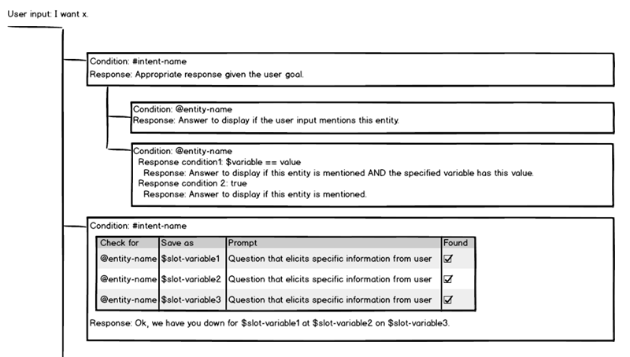
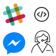

---

copyright:
  years: 2015, 2019
lastupdated: "2019-02-15"

---

{:shortdesc: .shortdesc}
{:new_window: target="_blank"}
{:deprecated: .deprecated}
{:important: .important}
{:note: .note}
{:tip: .tip}
{:pre: .pre}
{:codeblock: .codeblock}
{:screen: .screen}
{:javascript: .ph data-hd-programlang='javascript'}
{:java: .ph data-hd-programlang='java'}
{:python: .ph data-hd-programlang='python'}
{:swift: .ph data-hd-programlang='swift'}

# Assistants
{: #assistants}

An assistant is a cognitive bot that you can customize for your business needs, and deploy across multiple channels to bring help to your customers where and when they need it.
{: shortdesc}

  You customize the assistant by adding to it the skills it needs to satisfy your customers' goals.

Add a dialog skill that can understand and address questions or requests that your customers typically need help with. You provide information about the subjects or tasks your users ask about, and how they ask about them, and the service dynamically builds a machine learning model that is tailored to understand the same and similar user requests.

| Dialog tree | Graphical user interface |
|-------------|-------------------------:|
| You can use graphical tools to create a dialog for your assistant to read from when interacting with your users, a dialog that simulates a real conversation. The dialog keys off the common customer goals that you teach it to recognize, and provides useful responses. The types of responses you can provide range from returning a simple text response, to including an image, or showing a list of options the user can choose from. The dialog can even make programmatic calls that perform business transactions on the user's behalf. |  |

The dialog skill itself is defined in text, but you can integrate it with Watson Speech to Text and Watson Text to Speech services that enable users to interact with your assistant verbally. In fact, you can put all of the Watson services to work. For example, integrate your assistant with the Watson Tone Analyzer service to monitor the customer's level of satisfation during the conversational exchange, and change its responses accordingly.

  If you want to get started quickly, add prebuilt training data to your dialog skill so your assistant can start helping your customers with the basics. 

  The assistant is a fully hosted bot that is managed by {{site.data.keyword.cloud_notm}}, which means you do not need to worry about setting up or maintaining infrastructure to support it. The assistant also manages the state of the conversation. It passes contextual information from one dialog turn to the next, so you don't have to manage it yourself.

| Integrations       | Channels  |
|--------------------|:----------|
| You can deploy the assistant through multiple interfaces, including existing messaging channels, such as Slack and Facebook Messenger, in just a few steps. Or, if you want to design a custom application that incorporates it, you can make direct calls to the underlying APIs to do so. |  |

See [Creating assistants](/docs/services/assistant/assistant-add.html) to get started.