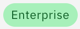

---

copyright:
  years: 2020, 2021
lastupdated: "2021-03-31"

subcollection: assistant

---

{:shortdesc: .shortdesc}
{:new_window: target="_blank"}
{:external: target="_blank" .external}
{:deprecated: .deprecated}
{:important: .important}
{:note: .note}
{:tip: .tip}
{:pre: .pre}
{:codeblock: .codeblock}
{:screen: .screen}
{:javascript: .ph data-hd-programlang='javascript'}
{:java: .ph data-hd-programlang='java'}
{:python: .ph data-hd-programlang='python'}
{:swift: .ph data-hd-programlang='swift'}

# Activity Tracker events
{: #at-events}

As a security officer, auditor, or manager, you can use the Activity Tracker service to track how users and applications interact with {{site.data.keyword.conversationfull}} in {{site.data.keyword.cloud}}.
{: shortdesc}

{{site.data.keyword.at_full_notm}} records user-initiated activities that change the state of a service in {{site.data.keyword.cloud_notm}}. You can use this service to investigate abnormal activity and critical actions and to comply with regulatory audit requirements. In addition, you can be alerted about actions as they happen. The events that are collected comply with the Cloud Auditing Data Federation (CADF) standard. For more information, see the getting started tutorial for [{{site.data.keyword.at_full_notm}}](/docs/Activity-Tracker-with-LogDNA?topic=Activity-Tracker-with-LogDNA-getting-started){: external}.

 This feature is available to Enterprise plan users only.

## List of events
{: #at-events-actions}

The following table lists the {{site.data.keyword.conversationshort}} actions that generate events.

| Action                                          | Triggered when someone...       |
|-------------------------------------------------|---------------------------------|
| `conversation.assistant.create` | creates an assistant. |
| `conversation.assistant.delete` | deletes an assistant. |
| `conversation.assistant.update` | updates an assistant. For example, renames the skill, changes the session timeout, or changes its associated skills. |
| `conversation.counterexample.create` | marks test user input in the "Try it out" pane as being irrelevant or corrects the categorization of a user input that was incorrectly assigned to an intent by marking it as irrelevant. |
| `conversation.counterexample.delete` | deletes a counterexample. |
| `conversation.counterexample.update` | edits a counterexample. |
| `conversation.data.update` | does a bulk action, such as importing a CSV file of intents or entities to the skill, or deleting multiple training data items, such as multiple entities or intents. |
| `conversation.entity.create` | creates an entity. |
| `conversation.entity.delete` | deletes an entity. |
| `conversation.entity.update` | edits an entity. |
| `conversation.example.create` | adds a user input example to an intent. |
| `conversation.example.delete` | deletes a user example from an intent. |
| `conversation.example.update` | edits a user example that is associated with an intent. |
| `conversation.intent.create` | creates an intent. |
| `conversation.intent.delete` | deletes an intent. |
| `conversation.intent.update` | edits an intent. |
| `conversation.log.create` | corrects an intent that was inaccurately categorized by the skill from the Analytics>User conversations page. |
| `conversation.node.create` | creates a dialog node. |
| `conversation.node.delete` | deletes a dialog node. |
| `conversation.node.update` | edits a dialog node. |
| `conversation.recommendationfile.create` | uploads a CSV file of utterances to a skill from which Watson can derive intent recommendations. |
| `conversation.recommendationfile.delete` | deletes a CSV file of utterances that is used to derive intent recommendations from a skill.  |
| `conversation.recommendationsources.update` | updates a CSV file or assistant log that is being used as the source for intent recommendations. |
| `conversation.seedlog.create` | uploads a CSV file of utterances to a service instance so that skills in the instance can derive intent recommendations from it. |
| `conversation.seedlog.delete` | deletes all of the CSV files that are used to derive intent recommendations from a service instance. |
| `conversation.skill.create` | creates a skill, either dialog or search. |
| `conversation.skill.delete` | deletes a skill. |
| `conversation.skill.update` | updates a skill. |
| `conversation.skill_reference.create` | adds a specific skill to an assistant. |
| `conversation.skill_reference.delete` | removes a specific skill from an assistant. |
| `conversation.skill_reference.update` | updates a specific skill that is associated with an assistant. |
| `conversation.snapshot.create` | creates a version of a dialog skill. |
| `conversation.snapshot.delete` | deletes a version of a dialog skill. |
| `conversation.synonym.create` | creates a synonym for an entity value. |
| `conversation.synonym.delete` | deletes a synonym that is associated with an entity value. |
| `conversation.synonym.update` | edits a synonym that is associated with an entity value. |
| `conversation.userdata.delete` | deletes data that was created by a specified customer. |
| `conversation.value.create` | creates an entity value. |
| `conversation.value.delete` | deletes an entity value. |
| `conversation.value.update` | edits an entity value. |
| `conversation.workspace.create` | creates a workspace. |
| `conversation.workspace.delete` | deletes a workspace. |
| `conversation.workspace.update` | makes changes to a workspace. |
{: caption="Table 1. Actions that generate events" caption-side="top"}

## Viewing events
{: #at-events-ui}

Events that are generated by an instance of the {{site.data.keyword.conversationshort}} service are automatically forwarded to the {{site.data.keyword.at_full_notm}} service instance that is available in the same location. However, if your service instance is hosted in the **Washington DC** location, create the {{site.data.keyword.at_full_notm}} service intance in the **Dallas** region.

{{site.data.keyword.at_full_notm}} can have only one instance per location. To view events, you must access the web UI of the {{site.data.keyword.at_full_notm}} service in the same location where your service instance is available. For more information, see [Navigating to the UI](/docs/activity-tracker?topic=activity-tracker-launch){: external}.
