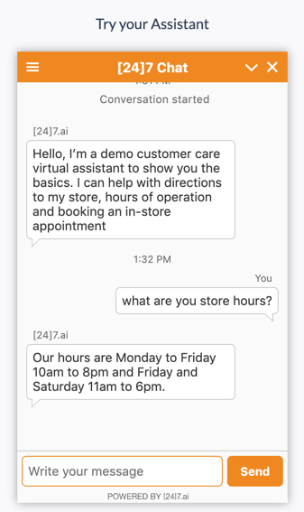

---

copyright:
  years: 2015, 2019
lastupdated: "2019-09-20"

subcollection: assistant

---

{:shortdesc: .shortdesc}
{:new_window: target="_blank"}
{:external: target="_blank" .external}
{:deprecated: .deprecated}
{:important: .important}
{:note: .note}
{:tip: .tip}
{:preview: .preview}
{:pre: .pre}
{:codeblock: .codeblock}
{:screen: .screen}
{:javascript: .ph data-hd-programlang='javascript'}
{:java: .ph data-hd-programlang='java'}
{:python: .ph data-hd-programlang='python'}
{:swift: .ph data-hd-programlang='swift'}

# Testing a [24]7.ai chatbot integration 
{: #deploy-247ai}

\[24\]7.ai is redefining the way companies interact with consumers. \[24\]7.ai helps businesses attract and retain customers, and makes it possible to create a personalized, predictive and effortless customer experience.
{: shortdesc}

\[24\]7.ai has partnered with IBM to expedite the process of getting your assistant published as a \[24\]7.ai chatbot.

<!--This test integration is available only to Plus or Premium plan users.
{: note}-->

This feature is available for use by participants in the early access program only. To find out how to request access, see [Participate in the early access program](/docs/services/assistant?topic=assistant-feedback#feedback-beta).
{: preview}

When you participate in the early access program, IBM gives you early access to features for your evaluation. These features are classified as beta, which means they might be unstable, might change frequently, and might be discontinued with short notice. Beta features also might not provide the same level of performance or compatibility that generally available features provide and are not intended for use in a production environment. Beta features are supported only on the [IBM Developer Answers](https://developer.ibm.com/answers/topics/watson-assistant/){: external}.

For example, your deployed assistant might look like this:

After you test the integration, you can contact \[24\]7.ai to discuss the next steps for purchasing a \[24\]7.ai service desk subscription and using your assistant as the \[24\]7.ai chatbot.

As with any beta feature, do not use this feature in production. This integration approach is still in active development and is subject to change or withdrawal without notice. 
{: important}

## Preparing the dialog
{: #deploy-247ai-dialog-prereq}

1.  If you do not have a dialog skill associated with your assistant, create one or add one to your assistant now.

    See [Building a dialog](/docs/services/assistant?topic=assistant-dialog-build) for more details.

    Triggering a search through a search skill is not currently supported in this integration.
    {: note}

1.  Some rich responses in the dialog are displayed differently in the "Try it out" pane from how they are displayed in the \[24\]7.ai chatbot. See [Rich responses](/docs/services/assistant?topic=assistant-dialog-overview#dialog-overview-multimedia) for more information about response types.

The following table describes how the response types are rendered by the \[24\]7.ai chatbot.

| Response type | How displayed to Intercom users  |
|---------------|---------------------------|
| **Image** | The image is rendered, but the **title** and **description** are not. |
| **Option** | Options are displayed as buttons that are positioned horizontally. The **description** field is not rendered.
- In the **title** field, provide instructions that explain to the user how to choose an option from the list. 
- Do not position any additional response types after an option response type in a node response or the option buttons will not be rendered.
- Do not configure the node where you use the option response type to jump to another node either. |
| **Pause** | Pauses are not rendered. |
| **Text** | Text that is written in markdown or HTML syntax is not rendered correctly, and the multiline setting is ignored. |
{: caption="Table 1. Rich response type behavior" caption-side="top"}

## Adding a [24]7.ai test integration
{: #deploy-247ai-add-intercom}

1.  From the Assistants tab, click to open the assistant that you want to integrate with a \[24\]7.ai chatbot for testing purposes.

1.  From the Integrations section, click **Add integration**.

1.  Click **[24]7.ai**.

    Follow the on-screen instructions.

    - The service password that is added to the credential code block automatically is the API key from the service credential for your service instance. If there is more than one code block, it means your service instance has more than one credential associated with it. Choose one of them to copy.
    - Providing your email address in Step 2 is optional.

1.  Test your assistant integration from the \[24\]7.ai chatbot.

    To restart a session, click **Reset**. Or click **X** to end the chat, and then start a new one.

1.  Close the \[24\]7.ai web page when you are done testing the chat bot.

1.  Click **X** to close the \[24\]7.ai integration page. Your changes are saved automatically.

To return to the \[24\]7.ai chat bot web page after making changes to your assistant, go back to the \[24\]7.ai integration page and click the URL to open the chat bot in your web browser.
