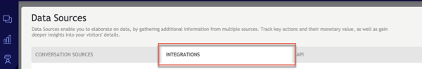
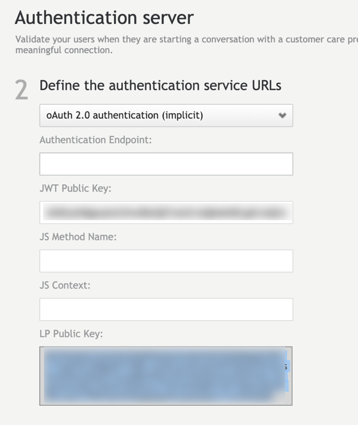
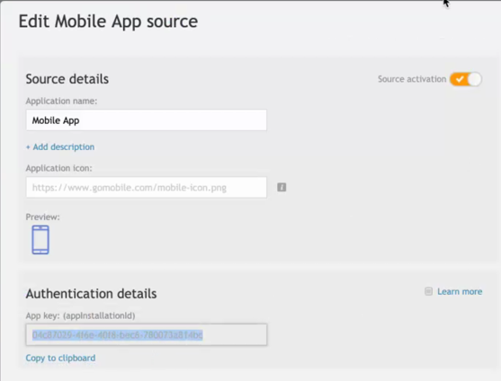
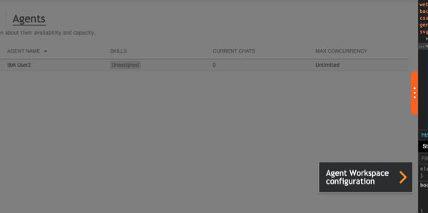
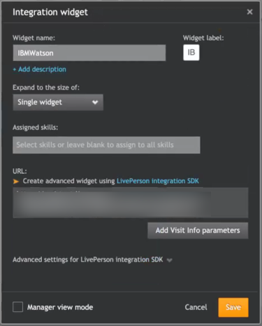

---

copyright:
  years: 2015, 2020
lastupdated: "2020-01-06"

subcollection: assistant

---

{:shortdesc: .shortdesc}
{:new_window: target="_blank"}
{:external: target="_blank" .external}
{:deprecated: .deprecated}
{:important: .important}
{:note: .note}
{:tip: .tip}
{:preview: .preview}
{:pre: .pre}
{:codeblock: .codeblock}
{:screen: .screen}
{:javascript: .ph data-hd-programlang='javascript'}
{:java: .ph data-hd-programlang='java'}
{:python: .ph data-hd-programlang='python'}
{:swift: .ph data-hd-programlang='swift'}

# Beta: Integrating with your own website
{: #beta-deploy-web-chat}

Add your assistant to your company website as a web chat widget that can transfer customers to human agents.
{: shortdesc}

This feature is available for use by participants in the early access program only. To find out how to request access, see [Participate in the early access program](/docs/services/assistant?topic=assistant-feedback#feedback-beta).
{: preview}

When you participate in the early access program, IBM gives you early access to features for your evaluation. These features are classified as beta, which means they might be unstable, might change frequently, and might be discontinued with short notice. Beta features also might not provide the same level of performance or compatibility that generally available features provide and are not intended for use in a production environment. Beta features are supported only on the [IBM Developer Answers](https://developer.ibm.com/answers/topics/watson-assistant/){: external}.

When you create a web chat integration, code is generated that calls a script written in JavaScript. The script instantiates a unique instance of your assistant. You can then copy and paste the HTML `<script>` element into any page or pages on your website where you want users to be able to ask your assistant for help.

 This feature is available to Plus or Premium plan users only.

## Create a web chat instance to add to your website
{: #beta-deploy-web-chat-task}

To add the assistant to a web page on your company website, complete the following steps:

1.  From the Assistants tab, click to open the assistant tile that you want to deply to your site.

1.  From the *Integrations* section, click the **Web Chat** tile.

1.  **Optional**: Change the web chat integration name from *Web Chat* to something more descriptive.

1.  Click **Create** to generate the script.

    A code snippet is created and added to the bottom of the page that contains an HTML `<script>` element. The script tag calls JavaScript code that is hosted on an IBM site. The code instantiates an instance of your assistant within a web chat widget. The generated code includes a region and unique integration ID. Do not change these parameter values.

1.  **Optional**: Customize the chat. You can make the following changes:

    - **Public assistant name**. Name by which the assistant is known to users. This name is displayed in the header of the chat window. 
    - **Font family**. List one or more font styles that you want applied to the text that is displayed in the chat window. Separate multiple font names with commas. The first font family in the list is used unless the web page does not support it, in which case the next font family in the list is used. Surround font family names that include spaces with single quotation marks. For example, `Georgia,'Helvetica Neue'`. 
    
      If you don't specify a font, these fonts are used: `IBMPlexSans, Arial, Helvetica, sans-serif`. 

    - **Accent color**. Click the blue dot to open a color switcher where you can choose a color. The color is saved as a HTML color code, such as `#FF33FC` for pink and `#329A1D` for green. Alternatively, you can add a HTML color code directly to the field to set the color.
    
    The color you specify is applied to the following elements:

      - Chat launcher button that is embedded in your web page
      - Send button associated with the input text field
      - Input text field border when in focus
      - Marker that shows the start of the assistant’s response
      - Border of a button after it is clicked
      - Typing indicator that is shown to repesent a pause response
      - Active state for dropdown color of border

    Style changes you make are immediately applied to the preview that is shown on the page, so you can see how your choices impact the style of the chat UI.

    When you are happy with the style, click **Save changes**.

1.  Copy the `<script>` HTML element.

1.  Open the HTML source for a web page on your website where you want the chat window to be displayed. Paste the code snippet into the page.

    Paste the code as close to the closing `</body>` tag as possible to ensure that your page renders faster.
    {: tip}

    The following HTML snippet is the source for a test page that you can copy and save as a file with a .html extension for testing purposes. You would replace the script element block here with the script elements you copied from the Web Chat integration setup page.

    ```html
    <html>
    <head></head>
    <body>
        <title>My Test Page</title>
        <p>The body of my page.</p>
        <!-- copied script elements -->
        </body>
    </html>
    ```
    {: codeblock}

1.  Refresh the web page.

     
    
    The web chat icon is displayed at the end of the page. Its placement is always the same regardless of where you paste the script element into the web page source. The chat launcher icon is blue unless you customize the accent color.
    {: important}

1.  Click the icon to open the chat window and talk to your assistant.

    

1.  Paste the code snippet into each web page where you want the assistant to be available to your customers.

    You can paste the same script tag into as many pages on your website as you want. Add it anywhere where you want users to be able to reach your assistant for help. However, be sure to add it only one time per page.
    {: tip}

1.  Submit test utterances from the chat widget that is displayed on your web page to see how the assistant responds.

    No responses are returned until after you create a dialog skill and add it to the assistant.
    {: note}

    If you don't extend the session timeout setting for the assistant, the dialog flow for the current session is restarted after 60 minutes of inactivity. This means that if a user stops interacting with the assistant, after 60 minutes, any context variable values that were set during the previous conversation are set to null or back to their initial values.

1.  Click **Save changes** to save the web chat name and any customization information that you added and close the integration page. Alternatively, you can click the **X** to close the page. 

    The web chat integration instance is created as soon as you click the *Create* button, and does not need to be saved.

## Dialog considerations
{: #beta-deploy-web-chat-dialog}

The rich responses that you add to a dialog are displayed in the web chat widget as expected, with the following exception:

- **Pause**: This response type pauses the assistant's activity in the chat widget. However, activity does not resume after the pause until another response is triggered. Whenever you include a `pause` response type, add another response type, such as `text`, after it.

See [Rich responses](/docs/services/assistant?topic=assistant-dialog-overview#dialog-overview-multimedia) for more information about response types.

## Extending the web chat
{: #deploy-web-chat-extend}

You can make more advanced customizations and extend the capability of the web chat by using the {site.data.keyword.conversationshort}} Web Chat toolkit on [GitHub](https://github.com/watson-developer-cloud/assistant-web-chat){: external}.

If you choose to use the provided methods, you implement them by editing the code snippet that was generated earlier. You then embed the updated code snippet into your web page.

### Setting and passing context variable values
{: #beta-deploy-web-chat-set-context}

For example, the following updated script preserves the context for the conversation. In addition, it adds an `$ismember` context variable and sets it to `true`.

```html
<script src="https://assistant-web.watsonplatform.net/loadWatsonAssistantChat.js"></script>
<script>
  // Following the v2 message API, we add some items to context.
  function preSendhandler(event) {
    event.data.context = event.data.context || {};
    event.data.context.skills = event.data.context.skills || {};
    event.data.context.skills['main skill'] = event.data.context.skills.main_skill || {};
    event.data.context.skills['main skill'].user_defined = event.data.context.skills['main skill'].user_defined || {};
    event.data.context.skills['main skill'].user_defined.ismember = true;
  }
</script>
<script>
  window.loadWatsonAssistantChat({
    integrationID: '{INTEGRATION ID}',
    region: '{REGION}'
  }).then(function(instance){
    // When this promise returns, we know WatsonAssistantChat is ready.
    instance.on({ type: "pre:send", handler: preSendhandler });
    instance.render();
  });
</script>
```
{: codeblock}

You can reference the `$ismember` context variable from your dialog. For example, the following screen shot shows a dialog node that conditions on #General_Greetings. It has multiple conditioned responses. The first response checks whether the current user is a member of your Rewards Program by checking for the presence of the `$ismember` context variable. If the variable is present, the response addresses the user as a member. The next response has a more generic greeting.


### Adding user identity information
{: beta-deploy-web-chat-userid}

If you want to perform tasks that require you to know the user who submitted the user input, then you must pass the user ID to the web chat integration. Such tasks include the following:

- User-based service plans use the `user_id` associated with user input for billing purposes. See [User-based plans](/docs/services/assistant?topic=assistant-services-information#services-information-user-based-plans). 
- The ability to delete any data created by someone who requests to be forgotten requires that a `customer_id` be associated with the user input. When a `user_id` is defined, the product can reuse it to pass a `customer_id` parameter. See [Labeling and deleting data](/docs/services/assistant?topic=assistant-information-security#information-security-gdpr-wa).

To support these user-based capabilities, you must add the `options.userID` method to the codeblock before you paste it into your web page.

In the following example, the user ID `L44556677` is added to the script codeblock.

```html
<script src="https://assistant-web.watsonplatform.net/loadWatsonAssistantChat.js"></script>
<script>
  window.loadWatsonAssistantChat({
    integrationID: '{INTEGRATION ID}',
    region: '{REGION}',
    userID: `L44556677`
  }).then(function(instance){
    // When this promise returns, we know WatsonAssistantChat is ready.
    instance.on({ type: "pre:send", handler: preSendhandler });
    instance.render();
  });
</script>
```
{: codeblock}

## Adding support for transfers
{: #deploy-web-chat-haa}

Delight your customers with 360-degree support by integrating your web chat with a third-party service desk solution. 

The following service desk offerings are supported:

- [LiveEngage](#deploy-web-chat-liveperson)
<!-- [Salesforce](#deploy-web-chat-salesforce)-->
- [Zendesk](#deploy-web-chat-zendesk)

After you set up the service desk integration, you must update your dialog to ensure it understands user requests to speak to someone, and can transfer the conversation properly. See [Adding transfer support to your dialog](#deploy-web-chat-dialog-prereq).

### Setting up a LiveEngage integration
{: #deploy-web-chat-liveperson}

LiveEngage is an enterprise-class platform that empowers consumers to stop wasting time on hold with 1-800 numbers and, instead, message their favorite brands just as they do with friends and family. To learn more about this service desk solution, see the [LiveEngage website](https://www.liveperson.com/){: external}.

1.  If you don't have a LiveEngage account, contact a LiveEngage sales associate to create one.
1.  Create at least one campaign.

    A *campaign* is basically the name that LiveEngage uses for a project or workspace where you configure your service desk solution.

    - You must know the account number that is associated with your LiveEngage compaign. 
    - You must have administrative access to the account that you connect to the web chat.

    It might take up to 24 hours before your campaign is available. The JWT key that you need to copy later in this procedure cannot be generated until after the creation of the account and campaign is finished.
    {: important}

1.  From the Web Chat integration page in {{site.data.keyword.conversationshort}}, switch the **Allow transfers to live agents** toggle to **On**, and then choose **LiveEngage** as the service desk type, and then click **Set up**.

1.  Enter the account number that is associated with your campaign, and then click **Access account**.

1.  {: #deploy-web-chat-lp-authenticate}Set up authentication for chat transfers.

    When your assistant sends a transfer request to LiveEngage, it must prove to LiveEngage that the request is legitimate. To do so, add the JSON web token (JWT) of your assistant into the LiveEngage authentication server configuration.

    - Copy the JWT key from the Web Chat setup page.
    - Log into LiveEngage as an administrator of your campaign, and navigate to *Campaigns*.
    - Click *Data Sources* from the footnote.

      
    - Click the *Integrations* tab.

      
    - Navigate to *Authentication Server > Configure*. 
    - In the authentication server configuration page, choose *oAuth 2.0 authentication (implicit)*.
    - In the *JWT Public Key* field, paste the assistant's token that you copied earlier.

      

      For more details, see the [Authentication LiveEngage tutorial](https://developers.liveperson.com/messaging-window-api-tutorials-authentication.html){: external}.
    - Click *Save*.

1.  {: #deploy-web-chat-lp-mobile-app}Add an application to LiveEngage through which your assistant will interact with service desk personnel.

    The service desk agent interacts with your assistant through a Mobile App application that runs in LiveEngage. You must prove to {{site.data.keyword.conversationshort}} that calls from this LiveEngage mobile app are legitimate. To do so, add the App key (appinstallationId) for the LiveEngage mobile app to the Web Chat setup page in {{site.data.keyword.conversationshort}}.

    If you want to activate unauthenticated engagement attributes (Standard Data Entities or SDEs) in the Site Settings for your account, contact your LivePerson support team and ask them to enable it.
    {: note}

    - Make sure the following features are enabled on your LiveEngage account:
    
      - Messaging
      - Authenticated chat
    - Configure the Mobile App data source in LiveEngage.

      - In LiveEngage, go to Campaigns > Data Sources > Conversation sources tab. 
      - Click *Connect* on the *Mobile App* tile. 
    - From the Edit Mobile App Source configuration page, add details about your Web app, and then click *Create*.
    - Copy the *App key* value that is generated for the app.

      
    - Paste the key into the **LiveEngage App key** field of the Web Chat setup page.

    - Add a Mobile App engagement to your campaign.

      From the campaign page in LiveEngage, click *Add engagement*, and then choose *Mobile App*.

    - If messaging is not enabled, work with the LiveEngage team to add messaging support to the mobile app.

    For more details, see the [Monitoring API LiveEngage documentation](https://developers.liveperson.com/monitoring-api-getting-started.html){: external}.

1.  {: #deploy-web-chat-lp-wa-widget}Enable the assistant to share the chat history with service desk personnel.

    When a customer asks to speak to a person, your assistant will transfer the in-progress conversation and a chat summary to a LiveEngage agent. To enable the service desk agent to get a quick view of the chat history between the visitor and the assistant, add the Watson Assistant integration widget to LiveEngage.

    - From the Web Chat setup configuration page, copy the **Integration widget URL**.
    - From the Visitors screen in LiveEngage, click the *Night Vision* button. 

      
    
      Overlay panels are displayed on the page. Use these modals to choose the features you want to configure.
    - Click *Agent Workspace configuration*.

      
    - Look for *Edit Widgets*, and then click the + icon to open the Integration widget.
    - Enter the name of the widget, such as **Watson Assistant**.  
    
      The widget icon is automatically generated and displays the initials of the name you’ve chosen, such as WA.
    - In the *URL* field, paste the URL that you copied in the first step of this procedure.
    - Click *Save*.

      

    From now on, when a LiveEngage agent interacts with your assistant, the widget will be displayed on the page.

    For more details, see the [Adding agent widgets LiveEngage documentation](https://developers.liveperson.com/add-agent-widgets-add-your-own-widgets-to-the-agent-workspace.html){: external}.

<!-- ### Setting up a Salesforce integration
{: #deploy-web-chat-salesforce}-->

### Setting up a Zendesk integration
{: #deploy-web-chat-zendesk}

Zendesk Chat lets you help customers in real time, which increases customer satisfaction. And satisfied customers are happier customers. To learn more about this service desk solution, see the [Zendesk website](https://www.zendesk.com/chat/){: external}.

Zendesk Chat is an add-on to Zendesk Support. Zendesk Support puts all your customer support interactions in one place, so communication is seamless, personal, and efficient, which means more productive agents and satisfied customers.

1.  You must have a Zendesk account. If not, create one. 

    An Enterprise or Chat Professional plan is recommended.

1.  From the Web Chat integration page in {{site.data.keyword.conversationshort}}, switch the **Allow transfers to live agents** toggle to **On**, and then choose **Zendesk** as the service desk type, and then click **Set up**.
1.  Add the account key for your Zendesk account. To get the account key for your Zendesk account, follow these steps:

    - Log in to your Zendesk subdomain.
    
    - Open the Zendesk Chat Dashboard.

       From the Zendesk Support dashboard, you can click the Chat icon in the header, and then click *Chat dashboard*.

       
    
    - Click your profile, and then click *Check Connection*.

       

    - Copy the account key value.

       

    - Paste the key into the field, and then click **Access account**.

1.  Install the {{site.data.keyword.conversationshort}} private application in your Zendesk Chat subdomain.

    When you create a Zendesk Chat account, you specify a subdomain. Afterwards, your Zendesk console is available from a URL with the syntax: `<subdomain>.zendesk.com`. For example: `ibm.zendesk.com`
    
    IBM provides an application that you can install in your Zendesk Chat domain to enable your human agents to communicate directly with your assistant.

    - Download the private application from the Zendesk Chat setup page in {{site.data.keyword.conversationshort}}.

    - Copy the credentials that are generated for you in the **Private app credentials** field. You will need them in a later step.

    - Log in to Zendesk with a user ID that has Administrative priviledges.

    - Install the private application to your Zendesk Chat subdomain as a new private app. When credentials are requested, paste the private app credentials that you copied earlier.

    For more details, see [Uploading and installing a private app in Zendesk Chat](https://develop.zendesk.com/hc/en-us/articles/360001069347-Uploading-and-installing-a-private-app){: external}.

1.  Click **Save** to finish setting up the connection to the Zendesk Chat service desk.

## Adding transfer support to your dialog
{: #deploy-web-chat-dialog-prereq}

If you do not have a dialog skill associated with your assistant, create one or add one to your assistant now. See [Building a dialog](/docs/services/assistant?topic=assistant-dialog-build) for more details.

Complete these steps in your dialog skill so the assistant can pass the conversation to a service desk agent when a customer asks to speak to a person.

1.  Add an intent to your skill that can recognize a user's request to speak to a human.

    You can create your own intent or add the prebuilt intent named `#General_Connect_to_Agent` that is provided with the **General** content catalog developed by IBM.

1.  Add a root node to your dialog that conditions on the intent that you created in the previous step. Choose **Connect to human agent** as the response type.

1.  To ensure that a useful summary is provided to service desk agents when a conversation is transferred to them, fill in the **external node name** field of the root node of each dialog branch.

      

      Every dialog branch can be processed by the assistant while it chats with a customer, including branches with root nodes in folders. Add a summary of the purpose of the dialog branch to the root node of each branch. For example, *Find a store*.

1.  If a child node in any dialog branch conditions on a follow-up request or question that you do not want the assistant to handle, add a **Connect to human agent** response type to the node.

    For example, you might want to add this response type to nodes that cover sensitive issues only a human should handle or that track when an assistant repeatedly fails to understand a user.

    At run time, if the conversation reaches this child node, the dialog is passed to a human agent at that point.

Your dialog is now ready to support transfers from your assistant to service desk agents.
