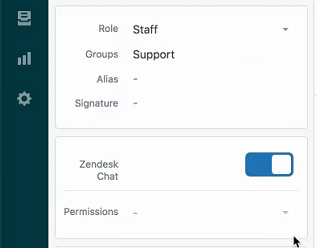
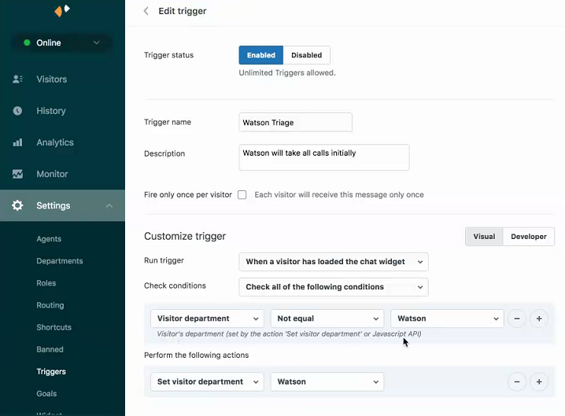
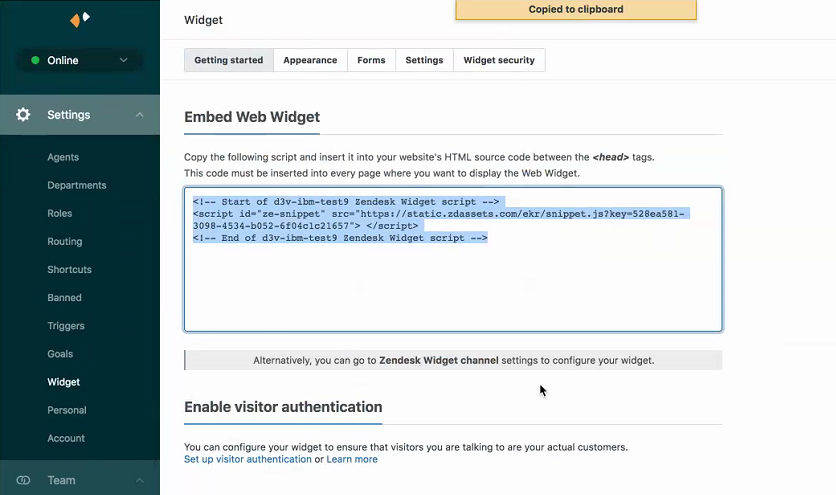
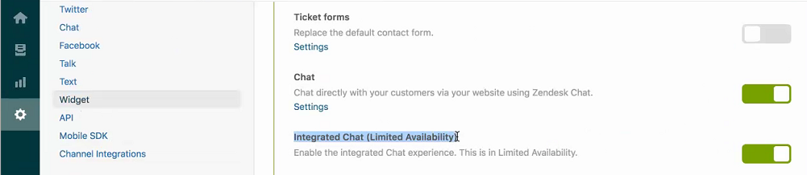

---

copyright:
  years: 2015, 2019
lastupdated: "2019-10-23"

subcollection: assistant

---

{:shortdesc: .shortdesc}
{:new_window: target="_blank"}
{:external: target="_blank" .external}
{:deprecated: .deprecated}
{:important: .important}
{:note: .note}
{:tip: .tip}
{:preview: .preview}
{:pre: .pre}
{:codeblock: .codeblock}
{:screen: .screen}
{:javascript: .ph data-hd-programlang='javascript'}
{:java: .ph data-hd-programlang='java'}
{:python: .ph data-hd-programlang='python'}
{:swift: .ph data-hd-programlang='swift'}

# Beta: Integrating with Zendesk Chat 
{: #deploy-zendesk}

Zendesk Chat lets you help customers in real time, which increases customer satisfaction. And satisfied customers are happier customers.
{: shortdesc}

This feature is available for use by participants in the early access program only. To find out how to request access, see [Participate in the early access program](/docs/services/assistant?topic=assistant-feedback#feedback-beta).
{: preview}

When you participate in the early access program, IBM gives you early access to features for your evaluation. These features are classified as beta, which means they might be unstable, might change frequently, and might be discontinued with short notice. Beta features also might not provide the same level of performance or compatibility that generally available features provide and are not intended for use in a production environment. Beta features are supported only on the [IBM Developer Answers](https://developer.ibm.com/answers/topics/watson-assistant/){: external}.

Zendesk has partnered with IBM to add a new agent to the Zendesk support team, a virtual Watson Assistant. You can integrate your assistant with Zendesk Chat to enable the Zendesk Chat app to seamlessly pass user conversations between your assistant and its human support agents. Zendesk Chat enables customers to initiate live chat with an agent. Chat sessions become tickets that agents can update after the chat session. You can add Zendesk Chat to any website or Help Center. Agents can also chat with other agents, either one-on-one or by pulling them into a conversation with a visitor.

If you integrate the assistant with Zendesk Chat, the Zendesk Chat app becomes the client application for your assistant. All interactions with users are initiated through Zendesk Chat and managed by Zendesk.

As with any beta feature, do not use this feature in production. This integration approach is still in active development and is subject to change, withdrawal, or replacement, such as by a different way of integrating with Zendesk. 
{: important}

## One-time setup steps
{: #deploy-zendesk-account-prereq}

Zendesk Chat is an add-on to Zendesk Support. Zendesk Support puts all your customer support interactions in one place, so communication is seamless, personal, and efficient, which means more productive agents and satisfied customers.

You must have a Zendesk account. If not, go to [www.zendesk.com](https://www.zendesk.com) to create one. An Enterprise or Chat Professional plan is recommended.

When you create an account, you specify a subdomain. Afterwards, your Zendesk console is available from a URL with the syntax: `<subdomain>.zendesk.com`. For example: `ibm.zendesk.com`

Set up Zendesk Chat. See [Setting up Zendesk Chat routing](https://support.zendesk.com/hc/en-us/articles/203661666-Setting-up-Zopim-Chat-in-Zendesk).

You or someone in your organziation must complete these one-time prerequisite steps before you can add the Zendesk integration to your assistant.

1.  Create a functional email account for your assistant.

    An assistant must have a valid, unique email address before it can be added to Zendesk Chat as an agent.
1.  From your Zendesk, add the assistant as a new agent.

    From the **Add>User** page, add a user. Give the assistant a name, enter the functional email address that you created for it earlier, and assign it the *Staff* role.

    An invitation is sent to the assistant's email account.

1.  From the assistant email inbox, find the invitation from Zendesk.

    The sender name on the email is your Zendesk account name. Click the link in the email to accept the invitation and create an account for the assistant.

1.  Create a user name and password for the assistant.

    This user name is part of the profile for your assistant. The profile you create represents the assistant in private agent communications within Zendesk, and in public interactions with customers through Zendesk Chat. Create a profile that reflects your brand.

1.  Edit your user profile to upload a new photo.

    

1.  Log out of your assistant account in Zendesk and log back in with a user ID with the Administrator role.

1.  Grant your assistant access to Zendesk Chat by turning on chat permissions for your assistant.

    

    For more details, see [Setting up agents' chat permissions](https://support.zendesk.com/hc/en-us/articles/203661666-Setting-up-Zopim-Chat-in-Zendesk) in the Zendesk documentation.

1.  From Zendesk Chat, create a department, and then add your assistant as the only department member.

    Chats with customers are routed to departments. You need to create a department with only your assistant as a member, so that you can route customer chats to your assistant in a later step.

    For more details, see [Creating agents and departments](https://support.zendesk.com/hc/en-us/articles/360022365373).

1.  Create at least one more department. Add members to it who are human agents that can address customer questions.

    Later, you will configure the assistant to transfer chats that it cannot handle on its own to one of these departments.

## Preparing the dialog
{: #deploy-zendesk-dialog-prereq}

If you do not have a dialog skill associated with your assistant, create one or add one to your assistant now. See [Building a dialog](/docs/services/assistant?topic=assistant-dialog-build) for more details.

Triggering a search through a search skill is not currently supported from a Zendesk integration.
{: note}

Complete these steps in your dialog skill in {{site.data.keyword.conversationshort}} so the assistant can handle user requests, and can pass the conversation to a human agent when a customer asks for one.

1.  Add an intent to your skill that can recognize a user's request to speak to a human.

    You can create your own intent or add the prebuilt intent named `#General_Connect_to_Agent` that is provided with the **General** content catalog developed by IBM.

1.  Add a root node to your dialog that conditions on the intent that you created in the previous step. Choose **Connect to human agent** as the response type.

1.  Prepare each dialog branch to be triggered by the assistant from Zendesk.

    Every root dialog node in the dialog can be processed by the assistant while it is functioning as a Zendesk agent, including root nodes in folders. You will specify the action that you want the assistant to take for each dialog branch later when you configure the Zendesk integration. Therefore, although you cannot hide a node from Zendesk, you can configure the assistant to do nothing when the node is triggered.

    Fill in the following fields of the root node of each dialog branch:

    - **Node name**: Give the node a name. This name is how you will identify the node when you configure interactions for it later. If you don't add a name, you will have to choose the node based on its node ID instead.
    - **External node name**: Add a summary of the purpose of the dialog branch. For example, *Find a store*.

      This information is shown to human agents when the assistant offers to answer a user query. If there is more than one dialog node that can address the query, the assistant shares a list of response options with human agents to get their advice about which response to use.

      

      Do **not** add an external node name to the root node that you created in Step 2. When an escalation occurs, your assistant looks at the external node name of the last processed node to learn which user goal was not met successfully. If you include an external node name in the node with the connect to human agent intent, then you will prevent your assistant from learning the last real, goal-oriented node that the user interacted with before escalating the issue.
      {: tip}

1.  If a child node in the branch conditions on a follow-up request or question that you do not want the assistant to handle, add a **Connect to human agent** response type to the node.

    For example, you might want to add this response type to nodes that cover sensitive issues only a human should handle or that track when an assistant repeatedly fails to understand a user.

    At run time, if the conversation reaches this child node, the dialog is passed to a human agent at that point. Later, when you set up the Zendesk integration, you can choose a human agent as a backup for each branch.

Your dialog is now ready to support your assistant in Zendesk.

### Dialog considerations
{: #deploy-zendesk-dialog}

If there are rich responses in the dialog nodes that Zendesk will access, then you must configure the Zendesk Chat widget to support rich responses. See [Testing the integration](#deploy-zendesk-try) for more details.

Some rich responses that you add to a dialog are displayed differently within the "Try it out" pane from how they are displayed to Zendesk users. The table below describes how the response types are treated by Zendesk.

| Response type | How displayed to Zendesk users  |
|---------------|---------------------------|
| **Option**    | The options are displayed as a numbered list. In the **title** or **description** field, provide instructions that explain to the user how to choose an option from the list. |
| **Image**     | The image **title**, **description**, and the image itself are rendered. |
| **Pause**     | Whether or not you enable it, a typing indicator is not displayed during the pause. |

See [Rich responses](/docs/services/assistant?topic=assistant-dialog-overview#multimedia) for more information about response types.

## Adding a Zendesk integration
{: #deploy-zendesk-add-zendesk}

1.  From the Assistants tab in the {{site.data.keyword.conversationshort}} tool, click to open the assistant tile that you want to deploy.

1.  From the Integrations section, click **Add integration**.

1.  Click **Zendesk Chat**.

    Follow the instructions that are provided on the screen.

The following sections help you with the setup steps.

### Connecting the assistant to Zendesk
{: #deploy-zendesk-connect}

1.  When your dialog is ready, click **Connect now**.
1.  Add the subdomain that completes your Zendesk hostname, and then click **Authorize**.

    You are redirected to the Zendesk site.

    Log in to Zendesk using the assistant's functional email address and password, not your own. You want to establish the connection to a functional email that can be used by more than one person in your organization.
    {: important}

1.  Click **Allow** to allow your assistant to access your Zendesk Chat account.

### Setting up the app
{: #deploy-zendesk-private-app}

An application is provided by the {{site.data.keyword.conversationshort}} service that you can install in Zendesk Chat to enable your human agents to communicate with your assistant. For example, if the assistant knows an answer, it can suggest the answer to a human agent, who can approve it before it is shared with a visitor.

1.  Download the private application from the Zendesk Chat integration configuration page in {{site.data.keyword.conversationshort}}.

1.  Copy the app credentials. You will need them in a later step.

1.  Log in to Zendesk with a user ID with an Administrative role.

1.  Upload the application to Zendesk Chat as a new private app. When credentials are requested, paste the app credentials that you copied earlier.

    For more details, see [Managing your installed apps](https://support.zendesk.com/hc/en-us/articles/203662486).

### Configuring message routing
{: #deploy-zendesk-config-backup}

Assign human agents as backups for the assistant in case the assistant needs to transfer an in-progress conversation to a human. You can choose a different agent or department to be the backup contact for each dialog branch.

To set up routing assignments for escalations from the assistant to a human, complete the following steps:

1.  From the Zendesk integration page, click **My Dialog Skill is ready** to confirm that you have prepared your dialog.

    Only click this button if you have completed the [Preparing the dialog](#deploy-zendesk-dialog-prereq) procedure.
    {: important}

1.  In the *Settings* section, click **Choose department**.

    Choose a department with human agents who can answer the types of questions that are initially routed to the assistant. Whenever your assistant cannot answer, the chat is routed to this department by default. This department will likely be the one you created in the last step of the [One-time setup steps](#deploy-zendesk-account-prereq) procedure that you completed earlier.

1.  If you want to add special assignments to route certain types of questions to specific departments, click **New rule**.

1.  From the *Choose node* drop-down list, choose the node for the dialog branch that you want to make a special assignment for.

    Remember, a branch is identified by its node name. If you did not specify a node name, then the node's ID is displayed instead.

1.  Choose a department with human agents to be the backup contact for this dialog branch.

    The user query will be escalated to this department if the assistant cannot answer the query or hits a child node with a *Connect to human agent* response type, indicating that it should be answered by a human only.

1.  To define routing rules for other dialog branches, click **New rule** again, and repeat the previous steps.

    Don't forget to set up an assignment for any root node that has a *Connect to human agent* response type in a child node in its branch that needs special handling. If you don't, the assistant will transfer the conversation to the department that you specified as the default department earlier in this procedure. In some cases the default department will be fine. But, for sensitive matters, be sure to route the dialog node to the appropriate department so the matter can be handled promptly and by the right people.

1.  After adding rules, click **Return to overview** to exit the page.

### Giving the assistant permission to monitor and answer user queries
{: #deploy-zendesk-config-action}

When you want the assistant to start answering visitor questions, turn on monitoring.

When the assistant is confident that it knows how to answer a user query, the assistant responds to the user directly. (The assistant is confident when the top intent identified by your assistant has a confidence score of 0.75 or higher.)

If you do not want the assistant to directly answer certain types of user queries, then you can add rules to specify other actions for the assistant to take per dialog branch.

You might want to start incorporating the assistant into the Zendesk support team more conservatively, allowing the assistant only to suggest responses as it transfers user messages to other departments for human agents to answer, for example. Over time, after the assistant proves itself, you can give it more responsibility.

1.  From the Zendesk integration page, in the *Enable your assistant to monitor incoming visitor requests* section, switch monitoring **On**.

1.  In *Settings*, click **Manage settings**.

1.  In the *Monitor Zendesk Chat department* field, choose the department that you created earlier and added the assistant to as the only member.

1.  To define a unique interaction pattern for a specific dialog branch, click **New rule**.

1.  From the *Choose node* drop-down list, choose the node for the branch you want to configure.

    Remember, a branch is identified by its node name. If you did not specify a node name, then the node's ID is displayed instead.

1.  Pick the type of action that you want the assistant to perform when this dialog node is triggered. The action type options are these:

    - **Do nothing**: The assistant is not involved in the response; the user's message remains routed to the assistant's department until it is reassigned to someone else.
    - **Send to agent or department**: The assistant evaluates the user input to determine its goal, and then transfers it to the appropriate human agent or department.
    - **Suggest to agent or department**: The assistant provides the human agent with suggestions for how to respond by sharing notes with the human agent through the private app.

      - If the user input triggers a dialog branch, meaning a root dialog node with child nodes that represents a comprehensive interaction, then the assistant indicates that it is capable of addressing the request, and offers to do so.
      - If the user input triggers a root node with no children, then the assistant simply shares the programmed response from the node with the human agent, but does not respond directly to the user.
      - If the input triggers more than one dialog node with high confidence, the assistant shows the human agent a list of possible responses and asks the agent to choose the best response.

      In every case, the human agent decides whether to let the assistant take over.

    For all other dialog nodes, the assistant responds to the user directly, without conferring with any human agents.

1.  To define unique interaction settings for other dialog branches, click **New rule** again, and repeat the previous steps.

1.  After adding rules, click **Return to overview** to exit the page.

As your dialog changes, you will likely return to the Zendesk integration page to make incremental changes to these rules.

## Testing the integration
{: #deploy-zendesk-try}

To test the assistant, temporarily route all incoming chats to the assistant's department. Embed your Zendesk Chat widget into a test web page, where you and other team members can submit inquiries. Then, submit test user queries to see how the messages are handled.

1.  Create a trigger that routes all messages to the department you created for the assistant.

    When logged in to Zendesk Support as an administrator, go to the Settings page. Go to Triggers and create a trigger that routes all messages to your assistant's department.

    

    For more details, see [Automatically route chats to departments](https://support.zendesk.com/hc/en-us/articles/360022186814) from the Zendesk documentation.

1.  Create a chat widget to embed in a test web page.

    From Settings, go to the Widget page. Follow the instructions to copy the web widget script and paste it into your test web page.

    

    In the script you copy, your subdomain will be referenced in place of `d3v-ibm-test9`.

1.  If there are rich responses in the dialog nodes that Zendesk will access, then you must configure the Zendesk Chat widget to support rich responses.

    From the widget configuration page, enable integrated chat.

    

1.  Submit test queries through the chat widget.

    Verify that messages that are meant to be answered by the assistant are generating the appropriate responses, and that the assistant is not responding to messages that it is not meant to answer.

1.  For nodes that are configured with the *Suggest to agent or department* action, step through the workflow that is provided by the private app, in which the assistant suggests a response and waits for a human agent to approve or reject the suggestion.

    If you see **Missing topic** where the node's purpose information should be displayed, then it means that the root node in the branch that was triggered does not have an external node name specified for it. No name makes it harder for the human agent to understand whether the assistant's suggested response is a good one. To address this omission, return to the {{site.data.keyword.conversationshort}} tool. Open the dialog editor and add external node names for any nodes that can be accessed by Zendesk Chat, especially those for which the *Suggest to agent or department* action is configured.

## Routing incoming messages to the assistant
{: #deploy-zendesk-route-to-assistant}

After you test the integration, and feel confident that the assistant is ready to start answering user queries, you can route incoming visitor chats to the assistant.

1.  Disable the trigger you created earlier that temporarily routes all customer chats to the assistant's department.

1.  Create a new trigger that routes specific types of messages to the department you created for the assistant.

    For more details, see [Automatically route chats to departments](https://support.zendesk.com/hc/en-us/articles/360022186814).
1.  Set up reassignments that will reroute messages that your assistant does not reply to in under 20 seconds to a department monitored by human agents.

    For more details, see [Setting up chat routing](https://support.zendesk.com/hc/en-us/articles/360022366213).

1.  Embed the chat widget in a production web site to make it available to your customers.
