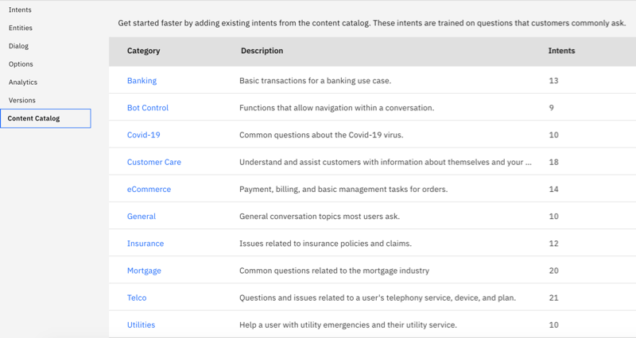
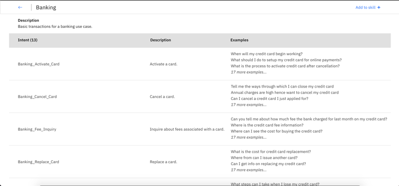

---

copyright:
  years: 2015, 2021
lastupdated: "2021-03-04"

subcollection: assistant

---

{{site.data.keyword.attribute-definition-list}}

Documentation for the **classic {{site.data.keyword.assistant_classic_short}}** experience has moved. For the most up-to-date version, see [Using built-in intents](/docs/watson-assistant?topic=watson-assistant-catalog){: external}.
{: attention}

# Using built-in intents
{: #catalog}

***Content Catalogs*** provide an easy way to add common intents to your {{site.data.keyword.assistant_classic_short}} dialog skill.
{: shortdesc}

Intents you add from the catalog are meant to provide a starting point. Add to or edit the catalog intents to tailor them for your use case.

The latest content catalog, named `Covid-19`, is available in Brazilian Portuguese, English, French, and Spanish only. For more information about language support for the catalogs, see [Supported languages](/docs/assistant?topic=assistant-language-support).

## Adding a content catalog to your dialog skill
{: #catalog-add}

1.  Open your dialog skill, open the **Content Catalog** page.

    

1.  Select a content catalog, such as *Banking*, to see the intents that are provided with it.

    

    Intents that are added from a content catalog are distinguishable from other intents by their names. Each intent name is prepended with the content catalog name.

1.  Add a content catalog to your dialog skill by clicking the `Add to skill` button.

1.  Go to the **Intents** page to see the intents that you added from the catalog listed.

Your skill trains itself on the new data.

After you add a catalog to your skill, the intents become part of your training data. If IBM makes subsequent updates to a content catalog, the changes are not automatically applied to any intents you added from a catalog.
{: note}

## Editing content catalog intents
{: #catalog-edit-content}

Like any other intent, after you add content catalog intents to your skill, you can make the following changes to them:

- Rename intents
- Delete intents
- Add, edit, or delete intent user examples
- Move an example to a different intent
