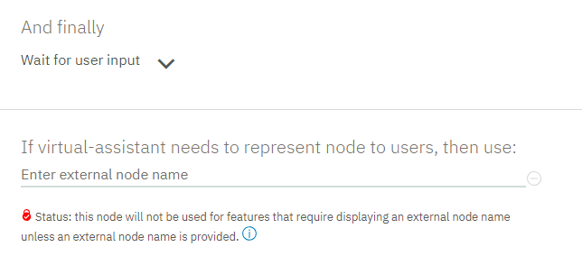

---

copyright:
  years: 2015, 2019
lastupdated: "2019-03-05"

---

{:shortdesc: .shortdesc}
{:new_window: target="_blank"}
{:deprecated: .deprecated}
{:important: .important}
{:note: .note}
{:tip: .tip}
{:pre: .pre}
{:codeblock: .codeblock}
{:screen: .screen}
{:javascript: .ph data-hd-programlang='javascript'}
{:java: .ph data-hd-programlang='java'}
{:python: .ph data-hd-programlang='python'}
{:swift: .ph data-hd-programlang='swift'}

# Integrating with Intercom 
{: #deploy-intercom}

Intercom is a customer messaging platform that helps drive business growth through better relationships throughout the customer lifecycle.
{: shortdesc}

Intercom has partnered with IBM to add a new agent to the customer support team, a virtual Watson Assistant. You can integrate your assistant with an Intercom application to enable the app to seamlessly pass user conversations between your assistant and human agents. Read the [Watson blog post ](https://medium.com/@blakemcgregor/contact-center-post-394dff427c8) to learn more about the integration.

This integration is available only to Plus or Premium plan users.
{: note}

If you integrate the assistant with Intercom, the Intercom application becomes the client-facing application for your skill. All interactions with users are initiated through and managed by Intercom.

There is currently no way to pass an ongoing conversation from one integration channel to another.

## One-time agent creation
{: #deploy-intercom-account-prereq}

You or someone in your organziation must complete these one-time prerequisite steps before you add the Intercom integration to your assistant.

1.  Create a functional email account for your assistant.

    Each assistant must have a valid, unique email address before it can be added to a team in Intercom.
1.  From your Intercom workspace, add the assistant to your team as a new agent.

    Go to the teammate settings page in your Intercom workspace, invite the assistant as a new agent by adding the email you created in the previous step to the invite field.

    If you don't have an Intercom workspace set up yet, create one at [www.intercom.com ](https://www.intercom.com). At a minimum, you need a subscription to the *Inbox* product from Intercom to be able to create a workspace.

1.  From the assistant email account you created earlier, find the invitation from Intercom. Click the link in the email to join the team. Sign up using the assistant's functional email address, and then join the team.

1.  **Optional**: Update the profile for your assistant.

    You can edit the name and profile picture for your assistant. This profile represents the assistant in private agent communications within your workspace, and in public interactions with customers through your Intercom apps. Create a profile that reflects your brand.

    Click the Intercom profile icon in the navigation bar to access profile and workspace settings.

    

## Preparing the dialog
{: #deploy-intercom-dialog-prereq}

Complete these steps in your dialog skill so the assistant can handle user requests, and can pass the conversation to a human agent when a customer asks for one.

1.  Add an intent to your skill that can recognize a user's request to speak to a human.

    You can create your own intent or add the prebuilt intent named `#General_Connect_to_Agent` that is provided with the **General** content catalog developed by IBM.

1.  Add a root node to your dialog that conditions on the intent that you created in the previous step. Choose **Connect to human agent** as the response type.

1.  Prepare each dialog branch to be triggered by the assistant from the Intercom app.

    Every root dialog node in the dialog can be processed by the assistant while it is functioning as an Intercom teammate, including root nodes in folders. You will specify the action that you want the assistant to take for each dialog branch later when you configure the Intercom integration. Therefore, although you cannot hide a node from Intercom, you can configure the assistant to do nothing when the node is triggered.

    Fill in the following fields of the root node of each dialog branch:

    - **Node name**: Give the node a name. This name is how you will identify the node when you configure interactions for it later. If you don't add a name, you will have to choose the node based on its node ID instead.
    - **External node name**: Add a summary of the purpose of the dialog branch. For example, *Find a store*.

      This information is shown to other agents on the assistant's team when the assistant offers to answer a user query. If there is more than one dialog node that can address the query, the assistant shares a list of response options with human agent teammates to get their advice about which response to use.

      

      Do **not** add an external node name to the root node that you created in Step 2. When an escalation occurs, the service looks at the external node name of the last processed node to learn which user goal was not met successfully. If you include an external node name in the node with the connect to human agent intent, then you will prevent the service from learning the last real, goal-oriented node that the user interacted with before escalating the issue.
      {: tip}

1.  If a child node in the branch conditions on a follow-up request or question that you do not want the assistant to handle, add a **Connect to human agent** response type to the node.

    For example, you might want to add this response type to nodes that cover sensitive issues only a human should handle or that track when an assistant repeatedly fails to understand a user.

    At run time, if the conversation reaches this child node, the dialog is passed to a human agent at that point. Later, when you set up the Intercom integration, you can choose a human agent as a backup for each branch.

Your dialog is now ready to support your assistant in Intercom.

## Adding an Intercom integration
{: #deploy-intercom-add-intercom}

1.  From the Assistants tab, click to open the assistant tile that you want to deploy.

1.  From the Integrations section, click **Add Integration**.

1.  Click **Intercom**.

    Follow the instructions that are provided on the screen. The following sections help you with the steps.

The following 4-minute video illustrates the steps.

<iframe class="embed-responsive-item" id="youtubeplayer" title="Quick Setup" type="text/html" width="640" height="390" src="https://www.youtube.com/embed/SkbFWNScueU" frameborder="0" webkitallowfullscreen mozallowfullscreen allowfullscreen> </iframe>

## Connecting the assistant to Intercom
{: #deploy-intercom-connect}

As soon as you give Intercom permission to use the assistant, the assistant becomes a viable member of the Intercom team.

Human agents can assign messages to the assistant by using Intercom's assignment rules. Messages can be assigned to the assistant in the following ways:

- Automatic assignment of inbound conversations to a teammate or team inbox based on some criteria

  The following 1 1/2-minute video illustrates the steps.

  <iframe class="embed-responsive-item" id="youtubeplayer2" title="Auto Assign" type="text/html" width="640" height="390" src="https://www.youtube.com/embed/4M9wu8NHxcY" frameborder="0" webkitallowfullscreen mozallowfullscreen allowfullscreen> </iframe>

- Manual reassignment made by a human agent at run time.

  The following under 3-minute video illustrates the steps.

  <iframe class="embed-responsive-item" id="youtubeplayer3" title="Manual Assign" type="text/html" width="640" height="390" src="https://www.youtube.com/embed/jAnolyUJAIA" frameborder="0" webkitallowfullscreen mozallowfullscreen allowfullscreen> </iframe>

See the [Intercom documentation ](https://www.intercom.com/help/support-and-retain-customers/work-as-a-team/assign-conversations-to-teammates-and-teams) for more details.

1.  When your dialog is ready, click **Connect now**.
1.  Click **Access Intercom** to be redirected to the Intercom site.

     Log in to Intercom using the assistant's functional email address and password, not your own. You want to establish the connection to a functional ID that is shared by more than one person in your organization.
     {: important}

1.  Click **Authorize access**.
1.  Click **Back to overview**.

The assistant is now available to receive assignments from Intercom teammates. If you haven't yet, [set up your dialog](#deploy-intercom-dialog-prereq).
{: important}

## Configuring message routing
{: #deploy-intercom-config-backup}

Assign human teammates as backups for the assistant in case the assistant needs to transfer an in-progress conversation to a human. You can choose a different team or teammate to be the backup contact for each dialog branch.

To set up routing assignments for escalations from the assistant to a human, complete the following steps:

1.  From the Intercom integration page, click **My Dialog Skill is ready** to confirm that you have prepared your dialog.

    Only click this button if you have completed the [Preparing the dialog](#deploy-intercom-dialog-prereq) procedure.
    {: important}

1.  In the *Settings* section, click **Manage rules**.

    If you make no changes, the backup contact for all of the nodes remains unassigned.

1.  Click **New rule**.

1.  From the *Choose node* drop-down list, choose the node for the dialog branch you want to configure.

    Remember, branches are identified by their node name. If you did not specify a node name, then the node's ID is displayed instead.

1.  Choose the team or human agent teammate to be the backup contact for this dialog branch. The user query will be escalated to this person if the assistant cannot answer the query or hits a child node with a *Connect to human agent* response type, indicating that it should be answered only by a human.

1.  To define routing rules for other dialog branches, click **New rule** again, and repeat the previous steps.

    Don't forget to set up an assignment for any root nodes that have a *Connect to human agent* response type in a child node in their branch. If you do not transfer the associated root node to a specific person or team, a sensitive matter can be transferred to the *Unassigned* inbox.

1.  After adding rules, click **Return to overview** to exit the page.

The following 3-minute video illustrates the steps.

<iframe class="embed-responsive-item" id="youtubeplayer0" title="Topic-based escalation routing" type="text/html" width="640" height="390" src="https://www.youtube.com/embed/dTwJZOqdzII" frameborder="0" webkitallowfullscreen mozallowfullscreen allowfullscreen> </iframe>

## Give the assistant permission to monitor and answer user queries
{: #deploy-intercom-config-action}

When you want the assistant to start monitoring an Intercom inbox, and answering messages on its own, turn on monitoring.

Your assistant watches user inquiries as they are logged in Intercom. When the assistant is confident that it knows how to answer a user query, the assistant responds to the user directly. (The assistant is confident when the top intent identified by the service has a confidence score of 0.75 or higher.)

If you do not want the assistant to answer certain types of user queries, then you can add rules to specify other actions for the assistant to take per dialog branch. For example, you might want to start incorporating the assistant into the Intercom team more conservatively, allowing the assistant only to suggest responses as it transfers user messages to other teammates for them to answer. Over time, after the assistant proves itself, you can give it more responsibility.

To configure how you want the assistant to handle specific dialog branches, define rules.

1.  From the Intercom integration page, in the *Enable your assistant to monitor an inbox* section, switch monitoring **On**.

1.  In *Settings*, click **Manage rules**.

    If you do not define rules, the assistant is configured to monitor the *Unassigned* inbox and automatically answer user inquiries that it is confident it can address.

1.  From the *Monitor Intercom inbox* field, choose the Intercom inbox that you want the assistant to monitor.

1.  Click **New rule** to define a unique interaction pattern for a specific dialog branch.

1.  From the *Choose node* drop-down list, choose the node for the branch you want to configure.

    Remember, branches are identified by their node name. If you did not specify a node name, then the node's ID is displayed instead.

1.  Pick the type of action that you want the assistant to perform when this dialog node is triggered. The action type options are these:

    - **Do nothing**: The assistant is not involved in the response; the user's message remains in the inbox for someone else to address.
    - **Send to team or teammate**: The assistant evaluates the user input to determine its goal, and then transfers it to the appropriate teammate.
    - **Suggest to team or teammate**: The assistant provides the teammate with suggestions for how to respond by sharing notes with the human agent through the internal Intercom app.

      - If the user input triggers a dialog branch, meaning a root dialog node with child nodes that represents a comprehensive interaction, then the assistant indicates that it is capable of addressing the request, and offers to do so.
      - If the user input triggers a root node with no children, then the assistant simply shares the programmed response from the node with the human agent, but does not respond directly to the user.
      - If the input triggers more than one dialog node with high confidence, the assistant shows the human teammate a list of possible responses and asks the teammate to choose the best response.

      In every case, the human agent decides whether to let the assistant take over.

    - **Answer**: The assistant responds to the user directly, without conferring with any other teammates.

    Teammate involvement is required for any nodes to which you assign the *Send to team or teammate* or *Suggest to team or teammate* action types. Be sure to go back and add a rule that assigns the right person or team as the backup for this dialog node in particular.

1.  To define unique interaction settings for other dialog branches, click **New rule** again, and repeat the previous steps.

1.  After adding rules, click **Return to overview** to exit the page.

As your dialog changes, you will likely return to the Intercom integration page to make incremental changes to these rules.

The following 3-minute video illustrates the steps.

<iframe class="embed-responsive-item" id="youtubeplayer1" title="Inbox Monitoring" type="text/html" width="640" height="390" src="https://www.youtube.com/embed/fFKjWUfIftw" frameborder="0" webkitallowfullscreen mozallowfullscreen allowfullscreen> </iframe>

## Testing the integration
{: #deploy-intercom-try}

To effectively test your Intercom integration from end-to-end, you must have access to an Intercom end-user application. You already created or edited an Intercom workspace. The workspace must have an associated user interface client. If it does not, see [Apps in Intercom ](https://www.intercom.com/help/apps-in-intercom){: new_window} for help with setting one up.

Submit test user queries through a client application that is associated with your Intercom workspace to see how the messages are handled by Intercom. Verify that messages that are meant to be answered by the assistant are generating the appropriate responses, and that the assistant is not responding to messages that it is not configured to answer.

## Dialog considerations
{: #deploy-intercom-dialog}

Some rich responses that you add to a dialog are displayed differently within the "Try it out" pane from how they are displayed to Intercom users. The table below describes how the response types are treated by Intercom.

| Response type | How displayed to Intercom users  |
|---------------|---------------------------|
| **Option**    | The options are displayed as a numbered list. In the **title** or **description** field, provide instructions that explain to the user how to choose an option from the list. |
| **Image**     | The image **title**, **description**, and the image itself are rendered. |
| **Pause**     | Whether or not you enable it, a typing indicator is not displayed during the pause. |

See [Rich responses](/docs/services/assistant?topic=assistant-dialog-overview#dialog-overview-multimedia) for more information about response types.
