---

copyright:
  years: 2021
lastupdated: “2021-11-17”

subcollection: assistant

---

{{site.data.keyword.attribute-definition-list}}

Documentation for the **classic {{site.data.keyword.assistant_classic_short}}** experience has moved. For the most up-to-date version, see [Integrating with phone and Genesys Cloud](/docs/watson-assistant?topic=watson-assistant-deploy-phone-genesys){: external}.
{: attention}

# Integrating with phone and Genesys Cloud
{: #deploy-phone-genesys}

You can use the phone integration to help your customers over the phone and transfer them to live agents inside of Genesys Cloud. If, in the course of a conversation with your assistant, a customer asks to speak to a person, you can transfer the conversation directly to a Genesys Cloud agent.

## Before you begin

To use this integration pattern, make sure you have the following:

- {{site.data.keyword.assistant_classic_short}} Plus or Enterprise Plan (required for phone integration)
- A working assistant you are ready to deploy
- A Genesys Cloud account

## Integrating with Genesys Cloud

To integrate your assistant with Genesys Cloud, follow these steps.

1. Log into the [Genesys Cloud console](https://apps.mypurecloud.com).

1. Click **Admin**.

1. On the **Telephony** tab, click **Trunks**.

1. In the **External Trunks** section, click **Create new**. 

    - In the **External Trunk Name** field, type a descriptive name (for example, `Watson`).

    - In the **Type** field, select **BYOC Carrier** and then **Generic BYOC Carrier**.

    - In the **Inbound SIP Termination Identifier** field, specify any name you want to use (for example, `Watson`). This value is not used for now, but it is required by Genesys Cloud.

    - In the **Protocol** field, select *TLS*.

    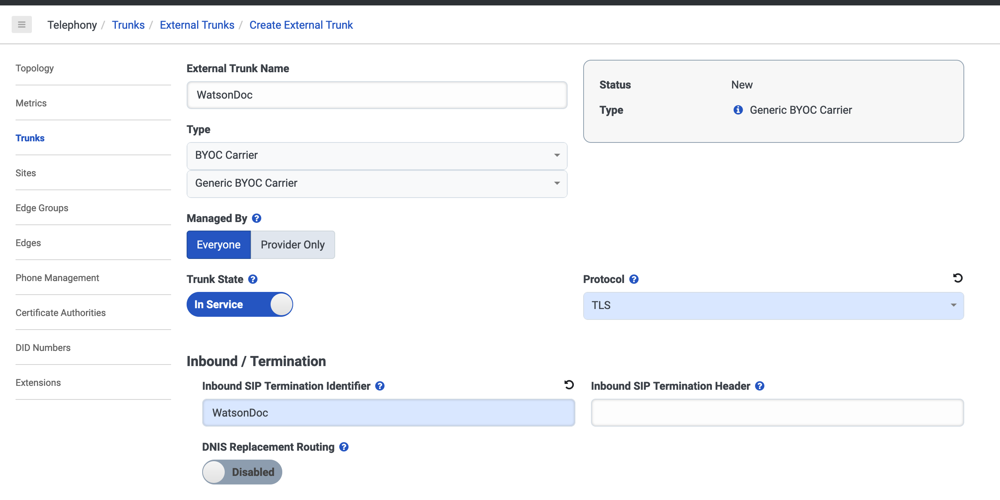

1. Under **Outbound**, scroll to the **SIP Servers or Proxies** section.

    - In the **Hostname or IP Address** field, type the SIP URI (not including `sips:`) from your {{site.data.keyword.assistant_classic_short}} phone integration settings.

    - In the **Port** field, type `5061`.
    
    Click the **`+`** button.

    Currently, SIPS and digest authentication are supported.
    {: note}

    

1. Under **SIP Access Control**, add the IP addresses for the data center where your assistant is located.

    | Data center | IP addresses                                    |
    |-------------|-------------------------------------------------|
    | US-South    | 67.228.108.82\n169.63.5.162\n150.239.30.146     |
    | US-East     | 52.116.100.158\n169.61.70.162\n169.59.136.194   |
    | EU-DE       | 161.156.178.162\n169.50.56.146\n149.81.86.82    |
    | EU-GB       | 158.176.120.162\n141.125.102.34\n158.175.99.34  |
    | AU-SYD      | 168.1.47.2\n135.90.86.50\n168.1.106.130         |
    | JP-TOK      | 165.192.69.82\n128.168.105.178\n161.202.149.162 |

1. Under **Identity**, specify the following information.

    - Toggle the **Address Omit + Prefix** switch to **Disabled**.

      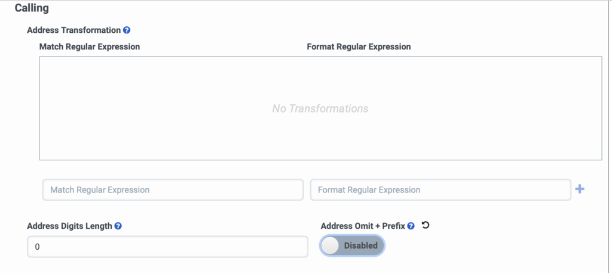

1. Under **Media**, remove **Opus** from the **Preferred Codec List**. Click **Select a Codec** and then select **g729** to add it to the list. Leave **PCMU** as the first item in the list.

    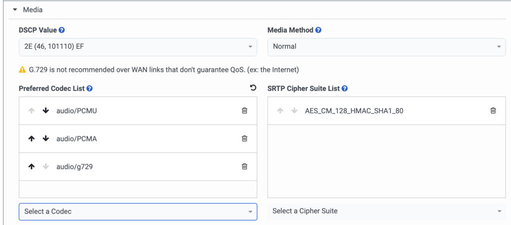

1. Under **Protocol**
    - In the **Header/Invite** section, toggle the **Conversation Headers** switch to **Enabled**
    - Enable **Take Back and Transfer**.

1. Click **Save External Trunk**.

1. Under **Sites**, select the existing site that you want to use this trunk with. To create a new site, specify a name and location and click **Create**.

1. Click **Number plans**. Create a new number plan and specify the following information:

    - In the **Number Plan Name** field, type a descriptive name (for example, `Watson`).

    - For **Match type**, select **E. 164 Number List**.

    - In the **Numbers** field, type a number in the **Start** and **End** fields. You can make up any number to use as an identifier to assign to Watson. Specify the same number in both fields.
 
      To create a PSTN number you can give to your clients, you must create a Direct Inward Dialing (DID) or Bring Your Own Carrier (BYOC) number. For more information, see the Genesys documentation.
      {: note}

    - In the **Classification** field, type a classification name (for example, `Watson`).
    
    Click **Save Number Plans**.

    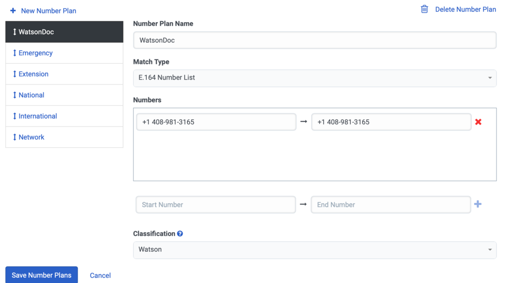

1. Click **Outbound Routes**. You can either edit the default outbound route or create a new one. Specify the following information:

    - In the **External Trunks** field, click **Select External Trunks**. Select the trunk that you created for Watson Assistant.

    - In the **Classifications** field, add the applicable classifications. You need to include `National` and the classification that you created for {{site.data.keyword.assistant_classic_short}} earlier. (The `National` route is used only to simulate the call to ensure that the trunk is operational.)

    - Toggle the **State** switch to **Enabled**.

    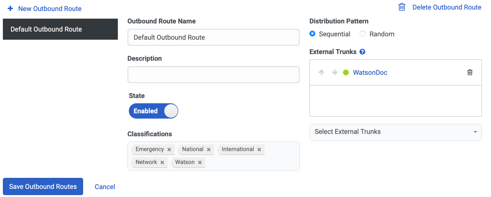

1. Click **Save Outbound Routes**.

1. Go to the **Simulate Call** tab, and click the **Simulate Call** button. The trunk should show as operational. No actual call is made during simulation.

    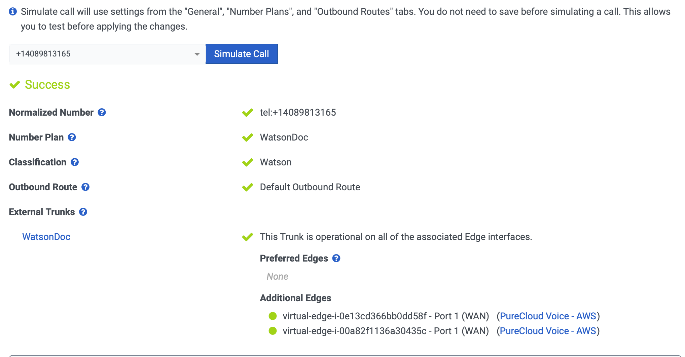

1. Go to **Phone Management** and click **Create new**. 

    - In the **Phone Name** field, enter a descriptive name.

    - In the **Base Settings** field, select **WebRTCPhone**.

    - In the **Site** field, select the site that you want to use.

    - In the **Person** field, select yourself.

1. In the {{site.data.keyword.assistant_classic_short}} user interface, [create a new phone integration](/docs/assistant?topic=assistant-deploy-phone#deploy-phone-setup).

    - When prompted, select **Use an existing phone number with an external provider**.

    - Enter the phone number that you assigned in the Genesys **Number Plans** setting. It is not necessarily a real phone number; it is an identifier you assigned.

    - Complete the phone integration setup process. For more information, see [Integrating with phone](/docs/assistant?topic=assistant-deploy-phone#deploy-phone).

    - After the phone integration is set up, go to the **SIP trunk** tab and deselect the **Don't place callers on hold while transferring to a live agent** option.

1. In the Genesys Cloud console, click the circle in the upper left. Select **Phone**, and then choose the phone that you created in the **Phone management** section. Set yourself as available. The phone icon on the left is now active.

1. Click **`+`** to start a new call. Specify the number that you assigned to {{site.data.keyword.assistant_classic_short}}, and then click **Dial**. You should hear your assistant speak.

If you encounter errors, click **Performance -> Interactions** and view the PCAP file to read the diagnostics.
{: note}

## Transferring to a live agent

Now that your Genesys Cloud environment can connect to {{site.data.keyword.assistant_classic_short}}, you can set up the ability for your assistant to transfer calls back to your live agents. 

1. In the Genesys Cloud console, go to **DID Numbers -> DID Ranges** and create a new range.

    - In the **DID Start** and **DID End** fields, specify a phone number. (You do not need to use a real phone number; you can make up an identifier for your Genesys environment, such as `1-888-888-1234`.)

    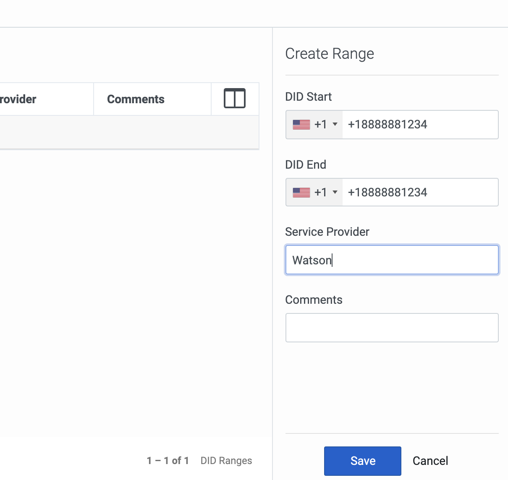

    - In the **Service Provider** field, enter a descriptive name (for example, `Watson`).

1. If you did not set up a queue to enable callers to wait for available agents, follow these steps to create one.

    1. Click **Admin**.

    1. Under **Contact Center**, click **Queues**.

    1. Create a new queue and give it a descriptive name.

    1. Add yourself as a member.

    1. Click **Save**.

1. Create a simple call flow. Your business might already have something more complex for routing.

    1. Click **Admin**.

    1. Click **Architect**.

    1. In the **Flows: Inbound Call** section, click **`+`** to create a new flow. Give it a descriptive name (for example, `Escalate to Agent`).

      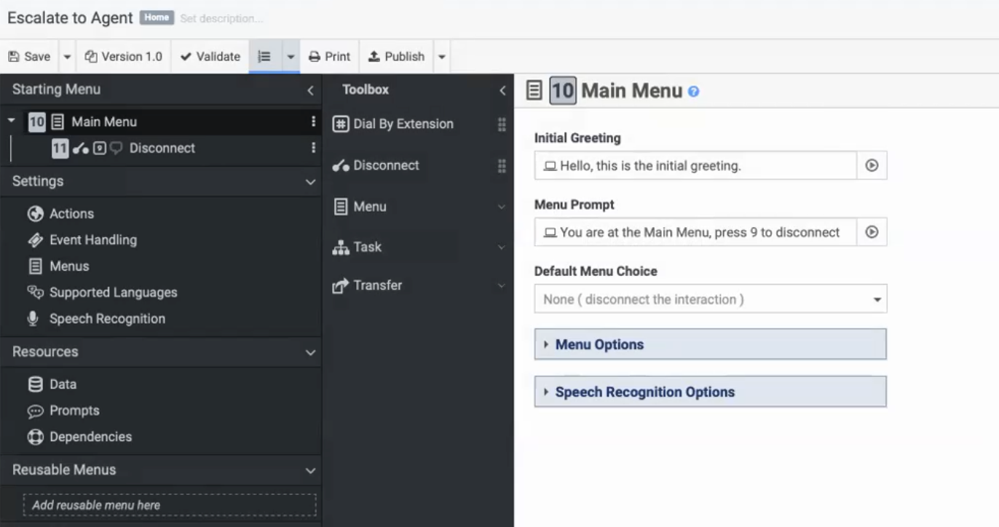

    1. In the toolbox, click **Task** and drag it into **Reusable Tasks**.

      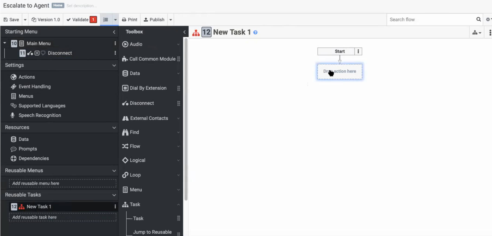

    1. From your toolbox, under **Data**, drag a **Set Participant Data** widget into the first action. Click on the widget and specify an attribute named **uuiData**. For the value to assign, choose the **Expression** type and specify `Call.UUIData`.
    
      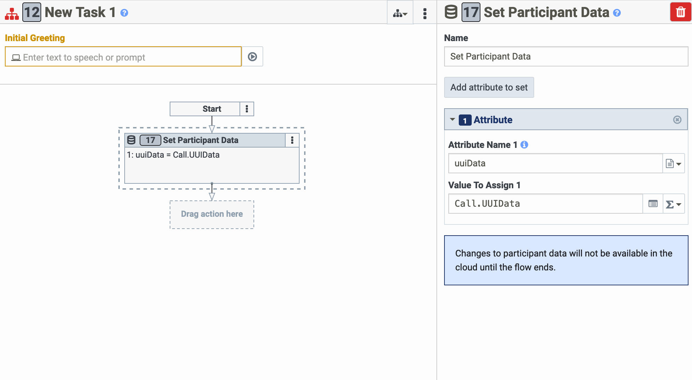

    1. From your toolbox, under **Transfer**, drag the **Transfer to ACD** widget into the first action.

      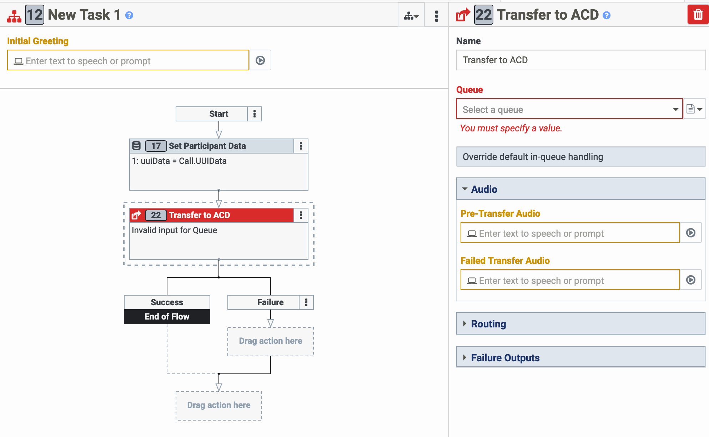

    1. Select the queue that you want to use.

    1. In the toolbox, click the **Disconnect** widget and drag it into the action after **Failure**. (This too disconnects the call if transfer fails.)

    1. Click the three dots under **Reusable tasks** and click **Set this as the starting task**. You can remove the **Initial Greeting** because your assistant speaks before handing off the call.

    1. Click **Publish** in the menu bar to make this transfer live.

    1. Return to the main Genesys Cloud console.
    
    1. Click **Admin** and then navigate to **Call Routing** in the **Routing** section.

    1. Give the route a descriptive name (for example, `Escalate to Agent`).

    1. Under **Regular Routing**, for all calls, select your new flow.

    1. Assign the DID number that you previously created.

    1. Click **Save**.

1. Make sure that your assistant is configured to transfer calls to an agent using the *Connect To Agent* response_type. For more information, see [Transferring a call to a live agent](/docs/assistant?topic=assistant-dialog-voice-actions#dialog-voice-actions-transfer).

    For the `sip.uri` parameter, use the DID number that you created in Genesys Cloud, and the inbound SIP URI from your Genesys trunk. Use the following format:

    ```json
    {
      "generic": [
        {
            "response_type": "connect_to_agent",
            "transfer_info": {
              "target": {
                "service_desk": {
                  "sip": {
                    "uri": "sip:+18883334444\\@example.com",
                    "transfer_headers_send_method": "refer_to_header"
                  }
                }
              }
            },
            "agent_available": {
              "message": "Ok, I'm transferring you to an agent"
            },
            "agent_unavailable": {
              "message": ""
            }
        }
      ]
    }
    ```

    Make sure you use the `\\` escape characters so {{site.data.keyword.assistant_classic_short}} does not misinterpret the `@` as part of the entity shorthand syntax.
    {: note}

1. Make a test call and say something that initiates a transfer to an agent. In your Genesys Cloud console, you should see the transfer take place.


###  Share the conversation history with service desk agents 

To enable the service desk agent to get a quick view of the conversation history between the visitor and the assistant, set up the {{site.data.keyword.assistant_classic_short}} Agent App app for your Genesys Pure Cloud Environment. For more information, see the [Genesys starter kit](https://github.com/watson-developer-cloud/assistant-web-chat-service-desk-starter/tree/main/src/genesys/agentApp){: external}.

