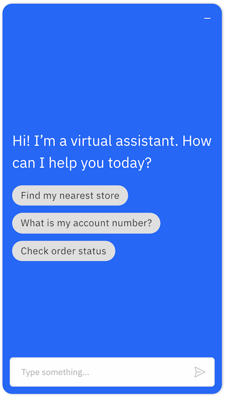

---

copyright:
  years: 2019, 2021
lastupdated: "2021-01-21"

subcollection: assistant

---

{:shortdesc: .shortdesc}
{:new_window: target="_blank"}
{:external: target="_blank" .external}
{:deprecated: .deprecated}
{:important: .important}
{:note: .note}
{:tip: .tip}
{:preview: .preview}
{:pre: .pre}
{:codeblock: .codeblock}
{:screen: .screen}
{:javascript: .ph data-hd-programlang='javascript'}
{:java: .ph data-hd-programlang='java'}
{:python: .ph data-hd-programlang='python'}
{:swift: .ph data-hd-programlang='swift'}
{:video: .video}

# Adding the web chat to your website
{: #deploy-web-chat}

Add your assistant to your company website as a web chat widget that can help your customers with common questions and tasks, and can transfer customers to human agents.
{: shortdesc}

When you create a web chat integration, code is generated that calls a script that is written in JavaScript. The script instantiates a unique instance of your assistant. You can then copy and paste the HTML `script` element into any page or pages on your website where you want users to be able to ask your assistant for help.

To learn more about web chat, watch the following 3-minute video.

{: video output="iframe" id="youtubeplayer" frameborder="0" width="560" height="315" webkitallowfullscreen mozallowfullscreen allowfullscreen}

To read a transcript of the video, [open the video on YouTube.com](https://www.youtube.com/watch?v=52bpMKVigGU&feature=emb_imp_woyt), click the *More actions* icon, and then choose *Open transcript*.

To learn more about how web chat can help your business, read [this Medium blog post](https://medium.com/ibm-watson/building-an-engaging-virtual-assistant-cf39cd0c3730){: external}.

## Create a web chat instance to add to your website
{: #deploy-web-chat-task}

To add the assistant to a web page on your company website, complete the following steps:

1.  From the Assistants page, click to open the assistant tile that you want to deploy to your site.

1.  From the *Integrations* section, click the **Web chat** tile.

    The web chat integration is added to your assistant automatically. If you don't see a web chat tile, add the web chat integration by click **Add integration**, and then choosing the **Web chat** tile.

1.  **Optional**: Change the web chat integration name from *Web chat* to something more descriptive.

1.  Click **Create** to create a web chat instance.

1.  **Optional**: Customize the style of the chat window. You can make the following changes:

    - **Public assistant name**. Name by which the assistant is known to users. This name is displayed in the header of the chat window. The name can be up to 18 characters in length. 

    - **Primary color**. Sets the color of the web chat header.

      Click the white dot to open a color switcher where you can choose a color. The color is saved as an HTML color code, such as `#FF33FC` for pink and `#329A1D` for green. Alternatively, you can add an HTML color code directly to the field to set the color.

    - **Secondary color**: Sets the color of the user input message bubble.

    - **Accent color**. Sets the color of interactive elements, including:

      - Chat launcher button that is embedded in your web page
      - Send button associated with the input text field
      - Input text field border when in focus
      - Marker that shows the start of the assistant’s response
      - Border of a button after it is clicked
      - Border of the drop-down list field as the user chooses an option
      - Typing indicator that is shown to repesent a pause response

    - **Assistant image**: This image is displayed in the web chat header along with the assistant name to represent your assistant or organization. Specify the URL for a publicly accessible hosted image, such as a company or brand logo or an assistant avatar.
    
      The image file must be between 64 x 64 and 100 x 100 pixels in size. 

    Style changes you make are immediately applied to the preview that is shown on the page, so you can see how your choices impact the style of the chat UI.

    If the message `There is an error with the message you just sent, but feel free to ask me something else.` is displayed in the preview, it might mean that you do not have a conversational skill added to your assistant. You must add one before you can chat with the assistant. Otherwise, you might want to check if your assistant has a premessage or postmessage webhook enabled that isn't working properly.
    {: tip} 

1.  **Optional**: Add a home screen to the chat window. Click the **Home screen** tab to turn on the feature.

    The home screen helps to ease your customers into a conversation with your assistant. You can add a greeting and a list of quick conversation starter questions for customers to click. For more information, see [Adding a home screen](#deploy-web-chat-home-screen).

1.  **Optional**: To configure support for transferring conversations to a service desk agent, click the **Live agent** tab. For more information, see [Adding service desk support](#deploy-web-chat-haa).

1.  **Optional**: The web chat gives your customers a way to reset the conversation if they get stuck by showing them a list of suggestions. Suggestions are enabled automatically. You can control how often suggestions are displayed and what they include. Click the **Suggestions** tab. For more information, see [Showing more suggestions](#deploy-web-chat-alternate).

1.  **Optional**: To secure the web chat, click the **Security** tab. For more information, see [Securing the web chat](/docs/assistant?topic=assistant-web-chat-security).

1.  Click the **Embed** tab.

    A code snippet is displayed that defines the chat window implementation. You will add this code snippet to your web page. The code snippet contains an HTML script element. The script calls JavaScript code that is hosted on an IBM site. The code creates an instance of a widget that communicates with the assistant. The generated code includes a region and unique integration ID. Do not change these parameter values.

1.  Copy the `script` HTML element.

1.  If you made any customizations, click **Save and exit**. Otherwise, click **Close**.

    The web chat instance is created as soon as you click the *Create* button, and does not need to be saved.

1.  Open the HTML source for a web page on your website where you want the chat window to be displayed. Paste the code snippet into the page.

    Paste the code as close to the closing `</body>` tag as possible to ensure that your page renders faster.
    {: tip}

    The following HTML snippet is the source for a test page that you can copy and save as a file with a .html extension for testing purposes. You would replace the script element block here with the script elements you copied from the web chat integration setup page.

    ```html
    <html>
    <head></head>
    <body>
        <title>My Test Page</title>
        <p>The body of my page.</p>
        <!-- copied script elements -->
        </body>
    </html>
    ```
    {: codeblock}

1.  Refresh the web page.

    For information about the web browsers that are supported by the web chat, see [Browser Support](/docs/assistant?topic=assistant-web-chat-basics#web-chat-basics-browsers).

    
    
    The web chat launcher icon is displayed at the end of the page. The icon is blue unless you customize the accent color.

    The placement of the web chat icon is always the same regardless of where you paste the script element into the web page source. The chat window is represented by a `div` HTML element.
    {: important}

    A developer can make more involved style changes, such as changing the launcher icon and its placement or the size and position of the chat window. For more information, see [Applying advanced customizations](/docs/assistant?topic=assistant-web-chat-config).

1.  Click the icon to open the chat window and talk to your assistant.

    

1.  Paste the code snippet into each web page where you want the assistant to be available to your customers.

    You can paste the same script tag into as many pages on your website as you want. Add it anywhere where you want users to be able to reach your assistant for help. However, be sure to add it only one time per page.
    {: tip}

1.  Submit test utterances from the chat widget that is displayed on your web page to see how the assistant responds.

    No responses are returned until after you create a dialog skill and add it to the assistant.
    {: attention}

    If the **Connect to agent** button is displayed and you don't have human agent support configured, you can hide it by changing the *Suggestions* configuration. For more information, see [Showing more suggestions](#deploy-web-chat-alternate).
    {: note}

    If you don't extend the session timeout setting for the assistant, the dialog flow for the current session is restarted after 60 minutes of inactivity. This means that if a user stops interacting with the assistant, after 60 minutes, any context variable values that were set during the previous conversation are set to null or back to their initial values.

A developer can use APIs to apply more advanced customizations to the style of the web chat. For more information, see [Applying advanced customizations](/docs/assistant?topic=assistant-web-chat-config).

## Adding a home screen 
{: #deploy-web-chat-home-screen}

Customers often don't know how to interact with your assistant at first. They aren't sure how to format a question or what types of things they can ask. Don't make them guess. Show them by adding a home screen to the web chat window.



1.  From the Home screen tab, turn the home screen feature **On**.
1.  Add a greeting that is engaging and invites the user to interact with your assistant.

    A greeting is required and replaces the greeting that is specified in the welcome node of the dialog.
    
    Do not reference context variables in the message. The home screen cannot access contextual information.
    {: note}

1.  Add three conversation starter messages.

    These messages are displayed in the web chat as examples of the types of questions that customers can ask. Customers can click one of them to submit it to the assistant.

    You must test each message that you add as a conversation starter. Use only questions that the assistant understands and knows how to answer well.

    If your assistant has multiple skills attached to it, the dialog skill orchestrates the incoming messages. If you want an action that you created to respond to a conversation starter message, make sure your dialog is set up to call the action. For more information, see [Calling an actions skill from a dialog](/docs/assistant?topic=assistant-dialog-call-action).

    All three conversation starters are required.

A developer can customize the home screen even more:

- A **Get started** heading is displayed before the list of conversation starter messages. A developer can change the heading text by replacing the `homeScreen_conversationStarterLabel` in the web chat language strings file. For more information, see the [instance.updateLanguagePack() method](https://web-chat.global.assistant.watson.cloud.ibm.com/docs.html?to=api-instance-methods#updatelanguagepack){: external} documentation.
- You can use the web chat API to add other elements to the home screen page. For more information, see the [instance.writeableElements() method](https://web-chat.global.assistant.watson.cloud.ibm.com/docs.html?to=api-instance-methods#writeableelements){: external} documentation.
- For information about CSS helper classes that you can use to change the home screen style, see the [prebuilt templates](https://web-chat.global.assistant.watson.cloud.ibm.com/docs.html?to=api-render#html){: external} documentation.

## Showing more suggestions
{: #deploy-web-chat-alternate}

*Suggestions* give your customers a way to try something else when the current exchange with the assistant isn't delivering what they expect. A question mark icon  is displayed in the web chat that customers can click at any time to see other topics that might be of interest or, if configured, to request support. Customers can click a suggested topic to submit it as input or click the **X** icon to close the suggestions list. 

Starting with web chat version 3.1, if customers select a suggestion and the response is not helpful, they can open the suggestions list again to try a different suggestion. The input generated by the first choice is submitted and recorded as part of the conversation. However, any contextual information that is generated by the initial suggestion is reset when the subsequent suggestion is submitted.

The suggestions are shown automatically in situations where the customer might otherwise become frustrated. For example, if a customer uses different wording to ask the same question multiple times in succession, and the same dialog node is triggered each time, then related topic suggestions are shown in addition to the triggered node's response. The suggestions that are offered give the customer a quick way to get the conversation back on track.

The suggestions list is populated with dialog nodes that condition on intents that are related in some way to the matched intent. The intents are ones that the AI model considered to be possible alternatives, but that didn't meet the high confidence threshold that is required for a node to be listed as a disambiguation option. Any dialog node with a node name (or external node name) can be shown as a suggestion, unless its **Show node name** setting is set to **Off**.

To customize suggestions, complete the following steps:

1.  Open the *Suggestions* tab.

    The Suggestions feature is enabled automatically for new web chat integrations. If it's not enabled, set the Suggestions switch to **On**.

    The *Include a connection to support* section is displayed where you can configure whether and how to give customers the ability to connect with support.
1.  Decide when you want an option to connect with support to be shown in the suggestions list. The choices are:

    - **Always**: Always shows the option to get support in the list of suggestions. 
    - **Never**: Never shows the option to get support in the list of suggestions.
    - **After one failed attempt**: Adds the option to the list only if the customer reached a node with an anything_else condition in the previous conversation turn or reaches the same dialog node for a second time in succession.

1.  In the **Option label** field, add a label for the option.

    The text in the **Option label** field has two functions:
    
    - The text is shown in the suggestions list as an option for customers to select.
    - When selected by a customer, the text is sent to your assistant as a new message. The label must be able to function as input that your dialog understands and knows how to handle.
    
    By default, the option label `Connect with agent` is used. If your web chat is integrated with a service desk, this message initiates a conversation transfer, as long as your dialog is designed to handle transfer requests.
    
    If your web chat is not integrated with a service desk, you can change the option label to a message that helps your customers reach whatever form of support you do offer. If you offer a toll-free support line, you might add `Get the support line phone number`. Or if you offer an online support request form, you might add `Open a support ticket`.
    
    Whether you use the default option label or add your own, make sure your dialog is designed to recognize the message and respond to it appropriately. For more information, see [Connecting customers with support](/docs/assistant?topic=assistant-dialog-support).

With web chat version 2.4 only, you cannot enable suggestions unless your web chat is connected to [a service desk solution](#deploy-web-chat-haa). Later releases allow you to enable suggestions whether or not you have human agent support configured.
{: note}

## Dialog considerations
{: #deploy-web-chat-dialog}

The rich responses that you add to a dialog are displayed in the web chat as expected, with the following exceptions:

- **Connect to human agent**: If service desk support is enabled for the web chat, this response type triggers a chat transfer. If service desk support is not configured, this response type is ignored.
- **Option**: If your option list contains up to four choices, they are displayed as buttons. If your list contains five or more options, then they are displayed in a drop-down list.
- **Pause**: This response type pauses the assistant's activity in the chat. However, activity does not resume after the pause until another response is triggered. Whenever you include a `pause` response type, add another, different response type, such as `text`, after it.

For more information about rich response types, see [Rich responses](/docs/assistant?topic=assistant-dialog-overview#dialog-overview-multimedia).

If you want to use the same dialog for an assistant that you deploy to many different platforms, add custom responses per integration type. You can add a conditioned response that tells the assistant to show the response only when the web chat integration is being used. For more information, see [Building integration-specific responses](/docs/assistant?topic=assistant-dialog-integrations#dialog-integrations-condition-by-type).

## Web chat security
{: #deploy-web-chat-security}

Configure the web chat to authenticate users and send private data from your embedded web chat. For more information, see [Securing the web chat](/docs/assistant?topic=assistant-web-chat-security).

## Adding service desk support
{: #deploy-web-chat-haa}

Delight your customers with 360-degree support by integrating your web chat with a third-party service desk solution. 

The following service desk offerings are supported:

- {: #deploy-web-chat-zendesk}[Zendesk](/docs/assistant?topic=assistant-deploy-zendesk)
- {: #deploy-web-chat-salesforce}[Salesforce](/docs/assistant?topic=assistant-deploy-salesforce)

Fully functional reference implementations are provided for the following service desks:

- [Genesys Cloud](https://github.com/watson-developer-cloud/assistant-web-chat-service-desk-starter/tree/main/src/middleware/genesys){: external}
- [NICE inContact](https://github.com/watson-developer-cloud/assistant-web-chat-service-desk-starter/tree/main/src/middleware/incontact){: external}
- [Twilio Flex](https://github.com/watson-developer-cloud/assistant-web-chat-service-desk-starter/tree/main/src/middleware/flex){: external}

The starter kit reference implementations, while functional, are examples only, and have not been vetted for production use. You should perform robust testing before deploying these integrations in production.
{: important}

- [Bring your own]((https://github.com/watson-developer-cloud/assistant-web-chat-service-desk-starter){: external}: A web chat service desk extension starter kit that enables you to develop your own service desk integrations. 

After you set up the service desk integration, you must update your dialog to ensure it understands user requests to speak to someone, and can transfer the conversation properly. For more information, see [Adding chat transfer support](/docs/assistant?topic=assistant-dialog-support#dialog-support-transfers).

## Web chat integration limits
{: #deploy-web-chat-limits}

The usage is measured differently depending on the plan type. For Lite plans, usage is measured by the number of `/message` calls (API) are sent to the assistant from the web chat integration. For all other plans, usage is measured by the number of monthly active users (MAU) that the web chat interacts with. The maximum number of allowed MAUs differs depending on your {{site.data.keyword.conversationshort}} plan type.

| Plan       |              Maximum usage |
|------------|---------------------------:|
| Premium    |              Unlimited MAU |
| Plus       |              Unlimited MAU |
| Plus Trial |                  5,000 MAU |
| Lite       | 10,000 API (approximately 1,000 MAU) |
{: caption="Plan details" caption-side="top"}
