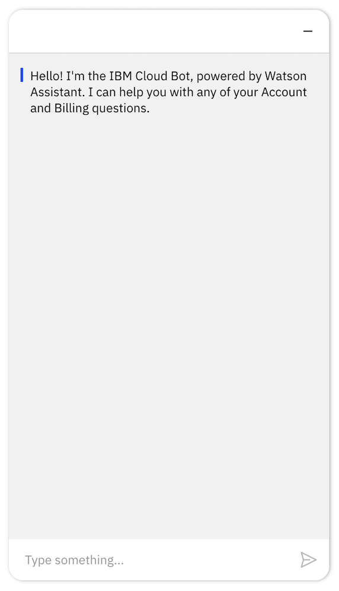

---

copyright:
  years: 2015, 2020
lastupdated: "2020-04-02"

subcollection: assistant

---

{:shortdesc: .shortdesc}
{:new_window: target="_blank"}
{:external: target="_blank" .external}
{:deprecated: .deprecated}
{:important: .important}
{:note: .note}
{:tip: .tip}
{:preview: .preview}
{:pre: .pre}
{:codeblock: .codeblock}
{:screen: .screen}
{:javascript: .ph data-hd-programlang='javascript'}
{:java: .ph data-hd-programlang='java'}
{:python: .ph data-hd-programlang='python'}
{:swift: .ph data-hd-programlang='swift'}

# Integrating with your own website 
{: #deploy-web-chat}

Add your assistant to your company website as a web chat widget that can transfer customers to human agents.
{: shortdesc}

When you create a web chat integration, code is generated that calls a script that is written in JavaScript. The script instantiates a unique instance of your assistant. You can then copy and paste the HTML `script` element into any page or pages on your website where you want users to be able to ask your assistant for help.

 This integration type is available to Plus or Premium plan users only.

## Create a Web Chat instance to add to your website
{: #deploy-web-chat-task}

To add the assistant to a web page on your company website, complete the following steps:

1.  From the Assistants page, click to open the assistant tile that you want to deply to your site.

1.  From the *Integrations* section, click the **Web Chat** tile.

1.  **Optional**: Change the Web Chat integration name from *Web Chat* to something more descriptive.

1.  Click **Create** to generate the script.

    A code snippet is created and added to the page that contains an HTML `script` element. The `script` tag calls JavaScript code that is hosted on an IBM site. The code creates an instance of a widget that communicates with the assistant. The generated code includes a region and unique integration ID. Do not change these parameter values.

1.  **Optional**: Customize the chat. You can make the following changes:

    - **Public assistant name**. Name by which the assistant is known to users. This name is displayed in the header of the chat window. The name can be up to 18 characters in length.
    - **Font family**. List one or more font styles that you want applied to the text that is displayed in the chat window. Separate multiple font names with commas. The first font family in the list is used unless the web page does not support it, in which case the next font family in the list is used. Surround font family names that include spaces with single quotation marks. For example, `Georgia,'Helvetica Neue'`. 
    
      If you don't specify a font, these fonts are used: `IBMPlexSans, Arial, Helvetica, sans-serif`. 

    - **Primary color**. Sets the color of the Web Chat header.

      Click the white dot to open a color switcher where you can choose a color. The color is saved as an HTML color code, such as `#FF33FC` for pink and `#329A1D` for green. Alternatively, you can add an HTML color code directly to the field to set the color.

    - **Secondary color**: Sets the color of the user input message bubble.

    - **Accent color**. Sets the color of interactive elements, including:

      - Chat launcher button that is embedded in your web page
      - Send button associated with the input text field
      - Input text field border when in focus
      - Marker that shows the start of the assistant’s response
      - Border of a button after it is clicked
      - Typing indicator that is shown to repesent a pause response
      - Active state for dropdown color of border

    Style changes you make are immediately applied to the preview that is shown on the page, so you can see how your choices impact the style of the chat UI.

1.  Copy the `script` HTML element.

    Do not click *Save changes* until you are done with making Web Chat edits; it closes the page.
    {: tip}

1.  Open the HTML source for a web page on your website where you want the chat window to be displayed. Paste the code snippet into the page.

    Paste the code as close to the closing `</body>` tag as possible to ensure that your page renders faster.
    {: tip}

    The following HTML snippet is the source for a test page that you can copy and save as a file with a .html extension for testing purposes. You would replace the script element block here with the script elements you copied from the Web Chat integration setup page.

    ```html
    <html>
    <head></head>
    <body>
        <title>My Test Page</title>
        <p>The body of my page.</p>
        <!-- copied script elements -->
        </body>
    </html>
    ```
    {: codeblock}

1.  Refresh the web page.

     
    
    The Web Chat launcher icon is displayed at the end of the page. The icon is blue unless you customize the accent color.

    The placement of the Web Chat icon is always the same regardless of where you paste the script element into the web page source.
    {: important}

    For information about the web browsers that are supported by the Web Chat, see [Browser Support](https://integrations.us-south.assistant.watson.cloud.ibm.com/web/developer-documentation/){: external}.

1.  Click the icon to open the chat window and talk to your assistant.

    

1.  Paste the code snippet into each web page where you want the assistant to be available to your customers.

    You can paste the same script tag into as many pages on your website as you want. Add it anywhere where you want users to be able to reach your assistant for help. However, be sure to add it only one time per page.
    {: tip}

1.  Submit test utterances from the chat widget that is displayed on your web page to see how the assistant responds.

    No responses are returned until after you create a dialog skill and add it to the assistant.
    {: note}

    If you don't extend the session timeout setting for the assistant, the dialog flow for the current session is restarted after 60 minutes of inactivity. This means that if a user stops interacting with the assistant, after 60 minutes, any context variable values that were set during the previous conversation are set to null or back to their initial values.

1.  Click **Save changes** to save the Web Chat name and any customization information that you added and close the integration page. Alternatively, you can click the **X** to close the page. 

    The Web Chat instance is created as soon as you click the *Create* button, and does not need to be saved.

## Dialog considerations
{: #deploy-web-chat-dialog}

The rich responses that you add to a dialog are displayed in the Web Chat as expected, with the following exceptions:

- **Connect to human agent**: This response type is ignored.
- **Option**: If your option list contains up to four choices, they are displayed as butttons. If your list contains five or more options, then they are displayed in a drop-down list.
- **Pause**: This response type pauses the assistant's activity in the chat. However, activity does not resume after the pause until another response is triggered. Whenever you include a `pause` response type, add another, different response type, such as `text`, after it.

For more information about rich response types, see [Rich responses](/docs/assistant?topic=assistant-dialog-overview#dialog-overview-multimedia).

## Extending the web chat
{: #deploy-web-chat-extend}

You can make more advanced customizations and extend the capability of the web chat by using the {{site.data.keyword.conversationshort}} Web Chat toolkit on [GitHub](https://integrations.us-south.assistant.watson.cloud.ibm.com/web/developer-documentation/){: external}.

If you choose to use the provided methods, you implement them by editing the code snippet that was generated earlier. You then embed the updated code snippet into your web page.

### Setting and passing context variable values
{: #deploy-web-chat-set-context}

For example, the following updated script preserves the context for the conversation. In addition, it adds an `$ismember` context variable and sets it to `true`.

```html
<script src="https://web-chat.global.assistant.watson.appdomain.cloud/loadWatsonAssistantChat.js"></script>
<script>
  // Following the v2 message API, we add some items to context.
  function preSendhandler(event) {
    event.data.context.skills['main skill'].user_defined.ismember = true;
  }
</script>
<script>
  window.loadWatsonAssistantChat({
    integrationID: '{INTEGRATION ID}',
    region: '{REGION}'
  }).then(function(instance){
    // When this promise returns, we know WatsonAssistantChat is ready.
    instance.on({ type: "pre:send", handler: preSendhandler });
    instance.render();
  });
</script>
```
{: codeblock}

You can reference the `$ismember` context variable from your dialog. For example, the following screen capture shows a dialog node that conditions on #General_Greetings. It has multiple conditioned responses. The first response checks whether the current user is a member of your Rewards Program by checking for the presence of the `$ismember` context variable. If the variable is present, the response addresses the user as a member. The next response has a more generic greeting.


### Adding user identity information
{: #deploy-web-chat-userid}

If you want to perform tasks that require you to know the user who submitted the user input, then you must pass the user ID to the web chat integration. User information is used in the following ways:

- User-based service plans use the `user_id` associated with user input for billing purposes. See [User-based plans](/docs/assistant?topic=assistant-services-information#services-information-user-based-plans). 
- The ability to delete any data created by someone who requests to be forgotten requires that a `customer_id` be associated with the user input. When a `user_id` is defined, the product can reuse it to pass a `customer_id` parameter. See [Labeling and deleting data](/docs/assistant?topic=assistant-information-security#information-security-gdpr-wa).

To support these user-based capabilities, you must add the `options.userID` method to the code snippet before you paste it into your web page.

In the following example, the user ID `L44556677` is added to the script.

```html
<script src="https://web-chat.global.assistant.watson.appdomain.cloud/loadWatsonAssistantChat.js"></script>
<script>
  window.loadWatsonAssistantChat({
    integrationID: '{INTEGRATION ID}',
    region: '{REGION}',
    userID: `L44556677`
  }).then(function(instance){
    // When this promise returns, we know WatsonAssistantChat is ready.
    instance.on({ type: "pre:send", handler: preSendhandler });
    instance.render();
  });
</script>
```
{: codeblock} 

## Adding support for transfers
{: #deploy-web-chat-haa}

Delight your customers with 360-degree support by integrating your web chat with a third-party service desk solution. 

The following service desk offerings are supported:

- [Zendesk](#deploy-web-chat-zendesk)
- [Salesforce](#deploy-web-chat-salesforce)

After you set up the service desk integration, you must update your dialog to ensure it understands user requests to speak to someone, and can transfer the conversation properly. See [Adding transfer support to your dialog](#deploy-web-chat-dialog-prereq).

### Setting up a Zendesk integration
{: #deploy-web-chat-zendesk}

Zendesk Chat lets you help customers in real time, which increases customer satisfaction. And satisfied customers are happier customers. To learn more about this service desk solution, see the [Zendesk website](https://www.zendesk.com/chat/){: external}.

Zendesk Chat is an add-on to Zendesk Support. Zendesk Support puts all your customer support interactions in one place, so communication is seamless, personal, and efficient, which means more productive agents and satisfied customers.

1.  You must have a Zendesk account. If not, create one. 

    A Zendesk Chat Enterprise plan is required.
    {: important}

1.  From the Web Chat integration page in {{site.data.keyword.conversationshort}}, switch the **Allow transfers to live agents** toggle to **On**, and then choose **Zendesk** as the service desk type, and then click **Set up**.
1.  {: #deploy-web-chat-zendesk-get-account-key}Add the account key for your Zendesk account. To get the account key for your Zendesk account, follow these steps:

    - Log in to your Zendesk subdomain.
    
    - Open the Zendesk Chat Dashboard.

       From the Zendesk Support dashboard, you can click the Chat icon in the header, and then click *Chat dashboard*.

       
    
    - Click your profile, and then click *Check Connection*.

       

    - Copy the account key value.

       

    - Paste the key into the field, and then click **Access account**.

1.  {: #deploy-web-chat-zendesk-add-private-app}Install the {{site.data.keyword.conversationshort}} private application in your Zendesk Chat subdomain.

    When you create a Zendesk Chat account, you specify a subdomain. Afterward, your Zendesk console is available from a URL with the syntax: `<subdomain>.zendesk.com`. For example, `ibm.zendesk.com`.
    
    IBM provides an application that you can install in your Zendesk Chat domain. When a customer asks to speak to a person, your assistant will share a chat summary for the transferred conversation with the Zendesk agent by using this private app.

    - Download the private application from the Zendesk Chat setup page in {{site.data.keyword.conversationshort}}.

    - Copy the credentials that are generated for you in the **Private app credentials** field. You will need them in a later step.

    - Log in to Zendesk with a user ID that has Administrative privileges.

    - Install the private application to your Zendesk Chat subdomain as a new private app. When credentials are requested, paste the private app credentials that you copied earlier. Go to *Settings > Account > Apps* to upload the private app.

      For more information, see [Uploading and installing a private app in Zendesk Chat](https://develop.zendesk.com/hc/en-us/articles/360001069347-Uploading-and-installing-a-private-app){: external}.

1.  Optionally, add an agent avatar image. Edit your profile to upload an avatar image. The image file that you upload cannot be larger than 50 x 50 pixels and 100 KB.

1.  Click **Save** to finish setting up the connection to the Zendesk Chat service desk.

When you test the service desk integration, make sure there is at least one agent with `Online` status. Agent status is set to `Invisible` unless it is explicitly changed.

<!--Watch the following 3 1/2-minute video to see someone set up a connection to a Zendesk service desk.

<iframe class="embed-responsive-item" id="youtubeplayer" title="Setting up a Zendesk service desk connection" type="text/html" width="640" height="390" src="https://www.youtube.com/embed/enTChbJY3R8" frameborder="0" webkitallowfullscreen mozallowfullscreen allowfullscreen> </iframe>-->

### Setting up a Salesforce integration
{: #deploy-web-chat-salesforce}

Salesforce is a customer relationship management solution that brings companies and customers together. It is one integrated CRM platform that gives all your departments, including marketing, sales, commerce, and service, a single, shared view of every customer.

To connect to a Salesforce service desk, your organization must have a Salesforce Service Cloud plan that supports Live Agent Chat. Chat support is available in Salesforce Service Cloud Unlimited and Enterprise plans. It is also available with Performance or Developer plans that were created after 14 June 2012.

Your organization must have a [Salesforce chat app](https://help.salesforce.com/articleView?id=dev_tabsets.htm&type=5){: external} with the following characteristics:

- Console navigation
- Navigation items: Cases, Chat sessions, Chat transcripts
- User profiles: Apply the appropriate profiles to ensure that agents can access the app and view chat history information. You can limit access to this page later. See [Profiles](https://help.salesforce.com/articleView?id=admin_userprofiles.htm&type=5){: external}.
- A [chat deployment](https://help.salesforce.com/articleView?id=live_agent_create_deployments.htm&type=5).
- A [chat button deployment](https://help.salesforce.com/articleView?id=live_agent_create_buttons.htm&type=5){: external}.
- Routing must be configured for the chat button. See [Chat routing options](https://help.salesforce.com/articleView?id=live_agent_chat_routing_options.htm&type=5){: external}. 
- If you choose omni-channel routing, be sure to include omni-channel as a utility in the chat app. See [Omni-Channel](https://help.salesforce.com/articleView?id=omnichannel_intro.htm&type=5){: external}.

You must have a level of access to your Salesforce service desk deployment that allows you to do the following things:

- Edit the chat app
- Get chat deployment and button code details
- Add custom fields to layout objects
- Create Visualforce pages

If you don't, ask someone with the appropriate level of access to perform this procedure for you.

To set up a Salesforce service desk integration, complete the following steps:

1.  From the Web Chat integration page in {{site.data.keyword.conversationshort}}, switch the **Allow transfers to live agents** toggle to **On**, and then choose **Salesforce** as the service desk type. Click **Set up**.

1.  For {{site.data.keyword.conversationshort}} to connect to a Salesforce service desk, it needs information about your organization's Salesforce chat deployment and button implementations. Specifically, it needs the API endpoint, organization ID, deployment ID, and button ID. The service can derive the values that it needs from code snippets that you copy and paste to this configuration page.
{: #deploy-web-chat-salesforce-get-deployment-info}

    - Get the deployment code for your Salesforce Agent Configuration chat deployment. 
    
      Go to the Salesforce **Setup>Chat>Deployments** page. Find your organization's deployment. Scroll to the end of the chat deployment configuration page and copy the *Deployment Code* snippet.
    - Paste the deployment code snippet into the **Deployment code** field in the {{site.data.keyword.conversationshort}} Salesforce configuration page.
    - Get the Chat Button code. 
    
      Go to the Salesforce **Setup>Chat>Chat Buttons & Invitations** page. Find your organization's button implementation. Scroll to the end of the page, and then copy the *Chat Button Code* snippet.
    - Paste the chat button code snippet into the **Chat button code** field in the {{site.data.keyword.conversationshort}} Salesforce configuration page.

1.  {: #deploy-web-chat-salesforce-add-visualforce-page}Add a chat app that enables the Salesforce agent to interact with your assistant. To do so, create a Visualforce page, and then add a chat app to the page.

    Visualforce pages are the mechanism that Salesforce provides for you to customize a live agent's console by adding your own pages to it. A Visualforce page is similar to a standard web page, but it provides ways for you to access, display, and update your organization’s data. Pages can be referenced and invoked by using a unique URL, just as HTML pages on a traditional web server can be. See [Create Visualforce Pages](https://help.salesforce.com/articleView?id=pages_creating.htm&type=5){: external}

    - Copy the code snippet from the Visualforce page markup field.
    - From Salesforce Setup, search for **Visualforce Pages**. Create a page. Add a label and name to the page, and then paste the code snippet that you copied in the previous step into the page markup field.

1.  {: #deploy-web-chat-salesforce-add-custom-fields}Add custom fields to the Salesforce chat transcript layout.

    This is a one-time task. If the fields already exist for your organization, you can skip this step.
    {: note}

    See [Create Custom Fields](https://help.salesforce.com/articleView?id=adding_fields.htm&type=5){: external}.

    From the Salesforce **Setup>Object Manager>Chat Transcript>Fields & Relationships** page, create the following custom fields:

    - **Session**: Stores a session ID that tracks ongoing conversations.

      - **Data Type**: Text
      - **Field Label**: `x-watson-assistant-session`
      - **Field Length**: 36

    - **Token**: Stores a {{site.data.keyword.conversationshort}} authentication token that secures the communication between Salesforce and your assistant.

      - **Data Type**: Text Area (Long)
      - **Field Label**: `x-watson-assistant-token`
      - **Field Length**: Specify the maximum length allowed to ensure it can hold a token that might contain over 100,000 characters.

1.  {: #deploy-web-chat-salesforce-add-page-to-layout}Add the Visualforce page that you created to the Salesforce chat app.

    To ensure the Salesforce agents can see history of the chat between the customer and your assistant, you must add the page that you created earlier into the console that they use to keep track of their work. See [Create and Configure Lightning Experience Record Pages](https://help.salesforce.com/articleView?id=lightning_app_builder_customize_lex_pages.htm&type=5){: external}.
    
    - From the Salesforce App Launcher, open the chat app that you created for your agents to talk to customers.
    - Open the *Chat Transcripts* object, and then select a transcript page.
    - Click the *Setup* icon, and then select *Edit Page*.
    - Drag the Visualforce component and drop it into the Chat Transcript Record page layout where you want the chat window to be displayed.
    - In the component editor, select the Visualforce page that you created earlier, make any adjustments to the widget height that you want, and then click *Save*.
    - Click *Activation*, and then click the APP, RECORD TYPE, AND PROFILE tab.
    - Select the apps to which you want to apply the page layout, and then click *Next*.
    - Select the appropriate record type, such as Master, and then click *Next*.
    - Select user profiles to give the appropriate set of users access to the page. Limit the group to include only those who you want to be able to view chat history information in the page. 
    - Click *Next*, and then click *Save*.

1.  From the Salesforce configuration page in {{site.data.keyword.conversationshort}}, click **Save** to finish setting up the connection.

When you test the service desk integration, make sure there is at least one agent with `Available` status.

<!--Watch the following x-minute video to watch someone set up a connection to a Salesforce service desk.

<iframe class="embed-responsive-item" id="youtubeplayer0" title="Setting up a Salesforce service desk connection" type="text/html" width="640" height="390" src="https://www.youtube.com/embed/enTChbJY3R8" frameborder="0" webkitallowfullscreen mozallowfullscreen allowfullscreen> </iframe>-->

## Adding transfer support to your dialog
{: #deploy-web-chat-dialog-prereq}

If no dialog skill is associated with your assistant, create one or add one to your assistant now. See [Building a dialog](/docs/assistant?topic=assistant-dialog-build) for more details.

Complete these steps in your dialog skill so the assistant can pass the conversation to a service desk agent when a customer asks to speak to a person.

1.  Add an intent to your skill that can recognize a user's request to speak to a human.

    You can create your own intent or add the prebuilt intent named `#General_Connect_to_Agent` that is provided with the **General** content catalog.

1.  Add a root node to your dialog that conditions on the intent that you created in the previous step. Choose **Connect to human agent** as the response type.

1.  To ensure that a useful summary is provided to service desk agents when a conversation is transferred to them, fill in the **external node name** field of the root node of each dialog branch.

      

      Every dialog branch can be processed by the assistant while it chats with a customer, including branches with root nodes in folders. Add a summary of the purpose of the dialog branch to the root node of each branch. For example, *Find a store*.

1.  If a child node in any dialog branch conditions on a follow-up request or question that you do not want the assistant to handle, add a **Connect to human agent** response type to the node.

    For example, you might want to add this response type to nodes that cover sensitive issues that only a human should handle or that track when an assistant repeatedly fails to understand a user.

    At run time, if the conversation reaches this child node, the dialog is passed to a human agent at that point.

Your dialog is now ready to support transfers from your assistant to service desk agents.
