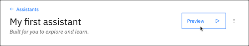

---

copyright:
  years: 2015, 2021
lastupdated: "2021-05-21"

subcollection: assistant

---

{:shortdesc: .shortdesc}
{:new_window: target="_blank"}
{:deprecated: .deprecated}
{:important: .important}
{:note: .note}
{:tip: .tip}
{:pre: .pre}
{:codeblock: .codeblock}
{:screen: .screen}
{:javascript: .ph data-hd-programlang='javascript'}
{:java: .ph data-hd-programlang='java'}
{:python: .ph data-hd-programlang='python'}
{:swift: .ph data-hd-programlang='swift'}

{{site.data.content.newlink}}

# Testing your assistant
{: #deploy-web-link}

Use the assistant preview to test your assistant.
{: shortdesc}

The assistant preview renders your assistant as a web chat embedded in a preview web page. You can test the skills that you added to the assistant by entering text into the chat window. You can copy and paste the web page URL into a web browser and share the page with others to enlist help in testing and getting feedback about the assistant.

Unlike when you test a skill using the "Try it out" pane, any API calls that result from your interactions with the assistant hosted by the assistant preview might incur charges.

## Using the assistant preview to test your assistant
{: #deploy-web-link-try}

To test the assistant from a web-hosted chat widget, complete the following steps:

1.  From the Assistants page, click to open the assistant tile that you want to test.

1.  Click **Preview**.

    

     For environments where private endpoints are in use, keep in mind that the preview sends traffic over the internet. For more information, see [Private network endpoints](/docs/assistant?topic=assistant-security#security-private-endpoints).
    {: note}

1.  In the "Assistant preview" pane, submit test utterances to see how the assistant responds.

    If the *Connect to agent* response is displayed, it means you do not have a conversational skill added to your assistant. You must add one before you can chat with the assistant.
    {: important}

1.  You can click the **Restart conversation** button to start a conversation over.

    This action is useful if you want to test different routes through a single conversational flow. Or if you set or change context variable values in a dialog skill and want to see how specifying different values affects the conversation.

    The conversation is restarted after the assistant's inactivity period elapses. The inactivity period can range from 5 minutes to 7 days depending on what you configure for your service plan type. After the intactivity time frame passes, any context variable values that were set during the conversation are set to null or back to their default values. For more information, see [Changing the inactivity timeout setting](/docs/assistant?topic=assistant-assistant-settings#assistant-settings-change-timeout).

1.  To test the assistant from a separate web page, copy and paste the *Share this link* URL into a web browser.

    A simple IBM-branded web page is displayed that contains a chat window where you can interact with your assistant. You can share the page with others by sending them the *Share this link* URL.

    Previewing your assistant within the {{site.data.keyword.conversationshort}} user interface does not incur any charges. If you use the *Share this link* URL to preview the assistant from elsewhere, you might be charged for messages that you submit, according to the terms of your plan. You can review metrics about the test user conversations from the Analytics page.
    {: important}

1.  Click **X** to close the Preview page.

## Dialog considerations
{: #deploy-web-link-dialog}

The rich responses that you add to a dialog are displayed in the web-hosted chat widget as expected, with the following exceptions:

- **Connect to human agent**: This response type is ignored.

- **Pause**: This response type pauses the assistant's activity in the chat widget. However, activity does not resume after the pause until another response is triggered. Whenever you include a `pause` response type, add another, different response type, such as `text`, after it.

See [Rich responses](/docs/assistant?topic=assistant-dialog-overview#dialog-overview-multimedia) for more information about response types.
