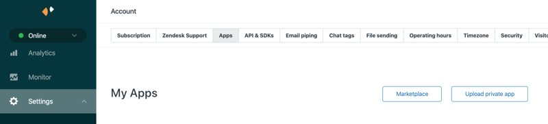

---

copyright:
  years: 2020, 2021
lastupdated: "2021-07-29"

subcollection: assistant

---

{:shortdesc: .shortdesc}
{:new_window: target="_blank"}
{:external: target="_blank" .external}
{:deprecated: .deprecated}
{:important: .important}
{:note: .note}
{:tip: .tip}
{:preview: .preview}
{:pre: .pre}
{:codeblock: .codeblock}
{:screen: .screen}
{:javascript: .ph data-hd-programlang='javascript'}
{:java: .ph data-hd-programlang='java'}
{:python: .ph data-hd-programlang='python'}
{:swift: .ph data-hd-programlang='swift'}
{:video: .video}

# Integrating with Zendesk
{: #deploy-zendesk}

Integrate your web chat with a Zendesk service desk solution so your customers always get the help they need.
{: shortdesc}

Integrate with a Zendesk service desk by deploying your assistant with the web chat integration. The web chat serves as the client interface for your assistant. If, in the course of a conversation with your assistant, a customer asks to speak to a person, you can transfer the conversation directly to a Zendesk agent.

Zendesk Chat lets you help customers in real time, which increases customer satisfaction. And satisfied customers are happier customers. To learn more about this service desk solution, see the [Zendesk website](https://www.zendesk.com/chat/){: external}.

Zendesk Chat is an add-on to Zendesk Support. Zendesk Support puts all your customer support interactions in one place, so communication is seamless, personal, and efficient, which means more productive agents and satisfied customers.

## Before you begin
{: #deploy-zendesk-prereqs}

1.  You must have a Zendesk account. If not, create one. 

    A Zendesk Chat Enterprise plan is required.
    {: important}

1.  Decide whether you want to enable security.

    If you choose to enable security in Zendesk, you must collect the name and email address of each user. This information must be passed to the web chat so it can be provided to Zendesk when the conversation is transferred.

## Setting up the Zendesk service desk connection
{: #deploy-zendesk-task}

To set up a Zendesk service desk integration, complete the following steps:

1.  Create a web chat integration. For more information, see [Integrating the web chat with your website](/docs/assistant?topic=assistant-deploy-web-chat).

1.  From the web chat integration page in {{site.data.keyword.conversationshort}}, set the **Allow transfers to live agents** switch to **On**, and then choose **Zendesk** as the service desk type, and then click **Next**.
1.  {: #deploy-zendesk-get-account-key}Add the account key for your Zendesk account, and then click **Next**.

    To get the account key for your Zendesk account, follow these steps:

    - Log in to your Zendesk subdomain.
    
    - Open the Zendesk Chat Dashboard.

       From the Zendesk Support dashboard, you can click the *Zendesk Products* icon in the header, and then click the *Chat* icon.

       
    
    - Click your profile, and then click *Check Connection*.

       

    - Copy the account key value.

       

    - Return to the setup page in {{site.data.keyword.conversationshort}}, and then paste the key into the field.

1.  {: #deploy-zendesk-add-private-app}Install the {{site.data.keyword.conversationshort}} private application in your Zendesk Chat subdomain.

    When you create a Zendesk Chat account, you specify a subdomain. Afterward, your Zendesk console is available from a URL with the syntax: `<subdomain>.zendesk.com`. For example, `ibm.zendesk.com`.
    
    IBM provides an application that you can install in your Zendesk Chat domain. When a customer asks to speak to a person, your assistant will share a chat summary for the transferred conversation with the Zendesk agent by using this private app.

    - Download the Watson Assistant Zendesk application from the Zendesk Chat setup page in {{site.data.keyword.conversationshort}}.

      On Safari, the application files are extracted from the ZIP file into a folder. To keep the file archived as a .zip file, so you can upload it later, edit the Safari preferences. Clear the *Open safe files after downloading* checkbox.
      {: note}

    - Log in to Zendesk with a user ID that has administrative privileges.

    - Install the Watson Assistant Zendesk app to your Zendesk Chat subdomain as a new private app. 
    
      - First, make sure the Zendesk Agent Workspace is not enabled for your account: From the Zendesk navigation pane, go to *Settings*, and then click *Agents*. Deselect the *Enable the Zendesk Agent Workspace* checkbox. 
      - Then download the app. From the Chat dashboard navigation pane, expand *Settings*, and then click *Account*.
      - Open the *App* tab.
      - Click *Upload private app*, and then browse for the application file that you downloaded earlier.

      

      For more information, see [Uploading and installing a private app in Zendesk Chat](https://develop.zendesk.com/hc/en-us/articles/360001069347-Uploading-and-installing-a-private-app){: external}.

1.  Click **Save and exit** to finish setting up the connection to the Zendesk Chat service desk.

When you test the service desk integration, make sure there is at least one agent with `Online` status. Agent status is set to `Invisible` unless it is explicitly changed.

Watch the following 4-minute video to see someone set up a connection to a Zendesk service desk.

The product user interface is slightly different from the interface that is shown in the video. However, the main steps are the same.
{: note}

{: video output="iframe" id="youtubeplayer" frameborder="0" width="560" height="315" webkitallowfullscreen mozallowfullscreen allowfullscreen}

To read a transcript of the video, [open the video on YouTube.com](https://www.youtube.com/watch?v=hegheiqUqiM&feature=emb_imp_woyt), click the *More actions* icon, and then choose *Open transcript*.

## Securing the transfer to Zendesk
{: #deploy-zendesk-secure}

When you add security to your Zendesk integration, you ensure that the visitors you are helping are legitimate customers. Enabling visitor authentication also enables support for cross-domain traffic and cross-browser identification. For more information, see the [Zendesk documentation](https://support.zendesk.com/hc/en-us/articles/360022185314-Enabling-authenticated-visitors-in-the-Chat-widget).

Before you can secure the Zendesk connection, complete the following required tasks:

1.  {: #deploy-zendesk-secure-prereqs}Secure the web chat. For more information see [Securing the web chat](/docs/assistant?topic=assistant-web-chat-security).
1.  Encrypt sensitive information that you pass to the web chat. 

    When you enable security in Zendesk, you must provide the name and email address of the current user with each request. Configure the web chat to pass this information in the payload.

    Specify the information by using the following syntax. Use the exact names (`name` and `email`) for the two name and value pairs.

    ```yaml
    {
    user_payload : {  
             name: '#{customerName}',
             email: '#{customerEmail}'
      }
    }     
    ```
    {: codeblock}

    For more information, see [Passing sensitive data](/docs/assistant?topic=assistant-web-chat-security#web-chat-security-encrypt).

    Zendesk also expects `iat` and `external_id` name and value pairs. However, there's no need for you to provide this information. IBM automatically provides a JWT that contains these values.

    For example:

    ```json
    const userPayload = {
     "name" : "Cade Jones",
     "email" : "cade@example.com",
    }
    ```
    {: codeblock}

    ```javascript
    // Sample NodeJS code on your server.
    const jwt = require('jsonwebtoken');
    const RSA = require('node-rsa');

    const rsaKey = new RSA(process.env.PUBLIC_IBM_RSA_KEY);

    /**
    * Returns a signed JWT. Optionally, adds an encrypted user_payload in stringified JSON.
    */
    function mockLogin(userID, userPayload) {
        const payload = {
          sub: userID, // Required
          iss: 'www.ibm.com', // Required
          acr: 'loa1' // Required
          // A short-lived exp claim is automatically added by the jsonwebtoken library.
        };
        if (userPayload) {
            // If there is a user payload, it is encrypted in base64 format using the IBM public key.
            payload.user_payload = rsaKey.encrypt(userPayload, 'base64');
        }
        const token = jwt.sign(payload, process.env.YOUR_PRIVATE_RSA_KEY, { algorithm: 'RS256', expiresIn: '10000ms' });
        return token;
        }
    ```
    {: codeblock}

1.  From the Zendesk application, enable visitor authentication.

    - From the Chat dashboard navigation pane, expand *Settings*, and then click *Widget*.
    - Open the *Widget security* tab.
    - In the *Visitor Authentication* section, click the *Generate* button.

    For more information, see [Enabling authenticated visitors in the Chat widget](https://support.zendesk.com/hc/en-us/articles/360022185314-Enabling-authenticated-visitors-in-the-Chat-widget){: external}. You do not need to follow the steps to create a JWT. The Assistant service generates a JSON Web Token for you.
1.  Copy the shared secret from Zendesk.

To secure the Zendesk connection, complete the following steps:

1.  {: #deploy-zendesk-secure-task}In the *Authenticate users* section, set the switch to **On**.

1.  Paste the secret that you copied from the Zendesk setup page into the **Zendesk shared secret** field.

1.  {: #deploy-zendesk-secure-anonymous}Decide whether to allow unidentified users to access Zendesk.

    The web chat integration allows anonymous users to initiate chats. However, as soon as you enable visitor authentication, Zendesk requires that the name and email of each user be provided. If you try to connect without passing the required information, the connection will be refused. 

    If you want to allow anonymous users to connect to Zendesk, you can provide fictitious name and email data. Write a function to populate the two fields with fictitious name and email values.

    For example, your function must check whether you know the name and email of the current user, and if not, add canned values for them:

    ```json
    const userPayload = {
     "name" : "Jane Doe1",
     "email" : "jdoe1@example.com",
    }
    ```
    {: codeblock}

    After writing a function that ensures that name and email values are always provided, set the *Authenticate anonymous user chat transfers* switch to **On**.

## Adding transfer support to your dialog
{: #deploy-zendesk-dialog-prereq}

Update your dialog to make sure it understands when users request to speak to a person, and can transfer the conversation properly. For more information, see [Adding chat transfer support](/docs/assistant?topic=assistant-dialog-support#dialog-support-transfers).

## Adding routing logic for transfers
{: #deploy-zendesk-routing}

When you enable transfers to the Zendesk service desk, no routing preferences are specified. The conversation is sent to any available agent. However, there might be times when you want to route a customer to a specific Zendesk department. For example, your dialog might have a root dialog node that conditions on a `#close_account` intent. For that branch of the conversation only, you want to transfer customers to agents in the Sales department who are authorized to offer incentives as a way to retain customers. You can direct transfers to specific departments by adding routing logic to your dialog.

You can specify alternate routing preferences based on:

- browser information
- the current topic of conversation

### Routing based on browser information
{: #deploy-zendesk-routing-browser-info}

When a customer interacts with the web chat, information about the current web browser session is collected. For example, the URL of the current page is collected. You can use this information to add custom routing rules to your dialog. For example, if the customer is on the Products page when a transfer to a human is requested, you might want to route the chat transfer to agents who are experts in your product portfolio. If the customer is on the Returns page, you might want to route the chat transfer to agents who know how to help customers return merchandise. 

For more information, see [Web chat: Accessing browser information](/docs/assistant?topic=assistant-dialog-integrations#dialog-integrations-chat-browser-info).

### Routing by topic
{: #deploy-zendesk-routing-topic}

You can specify a routing preference for specific topics of conversation in your dialog. When specified, the chat is transferred to the department that you designate. You can choose a department that you know has agents who are best able to address the topic.

Before you perform this procedure, determine which department you want users to be routed to.

To add custom routing logic, complete the following steps:

1.  From the *Dialog* page, find the root dialog node for the branch of the conversation that you want to route to a specific Zendesk department.

1.  Find the dialog node in the branch where you want the transfer to take place, and then add the *Connect to human agent* response type as the dialog node response type.

    For more information, see [Adding a *Connect to human agent* response type](/docs/assistant?topic=assistant-dialog-overview#dialog-overview-add-connect-to-human-agent).

1.  After you add the response type and customize the transfer messages, select *Zendesk* from the **Service desk routing** field.

1.  In the **Department** field, add the department to which you want the assistant to transfer customers who want to discuss this topic. For example, `sales`.

    Be sure to specify the exact right syntax for the department name. The value is not validated by the service as you add it to your dialog.
    {: note}
