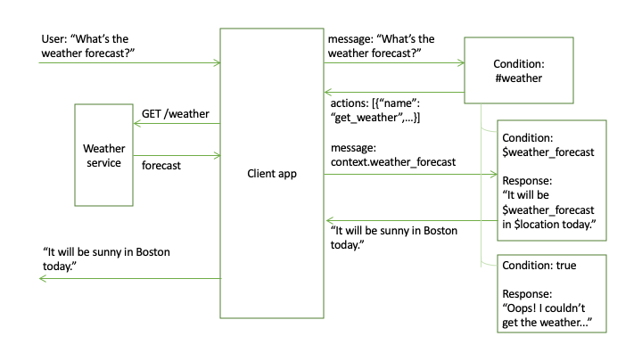
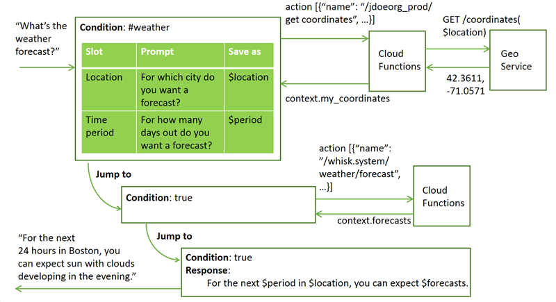

---

copyright:
  years: 2015, 2019
lastupdated: "2019-03-25"

subcollection: assistant

---

{:shortdesc: .shortdesc}
{:new_window: target="_blank"}
{:deprecated: .deprecated}
{:important: .important}
{:note: .note}
{:tip: .tip}
{:pre: .pre}
{:codeblock: .codeblock}
{:screen: .screen}
{:javascript: .ph data-hd-programlang='javascript'}
{:java: .ph data-hd-programlang='java'}
{:python: .ph data-hd-programlang='python'}
{:swift: .ph data-hd-programlang='swift'}

# Making programmatic calls from a dialog node 
{: #dialog-actions}

Define actions that can make programmatic calls to external applications or services and get back a result as part of the processing that occurs within a dialog turn.
{: shortdesc}

You can use an external service to do the following types of things:
- Validate information that you collected from the user.
- Do calculations or string manipulations on user input that are too complex for supported SpEL expression methods to handle.
- Interact with an external web service to get information. For example, you might check on the expected arrival time for a flight from an air traffic service or get a forecast from a weather service.
- Send requests to an external application, such as a restaurant reservation site, to complete a simple transaction on the user's behalf.

<iframe class="embed-responsive-item" id="youtubeplayer" title="Calling IBM Cloud Functions" type="text/html" width="640" height="390" src="https://www.youtube.com/embed/y0A6X-KNoB8?rel=0" frameborder="0" webkitallowfullscreen mozallowfullscreen allowfullscreen> </iframe>

When you define the programmatic call, you choose one of the following types:

- **client**: Defines a programmatic call in a standardized format that your external client application can understand. Your client application must use the provided information to run the programmatic call or function, and return the result to the dialog. This type of call basically tells the dialog to pause here and wait for the client application to go do something. The program that the client application runs can be anything that you choose. Be sure to specify the call name and parameter details, and the error message variable name, according to the JSON formatting rules that are outlined later.

- **cloud_function**: Calls an {{site.data.keyword.openwhisk_short}} action directly, and returns the result to the dialog. You must provide a {{site.data.keyword.openwhisk_short}} authentication key with the call. (This type used to be named **server**. The type **server** continues to be supported.)

- **web_action**: Calls a {{site.data.keyword.openwhisk_short}} web action. Web actions are annotated {{site.data.keyword.openwhisk_short}} actions that developers can use to program backend logic that a web application can access anonymously, without requiring a {{site.data.keyword.openwhisk_short}} authentication key. Although authentication isn't required, web actions can be secured in the following ways:

  - With an authentication token that is specific to the web action, and can be revoked or changed by the action owner at any time
  - By passing your {{site.data.keyword.openwhisk_short}} credentials

All of the {{site.data.keyword.openwhisk_short}} action types (web_action and cloud_function or server) incur a cost. The cost of activating the action is charged to the person who owns the credentials that are specified in the action call. See [Pricing ](https://cloud.ibm.com/openwhisk/learn/pricing){: new_window} for more details. The {{site.data.keyword.openwhisk_short}} service does not distinguish between calls that are made from the "Try it out" pane during testing and calls that are made from an application in production. Therefore, calls made during testing might incur charges.
{: note}

## Procedure
{: #dialog-actions-call}

To make a programmatic call from a dialog node, complete the following steps:

1.  In the dialog node from which you want to make the programmatic call, open the JSON editor.

    - To make a programmatic call that runs after the response for a node is evaluated, open the JSON editor for the node response.

      

      If the **Multiple responses** setting is **On** for the node, then you must click the **Edit response**  icon for the **Options**  menu to be visible.

      

    If you want to display or further process the response from the external service within the same dialog turn, then you must add a second node that does so, and jump to it from this node.
    {: tip}

    - To make a call that can be used by an individual slot, click the **Edit slot** icon  for the slot, and then do one of the following things:

      - To make a programmatic call that runs after the slot condition is evaluated to true, open the JSON editor that is associated with the slot condition.

        

      - To make a programmatic call that runs after the slot is successfully filled, open the JSON editor that is associated with the Found response. To do so, from the **Options**  menu for the slot, click **Enable conditional responses**. For the Found response, click the **Edit response**  icon. From the **Options**  menu for the Found response, click **Open JSON editor**.

        

1.  Use the following syntax to define the programmatic call.

    ```json
    {
      "context": {
        "variable_name" : "variable_value"
      },
      "actions": [
        {
          "name":"<actionName>",
          "type":"client | cloud_function | server | web_action",
          "parameters": {
            "<parameter_name>":"<parameter_value>",
            "<parameter_name>":"<parameter_value>"
          },
          "result_variable": "<result_variable_name>",
          "credentials": "<reference_to_credentials>"
        }
      ],
      "output": {
        "text": "response text"
      }
    }
    ```
    {: codeblock}

    The `actions` array specifies the programmatic calls to make from the dialog. It can define up to five separate programmatic calls. Specify the following name and value pairs in the JSON array:

    - `<actionName>`: Required. The name of the action or service to call. The name cannot be longer than 256 characters.

       - For client action types, specify a name in whatever syntax you want. The goal is to specify a name that your client application will recognize and know how to handle.

          For example: `calculateRate`

       - For cloud_function (or server) and web_action types, use this syntax to provide the fully qualified name of the action: `/<namespace>/[<package-name>]/<action name>`

         - If a standard action is part of a package, then the `<package-name>` information is required. Otherwise, a package name is not required.
         - If a web action is part of a package, then the `<package-name>` information is required. Otherwise, the package name `default`, which is applied to web actions that do not have a package name, is required.
         - If you are calling a sequence of actions, then specify the `<sequence name>` in place of the `<action name>`.
         - The namespace for a user-defined action typically has the syntax: `<myIBMCloudOrganizationID>_<myIBMCloudSpace>`. For example: `/jdoeorg_prod10/search flights`
         - The actions that are provided with {{site.data.keyword.openwhisk_short}} often have the namespace: `whisk.system`, but verify the namespace first to be sure. For example: `/whisk.system/weather/forecast`

    - `<type>`: Indicates the type of call to make. Choose from the following types:

      - **client**: Sends a message response with programmatic call information in a standardized format that your external client application understands. Your client application must use the provided information to run the programmatic call or function, and return the result to the dialog. The JSON object in the response body specifies the service or function to call, any associated parameters to pass with the call, and the format of the result to send back.

      - **cloud_function**: Calls a {{site.data.keyword.openwhisk_short}} action (one or more) directly. You must define the action itself separately by using {{site.data.keyword.openwhisk}}. For more information, see [Creating an action](#dialog-actions-create). (This type used to be named **server**. The **server** type continues to be supported.)

      - **web_action**: Calls a {{site.data.keyword.openwhisk_short}} web action (one or more) directly. You must define the web action itself separately by using {{site.data.keyword.openwhisk}}. For more information,  see [Creating an action](#dialog-actions-create).

      Specifying the type is optional. The default value is `client`.

    - `<action_parameters>`: Any parameters that are expected by the external program, which are specified as a JSON object. Parameters are only required if the external program requires them.

    - `<result_variable_name>`: The name to use to reference the JSON object that is returned by the external service or program. The result is added to the context section of the /message response. In other words, the result is stored as a context variable so it can be displayed in the node response or accessed by dialog nodes that are triggered later. Any existing value for the context variable is overwritten by the value that is returned by the action. You can specify the `result_variable_name` by using the following syntax:

      - `my_result`
      - `$my_result`

      The name cannot be longer than 64 characters. The variable name cannot contain the following characters: parentheses `()`, brackets (`[]`), a single quotation mark (`'`), a quotation mark (`"`), or a backslash (`\`).

      If you want to save the result to the output or input section of the /message response, then you can add one of the following location keywords as a prefix to the `result_variable_name`:

       - `output.`: Adds the result to the output section of the /message response. For example, `output.my_result`.
       - `input.`: Adds the result to the input section of the /message response. For example, `input.my_result`.

      You can specify a `context.` location keyword prefix also. For example, `context.my_result`. However, you do not need to because the result is added to the context by default.

      You can include periods in the variable name to create a nested JSON object. For example, you can define these variables to capture results from two separate requests to a weather service for forecasts for today and tomorrow:

      - `context.weather.today`
      - `context.weather.tomorrow`

      The results (`temp` and `rain` parameter values) are stored in the context in this structure:

      ```json
      {
        "weather": {
          "today": {
            "temp": "20",
            "rain": "30"
          },
          "tomorrow": {
            "temp": "23",
            "rain": "80"
          }
        }
      }
      ```
      {: codeblock}

      If multiple actions in a single JSON action array add the result of their programmatic call to the same context variable, then the order in which the context is updated matters:

      1.  If you have a combination of server (cloud_function or web_action) and client actions in the array, the service processes the server type (cloud_function or web_action) actions first. As a result, the value that is calculated for the context variable by the last client type action in the array overwrites the value calculated for it by any server type actions.

      1.  Per action type, the order in which the actions are defined in the array determines the order in which the context variable's value is set. The context variable value returned by the last action in the array overwrites the values calculated by any other actions.

    - `<reference_to_credentials>`: The name of the object in which the {{site.data.keyword.openwhisk_short}} credentials are stored. Required for actions of type server or cloud_function only.

      These credentials are used to access the {{site.data.keyword.openwhisk_short}} instance on which the action runs. These are not your {{site.data.keyword.Bluemix_notm}} credentials.

      To discover the credentials, complete the following steps:
      1.  Go to the [{{site.data.keyword.openwhisk_short}} API key ](https://cloud.ibm.com/openwhisk/api-key){: new_window} page.

          - If you have not yet created an account, do so.
          - If you are not logged in, log in.

      1.  Click the **Show Auth Key** icon  to show the credentials. The segment before the colon (:) is your user ID. The segment after the colon is your password.

      Any charges that are incurred when the action runs are charged to the person who owns these credentials.
      {: note}

      When you use built-in integrations to deploy the assistant, there is no way to pass the credentials to the dialog. You must store them as context variable values in a dialog node that will be triggered before the programmatic call itself is made. As a result, the credentials are visible in the JSON file that represents the skill, which can be downloaded by anyone with access to your skills.
      {: important}

      You can prevent the information from being stored in Watson logs by nesting your context variable within the $private section of the message context. For example: `$private.my_credentials`. However, storing the credentials in the private object hides them from the logs only. The information is still stored in the underlying JSON object. Do not allow this information to be exposed to the client application.

      Consider using one of these approaches to protect credentials:

      - If using a custom client application, implement an architecture that prevents the client application from calling the API directly. For example, use an app server that calls the {{site.data.keyword.conversationshort}} API REST endpoint and passes only the JSON output object from your app server to your client application.
      - Use web actions with no authentication.
      - Limit exposure by authenticating the call with a token that is specific to the web action only.

      The credentials object that you define must contain valid {{site.data.keyword.openwhisk_short}} credentials. How you specify them varies depending on the location in which the service is hosted and the authentication method used by instances in that location. The methods include:

      ```json
      {
        "user":"5tj3b41j-bf3j-5d92-24g9-4a7769ab12af",
        "password":"y65gqSTSRzqE..."
      }
      ```
      {: codeblock}

      or

      ```json
      {
        "api_key":"user:password"
      }
      ```
      {: codeblock}

      While testing the dialog, you can temporarily set the `$private.my_credentials` context variable with your real {{site.data.keyword.openwhisk_short}} username and password values by clicking **Manage context** from the "Try it out" pane in the tool.

      

      {{site.data.keyword.openwhisk_short}} does not distinguish between calls that are made from the "Try it out" pane during testing and calls that are made from an application in production. Calls made during testing might incur charges.
      {: note}

## Creating an action
{: #dialog-actions-create}

If you choose to define an action or web action type programmatic call, then before you can call it from a dialog, you must create it in {{site.data.keyword.openwhisk}}. If you are defining a client type programmatic call, then skip this procedure.

**Location restrictions**: Currently, you can call a {{site.data.keyword.openwhisk_short}} action from {{site.data.keyword.conversationshort}} service instances that are hosted in data centers in the Dallas, Frankfurt, London, and Washington DC locations only. The {{site.data.keyword.conversationshort}} service uses the {{site.data.keyword.openwhisk_short}} instance that is hosted in the same location only. It does not check {{site.data.keyword.openwhisk_short}} instances hosted in other locations. Therefore, do not call an action from a {{site.data.keyword.conversationshort}} service instance hosted in Dallas if the action is defined in a {{site.data.keyword.openwhisk_short}} instance that is hosted in Washington, DC, for example. Keep in mind that {{site.data.keyword.conversationshort}} service instances that were created in London before December 13, 2018 were syndicated to the Dallas data center. Such instances can only find {{site.data.keyword.openwhisk_short}} actions that are also hosted in Dallas.
{: important}

**Time limits**: Only use the **cloud_function**, **server**, and **web_action** types to make a call that you know can return in **under 5 seconds**. The request to {{site.data.keyword.openwhisk_short}} times out if an individual service call takes longer than that. And if your dialog makes more than one call to an external service, the total amount of time allowed for the calls to complete is 7 seconds. If the first three calls complete in 2 seconds each, and the fourth takes more than 1 second, then the fourth call is stopped, and the error message for the call indicates that the call was not completed. For less efficient services that you need to call, manage the call through your client application and pass the information to the dialog as a separate step.

To create a {{site.data.keyword.openwhisk_short}} action, complete the following steps:

1.  Go to the [online {{site.data.keyword.openwhisk_short}} editor ](https://cloud.ibm.com/openwhisk/create){: new_window}, where you can write your code directly in your browser.

    There is also a [command line interface ](https://cloud.ibm.com/openwhisk/learn/cli){: new_window} you can install that enables you to define an action using code you write locally.

1.  Create one of the following types of actions:

    - **{{site.data.keyword.openwhisk_short}} action**: See [Creating and invoking actions ](/docs/openwhisk?topic=cloud-functions-openwhisk_actions){: new_window} for details.
    - **{{site.data.keyword.openwhisk_short}} web action**: See [Creating web actions ](/docs/openwhisk?topic=cloud-functions-openwhisk_webactions){: new_window} for details.

    Keep the following tips in mind:

    - To make a call to a Watson service, use the [Watson Developer Cloud SDK ](https://github.com/watson-developer-cloud){: new_window} for the language you want to use.
    - Make sure your {{site.data.keyword.openwhisk_short}} action accepts any input parameters as a JSON object, and returns any output as a JSON object.
    - If you are using Node.js to write your {{site.data.keyword.openwhisk_short}} action, make sure you use `Promise` for asynchronous processing. Also make sure you return the final result from the `main` function.

    Alternatively, you can create a sequence of actions.
    {: tip}

## Handling errors
{: #dialog-actions-handle-errors}

If the {{site.data.keyword.openwhisk_short}} action encounters an error, the error message is returned to the dialog and is stored as a property of the response variable named `cloud_functions_call_error`. The error might occur if your {{site.data.keyword.openwhisk_short}} action cannot get a response from an external service, or if the Cloud Function action fails, for example. If the Cloud Function credentials are not provided or are incorrect, an error is returned. This context variable is used for server actions only; in your client application, consider creating a similar object that captures error information and returns it to the dialog as a context variable.

You can condition the dialog node response to first check for errors. For example, you can ensure that the response that references a {{site.data.keyword.openwhisk_short}} action result is shown only if no errors were encountered by adding this expression to the response condition:

```bash
  $forecast_result.cloud_functions_call_error == null
```
{: codeblock}

For a client type programmatic call, you can pass information about error processing by defining a context variable, such as `action_error`. You can pass it back to the service as part of the result variable. Then, you can display a response only if no errors were encountered by defining a response condition like this:

```bash
  $forecast_result.action_error == null
```
{: codeblock}

## Client call example
{: #dialog-actions-client-example}

The following example shows what a call to an external weather service might look like. It is added to the JSON editor that is associated with the node response. By the time the node-level response is triggered, slots have collected and stored the date and location information from the user. This example assumes that the service that will be called has an endpoint named `/weather`, and that it takes `location` and `date` parameters, and returns a JSON object, `{"forecast": "<value>"}`.

 ``` json
{
  "actions": [
    {
      "name": "MyWeatherFunction",
      "type": "client",
      "parameters": {
        "date": "$date",
        "location": "$location"
      },
      "result_variable": "context.my_forecast"
    }
  ]
}
```
{: codeblock}

Normally, the service only returns to the client from a POST /message request when new user input is required, such as after executing a parent and before executing one of its child nodes. However, if you add a client action to a node, then after evaluation, the service always returns to the client so that the result of the action call can be returned. To prevent waiting for user input when it should not, such as for a node that is configured to jump directly to a child node, the service adds the following value to the message context:

```json
  {
    "context": {
      "skip_user_input": true
    }
  }
```
{: codeblock}

If you want the client to perform an action, but not get user input, then you can follow the same convention, and add the `skip_user_input` context variable to the parent node to communicate that to the client application.

Your client application should always check for the `skip_user_input` variable on context. If present, then it knows not to request new input from the user, but instead execute the action, add its result into the message, and pass it back to the service. The new POST message request should include the message returned by the previous POST message response (namely, the context, input, intents, entities, and optionally the output section) and, instead of the JSON object that defines the programmatic call to make, it should include the result that was returned from the programmatic call.

In a child node that you jump to after this node, add the response to show the user:

``` json
{
  "output": {
    "text": {
      "values": [
        "It will be $my_forecast $date.literal in $location.literal."
      ]
    }
  }
```
{: codeblock}

The following diagram illustrates how you can use a client call to get weather forecast information, and return it to the user.



## IBM Cloud Functions action call example
{: #dialog-actions-server-example}

The following example shows what a call to a {{site.data.keyword.openwhisk_short}} action might look like. This example shows how to use the {{site.data.keyword.openwhisk_short}} `echo` action that is defined in the [Utilities package ](/docs/openwhisk?topic=cloud-functions-openwhisk_create_action_sequence){: new_window} provided with the service. The action takes a text string, and returns it.

``` json
{
  "actions": [
    {
      "name": "/whisk.system/utils/echo",
      "type":"cloud_function",
      "parameters": {
        "message": "<?input.text?>"
      },
      "result_variable": "context.my_input_returned",
      "credentials":"$private.my_credentials"
    }
  ]
}
```
{: codeblock}

The output of the {{site.data.keyword.openwhisk_short}} action, which is stored in the `context.my_input_returned` variable, can now be accessed by subsequent dialog nodes.

``` json
 {
  "output": {
    "text": {
      "values": [
        "Your input was: $my_input_returned."
      ]
    }
  }
}
```
{: codeblock}

The following diagram illustrates how to call a {{site.data.keyword.openwhisk_short}} action with a simple example that calls the built-in {{site.data.keyword.openwhisk_short}} echo service. It asks the user for input and passes it to the echo service. The echo service returns the same text back, which is displayed to the user.


### Echo action example
{: #dialog-actions-echo-example}

To see a dialog skill with a dialog that is already set up to call the {{site.data.keyword.openwhisk_short}} built-in Echo action, complete the following steps:

1.  Download the [CloudFunctionsEcho.json ](https://raw.githubusercontent.com/watson-developer-cloud/community/master/watson-assistant/cloud-functions-echo.json){: new_window} file.
1.  Import the JSON file as a new dialog skill.
1.  Review the dialog to see how the call to the Echo action is specified.
1.  From the "Try it out" pane, click **Manage context**, and then (temporarily) set the context variables to your {{site.data.keyword.openwhisk_short}} username and password.

    ```json
    $private.my_credentials
    {
      "user":"<your-CF-instance-username>",
      "password":"<your-CF-instance-password>"
    }
    ```
    {: codeblock}

    or

    ```json
    $private.my_credentials
    {
      "api_key":"user:password"
    }
    ```
    {: codeblock}

1.  Test the dialog by entering some input.

    The service will use the {{site.data.keyword.openwhisk_short}} Echo action to repeat whatever you enter back to you.

## IBM Cloud Functions web action call example
{: #dialog-actions-web-action-example}

The following example shows what a call to a web action might look like. This example shows how to pass a user name to a simple greeting service. The service returns a greeting that addresses the user by name.

  ``` json
  {
    "actions": [
      {
        "name": "jdoe@example.com_sales/default/hello.json",
        "type":"web_action",
        "parameters": {
          "name": "<? context['name'] ?>"
        },
        "result_variable": "context.greet_user",
        "credentials": "<See below>"
      }
    ]
  }
  ```
  {: codeblock}

  where `"credentials"` is specified in one of the following ways:

  - No authentication:

    ```json
    "credentials": null
    ```
    {: screen}

  - Authenticating with your {{site.data.keyword.openwhisk_short}} credentials

    ```json
    "credentials": "$private.my_credentials"
    ```
    {: screen}

    where `$private.my_credentials` is defined as follows:

    ```json
    $private.my_credentials
    {
      "user":"<your-CF-instance-username>",
      "password":"<your-CF-instance-password>"
    }
    ```
    {: screen}

    or 

    ```json
    $private.my_credentials
    {
      "api_key":"username:password"
    }
    ```
    {: screen}
  
  - Authenticating with a token that is specific to the web action

    ```json
    "credentials": "$private.my_credentials"
    ```
    {: screen}

    where `$private.my_credentials` is defined as follows:

    ```json
    $private.my_credentials
    {
      "web_action_key":"<action-secret>"
    }
    ```
    {: screen}

The output of the web action, which is stored in the `context.greet_user` variable, can now be accessed by subsequent dialog nodes.

``` json
 {
  "output": {
    "text": {
      "values": [
        "$greet_user"
      ]
    }
  }
}
```
{: codeblock}

## Advanced IBM Cloud Functions action call example
{: #dialog-actions-advanced-example}

You can call multiple actions from within a single dialog flow. In fact, you can call up to five actions within one `actions` JSON object in a single dialog node. However, any server type actions that are defined in an `actions` JSON array are all processed in parallel. Therefore, you cannot call one server type action and pass the result from it to a second server type action in the same `actions` block. The best way to call server actions in a specific order is to use a {{site.data.keyword.openwhisk_short}} sequence. At runtime, this approach is faster because the dialog only has to make one external call to complete multiple actions. To use a sequence, just reference the sequence name instead of an action name in the `actions` block definition. Alternatively, you can call the first server type action from one node and jump to a child node that calls the next server type action.

If you define one `actions` array that has a mix of client type and server type actions, then when the dialog node is executed, the client actions are not sent to the client until after all the server type actions have been processed.
{: tip}

The following examples show what a call to a {{site.data.keyword.openwhisk_short}} action might look like.

This example shows how to use a {{site.data.keyword.openwhisk_short}} action to call an external service that takes a city name and returns the latitude and longitude coordinates of the provided location.

``` json
{
  "actions": [
        {
      "name": "/jdoeorg_prod/get coordinates",
      "type":"cloud_function",
      "parameters": {
        "location": "$location"
      },
      "result_variable": "context.my_coordinates",
      "credentials":"$private.my_credentials"
    }
  ]
}
```
{: codeblock}

The `$my_coordinates` context variable saves the two values that are returned by the `get coordinates` service like this:

```json
{
 "lat":"42.3611",
 "long":"-71.0571"
}
```
{: codeblock}

This example shows how to use the {{site.data.keyword.openwhisk_short}} `forecast` action that is defined in the [Weather package ](/docs/openwhisk/openwhisk_weather?topic=cloud-functions-openwhisk_catalog_weather){: new_window} provided with the {{site.data.keyword.openwhisk_short}} service. The action expects latitude and longitude coordinates, and a time period. It returns a JSON object with forecast information for the specified location over the specified time period. The coordinates, which are returned by the earlier action, are specified as `$my_coordinates.lat` and `$my_coordinates.long`.

``` json
{
  "actions": [
    {
      "name": "/whisk.system/weather/forecast",
      "type":"cloud_function",
      "parameters": {
        "latitude": "$my_coordinates.lat",
        "longitude": "$my_coordinates.long",
        "timePeriod": "$period",
        "username": "$private.my_weather_service.username",
        "password": "$private.my_weather_service.password"
      },
      "result_variable": "context.forecasts",
      "credentials":"$private.my_credentials"
    }
  ]
}
```
{: codeblock}

A username and a password are listed as parameters. These are only present because this particular action requires them; together they define the credentials required by the external Weather service that the provided action calls on the back end. They are different from the IBM Cloud Function account credentials. Take steps to keep these credentials private as well.
{: note}

The output of the {{site.data.keyword.openwhisk_short}} action, which is stored in the `context.forecasts` variable, can now be accessed by subsequent dialog nodes.

``` json
 {
  "output": {
    "text": {
      "values": [
        "For the next $period in $location, you can expect $forecasts."
      ]
    }
  }
}
```
{: codeblock}

The following diagram illustrates a complex interaction. A user asks for a weather forecast. The slots in the dialog node prompt the user for location and time period information. To call the {{site.data.keyword.openwhisk_short}} forecast service, you must provide geographic coordinates. Therefore, the dialog first gets latitude and longitude details for the location provided by the user by sending a request to the {{site.data.keyword.openwhisk_short}} service, which passes it to an external service that returns the coordinate information. In a subsequent node, the dialog sends the newly obtained coordinate information along with the time period information it got from the user to the {{site.data.keyword.openwhisk_short}} built-in forecast service to get the forecast details. The dialog then answers the user's question by showing the forecast result that was provided by the {{site.data.keyword.openwhisk_short}} forecast service.


