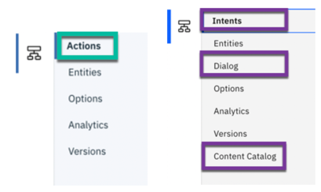

---

copyright:
  years: 2015, 2020
lastupdated: "2020-03-03"

subcollection: assistant

---

{:shortdesc: .shortdesc}
{:new_window: target="_blank"}
{:external: target="_blank" .external}
{:deprecated: .deprecated}
{:important: .important}
{:note: .note}
{:tip: .tip}
{:pre: .pre}
{:codeblock: .codeblock}
{:screen: .screen}
{:javascript: .ph data-hd-programlang='javascript'}
{:java: .ph data-hd-programlang='java'}
{:python: .ph data-hd-programlang='python'}
{:swift: .ph data-hd-programlang='swift'}
{:table: .aria-labeledby="caption"}

# Exiting the technology preview 
{: #dialog-evolution}

During a span of several months, a technology preview version of the user interface was enabled for a select set of first-time customers.
{: shortdesc}

The goal of publishing a revised user interface as a technology preview was to get real usage feedback to help us determine whether the new approach helps customers attain certain milestones in the assistant creation process more quickly. Our testing is finished. As a result, we are reverting all user interfaces back to the standard version of the {{site.data.keyword.conversationshort}} user interface. 

## What to expect when you revert your service instance
{: #dialog-evolution-what}

You will see the following changes:

- There is no **Actions** page. Your dialog skill has an **Intents** page and a **Dialog** page instead.

  

  Your actions data is retained, but how you access it is different.

  Each action you created is listed as an *intent* in the **Intents** page. Similar to an action, an intent represents a customer goal. Each customer utterance that you added to help teach the assistant to recognize when a user wants to perform the action is listed as an *intent user example*.

  The steps you defined for the action are represented in the **Dialog** page. The dialog is like a script that you author for your assistant to follow as it talks with your customers. The dialog is represented as a hierarchical tree of dialog nodes. Each root node in the tree represents a distinct major topic of conversation. Therefore, each action that you defined is available as a root node in your dialog tree. The steps that you defined for the action are represented as the root node's response. For an action with multiple steps, the lower-level steps are represented as child nodes of the root node or other child nodes. The root and child nodes of the dialog form a branch of the conversation. 

- A **Content Catalog** page is available. The *content catalog* provides a set of prebuilt intents that are categorized by subject, such as customer care. You can add these intents to your skill and start using them immediately.

## Technology preview goal
{: #dialog-evolution-goal}

Based on what we learn from user interactions with the technology preview, we will make improvements that the data suggests simplify the development process. That's why it's so important for you to share your feelings about using the preview with our team. When you are prompted to revert your instance, please take a minute to share your opinions with us in the feedback field.

The goal of the reimagined user experience is to make the quality of the conversation that your assistant has with your customers the focus of your work. To acheive that goal, we tried to make it easier for business subject matter experts to participate directly in designing the assistant. Let the people who best understand your business and how to talk to your customers decide how your assistant speaks and behaves.

We simplified the steps you take to train your assistant. You quickly identified discrete customer goals, and in the context of each goal, defined the interactions that must occur to satisfy them.
