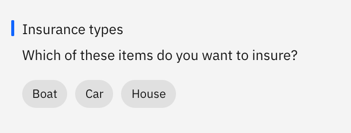
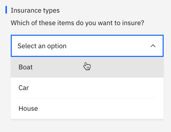

---

copyright:
  years: 2015, 2021
lastupdated: "2021-03-01"

keywords: building a dialog, condition, response, options, jump, jump-to, multiline, response variations

subcollection: assistant

---

{:shortdesc: .shortdesc}
{:new_window: target="_blank"}
{:external: target="_blank" .external}
{:deprecated: .deprecated}
{:important: .important}
{:note: .note}
{:tip: .tip}
{:pre: .pre}
{:codeblock: .codeblock}
{:screen: .screen}
{:javascript: .ph data-hd-programlang='javascript'}
{:java: .ph data-hd-programlang='java'}
{:python: .ph data-hd-programlang='python'}
{:swift: .ph data-hd-programlang='swift'}
{:table: .aria-labeledby="caption"}
{:video: .video}

# Creating a dialog
{: #dialog-overview}

The dialog defines what your assistant says in response to customers.
{: shortdesc}

To learn more about the overall process for creating a dialog, watch the following 3 1/2-minute video.

{: video output="iframe" id="youtubeplayer" frameborder="0" width="560" height="315" webkitallowfullscreen mozallowfullscreen allowfullscreen}

To read a transcript of the video, [open the video on YouTube.com](https://www.youtube.com/watch?v=dEILVc86d3Y&feature=emb_imp_woyt), click the *More actions* icon, and then choose *Open transcript*.

## Creating a dialog
{: #dialog-overview-task}

To create a dialog, complete the following steps:

1.  From the Skills menu, click **Dialog**.

    The following nodes are created for you automatically:

    - **Welcome**: The first node. It contains a greeting that is displayed to your users when they first engage with your assistant. You can edit the greeting.

    This node is not triggered in dialog flows that are initiated by users. For example, dialogs used in integrations with channels such as Facebook or Slack skip nodes with the `welcome` special condition.
    {: note}

    - **Anything else**: The final node. It contains phrases that are used to reply to users when their input is not recognized. You can replace the responses that are provided or add more responses with a similar meaning to add variety to the conversation. You can also choose whether you want your assistant to return each response that is defined in turn or return them in random order.

    For more information about these built-in nodes, see [Starting and ending the dialog](/docs/assistant?topic=assistant-dialog-start).
1.  To add more nodes to the dialog tree, click **Add node**.

    Your new node is added after the *Welcome* node and before the *Anything else* node.
1.  Add a name to the node. 

    Use a short, customer-friendly description of what the node does as its name. For example, `Open an account`, `Get policy information`, or `Get a weather forecast`.

    The name can be up to 512 characters in length.

    This node name is shown to customers or service desk personnel to express the purpose of this branch of the dialog, so take some time to add a name that is concise and descriptive.
    {: tip}

1.  In the **If assistant recognizes** field, enter a condition that, when met, triggers your assistant to process the node. 

    To start off, you typically want to add an intent as the condition. For example, if you add `#open_account` here, it means that you want the response that you will specify in this node to be returned to the user if the user input indicates that the user wants to open an account.

    As you begin to define a condition, a box is displayed that shows you your options. You can enter one of the following characters, and then pick a value from the list of options that is displayed.

    <table>
    <caption>Condition builder syntax</caption>
    <tr>
      <th>Character</th>
      <th>Lists defined values for these artifact types</th>
    </tr>
    <tr>
      <td>`#`</td>
      <td>intents</td>
    </tr>
    <tr>
      <td>`@`</td>
      <td>entities</td>
    </tr>
    <tr>
      <td>`@{entity-name}:`</td>
      <td>{entity-name} values</td>
    </tr>
    <tr>
      <td>`$`</td>
      <td>context-variables that you defined or referenced elsewhere in the dialog</td>
    </tr>
    </table>

    You can create a new intent, entity, entity value, or context variable by defining a new condition that uses it. If you create an artifact this way, be sure to go back and complete any other steps that are necessary for the artifact to be created completely, such as defining sample utterances for an intent.

    To define a node that triggers based on more than one condition, enter one condition, and then click the plus sign (+) icon next to it. If you want to apply an `OR` operator to the multiple conditions instead of `AND`, click the `and` that is displayed between the fields to change the operator type. AND operations are executed before OR operations, but you can change the order by using parentheses. For example:
    `$isMember:true AND ($memberlevel:silver OR $memberlevel:gold)`

    The condition you define must be less than 2,048 characters in length.

    For more information about how to test for values in conditions, see [Conditions](#dialog-overview-conditions).
1.  **Optional**: If you want to collect multiple pieces of information from the user in this node, then click **Customize** and enable **Slots**. See [Gathering information with slots](/docs/assistant?topic=assistant-dialog-slots) for more details.
1.  Enter a response.

    - Add the text or multimedia elements that you want your assistant to display to the user as a response.
    - If you want to define different responses based on certain conditions, then click **Customize** and enable **Multiple responses**.
    - For information about conditional responses, rich responses, or how to add variety to responses, see [Responses](#dialog-overview-responses).

1.  Specify what to do after the current node is processed. You can choose from the following options:

    - **Wait for user input**: Your assistant pauses until new input is provided by the user.
    - **Skip user input**: Your assistant jumps directly to the first child node. This option is only available if the current node has at least one child node.
    - **Jump to**: Your assistant continues the dialog by processing the node you specify. You can choose whether your assistant should evaluate the target node's condition or skip directly to the target node's response. See [Configuring the Jump to action](#dialog-overview-jump-to-config) for more details.

1.  **Optional**: If you want this node to be considered when users are shown a set of node choices at run time, and asked to pick the one that best matches their goal, then add a short description of the user goal handled by this node to the **external node name** field. For example, *Open an account*.

     The *external node name* field is only displayed only to users of paid plans. See [Disambiguation](/docs/assistant?topic=assistant-dialog-runtime#dialog-runtime-disambiguation) for more details.

1.  To add more nodes, select a node in the tree, and then click the **More**  icon.

    - To create a peer node that is checked next if the condition for the existing node is not met, select **Add node below**.
    - To create a peer node that is checked before the condition for the existing node is checked, select **Add node above**.
    - To create a child node to the selected node, select **Add child node**. A child node is processed after its parent node.
    - To copy the current node, select **Duplicate**.

    For more information about the order in which dialog nodes are processed, see [Dialog overview](/docs/assistant?topic=assistant-dialog-build#dialog-build-flow).
1.  Test the dialog as you build it.

    See [Testing your dialog](/docs/assistant?topic=assistant-dialog-tasks#dialog-tasks-test) for more information.

## Conditions
{: #dialog-overview-conditions}

A node condition determines whether that node is used in the conversation. Response conditions determine which response to return to a user.

- [Condition artifacts](#dialog-overview-condition-artifacts)
- [Special conditions](#dialog-overview-special-conditions)
- [Condition syntax details](#dialog-overview-condition-syntax)

For tips on performing more advanced actions in conditions, see [Condition usage tips](/docs/assistant?topic=assistant-dialog-tips#dialog-tips-condition-usage).

### Condition artifacts
{: #dialog-overview-condition-artifacts}

You can use one or more of the following artifacts in any combination to define a condition:

- **Context variable**: The node is used if the context variable expression that you specify is true. Use the syntax, `$variable_name:value` or `$variable_name == 'value'`.

  For node conditions, this artifact type is typically used with an AND or OR operator and another condition value. That's because something in the user input must trigger the node; the context variable value being matched alone is not enough to trigger it. If the user input object sets the context variable value somehow, for example, then the node is triggered.

  Do not define a node condition based on the value of a context variable in the same dialog node in which you set the context variable value.
  {: tip}

  For response conditions, this artifact type can be used alone. You can change the response based on a specific context variable value. For example, `$city:Boston` checks whether the `$city` context variable contains the value, `Boston`. If so, the response is returned.
  
  For more information about context variables, see [Context variables](/docs/assistant?topic=assistant-dialog-runtime-context).

- **Entity**: The node is used when any value or synonym for the entity is recognized in the user input. Use the syntax, `@entity_name`. For example, `@city` checks whether any of the city names that are defined for the @city entity were detected in the user input. If so, the node or response is processed.

  Consider creating a peer node to handle the case where none of the entity's values or synonyms are recognized.
  {: tip}

  For more information about entities, see [Defining entities](/docs/assistant?topic=assistant-entities).

- **Entity value**: The node is used if the entity value is detected in the user input. Use the syntax, `@entity_name:value` and specify a defined value for the entity, not a synonym. For example: `@city:Boston` checks whether the specific city name, `Boston`, was detected in the user input.

  If you check for the presence of the entity, without specifying a particular value for it, in a peer node, be sure to position this node (which checks for a particular entity value) before the peer node that checks only for the presence of the entity. Otherwise, this node will never be evaluated.
  {: tip}

  If the entity is a pattern entity with capture groups, then you can check for a certain group value match. For example, you can use the syntax: `@us_phone.groups[1] == '617'`
  See [Storing and recognizing pattern entity groups in input](/docs/assistant?topic=assistant-dialog-tips#dialog-tips-get-pattern-groups) for more information.

- **Intent**: The simplest condition is a single intent. The node is used if, after your assistant's natural language processing evaluates the user's input, it determines that the purpose of the user's input maps to the pre-defined intent. Use the syntax, `#intent_name`. For example, `#weather` checks if the user input is asking for a weather forecast. If so, the node with the `#weather` intent condition is processed.

  For more information about intents, see [Defining intents](/docs/assistant?topic=assistant-intents).

- **Special condition**: Conditions that are provided with the product that you can use to perform common dialog functions. See the **Special conditions** table in the next section for details.

### Special conditions
{: #dialog-overview-special-conditions}

| Condition syntax     | Description |
|----------------------|-------------|
| `anything_else`      | You can use this condition at the end of a dialog, to be processed when the user input does not match any other dialog nodes. The **Anything else** node is triggered by this condition. If you add a search skill to your assistant, a root node with this condition can be configured to trigger a search. |
| `conversation_start` | Like **welcome**, this condition is evaluated as true during the first dialog turn. Unlike **welcome**, it is true whether or not the initial request from the application contains user input. <!--A node with the **conversation_start** condition can be used to initialize context variables or perform other tasks at the beginning of the dialog.--> |
| `false`              | This condition is always evaluated to false. You might use this at the start of a branch that is under development, to prevent it from being used, or as the condition for a node that provides a common function and is used only as the target of a **Jump to** action. |
| `irrelevant`         | This condition will evaluate to true if the user’s input is determined to be irrelevant by the {{site.data.keyword.conversationshort}} service. |
| `true`               | This condition is always evaluated to true. You can use it at the end of a list of nodes or responses to catch any responses that did not match any of the previous conditions. |
| `welcome`            | This condition is evaluated as true during the first dialog turn (when the conversation starts), only if the initial request from the application does not contain any user input. It is evaluated as false in all subsequent dialog turns. The **Welcome** node is triggered by this condition. Typically, a node with this condition is used to greet the user, for example, to display a message such as `Welcome to our Pizza ordering app.` This node is never processed during interactions that occur through channels such as Facebook or Slack.|
{: caption="Special conditions" caption-side="top"}

### Condition syntax details
{: #dialog-overview-condition-syntax}

Use one of these syntax options to create valid expressions in conditions:

- Shorthand notations to refer to intents, entities, and context variables. See [Accessing and evaluating objects](/docs/assistant?topic=assistant-expression-language).

- Spring Expression (SpEL) language, which is an expression language that supports querying and manipulating an object graph at run time. See [Spring Expression Language (SpEL) language](https://docs.spring.io/spring/docs/current/spring-framework-reference/core.html#expressions){: external} for more information.

You can use regular expressions to check for values to condition against.  To find a matching string, for example, you can use the `String.find` method. See  [Methods](/docs/assistant?topic=assistant-dialog-methods) for more details.

## Responses
{: #dialog-overview-responses}

The dialog response defines how to reply to the user.

You can reply in the following ways:

- [Simple text response](#dialog-overview-simple-text)
- [Rich responses](#dialog-overview-multimedia)
- [Conditional responses](#dialog-overview-multiple)

### Simple text response
{: #dialog-overview-simple-text}

If you want to provide a text response, simply enter the text that you want your assistant to display to the user.


To include a context variable value in the response, use the syntax `$variable_name` to specify it. See [Context variables](/docs/assistant?topic=assistant-dialog-runtime-context) for more information. For example, if you know that the $user context variable is set to the current user's name before a node is processed, then you can refer to it in the text response of the node like this:

```
Hello $user
```
{: screen}

If the current user's name is `Norman`, then the response that is displayed to Norman is `Hello Norman`.

If you include one of these special characters in a text response, escape it by adding a backslash (`\`) in front of it. If you are using the JSON editor, you need to use two backslashes to escape (`\\`). Escaping the character prevents your assistant from misinterpreting it as being one of the following artifact types:

| Special character | Artifact | Example |
|-------------------|----------|---------|
| `$` | Context variable | `The transaction fee is \$2.` |
| `@` | Entity | `Send us your feedback at feedback\@example.com.` |
{: caption="Special characters to escape in responses" caption-side="top"}

The built-in integrations support the following Markdown syntax elements:

| Format | Syntax | Example |
|------------|--------|---------|
| Italics | `We're talking about *practice*.` | We're talking about *practice*. |
| Bold | `There's **no** crying in baseball.` | There's **no** crying in baseball. |
| Hypertext link | `Contact us at [ibm.com](https://www.ibm.com).` | Contact us at [ibm.com](https://www.ibm.com). |
{: caption="Supported markdown syntax" caption-side="top"}

If you don't code a link when you specify a phone number in a text response, it is not converted to a telephone link anywhere except in a web chat integration that is accessed from a mobile device.

The "Try it out" pane does not support Markdown syntax currently. For testing purposes, you can use the *Preview* integration to see how the Markdown syntax is rendered.

The "Try it out" pane, and *preview* and *web chat* integrations support HTML syntax. The *Slack* and *Facebook* integrations do not. 

#### Learn more about simple responses
{: #dialog-overview-variety}

- [Adding multiple lines](#dialog-overview-multiline)
- [Adding variety](#dialog-overview-add-variety)

#### Adding multiple lines
{: #dialog-overview-multiline}

If you want a single text response to include multiple lines separated by carriage returns, then follow these steps:

1.  Add each line that you want to show to the user as a separate sentence into its own response variation field. For example:

  <table>
  <caption>Multiple line response</caption>
  <tr>
    <th>Response variations</th>
  </tr>
  <tr>
    <td>Hi.</td>
  </tr>
  <tr>
    <td>How are you today?</td>
  </tr>
  </table>

1.  For the response variation setting, choose **multiline**.

    If you are using a dialog skill that was created before support for rich response types was added to the product, then you might not see the *multiline* option. Add a second text response type to the current node response. This action changes how the response is represented in the underlying JSON. As a result, the multiline option becomes available. Choose the multiline variation type. Now, you can delete the second text response type that you added to the response.
    {: note}

When the response is shown to the user, both response variations are displayed, one on each line, like this:

```
Hi.
How are you today?
```
{: screen}

#### Adding variety
{: #dialog-overview-add-variety}

If your users return to your conversation service frequently, they might be bored to hear the same greetings and responses every time.  You can add *variations* to your responses so that your conversation can respond to the same condition in different ways.

In this example, the answer that your assistant provides in response to questions about store locations differs from one interaction to the next:


You can choose to rotate through the response variations sequentially or in random order. By default, responses are rotated sequentially, as if they were chosen from an ordered list.

To change the sequence in which individual text responses are returned, complete the following steps:

1.  Add each variation of the response into its own response variation field. For example:

  <table>
  <caption>Varying responses</caption>
  <tr>
    <th>Response variations</th>
  </tr>
  <tr>
    <td>Hello.</td>
  </tr>
  <tr>
    <td>Hi.</td>
  </tr>
  <tr>
    <td>Howdy!</td>
  </tr>
  </table>

1.  For the response variation setting, choose one of the following settings:

    - **sequential**: The system returns the first response variation the first time the dialog node is triggered, the second response variation the second time the node is triggered, and so on, in the same order as you define the variations in the node.

      Results in responses being returned in the following order when the node is processed:

      - First time:

        ```
        Hello.
        ```
        {: screen}

      - Second time:

        ```
        Hi.
        ```
        {: screen}

      - Third time:
        ```
        Howdy!
        ```
        {: screen}

    - **random**: The system randomly selects a text string from the variations list the first time the dialog node is triggered, and randomly selects another variation the next time, but without repeating the same text string consecutively.

      Example of the order that responses might be returned in when the node is processed:

      - First time:

        ```
        Howdy!
        ```
        {: screen}

      - Second time:

        ```
        Hi.
        ```
        {: screen}

      - Third time:

        ```
        Hello.
        ```
        {: screen}

### Rich responses
{: #dialog-overview-multimedia}

You can return responses with multimedia or interactive elements such as images or clickable buttons to simplify the interaction model of your application and enhance the user experience.

In addition to the default response type of **Text**, for which you specify the text to return to the user as a response, the following response types are supported:

- **Connect to human agent**: The dialog calls a service that you designate, typically a service that manages human agent support ticket queues, to transfer the conversation to a person. You can optionally include a message that summarizes the user's issue to be provided to the human agent.
- **Image**: Embeds an image into the response. The source image file must be hosted somewhere and have a URL that you can use to reference it. It cannot be a file that is stored in a directory that is not publicly accessible.
- **Option**: Adds a list of one or more options. When a user clicks one of the options, an associated user input value is sent to your assistant. How options are rendered can differ depending on the number of options and where you deploy the dialog.
- **Pause**: Forces the application to wait for a specified number of milliseconds before continuing with processing. You can choose to show an indicator that the assistant is working on typing a response. Use this response type if you need to perform an action that might take some time.
- **Search skill**:  Searches an external data source for relevant information to return to the user. The data source that is searched is a {{site.data.keyword.discoveryshort}} service data collection that you configure when you add a search skill to the assistant that uses this dialog skill.

  This response type is available only to users of paid plans.
  {: note}

- **User-defined**: If you use the JSON editor to define the response, you can create your own user-defined response type. For more information, see [Defining responses using the JSON editor](/docs/assistant?topic=assistant-dialog-responses-json).

To add a rich response, complete the following steps:

1.  Click the dropdown menu in the **Assistant responds** field to choose a response type, and then provide any required information.

    For more information, see the following sections:

    - [**Connect to human agent**](#dialog-overview-add-connect-to-human-agent)
    - [**Image**](#dialog-overview-add-image)
    - [**Option**](#dialog-overview-add-option)
    - [**Pause**](#dialog-overview-add-pause)
    - [**Search skill**](#dialog-overview-add-search-skill)  
    
      This response type is only visible to users of paid plans.
      {: note}

    - [**Text**](#dialog-overview-simple-text)

1.  To add another response type to the current response, click **Add response type**.

    You might want to add multiple response types to a single response to provide a richer answer to a user query. For example, if a user asks for store locations, you could show a map and display a button for each store location that the user can click to get address details. To build that type of response, you can use a combination of image, options, and text response types. Another example is using a text response type before a pause response type so you can warn users before pausing the dialog.

    You cannot add more than 5 response types to a single response. This means that if you define three conditioned responses for a dialog node, each conditioned response can have no more than 5 response types added to it.
    {: note}

    You cannot add more than one **Connect to human agent** or more than one **Search skill** response type to a single dialog node.
    {: note}

    Do not add more than one option response type to a single dialog node because both lists are displayed at once, but the customer can choose an option from only one of them.
    {: note}

1.  If you added more than one response type, you can click the **Move** up or down arrows to arrange the response types in the order you want your assistant to process them.

### Adding a *Connect to human agent* response type
{: #dialog-overview-add-connect-to-human-agent}

If your client application is able to transfer a conversation to a person, such as a customer support agent, then you can add a *Connect to human agent* response type to initiate the transfer. Some of the built-in integrations, such as web chat and Intercom, support making transfers to service desk agents. If you are using a custom application, you must program the application to recognize when this response type is triggered.

If you want to take advantage of the *containment* metric to track your assistant's success rate, add this response type to your dialog or use an alternate method to identify when customers are directed to outside support. For more information, see [Measuring containment](/docs/assistant?topic=assistant-dialog-support#dialog-support-containment).
{: tip}

To add a *Connect to human agent* response type, complete the following steps:

1.  From the dialog node where you want to add the response type, click the dropdown menu in the **Assistant responds** field, and then choose **Connect to human agent**.

1.  **Optional**. Add a message to share with the human agent to whom the conversation is transferred in the **Message to human agent** field.
1.  Add a message to show to the customer to explain that they are being transferred. 

    You can add a message to show when agents are available and a message to show when agents are unavailable. Each message can be up to 100 characters in length.

    **Web chat built-in service desk integrations only**: The text you add to the *Response when agents are online* and *Response when no agents are online* fields is used for transfers in web chat version 3 and later. If you don't add your own messages, the hint text (the grayed out text that is displayed as the example messages) is used.
    
    If you use this response type in multiple nodes and want to use the same custom text each time, but don't want to have to edit each node individually, you can change the default text that is used by the web chat. To change the default messages, edit the [language source file](https://github.com/watson-developer-cloud/assistant-web-chat/tree/master/languages){: external}. Look for the `default_agent_availableMessage` and `default_agent_unavailableMessage` values. For more information about how to change web chat text, see [Languages](https://web-chat.global.assistant.watson.cloud.ibm.com/docs.html?to=api-instance-methods#languages){: external}.
    {: tip}

1.  **Optional**: If the channel where you deploy the assistant is integrated with a service desk, you can add initial routing information to pass with the transfer request.

    - Pick the integration type from the **Service desk routing** field.
    - Add routing information that is meaningful to the service desk you are using.

      <table>
      <caption>Service desk routing options</caption>
      <tr>
      <th>Service desk type</th>
      <th>Routing information</th>
      <th>Description</th>
      </tr>
      <tr>
      <td>Salesforce</td>
      <td>Button ID</td>
      <td>Specify a valid button ID from your Salesforce deployment. For more information, see <a href="https://cloud.ibm.com/docs/assistant?topic=assistant-deploy-salesforce#deploy-salesforce-routing">Adding routing logic for Salesforce transfers</a>.</td>
      </tr>
      <tr>
      <td>Zendesk</td>
      <td>Department</td>
      <td>Specify a valid department name from your Zendesk account. For more information, see <a href="https://cloud.ibm.com/docs/assistant?topic=assistant-deploy-zendesk#deploy-zendesk-routing">Adding routing logic for Zendesk transfers</a>.</td>
      </tr>
      </table>

The dialog transfer does not occur when you test dialog nodes with this response type in the "Try it out" pane of the dialog skill. You must access a node that uses this response type from an assistant-level integration, such as the Preview, to see how your users will experience it.

### Adding an *Image* response type
{: #dialog-overview-add-image}

Sometimes a picture is worth a thousand words. Include images in your response to do things like illustrate a concept, show off merchandise for sale, or maybe to show a map of your store location.

To add an *Image* response type, complete the following steps:

1.  Choose **Image**.

1.  Add the full URL to the hosted image file into the **Image source** field. 

    The image must be in .jpg, .gif, or .png format. The image file must be stored in a location that is publicly addressable by URL.

    For example: `https://www.example.com/assets/common/logo.png`.

    If you want to display an image title and description above the embedded image in the response, then add them in the fields provided.

    To access an image that is stored in {{site.data.keyword.cloud}} {{site.data.keyword.cos_short}}, enable public access to the individual image storage object, and then reference it by specifying the image source with syntax like this: `https://s3.eu.cloud-object-storage.appdomain.cloud/your-bucket-name/image-name.png`.

    Some integration channels ignore titles or descriptions.
    {: note}

### Adding an *Option* response type
{: #dialog-overview-add-option}

Add an option response type when you want to give the customer a set of options to choose from. For example, you can construct a response like this:

<table>
<caption>Response options</caption>
  <tr>
    <th>List title</th>
    <th>List description</th>
    <th>Option label</th>
    <th>User input submitted when clicked</th>
  </tr>
  <tr>
    <td>Insurance types</td>
    <td>Which of these items do you want to insure?</td>
    <td></td>
    <td></td>
  </tr>
  <tr>
    <td></td>
    <td></td>
    <td>Boat</td>
    <td>I want to buy boat insurance</td>
  </tr>
  <tr>
    <td></td>
    <td></td>
    <td>Car</td>
    <td>I want to buy car insurance</td>
  </tr>
  <tr>
    <td></td>
    <td></td>
    <td>Home</td>
    <td>I want to buy home insurance</td>
  </tr>
</table>

Most integrations display the options as buttons if there are only a few items (4 or fewer, for example).
      


Otherwise, the options are displayed as a list.

To add an *Option* response type, complete the following steps:

1.  From the dialog node where you want to add the response type, click the dropdown menu in the **Assistant responds** field, and then choose **Option**.
1.  Click **Add option**.
1.  In the **List label** field, enter the option to display in the list. 

    The label must be less than 2,048 characters in length.
1.  In the corresponding **Value** field, enter the user input to pass to your assistant when this option is selected. 

    The value must be less than 2,048 characters in length. 
    
    For Slack integrations where the options are displayed as a list, each value must be 75 characters or less in length.
    {: important}

    Specify a value that you know will trigger the correct intent when it is submitted. For example, it might be a user example from the training data for the intent.
1.  Repeat the previous steps to add more options to the list.

    You can add up to 20 options.
1.  Add a list introduction in the **Title** field. The title can ask the user to pick from the list of options.

    Some integration channels do not display the title.
    {: note}

1.  Optionally, add additional information in the **Description** field. If specified, the description is displayed after the title and before the option list.

    Some integration channels do not display the description.
    {: note}

1.  **Optional**: If you want to indicate a preference for how the options are displayed, as buttons or in a list, you can add a `preference` property for the response.
      
    To do so, open the JSON editor for the response, and then add a `preference` name and value pair before the `response_type` name and value pair. You can set the preference to `dropdown` or `button`.

    ```json
    {
      "output": {
        "generic": [
          {
            "title": "Insurance types",
            "options": [
              {
                "label": "Boat",
                "value": {
                  "input": {
                    "text": "I want to buy boat insurance."
                  }
                }
              },
              {
                "label": "Car",
                "value": {
                  "input": {
                    "text": "I want to buy car insurance."
                  }
                }
              },
              {
                "label": "House",
                "value": {
                  "input": {
                    "text": "I want to buy house insurance."
                  }
                }
              }
            ],
            "preference": "dropdown", //add this name and value pair 
            "description": "Which of these items do you want to insure?",
            "response_type": "option"
          }
        ]
      }
    }
    ```
    {: codeblock}

    When you define an options list with only 3 items, the options are typically displayed as buttons. When you add a preference property that indicates `dropdown` as the preference, for example, you can see in the "Try it out" pane that the list is displayed as a drop-down list instead.

    

    Some integration types, such as the web chat, reflect your preference. Other integration types, such as Slack, do not reflect your preference when they render the options.

Do not add more than one option response type to a single dialog node because both lists are displayed at once, but the customer can choose an option from only one of them.
{: important}

If you need to be able to populate the list of options with different values based on some other factors, you can design a dynamic options list. For more information, see the [How to Dynamically Add Response Options to Dialog Nodes](https://medium.com/ibm-watson/how-to-dynamically-add-response-options-to-dialog-nodes-in-watson-assistant-e14c5e08beca){: external} blog post.

### Adding a *Pause* response type
{: #dialog-overview-add-pause}

Add a pause response type to give the assistant time to respond. For example, you might add a pause response type to a node that calls a webhook. The pause indicates that the assistant is working on an answer, which gives the assistant time to make the webhook call and get a response. Then, you can jump to a child node to show the result. 

To add a *Pause* response type, complete the following steps:

1.  From the dialog node where you want to add the response type, click the dropdown menu in the **Assistant responds** field, and then choose **Pause**. 

1.  Add the length of time for the pause to last as a number of milliseconds (ms) to the **Duration** field.

    The value cannot exceed 10,000 ms. Users are typically willing to wait about 8 seconds (8,000 ms) for someone to enter a response. To prevent a typing indicator from being displayed during the pause, choose **Off**.

    Add another response type, such as a text response type, after the pause to clearly denote that the pause is over.
    {: tip}

This response type does not render in the "Try it out" pane. You must access a node that uses this response type from a test deployment to see how your users will experience it. For more information, see [Testing your assistant from a web page](/docs/assistant?topic=assistant-deploy-web-link).

### Adding a *Search skill* response type 
{: #dialog-overview-add-search-skill}

If you have existing customer-facing material, such as an FAQ, a product catalog, or sales material that can answer questions that customers often ask, put that information to use. You can trigger a search of the existing material in real time to get the latest and most up-to-date answer for your customers. 

To use the search skill response type, you must create a search skill and add it to the same assistant that uses this dialog skill. For more information, see [Creating a search skill](/docs/assistant?topic=assistant-skill-search-add).

To add a *Search skill* response type, complete the following steps:

1.  From the dialog node where you want to add the response type, click the dropdown menu in the **Assistant responds** field, and then choose **Search skill**.

    Indicates that you want to search an external data source for a relevant response.

1.  To edit the search query to pass to the {{site.data.keyword.discoveryshort}} service, click **Customize**, and then fill in the following fields:

    - **Query**: Optional. You can specify a specific query in natural language to pass to {{site.data.keyword.discoveryshort}}. If you do not add a query, then the customer's exact input text is passed as the query.

      For example, you can specify `What cities do you fly to?`. This query value is passed to {{site.data.keyword.discoveryshort}} as a search query. {{site.data.keyword.discoveryshort}} uses natural language understanding to understand the query and to find an answer or relevant information about the subject in the data collection that is configured for the search skill.

      You can include specific information provided by the user by referencing entities that were detected in the user's input as part of the query. For example, `Tell me about @product`. Or you can reference a context variable, such as `Do you have flights to $destination?`. Just be sure to design your dialog such that the search is not triggered unless any entities or context variables that you reference in the query have been set to valid values.

      This field is equivalent to the {{site.data.keyword.discoveryshort}} `natural_language_query` parameter. For more information, see [Query parameters](/docs/discovery?topic=discovery-query-parameters#nlq){: external}.

      - **Filter**: Optional. Specify a text string that defines information that must be present in any of the search results that are returned.

        - To indicate that you want to return only documents with positive sentiment detected, for example, specify `enriched_text.sentiment.document.label:positive`.

        - To filter results to includes only documents that the ingestion process identified as containing the entity `Boston, MA`, specify `enriched_text.entities.text:"Boston, MA"`.

        - To filter results to includes only documents that the ingestion process identified as containing a product name provided by the customer, you can specify `enriched_text.entities.text:@product`.

        - To filter results to includes only documents that the ingestion process identified as containing a city name that you saved in a context variable named `$destination`, you can specify `enriched_text.entities.text:$destination`.

        This field is equivalent to the {{site.data.keyword.discoveryshort}} `filter` parameter. For more information, see [Query parameters](/docs/discovery?topic=discovery-query-parameters#filter){: external}.

      If you add both a query and a filter value, the filter parameter is applied first to filter the data collection documents and cache the results. The query parameter then ranks the cached results.

1.  **Optional**: Change the query type that is used for the search. 

    The search skill sends a natural language query to {{site.data.keyword.discoveryshort}} automatically. If you want to use the {{site.data.keyword.discoveryshort}} query language instead, you can specify it. To do so, open the JSON editor for the node response.

    Edit the JSON code snippet to replace `natural_language` with `discovery_query_language`. For example:

    ```json
    {
      "output": {
        "generic": [
          {
            "query": "",
            "filter": "enriched_text.sentiment.document.label:positive",
            "query_type": "discovery_query_language",
            "response_type": "search_skill"
          }
        ] 
      }
    }
    ```
    {: codeblock}  

Test this response type from the preview or another assistant-level integration. You cannot test it from the dialog skill's "Try it out" pane. For more information about testing dialog and search skills together, see [Testing your assistant from a web page](/docs/assistant?topic=assistant-deploy-web-link).

### Conditional responses
{: #dialog-overview-multiple}

A single dialog node can provide different responses, each one triggered by a different condition.  Use this approach to address multiple scenarios in a single node.

{: video output="iframe" id="youtubeplayer0" frameborder="0" width="560" height="315" webkitallowfullscreen mozallowfullscreen allowfullscreen}

To read a transcript of the video, [open the video on YouTube.com](https://www.youtube.com/watch?v=Q5_-f7_Iyvg&feature=emb_imp_woyt), click the *More actions* icon, and then choose *Open transcript*.

The node still has a main condition, which is the condition for using the node and processing the conditions and responses that it contains.

In this example, your assistant uses information that it collected earlier about the user's location to tailor its response, and provide information about the store nearest the user. See [Context variables](/docs/assistant?topic=assistant-dialog-runtime-context) for more information about how to store information collected from the user.


This single node now provides the equivalent function of four separate nodes.

To add conditional responses to a node, complete the following steps:

1.  Click **Customize**, and then set the **Multiple conditioned responses** switch to **On**.

    The node response section changes to show a pair of condition and response fields. You can add a condition and a response into them.
1.  To customize a response further, click the **Edit response**  icon next to the response.

    You must open the response for editing to complete the following tasks:

    - **Update context**. To change the value of a context variable when the response is triggered, specify the context value in the context editor. You update context for each individual conditional response; there is no common context editor or JSON editor for all conditional responses.
    - **Add rich responses**. To add more than one text response or to add response types other than text responses to a single conditional response, you must open the edit response view.
    - **Configure a jump**. To instruct your assistant to jump to a different node after this conditional response is processed, select **Jump to** from the *And finally* section of the response edit view. Identify the node that you want your assistant to process next. See [Configuring the Jump to action](#dialog-overview-jump-to-config) for more information.

      A **Jump to** action that is configured for the node is not processed until all of the conditional responses are processed. Therefore, if a conditional response is configured to jump to another node, and the conditional response is triggered, then the jump configured for the node is never processed, and so does not occur.

1.  Click **Add response** to add another conditional response.

The conditions within a node are evaluated in order, just as nodes are.  Be sure that your conditional responses are listed in the correct order.  If you need to change the order, select a condition and response pair and move it up or down in the list using the arrows that are displayed.

## Defining what to do next
{: #dialog-overview-jump-to}

After making the specified response, you can instruct your assistant to do one of the following things:

- **Wait for user input**: Your assistant waits for the user to provide new input that the response elicits. For example, the response might ask the user a yes or no question. The dialog will not progress until the user provides more input.
- **Skip user input**:  Use this option when you want to bypass waiting for user input and go directly to the first child node of the current node instead.

  The current node must have at least one child node for this option to be available.
  {: note}

- **Jump to another dialog node**: Use this option when you want the conversation to go directly to an entirely different dialog node. You can use a *Jump to* action to route the flow to a common dialog node from multiple locations in the tree, for example.

  The target node that you want to jump to must exist before you can configure the jump to action to use it.
  {: note}

### Configuring the Jump to action
{: #dialog-overview-jump-to-config}

If you choose to jump to another node, specify when the target node is processed by choosing one of the following options:

- **Condition**: If the statement targets the condition section of the selected dialog node, your assistant checks first whether the condition of the targeted node evaluates to true.
    - If the condition evaluates to true, the system processes the target node immediately.
    - If the condition does not evaluate to true, the system moves to the next sibling node of the target node to evaluate its condition, and repeats this process until it finds a dialog node with a condition that evaluates to true.

    - If the system processes all the siblings and none of the conditions evaluate to true, the basic fallback strategy is used, and the dialog evaluates the nodes at the base level of the dialog tree.

    Targeting the condition is useful for chaining the conditions of dialog nodes. For example, you might want to first check whether the input contains an intent, such as `#turn_on`, and if it does, you might want to check whether the input contains entities, such as `@lights`, `@radio`, or `@wipers`. Chaining conditions helps to structure larger dialog trees.

    Avoid choosing this option when configuring a jump-to from a conditional response that goes to a node situated above the current node in the dialog tree. Otherwise, you can create an infinite loop. If your assistant jumps to the earlier node and checks its condition, it is likely to return false because the same user input is being evaluated that triggered the current node last time through the dialog. Your assistant will go to the next sibling or back to root to check the conditions on those nodes, and will likely end up triggering this node again, which means the process will repeat itself.
    {: note}

- **Response**: If the statement targets the response section of the selected dialog node, it is run immediately. That is, the system does not evaluate the condition of the selected dialog node; it processes the response of the selected dialog node immediately.

  Targeting the response is useful for chaining several dialog nodes together. The response is processed as if the condition of this dialog node is true. If the selected dialog node has another **Jump to** action, that action is run immediately, too.

- **Wait for user input**: Waits for new input from the user, and then begins to process it from the node that you jump to. This option is useful if the source node asks a question, for example, and you want to jump to a separate node to process the user's answer to the question.

### Next steps
{: #dialog-overview-next}

- Be sure to test your dialog as you build it. For more information, see [Testing the dialog](/docs/assistant?topic=assistant-dialog-tasks).
- For more information about ways to address common use cases, see [Dialog building tips](/docs/assistant?topic=assistant-dialog-tips).
- For more information about the expression language that you can use to improve your dialog, such as methods that reformat dates or text, see [Expression language methods](/docs/assistant?topic=assistant-dialog-methods).

You can also use the API to add nodes or otherwise edit a dialog. See [Modifying a dialog using the API](/docs/assistant?topic=assistant-api-dialog-modify) for more information.