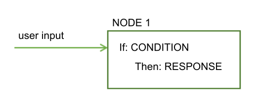

---

copyright:
  years: 2015, 2019
lastupdated: "2019-01-22"

---

{:shortdesc: .shortdesc}
{:new_window: target="_blank"}
{:deprecated: .deprecated}
{:important: .important}
{:note: .note}
{:tip: .tip}
{:pre: .pre}
{:codeblock: .codeblock}
{:screen: .screen}
{:javascript: .ph data-hd-programlang='javascript'}
{:java: .ph data-hd-programlang='java'}
{:python: .ph data-hd-programlang='python'}
{:swift: .ph data-hd-programlang='swift'}
{:table: .aria-labeledby="caption"}

# Dialog overview
{: #dialog-overview}

The dialog uses the intents that are identified in the user's input, plus context from the application, to interact with the user and ultimately provide a useful response.
{: shortdesc}

The dialog matches intents (what users say) to responses (what the bot says back). The response might be the answer to a question such as `Where can I get some gas?` or the execution of a command, such as turning on the radio. The intent and entity might be enough information to identify the correct response, or the dialog might ask the user for more input that is needed to respond correctly. For example, if a user asks, `Where can I get some food?` you might want to clarify whether they want a restaurant or a grocery store, to dine in or take out, and so on. You can ask for more details in a text response and create one or more child nodes to process the new input.

<iframe class="embed-responsive-item" id="youtubeplayer" title="Dialog overview" type="text/html" width="640" height="390" src="https://www.youtube.com/embed/XkhAMe9gSFU?rel=0" frameborder="0" webkitallowfullscreen mozallowfullscreen allowfullscreen> </iframe>

Note: The video is 15 minutes in duration; the first 5 minutes cover how to add a node.

The dialog is represented graphically in the {{site.data.keyword.conversationshort}} tool as a tree. Create a branch to process each intent that you want your conversation to handle. A branch is composed of multiple nodes.

## Dialog nodes

Each dialog node contains, at a minimum, a condition and a response.



- Condition: Specifies the information that must be present in the user input for this node in the dialog to be triggered. The information is typically a specific intent. It might also be an entity type, an entity value, or a context variable value. See [Conditions](#conditions) for more information.
- Response: The utterance that the service uses to respond to the user. The response can also be configured to show an image or a list of options, or to trigger programmatic actions. See [Responses](#responses) for more information.

You can think of the node as having an if/then construction: if this condition is true, then return this response.

For example, the following node is triggered if the natural language processing function of the service determines that the user input contains the `#cupcake-menu` intent. As a result of the node being triggered, the service responds with an appropriate answer.


A single node with one condition and response can handle simple user requests. But, more often than not, users have more sophisticated questions or want help with more complex tasks. You can add child nodes that ask the user to provide any additional information that the service needs.


## Dialog flow

The dialog that you create is processed by the service from the first node in the tree to the last.


As it travels down the tree, if the service finds a condition that is met, it triggers that node. It then moves along the triggered node to check the user input against any child node conditions. As it checks the child nodes it moves again from the first child node to the last.

The services continues to work its way through the dialog tree from first to last node, along each triggered node, then from first to last child node, and along each triggered child node until it reaches the last node in the branch it is following.


When you start to build the dialog, you must determine the branches to include, and where to place them. The order of the branches is important because nodes are evaluated from first to last. The first root node whose condition matches the input is used; any nodes that come later in the tree are not triggered.

When the service reaches the end of a branch, or cannot find a condition that evaluates to true from the current set of child nodes it is evaluating, it jumps back out to the base of the tree. And once again, the service processes the root nodes from first to the last. If none of the conditions evaluates to true, then the response from the last node in the tree, which typically has a special `anything_else` condition that always evaluates to true, is returned.

You can disrupt the standard first-to-last flow in the following ways:

- By customizing what happens after a node is processed. For example, you can configure a node to jump directly to another node after it is processed, even if the other node is positioned earlier in the tree. See [Defining what to do next](dialog-overview.html#jump-to) for more information.
- By configuring conditional responses to jump to other nodes. See [Conditional responses](dialog-overview.html#multiple) for more information.
- By configuring digression settings for dialog nodes. Digressions can also impact how users move through the nodes at run time. If you enable digressions away from most nodes and configure returns, users can jump from one node to another and back again more easily. See [Digressions](dialog-runtime.html#digressions) for more information.

## Conditions
{: #conditions}

A node condition determines whether that node is used in the conversation. Response conditions determine which response to return to a user.

- [Condition artifacts](dialog-overview.html#condition-artifacts)
- [Special conditions](dialog-overview.html#special-conditions)
- [Condition syntax details](dialog-overview.html#condition-syntax)

For tips on performing more advanced actions in conditions, see [Condition usage tips](dialog-tips.html#condition-usage-tips).

### Condition artifacts
{: #condition-artifacts}

You can use one or more of the following artifacts in any combination to define a condition:

- **Context variable**: The node is used if the context variable expression that you specify is true. Use the syntax, `$variable_name:value` or `$variable_name == 'value'`.

  For node conditions, this artifact type is typically used with an AND or OR operator and another condition value. That's because something in the user input must trigger the node; the context variable value being matched alone is not enough to trigger it. If the user input object sets the context variable value somehow, for example, then the node is triggered.

  Do not define a node condition based on the value of a context variable in the same dialog node in which you set the context variable value.
  {: tip}

  For response conditions, this artifact type can be used alone. You can change the response based on a specific context variable value. For example, `$city:Boston` checks whether the `$city` context variable contains the value, `Boston`. If so, the response is returned.
  
  For more information about context variables, see [Context variables](dialog-runtime.html#context).

- **Entity**: The node is used when any value or synonym for the entity is recognized in the user input. Use the syntax, `@entity_name`. For example, `@city` checks whether any of the city names that are defined for the @city entity were detected in the user input. If so, the node or response is processed.

  Consider creating a peer node to handle the case where none of the entity's values or synonyms are recognized.
  {: tip}

  For more information about entities, see [Defining entities](entities.html).

- **Entity value**: The node is used if the entity value is detected in the user input. Use the syntax, `@entity_name:value` and specify a defined value for the entity, not a synonym. For example: `@city:Boston` checks whether the specific city name, `Boston`, was detected in the user input.

  If you check for the presence of the entity, without specifying a particular value for it, in a peer node, be sure to position this node (which checks for a particular entity value) before the peer node that checks only for the presence of the entity. Otherwise, this node will never be evaluated.
  {: tip}

  If the entity is a pattern entity with capture groups, then you can check for a certain group value match. For example, you can use the syntax: `@us_phone.groups[1] == '617'`
  See [Storing and recognizing pattern entity groups in input](dialog-tips.html#get-pattern-groups) for more information.

- **Intent**: The simplest condition is a single intent. The node is used if, after the service's natural language processing evaluates the user's input, it determines that the purpose of the user's input maps to the pre-defined intent. Use the syntax, `#intent_name`. For example, `#weather` checks if the user input is asking for a weather forecast. If so, the node with the `#weather` intent condition is processed.

  For more information about intents, see [Defining intents](intents.html).

- **Special condition**: Conditions that are provided with the service that you can use to perform common dialog functions. See the **Special conditions** table in the next section for details.

### Special conditions
{: #special-conditions}

| Condition syntax     | Description |
|----------------------|-------------|
| `anything_else`      | You can use this condition at the end of a dialog, to be processed when the user input does not match any other dialog nodes. The **Anything else** node is triggered by this condition. |
| `conversation_start` | Like **welcome**, this condition is evaluated as true during the first dialog turn. Unlike **welcome**, it is true whether or not the initial request from the application contains user input. A node with the **conversation_start** condition can be used to initialize context variables or perform other tasks at the beginning of the dialog. |
| `false`              | This condition is always evaluated to false. You might use this at the start of a branch that is under development, to prevent it from being used, or as the condition for a node that provides a common function and is used only as the target of a **Jump to** action. |
| `irrelevant`         | This condition will evaluate to true if the user’s input is determined to be irrelevant by the {{site.data.keyword.conversationshort}} service. |
| `true`               | This condition is always evaluated to true. You can use it at the end of a list of nodes or responses to catch any responses that did not match any of the previous conditions. |
| `welcome`            | This condition is evaluated as true during the first dialog turn (when the conversation starts), only if the initial request from the application does not contain any user input. It is evaluated as false in all subsequent dialog turns. The **Welcome** node is triggered by this condition. Typically, a node with this condition is used to greet the user, for example, to display a message such as `Welcome to our Pizza ordering app.` This node is never processed during interactions that occur through channels such as Facebook or Slack.|
{: caption="Special conditions" caption-side="top"}

### Condition syntax details
{: #condition-syntax}

Use one of these syntax options to create valid expressions in conditions:

- Shorthand notations to refer to intents, entities, and context variables. See [Accessing and evaluating objects](expression-language.html).

- Spring Expression (SpEL) language, which is an expression language that supports querying and manipulating an object graph at run time. See [Spring Expression Language (SpEL) language ](http://docs.spring.io/spring/docs/current/spring-framework-reference/html/expressions.html){: new_window} for more information.

You can use regular expressions to check for values to condition against.  To find a matching string, for example, you can use the `String.find` method. See  [Methods](dialog-methods.html) for more details.

## Responses
{: #responses}

The dialog response defines how to reply to the user.

You can reply in the following ways:

- [Simple text response](#simple-text)
- [Rich responses](#multimedia)
- [Conditional responses](#multiple)

### Simple text response
{: #simple-text}

If you want to provide a text response, simply enter the text that you want the service to display to the user.


To include a context variable value in the response, use the syntax `$variable_name` to specify it. See [Context variables](dialog-runtime.html#context) for more information. For example, if you know that the $user context variable is set to the current user's name before a node is processed, then you can refer to it in the text response of the node like this:

```
Hello $user
```
{: screen}

If the current user's name is `Norman`, then the response that is displayed to Norman is `Hello Norman`.

If you include one of these special characters in a text response, escape it by adding a backslash (`\`) in front of it. If you are using the JSON editor, you need to use two backslashes to escape (`\\`). Escaping the character prevents the service from misinterpreting it as being one of the following artifact types:

| Special character | Artifact | Example |
|-------------------|----------|---------|
| `$` | Context variable | `The transaction fee is \$2.` |
| `@` | Entity | `Send us your feedback at feedback\@example.com.` |
| `#` | Intent | `We are the \#1 seller of lobster rolls in Maine.` |
{: caption="Special characters to escape in responses" caption-side="top"}

The built-in integrations support the following Markdown syntax elements:

| Output format | Syntax | Example |
|------------|--------|---------|
| Italics | `We're talking about *practice*.` | We're talking about *practice*. |
| Bold | `There's **no** crying in baseball.` | There's **no** crying in baseball. |
| Hypertext link | `Contact us at [ibm.com](https://www.ibm.com).` | Contact us at [ibm.com ](https://www.ibm.com). |
{: caption="Supported markdown syntax" caption-side="top"}

The "Try it out" pane does not support Markdown syntax currently. To include a link that is rendered in the "Try it out" pane and Preview link integration only, you can use HTML syntax. For example: `Contact us at <a href="https://www.ibm.com">ibm.com</a>.` (Do *not* try to escape the quotations mark with a backslash `\"`, for example.) However, HTML syntax is not rendered properly in any of the other integration types.
{: note}

#### Learn more about simple responses
{: #variety}

- [Adding multiple lines](dialog-overview.html#multiline)
- [Adding variety](dialog-overview.html#add-variety)

#### Adding multiple lines
{: #multiline}

If you want a single text response to include multiple lines separated by carriage returns, then follow these steps:

1.  Add each line that you want to show to the user as a separate sentence into its own response variation field. For example:

  <table>
  <caption>Multiple line response</caption>
  <tr>
    <th>Response variations</th>
  </tr>
  <tr>
    <td>Hi.</td>
  </tr>
  <tr>
    <td>How are you today?</td>
  </tr>
  </table>

1.  For the response variation setting, choose **multiline**.

    If you are using a dialog skill that was created before support for rich response types was added to the service, then you might not see the *multiline* option. Add a second text response type to the current node response. This action changes how the response is represented in the underlying JSON. As a result, the multiline option becomes available. Choose the multiline variation type. Now, you can delete the second text response type that you added to the response.
    {: note}

When the response is shown to the user, both response variations are displayed, one on each line, like this:

```
Hi.
How are you today?
```
{: screen}

#### Adding variety
{: #add-variety}

If your users return to your conversation service frequently, they might be bored to hear the same greetings and responses every time.  You can add *variations* to your responses so that your conversation can respond to the same condition in different ways.

In this example, the answer that the service provides in response to questions about store locations differs from one interaction to the next:


You can choose to rotate through the response variations sequentially or in random order. By default, responses are rotated sequentially, as if they were chosen from an ordered list.

To change the sequence in which individual text responses are returned, complete the following steps:

1.  Add each variation of the response into its own response variation field. For example:

  <table>
  <caption>Varying responses</caption>
  <tr>
    <th>Response variations</th>
  </tr>
  <tr>
    <td>Hello.</td>
  </tr>
  <tr>
    <td>Hi.</td>
  </tr>
  <tr>
    <td>Howdy!</td>
  </tr>
  </table>

1.  For the response variation setting, choose one of the following settings:

    - **sequential**: The system returns the first response variation the first time the dialog node is triggered, the second response variation the second time the node is triggered, and so on, in the same order as you define the variations in the node.

      Results in responses being returned in the following order when the node is processed:

      - First time:

        ```
        Hello.
        ```
        {: screen}

      - Second time:

        ```
        Hi.
        ```
        {: screen}

      - Third time:
        ```
        Howdy!
        ```
        {: screen}

    - **random**: The system randomly selects a text string from the variations list the first time the dialog node is triggered, and randomly selects another variation the next time, but without repeating the same text string consecutively.

      Example of the order that responses might be returned in when the node is processed:

      - First time:

        ```
        Howdy!
        ```
        {: screen}

      - Second time:

        ```
        Hi.
        ```
        {: screen}

      - Third time:

        ```
        Hello.
        ```
        {: screen}

### Rich responses
{: #multimedia}

You can return responses with multimedia or interactive elements such as images or clickable buttons to simplify the interaction model of your application and enhance the user experience.

In addition to the default response type of **Text**, for which you specify the text to return to the user as a response, the following response types are supported:

- **Image**: Embeds an image into the response. The source image file must be hosted somewhere and have a URL that you can use to reference it. It cannot be a file that is stored in a directory that is not publicly accessible.
- **Option**: Adds a list of one or more options. When a user clicks one of the options, an associated user input value is sent to the service. How options are rendered can differ depending on where you deploy the dialog. For example, in one integration channel the options might be displayed as clickable buttons, but in another they might be displayed as a dropdown list.
- **Pause**: Forces the application to wait for a specified number of milliseconds before continuing with processing. You can choose to show an indicator that the dialog is working on typing a response. Use this response type if you need to perform an action that might take some time. For example, a parent node makes a Cloud Function call and displays the result in a child node. You could use this response type as the response for the parent node to give the programmatic call time to complete, and then jump to the child node to show the result. This response type does not render in the "Try it out" pane. You must access a node that uses this response type from a test deployment to see how your users will experience it.

#### Adding rich responses
{: #add-multimedia}

To add a rich response, complete the following steps:

1.  Click the drop-down menu in the response field to choose a response type, and then provide any required information:

    - **Image**. Add the full URL to the hosted image file into the **Image source** field. The image must be in .jpg, .gif, or .png format. The image file must be stored in a location that is publicly addressable by URL.

        For example: `https://www.example.com/assets/common/logo.png`.

        If you want to display an image title and description above the embedded image in the response, then add them in the fields provided.

        Slack integrations require a title. Other integration channels ignore titles or descriptions.
        {: note}

    - **Option**. Complete the following steps:

      1.  Click **Add option**.
      1.  In the **List label** field, enter the option to display in the list. The label must be less than 64 characters in length.
      1.  In the corresponding **Value** field, enter the user input to pass to the service when this option is selected. The value must be less than 2,048 characters in length. (A current limitation applies a 64-character limit, but is being addressed.)

          Specify a value that you know will trigger the correct intent when it is submitted. For example, it might be a user example from the training data for the intent.
      1.  Repeat the previous steps to add more options to the list.
      1.  Add a list introduction in the **Title** field. The title can ask the user to pick from the list of options.

          Some integration channels do not display the title.
          {: note}

      1.  Optionally, add additional information in the **Description** field. If specified, the description is displayed after the title and before the option list.

      Some integration channels do not display the description.
      {: note}

      For example, you can construct a response like this:

        <table>
        <caption>Response options</caption>
        <tr>
          <th>List title</th>
          <th>List description</th>
          <th>Option label</th>
          <th>User input submitted when clicked</th>
        </tr>
        <tr>
          <td>Insurance types</td>
          <td>Which of these items do you want to insure?</td>
          <td></td>
          <td></td>
        </tr>
        <tr>
          <td></td>
          <td></td>
          <td>Boat</td>
          <td>I want to buy boat insurance</td>
        </tr>
        <tr>
          <td></td>
          <td></td>
          <td>Car</td>
          <td>I want to buy car insurance</td>
        </tr>
         <tr>
          <td></td>
          <td></td>
          <td>Home</td>
          <td>I want to buy home insurance</td>
        </tr>
        </table>

    - **Pause**. Add the length of time for the pause to last as a number of milliseconds (ms) to the **Duration** field.

        The value cannot exceed 10,000 ms. Users are typically willing to wait about 8 seconds (8,000 ms) for someone to enter a response. To prevent a typing indicator from being displayed during the pause, choose **Off**.

        Add another response type, such as a text response type, after the pause to clearly denote that the pause is over.
        {: tip}

    - **Text**. Add the text to return to the user in the text field. Optionally, choose a variation setting for the text response. See [Simple text response](dialog-overview.html#simple-text) for more details.

1.  Click **Add response** to add another response type to the current response.

    You might want to add multiple response types to a single response to provide a richer answer to a user query. For example, if a user asks for store locations, you could show a map and display a button for each store location that the user can click to get address details. To build that type of response, you can use a combination of image, options, and text response types. Another example is using a text response type before a pause response type so you can warn users before pausing the dialog.

    You cannot add more than 5 response types to a single response. Meaning, if you define three conditional responses for a dialog node, each conditional response can have no more than 5 response types added to it.
    {: note}

1.  If you added more than one response type, you can click the **Move** up or down arrows to arrange the response types in the order you want the service to process them.

### Conditional responses
{: #multiple}

A single dialog node can provide different responses, each one triggered by a different condition.  Use this approach to address multiple scenarios in a single node.

<iframe class="embed-responsive-item" id="youtubeplayer1" title="Adding conditional responses" type="text/html" width="640" height="390" src="https://www.youtube.com/embed/Q5_-f7_Iyvg?rel=0" frameborder="0" webkitallowfullscreen mozallowfullscreen allowfullscreen> </iframe>

The node still has a main condition, which is the condition for using the node and processing the conditions and responses that it contains.

In this example, the service uses information that it collected earlier about the user's location to tailor its response, and provide information about the store nearest the user. See [Context variables](dialog-runtime.html#context) for more information about how to store information collected from the user.


This single node now provides the equivalent function of four separate nodes.

To add conditional responses to a node, complete the following steps:

1.  Click **Customize**, and then click the **Multiple responses** toggle to turn it **On**.

    The node response section changes to show a pair of condition and response fields. You can add a condition and a response into them.
1.  To customize a response further, click the **Edit response**  icon next to the response.

    You must open the response for editing to complete the following tasks:

    - **Update context**. To change the value of a context variable when the response is triggered, specify the context value in the context editor. You update context for each individual conditional response; there is no common context editor or JSON editor for all conditional responses.
    - **Add rich responses**. To add more than one text response or to add response types other than text responses to a single conditional response, you must open the edit response view.
    - **Configure a jump**. To instruct the service to jump to a different node after this conditional response is processed, select **Jump to** from the *And finally* section of the response edit view. Identify the node that you want the service to process next. See [Configuring the Jump to action](dialog-overview.html#jump-to-config) for more information.

      A **Jump to** action that is configured for the node is not processed until all of the conditional responses are processed. Therefore, if a conditional response is configured to jump to another node, and the conditional response is triggered, then the jump configured for the node is never processed, and so does not occur.

1.  Click **Add response** to add another conditional response.

The conditions within a node are evaluated in order, just as nodes are.  Be sure that your conditional responses are listed in the correct order.  If you need to change the order, select a condition and response pair and move it up or down in the list using the arrows that are displayed.

## Defining what to do next
{: #jump-to}

After making the specified response, you can instruct the service to do one of the following things:

- **Wait for user input**: The service waits for the user to provide new input that the response elicits. For example, the response might ask the user a yes or no question. The dialog will not progress until the user provides more input.
- **Skip user input**:  Use this option when you want to bypass waiting for user input and go directly to the first child node of the current node instead.

  The current node must have at least one child node for this option to be available.
  {: note}

- **Jump to another dialog node**: Use this option when you want the conversation to go directly to an entirely different dialog node. You can use a *Jump to* action to route the flow to a common dialog node from multiple locations in the tree, for example.

  The target node that you want to jump to must exist before you can configure the jump to action to use it.
  {: note}

### Configuring the Jump to action
{: #jump-to-config}

If you choose to jump to another node, specify when the target node is processed by choosing one of the following options:

- **Condition**: If the statement targets the condition section of the selected dialog node, the service checks first whether the condition of the targeted node evaluates to true.
    - If the condition evaluates to true, the system processes the target node immediately.
    - If the condition does not evaluate to true, the system moves to the next sibling node of the target node to evaluate its condition, and repeats this process until it finds a dialog node with a condition that evaluates to true.

    - If the system processes all the siblings and none of the conditions evaluate to true, the basic fallback strategy is used, and the dialog evaluates the nodes at the base level of the dialog tree.

    Targeting the condition is useful for chaining the conditions of dialog nodes. For example, you might want to first check whether the input contains an intent, such as `#turn_on`, and if it does, you might want to check whether the input contains entities, such as `@lights`, `@radio`, or `@wipers`. Chaining conditions helps to structure larger dialog trees.

    Avoid choosing this option when configuring a jump-to from a conditional response that goes to a node situated above the current node in the dialog tree. Otherwise, you can create an infinite loop. If the service jumps to the earlier node and checks its condition, it is likely to return false because the same user input is being evaluated that triggered the current node last time through the dialog. The service will go to the next sibling or back to root to check the conditions on those nodes, and will likely end up triggering this node again, which means the process will repeat itself.
    {: note}

- **Response**: If the statement targets the response section of the selected dialog node, it is run immediately. That is, the system does not evaluate the condition of the selected dialog node; it processes the response of the selected dialog node immediately.

  Targeting the response is useful for chaining several dialog nodes together. The response is processed as if the condition of this dialog node is true. If the selected dialog node has another **Jump to** action, that action is run immediately, too.

- **Wait for user input**: Waits for new input from the user, and then begins to process it from the node that you jump to. This option is useful if the source node asks a question, for example, and you want to jump to a separate node to process the user's answer to the question.

## More information

For information about the expression language used by dialog, plus methods, system entities, and other useful details, see the **Reference** section in the navigation pane.

You can also use the API to add nodes or otherwise edit a dialog. See [Modifying a dialog using the API](api-dialog-modify.html) for more information.
