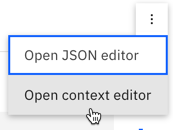

---

copyright:
  years: 2015, 2020
lastupdated: "2020-10-06"

keywords: context, context variable

subcollection: assistant

---

{:shortdesc: .shortdesc}
{:new_window: target="_blank"}
{:external: target="_blank" .external}
{:deprecated: .deprecated}
{:important: .important}
{:note: .note}
{:tip: .tip}
{:pre: .pre}
{:codeblock: .codeblock}
{:screen: .screen}
{:javascript: .ph data-hd-programlang='javascript'}
{:java: .ph data-hd-programlang='java'}
{:python: .ph data-hd-programlang='python'}
{:swift: .ph data-hd-programlang='swift'}
{:gif: data-image-type='gif'}
{:video: .video}

# Personalizing the dialog with context
{: #dialog-runtime-context}

To personalize the conversation, your assistant can collect information from the customer and then refer back to it later in the conversation.
{: shortdesc}

## Anatomy of a dialog call
{: #dialog-runtime-message-anatomy}

Each user input is passed to the dialog as a `/message` API call. Replies that users make in response to prompts from the dialog that ask them for more information are included. A single `/message` API call is equivalent to a single dialog turn, which consists of an input from the customer and a corresponding response from the dialog.

The body of the `/message` API call request and response includes the following objects:

- `context`: Contains variables that are meant to be persisted. For the dialog to subsequently reference information that is submitted by the user, you must store the information in the context object. For example, the dialog can collect the user's name and then refer to the user by name in subsequent nodes. The following example shows how the context object is represented in the dialog JSON editor:

  ```json
  {
    "context" : {
      "user_name" : "<? @name.literal ?>"
    }
  ```
  {: codeblock}

  See [Retaining information across dialog turns](#dialog-runtime-context) for more information.

- `input`: The string of text that was submitted by the user. The text string can contain up to 2,048 characters. The following example shows how the `input` object is represented in the dialog JSON editor:

  ```json
  {
    "input" : {
      "text" : "Where's your nearest store?"
    }
  ```
  {: codeblock}

- `output`: The dialog response to return to the user. The following example shows how the output object is represented in the dialog JSON editor:

  ```json
  {
  "output": {
    "generic": [
      {
        "values": [
          {
            "text": "This is my response text."
          }
        ],
        "response_type": "text",
        "selection_policy": "sequential"
      }
    ]
  }
  }
  ```
  {: codeblock}

In the resulting API `/message` response, the text response is formatted as follows:

```json
{
   "text": "This is my response text.",
   "response_type": "text"
}
```

The following `output` object JSON format is supported for backwards compatibility. With the introduction of rich response types, the `output.text` structure was augmented with the `output.generic` structure to facilitate supporting other types of responses in addition to text. Use the new format when you create new nodes to give yourself more flexibility, because you can subsequently change the response type, if needed.
{: note}

  ```json
  {
  "output": {
    "text": {
      "values": [
        "This is my response text."
      ]
    }
  }
  ```
  {: codeblock}

There are response types other than a text response that you can define. See [Responses](/docs/assistant?topic=assistant-dialog-overview#dialog-overview-responses) for more details.

You can learn more about the `/message` API call from the [API reference](https://{DomainName}/apidocs/assistant/assistant-v2){: external}.

### Retaining information across dialog turns
{: #dialog-runtime-context}

The dialog in a dialog skill is stateless, meaning that it does not retain information from one interaction with the user to the next. When you add a dialog skill to an assistant and deploy it, the assistant saves the context from one message call and then re-submits it on the next request throughout the current session. The current session lasts for as long a user interacts with the assistant plus the designated session inactivity time frame. The maximum session inactivity time allowed ranges from 5 minutes to 7 days, depending on your plan type. If you do not add the dialog skill to an assistant, it is your responsibility as the custom application developer to maintain any continuing information that the application needs.

The application can pass information to the dialog, and the dialog can update this information and pass it back to the application, or to a subsequent node. The dialog does so by using *context variables*.

## Context variables
{: #dialog-runtime-context-variables}

A context variable is a variable that you define in a node. You can specify a default value for it. Other nodes, application logic, or user input can subsequently set or change the value of the context variable.

You can condition against context variable values by referencing a context variable from a dialog node condition to determine whether to execute a node. You can also reference a context variable from dialog node response conditions to show different reponses depending on a value provided by an external service or by the user.

Learn more:

- [Passing context from the application](#dialog-runtime-context-from-app)
- [Passing context from node to node](#dialog-runtime-context-node-to-node)
- [Defining a context variable](#dialog-runtime-context-var-define)
- [Common context variable tasks](#dialog-runtime-context-common-tasks)
- [Deleting a context variable](#dialog-runtime-context-delete)
- [Updating a context variable](#dialog-runtime-context-update)
- [How context variables are processed](#dialog-runtime-context-processing)
- [Order of operation](#dialog-runtime-context-order-of-ops)
- [Adding context variables to a node with slots](#dialog-runtime-context-var-slots)

### Passing context from the application
{: #dialog-runtime-context-from-app}

Pass information from the application to the dialog by setting a context variable and passing the context variable to the dialog.

For example, your application can set a $time_of_day context variable, and pass it to the dialog which can use the information to tailor the greeting it displays to the user.


In this example, the dialog knows that the application sets the variable to one of these values: *morning*, *afternoon*, or *evening*. It can check for each value, and depending on which value is present, return the appropriate greeting. If the variable is not passed or has a value that does not match one of the expected values, then a more generic greeting is displayed to the user.

### Passing context from node to node
{: #dialog-runtime-context-node-to-node}

The dialog can also add context variables to pass information from one node to another or to update the values of context variables. As the dialog asks for and gets information from the user, it can keep track of the information and reference it later in the conversation.

For example, in one node you might ask users for their name, and in a later node address them by name.


In this example, the system entity @sys-person is used to extract the user's name from the input if the user provides one. In the JSON editor, the username context variable is defined and set to the @sys-person value. In a subsequent node, the $username context variable is included in the response to address the user by name.

### Defining a context variable
{: #dialog-runtime-context-var-define}

Define a context variable by adding the variable name to the **Variable** field and adding a default value for it to the **Value** field in the node's edit view.

1.  Click to open the dialog node to which you want to add a context variable.

1.  Go to the *Assistant responds* section and click the menu icon .

      If you're using multiple conditioned responses, you must click the *Customize response* icon  to see the menu that is associated with the response.
      {: tip}

1.  Click **Open context editor**.

      

1.  Add the variable name and value pair to the **Variable** and **Value** fields.

    - The `name` can contain any upper- and lowercase alphabetic characters, numeric characters (0-9), and underscores.

      You can include other characters, such as periods and hyphens, in the name. However, if you do, then you must specify the shorthand syntax `$(variable-name)` every time you subsequently reference the variable. See [Expressions for accessing objects](/docs/assistant?topic=assistant-expression-language#expression-language-shorthand-syntax) for more details.
      {:tip}

    - The `value` can be any supported JSON type, such as a simple string variable, a number, a JSON array, or a JSON object.

The following table shows some examples of how to define name and value pairs for different types of values:

| Variable       | Value                         | Value Type |
|:---------------|-------------------------------|------------|
| dessert        | "cake"                        | String     |
| age            | 18                            | Number     |
| toppings_array | ["onions","olives"]            | JSON Array |
| full_name      | {"first":"John","last":"Doe"} | JSON Object |

To subsequently refer to these context variables, use the syntax `$name` where *name* is the name of the context variable that you defined.

For example, you might specify the following expression as the dialog response:

`The customer, $age-year-old <? $full_name.first ?>, wants a pizza with <? $toppings_array.join(' and ') ?>, and then $dessert.`

The resulting output is displayed as follows:

`The customer, 18-year-old John, wants a pizza with onions and olives, and then cake.`

You can use the JSON editor to define context variables also. You might prefer to use the JSON editor if you want to add a complex expression as the variable value. See [Context variables in the JSON editor](#dialog-runtime-context-var-json) for more details.

### Common context variable tasks
{: #dialog-runtime-context-common-tasks}

To store the entire string that was provided by the user as input, use `input.text`:

| Variable | Value            |
|----------|------------------|
| repeat   | `<?input.text?>` |

For example, the user input is, `I want to order a device.` If the node response is, `You said: $repeat`, then the response would be displayed as, `You said: I want to order a device.`

To store the value of an entity in a context variable, use this syntax:

| Variable | Value            |
|----------|------------------|
| place    | `@place`         |

For example, the user input is, `I want to go to Paris.` If your `@place` entity recognizes `Paris`, then your assistant saves `Paris` in the `$place` context variable.

To store the value of a string that you extract from the user's input, you can include a SpEL expression that uses the `extract` method to apply a regular expression to the user input. The following expression extracts a number from the user input, and saves it to the `$number` context variable.

| Variable | Value                               |
|----------|-------------------------------------|
| number   | `<?input.text.extract('[\d]+',0)?>` |

To store the value of a pattern entity, append .literal to the entity name. Using this syntax ensures that the exact span of text from user input that matched the specified pattern is stored in the variable.

| Variable | Value                  |
|----------|------------------------|
| email    | `<? @email.literal ?>` |

For example, the user input is `Contact me at joe@example.com.` Your entity named `@email` recognizes the `name@domain.com` email format. By configuring the context variable to store `@email.literal`, you indicate that you want to store the part of the input that matched the pattern. If you omit the `.literal` property from the value expression, then the entity value name that you specified for the pattern is returned instead of the segment of user input that matched the pattern.

Many of these value examples use methods to capture different parts of the user input. For more information about the methods available for you to use, see [Expression language methods](/docs/assistant?topic=assistant-dialog-methods).

### Deleting a context variable
{: #dialog-runtime-context-delete}

To delete a context variable, set the variable to null.

| Variable   | Value            |
|------------|------------------|
| order_form | `null`           |

Alternatively you can delete the context variable in your application logic. For information about how to remove the variable entirely, see [Deleting a context variable in JSON](#dialog-runtime-context-delete-json).

### Updating a context variable value
{: #dialog-runtime-context-update}

To update a context variable's value, define a context variable with the same name as the previous context variable, but this time, specify a different value for it.

When more than one node sets the value of the same context variable, the value for the context variable can change over the course of a conversation with a user. Which value is applied at any given time depends on which node is being triggered by the user in the course of the conversation. The value specified for the context variable in the last node that is processed overwrites any values that were set for the variable by nodes that were processed previously.

For information about how to update the value of a context variable when the value is a JSON object or JSON array data type, see [Updating a context variable value in JSON](#dialog-runtime-context-update-json)

### How context variables are processed
{: #dialog-runtime-context-processing}

Where you define the context variable matters. The context variable is not created and set to the value that you specify for it until your assistant processes the part of the dialog node where you defined the context variable. In most cases, you define the context variable as part of the node response. When you do so, the context variable is created and given the specified value when your assistant returns the node response.

For a node with conditional responses, the context variable is created and set when the condition for a specific response is met and that response is processed. For example, if you define a context variable for conditional response #1 and your assistant processes conditional response #2 only, then the context variable that you defined for conditional response #1 is not created and set.

For information about where to add context variables that you want your assistant to create and set as a user interacts with a node with slots, see [Adding context variables to a node with slots](#dialog-runtime-context-var-slots).

### Order of operation
{: #dialog-runtime-context-order-of-ops}

When you define multiple variables to be processed together, the order in which you define them does not determine the order in which they are evaluated by your assistant. Your assistant evaluates the variables in random order. Do not set a value in the first context variable in the list and expect to be able to use it in the second variable in the list, because there is no guarantee that the first context variable will be executed before the second one. For example, do not use two context variables to implement logic that checks whether the user input contains the word `Yes` in it.

| Variable        | Value            |
|-----------------|------------------|
| user_input      | <? input.text ?> |
| contains_yes    | <? $user_input.contains('Yes') ?> |

Instead, use a slightly more complex expression to avoid having to rely on the value of the first variable in your list (user_input) being evaluated before the second variable (contains_yes) is evaluated.

| Variable      | Value            |
|---------------|------------------|
| contains_yes  | <? input.text.contains('Yes') ?> |

### Adding context variables to a node with slots
{: #dialog-runtime-context-var-slots}

For more information about slots, see [Gathering information with slots](/docs/assistant?topic=assistant-dialog-slots).

1.  Open the node with slots in the edit view.

    - To add a context variable that is processed after a response condition for a slot is met, perform the following steps:

      1.  Click the *Edit slot* icon .
      1.  Click the *Options* icon , and then select **Enable conditional responses**.
      1.  Click the *Edit response* icon  next to the response with which you want to associate the context variable.
      1.  Click the *Options* icon  in the response section, and then click **Open context editor**.
      1.  Add the variable name and value pair to the **Variable** and **Value** fields.

      

    - To add a context variable that is set or updated after a slot condition is met, complete the following steps:

      1.  Click the *Edit slot* icon .
      1.  From the *Options*  menu in the *Configure slot* view header, click **Open JSON editor**.
      1.  Add the variable name and value pair in JSON format.

          ```json
          {
            "time_of_day": "morning"
          }
          ```
          {: codeblock}

      There is currently no way to use the context editor to define context variables that are set during this phase of dialog node evaluation. You must use the JSON editor instead. For more information about using the JSON editor, see [Context variables in the JSON editor](#dialog-runtime-context-var-json).
      {: note}

      

## Context variables in the JSON editor
{: #dialog-runtime-context-var-json}

You can also define a context variable in the JSON editor. You might want to use the JSON editor if you are defining a complex context variable and want to be able to see the full SpEL expression as you add or change it.

The name and value pair must meet these requirements:

- The `name` can contain any upper- and lowercase alphabetic characters, numeric characters (0-9), and underscores.

  You can include other characters, such as periods and hyphens, in the name. However, if you do, then you must specify the shorthand syntax `$(variable-name)` every time you subsequently reference the variable. See [Expressions for accessing objects](/docs/assistant?topic=assistant-expression-language#expression-language-shorthand-syntax) for more details.
  {:tip}

- The `value` can be any supported JSON type, such as a simple string variable, a number, a JSON array, or a JSON object.

The following JSON sample defines values for the $dessert string, $toppings_array array, $age number, and $full_name object context variables:

```json
{
  "context": {
    "dessert": "cake",
    "toppings_array": [
      "onions",
      "olives"
    ],
    "age": 18,
    "full_name": {
      "first": "Jane",
      "last": "Doe"
    }
  },
  "output":{}
}
```
{: codeblock}

To define a context variable in JSON format, complete the following steps:

1.  Click to open the dialog node to which you want to add the context variable.

    Any existing context variable values that are defined for this node are displayed in a set of corresponding **Variable** and **Value** fields. If you do not want them to be displayed in the edit view of the node, you must close the context editor. You can close the editor from the same menu that is used to open the JSON editor; the following steps describe how to access the menu.
    {: note}

1.  Click the *Options* icon  that is associated with the response, and then click **Open JSON editor**.

    

    If the **Multiple responses** setting is **On** for the node, then you must first click the **Edit response**  icon for the response with which you want to associate the context variable.

    

1.  Add a `"context":{}` block if one is not present.

    ```json
    {
      "context":{},
      "output":{}
    }
    ```
    {: codeblock}

1.  In the context block, add a `"name"` and `"value"` pair for each context variable that you want to define.

    ```json
    {
      "context":{
        "name": "value"
    },
      "output": {}
    }
    ```
    {: codeblock}

    In this example, a variable named `new_variable` is added to a context block that already contains a variable.

    ```json
    {
      "context":{
        "existing_variable": "value",
        "new_variable":"value"
      }
    }
    ```
    {: codeblock}

    To subsequently reference the context variable, use the syntax `$name` where *name* is the name of the context variable that you defined. For example, `$new_variable`.

Learn more:

- [Deleting a context variable in JSON](#dialog-runtime-context-delete-json)
- [Updating a context variable value in JSON](#dialog-runtime-context-update-json)
- [Setting one context variable equal to another](#dialog-runtime-var-equals-var)

### Deleting a context variable in JSON
{: #dialog-runtime-context-delete-json}

To delete a context variable, set the variable to null.

```json
{
  "context": {
    "order_form": null
  }
}
```
{: codeblock}

If you want to remove all trace of the context variable, you can use the JSONObject.remove(string) method to delete it from the context object. However, you must use a variable to perform the removal. Define the new variable in the message output so it will not be saved beyond the current call.

```json
{
  "output": {
    "text" : {},
    "deleted_variable" : "<? context.remove('order_form') ?>"
  }
}
```
{: codeblock}

Alternatively you can delete the context variable in your application logic.

### Updating a context variable value in JSON
{: #dialog-runtime-context-update-json}

In general, if a node sets the value of a context variable that is already set, then the previous value is overwritten by the new value.

#### Updating a complex JSON object

Previous values are overwritten for all JSON types except a JSON object. If the context variable is a complex type such as JSON object, a JSON merge procedure is used to update the variable. The merge operation adds any newly defined properties and overwrites any existing properties of the object.

In this example, a name context variable is defined as a complex object.

```json
{
  "context": {
    "complex_object": {
      "user_firstname" : "Paul",
      "user_lastname" : "Pan",
      "has_card" : false
    }
  }
}
```
{: codeblock}

A dialog node updates the context variable JSON object with the following values:

```json
{
  "complex_object": {
    "user_firstname": "Peter",
    "has_card": true
  }
}
```
{: codeblock}

The result is this context:

```json
{
  "complex_object": {
    "user_firstname": "Peter",
    "user_lastname": "Pan",
    "has_card": true
  }
}
```
{: codeblock}

See [Expression language methods](/docs/assistant?topic=assistant-dialog-methods#dialog-methods-objects) for more information about methods you can perform on objects.

#### Updating arrays

If your dialog context data contains an array of values, you can update the array by appending values, removing a value, or replacing all the values.

Choose one of these actions to update the array. In each case, we see the array before the action, the action, and the array after the action has been applied.

- **Append**: To add values to the end of an array, use the `append` method.

    For this Dialog runtime context:

    ```json
    {
      "context": {
        "toppings_array": ["onion", "olives"]
      }
    }
    ```
    {: codeblock}

    Make this update:

    ```json
    {
      "context": {
        "toppings_array": "<? $toppings_array.append('ketchup', 'tomatoes') ?>"
      }
    }
    ```
    {: codeblock}

    Result:

    ```json
    {
      "context": {
        "toppings_array": ["onion", "olives", "ketchup", "tomatoes"]
      }
    }
    ```
    {: codeblock}

- **Remove**: To remove an element, use the `remove` method and specify its value or position in the array.

    - **Remove by value** removes an element from an array by its value.

        For this Dialog runtime context:

        ```json
        {
          "context": {
            "toppings_array": ["onion", "olives"]
          }
        }
        ```
        {: codeblock}

        Make this update:

        ```json
        {
          "context": {
            "toppings_array": "<? $toppings_array.removeValue('onion') ?>"
          }
        }
        ```
        {: codeblock}

        Result:

        ```json
        {
          "context": {
            "toppings_array": ["olives"]
          }
        }
        ```
        {: codeblock}

    - **Remove by position**: Removing an element from an array by its index position:

        For this Dialog runtime context:

        ```json
        {
          "context": {
            "toppings_array": ["onion", "olives"]
          }
        }
        ```
        {: codeblock}

        Make this update:

        ```json
        {
          "context": {
            "toppings_array": "<? $toppings_array.remove(0) ?>"
          }
        }
        ```
        {: codeblock}

        Result:

        ```json
        {
          "context": {
            "toppings_array": ["olives"]
          }
        }
        ```
        {: codeblock}

- **Overwrite**: To overwrite the values in an array, simply set the array to the new values:

    For this Dialog runtime context:

        ```json
        {
          "context": {
            "toppings_array": ["onion", "olives"]
          }
        }
        ```
        {: codeblock}

    Make this update:

        ```json
        {
          "context": {
            "toppings_array": ["ketchup", "tomatoes"]
          }
        }
        ```
        {: codeblock}

    Result:

        ```json
        {
          "context": {
            "toppings_array": ["ketchup", "tomatoes"]
          }
        }
        ```
        {: codeblock}

See [Expression language methods](/docs/assistant?topic=assistant-dialog-methods#dialog-methods-arrays) for more information about methods you can perform on arrays.

### Setting one context variable equal to another
{: #dialog-runtime-var-equals-var}

When you set one context variable equal to another context variable, you define a pointer from one to the other. If the value of one of the variables subsequently changes, then the value of the other variable is changed also.

For example, if you specify a context variable as follows, then when the value of either `$var1` or `$var2` subsequently changes, the value of the other changes too.

| Variable  | Value  |
|-----------|--------|
| var2      | var1   |

Do not set one variable equal to another to capture a point in time value. When dealing with arrays, for example, if you want to capture an array value stored in a context variable at a certain point in the dialog to save it for later use, you can create a new variable based on the current value of the variable instead.

For example, to create a copy of the values of an array at a certain point of the dialog flow, add a new array that is populated with the values for the existing array. To do so, you can use the following syntax:

```json
{
"context": {
   "var2": "<? output.var2?:new JsonArray().append($var1) ?>"
 }
 }
 ```
{: codeblock}
