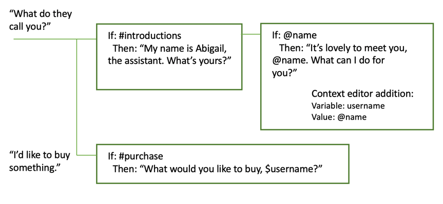

---

copyright:
  years: 2015, 2018
lastupdated: "2018-03-21"

---

{:shortdesc: .shortdesc}
{:new_window: target="_blank"}
{:tip: .tip}
{:pre: .pre}
{:codeblock: .codeblock}
{:screen: .screen}
{:javascript: .ph data-hd-programlang='javascript'}
{:java: .ph data-hd-programlang='java'}
{:python: .ph data-hd-programlang='python'}
{:swift: .ph data-hd-programlang='swift'}

# How the dialog is processed
{: #dialog-runtime}

Understand how your dialog is processed when a person interacts with your instance of the deployed {{site.data.keyword.conversationshort}} service at run time.
{: shortdesc}

## Anatomy of a dialog call
{: message-anatomy}

Each user utterance is passed to the dialog as a /message API call. This includes utterances that users make in reply to prompts from the dialog that ask them for more information. Some subscription plans include a set number of API calls, so it helps to understand what constitutes a call. A single /message API call is equivalent to a single dialog turn, which consists of an input from the user and a corresponding response from the dialog.

The body of the /message API call request and response includes the following objects:

- `context`: Contains variables that are meant to be persisted. To pass information from one call to the next, the application developer must pass the previous API call's response context in with each subsequent API call. For example, the dialog can collect the user's name and then refer to the user by name in subsequent nodes.

  ```json
  {
    "context" : {
      "user_name" : "<? @sys-person.literal ?>"
    }
  ```
  {: codeblock}

  See [Retaining information across dialog turns](dialog-runtime.html#context) for more information.

- `input`: The string of text that was submitted by the user. The text string can contain up to 2,048 characters.

  ```json
  {
    "input" : {
      "text" : "Where's your nearest store?"
    }
  ```
  {: codeblock}

- `output`: The dialog response to display to the user. You can use this section to define objects, such as variables, that are not meant to be persisted. For example, if you want to permanently delete a context variable named `temp` that you defined elsewhere in the dialog, you can use the following expression to do so.

  ```json
  {
  "output": {
    "text" : {},
    "deleted_variable" : "<? context.remove('temp') ?>"
  ```
  {: codeblock}

  See [A complex response](dialog-overview.html#complex) for more information about the output object.

You can learn more about the /message API call from the [API reference ](https://www.ibm.com/watson/developercloud/conversation/api/v1/){: new_window}.

## Retaining information across dialog turns
{: #context}

The dialog is stateless, meaning that it does not retain information from one interaction with the user to the next. It is the responsibility of the application developer to maintain any continuing information that the application needs. The application must look for, and store the context object in the message API response, and pass it in the context object with the next /message API request that is made as part of the conversation flow.

The simplest way to retain the information is to store the entire context object in memory in the client application - a web browser, for example. As an application becomes more complex, or if it needs to pass and store personally identifiable information, then you can store and retrieve the information from a database.

The application can pass information to the dialog, and the dialog can update this information and pass it back to the application, or to a subsequent node. The dialog does so by using context variables.

A context variable is a variable that you define in a node, and optionally specify a default value for. Other nodes or application logic can subsequently set or change the value of the context variable.

You can condition against context variable values by referencing a context variable from a dialog node condition to determine whether to execute a node. And you can reference a context variable from dialog node response conditions to show different reponses depending on a value provided by an external service or by the user.

### Passing context from the application
{: #context-from-app}

Pass information from the application to the dialog by setting a context variable and passing the context variable to the dialog.

For example, your application can set a $time_of_day context variable, and pass it to the dialog which can use the information to tailor the greeting it displays to the user.


In this example, the dialog knows that the application sets the variable to one of these values: *morning*, *afternoon*, or *evening*. It can check for each value, and depending on which value is present, return the appropriate greeting. If the variable is not passed or has a value that does not match one of the expected values, then a more generic greeting is displayed to the user.

### Passing context from node to node
{: #context-node-to-node}

The dialog can also add context variables to pass information from one node to another or to update the values of context variables. As the dialog asks for and gets information from the user, it can keep track of the information and reference it later in the conversation.

For example, in one node you might ask users for their name, and in a later node address them by name.



In this example, the system entity @sys-person is used to extract the user's name from the input if the user provides one. In the JSON editor, the username context variable is defined and set to the @sys-person value. In a subsequent node, the $username context variable is included in the response to address the user by name.

## Defining a context variable
{: #context-var-define}

Define a context variable by defining a name and value pair for the variable in one of the following editors:

- **Context editor**: Shows a **Variable** field and a corresponding **Value** field in the node edit view that you can fill with the context variable name and value information.

  **Note**: These fields are displayed automatically in nodes that you add. For nodes that were created with an earlier version of the service, you must open the context editor for the fields to be added.

- **JSON editor**: When opened, it provides a view into the underlying JSON content that is passed with the /message API request that is sent to the {{site.data.keyword.conversationshort}} service. You can define context variables by adding name and value pairs to the `"context":{}` section of the JSON body.

The name and value pair must meet these requirements:

- The `name` can contain any upper- and lowercase alphabetic characters, numeric characters (0-9), and underscores.

  **Note**: You can include other characters, such as periods and hyphens, in the name. However, if you do, then you must use one of the following approaches every time you subsequently reference the variable:

  - **context['variable-name']**

      The full SpEL expression syntax.
  - **$(variable-name)**

      Shorthand syntax with the variable name enclosed in parentheses.
    See [Accessing and evaluating objects](expression-language.html#shorthand-syntax-for-context-variables) for more details.

- The `value` can be any supported JSON type, such as a simple string variable, a number, or a JSON array. When you define the context variable using the JSON editor, you can specify a JSON object as the value also.

The following table shows how to define name and value pairs in context variable editor fields:

| Variable       | Value              |
|:---------------|--------------------|
| dessert        | cake               |
| toppings_array | ["onion","olives"] |
| age            | 18                 |

The following JSON sample defines values for the $dessert string, $toppings_array array, and $age number context variables:

```json
{
  "context": {
    "dessert": "cake",
    "toppings_array": ["onion", "olives"],
    "age": 18
  }
}
```
{: codeblock}

To define a context variable, complete the following steps:

1.  Define the context variable in the section of the node that represents the time at which you want the variable to be set during dialog node evaluation.

    **Note**: Any existing context variable values that are defined for this node are displayed in a set of corresponding **Variable** and **Value** fields. If you do not want them to be displayed in the edit view of the node, you must close the context editor. You can close the editor from the same menu that is used to open it; the following steps describe how to access the menu.

    - To add a context variable that is set or changed after the node response is processed, add the context variable into the response section.

      Click the **Options**   icon that is associated with the response, and then choose an editor by selecting one of the following options:

      - **Open JSON editor**
      - **Open context editor**

      

      If the **Multiple responses** setting is **On** for the node, then you must click the **Edit response**  icon first.

      

    - To add a context variable that is set or updated after a slot condition is met, click the **Edit slot**  icon. From the **Options**  menu in the *Configure slot* view header, click **Open JSON editor**. (For more information about slots, see [Gathering information with slots](dialog-slots.html).)

      **Note**: There is currently no way to use the context editor to define context variables that are set during this phase of dialog node evaluation.

      

    - To add a context variable that is processed after a response condition for a slot is met, click the **Edit slot**  icon. Click the **Options**  icon, and then select **Enable conditional responses**. Click the **Edit response**  icon next to the response with which you want to associate the context variable. Click the **Options**  icon in the response section, and then choose an editor by selecting one of the following options:

      - **Open JSON editor**
      - **Open context editor**

      
1.  To define the context variable in the context editor, add the variable name and value pair to the **Variable** and **Value** fields.
1.  To define the context variable in the JSON editor, complete these additional steps:

    - Add a `"context":{}` block if one is not present.

      ```json
      {
        "context":{},
        "output":{}
      }
      ```
      {: codeblock}

    - In the context block, add a name and value pair for each context variable that you want to define.

      ```json
      {
        "context":{
          "name": "value"
      },
        "output": {}
      }
      ```
      {: codeblock}

    In this example, a variable named `new_variable` is added to a context block that already contains a variable.

    ```json
    {
      "context":{
        "existing_variable": "value",
        "new_variable":"value"
      }
    }
    ```
    {: codeblock}

    To subsequently reference the context variable, use the syntax `$name` where *name* is the name of the context variable that you defined. For example, `$new_variable`.

## Common context variable tasks
{: #context-common-tasks}

To store the entire string that was provided by the user as input, use `input.text`:

| Variable | Value            |
|----------|------------------|
| repeat   | `<?input.text?>` |

```json
{
  "context": {
    "repeat": "<?input.text?>"
  }
}
```
{: codeblock}

To store the value of an entity in a context variable, use this syntax:

| Variable | Value            |
|----------|------------------|
| place    | @place           |

```json
{
  "context": {
    "place": "@place"
  }
}
```
{: codeblock}

You can add a JSON object to a context variable using either editor. The following expression defines a full_name object that contains a set of first and last values, which together form a person's full name.

| Variable      | Value            |
|---------------|------------------|
| full_name     | { "first":"Paul", "last":"Smith" } |

```json
{
  "context": {
    "full_name": {
      "first":"Paul",
      "last":"Smith"
      }
  }
}
```
{: codeblock}

If you specify `$full_name.first` in the response, `Paul` is displayed.

To store the value of a string that you extract from the user's input, you can include a SpEL expression that uses the extract method to apply a regular expression to the user input. The following expression extracts a number from the user input, and saves it to the `$number` context variable.

| Variable | Value                               |
|----------|-------------------------------------|
| number   | `<?input.text.extract('[\d]+',0)?>` |

```json
{
  "context": {
     "number": "<?input.text.extract('[\\d]+',0)?>"
  }
}
```
{: codeblock}

When you define a regular expression in the JSON editor, you must escape any back slashes that you use in the expression with another back slash (`\\`). You do not need to escape back slashes in regular expressions that you define using the context variable editor.
{: tip}

To store the value of a pattern entity, append .literal to the entity name. Using this syntax ensures that the exact span of text from user input that matched the specified pattern is stored in the variable.

| Variable | Value            |
|----------|------------------|
| email    | @email.literal   |

```json
{
  "context": {
    "email": "<? @email.literal ?>"
  }
}
```
{: codeblock}

## Deleting a context variable
{: #context-delete}

To delete a context variable, set the variable to null.

```json
{
  "context": {
    "order_form": null
  }
}
```
{: codeblock}

If you want to remove all trace of the context variable, you can use the JSONObject.remove(string) method to delete it from the context object. However, you must use a variable to perform the removal. Define the new variable in the message output so it will not be saved beyond the current call.

```json
{
  "output": {
    "text" : {},
    "deleted_variable" : "<? context.remove('order_form') ?>"
  }
}
```
{: codeblock}

Alternatively you can delete the context variable in your application logic.

### Order of operation
{: #context-order-of-ops}

The order in which you define the context variables does not determine the order in which they are evaluated by the service. The service evaluates the variables, which are defined as JSON name and value pairs, in random order. Do not set a value in the first context variable and expect to be able to use it in the second, because there is no guarantee that the first context variable in your list will be executed before the second one in your list. For example, do not use two context variables to implement logic that returns a random number between zero and some higher value that is passed to the node.

```json
"context": {
    "upper": "<? @sys-number.numeric_value + 1?>",
    "answer": "<? new Random().nextInt($upper) ?>"
}
```
{: codeblock}

Use a slightly more complex expression to avoid having to rely on the value of the $upper context variable being evaluated before the $answer context variable is evaluated.

```json
"context": {
    "answer": "<? new Random().nextInt(@sys-number.numeric_value + 1) ?>"
}
```
{: codeblock}

### Storing pattern entity values
{: #context-pattern-entities}

To store the value of a pattern entity in a context variable, append .literal to the entity name. Using this syntax ensures that the exact span of text from user input that matched the specified pattern is stored in the variable.

```json
{
  "context": {
    "email": "<? @email.literal ?>"
  }
}
```
{: codeblock}

To store the text from a single group in a pattern entity with groups defined, specify the array number of the group that you want to store. For example, assume that the entity pattern is defined as follows for the @phone_number entity. (Remember, the parentheses denote pattern groups):

`\b((958)|(555))-(\d{3})-(\d{4})\b`

To store only the area code from the phone number that is specified in user input, you can use the following syntax:

```json
{
  "context": {
    "area_code": "<? @phone_number.groups[1] ?>"
  }
}
```
{: codeblock}

The groups are delimited by the regular expression that is used to define the group pattern. For example, if the user input that matches the pattern defined in the entity `@phone_number` is: `958-234-3456`, then the following groups are created:

| Group number | Regex engine value  | Dialog value   | Explanation |
|--------------|---------------------|----------------|-------------|
| groups[0]    | `958-234-3456`      | `958-234-3456` | The first group is always the full matching string. |
| groups[1]    | `((958)`l`(555))`   | `958`          | String that matches the regex for the first defined group, which is `((958)`l`(555))`. |
| groups[2]    | `(958)`             | `958`          | Match against the group that is included as the first operand in the OR expression `((958)`l`(555))` |
| groups[3]    | `(555)`             | `null`         | No match against the group that is included as the second operand in the OR expression `((958)`l`(555))` |
| groups[4]    | `(\d{3})`           | `234`          | String that matches the regular expression that is defined for the group. |
| groups[5]    | `(\d{4})`           | `3456`         | String that matches the regular expression that is defined for the group. |
{: caption="Group details" caption-side="top"}

To help you decipher which group number to use to capture the section of input you are interested in, you can extract information about all the groups at once. Use the following syntax to create a context variable that returns an array of all the grouped pattern entity matches:

```json
{
  "context": {
    "array_of_matched_groups": "<? @phone_number.groups ?>"
  }
}
```
{: codeblock}

Use the "Try it out" pane to enter some test phone number values. For the input `958-123-2345`, this expression sets `$array_of_matched_groups` to `["958-123-2345","958","958",null,"123","2345"]`.

You can then count each value in the array starting with 0 to get the group number for it.

| Array element value | Array element number |
|---------------------|----------------------|
| "958-123-2345"      | 0 |
| "958"               | 1 |
| "958"               | 2 |
| null                | 3 |
| "123"               | 4 |
| "2345"              | 5 |
{: caption="Array elements" caption-side="top"}

It is easy to determine that, to capture the last four digits of the phone number, you need group #5, for example.

To return the JSONArray structure that is created to represent the grouped pattern entity, use the following syntax:

```json
{
  "context": {
    "json_matched_groups": "<? @phone_number.groups_json ?>"
  }
}
```
{: codeblock}

This expression sets `$json_matched_groups` to the following JSON array:

```json
[
  {"group": "group_0","location": [0, 12]},
  {"group": "group_1","location": [0, 3]},
  {"group": "group_2","location": [0, 3]},
  {"group": "group_3"},
  {"group": "group_4","location": [4, 7]},
  {"group": "group_5","location": [8, 12]}
]
```
{: codeblock}

**Note**: `location` is a property of an entity that uses a zero-based character offset to indicate where the detected entity value begins and ends in the input text.

If you expect two phone numbers to be supplied in the input, then you can check for two phone numbers. If present, use the following syntax to capture the area code of the second number, for example.

```json
{
  "context": {
    "second_areacode": "<? entities['phone_number'][1].groups[1] ?>"
  }
}
```
{: codeblock}

If the input is `I want to change my phone number from 958-234-3456 to 555-456-5678`, then `$second_areacode` equals `555`.

## Updating a context variable value
{: #context-update}

If a node sets the value of a context variable that is already set, then the previous value is overwritten.

### Updating a complex JSON object

Previous values are overwritten for all JSON types except a JSON object. If the context variable is a complex type such as JSON object, a JSON merge procedure is used to update the variable. The merge operation adds any newly defined properties and overwrites any existing properties of the object.

In this example, a name context variable is defined as a complex object.

```json
{
  "context": {
    "complex_object": {
      "user_firstname" : "Paul",
      "user_lastname" : "Pan",
      "has_card" : false
    }
  }
}
```
{: codeblock}

A dialog node updates the context variable JSON object with the following values:

```json
{
  "complex_object": {
    "user_firstname": "Peter",
    "has_card": true
  }
}
```
{: codeblock}

The result is this context:

```json
{
  "complex_object": {
    "user_firstname": "Peter",
    "user_lastname": "Pan",
    "has_card": true
  }
}
```
{: codeblock}

See [Expression language methods](dialog-methods.html#objects) for more information about methods you can perform on objects.

### Updating arrays

If your dialog context data contains an array of values, you can update the array by appending values, removing a value, or replacing all the values.

Choose one of these actions to update the array. In each case, we see the array before the action, the action, and the array after the action has been applied.

- **Append**: To add values to the end of an array, use the `append` method.

    For this Dialog runtime context:

    ```json
    {
      "context": {
        "toppings_array": ["onion", "olives"]
      }
    }
    ```
    {: codeblock}

    Make this update:

    ```json
    {
      "context": {
        "toppings_array": "<? $toppings_array.append('ketchup', 'tomatoes') ?>"
      }
    }
    ```
    {: codeblock}

    Result:

    ```json
    {
      "context": {
        "toppings_array": ["onion", "olives", "ketchup", "tomatoes"]
      }
    }
    ```
    {: codeblock}

- **Remove**: To remove an element, use the `remove` method and specify its value or position in the array.

    - **Remove by value** removes an element from an array by its value.

        For this Dialog runtime context:

        ```json
        {
          "context": {
            "toppings_array": ["onion", "olives"]
          }
        }
        ```
        {: codeblock}

        Make this update:

        ```json
        {
          "context": {
            "toppings_array": "<? $toppings_array.removeValue('onion') ?>"
          }
        }
        ```
        {: codeblock}

        Result:

        ```json
        {
          "context": {
            "toppings_array": ["olives"]
          }
        }
        ```
        {: codeblock}

    - **Remove by position**: Removing an element from an array by its index position:

        For this Dialog runtime context:

        ```json
        {
          "context": {
            "toppings_array": ["onion", "olives"]
          }
        }
        ```
        {: codeblock}

        Make this update:

        ```json
        {
          "context": {
            "toppings_array": "<? $toppings_array.remove(0) ?>"
          }
        }
        ```
        {: codeblock}

        Result:

        ```json
        {
          "context": {
            "toppings_array": ["olives"]
          }
        }
        ```
        {: codeblock}

- **Overwrite**: To overwrite the values in an array, simply set the array to the new values:

    For this Dialog runtime context:

        ```json
        {
          "context": {
            "toppings_array": ["onion", "olives"]
          }
        }
        ```
        {: codeblock}

    Make this update:

        ```json
        {
          "context": {
            "toppings_array": ["ketchup", "tomatoes"]
          }
        }
        ```
        {: codeblock}

    Result:

        ```json
        {
          "context": {
            "toppings_array": ["ketchup", "tomatoes"]
          }
        }
        ```
        {: codeblock}

See [Expression language methods](dialog-methods.html#arrays) for more information about methods you can perform on arrays.

## Digressions
{: #digressions}

A digression occurs when a user is in the middle of a dialog flow that is designed to address one goal, and abruptly switches topics to initiate a dialog flow that is designed to address a different goal. The dialog has always supported the user's ability to change subjects. If none of the nodes in the dialog branch that is being processed match the goal of the user's latest input, the conversation goes back out to the tree to check the root node conditions for an appropriate match. The digression settings that are available per node give you the ability to tailor this behavior even more.

With digression settings, you can allow the conversation to return to the dialog flow that was interrupted when the digression occurred. For example, the user might be ordering a new phone, but switches topics to ask about tablets. Your dialog can answer the question about tablets, and then bring the user back to where they left off in the process of ordering a phone. Allowing digressions to occur and return gives your users more control over the flow of the conversation at run time. They can change topics, follow a dialog flow about the unrelated topic to its end, and then return to where they were before. The result is a dialog flow that more closely simulates a human-to-human conversation.

<iframe class="embed-responsive-item" id="youtubeplayer" type="text/html" width="640" height="390" src="https://www.youtube.com/embed/I3K7mQ46K3o?rel=0" frameborder="0" webkitallowfullscreen mozallowfullscreen allowfullscreen> </iframe>

The following image uses a mockup of the dialog tree user interface to illustrate the concept of a digression. It shows how a user interacts with dialog nodes that are configured to allow digressions that return to the dialog flow that was in progress. The user starts to provide the information required to make a dinner reservation. In the middle of filling slots in the #reservation node, the user asks a question about vegetarian menu options. The dialog answers the user's new question by finding a node that addresses it amongst the root nodes (a node that conditions on the #cuisine intent). It then returns to the conversation that was in progress by showing the prompt for the next empty slot from the original dialog node.


### Before you begin

As you test your overall dialog, decide when and where it makes sense to allow digressions and returns from digressions to occur. The following digression controls are applied to the nodes automatically. Only take action if you want to change this default behavior.

- Every root node in your dialog is configured to allow digressions to target them by default. Child nodes cannot be the target of a digression.
- Nodes with slots are configured to prevent digressions away. All other nodes are configured to allow digressions away. However, the conversation cannot digress away from a node under the following circumstances:

  - If any of the child nodes of the current node contain the `anything_else` or `true` condition

    These conditions are special in that they always evaluate to true. Because of their known behavior, they are often used in dialogs to force a parent node to evaluate a specific child node in succession. To prevent breaking existing dialog flow logic, digression are not allowed in this case. Before you can enable digressions away from such a node, you must change the child node's condition to something else.

  - If the node is configured to jump to another node or skip user input after it is processed

    The final step section of a node specifies what should happen after the node is processed. When the dialog is configured to jump directly to another node, it is often to ensure that a specific sequence is followed. And when the node is configured to skip user input, it is equivalent to forcing the dialog to process the first child node after the current node in succession. To prevent breaking existing dialog flow logic, digressions are not allowed in either of these cases. Before you can enable digressions away from this node, you must change what is specified in the final step section.

### Customizing digressions
{: #enable-digressions}

You do not define the start and end of a digression. The user is entirely in control of the digression flow at run time. You only specify how each node should or should not participate in a user-led digression. For each node, you configure whether:

- a digression can start from and leave the node
- a digression that starts elsewhere can target and enter the node
- a digression that starts elsewhere and enters the node must return to the interrupted dialog flow after the current dialog flow is completed

To change the digression behavior for an individual node, complete the following steps:

1.  Click the node to open its edit view.

1.  Click **Customize**, and then click the **Digressions** tab.

    The configuration options differ depending on whether the node you are editing is a root node, a child node, a node with children, or a node with slots.

    **Digressions away from this node**

    If the circumstances listed earlier do not apply, then you can make the following choices:

    - **All node types**: Choose whether to allow users to digress away from the current node before they reach the end of the current dialog branch.

    - **All nodes that have children**: Choose whether you want the conversation to come back to the current node after a digression if the current node's response has already been displayed and its child nodes are incidental to the node's goal. Set the *Allow return from digressions triggered after this node's response* toggle to **No** to prevent the dialog from returning to the current node and continuing to process its branch.

      For example, if the user asks, `Do you sell cupcakes?` and the response, `We offer cupcakes in a variety of flavors and sizes` is displayed before the user changes subjects, you might not want the dialog to return to where it left off. Especially, if the child nodes only address possible follow-up questions from the user and can safely be ignored.

      However, if the node relies on its child nodes to address the question, then you might want to force the conversation to return and continue processing the nodes in the current branch. For example, the initial response might be, `We offer cupcakes in all shapes and sizes. Which menu do you want to see: gluten-free, dairy-free, or regular?` If the user changes subjects at this point, you might want the dialog to return so the user can pick a menu type and get the information they wanted.

    - **Nodes with slots**: Choose whether you want to allow users to digress away from the node before all of the slots are filled. Set the *Allow digressions away while slot filling* toggle to **Yes** to enable digressions away.

      If enabled, when the conversation returns from the digression, the prompt for the next unfilled slot is displayed to encourage the user to continue providing information. If disabled, then any inputs that the user submits which do not contain a value that can fill a slot are ignored. However, you can address unsolicited questions that you anticipate your users might ask while they interact with the node by defining slot handlers. See [Adding slots](dialog-slots.html#add-slots) for more information.

      The following image shows you how digressions away from the #reservation node with slots (shown in the earlier illustration) are configured.

      

    - **Nodes with slots**: Choose whether the user is only allowed to digress away if they will return to the current node by selecting the **Only digress from slots to nodes that allow returns** checkbox.

      When selected, as the dialog looks for a node to answer the user's unrelated question, it ignores any root nodes that are not configured to return after the digression. Select this checkbox if you want to prevent users from being able to permanently leave the node before they have finished filling the required slots.

    **Digressions into this node**

    You can make the following choices about how digressions into a node behave:

    - Prevent users from being able to digress into the node. See [Disabling digressions into a root node](#diable-digressions) for more details.

    - When digressions into the node are enabled, choose whether the dialog must go back to the dialog flow that it digressed away from. When selected, after the current node's branch is done being processed, the dialog flow goes back to the interrupted node. To make the dialog return afterwards, select **Return after digression**.

    The following image shows you how digressions into the #cuisine node (shown in the earlier illustration) are configured.

    

1.  Click **Apply**.

1.  Use the "Try it out" pane to test the digression behavior.

    Again, you cannot define the start and end of a digression. The user controls where and when digressions happen. You can only apply settings that determine how a single node participates in one. Because digressions are so amorphous, it is hard to predict how your configuration decisions will impact the overall conversation. To truly see the impact of the choices you made, you must test the dialog.

The #reservation and #cuisine nodes represent two dialog branches that participate in a single user-directed digression. The digression settings that are configured for each individual node are what make this type of digression possible at run time.


### Disabling digressions into a root node
{: #disable-digressions}

When a flow digresses into a root node, it follows the course of the dialog that is configured for that node. So, it might process a series of child nodes before it reaches the end of the node branch, and then, if configured to do so, goes back to the dialog flow that was interrupted. Through dialog testing, you might find that a root node is triggered too often, or at unexpected times, or that its dialog is too complex and leads the user too far off course to be a good candidate for a temporary digression. If you determine that you would rather not allow users to digress into it, you can configure the root node to not allow digressions in.

To disable digressions into a root node altogether, complete the following steps:

1.  Click to open the root node that you want to edit.
1.  Click **Customize**, and then click the **Digressions** tab.
1.  Set the *Allow digressions into this node* toggle to **Off**.
1.  Click **Apply**.

If you decide that you want to prevent digressions into several root nodes, but do not want to edit each one individually, you can add the nodes to a folder. From the *Customize* page of the folder, you can set the *Allow digressions into this node* toggle to **Off** to apply the configuration to all of the nodes at once. See [Organizing the dialog with folders](dialog-build.html#folders) for more information.

### Digression tutorial
{: #digression-tutorial}

Follow the [tutorial](tutorial-digressions.html) to import a workspace that has a set of nodes already defined. You can walk through some exercises that illustrate how digressions work.

### Design considerations
{: #digression-design-considerations}

- **Avoid fallback node proliferation**: Many dialog designers include a node with a `true` or `anything_else` condition at the end of every dialog branch as a way to prevent users from getting stuck in the branch. This design returns a generic message if the user input does not match anything that you anticipated and included a specific dialog node to address. However, users cannot digress away from dialog flows that use this approach.

  Evaluate any branches that use this approach to determine whether it would be better to allow digressions away from the branch. If the user's input does not match anything you anticipated, it might find a match against an entirely different dialog flow in your tree. Rather than responding with a generic message, you can effectively put the rest of the dialog to work to try to address the user's input. And the root-level `Anything else` node can always respond to input that none of the other root nodes can address.

- **Reconsider jumps to a closing node**: Many dialogs are designed to ask a standard closing question, such as, `Did I answer your question today?` Users cannot digress away from nodes that are configured to jump to another node. So, if you configure all of your final branch nodes to jump to a common closing node, digressions cannot occur. Consider tracking user satisfaction through metrics or some other means.

- **Test possible digression chains**: If a user digresses away from the current node to another node that allows digressions away, the user could potentially digress away from that other node, and repeat this pattern one or more times again. If the starting node in the digression chain is configured to return after the digression, then the user will eventually be brought back to the current dialog node. In fact, any subsequent nodes in the chain that are configured not to return are excluded from being considered as digression targets. Test scenarios that digress multiple times to determine whether individual nodes function as expected.

- **Remember that the current node gets priority**: Remember that nodes outside the current flow are only considered as digression targets if the current flow cannot address the user input. It is even more important in a node with slots that allows digressions away, in particular, to make it clear to users what information is needed from them, and to add confirmation statements that are displayed after the user provides a value.

  Any slot can be filled during the slot-filling process. So, a slot might capture user input unexpectedly. For example, you might have a node with slots that collects the information necessary to make a dinner reservation. One of the slots collects date information. While providing the reservation details, the user might ask, `What's the weather meant to be tomorrow?` You might have a root node that conditions on #forecast which could answer the user. However, because the user's input includes the word `tomorrow` and the reservation node with slots is being processed, the service assumes the user is providing or updating the reservation date instead. *The current node always gets priority.* If you define a clear confirmation statement, such as, `Ok, setting the reservation date to tomorrow,` the user is more likely to realize there was a miscommunication and correct it.

  Conversely, while filling slots, if the user provides a value that is not expected by any of the slots, there is a chance it will match against a completely unrelated root node that the user never intended to digress to.

  Be sure to do lots of testing as you configure the digression behavior.

- **When to use digressions instead of slot handlers**: For general questions that users might ask at any time, use a root node that allows digressions into it, processes the input, and then goes back to the flow that was in progress. For nodes with slots, try to anticipate the types of related questions users might want to ask while filling in the slots, and address them by adding handlers to the node.

  For example, if the node with slots collects the information required to fill out an insurance claim, then you might want to add handlers that address common questions about insurance. However, for questions about how to get help, or your stores locations, or the history of your company, use a root level node.
