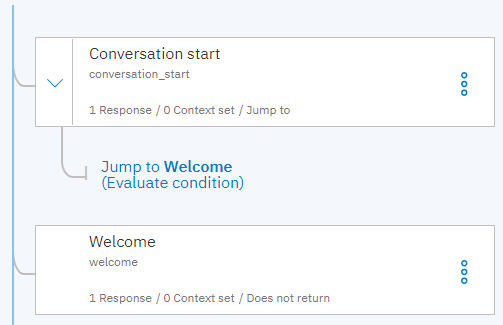

---

copyright:
  years: 2015, 2020
lastupdated: "2020-11-13"

subcollection: assistant

---

{:shortdesc: .shortdesc}
{:new_window: target="_blank"}
{:deprecated: .deprecated}
{:important: .important}
{:note: .note}
{:tip: .tip}
{:pre: .pre}
{:codeblock: .codeblock}
{:screen: .screen}
{:javascript: .ph data-hd-programlang='javascript'}
{:java: .ph data-hd-programlang='java'}
{:python: .ph data-hd-programlang='python'}
{:swift: .ph data-hd-programlang='swift'}

# Starting and ending the dialog
{: #dialog-start}

Learn more about how to use the nodes that are added to your dialog automatically to start and end the conversation.
{: shortdesc}

When you add a dialog to your dialog skill, the following dialog nodes are added to it automatically:

- **Welcome**: Defines how the assistant greets the user and starts the conversation.
- **Anything else**: What the assistant says when a customer's request cannot be satisfied by any of the defined intents.

## Starting the conversation
{: #dialog-start-welcome}

The response you define for the welcome node in the dialog is displayed to initiate a conversation from the "Try it out" pane, and from other integrations, like *Web chat* or *Preview link*. However, it is not displayed from the *Slack* and *Facebook* integrations because nodes with the `welcome` special condition are skipped in dialog flows that are started by users. Assistants that are deployed to messaging channels typically wait for users to initiate conversations with them, not the other way around.

Unlike the `welcome` special condition, the `conversation_start` special condition is always triggered at the start of a dialog. You can use a combination of nodes with these two special conditions (`welcome` and `conversation_start`) to manage the start of your dialog in a consistent way.

For more information, see [Special conditions](/docs/assistant?topic=assistant-dialog-overview#dialog-overview-special-conditions).

You cannot use the built-in welcome node to start a dialog in the Slack and Facebook integrations. Use this workaround instead.
{: tip}

Complete the following steps to manage the dialog start:

1.  Add a dialog node above the Welcome node that is automatically added to the top of the dialog tree when you create the dialog.

1.  Set the node condition for this newly added node to `conversation_start`, which is a special condition as described earlier.

1.  Define any context variables that you want to set with default values for the dialog in the `conversation_start` node.

    Be sure to define context variables in the conversation_start node because it is always processed regardless of who starts the conversation.

1.  Do not define a text response for this node.

1.  Configure this node to jump to the `Welcome` node directly below it in the dialog tree, and choose **If assistant recognizes (condition)**.

This design results in a dialog that works like this:

- Whatever the integration type, the `conversation_start` node is processed, which means any context variables that you define in it are initialized.
- In integrations where the assistant starts the dialog flow, the `Welcome` node is triggered and its text response is displayed.
- In integrations where the user starts the dialog flow, the user's first input is evaluated and then processed by the node that can provide the best response.

## Ending the conversation gracefully
{: #dialog-start-anything-else}

The *Anything else* node is designed to recognize the `anything_else` special condition, which understands when user input does not match any of the intents that are used as conditions in a dialog's nodes.

- Don't delete the *Anything else* node. You might not recognize its value at first, but it serves an important function. It prevents your assistant from going silent and failing to respond at all to your customers. The *Anything else* node is what enables your assistant to - if nothing else - say, `I'm sorry, I didn't understand.` or `I can't help you with that.`

- Don't change the name of the *Anything else* node. If you want the skill's analytics to be able to recognize topics that your dialog couldn't address, keep the node name as-is. The *coverage metric* looks for occurrences of a node named *Anything else* being processed in the user conversation logs. It uses this metric to determine the frequency with which your dialog is able to match user requests to intents that can address them.

  You can configure your assistant to redirect queries to the search skill if the dialog is unable to address the request. When a customer's message reaches the *Anything else* node in your dialog, the message is sent to the search skill to find a relevant answer in your configured data collections. Messages that trigger search in this way are registered by the coverage metric as messages that are *not* covered. For more information about searching for an answer when your dialog can't provide a response, see [Search triggers](/docs/assistant?topic=assistant-skill-search-add#skill-search-add-trigger).

  For more information about the coverage metric, see [Graphs and statistics](/docs/assistant?topic=assistant-logs-overview#logs-overview-graphs).

If you spend time training your assistant to ignore certain topics of conversation, consider adding a separate dialog node earlier in the tree that recognizes the `irrelevant` special condition. 

In the text response for the *Irrelevant* node, you can state plainly that your assistant understands the request, but is not designed to help with queries of this type. Doing so frees you up to use language in the *Anything else* node that encourages the customer to reword the question and ask again. This approach also prevents the Coverage metric from counting topics that you have chosen explicitly not to cover in its `Total not covered messages` totals.
