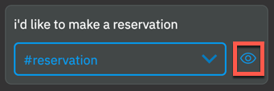
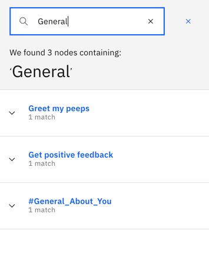

---

copyright:
  years: 2015, 2020
lastupdated: "2020-07-21"

keywords: dialog node limits, copying a node, moving a node, adding a folder

subcollection: assistant

---

{:shortdesc: .shortdesc}
{:new_window: target="_blank"}
{:external: target="_blank" .external}
{:deprecated: .deprecated}
{:important: .important}
{:note: .note}
{:tip: .tip}
{:pre: .pre}
{:codeblock: .codeblock}
{:screen: .screen}
{:javascript: .ph data-hd-programlang='javascript'}
{:java: .ph data-hd-programlang='java'}
{:python: .ph data-hd-programlang='python'}
{:swift: .ph data-hd-programlang='swift'}
{:table: .aria-labeledby="caption"}

# Improving your conversation
{: #dialog-tasks}

Test your dialog, and organize your dialog nodes.
{: shortdesc}

## Testing your dialog
{: #dialog-tasks-test}

As you make changes to your dialog, you can test it at any time to see how the dialog responds to input.

Queries you submit through the "Try it out" pane generate `/message` API calls, but they are not logged and do not incur charges.

1.  From the Dialog page, click the  icon.
1.  In the chat pane, type some text and then press Enter.

    Make sure the system has finished training on your most recent changes before you start to test the dialog. If the system is still training, a message is displayed in the *Try it out* pane:
    {: tip}

    
1.  Check the response to see if the dialog correctly interpreted your input and chose the appropriate response.

    The chat window indicates what intents and entities were recognized in the input.

    

1.  To see the top intents that were recognized in the test input along with their confidence scores, hover over the eye icon that is displayed next to the intent with the highest confidence score.

    

1.  If the response is not what you expected it to be, you can take the following actions from the "Try it out" pane:
    
    - If you want to edit an entity that is recognized in the input, click the entity name to open it in the Entities page. 
    - If the wrong intent is recognized, you can click the arrow next to the intent name to correct it or mark the topic as irrelevant. For more information, see [Making training data improvements](/docs/assistant?topic=assistant-logs#logs-fix-data).

1.  If you want to know which node in the dialog tree triggered a response, click the **Location**  icon next to it. 

    If you are not already on the Dialog page, open it.
    {: tip}

    The source node is given focus and the route that your assistant traversed through the tree to get to it is highlighted. It remains highlighted until you perform another action, such as entering a new test input.

1.  To check or set the value of a context variable, click the **Manage context** link.

    Any context variables that you defined in the dialog are displayed.

    In addition, a `$timezone` context variable is listed. The *Try it out* pane user interface gets user locale information from the web browser and uses it to set the `$timezone` context variable. This context variable makes it easier to deal with time references in test dialog exchanges. Consider doing something similar in your user application. If not specified, Greenwich Mean Time (GMT) is used.

    You can add a variable and set its value to see how the dialog responds in the next test dialog turn. This capability is helpful if, for example, the dialog is set up to show different responses based on a context variable value that is provided by the user.

    1.  To add a context variable, specify the variable name, and press **Enter**.
    1.  To define a default value for the context variable, find the context variable you added in the list, and then specify a value for it.

    See [Context variables](/docs/assistant?topic=assistant-dialog-runtime#dialog-runtime-context) for more information.

1.  Continue to interact with the dialog to see how the conversation flows through it.

    - To find and resubmit a test utterance, you can press the Up key to cycle through your recent inputs.
    - To remove prior test utterances from the chat pane and start over, click the **Clear** link. Not only are the test utterances and responses removed, but this action also clears the values of any context variables that were set as a result of your interactions with the dialog.

### What to do next
{: #dialog-tasks-next}

Make changes to the dialog to address issues you see when testing:

- If you determine that the wrong intents or entities are being recognized, you might need to modify your intent or entity definitions.
- If the correct intents and entities are being recognized, but the wrong nodes are being triggered in your dialog, make sure your conditions are written properly.

If you are ready to put the conversation to work helping your users, integrate your assistant with a messaging platform or custom application. See [Adding integrations](/docs/assistant?topic=assistant-deploy-integration-add).

## Searching your dialog
{: #dialog-tasks-search}

You can search the dialog to find one or more dialog nodes that mention a given word or phrase.

1.  Select the Search icon: 

1.  Enter a search term or phrase.

    The first time you search, an index is created. You might be asked to wait while the text in your dialog nodes is indexed.
    {: note}

Nodes containing your search term, with corresponding examples, are shown. Select any result to open it for editing.

  

## Copying a dialog node
{: #dialog-tasks-copy-node}

You can duplicate a node to create an exact copy of it as a peer node directly after it in the dialog tree. The copied node itself is given the same name as the original node, but with `- copy`*`n`* appended to it, where *`n`* is a number that starts with 1. If you duplicate the same node more than once, then the *`n`* in the name increments by one for each copy to help you distinguish the copies from one another. If the node has no name, it is given the name `copy`*`n`*.

When you duplicate a node that has child nodes, the child nodes are duplicated also. The copied child nodes have the exact same names as the original child nodes. The only way to distinguish a copied child node from an original child node is the `copy` reference in the parent node name.

1.  On the node you want to copy, click the **More**  icon, and then select **Duplicate**.
1.  Consider renaming the copied nodes or editing their conditions to make them distinct.

## Moving a dialog node
{: #dialog-tasks-move-node}

Each node that you create can be moved elsewhere in the dialog tree.

You might want to move a previously created node to another area of the flow to change the conversation. You can move nodes to become siblings or peers in another branch.

1.  On the node you want to move, click the **More**  icon, and then select **Move**.
1.  Select a target node that is located in the tree near where you want to move this node. Choose whether to place this node before or after the target node, or to make it a child of the target node.

## Organizing the dialog with folders
{: #dialog-tasks-folders}

You can group dialog nodes together by adding them to a folder. There are lots of reasons to group nodes, including:

- To keep nodes that address a similar subject together to make them easier to find. For example, you might group nodes that address questions about user accounts in a *User account* folder and nodes that handle payment-related queries in a *Payment* folder.
- To group together a set of nodes that you want the dialog to process only if a certain condition is met. Use a condition, such as `$isPlatinumMember`, for example, to group together nodes that offer extra services that should only be processed if the current user is entitled to receive the extra services.
- To hide nodes from the runtime while you work on them. You can add the nodes to a folder with a `false` condition to prevent them from being processed.

These characteristics of the folder impact how the nodes in a folder are processed:

- Condition: If no condition is specified, then your assistant processes the nodes within the folder directly. If a condition is specified, your assistant first evaluates the folder condition to determine whether to process the nodes within it.
- Customizations: Any configuration settings that you apply to the folder are inherited by the nodes in the folder. If you change the digression settings of the folder, for example, the changes are inherited by all the nodes in the folder.
- Tree hierarchy: Nodes in a folder are treated as root or child nodes based on whether the folder is added to the dialog tree at the root or child level. Any root level nodes that you add to a root level folder continue to function as root nodes; they do not become child nodes of the folder, for example. However, if you move a root level node into a folder that is a child of another node, then the root node becomes a child of that other node.

Folders have no impact on the order in which nodes are evaluated. Nodes continue to be processed from first to last. As your assistant travels down the tree, when it encounters a folder, if the folder has no condition or its condition is true, it immediately processes the first node in the folder, and continues down the tree in order from there. If a folder does not have a folder condition, then the folder is transparent to your assistant, and each node in the folder is treated like any other individual node in the tree.

### Adding a folder
{: #dialog-tasks-folders-add}

To add a folder to a dialog tree, complete the following steps:

1.  From the tree view of the **Dialog** tab, click **Add folder**.

    The folder is added to the end of the dialog tree, just before the **Anything else** node. Unless an existing node in the tree is selected, in which case, it is added after the selected node.

    If you want to add the folder elsewhere in the tree, from the node before the spot where you want to add it, click the **More**  icon, and then select **Add folder**.

    You can add a folder after a child node within an existing dialog branch. To do so, click the **More**  icon on the child node, and then select  **Add folder**.

    The folder is opened in edit view.

1.  **Optional**: Name the folder.

1.  **Optional**: Define a condition for the folder.

    If you do not specify a condition, `true` is used, meaning the nodes in the folder are always processed.

1.  Add dialog nodes to the folder.

    - To add existing dialog nodes to the folder, you must move them to the folder one at a time.

      On the node that you want to move, click the **More**  icon, select **Move**, and then click the folder. Select **To folder** as the move-to target.

      As you move nodes, they are added at the start of the tree within the folder. Therefore, if you want to retain the order of a set of consecutive root dialog nodes, for example, move them starting with the last node first.
      {: tip}

    - To add a new dialog node to the folder, click the **More**  icon on the folder, and then select **Add node to folder**.

      The dialog node is added to the end of the dialog tree within the folder.

### Deleting a folder
{: #dialog-tasks-folders-delete}

You can delete either a folder alone or the folder and all of the dialog nodes in it.

To delete a folder, complete the following steps:

1.  From the tree view of the **Dialog** tab, find the folder that you want to delete.

1.  Click the **More**  icon on the folder, and then select **Delete**.

1.  Do one of the following things:

    - To delete the folder only, and keep the dialog nodes that are in the folder, deselect the **Delete the nodes inside the folder** checkbox, and then click **Yes, delete it**.
    - To delete the folder and all of the dialog nodes in it, click **Yes, delete it**.

If you deleted the folder only, then the nodes that were in the folder are displayed in the dialog tree in the spot where the folder used to be.

## Dialog node limits
{: #dialog-tasks-node-limits}

The number of dialog nodes you can create per skill depends on your plan type.

| Plan     | Dialog nodes per skill     |
|------------------|---------------------------:|
| Premium          |                    100,000 |
| Plus             |                    100,000 |
| Standard (legacy) |                   100,000 |
| Plus Trial       |                     25,000 |
| Lite             |                     25,000 |
{: caption="Plan details" caption-side="top"}

The welcome and anything_else dialog nodes that are prepopulated in the tree do count toward the total.

Tree depth limit: The dialog supports 2,000 dialog node descendants; the dialog performs best with 20 or fewer.

## Finding a dialog node by its node ID
{: #dialog-tasks-get-node-id}

You can search for a dialog node by its node ID. Enter the full node ID into the search field. You might want to find the dialog node that is associated with a known node ID for any of the following reasons:

- You are reviewing logs, and the log refers to a section of the dialog by its node ID.
- You want to map the node IDs listed in the `nodes_visited` property of the API message output to nodes that you can see in your dialog tree.
- A dialog runtime error message informs you about a syntax error, and uses a node ID to identify the node you need to fix.

Another way to discover a node based on its node ID is by following these steps:

1.  From the Dialog page, select any node in your dialog tree.
1.  Close the edit view if it is open for the current node.
1.  In your web browser's location field, a URL should display that has the following syntax:

    `https://assistant-location.watsonplatform.net/location/instance-id/workspaces/workspace-id/build/dialog#node=node-id`

1.  Edit the URL by replacing the current `node-id` value with the ID of the node you want to find, and then submit the new URL.
1.  If necessary, highlight the edited URL again, and resubmit it.

The page refreshes, and shifts focus to the dialog node with the node ID that you specified. If the node ID is for a slot, a Found or Not found slot condition, a slot handler, or a conditional response, then the node in which the slot or conditional response is defined gets focus and the corresponding modal is displayed.

If you still cannot find the node, you can export the dialog skill and use a JSON editor to search the skill JSON file.
{: tip}

### How many nodes are in my dialog?
{: #dialog-tasks-count-nodes}

To see the number of dialog nodes in a dialog skill, do one of the following things:

- If it is not associated with an assistant already, add the dialog skill to an assistant, and then view the skill tile from the main page of the assistant. The *trained data* section lists the number of dialog nodes.
- Send a GET request to the /dialog_nodes API endpoint, and include the `include_count=true` parameter. For example:

  ```sh
  curl -u "apikey:{apikey}" "{url}/v1/workspaces/{workspace_id}/dialog_nodes?version=2018-09-20&include_count=true"
  ```
  {: pre}

  where {url} is the appropriate URL for your instance. For more details, see [Service endpoint](https://cloud.ibm.com/apidocs/assistant/assistant-v1#service-endpoint){: external}.

  In the response, the `total` attribute in the `pagination` object contains the number of dialog nodes.

If the total seems larger than you expected, it might be because the dialog that you build from the application is translated into a JSON object. Some fields that appear to be part of a single node are actually structured as separate dialog nodes in the underlying JSON object.

  - Each node and folder is represented as its own node.
  - Each conditional response that is associated with a single dialog node is represented as an individual node.
  - For a node with slots, each slot, slot found response, slot not found response, slot handler, and if set, the "prompt for everything" response is an individual node. In effect, one node with three slots might be equivalent to eleven dialog nodes.
