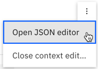

---

copyright:
  years: 2015, 2020
lastupdated: "2020-10-02"

subcollection: assistant

---

{:shortdesc: .shortdesc}
{:new_window: target="_blank"}
{:external: target="_blank" .external}
{:deprecated: .deprecated}
{:important: .important}
{:note: .note}
{:tip: .tip}
{:pre: .pre}
{:codeblock: .codeblock}
{:screen: .screen}
{:javascript: .ph data-hd-programlang='javascript'}
{:java: .ph data-hd-programlang='java'}
{:python: .ph data-hd-programlang='python'}
{:swift: .ph data-hd-programlang='swift'}

# Handling phone interactions 
{: #dialog-voice-actions}

Learn about common actions you can use to manage the flow of conversations that your assistant has with customers over the telephone.
{: shortdesc}

The phone integration is available as a beta feature.
{: note}

Before you add customizations to your dialog that support phone interactions, you must set up the phone integration. For more information, see [Integrating with phone](/docs/assistant?topic=assistant-deploy-phone).

You can perform the following types of actions:

- [Send a text message during a phone conversation](#dialog-voice-actions-sms)
- [Transfer a call to a human agent](#dialog-voice-actions-transfer)
- [Play hold music or a voice recording](#dialog-voice-actions-hold-music)
- [Apply advanced speech services to specific topics ](#dialog-voice-actions-speech-advanced)
- [Enable keypad entry](#dialog-voice-actions-dtmf)
- [End the call](#dialog-voice-actions-hangup)

In some cases, you might want to combine actions. For example, to enable two-factor authentication, you can both enable support for phone keypad entry and send a text message from the same dialog node.

For command reference documentation, see [Phone integration commands reference](/docs/assistant?topic=assistant-commands-voice).

## Adding phone-based actions to your dialog
{: #dialog-voice-actions-add}

To enable voice-specific actions, you must add a JSON code block to the dialog node where you want the action to trigger. 

To add a JSON code block to a dialog node, complete the following steps:

1.  From your dialog skill, go to the *Dialog* page.
1.  Open the dialog node where you want to call the action.
1.  From the *Assistant responds* section, click the menu , and then choose **Open JSON editor**.

    
1.  Add the action command JSON code block to the `context` object. (If no `context` object exists, add one. The `context` object is a peer to the `output` object.)

    For example:

    ```json
    {
      "output": {
        "generic": [
        ]
      },
      "context": {
        "vgwAction": {
          "command": "<command-name>",
          "parameters": {
            "<first-parameter>": "<parameter-value>"
          }
        }
      }
    }
    ```
    {: codeblock}

## Customizing lists
{: #dialog-voice-actions-lists}

Your assistant automatically says a number before each option in an option response or a disambiguation list that is displayed to the customer. The options are numbered sequentially and played to the user in the order in which they appear in the list. The customer can press a number on the keypad or say the respective number to choose one of the available options.

You can customize how these lists are displayed and handled.

- [Options response type](#dialog-voice-actions-option-response)
- [Disambiguation](#dialog-voice-actions-disambiguation)

### Options response type
{: #dialog-voice-actions-option-response}

The dialog supports an `option` response type, which shows the customer multiple choices to pick from. You can customize how the options that are defined for an `option` response are read and the ways in which a customer can select an option by adding the `vgwActSetOptionsConfig` command.

To configure what the assistant says before each option, add a `prefixText` parameter. Use `%s` to represent the number corresponding to the option; it is replaced with the actual number at run time.

The following example shows how to customize the option response type.

```json
{
  "output": {
    "generic": [
      {
      "title": "Which of these items do you want to insure?",
      "options": [
      {
        "label": "Boat",
        "value": {
          "input": {
            "text": "I want to buy boat insurance."
          }
        },
          "label": "Car",
          "value": {
            "input": {
              "text": "I want to buy car insurance."
            }
          },
          "label": "House",
          "value": {
            "input": {
              "text": "I want to buy house insurance."
            }
          }
        }
      ],
      "description": "Insurance types.",
      "response_type": "option"
      }
    ]
  },
  "context": {
    "vgwAction": {
      "command": "vgwActSetOptionsConfig",
      "parameters": {
        "prefixText": "Press or say %s for.",
        "matchWord": ["one","two", "three"],
        "disableSpeech" : false
      }
    }
  }
}
```
{: codeblock}

When the option response is read to the customer, the assistant says the option list title (`Which of these items do you want to insure?`), and then reads each option, starting with `Press or say one for Boat`.

If you want to disable a spoken response and prefer for the user to press a number key in response, you can set `disableSpeech` to `true`. For example:

```json
  "vgwAction": {
      "command": "vgwActSetOptionsConfig",
      "parameters": {
        "prefixText": "Press %s for.",
        "matchWord": ["one","two", "three"],
        "disableSpeech" : true
      }
    }
  }
  ```
  {: codeblock}

When read, the assistant says, `Press one for Boat`.

You can use the `matchWord` parameter to specify the utterances to map to the options in the list. For example:

```json
  "vgwAction": {
      "command": "vgwActSetOptionsConfig",
      "parameters": {
        "prefixText": "Press or say %s for.",
        "matchWord": ["first","second", "third"],
        "disableSpeech" : false
      }
    }
  }
  ```
  {: codeblock}

When read, the assistant says, `Press or say one for Boat`. And if the customer says `first`, it is mapped to option 1.

The configuration that you apply to the `option` response type in one node is applied to any other option responses that are processed in subsequent dialog nodes during the same session.

### Disambiguation
{: #dialog-voice-actions-disambiguation}

When the dialog is confident that more than one dialog node might be the right one to process in response to a customer query, disambiguation is triggered. Disambiguation asks the customer to clarify which path they want to follow to get an answer. For more information, see [Disambiguation](/docs/assistant?topic=assistant-dialog-runtime#dialog-runtime-disambiguation).

You can customize how the disambiguation options are displayed and how a customer can select a disambiguation option by adding the `vgwActSetDisambiguationConfig` command. 

You might want to define the customization in the welcome node or another node that is triggered early in the conversation so it is applied any time disambiguation is triggered.

```json
{
  "output": {
      "generic": [
      ]
  },
  "context": {
    "vgwAction": {
      "command": "vgwActSetDisambiguationConfig",
      "parameters": {
        "prefixText": "Press or say %s for.",
        "matchWord": ["one","two", "three"],
        "disableSpeech": false
      }
    }
  }
}
```
{: codeblock}

When read, the assistant says, `Did you mean?`. Then it reads each choice in the disambiguation list, starting with `Press or say 1 for cancel an order`

## Sending a text message during a phone conversation
{: #dialog-voice-actions-sms}

Before you add in-context SMS messages, you must set up the *Twilio messaging* integration. For more information, see [Integrating with *Twilio messaging*](/docs/assistant?topic=assistant-deploy-sms).

There are lots of times when it is useful to be able to send a text message in the context of an ongoing conversation. For example, maybe you want the customer to share a street address. Rather than trying to transcribe the audio as a person rattles off an address and risk possible mistakes, you can ask the customer to send it in a text message instead.

Whenever you exchange a text with a customer in the context of a conversation, the dialog initiates the SMS message exchange. It sends a text message to the user and asks for the user to respond to it.

To send a specific message from a dialog node, add the `vgwActSendSMS` command.

```json
{
 "output": {
    "generic": [
      {
        "values": [
          {
            "text": "I will send you a text message now."
          }
        ],
        "response_type": "text",
        "selection_policy": "sequential"
      }
    ]
  },
  "context": {
    "vgwAction": {
      "command": "vgwActSendSMS",
      "parameters": {
        "message": "Hey, this is Watson Assistant. To send me your street address, respond to this text message with your address."
      }
    }
  }
}
```
{: codeblock}

The customer's reply text is stored in the `$vgwSmsMessage` or `$vgwSMSMedia` context variable, depending on whether they reply with text or other media. You can add child nodes that condition on these context variables and respond appropriately based on the content of the customer's text. For example, if you ask for an address, your child node can check for reply text by using the `$vgwSmsMessage` node condition, and then save the user's input to an `$address` context variable.

## Transferring a call to a human agent
{: #dialog-voice-actions-transfer}

When you configure the phone integration, you can optionally define a default message and routing information to transfer calls to human agents in a call center when a connection fails. If you want to define specific behavior for a given dialog branch, you can add the `vgwActTransfer` command to do so.

Typically, you want to add call transfer support from any dialog node with a *Connect to human agent* response type.

You can specify the following parameter values for the `vgwActTransfer` command:

- `transferHeader`: A custom header field that is added to the SIP request.

  Alternatively, you can specify more than one custom field by adding a `transferHeaders` parameter and defining the customer headers as a JSON object. For example:

  ```
  {
    "Custom-Header1": "123",
    "Custom-Header2": "456"
    }
  ```
 
- `transferHeaderVal`: The value of the custom header field that is defined by the `transferHeader` parameter.

- `transferTarget`: The SIP trunk or telephone Uniform Resource Identifier (URI) of the call center service to which the call will be transferred. For example, `sip:12345556789\\@myhost.com` or `tel:+18883334444`.

- `transferMethod`: Specify `REFER` to indicate that you want to send a SIP `REFER` REST API request.

- `uuiData`: Add to send User-to-User Information (UUI) data. For more information about UUI data, see [RFC 7433](https://tools.ietf.org/html/rfc7433){: external}.

- `uuiSendMethod`: The method by which to send the UUI data. The following methods are supported:

  - `uuiHeader`: Sends UUI data in a `User-to-User` header field. This options is used by default.
  - `contactHeader`: Sends UUI data in a `Contact` header field.
  - `referToURL`: Sends UUI data in a `Refer-To` header field.
    
  If data is sent in a `Contact` or `Refer-To` header field, the data is encoded as a URI header. If the `Refer-To` header value is a telephone URI, the UUI data is sent as a URL parameter.

- `acceptTransferRejectCodes`: A comma-separated list of the error codes that are treated as successful responses when the phone integration processes `NOTIFY` requests during a call transfer.

The following JSON block illustrates how to transfer a call to your call center:

```json

 "output": {
    "generic": [
      {
        "values": [
          {
            "text": "This customer would like to speak to someone."
          }
        ],
        "response_type": "text",
        "selection_policy": "sequential"
      }
    ]
  },
  "context": {
    "context_connect_to_agent":"true",
    "vgwAction": {
      "command": "vgwActTransfer",
      "parameters": {
        "transferHeader": "User-to-User",
        "transferHeaderVal": "12a345b6c7d8901234e5;encoding=hex;purpose=first;content=example",
        "transferTarget": "tel:+18883334444"
      }
    }
  }
}
```
{: codeblock}

If you define a SIP URI as the transfer target, escape the at sign (`@`) in the URI by adding two backslashes (`\\`) in front of it.

```json
    "transferTarget": "sip:12345556789\\@myhost.com"
```
{: codeblock}

The following JSON block illustrates how to send User-to-User data in the contactHeader field:

```json
{
  "output": {
      "generic": [
      ]
  },
  "context": {
    "vgwAction": {
      "command": "vgwActTransfer",
      "parameters": {
        "transferTarget": "sip:+18883334444\\@example.com",
        "uuiData": "59a390f3d2b7310023a2;encoding=hex;purpose=abc;content=123",
        "uuiSendMethod": "contactHeader"
      }
    }
  }
}
```
{: codeblock}

### Handling call transfer failures
{: #dialog-voice-actions-transfer-failure}

Add a child node to the node with the `vgwActTransfer` command that checks for chat transfer failures. Add `$vgwCallTransferFailed` as the child node condition. You can specify a message to return in this case.

The following context variables are designed to help you recognize when a failure occurs and return a message to let the customer know what's going on.

- `$vgwDisconnectCallOnTransferFailure`: This context variable indicates whether to disconnect the call when a transfer fails.

  You initially specify your preference in the **Disconnect call on transfer failure** field when you configure the phone integration. You can change the value if you want to change the behavior for a specific branch of the dialog. You can add this variable to the dialog node and specify a new value for it. The supported options are `Yes` or `No`.
- `$vgwTransferFailedMessage`: This context variable specifies the message to display to users if a call transfer fails.

  You initially define the message in the **Transfer failure message** field when you configure the phone integration. If you want to customize the message for a specific branch of the conversation, you can add this variable and specify a new message for it in the dialog node.

## Playing hold music or a voice recording
{: #dialog-voice-actions-hold-music}

To play hold music or to play a recorded message, use the `vgwActPlayUrl` command.

You cannot play hold music during a call transfer. But, you might want to play hold music if your dialog needs time to perform processing of some kind, such as calling a client-side action or making a call to a webhook. You can look for places where the dialog uses the *Pause* response type to find nodes where this command might be useful.

```json
{
  "output": {
      "generic": [
      ]
  },
  "context": {
    "vgwAction": {
      "command": "vgwActPlayUrl",
      "parameters": {
        "url": "https://upload.wikimedia.org/wikipedia/commons/d/d8/Random_composition3.wav",
        "playURLInLoop": "Yes"
        }
      }
    }
  }
}
```
{: codeblock}

You can specify the following parameter values for the `vgwActPlayUrl` command:

- `url`: URL to a publicly-accessible audio file. The audio file must be single channel (mono), PCM-encoded, and have a 8,000 Hz sampling rate with 16 bits per sample. The file format must be `.wav`.
- `playURLInLoop`: Specify `Yes` or `No` to indicate whether to repeatedly restart the audio play back after it finishes. The default value is `No`.

If your dialog subsequently processes a node with the `vgwActForceNoInputTurn` command, it won't work unless the `playURLInLoop` parameter is set to `Yes`. If you expect the hold to last more than 5 seconds, set the `vgwConversationResponseTimeout` context variable to a higher number. Specify a number in milliseconds. For example, you might set it to 15 seconds:

```
"vgwConversationResponseTimeout": 15000
```
{: codeblock}

## Applying advanced speech services to specific topics
{: #dialog-voice-actions-speech-advanced}

You can apply the following speech customizations to specific dialog nodes:

- [Change the assistant's voice](#dialog-voice-actions-change-voice)
- [Use a custom language model](#dialog-voice-actions-custom-language)
- [Use a custom grammar](#dialog-voice-actions-custom-grammar)

To make any of these types of changes, edit the speech service configuration by adding the `vgwActSetSTTConfig` command to your dialog node. The configuration decisions you make in the dialog node override the configuration that is specified in the integration setup page. The changes you apply persist for the remainder of the conversation, unless you override them again.

### Change the assistant's voice
{: #dialog-voice-actions-change-voice}

You can change the voice of your assistant when it covers certain topics in the dialog that warrant it. For example, let's say you have a topic that applies only to your British customers. For that branch of conversation, you might want your assistant to speak with a British accent. To change the voice that is used, add the `vgwActSetTTSConfig` command to the root dialog node of the branch where you want the custom voice to be used.

```json
{
  "output": {
      "generic": [
      ]
  },
  "context": {
    "vgwAction": {
      "command": "vgwActSetTTSConfig",
      "parameters": {
        "config": {
            "voice": "en-GB_KateV3Voice"
        }
      }
    }
  }
}
```
{: codeblock}

In the `voice` parameter, specify the voice model that you want to use. For more information about voice model options, see [Supported languages and voices](/docs/text-to-speech?topic=text-to-speech-voices#languageVoices){: external}.

The model you specify must be one that is supported by the {{site.data.keyword.texttospeechshort}} service instance that is configured for use with the integration.
{: note}

The custom voice that you specify for this dialog branch is used by each subsequent dialog node that is processed during the session unless you add another `vgwActSetTTSConfig` command to reset the voice model back to the default model.

### Using a custom language model
{: #dialog-voice-actions-custom-language}

When you set up the phone integration, you can configure the integration to use a custom language model all the time. However, you might want to use a standard language model most of the time, and specify a custom language model to use only for specific topics that your assistant is designed to help customers with. You can apply a custom language model for a specific dialog branch only. 

For example, you might want to use a custom model that specializes in medical terms for a dialog branch that helps with medical bills only. 

For more information, see [Creating a custom language model](/docs/speech-to-text?topic=speech-to-text-languageCreate){: external}.

To apply a custom language model to a specific dialog branch, use the `vgwActSetSTTConfig` command.

```json
{
  "output": {
    "generic": [
    ]
  },
  "context": {
    "vgwAction": {
      "command": "vgwActSetSTTConfig",
      "parameters": {
              "config": {
                  "x-watson-learning-opt-out": true,
                  "model": "en-US_NarrowbandModel",
                  "profanity_filter": true,
                  "smart_formatting": true,
                  "customization_id": "81d3630-ba58-11e7-aa4b-41bcd3f6f24d",
                  "acoustic-customization_id": "e4766090-ba51-11e7-be33-99bd3ac8fa93"
              }
          }
    }
  }
}
```
{: codeblock}

You can also apply an acoustic model that you might have trained to deal with background noise, accents, or other things that are associated with the quality or noise of the signal. 

### Using a custom grammar
{: #dialog-voice-actions-custom-grammar}

The {{site.data.keyword.speechtotextshort}} service supports the use of grammars. A grammar allows you to configure the audio to match specific characteristics only.

You can think of it this way: 

- A custom language model expands the service's base vocabulary.
- A grammar restricts the words that the service can recognize from that vocabulary. 

When you use a grammar with a custom language model for speech recognition, the service can recognize only words, phrases, and strings that are recognized by the grammar. For example, maybe you want to accept only a yes or no response. You can define a grammar that allows only those options.

For more information, see [Using grammars with custom language models](/docs/speech-to-text?topic=speech-to-text-grammars){: external}.

To specify a custom grammar for a dialog node, add the following command: 

```json
{
  "output": {
    "generic": [
    ]
  },
  "context": {
    "vgwAction": {
      "command": "vgwActSetSTTConfig",
      "parameters": {
        "x-watson-learning-opt-out": true,
        "updateMethod": "mergeOnce",
        "config": {
          "grammar_name": "names-abnf",
          "language_customization_id": "81d3630-ba58-11e7-aa4b-41bcd3f6f24d"
        }
      }
    }
  }
}
```
{: codeblock}

where the `updateMethod` parameter defines how changes to the configuration are applied. They can be applied by either replacing the configuration or merging new configuration properties, and specifying whether these changes occur for the duration of the call or a single conversation turn.

| JSON property  | Description |
| -------------- | -------------------- |
| replace | Replaces the configuration for the duration of the call. |
| replaceOnce | Replaces the configuration once, so the configuration is used for only the following conversation turn. Then, it reverts to the previous configuration. |
| merge | Merges the configuration with the existing configuration for the duration of the call. |
| mergeOnce | Merges the configuration for one turn of the conversation, and then reverts to the previous configuration. |
{: caption="Table 2. Available options to update properties when using updateMethod." caption-side="top"}

## Enabling keypad entry
{: #dialog-voice-actions-dtmf}

If you want customers to be able to send information by typing it on their phone keypad instead of speaking, you can add support for phone keypad entry. The best way to implement this type of support is to enable dual-tone multifrequency (DTMF) signaling. DTMF is a system that interprets the tones that are generated when a user presses keys on a push-button phone. The tones have a specific frequency and duration that can be interpreted by the phone network.

To start listening for tones as the user presses phone keys, add the `vgwActCollectDTMF` command to the dialog node:

```json
{
  "output": {
      "generic": [
      {
        "values": [
          {
            "text": "Enter your 7-digit account number by using the phone keypad."
          }
        ],
        "response_type": "text",
        "selection_policy": "sequential"
      }
    ]
  },
  "context": {
    "vgwAction": {
      "command": "vgwActCollectDTMF",
      "parameters": {
        "dtmfTermKey": "#",
        "dtmfCount": 7,
        "dtmfIgnoreSpeech": true
      }      
    }
  }
}
```
{: codeblock}

You can specify the following parameter values for the `vgwActCollectDTMF` command:

- `dtmfTermKey`: Specifies the termination key that signals the end of DTMF input.
- `dtmfIgnoreSpeech` Optionally add and set to true if you want to ignore any audio that is sent while the key presses are being registered.
- `dtmfCount`: The number of DTMF digits to collect.
- `dtmfMinCount`: The minimum number of DTMF digits to collect when you configure your DTMF collection to accept a range of entries.
- `dtmfMaxCount`: The maximum number of DTMF digits to collect when you configure your DTMF collection to accept a range of entries. After this number of digits is collected, a conversation turn is initiated.
- `dtmfInterDigitTimeoutCount`: The amount of time in milliseconds to wait for a new DTMF digit after a DTMF digit is received. During an active DTMF collection, this timeout activates when the first DTMF collection is received. When the inter-digit timeout is active, it deactivates the `vgwPostResponseTimeout` timer. If `dtmfInterDigitTimeoutCount` isn't specified, the post-response timer resets after receiving each DTMF digit, and it stays active until either the `vgwPostResponseTimeout` is met or the collection is completed.

You can add a child node that conditions on the `@sys-number` system entity or a pattern entity named `@account_number` that recognizes the number pattern. The child node can save the number that is submitted by the customer in a context variable and show the appropriate response.

When you use the `vgwActCollectDTMF`, you might want to pause Speech to Text before collecting DTMF tones. To stop transcribing audio before you start to collect keypad tones, you can use the following set of commands together in a sequence. Don't pause Speech to Text if you want users to be able to say or press a key. To allow customers to optionally speak an answer, use the `dtmfIgnoreSpeech` parameter instead.

```json
{
  "output": {
    "generic": [
    ]
  },
  "context" : {
    "vgwActionSequence": [
          {
        "command": "vgwActPauseSTT"
      },
      {
        "command": "vgwActCollectDTMF",
        "parameters": {
          "dtmfTermKey": "#",
          "dtmfMinCount": "1",
          "dtmfInterDigitTimeoutCount": "2000"
        }
      },
        {
        "command": "vgwActPlayText"
      }
    ] 
  } 
 }
```
{: codeblock}

## End the call
{: #dialog-voice-actions-hangup}

To have the assistant end the call, use the `vgwActHangup` command.

```json
{
 "output": {
    "generic": [
      {
        "values": [
          {
            "text": "Goodbye."
          }
        ],
        "response_type": "text",
        "selection_policy": "sequential"
      }
    ]
  },
  "context": {
    "vgwAction": {
      "command": "vgwActHangup"
    }
  }
}
```
{: codeblock}

## Defining a sequence of actions
{: #dialog-voice-actions-sequence}

If you want to run more than one command in succession, you can use a `vgwActionSequence` command.

```json
{
  "output": {
    "generic": [
    ]
  },
  "context" : {
    "vgwActionSequence": [
        {
          "command": "<command-name>",
          "parameters": {
            "<first-parameter>": "<parameter-value>"
          }
        },
        {
          "command": "<command-name>",
          "parameters": {
            "<first-parameter>": "<parameter-value>"
          }
        }
    ]
  }
}
```
{: codeblock}
