---

copyright:
  years: 2015, 2019
lastupdated: "2019-01-17"

---

{:shortdesc: .shortdesc}
{:new_window: target="_blank"}
{:deprecated: .deprecated}
{:important: .important}
{:note: .note}
{:tip: .tip}
{:pre: .pre}
{:codeblock: .codeblock}
{:screen: .screen}
{:javascript: .ph data-hd-programlang='javascript'}
{:java: .ph data-hd-programlang='java'}
{:python: .ph data-hd-programlang='python'}
{:swift: .ph data-hd-programlang='swift'}

# Defining entities

***Entities*** represent information in the user input that is relevant to the user's purpose.

If intents represent verbs (the action a user wants to do), entities represent nouns (the object of, or the context for, that action). For example, when the *intent* is to get a weather forecast, the relevant location and date *entities* are required before the application can return an accurate forecast.

Recognizing entities in the user's input helps you to craft more useful, targeted responses. For example, you might have a `#buy_something` intent. When a user makes a request that triggers the `#buy_something` intent, the assistant's response should reflect an understanding of what the *something* is that the customer wants to buy. You can add a `@product` entity, and then use it to extract information from the user input about the product that the customer is interested in. (The `@` prepended to the entity name helps to clearly identify it as an entity.)

Finally, you can add multiple responses to your dialog tree with wording that differs based on the `@product` value that is detected in the user's request.

<iframe class="embed-responsive-item" id="youtubeplayer" title="Working with entities" type="text/html" width="640" height="390" src="https://www.youtube.com/embed/o-uhdw6bIyI" frameborder="0" webkitallowfullscreen mozallowfullscreen allowfullscreen> </iframe>

## Entity evaluation overview
{: #entity-described}

The service detects entities in the user input by using one of the following evaluation methods:

### Dictionary-based method
{: #dictionary-overview}

The service looks for terms in the user input that match the values, synonyms, or patterns you define for the entity.

- **Synonym entity**: You define a category of terms as an entity (`color`), and then one or more values in that category (`blue`). For each value you specify a bunch of synonyms (`aqua`, `navy`). You can also pick synonyms to add from recommendations made to you by the service.

    At run time, the service recognizes terms in the user input that exactly match the values or synonyms that you defined for the entity as mentions of that entity.
- **Pattern entity**: You define a category of terms as an entity (`contact_info`), and then one or more values in that category (`email`). For each value, you specify a regular expression that defines the textual pattern of mentions of that value type. For an `email` entity value, you might want to specify a regular expression that defines a `text@text.com` pattern.

    At run time, the service looks for patterns matching your regular expression in the user input, and identifies any matches as mentions of that entity.
- **System entity**: Synonym entities that are prebuilt for you by IBM. They cover commonly used categories, such as numbers, dates, and times. You simply enable a system entity to start using it.

### Context-based method
{: #annotations-overview}

When you define a contextual entity, a model is trained on both the *annotated term* and the *context* in which the term is used in the sentence you annotate. This new contextual entity model enables the service to calculate a confidence score that identifies how likely a word or phrase is to be an instance of an entity, based on how it is used in the user input.

- **Contextual entity**: First, you define a category of terms as an entity (`product`). Next, you go to the *Intents* page and mine your existing intent user examples to find any mentions of the entity, and label them as such. For example, you might go to the `#buy_something` intent, and find a user example that says, `I want to buy a Coach bag`. You can label `Coach bag` as a mention of the `@product` entity.

    For training purposes, the term you annotated, `Coach bag`, is added as a value of the `@product` entity.

    At run time, the service evaluates terms based on the context in which they are used in the sentence only. If the structure of a user request that mentions the term matches the structure of a user example sentence in which a mention is labeled, then the service interprets the term to be a mention of that entity type. For example, the user input might include the utterance, `I want to buy a Gucci bag`. Due to the similarity of the structure of this sentence to the user example that you annotated (`I want to buy a Coach bag`), the service recognizes `Gucci bag` as a `@product` entity mention.

    When a contextual entity model is used for an entity, the service does *not* look for exact text or pattern matches for the entity in the user input. The context-based approach replaces the dictionary-based approach for that entity.

    If you choose to define entity values by using annotation, you must add more than 10 annotations for the entity for the resulting contextual entity model to be effective.

## Entity limits
{: #entity-limits}

The number of entities, entity values, and synonyms that you can create depends on your {{site.data.keyword.conversationshort}} service plan:

| Service plan      | Entities per skill | Entity values per skill | Entity synonyms per skill |
|-------------------|-------------------:|------------------------:|--------------------------:|
| Premium           |               1000 |                 100,000 |                   100,000 |
| Plus              |               1000 |                 100,000 |                   100,000 |
| Standard          |               1000 |                 100,000 |                   100,000 |
| Lite              |                 25 |                 100,000 |                   100,000 |
{: caption="Service plan details" caption-side="top"}

System entities that you enable for use count toward your plan usage totals.

| Service plan | Contextual entities and annotations |
|--------------|------------------------------------:|
| Premium      |        30 contextual entities with 3000 annotations |
| Plus         |        20 contextual entities with 2000 annotations |
| Standard     |        20 contextual entities with 2000 annotations |
| Lite         |        10 contextual entities with 1000 annotations |
{: caption="Service plan details continued" caption-side="top"}

## Creating entities
{: #creating-entities}

Use the {{site.data.keyword.conversationshort}} tool to create entities.

1.  In the {{site.data.keyword.conversationshort}} tool, open your dialog skill and then click the **Entities** tab. If **Entities** is not visible, use the  menu to open the page.

1.  Click **Add entity**.

    You can also click **Use System Entities** to select from a list of common entities, provided by {{site.data.keyword.IBM_notm}}, that can be applied to any use case. See [Enabling system entities](#enable_system_entities) for more detail.

1.  In the **Entity name** field, type a descriptive name for the entity.

    The entity name can contain letters (in Unicode), numbers, underscores, and hyphens. For example:
    - `@location`
    - `@menu_item`
    - `@product`

    Do not include spaces in the name. The name cannot be longer than 64 characters. Do not begin the name with the string `sys-` because it is reserved for system entities.

    The tool automatically includes the @ character in the entity name, so you do not have to add one.
    {: tip}

1.  Click **Create entity**.

    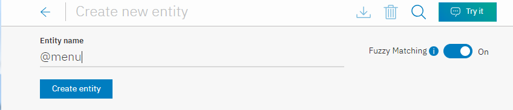

1.  For this entity, choose whether you want the service to use a dictionary-based or context-based approach to find mentions of it, and then follow the appropriate procedure.

    **For each entity that you create, choose one entity type to use only.** As soon as you add an annotation for an entity, the contextual model is initialized and becomes the primary approach for analyzing user input to find mentions of that entity. The context in which the mention is used in the user input takes precedence over any exact matches that might be present. See [Entity evaluation overview](#entity-described) for more information about how each type is evaluated.

    - [Dictionary-based entities](#create-dictionary-based)
    - [Context-based entities](#create-annotation-based)

## Adding dictionary-based entities
{: #create-dictionary-based}

Dictionary-based entites are those for which you define specific terms, synonyms, or patterns. At run time, the service finds entity mentions only when a term in the user input exactly matches (or closely matches if fuzzy matching is enabled) the value or one of its synonyms.

1.  In the **Value name** field, type the text of a possible value for the entity and hit the `Enter` key. An entity value can be any string up to 64 characters in length.

    **Important:** Don't include sensitive or personal information in entity names or values. The names and values can be exposed in URLs in an app.

1.  If you want the service to recognize terms with syntax that is similar to the entity value and synonyms you specify, but without requiring an exact match, click the **Fuzzy Matching** toggle to turn it on.

    This feature is available for languages noted in the [Supported languages](lang-support.html) topic.

    **Fuzzy matching**
    {: #fuzzy-matching}

    Fuzzy matching has these components:

    - *Stemming* - The feature recognizes the stem form of entity values that have several grammatical forms. For example, the stem of 'bananas' would be 'banana', while the stem of 'running' would be 'run'.
    - *Misspelling* - The feature is able to map user input to the appropriate corresponding entity despite the presence of misspellings or slight syntactical differences. For example, if you define *giraffe* as a synonym for an animal entity, and the user input contains the terms *giraffes* or *girafe*, the fuzzy match is able to map the term to the animal entity correctly.
    - *Partial match* - With partial matching, the feature automatically suggests substring-based synonyms present in the user-defined entities, and assigns a lower confidence score as compared to the exact entity match.

    For English, fuzzy matching prevents the capturing of some common, valid English words as fuzzy matches for a given entity. This feature uses standard English dictionary words. You can also define an English entity value/synonym, and fuzzy matching will match only your defined entity value/synonym. For example, fuzzy matching may match the term `unsure` with `insurance`; but if you have `unsure` defined as a value/synonym for an entity like `@option`, then `unsure` will always be matched to `@option`, and not to `insurance`.
    {: note}

    Your fuzzy matching setting has no impact on synonym recommendations. Even if fuzzy matching is enabled, synonyms are suggested for the exact value you specify only, not the value and slight variations of the value.

1.  Once you have entered a value name, you can then add any synonyms, or define specific patterns, for that entity value by selecting either `Synonyms` or `Patterns` from the *Type* drop-down menu.

    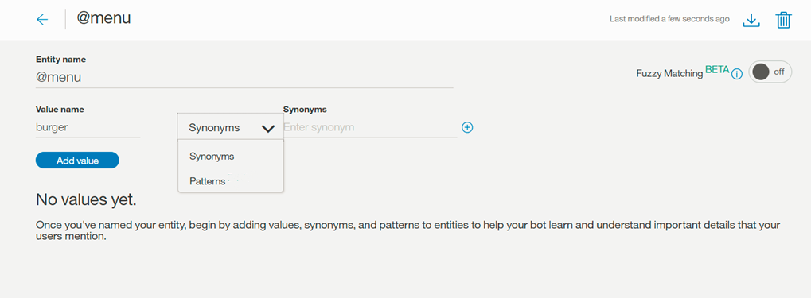

    **Note:** You can add *either* synonyms or patterns for a single entity value, not both.

    ***Synonyms***
    {: #synonyms}

    - In the **Synonyms** field, type any synonym for the entity value. A synonym can be any string up to 64 characters in length.

      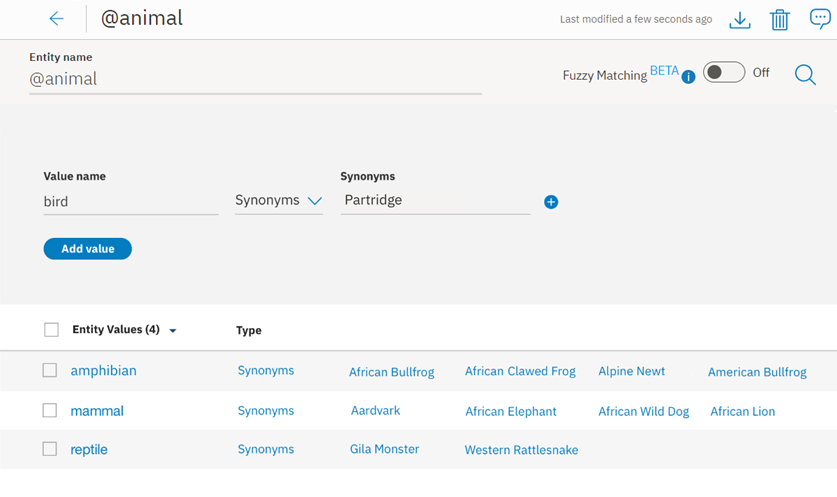

      The {{site.data.keyword.conversationshort}} service can also recommend synonyms for your entity values. The recommender finds related synonyms based on contextual similarity extracted from a vast body of existing information, including large sources of written text, and uses natural language processing techniques to identify words similar to the existing synonyms in your entity value.

    - Click **Show recommendations**.

      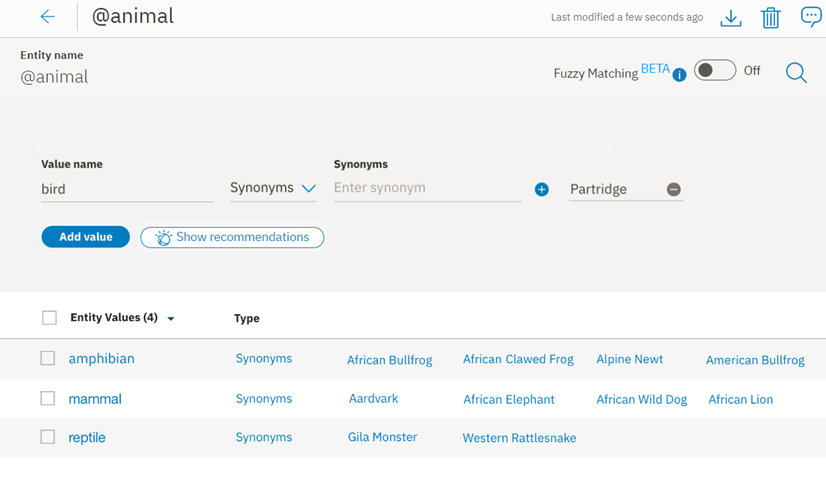

    - The {{site.data.keyword.conversationshort}} service will make several recommendations for synonyms. The terms are displayed in lowercase, but the service recognizes mentions of the synonyms whether they are specified in lowercase or uppercase.

      The more coherent your entity value synonyms are, the more relevant and better focused your recommendations will be. For example, if you have several words that are focused on a theme, you will get better suggestions than if you have one or two random words.
      {: tip}

      

    - Select any synonyms you want to include, and then click **Add selected**.

      You must click the **Add selected** button for any synonyms you selected to be added. If you move to the next set without clicking this button first, your selections are lost.

      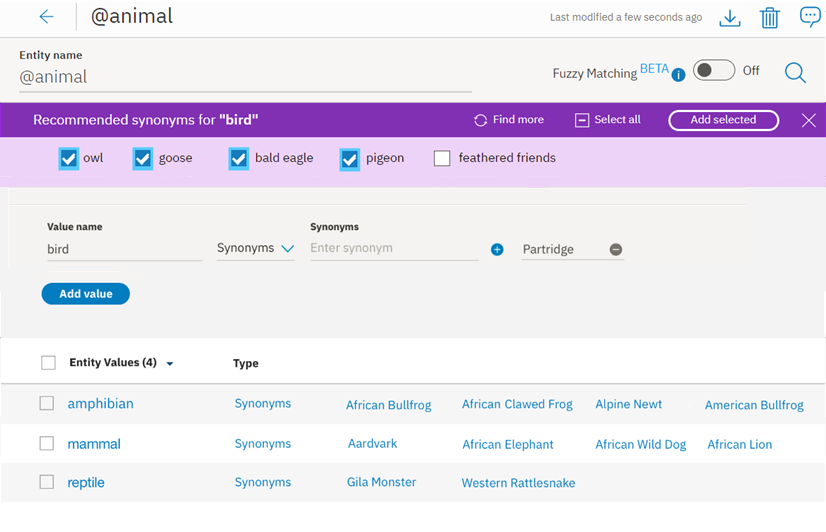

    - The {{site.data.keyword.conversationshort}} service adds those synonyms to your entity, and suggests additional synonyms.

      If you receive no additional synonym recommendations, it could be because your entity is already well defined, or it contains content that the recommender is not currently able to expand upon.
      {: tip}

      If you choose not to select a recommended synonym, the system will treat that as a term you are not interested in, and will alter the next set of recommendations you see when you press `Add selected` or `Next set`. This inference only persists while you are choosing synonyms; information about skipped synonyms is not used for any other purpose by the service.
      {: note}

      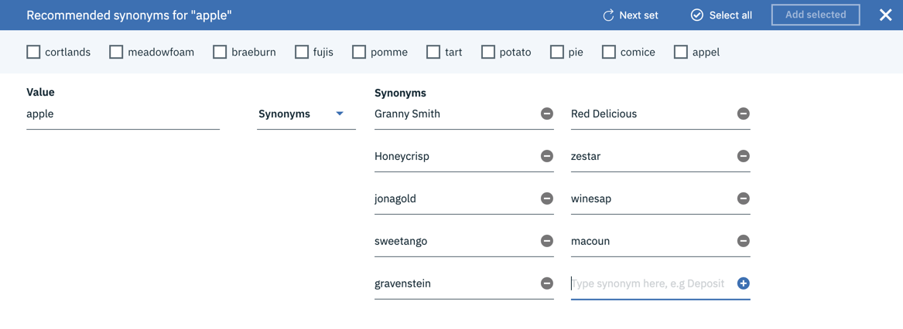

      Continue adding synonyms as desired. When you're finished accepting recommendations, click the **X** to close.

    ***Patterns***
    {: #patterns}

    - The **Patterns** field lets you define specific patterns for an entity value. A pattern **must** be entered as a regular expression in the field.

      - For each entity value, there can be a maximum of up to 5 patterns.
      - Each pattern (regular expression) is limited to 512 characters.

      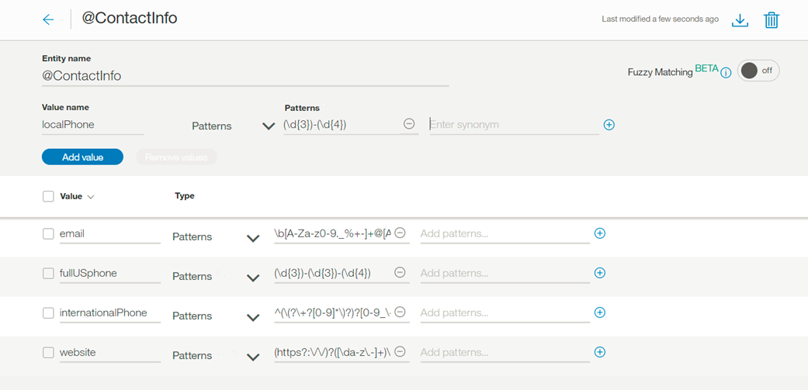
      {: #pattern-entities}

      As in this example, for entity *ContactInfo*, the patterns for phone, email, and website values can be defined as follows:
      - Phone
        - `localPhone`: `(\d{3})-(\d{4})`, e.g. 426-4968
        - `fullUSphone`: `(\d{3})-(\d{3})-(\d{4})`, e.g. 800-426-4968
        - `internationalPhone`: `^(\(?\+?[0-9]*\)?)?[0-9_\- \(\)]*$`, e.g., +44 1962 815000
      - `email`: `\b[A-Za-z0-9._%+-]+@[A-Za-z0-9.-]+\.[A-Za-z]{2,}\b`, e.g. name@ibm.com
      - `website`: `(https?:\/\/)?([\da-z\.-]+)\.([a-z\.]{2,6})([\/\w \.-]*)*\/?$`, e.g. https://www.ibm.com

      Often when using pattern entities, it will be necessary to store the text that matches the pattern in a context variable (or action variable), from within your dialog tree. For additional information, see [Defining a context variable](dialog-runtime.html#context-var-define).

      Imagine a case where you are asking a user for their email address. The dialog node condition will contain a condition similar to `@contactInfo:email`. In order to assign the user-entered email as a context variable, the following syntax can be used to capture the pattern match within the dialog node's response section:

      | Variable | Value            |
      |----------|------------------|
      |  email   | `<? @contactInfo.literal ?>` |

      ***Capture groups***
      {: #capture-group}

      For regular expressions, any part of a pattern inside a pair of normal parentheses will be captured as a group. For example, the entity value `fullUSphone` contains three captured groups:

      - `(\d{3})` - US area code
      - `(\d{3})` - Prefix
      - `(\d{4})` - Line number

      Grouping can be helpful if, for example, you wanted the {{site.data.keyword.conversationshort}} service to ask users for their phone number, and then use only the area code of their provided number in a response.

      In order to assign the user-entered area code as a context variable, the following syntax can be used to capture the group match within the dialog node's response section:

      | Variable     | Value            |
      |--------------|------------------|
      |  area_code   | `<? @fullUSphone.groups[1] ?>` |

      For additional information about using capture groups in your dialog, see [Storing and recognizing entity pattern groups in input](dialog-tips.html#get-pattern-groups).

      The pattern matching engine employed by the {{site.data.keyword.conversationshort}} service has some syntax limitations, which are necessary in order to avoid performance concerns which can occur when using other regular expression engines.

      - Entity patterns may not contain:
        - Positive repetitions (for example `x*+`)
        - Backreferences (for example `\g1`)
        - Conditional branches (for example `(?(cond)true)`)
      - When a pattern entity starts or ends with a Unicode character, and includes word boundaries, for example `\bš\b`, the pattern match does not match the word boundary correctly. In this example, for input `š zkouška`, the match returns `Group 0: 6-7 š` (`š zkou`_**`š`**_`ka`), instead of the correct `Group 0: 0-1 š` (_**`š`**_ `zkouška`).

      The regular expression engine is loosely based on the Java regular expression engine. The {{site.data.keyword.conversationshort}} service will produce an error if you try to upload an unsupported pattern, either via the API or from within the {{site.data.keyword.conversationshort}} service Tooling UI.

1.  Click **Add value** and repeat the process to add more entity values.

1.  When you are finished adding entity values, click  to finish creating the entity.

The entity you created is added to the **Entities** tab, and the system begins to train itself on the new data.

## Adding contextual entities
{: #create-annotation-based}

Context-based entites are those for which you annotate occurrences of the entity in sample sentences to teach the service about the context in which the entity is typically used.

In order to train a contextual entity model, you can take advantage of your intent examples, which provide readily-available sentences to annotate.

Using an intent's user examples to define contextual entities does not affect the classification of that intent. However, entity mentions that you label are also added to that entity as synonyms. And intent classification does use synonym mentions in intent user examples to establish a weak reference between an intent and an entity.
{: note}

1.  In the {{site.data.keyword.conversationshort}} tool, open your skill and then click the **Intents** tab. If **Intents** is not visible, use the  menu to open the page.

1.  Click an intent to open it.

    For this example, the intent `#place_order` defines the order function for an online retailer.

    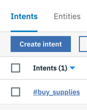

1.  Review the intent examples for potential entity values. Highlight a potential entity value from the intent examples.

    In this case `computer`.

    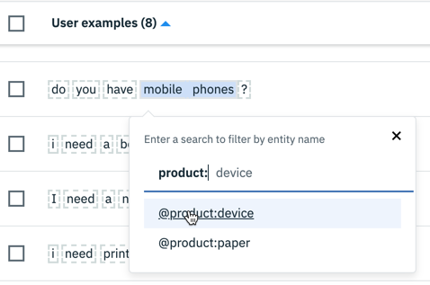

    To directly edit an intent example, click the Edit icon  instead of highlighting a value for annotation.

1.  A Search box opens, allowing you to search for an appropriate entity for the highlighted entity value.

    

1.  In this example, searching `prod` brings up matches for both the `@product` entity, and for entity values `shirt` and `pens`. This is an important distinction - `@product` is an entity that can contain multiple entity values, in this case `@product:pencil`, `@product:shirt` and `@product:pens`

    

    You can also create a new entity by choosing `@(create new entity)`.

1.  Select `@product` to add `computer` as a value for that entity.

    Create *at least* 10 annotations for each contextual entity; more annotations are recommended for production use.
    {: important}

1.  Repeat this process for each entity mention that you want to annotate.

    Be sure to annotate every mention of an entity type that occurs in any user examples that you edit. See [What you don't annotate matters](#entity-counter-examples) for more details.
    {: important}

1.  Now, click the annotation you just created. A box opens that says, `Go to: @product`. Clicking that link takes you directly to the entity.

    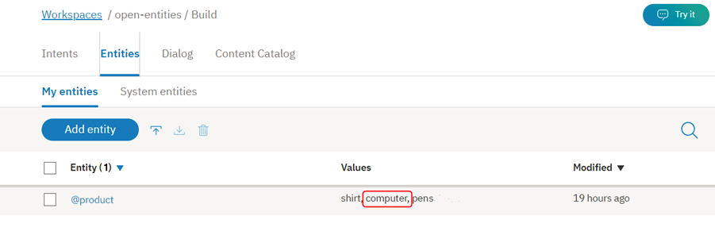

    The annotation is added to the entity you associated it with, and the system begins to train itself on the new data.

1.  To see all of the mentions you annotated for a particular entity, from the entity's configuration page, click the **Annotations** tab.

    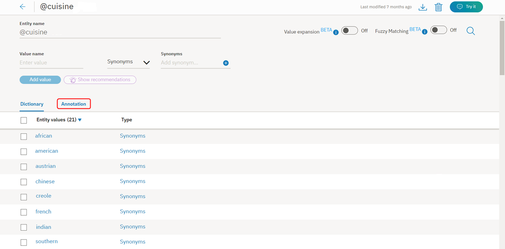

    Contextual entities understand values that you have not explicitly defined. The system makes predictions about additional entity values based on how your user examples are annotated, and uses those values to train other entities. Any similar user examples are added to the *Annotation* view, so you can see how this option impacts training.
    {: note}

    If you do not want your contextual entities to use this expanded understanding of entity values, select all the user examples in the *Annotation* view for that entity, and then click **Delete**.

    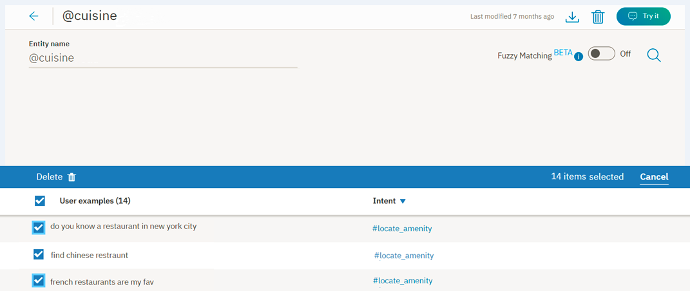

The following video demonstrates how to annotate entity mentions.

<iframe class="embed-responsive-item" id="youtubeplayer0" title="Annotating entity mentions" type="text/html" width="640" height="390" src="https://www.youtube.com/embed/3WjzJpLsnhQ" frameborder="0" webkitallowfullscreen mozallowfullscreen allowfullscreen> </iframe>

To walk through a tutorial that shows you how to define contextual entities before you add your own, go to [Tutorial: Defining contextual entities ](https://www.ibm.com/cloud/garage/demo/try-watson-assistant-contextual-entities){: new_window}.

### What you don't annotate matters
{: #entity-counter-examples}

If you have an intent example with an annotation, and another word in that example matches the value or a synonym of the same entity, but the value is *not* annotated, that omission has impact. The model also learns from the context of the term you did not annotate. Therefore, if you label one term as a mention of an entity in a user example, be sure to label any other applicable mentions also.

1.  The `#Customer_Care_Appointments` intent includes two intent examples with the word `visit`.

    

1.  In the first example, you want to annotate the word `visit` as an entity value of the `@meeting` entity. This makes `visit` equivalent to other `@meeting` entity values such as `appointment`, as in "I'd like to make an appointment" or "I'd like to schedule a visit".

    

1.  For the second example, the word `visit` is being used in a different context than a meeting. In this case, you can select the word `appointment` from the intent example, and annotate it as an entity value of the `@meeting` entity. The model learns from the fact that the word `visit` in the same example is not annotated.

    

## Editing entities

You can click any entity in the list to open it for editing. You can rename or delete entities, and you can add, edit, or delete values, synonyms, or patterns.

If you change the entity type from `synonym` to `pattern`, or vice versa, the existing values are converted, but might not be useful as-is.
{: note}

## Searching entities

Use the Search feature to find entity names, values, and synonyms.

1.  Click the **Entities** tab in the navigation bar, then *My Entities*.

    

    System entities are not searchable.
    {: note}

1.  Click the Search icon: 

1.  Enter a search term or phrase.

    

Entities containing your search term, with corresponding examples, are shown.

  

## Exporting entities
{: #export_entities}

You can export a number of entities to a CSV file, so you can then import and reuse them for another {{site.data.keyword.conversationshort}} application.

- Pattern information is included in the CSV export. Any string wrapped with `/` will be considered a pattern (as opposed to a synonym).
- Annotations associated with contexual entities are not exported. You must export the entire dialog skill to capture both the entity value and any associated annotations.

1.  Select the entities you want, then click **Export**.

    

## Importing entities

If you have a large number of entities, you might find it easier to import them from a comma-separated value (CSV) file than to define them one by one in the {{site.data.keyword.conversationshort}} tool.

Entity annotations are not included in the import of an entity CSV file. You must import the entire dialog skill to retain the associated annotations for a contextual entity in that skill. If you export and import entities only, then any contextual entities that you exported are treated as dictionary-based entities after you import them.
{: note}

1.  Collect the entities into a CSV file, or export them from a spreadsheet to a CSV file. The required format for each line in the file is as follows:

    ```
    <entity>,<value>,<synonyms>
    ```
    {: screen}

    where &lt;entity&gt; is the name of an entity, &lt;value&gt; is a value for the entity, and &lt;synonyms&gt; is a comma-separated list of synonyms for that value.

    ```
    weekday,Monday,Mon
    weekday,Tuesday,Tue,Tues
    weekday,Wednesday,Wed
    weekday,Thursday,Thur,Thu,Thurs
    weekday,Friday,Fri
    weekday,Saturday,Sat
    weekday,Sunday,Sun
    month,January,Jan
    month,February,Feb
    month,March,Mar
    month,April,Apr
    month,May
    ```
    {: screen}

    Importing a CSV file also supports patterns. Any string wrapped with `/` will be considered a pattern (as opposed to a synonym).

    ```
    ContactInfo,localPhone,/(\d{3})-(\d{4})/
    ContactInfo,fullUSphone,/(\d{3})-(\d{3})-(\d{4})/
    ContactInfo,internationalPhone,/^(\(?\+?[0-9]*\)?)?[0-9_\- \(\)]*$/
    ContactInfo,email,/\b[A-Za-z0-9._%+-]+@[A-Za-z0-9.-]+\.[A-Za-z]{2,}\b/
    ContactInfo,website,/(https?:\/\/)?([\da-z\.-]+)\.([a-z\.]{2,6})([\/\w \.-]*)*\/?$/
    ```
    {: screen}

    Save the CSV file with UTF-8 encoding and no byte order mark (BOM). The maximum CSV file size is 10MB. If your CSV file is larger, consider splitting it into multiple files and importing them separately.  In the {{site.data.keyword.conversationshort}} tool, open your dialog skill and then click the **Entities** tab.
    {: tip}

1.  Click  and then drag a file, or browse to select a file from your computer. The file is validated and imported, and the system begins to train itself on the new data.

You can view the imported entities on the Entities tab. You might need to refresh the page to see the new entities.

## Deleting entities
{: #delete_entities}

You can select a number of entities for deletion.

**IMPORTANT**: By deleting entities you are also deleting all associated values, synonyms, or patterns, and these items cannot be retrieved later. All dialog nodes that reference these entities or values must be updated manually to no longer reference the deleted content.

1.  Select the entities you want to delete, then click **Delete**.

    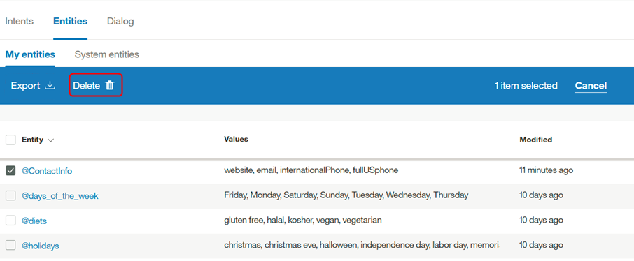

## Enabling system entities
{: #enable_system_entities}

The {{site.data.keyword.conversationshort}} service provides a number of *system entities*, which are common entities that you can use for any application. Enabling a system entity makes it possible to quickly populate your skill with training data that is common to many use cases.

System entities can be used to recognize a broad range of values for the object types they represent. For example, the `@sys-number` system entity matches any numerical value, including whole numbers, decimal fractions, or even numbers written out as words.

System entities are centrally maintained, so any updates are available automatically. You cannot modify system entities.

1.  On the Entities tab, click **System entities**.

    

1.  Browse through the list of system entities to choose the ones that are useful for your application.
    - To see more information about a system entity, including examples of matching input, click the entity in the list.
    - For details about the available system entities, see [System entities](system-entities.html).

1.  Click the toggle switch next to a system entity to enable or disable it.

After you enable system entities, the {{site.data.keyword.conversationshort}} service begins retraining. After training is complete, you can use the entities.
