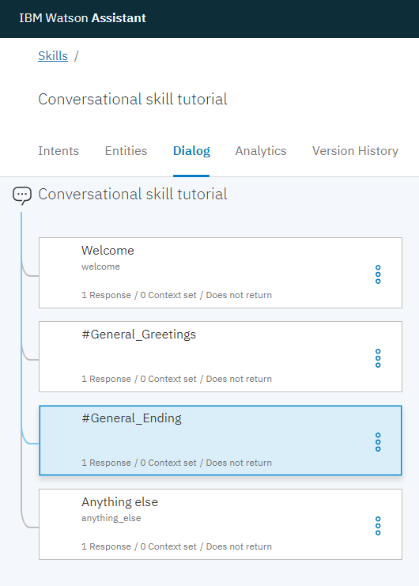

---

copyright:
  years: 2015, 2019
lastupdated: "2019-01-22"

---

{:shortdesc: .shortdesc}
{:new_window: target="_blank"}
{:deprecated: .deprecated}
{:important: .important}
{:note: .note}
{:deprecated: .deprecated}
{:important: .important}
{:note: .note}
{:tip: .tip}
{:pre: .pre}
{:codeblock: .codeblock}
{:screen: .screen}
{:javascript: .ph data-hd-programlang='javascript'}
{:java: .ph data-hd-programlang='java'}
{:python: .ph data-hd-programlang='python'}
{:swift: .ph data-hd-programlang='swift'}
{:hide-dashboard: .hide-dashboard}
{:download: .download}
{:gif: data-image-type='gif'}

# Getting started tutorial
{: #getting-started}

In this short tutorial, we introduce the {{site.data.keyword.conversationshort}} tool and go through the process of creating your first assistant.
{: shortdesc}

## Before you begin
{: #gs-prerequisites}
{: hide-dashboard}

You need a service instance to start.
{: hide-dashboard}

1.  {: hide-dashboard} Go to the [{{site.data.keyword.conversationshort}} ](https://console.bluemix.net/catalog/services/watson-assistant) page in the {{site.data.keyword.cloud_notm}} catalog.

    The service instance will be created in the **default** resource group if you do not choose a different one, and it *cannot* be changed later. This group is sufficient for the purposes of trying out the service.

    If you're creating an instance for more robust use, then learn more about [resource groups ](https://{DomainName}/docs/resources/bestpractice_rgs.html#bp_resourcegroups){: new_window}.
1.  {: hide-dashboard} Sign up for a free {{site.data.keyword.cloud_notm}} account or log in.
1.  {: hide-dashboard} Click **Create**.

## Step 1: Open the tool
{: #gs-launch-tool}

After you create a {{site.data.keyword.conversationshort}} service instance, you land on the **Getting started** page of the service dashboard.
{: hide-dashboard}

1.  Click **Manage**, and then click **Launch tool**. If you're prompted to log in to the tool, provide your {{site.data.keyword.cloud_notm}} credentials.

<!-- Remove this text after dedicated instances have the developer console: begin -->

{{site.data.keyword.Bluemix_dedicated_notm}}: Select your service instance from the Dashboard to launch the tool.

<!-- Remove this text after dedicated instances have the Developer Console: end -->

## Step 2: Create a dialog skill
{: #gs-add-skill}

Your first step in the {{site.data.keyword.conversationshort}} tool is to create a skill.

A *dialog skill* is a container for the artifacts that define the flow of a conversation that your assistant can have with your customers.

1.  From the home page of the {{site.data.keyword.conversationshort}} tool, click **Create a Skill**.

    

1.  Click **Create new**.

    

1.  Give your skill the name `Conversational skill tutorial`.
1.  **Optional**. If the dialog you plan to build will use a language other than English, then choose the appropriate language from the list.
1.  Click **Create**.

    

You land on the Intents page of the tool.

## Step 3: Add intents from a content catalog
{: #gs-add-catalog}

Add training data that was built by IBM to your workspace by adding intents from a content catalog. In particular, you will give your assistant access to the **General** content catalog so your dialog can greet users, and end conversations with them.

1.  In the {{site.data.keyword.conversationshort}} tool, click the **Content Catalog** tab.
1.  Find **General** in the list, and then click **Add to skill**.

    
1.  Open the **Intents** tab to review the intents and associated example utterances that were added to your training data. You can recognize them because each intent name begins with the prefix `#General_`. You will add the `#General_Greetings` and `#General_Ending` intents to your dialog in the next step.

    

You successfully started to build your training data by adding prebuilt content from {{site.data.keyword.IBM_notm}}.

## Step 4: Build a dialog
{: #gs-build-dialog}

A [dialog](/docs/services/assistant/dialog-overview.html) defines the flow of your conversation in the form of a logic tree. It matches intents (what users say) to responses (what the bot says back). Each node of the tree has a condition that triggers it, based on user input.

We'll create a simple dialog that handles greeting and ending intents, each with a single node.

### Adding a start node

1.  In the {{site.data.keyword.conversationshort}} tool, click the **Dialog** tab.
1.  Click **Create**. You see two nodes:
    - **Welcome**: Contains a greeting that is displayed to your users when they first engage with the assistant.
    - **Anything else**: Contains phrases that are used to reply to users when their input is not recognized.

    
1.  Click the **Welcome** node to open it in the edit view.
1.  Replace the default response with the text, `Welcome to the Watson Assistant tutorial!`.

    
1.  Click  to close the edit view.

You created a dialog node that is triggered by the `welcome` condition. (`welcome` is a special condition that functions like an intent, but does not begin with a `#`.) It is triggered when a new conversation starts. Your node specifies that when a new conversation starts, the system should respond with the welcome message that you add to the response section of this first node.

### Testing the start node

You can test your dialog at any time to verify the dialog. Let's test it now.

- Click the  icon to open the "Try it out" pane. You should see your welcome message.

### Adding nodes to handle intents

Now let's add nodes to handle our intents between the `Welcome` node and the `Anything else` node.

1.  Click the More icon  on the **Welcome** node, and then select **Add node below**.
1.  Type `#General_Greetings` in the **Enter a condition** field of this node. Then, select the **`#General_Greetings`** option.
1.  Add the response, `Good day to you!`
1.  Click  to close the edit view.

   
1.  Click the More icon  on this node, and then select **Add node below** to create a peer node. In the peer node, specify `#General_Ending` as the condition, and `OK. See you later.` as the response.

   
1.  Click  to close the edit view.

   

### Testing intent recognition

You built a simple dialog to recognize and respond to both greeting and ending inputs. Let's see how well it works.

1.  Click the  icon to open the "Try it out" pane. There's that reassuring welcome message.
1.  At the bottom of the pane, type `Hello` and press Enter. The output indicates that the #hello intent was recognized, and the appropriate response (`Good day to you.`) appears.
1.  Try the following input:
    - `bye`
    - `howdy`
    - `see ya`
    - `good morning`
    - `sayonara`

{: gif}

{{site.data.keyword.watson}} can recognize your intents even when your input doesn't exactly match the examples that you included. The dialog uses intents to identify the purpose of the user's input regardless of the precise wording used, and then responds in the way you specify.

### Result of building a dialog

That's it. You created a simple conversation with two intents and a dialog to recognize them.

## Step 5: Create an assistant
{: #gs-create-assistant}

An [*assistant*](/docs/services/assistant/assistants.html) is a cognitive bot to which you add a skill that enables it to interact with your customers in useful ways.

1.  Click the **Assistants** tab.
1.  Click **Create new**.

    
1.  Name the assistant `Watson Assistant tutorial`.
1.  In the Description field, enter `This is a sample assistant that I am creating to help me learn.`
1.  Click **Create**.

    

## Step 6: Add your skill to your assistant
{: #gs-add-skill-to-assistant}

Add the dialog skill that you build to the assistant you created.

1.  From the new assistant page, click **Add skill**.

    If you created or were given developer role access to any workspaces that were built with the generally available version of the {{site.data.keyword.conversationshort}} service, you will see them listed on the Skills page as conversational skills.
    {: tip}

    
1.  Choose to add the skill that you created earlier to the assistant.

## Step 7: Integrate the assistant
{: #gs-integrate-assistant}

Now that you have an assistant that can participate in a simple conversational exchange, publish it to a public web page where you can test it out. The service provides a built-in integration that is called a Preview Link. When you create this type of integration, it builds your assistant into a chat widget that is hosted by an IBM-branded web page. You can open the web page and chat with your assistant to test it out.

1.  Click the **Assistants** tab, find the `Watson Assistant tutorial` assistant that you created, and open it.
1.  From the *Integrations* area, click **Add integration**.
1.  Find **Preview Link**, and click **Select integration**.

1.  Click the URL that is displayed on the page.

    The page opens in a new tab.
1.  Say `hello` to your assistant, and watch it respond. You can share the URL with others who might want to try out your assistant.

## Next steps
{: #gs-next-steps}

This tutorial is built around a simple example. For a real application, you need to define some more interesting intents, some entities, and a more complex dialog that uses them both. When you have a polished version of the assistant, you can integrate it with channels that your customers use, such as Slack. As traffic increases between the assistant and your customers, you can use the tools that are provided in the **Improve** tab to analyze real conversations, and identify areas for improvement.

- Complete follow-on tutorials that build more advanced dialogs:
    - Add standard nodes with the [Building a complex dialog](/docs/services/assistant/tutorial.html) tutorial.
    - Learn about slots with the [Adding a node with slots](/docs/services/assistant/tutorial-slots.html) tutorial.
- Check out more [sample apps](/docs/services/assistant/sample-applications.html) to get ideas.
