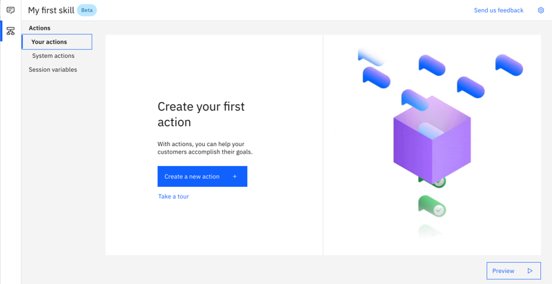
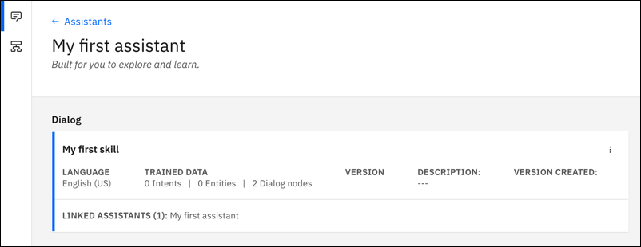
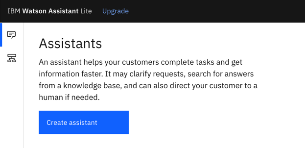
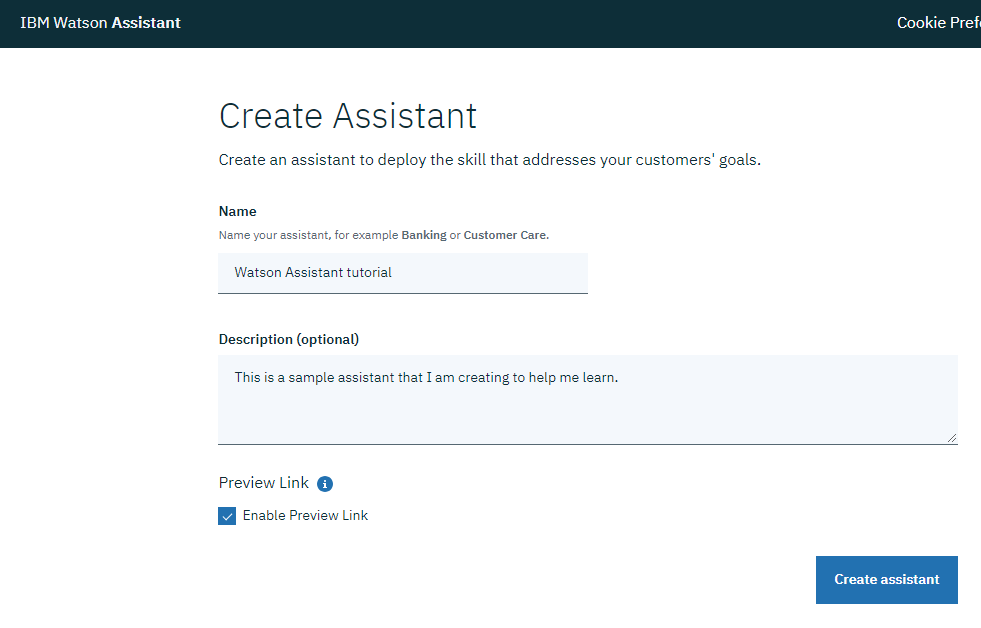
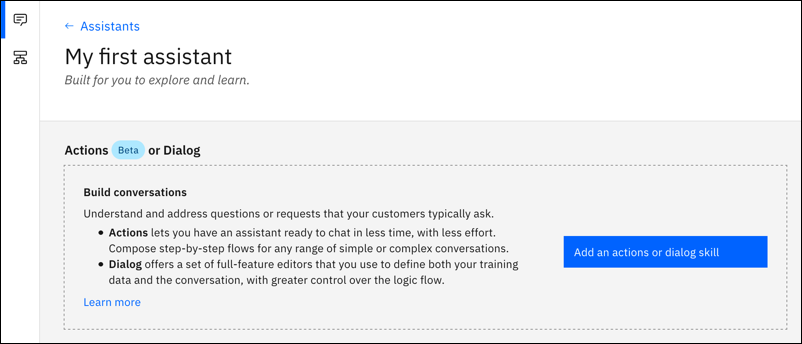
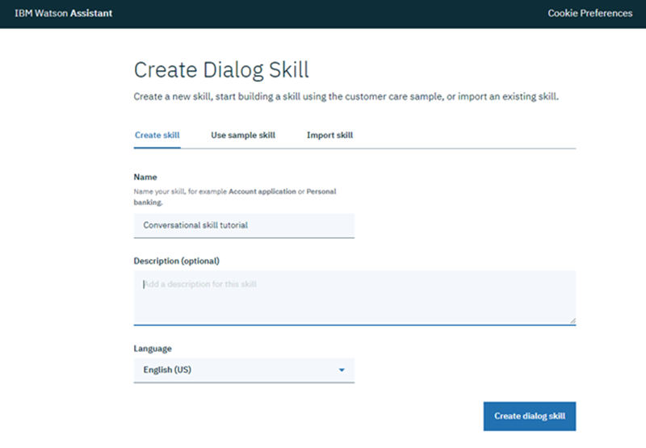

---

copyright:
  years: 2015, 2021
lastupdated: "2021-05-27"

keywords: assistant, omnichannel, virtual agent, virtual assistant, chatbot, conversation, watson assistant, watson conversation

subcollection: assistant
content-type: tutorial
account-plan: lite
completion-time: 10m

---

{:shortdesc: .shortdesc}
{:new_window: target="_blank"}
{:external: target="_blank" .external}
{:deprecated: .deprecated}
{:important: .important}
{:note: .note}
{:tip: .tip}
{:pre: .pre}
{:codeblock: .codeblock}
{:screen: .screen}
{:javascript: .ph data-hd-programlang='javascript'}
{:java: .ph data-hd-programlang='java'}
{:python: .ph data-hd-programlang='python'}
{:swift: .ph data-hd-programlang='swift'}
{:hide-dashboard: .hide-dashboard}
{:download: .download}
{:video: .video}
{:step: data-tutorial-type='step'}
 
# Getting started with {{site.data.keyword.conversationshort}}
{: #getting-started}
{: toc-content-type="tutorial"}
{: toc-completion-time="10m"}

In this short tutorial, we introduce {{site.data.keyword.conversationfull}} and walk you through the process of creating your first assistant.
{: shortdesc}

## Before you begin
{: #getting-started-prerequisites}
{: hide-dashboard}

You need a service instance to start.
{: hide-dashboard}

1.  {: hide-dashboard} Go to the [{{site.data.keyword.conversationshort}}](https://cloud.ibm.com/catalog/services/watson-assistant){: external} page in the {{site.data.keyword.cloud}} catalog.

    The service instance will be created in the **default** resource group if you do not choose a different one, and it *cannot* be changed later. This group is sufficient for the purposes of trying out the product.

    If you're creating an instance for more robust use, then learn more about [resource groups](/docs/account?topic=account-account_setup){: external}.
1.  {: hide-dashboard} Sign up for a free {{site.data.keyword.cloud_notm}} account or log in.
1.  {: hide-dashboard} Click **Create**.

## Open Watson Assistant
{: #getting-started-launch-tool}
{: step}

After you create a {{site.data.keyword.conversationshort}} service instance, you land on the **Manage** page.
{: hide-dashboard}

1.  Click **Launch {{site.data.keyword.conversationshort}}**. If you're prompted to log in, provide your {{site.data.keyword.cloud_notm}} credentials.

A new browser tab or window opens and {{site.data.keyword.conversationshort}} is displayed.

An assistant named **My first assistant** is created for you automatically. An *assistant* is a chatbot. You add skills to your assistant so it can interact with your customers in useful ways.

A skill named **My first skill** is added to the assistant for you automatically. The type of skill that is added is different for different users. The skill will be either a dialog skill or an actions skill.

- If *Actions* is displayed as the first item, you have an actions skill.

  

  If you have an actions skill, continue the tutorial by reading [Getting started with an actions skill](/docs/assistant?topic=assistant-gs-actions).

- If *Dialog* is displayed as the first item, you have a dialog skill.

  

  If you have a dialog skill, continue the tutorial by reading [Getting started with a dialog skill](/docs/assistant?topic=assistant-gs-dialog).

Only if an assistant and skill are not created for you, complete Steps 2 and 3. (A skill is created and added to the assistant for you only on first use of the product. When you create an assistant later, you can choose the skills you want to add to it.)
{: important}

## Create an assistant
{: #getting-started-create-assistant}
{: step}

An *assistant* is a cognitive bot to which you add skills that enable it to interact with your customers in useful ways.

1.  Click the **Assistants** icon , and then click **Create assistant**.

    
1.  Name the assistant `My first assistant`.

    

1.  Click **Create assistant**.

## Create a dialog skill
{: #getting-started-add-skill}
{: step}

A *dialog skill* is a container for the artifacts that define the flow of a conversation that your assistant can have with your customers.

1.  Click **Add an actions or dialog skill**.

    

1.  Give your skill the name `My first skill`.

1.  **Optional**. If the dialog you plan to build will use a language other than English, then choose the appropriate language from the list.

1.  For skill type, choose Dialog.

    

1.  Click **Create skill**.

    The skill is created and appears in your assistant.

To continue with the tutorial, see [Getting started with a dialog skill](/docs/assistant?topic=assistant-gs-dialog).
