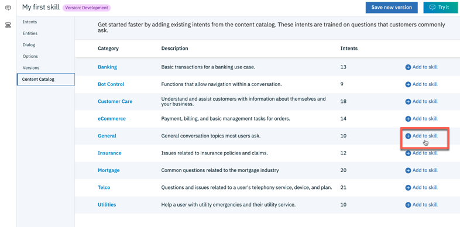
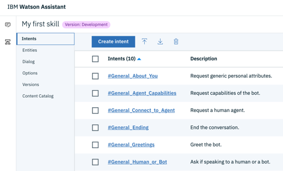
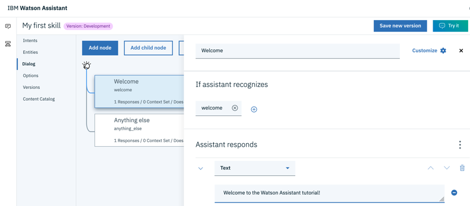
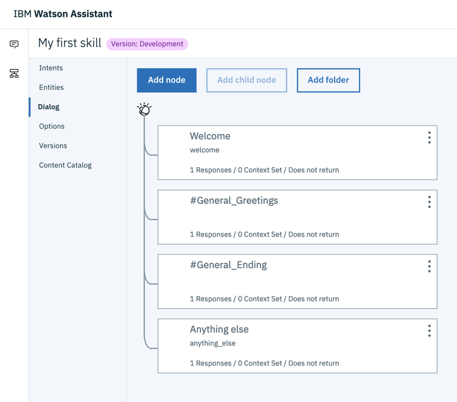

---

copyright:
  years: 2015, 2022
lastupdated: "2022-12-14"

subcollection: assistant
content-type: tutorial
account-plan: lite
completion-time: 10m

---

{:shortdesc: .shortdesc}
{:new_window: target="_blank"}
{:external: target="_blank" .external}
{:deprecated: .deprecated}
{:important: .important}
{:note: .note}
{:tip: .tip}
{:pre: .pre}
{:codeblock: .codeblock}
{:screen: .screen}
{:javascript: .ph data-hd-programlang='javascript'}
{:java: .ph data-hd-programlang='java'}
{:python: .ph data-hd-programlang='python'}
{:swift: .ph data-hd-programlang='swift'}
{:hide-dashboard: .hide-dashboard}
{:download: .download}
{:video: .video}
{:step: data-tutorial-type='step'}

{{site.data.content.newlink}}
 
# Getting started with a dialog skill
{: #gs-dialog}
{: toc-content-type="tutorial"}
{: toc-completion-time="10m"}

In this short tutorial, we help you use a dialog skill to build your first conversation.
{: shortdesc}

A *dialog skill* uses Watson natural language processing and machine learning technologies to understand user questions and requests, and respond to them with answers that are authored by you.

## Create an assistant
{: #getting-started-create-assistant}
{: step}

An *assistant* is a cognitive bot to which you add skills that enable it to interact with your customers in useful ways.

1.  Click the **Assistants** icon , and then click **Create assistant**.

    

1.  Name the assistant `My first assistant`.

    

1.  Click **Create assistant**.

## Create a dialog skill
{: #getting-started-add-skill}
{: step}

A *dialog skill* is a container for the artifacts that define the flow of a conversation that your assistant can have with your customers.

1.  Click **Add an actions or dialog skill**.

    

1.  Give your skill the name `My first skill`.

1.  **Optional**. If the dialog you plan to build will use a language other than English, then choose the appropriate language from the list.

1.  For skill type, choose Dialog.

    

1.  Click **Create skill**.

    The skill is created and appears in your assistant.

## Add intents from a content catalog
{: #gs-dialog-add-catalog}
{: step}

The Intents page is where you start to train your assistant. In this tutorial, you will add training data that was built by IBM to your skill. Prebuilt intents are available from the content catalog. You will give your assistant access to the **General** content catalog so your dialog can greet users, and end conversations with them.

1.  Make sure your **My first skill** is open.

1.  Click **Content Catalog** from the Skills menu.

1.  Find **General** in the list, and then click **Add to skill**.

    
1.  Open the **Intents** tab to review the intents and associated example utterances that were added to your training data. You can recognize them because each intent name begins with the prefix `#General_`. You will add the `#General_Greetings` and `#General_Ending` intents to your dialog in the next step.

    

You successfully started to build your training data by adding prebuilt content from {{site.data.keyword.IBM_notm}}.

## Build a dialog
{: #gs-dialog-build-dialog}
{: step}

A [dialog](/docs/assistant?topic=assistant-dialog-overview) defines the flow of your conversation in the form of a logic tree. It matches intents (what users say) to responses (what your virtual assistant says back). Each node of the tree has a condition that triggers it, based on user input.

We'll create a simple dialog that handles greeting and ending intents, each with a single node.

### Adding a start node
{: #gs-adding-a-start-node}

1.  From the Skills menu, click **Dialog**.

    The following two dialog nodes are created for you automatically:

    - **Welcome**: Contains a greeting that is displayed to your users when they first engage with the assistant.
    - **Anything else**: Contains phrases that are used to reply to users when their input is not recognized.

    

1.  Click the **Welcome** node to open it in the edit view.

1.  Replace the default response with the text, `Welcome to the Watson Assistant tutorial!`.

    

1.  Click  to close the edit view.

You created a dialog node that is triggered by the `welcome` condition. (`welcome` is a special condition that functions like an intent, but does not begin with a `#`.) It is triggered when a new conversation starts. Your node specifies that when a new conversation starts, the system should respond with the welcome message that you add to the response section of this first node.

### Testing the start node
{: #gs-testing-the-start-node}

You can test your dialog at any time to verify the dialog. Let's test it now.

- Click the  icon to open the "Try it out" pane. You should see your welcome message.

### Adding nodes to handle intents
{: #gs-adding-nodes-to-handle-intents}

Now let's add nodes between the `Welcome` node and the `Anything else` node that handle our intents.

1.  Click **Add node**.

1.  In the node name field, type `Greet customers`.

1.  In the **If assistant recognizes** field of this node, start to type `#General_Greetings`. Then, select the **`#General_Greetings`** option.

1.  Add the response text, `Good day to you!`

    

1.  Click  to close the edit view.

1.  Click **Add node** to create a peer node. 

1.  Name the peer node `Say goodbye` and specify `#General_Ending` in the **If assistant recognizes** field. 

1.  Add `OK. See you later.` as the response text.

    

1.  Click  to close the edit view.

   

### Testing intent recognition
{: #gs-testing-intent-recognition}

You built a simple dialog to recognize and respond to both greeting and ending inputs. Let's see how well it works.

1.  Click the  icon to open the "Try it out" pane. There's that reassuring welcome message.
1.  In the text field, type `Hello` and then press Enter. The output indicates that the `#General_Greetings` intent was recognized, and the appropriate response (`Good day to you.`) is displayed.
1.  Try the following input:
    - `bye`
    - `howdy`
    - `see ya`
    - `good morning`
    - `sayonara`

    {: video controls loop}

    {{site.data.keyword.watson}} can recognize your intents even when your input doesn't exactly match the examples that you included. The dialog uses intents to identify the purpose of the user's input regardless of the precise wording used, and then responds in the way you specify.

### Result of building a dialog
{: #gs-result-of-building-a-dialog}

That's it. You created a simple conversation with two intents and a dialog to recognize them.

## Integrate the assistant
{: #gs-dialog-integrate-assistant}
{: step}

Now that you have an assistant that can participate in a simple conversational exchange, test it.

1.  Click the **Assistants** icon  to open a list of your assistants.
1.  Find the *My first assistant* assistant, and open it.
1.  Test your assistant with *Preview*.

    

1.  Copy the URL from *Share this link* and use it in a new tab. You can start submitting message to see how your assistant responds. 

    With a Lite plan, you can use the service for free. With other plans, you are charged for messages that you submit from the preview link. You can review metrics about the test user conversations from the Analytics page. You are not charged for messages that you submit from the "Try it out" pane, and the exchanges you have there are not logged.
    {: note}

1.  Type `hello` into the text field, and watch your assistant respond. 

    

    You can share the URL with others who might want to try out your assistant.

1.  After testing, close the web page. Click the **X** to close the preview link integration page.

## Next steps
{: #gs-dialog-next-steps}

This tutorial is built around a simple example. For a real application, you need to define some more interesting intents, some entities, and a more complex dialog that uses them both. When you have a polished version of the assistant, you can integrate it with web sites or channels, such as Slack, that your customers already use. As traffic increases between the assistant and your customers, you can use the tools that are provided in the **Analytics** page to analyze real conversations, and identify areas for improvement.

- Complete follow-on tutorials that build more advanced dialogs:

    - Add more dialog nodes to design complex conversational exchanges. See [Building a complex dialog](/docs/assistant?topic=assistant-tutorial).
    - Learn techniques for getting customers to share information that the assistant needs before it can provide a useful response. See [Adding a node with slots](/docs/assistant?topic=assistant-tutorial-slots).
