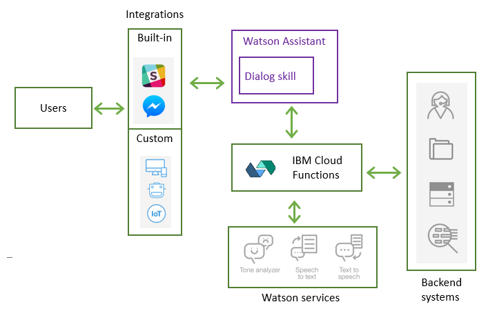

---

copyright:
  years: 2015, 2019
lastupdated: "2019-05-20"

subcollection: assistant

---

{:shortdesc: .shortdesc}
{:new_window: target="_blank"}
{:deprecated: .deprecated}
{:important: .important}
{:note: .note}
{:tip: .tip}
{:pre: .pre}
{:codeblock: .codeblock}
{:screen: .screen}
{:javascript: .ph data-hd-programlang='javascript'}
{:java: .ph data-hd-programlang='java'}
{:python: .ph data-hd-programlang='python'}
{:swift: .ph data-hd-programlang='swift'}

# About
{: #index}

Use {{site.data.keyword.conversationfull}} to build your own branded assistant into any device, application, or channel. Your assistant connects to the customer engagement resources you already use to deliver an engaging, unified problem-solving experience to your customers.
{: shortdesc}

## How it works
{: #index-how-it-works}

This diagram shows the overall architecture:

- Users interact with the assistant through one or more of these **integration** points:

  - A chat bot that you publish directly to an existing social media messaging platform, such as Slack or Facebook Messenger.
  - A simple chat bot user interface that is hosted by IBM Cloud.
  - Custom application that you develop, such as a mobile app or a robot with a voice interface.

- The **assistant** receives user input and routes it to the dialog skill.

- The dialog **skill** interprets the user input further, then directs the flow of the conversation. The dialog gathers any information it needs to respond or perform a transaction on the user's behalf.

## Implementation
{: #index-implementation}

Here's how you implement your assistant:

- **Create an assistant**.

- **Create a dialog skill**. Use the intuitive graphical tool to define the training data and dialog for the conversation between your assistant and your customers.

  The training data consists of the following artifacts:

  - **Intents**: Goals that you anticipate your users have when they interact with your assistant. Define one intent for each goal that can be identified in a user's input. For example, you might define an intent that is named *store_hours* that answers questions about store hours. For each intent, you add sample utterances that reflect the input customers might use to ask for the information they need, such as, `What time do you open?`

    Or use prebuilt **content catalogs** that are provided by IBM to get started with data that addresses common customer goals.

  - **Dialog**: Use the dialog tool to build a dialog flow that incorporates your intents. The dialog flow is represented graphically in the tool as a tree. You can add a branch to process each of the intents that you want your assistant to handle.

  - **Entities**: An entity represents a term or object that provides context for an intent. For example, an entity might be a city name that helps your dialog to distinguish which store the user wants to know store hours for. After you add entities, update your dialog to use them. Add dialog nodes that handle the many possible permutations of a request based on the entities that are found in the user input.

    As you add training data, a natural language classifier is automatically added to the skill. The classifier model is trained to understand the types of requests that you teach your assistant to listen for and respond to.

- **Add the dialog skill to your assistant.**

- **Integrate your assistant.** Create a channel integration to deploy the configured assistant directly to a social media or messaging channel.

  Your deployed assistant is hosted by {{site.data.keyword.cloud_notm}}, the IBM cloud computing platform. (For more information, see [Platform overview ](https://cloud.ibm.com/docs/overview/ibm-cloud#overview){: new_window}.)

Read more about these implementation steps by following these links:

- [Intent creation overview](/docs/services/assistant?topic=assistant-intents#intents-described)
- [Dialog overview](/docs/services/assistant?topic=assistant-dialog-overview)
- [Entity creation overview](/docs/services/assistant?topic=assistant-entities#entities-described)
- [Assistant overview](/docs/services/assistant?topic=assistant-assistant-add)
- [Adding integrations](/docs/services/assistant?topic=assistant-deploy-integration-add)

## Browser support
{: #index-browser-support}

The {{site.data.keyword.conversationshort}} service tool requires the same level of browser software as is required by {{site.data.keyword.Bluemix_notm}}. For more information, see {{site.data.keyword.Bluemix_notm}} [Prerequisites ](https://cloud.ibm.com/docs/overview?topic=overview-prereqs-platform#browsers-platform){: new_window}.

## Language support
{: #index-lang-support}

Language support by feature is detailed in the [Supported languages](/docs/services/assistant?topic=assistant-language-support) topic.

## Terms and notices
{: #index-notices}

See [IBM Cloud Terms and Notices ](/docs/overview/terms-of-use?topic=overview-terms){: new_window} for information about the terms of service.

US Health Insurance Portability and Accountability Act (HIPAA) support is available for Premium plans created on or after 1 April 2019. For more information, see [Enabling EU and HIPAA supported settings ](/docs/account?topic=account-eu-hipaa-supported#eu-hipaa-supported){: new_window}.

## Next steps
{: #index-next-steps}

- [Get started](/docs/services/assistant?topic=assistant-getting-started) with the product.
- View the list of [developer resources ](https://www.ibm.com/watson/developer-resources/){: new_window}.

Have questions? Contact [IBM Sales ](https://www-01.ibm.com/marketing/iwm/dre/signup?source=urx-20970){: new_window}.
