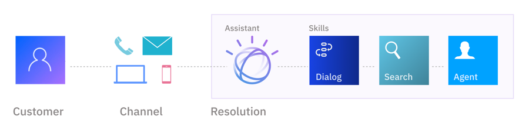
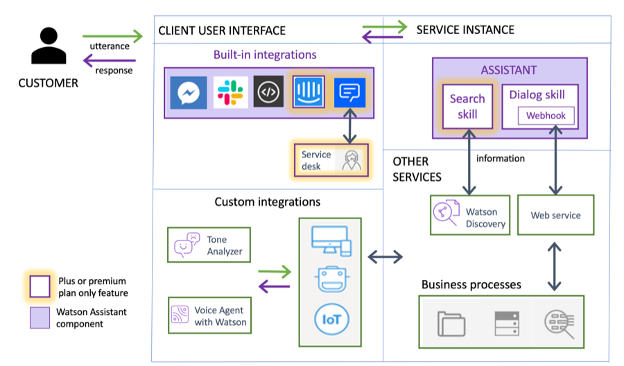

---

copyright:
  years: 2015, 2020
lastupdated: "2020-07-21"

keywords: chatbot, live chatbot, omnichannel

subcollection: assistant

---

{:shortdesc: .shortdesc}
{:new_window: target="_blank"}
{:external: target="_blank" .external}
{:deprecated: .deprecated}
{:important: .important}
{:note: .note}
{:tip: .tip}
{:pre: .pre}
{:codeblock: .codeblock}
{:screen: .screen}
{:javascript: .ph data-hd-programlang='javascript'}
{:java: .ph data-hd-programlang='java'}
{:python: .ph data-hd-programlang='python'}
{:swift: .ph data-hd-programlang='swift'}

# About Watson Assistant
{: #index}

Use {{site.data.keyword.conversationfull}} to build your own branded live chatbot into any device, application, or channel. Your chatbot, which is also known as an *assistant*, connects to the customer engagement resources you already use to deliver an engaging, unified problem-solving experience to your customers.
{: shortdesc}

| | |
|------------|-------------|
| *Create AI-driven conversational flows* | Your assistant leverages industry-leading AI capabilities to understand questions that your customers ask in natural language. It uses machine learning models that are custom built from your data to deliver accurate answers in real time. |
| *Embed existing help content* | You already know the answers to customer questions? Put your subject matter experise to work. Add a search skill to give your assistant access to corporate data collections that it can mine for answers. |
| *Connect to your customer service teams* | If customers need more help or want to discuss a topic that requires a personal touch, connect them to human agents from your existing service desk provider. |
| *Bring the assistant to your customers, where they are* | Configure one or more built-in integrations to quickly publish your assistant in popular social media channels like Slack, Facebook Messenger, or Intercom. Add your assistant as a chat widget to your company website, or build your own custom app. |
| *Track customer engagement and satisfaction* | Use built-in metrics to analyze logs from conversations between customers and your assistant to gauge how well it's doing and identify areas for improvement. |

## How it works
{: #index-how-it-works}

This diagram illustrates how the product delivers an omnichannel customer experience:

- Users interact with the assistant through one or more of these **integration** points:

  - A virtual assistant that you publish directly to an existing social media messaging platform, such as Slack or Facebook Messenger.
  - A web chat that you embed in your company website that can answer customer questions directly and can transfer complex requests to a customer support representative.
  - A custom application that you develop, such as a mobile app or a robot with a voice interface.

- The **assistant** receives user input and routes it to the dialog skill.

- The **dialog skill** interprets the user input further, then directs the flow of the conversation. The dialog gathers any information it needs to respond or perform a transaction on the user's behalf.

- Any questions that cannot be answered by the dialog skill are sent to the **search skill**, which finds relevant answers by searching the company knowledge bases that you configure for the purpose.

To see how {{site.data.keyword.conversationshort}} is helping enterprises cut costs and improve customer satisfaction today, [read the Watson blog](https://www.ibm.com/blogs/watson/2020/03/independent-study-finds-ibm-watson-assistant-customers-accrued-23-9-million-in-benefits/){: external}.

## Implementation steps
{: #index-implementation}

This diagram shows the implementation in more detail:

Here's how you implement your assistant:

1.  Create an assistant.

1.  Add a skill to your assistant.

    Depending on your service plan, you can add the following types of skills:

    - To create an AI-driven conversational flow, add a dialog skill.  
  
      Use the intuitive graphical product to define the training data and dialog for the conversation between your assistant and your customers. The training data consists of the following artifacts:

      - **Intents**: Goals that you anticipate your users have when they interact with your assistant. Define one intent for each goal that can be identified in a user's input. For example, you might define an intent that is named *store_hours* that answers questions about store hours. For each intent, you add sample utterances that reflect the input customers might use to ask for the information they need, such as, `What time do you open?`

        Or use prebuilt **content catalogs** that are provided by IBM to get started with data that addresses common customer goals.

      - **Dialog**: Use the dialog editor to build a dialog flow that incorporates your intents. The dialog flow is represented graphically as a tree. You can add a branch to process each of the intents that you want your assistant to handle.

      - **Entities**: An entity represents a term or object that provides context for an intent. For example, an entity might be a city name that helps your dialog to distinguish which store the user wants to know store hours for. After you add entities, update your dialog to use them. Add dialog nodes that handle the many possible permutations of a request based on the entities that are found in the user input.

      As you add training data, a natural language classifier is automatically added to the skill. The classifier model is trained to understand the types of requests that you teach your assistant to listen for and respond to.

    - To embed existing help content, add a search skill. 

      Take advantage of data collections that you create in {{site.data.keyword.discoveryfull}} to provide answers to customer questions. When a customer asks a question that the dialog is not designed to answer, your assistant can search for relevant information from the configured data sources, extract the information, and return it as the assistant's response.

1.  Bring the assistant to your customers where they are by adding integrations. 

    Add a built-in channel integration to deploy the configured assistant directly to a social media or messaging channel. Build your own client application as the user interface for the assistant. Or add the built-in web chat integration to your company website. From the web chat you can transfer customers who ask to speak to someone to your existing service desk personnel.

    Your deployed assistant is hosted by {{site.data.keyword.cloud}}, the IBM cloud computing platform. (For more information, see [Platform overview](/docs/overview?topic=overview-whatis-platform){: external}.) 

If you are interested in on-premises deployments, see the [{{site.data.keyword.conversationfull}} for {{site.data.keyword.icp4dfull}} documentation](/docs/assistant-data?topic=assistant-data-index).

Read more about these implementation steps by following these links:

- [Assistant overview](/docs/assistant?topic=assistant-assistants)
- [Search skill overview](/docs/assistant?topic=assistant-skill-search-add)
- [Intent creation overview](/docs/assistant?topic=assistant-intents#intents-described)
- [Dialog overview](/docs/assistant?topic=assistant-dialog-build)
- [Entity creation overview](/docs/assistant?topic=assistant-entities#entities-described)
- [Adding integrations](/docs/assistant?topic=assistant-deploy-integration-add)

## Browser support
{: #index-browser-support}

The {{site.data.keyword.conversationshort}} application (where you create assistants and skills) requires the same level of browser software as is required by {{site.data.keyword.Bluemix_notm}}. For more information, see {{site.data.keyword.Bluemix_notm}} [Prerequisites](/docs/overview?topic=overview-prereqs-platform#browsers-platform){: external}. 

For information about the web browsers that are supported by the web chat integration, see [Browser Support](https://web-chat.global.assistant.watson.cloud.ibm.com/docs.html?to=key-concepts#browsersupport){: external}.

## Language support
{: #index-lang-support}

Language support by feature is detailed in the [Supported languages](/docs/assistant?topic=assistant-language-support) topic.

## Terms and notices
{: #index-notices}

See [IBM Cloud Terms and Notices](/docs/overview/terms-of-use?topic=overview-terms){: external} for information about the terms of service.

US Health Insurance Portability and Accountability Act (HIPAA) support is available for Premium plans that are hosted in the Washington, DC location created on or after 1 April 2019. For more information, see [Enabling EU and HIPAA supported settings](/docs/account?topic=account-eu-hipaa-supported#eu-hipaa-supported){: external}.

To learn more about service terms and data security, read the following information:

- [Service terms](https://www.ibm.com/software/sla/sladb.nsf/sla/bm-0038-14){: external}
- [Data Processing and Protection Datasheet](https://www.ibm.com/software/reports/compatibility/clarity-reports/report/html/softwareReqsForProduct?deliverableId=DF7F84500FA711E69DCADF455C6AF151){: external}
- [Information security](/docs/assistant?topic=assistant-information-security)
- [IBM Cloud Data security and privacy](https://www.ibm.com/software/sla/sladb.nsf/sla/csdsp?OpenDocument){: external}

## Next steps
{: #index-next-steps}

- [Get started](/docs/assistant?topic=assistant-getting-started) with the product.
- View the list of [developer resources)](https://www.ibm.com/watson/developer-resources/){: external}.

Have questions? Contact [IBM Sales](https://www.ibm.com/account/reg/us-en/signup?formid=urx-20970){: external}.
