---

copyright:
  years: 2015, 2019
lastupdated: "2019-11-21"

keywords: intent, intent conflicts, annotate

subcollection: assistant

---

{:shortdesc: .shortdesc}
{:new_window: target="_blank"}
{:deprecated: .deprecated}
{:important: .important}
{:note: .note}
{:tip: .tip}
{:pre: .pre}
{:codeblock: .codeblock}
{:screen: .screen}
{:javascript: .ph data-hd-programlang='javascript'}
{:java: .ph data-hd-programlang='java'}
{:python: .ph data-hd-programlang='python'}
{:swift: .ph data-hd-programlang='swift'}

# Defining intents
{: #intents}

***Intents*** are purposes or goals that are expressed in a customer's input, such as answering a question or processing a bill payment. By recognizing the intent expressed in a customer's input, the {{site.data.keyword.conversationshort}} service can choose the correct dialog flow for responding to it.
{: shortdesc}

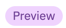 If you don't see the **Intents** page in your skill, then you are using the technology preview version of the product. To get started, see [Creating actions](/docs/services/assistant?topic=assistant-actions).

<iframe class="embed-responsive-item" id="youtubeplayer" title="Working with intents" type="text/html" width="640" height="390" src="https://www.youtube.com/embed/OPdOCUPGMIQ" frameborder="0" webkitallowfullscreen mozallowfullscreen allowfullscreen> </iframe>

## Intent creation overview
{: #intents-described}

- Plan the intents for your application.

  Consider what your customers might want to do, and what you want your application to be able to handle on their behalf. For example, you might want your application to help your customers make a purchase. If so, you can add a `#buy_something` intent. (The `#` that is added as a prefix to the intent name helps to clearly identify it as an intent.)

- Teach Watson about your intents.

  After you decide which business requests that you want your application to handle for your customers, you must teach Watson about them. For each business goal (such as `#buy_something`), you must provide at least 5 examples of utterances that your customers typically use to indicate their goal. For example, `I want to make a purchase.`
  
  Ideally, find real-world user utterance examples that you can extract from existing business processes. The user examples should be tailored to your specific business. For example, if you are an insurance company, a user example might look more like this, `I want to buy a new XYZ insurance plan.`
  
  The examples that you provide are used by your assistant to build a machine learning model that can recognize the same and similar types of utterances and map them to the appropriate intent.

Start with a few intents, and test them as you iteratively expand the scope of the application.

 If you already have chat transcripts from a call center or customer inquiries that you collected from an online application, put that data to work for you. Share the real customer utterances with Watson and let Watson recommend the best intents and intent user examples for your needs. See [Get help defining intents](/docs/services/assistant?topic=assistant-intent-recommendations) for more details.

## Creating intents
{: #intents-create-task}

1.  Open your dialog skill. The skill opens to the **Intents** page.

1.  Select **Create intent**.

1.  In the **Intent name** field, type a name for the intent.
    - The intent name can contain letters (in Unicode), numbers, underscores, hyphens, and periods.
    - The name cannot consist of `..` or any other string of only periods.
    - Intent names cannot contain spaces and must not exceed 128 characters. The following are examples of intent names:
        - `#weather_conditions`
        - `#pay_bill`
        - `#escalate_to_agent`

    A number sign `#` is prepended to the intent name automatically to help identify the term as an intent. You do not need to add it.
    {: tip}

    Optionally add a description of the intent in the **Description** field.

1.  Select **Create intent** to save your intent name.

    

1.  Next, in the **Add user example** field, type the text of a user example for the intent. An example can be any string up to 1024 characters in length. The following utterances might be examples for the `#pay_bill` intent:
    - `I need to pay my bill.`
    - `Pay my account balance`
    - `make a payment`

    To learn about the impact of including references to entities in your user examples, see [How entity references are treated](#intents-entity-references).
    {: tip}

    Intent names and example text can be exposed in URLs when an application interacts with {{site.data.keyword.conversationshort}}. Do not include sensitive or personal information in these artifacts.
    {: important}

1.  Click **Add example** to save the user example.

1.  Repeat the same process to add more examples.

    Provide at least five examples for each intent.
    {: important}

     To get help with user example creation, see [Get intent user example recommendations](/docs/services/assistant?topic=assistant-intent-recommendations#intent-recommendations-get-example-recommendations).

1.  When you are done adding examples, click  to finish creating the intent.

The system begins to train itself on the intent and user examples you added.

## How entity references are treated
{: #intents-entity-references}

When you include an entity mention in a user example, the machine learning model uses the information in different ways in these scenarios:

- [Referencing entity values and synonyms in intent examples](#intents-related-entities)
- [Annotated mentions](#intents-annotated-mentions)
- [Directly referencing an entity name in an intent example](#intents-entity-as-example)

### Referencing entity values and synonyms in intent examples
{: #intents-related-entities}

If you have defined, or plan to define, entities that are related to this intent, mention the entity values or synonyms in some of the examples. Doing so helps to establish a relationship between the intent and entities. It is a weak relationship, but it does inform the model.


*Important*:

  - Intent example data should be representative and typical of data that your users provide. Examples can be collected from actual user data, or from people who are experts in your specific field. The representative and accurate nature of the data is important.
  - Both training and test data (for evaluation purposes) should reflect the distribution of intents in real usage. Generally, more frequent intents have relatively more examples, and better response coverage.
  - You can include punctuation in the example text, as long as it appears naturally. If you believe that some users express their intents with examples that include punctuation, and some users will not, include both versions. Generally, the more coverage for various patterns, the better the response.

### Annotated mentions
{: #intents-annotated-mentions}

As you define entities, you can annotate mentions of the entity directly from your existing intent user examples. A relationship that you identify in this way between the intent and the entity is *not* used by the intent classification model. However, when you add the mention to the entity, it is also added to that entity as new value. And when you add the mention to an existing entity value, it is also added to that entity value as new synonym. Intent classification does use these types of dictionary references in intent user examples to establish a weak reference between an intent and an entity.

For more information about contextual entities, see [Adding contextual entities](/docs/services/assistant?topic=assistant-entities#entities-create-annotation-based).

### Directly referencing an entity name in an intent example
{: #intents-entity-as-example}

This approach is advanced. If used, it must be used consistently.
{: note}

You can choose to directly reference entities in your intent examples. For instance, say that you have an entity that is called `@PhoneModelName`, which contains values *Galaxy S8*, *Moto Z2*, *LG G6*, and *Google Pixel 2*. When you create an intent, for example `#order_phone`, you might then provide training data as follows:

- Can I get a `@PhoneModelName`?
- Help me order a `@PhoneModelName`.
- Is the `@PhoneModelName` in stock?
- Add a `@PhoneModelName` to my order.


Currently, you can only directly reference synonym entities that you define (pattern values are ignored). You cannot use [system entities](/docs/services/assistant?topic=assistant-system-entities).

If you choose to reference an entity as an intent example (for example, `@PhoneModelName`) *anywhere* in your training data it cancels the value of using a direct reference (for example, *Galaxy S8*) in an intent example anywhere else. All intents will then use the entity-as-an-intent-example approach. You cannot apply this approach for a specific intent only.
{: important}

In practice, this means that if you have previously trained most of your intents based on direct references (*Galaxy S8*), and you now use entity references (`@PhoneModelName`) for just one intent, the change impacts your previous training. If you do choose to use `@Entity` references, you must replace all previous direct references with `@Entity` references.

Defining one example intent with an `@Entity` that has 10 values that are defined for it **does not** equate to specifying that example intent 10 times. The {{site.data.keyword.conversationshort}} service does not give that much weight to that one example intent syntax.

## Testing your intents
{: #intents-test}

After you have finished creating new intents, you can test the system to see if it recognizes your intents as you expect.

1.  Click the  icon.

1.  In the "Try it out" pane, enter a question or other text string and press Enter to see which intent is recognized. If the wrong intent is recognized, you can improve your model by adding this text as an example to the correct intent.

    If you have recently made changes in your skill, you might see a message that indicates that the system is still retraining. If you see this message, wait until training completes before testing:
    {: tip}

    

    The response indicates which intent was recognized from your input.

    

1.  If the system does not recognize the correct intent, you can correct it. To correct the recognized intent, select the displayed intent and then select the correct intent from the list. After your correction is submitted, the system automatically retrains itself to incorporate the new data.

    

1.  {: #intents-mark-irrelevant}If the input is unrelated to any of the intents in your application, you can teach your assistant that by selecting the displayed intent, and then clicking **Mark as irrelevant**.

    

    For more information about this action, see [Teaching your assistant about topics to ignore](/docs/services/assistant?topic=assistant-logs#logs-mark-irrelevant).

If your intents are not being correctly recognized, consider making the following kinds of changes:

- Add the unrecognized text as an example to the correct intent.
- Move existing examples from one intent to another.
- Consider whether your intents are too similar, and redefine them as appropriate.

## Absolute scoring
{: #intents-absolute-scoring}

The {{site.data.keyword.conversationshort}} service scores each intent’s confidence independently, not in relation to other intents. This approach adds flexibility; multiple intents can be detected in a single user input. It also means that the system might not return an intent at all. If the top intent has a low confidence score (less than 0.2), the top intent is included in the intents array that is returned by the API, but any nodes that condition on the intent are not triggered. If you want to detect the case when no intents with good confidence scores were detected, use the `irrelevant` special condition in your dialog node. See [Special conditions](/docs/services/assistant?topic=assistant-dialog-overview#dialog-overview-special-conditions) for more information.

As intent confidence scores change, your dialogs might need restructuring. For example, if a dialog node uses an intent in its condition, and the intent's confidence score starts to consistently drop below 0.2, the dialog node stops being processed. If the confidence score changes, the behavior of the dialog can also change.

## Intent limits
{: #intents-limits}

The number of intents and examples you can create depends on your {{site.data.keyword.conversationshort}} plan type:

| Plan     | Intents per skill | Examples per skill |
|------------------|------------------:|-------------------:|
| Premium          |             2,000 |             25,000 |
| Plus             |             2,000 |             25,000 |
| Standard         |             2,000 |             25,000 |
| Lite, Plus Trial |               100 |             25,000 |
{: caption="Plan details" caption-side="top"}

## Editing intents
{: #intents-edit}

You can click any intent in the list to open it for editing. You can make the following changes:

- Rename the intent.
- Delete the intent.
- Add, edit, or delete examples.
- Move an example to a different intent.

You can tab from the intent name to each example, editing the examples if you want.

To move or delete an example, click the check box that is associated with it, and then click **Move** or **Delete**.

  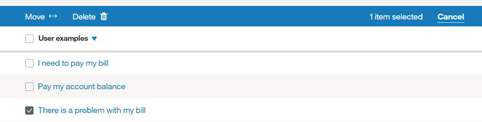

## Searching intents
{: #intents-search}

Use the Search feature to find user examples, intent names, and descriptions.

1.  From the **Intents** page, click the Search icon.

    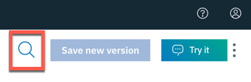

1.  Enter a search term or phrase.

    

Intents containing your search term, with corresponding examples, are shown.

  

## Exporting intents
{: #intents-export}

You can export a number of intents to a CSV file, so you can then import and reuse them for another {{site.data.keyword.conversationshort}} application.

1.  From the **Intents** page, select the intents that you want from the list and click **Export**.

    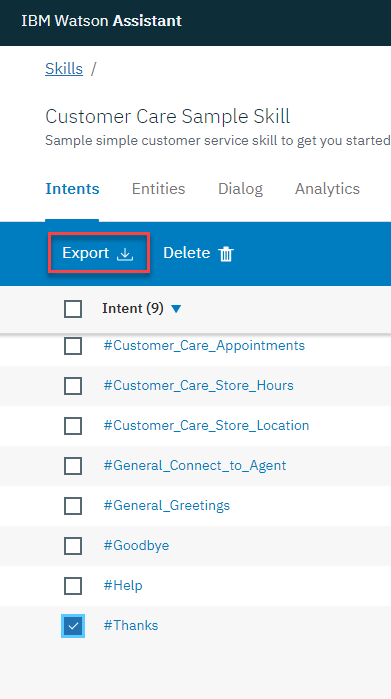

## Importing intents and examples
{: #intents-import}

If you have a large number of intents and examples, you might find it easier to import them from a comma-separated value (CSV) file than to define them one by one. Be sure to remove any personal data from the user examples that you include in the file.

Alternatively, you can upload a file with raw user utterances (from call center logs, for example) and let Watson find candidates for user examples from the data. See [Adding examples from log files](/docs/services/assistant?topic=assistant-intent-recommendations#intent-recommendations-get-example-recommendations) for more information. This feature is available to Plus or Premium plan users only.

1.  Collect the intents and examples into a CSV file, or export them from a spreadsheet to a CSV file. The required format for each line in the file is as follows:

    ```
    <example>,<intent>
    ```
    {: screen}

    where `<example>` is the text of a user example, and `<intent>` is the name of the intent you want the example to match. For example:

    ```
    Tell me the current weather conditions.,weather_conditions
    Is it raining?,weather_conditions
    What's the temperature?,weather_conditions
    Where is your nearest location?,find_location
    Do you have a store in Raleigh?,find_location
    ```
    {: screen}

    **Important:** Save the CSV file with UTF-8 encoding and no byte order mark (BOM).

1.  From the **Intents** page, click the *Import* icon , and then drag a file or browse to select a file from your computer.

    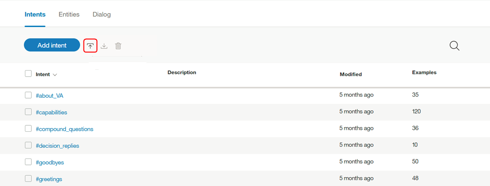

    **Important:** The maximum CSV file size is 10 MB. If your CSV file is larger, consider splitting it into multiple files and importing them separately.

    The file is validated and imported, and the system begins to train itself on the new data.

You can view the imported intents and the corresponding examples on the **Intents** tab. You might need to refresh the page to see the new intents and examples.

## Resolving intent conflicts 
{: #intents-resolve-conflicts}

This feature is available only to Plus or Premium users.
{: note}

The {{site.data.keyword.conversationshort}} application detects a conflict when two or more intent examples in *separate* intents are so similar that {{site.data.keyword.conversationshort}} is confused as to which intent to use.

To resolve conflicts:

1.  From the **Intents** page, review any intents with conflicts.

    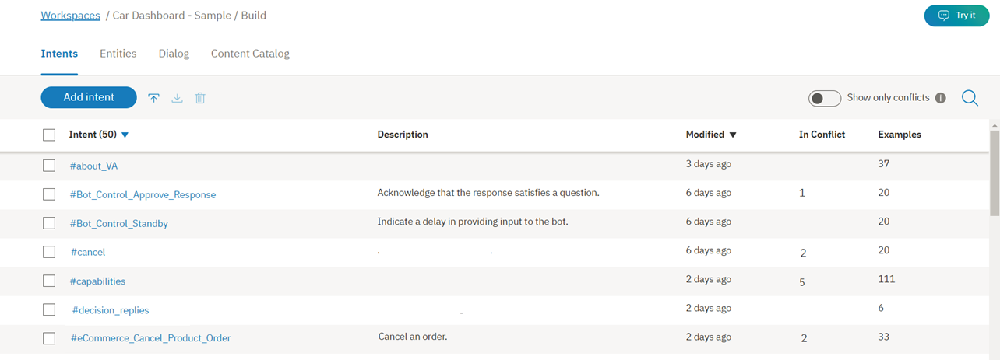

    Toggle the **Show only conflicts** switch to see a list of just your intents with conflicts.
    {: tip}

    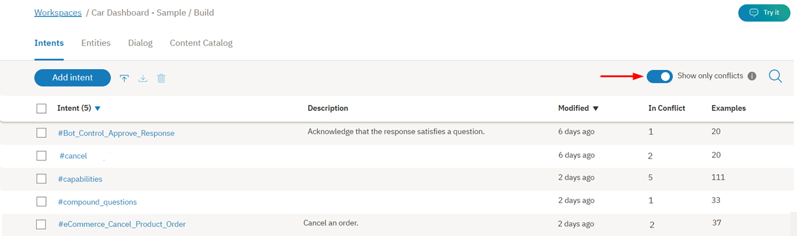

1.  Open an intent conflict. For the intent example that is causing the conflict, click **Resolve conflict**.

    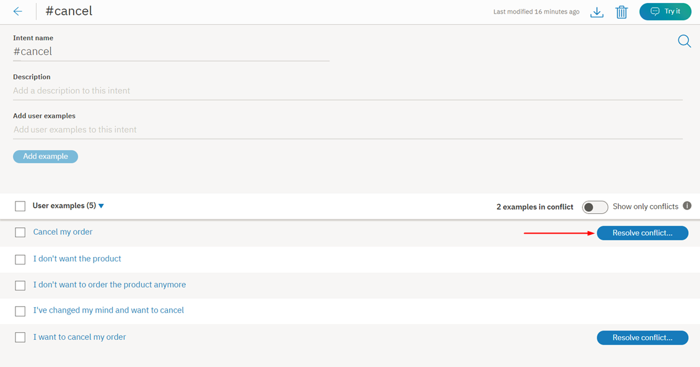

1.  Now, you have the option to either move a conflicting example to another intent, or delete a conflicting example entirely.

    In this case, the examples `Cancel my order` and `I want to cancel my order` appear in both the `#cancel` intent and in the `#eCommerce_Cancel_Product_Order` intent.

    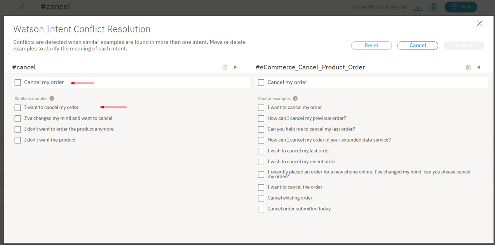

    Additional user examples are training examples that are not necessarily in conflict, but are similar to the examples in conflict. They are shown to provide context to help resolve the conflict.

1.  Select the examples `Cancel  my order` and `I want to cancel my order`, and move them from the `#cancel` intent to the `#eCommerce_Cancel_Product_Order` intent:

    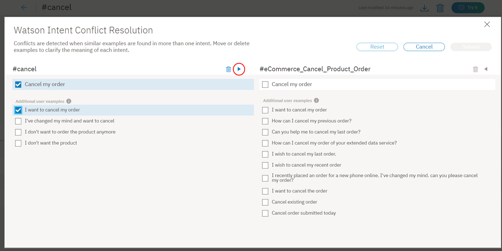

1.  When deciding where to place an example, look for the intent that has synonymous, or nearly synonymous examples.

    Keep each intent as distinct and focused on one goal as possible. If you have two intents with multiple user examples that overlap, maybe you don't need two separate intents. You can move or delete user examples that don't directly overlap into one intent, and then delete the other.
    {: tip}

    Select the other examples in the `#cancel` intent, and delete them:

    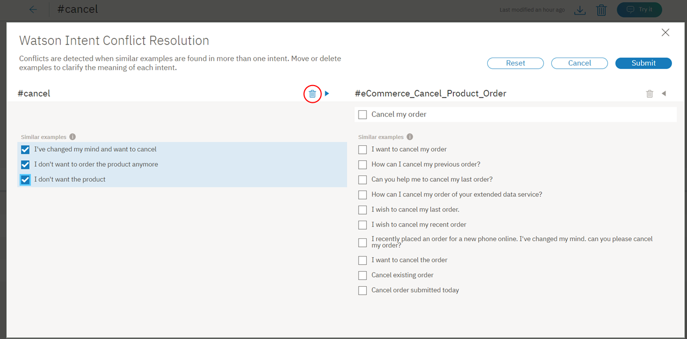

1.  Click the **Submit** button to resolve the conflicts:

    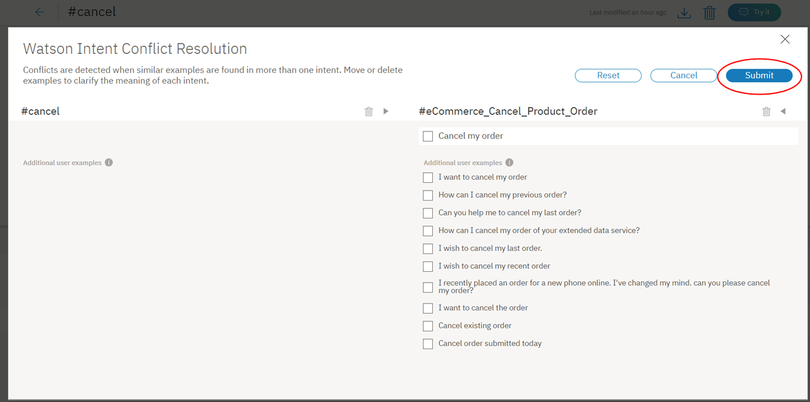

    The *Reset* option allows you to start over with moving the conflict example among intents. *Cancel* returns you to the intent page.

You have resolved a conflict, and can continue your review of other intents with conflicts.

Watch this video to learn more.

<iframe class="embed-responsive-item" id="youtubeplayer0" title="Intent conflict resolution overview" type="text/html" width="640" height="390" src="https://www.youtube.com/embed/9gQtjCBxjdc?rel=0" frameborder="0" webkitallowfullscreen mozallowfullscreen allowfullscreen> </iframe>

## Deleting intents
{: #intents-delete}

You can select a number of intents for deletion.

**IMPORTANT**: By deleting intents that you are also deleting all associated examples, and these items cannot be retrieved later. All dialog nodes that reference these intents must be updated manually to no longer reference the deleted content.

1.  From the **Intents** page, select the intents that you want from the list and click **Delete**.

    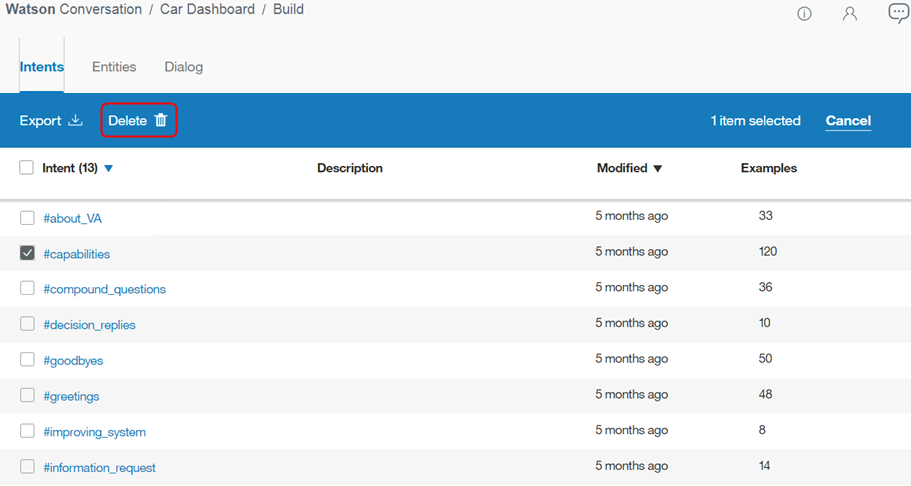
