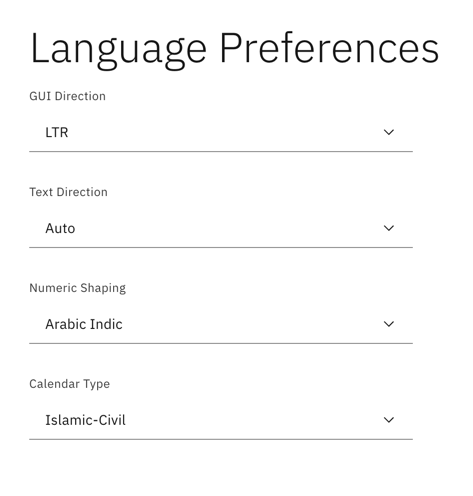

---

copyright:
  years: 2015, 2023
lastupdated: "2023-08-04"

subcollection: assistant

---

{{site.data.keyword.attribute-definition-list}}

Documentation for the **classic {{site.data.keyword.assistant_classic_short}}** experience has moved. For the most up-to-date version, see [Supported languages](/docs/watson-assistant?topic=watson-assistant-admin-language-support#admin-language-support-codes){: external}.
{: attention}

# Supported languages
{: #language-support}

{{site.data.keyword.assistant_classic_short}} supports individual features to varying degrees per language.
{: shortdesc}

{{site.data.keyword.assistant_classic_short}} has classifier models that are designed specifically to support conversational skills in the following languages:

| Language | Language code |
|----------|---------------|
| Arabic | ar |
| Chinese (Simplified) | zh-cn |
| Chinese (Traditional) | zh-tw |
| Czech | cs |
| Dutch | nl |
| English | en-us |
| French | fr |
| German | de |
| Italian | it |
| Japanese | ja |
| Korean | ko |
| Portuguese (Brazilian) | pt-br |
| Spanish | es |
| Universal`*` | xx |
{: caption="Table 1. Supported languages" caption-side="bottom"}

`*` If you want to support conversations in a language for which {{site.data.keyword.assistant_classic_short}} doesn't have a dedicated model, such as Russian, use the *Universal* language model. For more information, see [Adding support for global audiences](/docs/assistant?topic=assistant-assistant-language).

## Feature support details
{: #language-support-tables}

The following tables illustrate the level of language support available for product features.

In the following tables, the level of language and feature support is indicated by these codes:

- GA: The feature is generally available and supported for this language. Features might continue to be updated even after they are generally available.
- Beta: The feature is supported only as a Beta release, and is still undergoing testing before it is made generally available in this language.
- NA: Indicates that a feature is not available in this language.

### Skill support details
{: #language-support-skills}

| Language | [**Actions skill**](/docs/assistant?topic=assistant-skill-actions-add) | [**Dialog skill**](/docs/assistant?topic=assistant-skill-dialog-add) | [**Search skill**](/docs/assistant?topic=assistant-skill-search-add) |
|:---|:---:|:---:|:---:|
| **English (en)**                   | GA | GA | GA |
| **Arabic (ar)**                    | GA | GA | GA |
| **Chinese (Simplified) (zh-cn)**   | GA | GA | GA |
| **Chinese (Traditional) (zh-tw)**  | GA | GA | GA |
| **Czech (cs)**                     | GA | GA | GA |
| **Dutch (nl)**                     | GA | GA | GA |
| **French (fr)**                    | GA | GA | GA |
| **German (de)**                    | GA | GA | GA |
| **Italian (it)**                   | GA | GA | GA |
| **Japanese (ja)**                  | GA | GA | GA |
| **Korean (ko)**                    | GA | GA | GA |
| **Portuguese (Brazilian) (pt-br)** | GA | GA | GA |
| **Spanish (es)**                   | GA | GA | GA |
| **Universal (xx)**                 | GA | GA | GA |
{: caption="Table 2. Skill support details" caption-side="bottom"}

### Intent feature support details
{: #language-support-intents}

| Language | **[Content Catalog](/docs/assistant?topic=assistant-catalog)** | **[Algorithm version](/docs/watson-assistant?topic=watson-assistant-algorithm-version )** |
|:---|:---:|:---:|
| **English (en)**                   | GA | GA |
| **Arabic (ar)**                    | GA (except Covid-19) | GA |
| **Chinese (Simplified) (zh-cn)**   | NA | GA |
| **Chinese (Traditional) (zh-tw)**  | NA | GA |
| **Czech (cs)**                     | NA | GA |
| **Dutch (nl)**                     | NA | GA |
| **French (fr)**                    | GA | GA |
| **German (de)**                    | GA (except Covid-19) | GA |
| **Italian (it)**                   | GA (except Covid-19) | GA |
| **Japanese (ja)**                  | GA (except Covid-19) | GA |
| **Korean (ko)**                    | NA | GA |
| **Portuguese (Brazilian) (pt-br)** | GA | GA |
| **Spanish (es)**                   | GA | GA |
| **Universal (xx)**                 | NA | NA |
{: caption="Table 3. Intent feature support details" caption-side="bottom"}

### User input processing support details
{: #language-support-input}

| Language | **[Dictionary-based entity support](/docs/assistant?topic=assistant-entities#entities-create-dictionary-based)** | **[Fuzzy matching (*Misspelling*)](/docs/assistant?topic=assistant-entities#entities-fuzzy-matching)** | **[Fuzzy matching (*Stemming*)](/docs/assistant?topic=assistant-entities#entities-fuzzy-matching)** | **[Fuzzy matching (*Partial match*)](/docs/assistant?topic=assistant-entities#entities-fuzzy-matching)** | **[Autocorrection](/docs/assistant?topic=assistant-autocorrection)** |
| --- | --- | --- | --- | --- | --- |
| **English (en)**                   | GA | GA | GA | GA | GA |
| **Arabic (ar)**                    | GA | GA | NA | NA | NA |
| **Chinese (Simplified) (zh-cn)**   | GA | NA | NA | NA | NA |
| **Chinese (Traditional) (zh-tw)**  | GA | NA | NA | NA | NA |
| **Czech (cs)**                     | GA | GA | GA | NA | NA |
| **Dutch (nl)**                     | GA | GA | NA | NA | NA |
| **French (fr)**                    | GA | GA | GA | NA | Beta |
| **German (de)**                    | GA | GA | GA | NA | NA |
| **Italian (it)**                   | GA | GA | NA | NA | NA |
| **Japanese (ja)**                  | GA | GA | NA | NA | NA |
| **Korean (ko)**                    | GA | GA | NA | NA | NA |
| **Portuguese (Brazilian) (pt-br)** | GA | GA | NA | NA | NA |
| **Spanish (es)**                   | GA | GA | NA | NA | NA |
| **Universal (xx)**                 | GA | GA | NA | NA | NA |
{: caption="Table 4. User input processing support details" caption-side="bottom"}

### Entity feature support details
{: #language-support-entities}

| Language | **[Contextual entities](/docs/assistant?topic=assistant-entities#entities-create-annotation-based)** |
|:---|:---:|
| **English (en)**                   | GA |
| **Arabic (ar)**                    | NA |
| **Chinese (Simplified) (zh-cn)**   | NA |
| **Chinese (Traditional) (zh-tw)**  | NA |
| **Czech (cs)**                     | NA |
| **Dutch (nl)**                     | NA |
| **French (fr)**                    | Beta |
| **German (de)**                    | NA |
| **Italian (it)**                   | NA |
| **Japanese (ja)**                  | NA |
| **Korean (ko)**                    | NA |
| **Portuguese (Brazilian) (pt-br)** | NA |
| **Spanish (es)**                   | NA |
| **Universal (xx)**                 | NA |
{: caption="Table 5. Entity feature support details" caption-side="bottom"}

### System entity feature support details
{: #language-support-system-entities}

| Language | **[System entities](/docs/assistant?topic=assistant-system-entities)** |
|:---|:---:|
| **English (en)**                   | GA |
| **Arabic (ar)**                    | GA |
| **Chinese (Simplified) (zh-cn)**   | GA |
| **Chinese (Traditional) (zh-tw)**  | GA |
| **Czech (cs)**                     | GA |
| **Dutch (nl)**                     | GA |
| **French (fr)**                    | GA |
| **German (de)**                    | GA |
| **Italian (it)**                   | GA |
| **Japanese (ja)**                  | GA |
| **Korean (ko)**                    | GA |
| **Portuguese (Brazilian) (pt-br)** | GA |
| **Spanish (es)**                   | GA |
| **Universal (xx)**                 | GA | NA |
{: caption="Table 6. System entity feature support details" caption-side="bottom"}

The {{site.data.keyword.assistant_classic_short}} service supports multiple languages as noted, but the tool interface itself (descriptions, labels, etc.) is in English. All supported languages can be input and trained through the English interface.
{: note}

GB18030 compliance: GB18030 is a Chinese standard that specifies an extended code page for use in the Chinese market. This code page standard is important for the software industry because the China National Information Technology Standardization Technical Committee has mandated that any software application that is released for the Chinese market after September 1, 2001, be enabled for GB18030. The {{site.data.keyword.assistant_classic_short}} service supports this encoding, and is certified GB18030-compliant

## Changing a skill language
{: #language-support-change-language}

Once a skill has been created, its language cannot be modified. If it is necessary to change the supported language of a skill, you can do so by editing the skill's underlying JSON.

To change the skill language, take the following steps:

1.  Download the skill that you want to edit.
1.  Open the downloaded skill JSON file in a text editor.
1.  Search for the property named `language`.

    The `language` property is set to the original language of the skill. For example, the language property is `en` for an English skill.

1.  Change the value of this property to the language you want to use instead. For example, change it to `fr` for French or `de` for German.
1.  Save the changes to the JSON file, and then upload the edited file, overwriting the existing skill.

## Configuring bidirectional languages
{: #language-support-configure-bidirectional}

For bidirectional languages, such as Arabic, you can change your skill preferences.

1.  From your skill tile, click the *Actions* drop-down menu, and then select **Language Preferences**.

    This option is only available for skills that are configured to use a bidirectional language.
    {: note}

1.  Select from the following options for your skill:

    - **GUI Direction**: Specifies the layout direction of elements, such as buttons or menus, in the graphical user interface. Choose `LTR` (left-to-right) or `RTL` (right-to-left). If not specified, the tool follows the web browser GUI direction setting.
    - **Text Direction**: Specifies the direction of typed text. Choose `LTR` (left-to-right) or `RTL` (right-to-left), or select `Auto` which will automatically choose the text direction based on your system settings. The `None` option will display left-to-right text.
    - **Numeric Shaping**: Specifies which form of numerals to use when presenting regular digits. Choose from `Nominal`, `Arabic-Indic`, or `Arabic-European`. The `None` option will display Western numerals.
    - **Calendar Type**: Specifies how you choose filtering dates in the skill UI. Choose `Islamic-Civil`, `Islamic-Tabular`, `Islamic-Umm al-Qura`, or `Gregorian`.

    This setting is not reflected in the "Try it out" panel.
    {: note}

    

1.  Click the **X** to close the page. Your changes are saved automatically.

## Working with accented characters
{: #language-support-accents}

In a conversational setting, users might or might not use accents while interacting with the {{site.data.keyword.assistant_classic_short}} service. As such, both accented and non-accented versions of words might be treated the same for intent detection and entity recognition.

However for some languages, like Spanish, some accents can alter the meaning of the entity. Thus, for entity detection, although the original entity might implicitly have an accent, your assistant can also match the non-accented version of the same entity, but with a slightly lower confidence score.

For example, for the word "barrió", which has an accent and corresponds to the past tense of the verb "barrer" (to sweep), your assistant can also match the word "barrio" (neighborhood), but with a slightly lower confidence.

The system will provide the highest confidence scores in entities with exact matches. For example, `barrio` will not be detected if `barrió` is in the training set; and `barrió` will not be detected if `barrio` is in the training set.

You are expected to train the system with the proper characters and accents. For example, if you are expecting `barrió` as a response, then you should put `barrió` into the training set.

Although not an accent mark, the same applies to words using, for example, the Spanish letter `ñ` vs. the letter `n`, such as "uña" vs. "una". In this case the letter `ñ` is not simply an `n` with an accent; it is a unique, Spanish-specific letter.

You can enable fuzzy matching if you think your customers will not use the appropriate accents, or misspell words (including, for example, putting a `n` instead of a `ñ`), or you can explicitly include them in the training examples.

