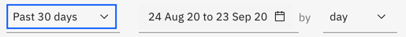
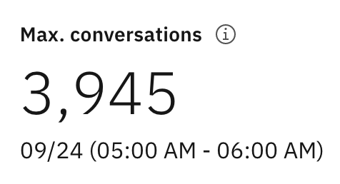
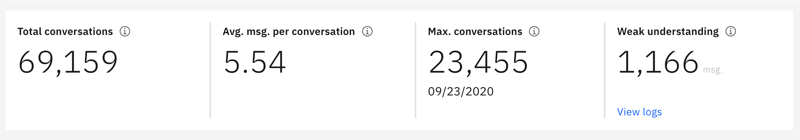
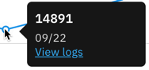
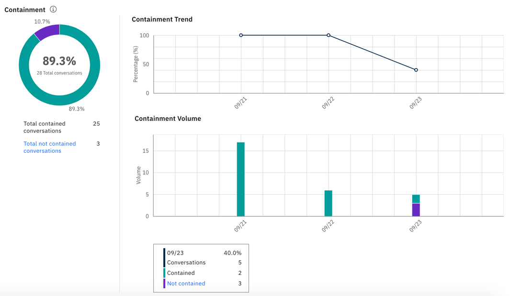

---

copyright:
  years: 2015, 2020
lastupdated: "2020-09-24"

subcollection: assistant

---

{:shortdesc: .shortdesc}
{:new_window: target="_blank"}
{:deprecated: .deprecated}
{:important: .important}
{:note: .note}
{:tip: .tip}
{:pre: .pre}
{:codeblock: .codeblock}
{:screen: .screen}
{:javascript: .ph data-hd-programlang='javascript'}
{:java: .ph data-hd-programlang='java'}
{:python: .ph data-hd-programlang='python'}
{:swift: .ph data-hd-programlang='swift'}

# Metrics overview
{: #logs-overview}

The Overview page provides a summary of the interactions between users and your assistant. You can view the amount of traffic for a given time period, as well as the intents and entities that were recognized most often in user conversations.
{: shortdesc}

Use the metrics to answer questions like:

* What was the average number of conversations per week during the last month?
* How often did customers need to go elsewhwere for support?
* Which intents appeared most often last week?
* Which entity values were recognized the most times during February?
* Which days had the largest or smallest numbers of conversations in the last month?

To see metrics information, select **Overview** in the navigation bar.

## Controls
{: #logs-overview-controls}

You can use the following controls to filter the information:

- *Time period control* - Use this control to choose the period for which data is displayed. This control affects all data shown on the page: not just the number of conversations displayed in the graph, but also the statistics displayed along with the graph, and the lists of top intents and entities.

  The statistics can cover a longer time period than the period for which logs of conversations are retained.
  {: note}

  

  You can choose whether to view data for a single day, a week, a month, or a quarter. In each case, the data points on the graph adjust to an appropriate measurement period. For example, when viewing a graph for a day, the data is presented in hourly values, but when viewing a graph for a week, the data is shown by day. A week always runs from Sunday through Saturday. 
  
  You can create custom time periods also, such as a week that runs from Thursday to the following Wednesday, or a month that begins on any date other than the first.

  The time shown for each conversation is localized to reflect the time zone of your browser. However, API log calls are always shown in UTC time. As a result, if you choose a single day view, for example, the time shown in the visualization might differ from the timestamp specified in the log for the same conversation.

    

- *Intents* and *Entities* filters - Use either of these drop-down filters to show data for a specific intent or entity in your skill.

  The intent and entities filters are populated by the intents and entities in the ***skill***, and not what is in the data source. If you have [selected a data source](/docs/assistant?topic=assistant-logs#logs-deploy-id) other than the skill, you might not see an intent or entity from your data source logs as an option in the filters, unless those intents and entities are also in the skill.
  {: important}

- *Refresh data*: Select **Refresh data** to refresh the data that is used in the page metrics.

  The statistics show traffic from customers who interact with your assistant; they do not include interactions from the *Try it out* pane.

## Scorecards
{: #logs-overview-scorecards}

The scorecards give you a quick view of your metrics. Scroll to see full interactive graphs later in the page.

- *Total conversations*: The total number of conversations between active users and your assistant that occur during the selected time period.

  A single conversation consists of messages that an active user sends to your assistant, and the messages your assistant sends to the user to initiate the conversation or respond.
  
  If your assistant starts by saying "Hi, how can I help you?", and then the user closes the browser without responding, that message is included in the total conversation count.

  The total conversations metric is not used for billing purposes. An exchange with a user is not considered a billable conversation until the user submits a message.
  {: important}

- *Avg. msg. per conversation*: The total messages received during the selected time period divided by the total conversations during the selected time period, as shown in the corresponding graph.
- *Max. conversations*: The maximum number of conversations for a single data point within the selected time period.
- *Weak understanding*: The number of individual messages with weak understanding. These messages are not classified by an intent, and do not contain any known entities. These can be useful in identify potential dialog problems.

## Graphs and statistics
{: #logs-overview-graphs}

Detailed graphs provide additional information. Click a data point on the graphs to see more detail.

- *Containment*: Number of conversations in which the assistant is able to satisfy the customer's request without human intervention.

  - The volume graph shows the total number of conversations per day and how many of the conversations were contained and not contained.
  - The trend graph shows the percentage of daily conversations that were contained. This graph helps you to see if the assistant is getting better or worse at containing conversations over time. 

  

  The containment metric requires that your dialog flag requests for external support when they occur. For more information, see [Measuring containment](/docs/assistant?topic=assistant-dialog-support#dialog-support-containment).
- *Total conversations*: The total number of conversations between active users and your assistant during the selected time period.
- *Average messages per conversation* - The total messages received during the selected time period divided by the total conversations during the selected time period.
- *Total messages* - The total number of messages received from active users over the selected time period.
- *Active users* - The number of unique users who have engaged with your assistant within the selected time period.
- *Average conversations per user* - The total conversations divided by the total number of unique users during the selected time period.

  Statistics for *Active users* and *Average conversations per user* require a unique `user_id` parameter. See [Enabling user metrics](/docs/assistant?topic=assistant-logs-resources#logs-resources-user-id) for more information.
  {: important}

## Top Intents and Top Entities
{: #logs-overview-tops}

You can also view the intents and entities that were recognized most often during the specified time period.

- *Top intents* - Intents are shown in a simple list. In addition to seeing the number of times an intent was recognized, you can select an intent to open the **User conversations** page with the date range filtered to match the data you are viewing, and the intent filtered to match the selected intent.

- *Top entities* are also shown in a list. For each entity you can select from the **Values** column to see a list of the most common values that were identified for this entity during the time period. You can also select an entity to open the **User conversations** page with the date range filtered to match the data you are viewing, and the entity filtered to match the selected entity.

See [Improve your skill](/docs/assistant?topic=assistant-logs) for tips on how to edit intents and entities based on discoveries you make by reviewing the intents and entities that your assistant recognizes.
