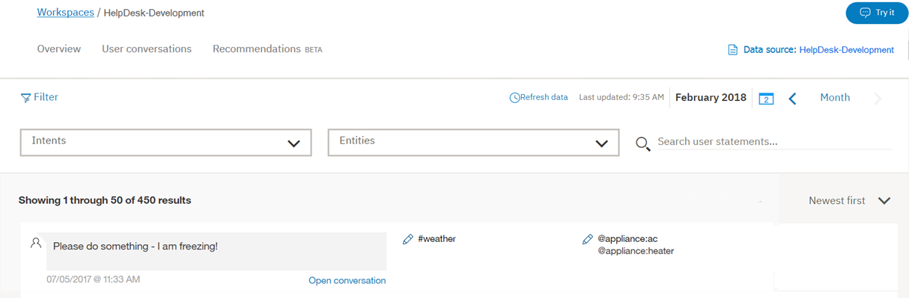
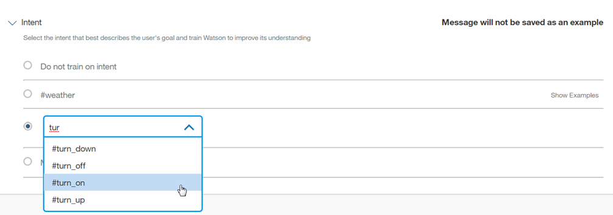
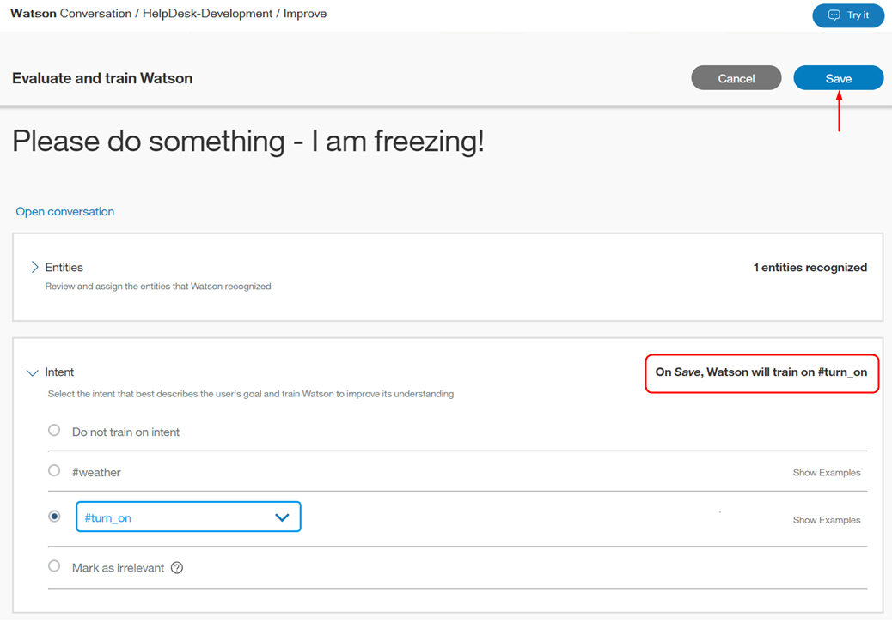
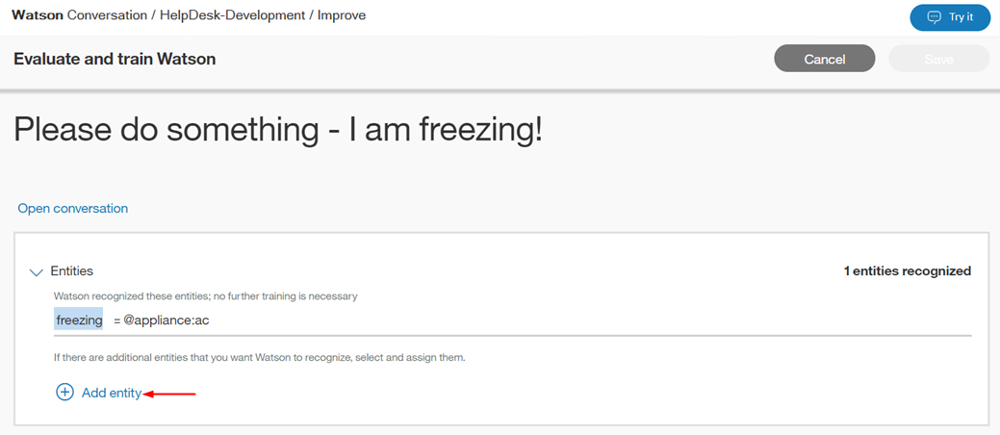
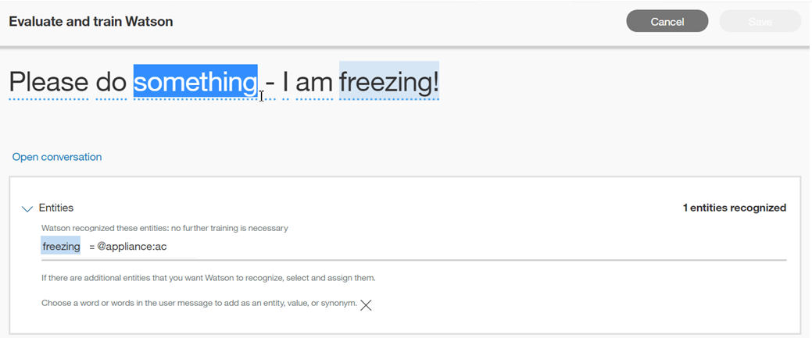
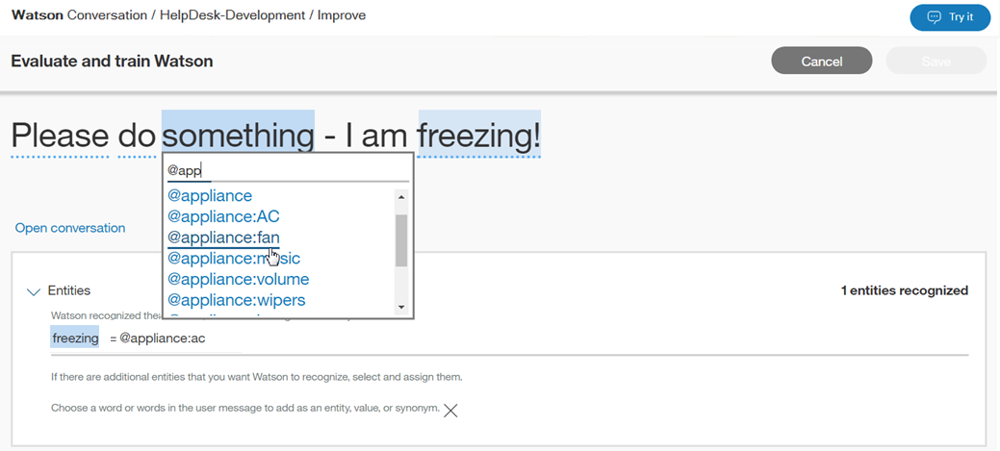
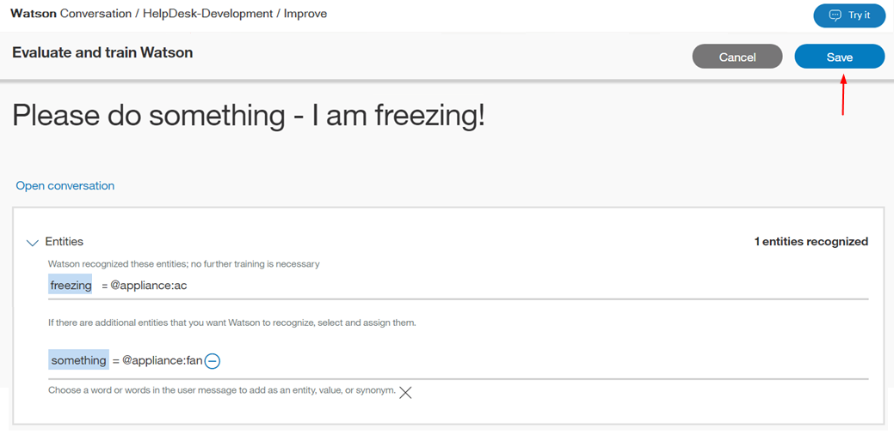

---

copyright:
  years: 2015, 2018
lastupdated: "2018-05-10"

---

{:shortdesc: .shortdesc}
{:new_window: target="_blank"}
{:tip: .tip}
{:pre: .pre}
{:codeblock: .codeblock}
{:screen: .screen}
{:javascript: .ph data-hd-programlang='javascript'}
{:java: .ph data-hd-programlang='java'}
{:python: .ph data-hd-programlang='python'}
{:swift: .ph data-hd-programlang='swift'}

# Working with conversations
{: #logs_convo}

To open a list of interactions between users and your conversational skill, select **User conversations** in the navigation bar. If **User conversations** is not visible, use the  menu to open the page.
{: shortdesc}

When you open the **User conversations** page, the default view lists results for the last day, with the newest results first. The top intent (#intent) and any recognized entity (@entity) values used in a message, and the message text are available. For intents that are not recognized, the value shown is *Irrelevant*. If an entity is not recognized, or has not been provided, the value shown is *No entities found*.

It is important to note that the **User conversations** page displays the total number of *utterances* between users and your skill. An utterance is a single message the user sends to the skill. Each conversation may be made up of multiple utterances. Thus, the number of results on this **User conversations** page is different than the number of conversations shown on the [Overview](logs_oview.html) page.

## Log limits
{: #log-limits}

The length of time for which messages are retained depends on your {{site.data.keyword.conversationshort}} service plan:

  Service plan                         | Chat message retention
  ------------------------------------ | ------------------------------------
  Premium                              | Last 90 days
  Standard                             | Last 30 days
  Lite                                 | Last 7 days
{: caption="Service plan details" caption-side="top"}

## Selecting a data source
{: #selecting-a-data-source}

By default, the **User conversations** page shows utterance data for the current skill. However, there may be times when it is useful to improve a skill with utterances that were sent to other skills within your instance. For example, you may have multiple versions of production skills and development skills; you can use the same utterance data to improve any of these skills.

When switching to another data source, the {{site.data.keyword.conversationshort}} service checks utterances for an element called `Deployment ID`. Deployment IDs are unique identifiers in the {{site.data.keyword.conversationshort}} service API that you add to your message API calls. For information about adding Deployment IDs to message calls, see [Improving across skills](logs.html#deploy_id).

To populate the Improve section using messages with a given Deployment ID:

1.  Select **Data source:**

    
1.  Select a deployment

    
1.  Click **View Data**

The selected data source now displays.

**Note:** While **Data source:** now shows the source of the messages you are using to improve this skill, the top of the page still shows the skill you are applying changes to.

In this example, the Improve page is populated with messages that had the Deployment ID `HelpDesk-Production` included in their message API calls, but if the message *test input* is added to the intent **#No** by clicking **Save** then *test input* would be added as an example of `#No` in the skill `HelpDesk-Development`.

## Filtering messages

You can filter messages by *Search user statements*, *Intents*, *Entities*, and *Last* n *days*:

*Search user statements* - Type a word in the search bar. This searches the users' inputs, but not your skill's replies.

*Intents* - Select the drop-down menu and type an intent in the input field, or choose from the populated list. You can select more than one intent, which filters the results using any of the selected intents, including *Irrelevant*.

*Entities* - Select the drop-down menu and type an entity name in the input field, or choose from the populated list. You can select more than one entity, which filters the results by any of the selected entities. If you filter by intent *and* entity, your results will include the messages that have both values. You can also filter for results with *No entities found*.

Messages may take some time to update. Allow at least 30 minutes after a user's interaction with your skill before attempting to filter for that content.

## Viewing an individual message
You can expand each message entry to see what the user said in the whole conversation, and how your skill answered. To do this, select **Open conversation**. You are automatically taken to the message you selected within that conversation.

**NOTE**: The time shown at the top of each conversation is localized to reflect the time zone of your browser. This may differ from the timestamp shown if you review the same conversation log via an API call; API log calls are always shown in UTC.

You can then choose to show the classification(s) for the message you selected.

## Correcting an intent

1.  To correct an intent, select the  edit icon beside the chosen #intent.
1.  From the list provided, select the correct intent for this input.
    - Begin typing in the entry field and the list of intents is filtered.
    - You can also choose **Mark as irrelevant** from this menu. (For more information, see [Mark as irrelevant](intents.html#mark-irrelevant).) Or, you can choose **Do not train on intent**, which does not save this message as an example for training.

    
1.  Select **Save**.

    

    **Note**: The {{site.data.keyword.conversationshort}} service supports adding user input as an example to an intent *as-is*. If you are using @entity references as examples in your intent training data, and a user message that you want to save contains an entity value or synonym from your training data, then you must edit the message later. After you save it, edit the message from the Intents page to replace the entity that it references. For more information, see [Directly referencing an @Entity as an intent example](intents.html#entity-as-example).

## Adding an entity value or synonym

1.  To add an entity value or synonym, select the  edit icon beside the chosen @entity.
1.  Select **Add entity**.

    
1.  Now, select a word or phrase in the underlined user input.

    
1.  Choose an entity to which the highlighted phrase will be added as a value.
    - Begin typing in the entry field and the list of entities and values is filtered.
    - To add the highlighted phrase as a synonym for an existing value, choose the `@entity:value` from the drop-down list.

    
1.  Select **Save**.

    
