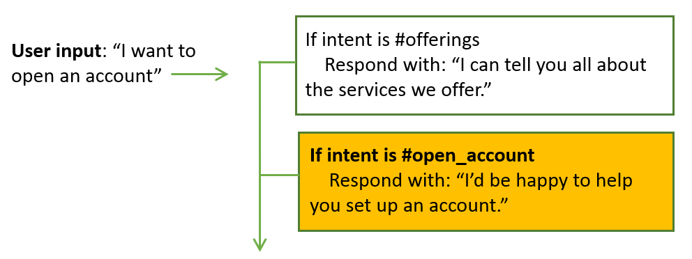

---

copyright:
  years: 2015, 2019
lastupdated: "2019-02-21"

subcollection: assistant

---

{:shortdesc: .shortdesc}
{:new_window: target="_blank"}
{:deprecated: .deprecated}
{:important: .important}
{:note: .note}
{:tip: .tip}
{:pre: .pre}
{:codeblock: .codeblock}
{:screen: .screen}
{:javascript: .ph data-hd-programlang='javascript'}
{:java: .ph data-hd-programlang='java'}
{:python: .ph data-hd-programlang='python'}
{:swift: .ph data-hd-programlang='swift'}

# Assistenten
{: #assistants}

Ein Assistent ist ein kognitiver Bot, den Sie an Ihre Geschäftsanforderungen anpassen und in mehreren Kanälen bereitstellen können, um Ihren Benutzern kontextbezogene Unterstützung anzubieten.
{: shortdesc}

 Beim Anpassen des Assistenten fügen Sie die erforderlichen Skills hinzu, um die Anforderungen Ihrer Kunden zu erfüllen.

Fügen Sie einen Dialogskill hinzu, der auf Fragen oder Anliegen reagieren kann, für die Ihre Kunden häufig Hilfe benötigen. Stellen Sie Informationen für die Themen oder Tasks bereit, zu denen Ihre Benutzer Fragen stellen, unter Berücksichtigung der häufig verwendeten Wortlaute für diese Fragen. Der Service erstellt ein dynamisches Modell für maschinelles Lernen, das auf diese und ähnliche Benutzeranfragen abgestimmt ist.

| Dialogbaumstruktur | Grafische Benutzerschnittstelle |
|-------------|-------------------------:|
| Mithilfe von Grafiktools können Sie einen Dialog erstellen, den Ihr Assistentenmodul bei der Interaktion mit Ihren Benutzern verwenden kann. Dieser Dialog simuliert einen Datenaustausch mit den Benutzern. Der Dialog berücksichtigt häufig geäußerte Kundenfragen, die Sie in den Dialog eingefügt haben, und liefert hilfreiche Antworten. |  |

Der Dialogskill wird in Textform definiert, aber Sie können ihn in den Watson-Service 'Speech to Text' und 'Text to Speech' integrieren, damit Ihre Benutzer verbal mit dem Assistenten interagieren können.

 Für den schnellen Einstieg können Sie vordefinierte Trainingsdaten zu Ihrem Dialogskill hinzufügen, damit Ihr Assistent ohne großen Aufwand beginnen kann, Ihre Kunden bei grundlegenden Fragen zu unterstützen.

 Der Assistent ist ein vollständig per Hosting bereitgestellter Bot, der von {{site.data.keyword.cloud_notm}} verwaltet wird, d. h. Sie müssen sich nicht um das Einrichten der zugehörigen Infrastruktur kümmern.

| Integrationen      | Kanäle    |
|--------------------|:----------|
| Sie können den Assistenten mit wenigen Schritten in mehreren Schnittstellen bereitstellen (dazu gehören bestehende Nachrichtenkanäle wie Slack und Facebook Messenger). Alternativ können Sie direkte Aufrufe an die zugrunde liegenden APIs absetzen, um eine angepasste Anwendung zu entwickeln, die den Assistenten beinhaltet. |  |

Informationen zum Einstieg finden Sie unter [Assistent erstellen](/docs/services/assistant?topic=assistant-assistant-add).
