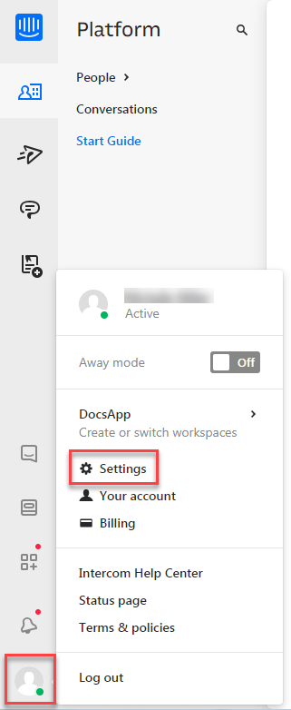

---

copyright:
  years: 2015, 2019
lastupdated: "2019-02-12"

subcollection: assistant

---

{:shortdesc: .shortdesc}
{:new_window: target="_blank"}
{:deprecated: .deprecated}
{:important: .important}
{:note: .note}
{:tip: .tip}
{:pre: .pre}
{:codeblock: .codeblock}
{:screen: .screen}
{:javascript: .ph data-hd-programlang='javascript'}
{:java: .ph data-hd-programlang='java'}
{:python: .ph data-hd-programlang='python'}
{:swift: .ph data-hd-programlang='swift'}

# Mit Intercom integrieren (nur 
{: #deploy-intercom}

Intercom ist eine Plattform für den Nachrichtenaustausch mit Kunden, die das Geschäftswachstum während der gesamten Lebensdauer durch bessere Kundenbeziehungen fördert.
{: shortdesc}

IBM hat in Intercom einen Partner gefunden, um das Team der Kundenunterstützung durch einen neuen Agenten (eine virtuelle Watson Assistant-Instanz) zu ergänzen. Sie können in Ihren eigenen Assistenten eine Intercom-Anwendung integrieren, um in Ihrer App die nahtlose Weitergabe von Benutzerdialoge zwischen Ihrem Assistenten und Servicemitarbeitern zu ermöglichen. Weitere Informationen zu der Integration finden Sie im [Watson-Blogbeitrag ](https://medium.com/@blakemcgregor/contact-center-post-394dff427c8).

Diese Integration ist nur für Benutzer des Plus- oder des Premium-Plans verfügbar.
{: note}

Wenn Sie den Assistenten mit Intercom integrieren, wird die Intercom-Anwendung zur kundenorientierten Anwendung für Ihren Dialogskill. Alle Interaktionen mit Benutzern werden von Intercom eingeleitet und verwaltet.

Es gibt derzeit keine Möglichkeit, einen laufenden Dialog von einem Integrationskanal an einen anderen zu übergeben.

## Einmalige Agentenerstellung
{: #deploy-intercom-account-prereq}

Diese vorausgesetzten Schritte müssen einmal von Ihnen oder einem Mitarbeiter Ihrer Organisation ausgeführt werden, bevor Sie die Intercom-Integration zu Ihrem Assistenten hinzufügen.

1.  Erstellen Sie ein funktionales E-Mail-Konto für Ihren Assistenten.

    Jeder Assistent muss über eine gültige E-Mail-Adresse verfügen, damit er zu einem Team in Intercom hinzugefügt werden kann.
1.  Fügen Sie über Ihren Intercom-Arbeitsbereich den Assistenten als neuen Agenten zu Ihrem Team hinzu.

    Rufen Sie die Seite mit Einstellungen für Teammitglieder in Ihrem Intercom-Arbeitsbereich auf, laden Sie den Assistenten als neuen Agenten ein, indem Sie die im vorherigen Schritt erstellte E-Mail-Adresse im Einladungsfeld hinzufügen. 

    Falls noch kein Intercom-Arbeitsbereich eingerichtet ist, erstellen Sie einen Arbeitsbereich unter [www.intercom.com ](https://www.intercom.com). Sie benötigen mindestens ein Abonnement für das Produkt *Inbox* von Intercom, damit Sie einen Arbeitsbereich erstellen können.

1.  Suchen Sie im E-Mail-Konto des Assistenten, das Sie zuvor erstellt haben, die Einladung von Intercom. Klicken Sie auf den Link in der E-Mail-Nachricht, um dem Team beizutreten. Registrieren Sie die funktionale E-Mail-Adresse des Assistenten und treten Sie danach dem Team bei. 

1.  **Optional**: Aktualisieren Sie das Profil für Ihren Assistenten.

    Sie können den Namen und das Profilbild für Ihren Assistenten bearbeiten. Dieses Profil stellt den Assistenten innerhalb der privaten Kommunikation in Ihrem Arbeitsbereich sowie in öffentlichen Interaktionen mit Kunden über Ihre Intercom-Apps dar. Erstellen Sie ein Profil, das Ihrer Marke entspricht. 

    Klicken Sie auf das Intercom-Profilsymbol in der Navigationsleiste, um die Einstellungen für das Profil und den Arbeitsbereich aufzurufen.

    

## Dialogmodul vorbereiten
{: #deploy-intercom-dialog-prereq}

Führen Sie die folgenden Schritte in Ihrem Dialogskill aus, damit der Assistent Benutzeranfragen verarbeiten und den Dialog an einen Servicemitarbeiter weiterleiten kann, wenn der Kunde dies wünscht.

1.  Fügen Sie eine Absicht zu Ihrem Skill hinzu, die erkennen kann, ob ein Kunde mit einem Servicemitarbeiter sprechen möchte.

    Sie können eine eigene Absicht erstellen oder die vordefinierte Absicht mit dem Namen `#General_Connect_to_Agent` hinzufügen, die in dem von IBM entwickelten Inhaltskatalog **General** bereitgestellt wird.

1.  Fügen Sie einen Stammknoten zu Ihrem Dialogmodul hinzu, der sich auf die Absicht bezieht, die Sie im vorherigen Schritt erstellt haben. Wählen Sie den Antworttyp **Servicemitarbeiter kontaktieren** aus.

1.  Richten Sie das Dialogmodul so ein, dass jede Dialogmodulverzweigung vom Assistenten über die Intercom-App ausgelöst wird.

    Jeder Stammknoten des Dialogmoduls (auch Stammknoten in Ordnern) kann von dem Assistenten verarbeitet werden, solange der Assistent als Intercom-Teammitglied agiert. Sie geben später beim Konfigurieren der Intercom-Integration an, welche Aktion der Assistent für jede Verzweigung des Dialogmoduls ausführen soll. Daher ist es zwar nicht möglich, einen Knoten in Intercom auszublenden, aber Sie können den Assistenen so konfigurieren, dass keine Aktion erfolgt, wenn der Knoten ausgelöst wird.

    Füllen Sie die folgenden Felder für den Stammknoten jeder Dialogmodulverzweigung aus: 

    - **Knotenname**: Ordnen Sie dem Knoten einen Namen zu. An diesem Namen können Sie den Knoten später beim Konfigurieren von Interaktionen erkennen. Wenn Sie keinen Namen hinzufügen, müssen Sie den Knoten stattdessen anhand der zugehörigen Knoten-ID auswählen. 
    - **Externer Knotenname**: Fügen Sie eine kurze Beschreibung für den Zweck der Dialogverzweigung hinzu. Beispiel: *Filiale finden*.

      Diese Informationen werden für andere Agenten im Team des Assistenten angezeigt, wenn der Assistent anbietet, eine Benutzeranfrage zu beantworten. Wenn mehr als ein Dialogmodulknoten für die Beantwortung der Anfrage infrage kommt, stellt der Assistent eine Liste der Antwortoptionen für Teammitglieder des Agenten bereit, um ihre Empfehlung einer geeigneten Antwort einzuholen.

      

      Fügen Sie **keinen** externen Knotennamen für den Stammknoten hinzu, den Sie in Schritt 2 erstellt haben. Beim Auftreten einer Eskalation prüft der Service den externen Knotennamen des zuletzt verarbeiteten Knotens, um zu ermitteln, welches Benutzerziel nicht erreicht wurde. Wenn Sie einen externen Knotennamen im Knoten für die Absicht zum Kontaktieren eines Servicemitarbeiters angeben, kann nicht ermittelt werden, mit welchem realen, zielorientierten Knoten der Benutzer vor dem Eskalieren des Problems zuletzt interagiert hat. {: tip}

1.  Wenn sich ein untergeordneter Knoten in der Verzweigung auf eine nachfolgende Anfrage oder Frage bezieht, die nicht vom Assistenten verarbeitet werden soll, fügen Sie einen Antworttyp **Servicemitarbeiter kontaktieren** zu dem Knoten hinzu. 

    Angenommen, Sie möchten diesen Antworttyp zu Knoten für sensible Probleme hinzufügen, die nur von einem Servicemitarbeiter bearbeitet werden können oder die überwachen sollen, ob ein Assistent die Intention eines Benutzers mehrmals nicht erkennen kann.

    Wenn das Dialogmodul während der Ausführung diesen untergeordneten Knoten erreicht, wird der Dialog an diesem Punkt an einen Servicemitarbeiter übergeben. Sie können später beim Einrichten der Intercom-Integration einen Servicemitarbeiter als Backup für jede Verzweigung auswählen. 

Ihr Dialogmodul kann nun Ihren Assistenten in Intercom unterstützen. 

## Intercom-Integration hinzufügen
{: #deploy-intercom-add-intercom}

1.  Klicken Sie in der Registerkarte 'Assistenten' auf die entsprechende Kachel, um den Assistenten zu öffnen, den Sie bereitstellen möchten.

1.  Klicken Sie im Abschnitt 'Integrationen' auf **Integration hinzufügen**.

1.  Klicken Sie auf **Intercom**.

    Befolgen Sie die auf dem Bildschirm angezeigten Anweisungen. Die folgenden Abschnitte unterstützen Sie beim Ausführen dieser Schritte.

## Assistenten mit Intercom verbinden
{: #deploy-intercom-connect}

Sobald Sie Intercom die Berechtigung zur Verwendung des Assistenten erteilt haben, wird der Assistent zu einem funktionsfähigen Mitglied des Intercom-Teams.

Servicemitarbeiter können die Zuordnungsregeln von Intercom verwenden, um dem Assistenten Nachrichten zuzuordnen. Diese Regeln können eingehende Dialoge während der Laufzeit automatisch nach bestimmten Kriterien einem Mitglied bzw. einem Eingangskorb des Teams zuordnen oder festlegen, dass ein Servicemitarbeiter die Zuordnung manuell vornimmt. Weitere Informationen enthält die [Intercom-Dokumentation ](https://www.intercom.com/help/support-and-retain-customers/work-as-a-team/assign-conversations-to-teammates-and-teams).

1.  Wenn Ihr Dialogmodul eingerichtet ist, klicken Sie auf **Jetzt verbinden**.
1.  Klicken Sie auf **Intercom aufrufen**, um zur Intercom-Website weitergeleitet zu werden.

     Melden Sie sich bei Intercom mit der funktionalen E-Mail-Adresse des Assistenten und dem zugehörigen Kennwort an (nicht mit Ihren Zugangsdaten). Die Verbindung soll mit einer funktionalen ID hergestellt werden, die von mehreren Personen in Ihrem Unternehmen gemeinsam genutzt werden kann.{: important}

1.  Klicken Sie auf **Zugriff berechtigen**.
1.  Klicken Sie auf **Zurück zur Übersicht**.

Der Assistent kann nun Zuordnungen von Intercom-Teammitgliedern empfangen. Falls noch nicht geschehen, sollten Sie jetzt Ihr [Dialogmodul einrichten](#deploy-intercom-dialog-prereq).
{: important}

## Nachrichtenrouting konfigurieren
{: #deploy-intercom-config-backup}

Ordnen Sie Servicemitarbeiter zu, die als Backup dienen sollen, wenn der virtuelle Assistent einen aktiven Dialog an einen Mitarbeiter übergeben muss. Sie können für jede Dialogmodulverzweigung ein anderes Team oder Teammitglied als Backup auswählen.

So richten Sie Routingzuordnungen für Eskalationen vom virtuellen Assistenten auf einen Servicemitarbeiter ein:

1.  Klicken Sie auf der Seite für Intercom-Integration auf **Mein Dialogskill is bereit**, um zu bestätigen, dass Ihr Dialogmodul vorbereitet ist.

    Klicken Sie erst auf diese Schaltfläche, nachdem Sie die in [Dialogmodul vorbereiten](#deploy-intercom-dialog-prereq) beschriebenen Schritte abgeschlossen haben.
    {: important}

1.  Klicken Sie im Abschnitt *Einstellungen* auf **Regeln verwalten**.

    Wenn Sie keine Änderungen vornehmen, wird für alle Knoten kein Backup-Ansprechpartner zugeordnet. 

1.  Klicken Sie auf **Neue Regel**.

1.  Wählen Sie in der Dropdown-Liste *Knoten auswählen* den Knoten der Dialogmodulverzweigung aus, die Sie konfigurieren möchten.

    Beachten Sie, dass Verzweigungen anhand des zugehörigen Knotennamens identifiziert werden können. Wenn Sie keinen Knotennamen angegeben haben, wird stattdessen die Knoten-ID angezeigt.

1.  Wählen Sie das Team oder Teammitglied der Servicemitarbeiter aus, das als Backup-Ansprechpartner für diese Dialogmodulverzweigung verwendet werden soll. Die Benutzeranfrage wird an diese Person eskaliert, wenn der virtuelle Assistent die Anfrage nicht beantworten kann oder einen untergeordneten Knoten mit dem Antworttyp *Servicemitarbeiter kontaktieren* erreicht, der darauf hinweist, dass die Anfrage nur von einem Menschen beantwortet werden kann. 

1.  Um Routing-Regeln für andere Dialogmodulverzweigungen zu definieren, klicken Sie erneut auf **Neue Regel** und wiederholen Sie die vorherigen Schritte.

    Übergehen Sie nicht das Einrichten einer Zuordnung für alle Stammknoten, die den Antworttyp *Servicemitarbeiter kontaktieren* in einem untergeordneten Knoten der zugehörigen Verzweigung aufweisen. Wenn Sie den zugehörigen Stammknoten nicht auf eine bestimmte Person oder ein bestimmtes Team übertragen, kann es vorkommen, dass sensible Daten in einen *nicht zugewiesenen* Eingangskorb übertragen werden.

1.  Klicken Sie nach dem Hinzufügen von Regeln auf **Zurück zur Übersicht**, um die Seite zu verlassen.

## Assistenten zum Überwachen und Beantworten von Benutzeranfragen berechtigen
{: #deploy-intercom-config-action}

Wenn der Assistent einen Intercom-Eingangskorb überwachen und Nachrichten eigenständig beantworten soll, aktivieren Sie die Überwachung.

Der Assistent überwacht Benutzeranfragen, sobald sie in Intercom registriert werden. Wenn der Assistent eine Benutzeranfrage als beantwortbar einstuft, wird die Antwort direkt an den Benutzer übermittelt. (Der Assistent stuft eine Anfrage als beantwortbar ein, wenn die vom Service ermittelte übergeordnete Absicht einen Konfidenzwert von 0,75 oder höher aufweist.)

Wenn bestimmte Arten von Benutzeranfragen nicht vom Assistenten beantwortet werden sollen, können Sie Regeln hinzufügen, die bewirken, dass der Assistent für einzelne Dialogmodulverzweigungen andere Aktionen ausführt. Angenommen, Sie bevorzugen eine konservative Integration des Assistenten in das Intercom-Team, d. h. der Assistent soll beim Übertragen von Nachrichten nur Antworten vorschlagen und die Beantwortung den Teammitgliedern überlassen. Wenn sich der Assistent im Laufe der Zeit als zuverlässig erweist, können Sie ihm mehr Verantwortung übertragen. 

So definieren Sie Regeln, um die Bearbeitung bestimmter Dialogmodulverzweigungen durch den Assistenten zu konfigurieren: 

1.  Rufen Sie die Seite für Intercom-Integration auf und geben Sie im Abschnitt *Eingangskorbüberwachung für Assistent aktivieren* den Wert **Ein** für die Überwachung an.

1.  Klicken Sie unter *Einstellungen* auf **Regeln verwalten**.

    Wenn Sie keine Regeln definieren, überwacht der Assistent den Eingangskorb *Nicht zugewiesen* und beantwortet Benutzeranfragen automatisch, die als beantwortbar eingestuft werden.

1.  Wählen Sie im Feld *Intercom-Eingangskorb überwachen* aus, welcher Intercom-Eingangskorb vom Assistenten überwacht werden soll.

1.  Klicken Sie auf **Neue Regel**, um ein eindeutiges Interaktionsmuster für eine bestimmte Dialogmodulverzweigung zu definieren.

1.  Wählen Sie in der Dropdown-Liste *Knoten auswählen* den Knoten für die Verzweigung aus, die Sie konfigurieren möchten. 

    Beachten Sie, dass Verzweigungen anhand des zugehörigen Knotennamens identifiziert werden können. Wenn Sie keinen Knotennamen angegeben haben, wird stattdessen die Knoten-ID angezeigt.

1.  Wählen Sie den Typ der Aktion aus, die der Assistent ausführen soll, wenn diese Dialogmodulverzweigung ausgelöst wird. Die folgenden Optionen für Aktionstypen stehen zur Auswahl: 

    - **Keine Aktion**: Der Assistent stellt keine Antwort bereit, d. h. die Nachricht des Benutzers bleibt im Eingangskorb, bis sie auf andere Weise beantwortet wird.
    - **An Team oder Teammitglied senden**: Der Assistent ermittelt das Ziel der Benutzereingabe und übergibt die Eingabe an das zuständige Teammitglied. 
    - **Vorschlag an Team oder Teammitglied**: Der Assistent schlägt dem Teammitglied Antworten vor. Dazu werden über die interne Intercom-App Nachrichten an den Servicemitarbeiter gesendet. 

      - Wenn die Benutzereingabe eine Dialogmodulverzweigung auslöst (d. h. einen Stammknoten des Dialogmoduls mit untergeordneten Knoten, der eine komplexe Interaktion darstellt), gibt der Assistent an, dass er die Anfrage als beantwortbar einstuft und bietet an, sie zu beantworten.
      - Wenn die Benutzereingabe einen Stammknoten ohne untergeordnete Elemente auslöst, leitet der Assistent lediglich die programmierte Antwort von dem Knoten an den Servicemitarbeiter weiter und gibt keine direkte Antwort an den Benutzer zurück.
      - Wenn die Benutzereingabe mit hoher Konfidenz mehr als einen Dialogmodulknoten auslöst, gibt der Assistent eine Liste möglicher Antworten an den Servicemitarbeiter weiter und bittet das Teammitglied, die beste Antwort auszuwählen.

      In jedem dieser Fälle entscheidet der Servicemitarbeiter, ob der Assistent die Beantwortung übernehmen soll. 

    - **Beantworten**: Der Assistent sendet die Antwort direkt an den Benutzer, ohne mit einem anderen Teammitglieder Rücksprache zu halten.

    Für jeden Knoten, dem Sie den Aktionstyp *An Team oder Teammitglied senden* oder *Vorschlag an Team oder Teammitglied* zuordnen, ist die Beteiligung eines Servicemitarbeiters erforderlich. Fügen Sie unbedingt eine Regel hinzu, um die richtige Person als Backup für diesen bestimmten Dialogmodulknoten zuzuweisen.

1.  Um eindeutige Interaktionseinstellungen für andere Dialogmodulverzweigungen zu definieren, klicken Sie erneut auf **Neue Regel** und wiederholen Sie die vorherigen Schritte.

1.  Klicken Sie nach dem Hinzufügen von Regeln auf **Zurück zur Übersicht**, um die Seite zu verlassen.

Im Verlauf der Bearbeitung Ihres Dialogmoduls wird gegebenenfalls die Seite für Intercom-Integration erneut angezeigt, auf der Sie die Regeln optimieren können. 

## Integration testen
{: #deploy-intercom-try}

Zur Durchführung effektiver und umfassender Testprozesse für Ihre Intercom-Integration benötigen Sie Zugriff auf eine Intercom-Endbenutzeranwendung. Sie haben bereits einen Intercom-Arbeitsbereich erstellt oder bearbeitet. Dem Arbeitsbereich muss eine Clientbenutzerschnittstelle zugeordnet sein. Wenn dies nicht der Fall ist, finden Sie entsprechende Informationen unter [Apps in Intercom ](https://www.intercom.com/help/apps-in-intercom){: new_window}.

Übergeben Sie Testbenutzeranfragen über eine Clientanwendung, um zu prüfen, wie die Nachrichten von Intercom verarbeitet werden. Überprüfen Sie, dass für Nachrichten, die vom virtuellen Assistenten beantwortet werden sollen, die entsprechenden Antworten generiert werden, und dass der Assistent nur die entsprechend konfigurierten Nachrichten beantwortet. 

## Hinweise zu Dialogen
{: #deploy-intercom-dialog}

Manche der erweiterten Nachrichten, die Sie zu einem Dialogmodul hinzufügen, werden in der Anzeige 'Ausprobieren' anders angezeigt als für Intercom-Benutzer. In der nachfolgenden Tabelle wird beschrieben, wie die Antworttypen von Intercom behandelt werden.

| Antworttyp | Anzeige für Intercom-Benutzer |
|---------------|---------------------------|
| **Option**    | Die Optionen werden als nummerierte Liste angezeigt. Das Feld **title** oder **description** enthält Anweisungen, wie der Benutzer eine Option aus der Liste auswählen kann.|
| **Bild**     | Der Titel (Feld **title**) und die Beschreibung (Feld **description**) des Bilds sowie das Bild selbst werden angezeigt.|
| **Pause**     | Unabhängig davon, ob Sie dies aktivieren oder nicht, wird während der Unterbrechung kein Eingabeanzeiger angezeigt.|

Weitere Informationen zu Antworttypen enthält der Abschnitt [Erweiterte Antworten](/docs/services/assistant?topic=assistant-dialog-overview#dialog-overview-multimedia).
