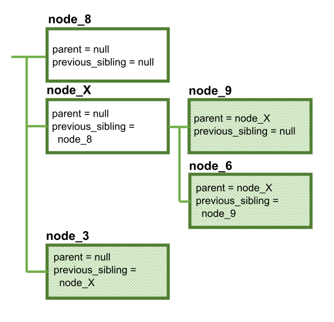

---

copyright:
  years: 2015, 2018
lastupdated: "2018-01-26"

---

{:shortdesc: .shortdesc}
{:new_window: target="_blank"}
{:tip: .tip}
{:pre: .pre}
{:codeblock: .codeblock}
{:screen: .screen}
{:javascript: .ph data-hd-programlang='javascript'}
{:java: .ph data-hd-programlang='java'}
{:python: .ph data-hd-programlang='python'}
{:swift: .ph data-hd-programlang='swift'}

# Dialogmodul mithilfe der API ändern

Die REST-API von {{site.data.keyword.conversationshort}} unterstützt die programmgesteuerte Änderung von Dialogmodulen ohne Verwendung des {{site.data.keyword.conversationshort}}-Tools. Mit der API '/dialog_nodes' können Sie Dialogmodulknoten erstellen, löschen oder ändern.

Denken Sie daran, dass es sich bei einem Dialogmodul um eine Baumstruktur von vernetzten Knoten handelt, die bestimmte Regeln einhalten muss, damit sie gültig ist. Dies bedeutet, dass Änderungen, die Sie an einem Dialogmodulknoten vornehmen, Auswirkungen auf andere Knoten oder auf die Struktur Ihres Dialogmoduls nach sich ziehen können. Beschäftigen Sie sich daher unbedingt damit, wie Ihre Änderungen den Rest des Dialogmoduls beeinflussen, bevor Sie Ihr Dialogmodul mithilfe der API '/dialog_nodes' ändern. Sie können eine Sicherungskopie des aktuellen Dialogmoduls erstellen, indem Sie den Arbeitsbereich exportieren, in dem sich das Dialogmodul befindet. Details finden Sie im Abschnitt [Arbeitsbereiche exportieren und kopieren](configure-workspace.html#exporting-and-copying-workspaces).

Ein gültiges Dialogmodul erfüllt immer die folgenden Kriterien:

- Jeder Dialogmodulknoten besitzt eine eindeutige ID (Eigenschaft `dialog_node`).
- Jeder untergeordnete Knoten kennt seinen übergeordneten Knoten (Eigenschaft `parent`). Ein übergeordneter Knoten kennt jedoch nicht seine untergeordneten Knoten.
- Ein Knoten kennt, sofern vorhanden, seinen unmittelbar vorhergehenden gleichgeordneten Knoten (Eigenschaft `previous_sibling`). Dies bedeutet, dass alle gleichgeordneten Knoten desselben übergeordneten Knotens eine verkettete Liste bilden, in der jeder Knoten auf den vorherigen Knoten verweist.
- Nur ein einziger untergeordneter Knoten eines bestimmten übergeordneten Knotens kann der erste gleichgeordnete Knoten sein (hat also die Eigenschaft `previous_sibling` mit dem Wert 'null').
- Ein Knoten kann nicht auf einen vorherigen gleichgeordneten Knoten verweisen, der ein untergeordneter Knoten eines anderen übergeordneten Knotens ist.
- Zwei Knoten können nicht auf denselben vorherigen gleichgeordneten Knoten verweisen.
- Ein Knoten kann einen anderen Knoten angeben, der als Nächstes auszuführen ist (Eigenschaft `next_step`).
- Ein Knoten kann nicht sein eigener übergeordneter oder gleichgeordneter Knoten sein.
- Ein Knoten muss eine Typeigenschaft haben, die einen der folgenden Werte enthält. Wenn keine Typeigenschaft angegeben ist, wird der Typ `standard` verwendet.

  - `event_handler`: Ein Handler, der für einen Frameknoten oder einen einzelnen Slotknoten definiert ist.

    Mit dem Tool können Sie einen Handler für Frameknoten definieren, indem Sie auf den Link **Handler verwalten** für einen Knoten mit Slots klicken. (Die Benutzerschnittstelle des Tools macht den Ereignishandler der Slotebene nicht zugänglich, aber Sie können über die API einen Ereignishandler definieren.

  - `frame`: Ein Knoten mit mindestens einem untergeordneten Knoten des Typs `slot`. Alle untergeordneten Slotknoten, die erforderlich sind, müssen gefüllt werden, bevor der Service den Frameknoten beenden kann.

    Der Frameknotentyp wird im Tool als Knoten mit Slots dargestellt. Der Knoten, in dem die Slots enthalten sind, wird als Frameknotentyp dargestellt (type=`frame`). Er ist der übergeordnete Knoten für jeden Slot, der als untergeordneter Knoten des Typs `slot` dargestellt wird.

  - `response_condition`: Eine bedingte Antwort.

    Im Tool können Sie eine oder mehrere bedingte Antworten zu einem Knoten hinzufügen. Jede bedingte Antwort, die Sie definieren, wird im zugrunde liegenden JSON-Code als einzelner Knoten des Typs 'Antwortbedingung' (type=`response_condition`) dargestellt.

  - `slot`: Ein untergeordneter Knoten eines Knotens mit dem Typ `frame`.

    Dieser Knotentyp wird im Tool als einer von mehreren Slots dargestellt, die zu einem einzelnen Knoten hinzugefügt wurden. Dieser einzelne Knoten wird im JSON-Code als übergeordneter Knoten des Typs `frame` dargestellt.

  - `standard`: Ein typischer Dialogmodulknoten. Dies ist der Standardtyp.

- Bei Knoten des Typs `slot`, die demselben übergeordneten Knoten zugeordnet sind, legt die Reihenfolge der gleichgeordneten Knoten (angegeben durch die Eigenschaft `previous_sibling`) fest, in welcher Reihenfolge die Slots verarbeitet werden.
- Ein Knoten des Typs `slot` muss über einen übergeordneten Knoten des Typs `frame` verfügen.
- Ein Knoten des Typs `frame` muss über mindestens einen untergeordneten Knoten des Typs `slot` verfügen.
- Ein Knoten des Typs `response_condition` muss über einen übergeordneten Knoten des Typs `standard` oder `frame` verfügen.
- Knoten des Typs `response_condition` und `event_handler` können keine untergeordneten Knoten besitzen.
- Ein Knoten des Typs `event_handler` muss zusätzlich über eine Eigenschaft `event_name` verfügen, die einen der folgenden Werte enthält, um den Typ des Knotenereignisses anzugeben:

  - `filled`: Definiert die nächsten Schritte, wenn ein Benutzer einen Wert angibt, der die im Feld *Überprüfen auf* eines Slots angegebene Bedingung erfüllt, wenn der Slot gefüllt ist. Ein Handler mit diesem Namen ist nur vorhanden, wenn für den Slot eine Bedingung für 'Gefunden' definiert ist.
  - `focus`: Definiert die Frage, die angezeigt wird, um den Benutzer zum Eingeben der für den Slot benötigten Information aufzufordern. Ein Handler mit diesem Namen ist nur  vorhanden, wenn der Slot erforderlich ist.
  - `generic`: Definiert eine zu überwachende Bedingung, die abweichende Fragen verarbeiten kann, die Benutzer beim Füllen eines Slots oder eines Knotens mit Slots möglicherweise stellen könnten.
  - `input`: Aktualisiert den Nachrichtenkontext und fügt eine Kontextvariable mit dem beim Benutzer abgefragten Wert ein, um den Slot zu füllen. Ein Handler mit diesem Namen muss für jeden Slot im Frameknoten vorhanden sein.
  - `nomatch`: Definiert die nächsten Schritte, wenn die Benutzerantwort für die Abfrage des Slots keinen gültigen Wert enthält. Ein Handler mit diesem Namen ist nur vorhanden, wenn für den Slot eine Bedingung für 'Nicht gefunden' definiert ist.

  Das folgende Diagramm zeigt, an welcher Position in der Benutzerschnittstelle des Tools der Code definiert wird, der für jedes benannte Ereignis ausgelöst wird.

  

- Ein Knoten des Typs `event_handler` mit dem Ereignisnamen `generic` kann ein übergeordnetes Element des Typs `slot` oder `frame` aufweisen.
- Ein Knoten des Typs `event_handler` mit dem Ereignisnamen `focus`, `input`, `filled` oder `nomatch` muss ein übergeordnetes Element des Typs `slot` aufweisen.
- Wenn zwei oder mehr Ereignishandler mit demselben Ereignisnamen demselben übergeordneten Knoten zugeordnet sind, legt die Reihenfolge der gleichgeordneten Elemente fest, in welcher Reihenfolge die Ereignishandler ausgeführt werden.
- Bei Knoten des Typs `event_handler`, die demselben übergeordneten Knoten mit Slots zugeordnet sind, bleibt die Ausführungsreihenfolge gleich (unabhängig von der Platzierung der Knotendefinitionen). Die Ereignisse werden in der Reihenfolge der Ereignisnamen ausgelöst.

  1. focus
  1. input
  1. filled
  1. generic*
  1. nomatch

  *Wenn ein `event_handler` mit dem Ereignisnamen `generic` für diesen Slot oder für den übergeordneten Frame definiert ist, wird er für die gefüllten Ereignishandlerknoten und die Ereignishandlerknoten des Typs 'nomatch' ausgeführt.

Die folgenden Beispiele zeigen, wie verschiedene Änderungen in der Folge zu nachgelagerten Änderungen führen können.

## Knoten erstellen
{: #create-node}

Als Beispiel wird die folgende Baumstruktur eines einfachen Dialogmoduls zugrunde gelegt:


Ein neuer Knoten kann durch Absetzen einer Anforderung POST für '/dialog_nodes' mit dem folgenden Hauptteil erstellt werden:

```json
{
  "dialog_node": "node_8"
}
```

Das Dialogmodul sieht danach wie folgt aus:


Da der Knoten **node_8** ohne Angabe eines Wertes für `parent` oder `previous_sibling` erstellt wurde, ist er jetzt der erste Knoten im Dialogmodul. Der Service hat aber nicht nur den Knoten **node_8** erstellt, sondern auch den Knoten **node_1** so geändert, dass seine Eigenschaft `previous_sibling` auf den neuen Knoten verweist.

Durch die Angabe des übergeordneten und des vorherigen gleichgeordneten Knotens können Sie einen Knoten an einer beliebigen anderen Stelle im Dialogmodul erstellen:

```json
{
  "dialog_node": "node_9",
  "parent": "node_2",
  "previous_sibling": "node_5"
}
```

Die Werte, die Sie für `parent` und `previous_node` angeben, müssen gültig sein:

- Beide Werte müssen vorhandene Knoten referenzieren.
- Der angegebene übergeordnete Knoten muss derselbe Knoten wie der übergeordnete Knoten des vorherigen gleichgeordneten Knoten sein (bzw. `null`, falls der vorherige gleichgeordnete Knoten keinen übergeordneten Knoten besitzt).
- Das übergeordnete Element darf kein Knoten des Typs `response_condition` oder `event_handler` sein.

Anschließend sieht das Dialogmodul so aus:


Der Service hat nicht nur den Knoten **node_9**  erstellt, sondern auch die Eigenschaft `previous_sibling` des Knotens *node_6* so aktualisiert, dass sie auf den neuen Knoten verweist.

## Knoten zu einem anderen übergeordneten Knoten verschieben
{: #change-parent}

Der Knoten **node_5** soll jetzt zu einem anderen übergeordneten Knoten verschoben werden. Hierzu wird die Methode POST für '/dialog_nodes/node_5' mit dem folgenden Hauptteil übergeben:

```json
{
  "parent": "node_1"
}
```

Der angegebene Wert für `parent` muss gültig sein:
- Er muss einen vorhandenen Knoten referenzieren.
- Er darf nicht den Knoten referenzieren, der geändert wird (weil ein Knoten nicht sein eigenes übergeordnetes Element sein kann).
- Er darf nicht ein untergeordnetes Element des Knotens referenzieren, der geändert wird.
- Er darf keinen Knoten des Typs `response_condition` oder `event_handler` referenzieren.

Dies hat die folgende geänderte Struktur zum Ergebnis:


Diese Änderung hatte mehrere Dinge zur Folge:
- Als der Knoten **node_5** zu seinem neuen übergeordneten Knoten verschoben wurde, wurde gleichzeitig auch der Knoten **node_7** verschoben (weil sich der Wert der Eigenschaft `parent` des Knotens **node_7** nicht geändert hat). Wenn Sie einen Knoten verschieben, bleiben alle untergeordneten Elemente dieses Knotens ihm weiterhin zugeordnet.
- Da für die Eigenschaft `previous_sibling` des Knotens **node_5** kein Wert angegeben wurde, ist dieser Knoten jetzt der erste gleichgeordnete Knoten unter dem Knoten **node_1**.
- Die Eigenschaft `previous_sibling` des Knotens **node_4** wurde mit dem Wert `node_5` aktualisiert.
- Die Eigenschaft `previous_sibling` des Knotens **node_9** wurde mit dem Wert `null` aktualisiert, weil es sich bei diesem Knoten jetzt um den ersten gleichgeordneten Knoten unter dem Knoten **node_2** handelt.

## Reihenfolge von gleichgeordneten Knoten ändern
{: #change-sibling}

Jetzt soll der Knoten **node_5** vom ersten zum zweiten gleichgeordneten Knoten gemacht werden. Hierzu wird die Methode POST für '/dialog_nodes/node_5' mit dem folgenden Hauptteil verwendet:

```json
{
  "previous_sibling": "node_4"
}
```

Wenn Sie die Eigenschaft `previous_sibling` ändern, muss der neue Wert gültig sein:
- Er muss einen vorhandenen Knoten referenzieren.
- Er darf nicht den Knoten referenzieren, der geändert wird (weil ein Knoten nicht sein eigenes gleichgeordnetes Element sein kann).
- Er muss ein übergeordnetes Element desselben übergeordneten Knotens referenzieren (alle gleichgeordneten Elemente müssen dasselbe übergeordnete Element besitzen).

Die Struktur ändert sich folgendermaßen:


Auch hier bleib der Knoten **node_7** seinem übergeordneten Knoten zugeordnet. Außerdem wird der Knoten **node_4** so geändert, dass seine Eigenschaft `previous_sibling` den Wert `null` hat, weil er jetzt der erste gleichgeordnete Knoten ist.

## Knoten löschen
{: #delete-node}

Als Nächstes soll der Knoten **node_1** mit der Methode DELETE für '/dialog_nodes/node_1' gelöscht werden.

Hierdurch wird das folgende Ergebnis erzielt:


Die Knoten **node_1**, **node_4**, **node_5** und **node_7** wurden sämtlich gelöscht. Wenn Sie einen Knoten löschen, werden auch alle ihm untergeordneten Knoten gelöscht. Wenn Sie einen Stammknoten löschen, wird damit tatsächlich eine ganze Verzweigung in der Baumstruktur des Dialogmoduls gelöscht. Alle anderen Referenzen auf den gelöschten Knoten (z. B. Referenzen in `next_step`) werden in `null` geändert.

Darüber hinaus wurde durch diese Aktion der Knoten **node_2** aktualisiert und verweist nun auf den Knoten **node_8** als seinen neuen vorherigen gleichgeordneten Knoten.

## Knoten umbenennen
{: #rename-node}

Zum Schluss soll der Knoten **node_2** unter Verwendung der Methode POST für '/dialog_nodes/node_2' mit dem folgenden Hauptteil umbenannt werden:

```json
{
  "dialog_node": "node_X"
}
```



Die Struktur des Dialogmoduls hat sich hierdurch zwar nicht geändert, aber auch in diesem Fall wurden mehrere Knoten geändert, um den neuen Namen widerzuspiegeln:

- Die Eigenschaften `parent` der Knoten **node_9** und **node_6** wurden geändert.
- Die Eigenschaft `previous_sibling` des Knotens **node_3** wurde geändert.

Alle anderen Referenzen auf den gelöschten Knoten (z. B. Referenzen in `next_step`) wurden ebenfalls geändert.
