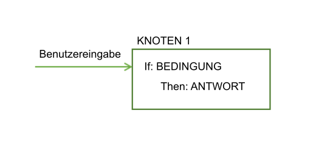
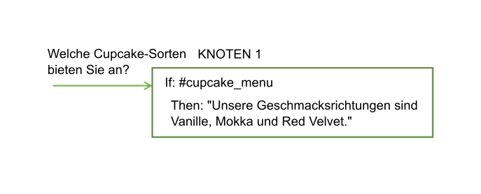
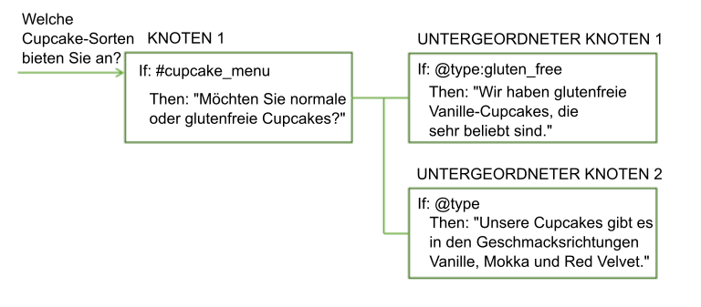
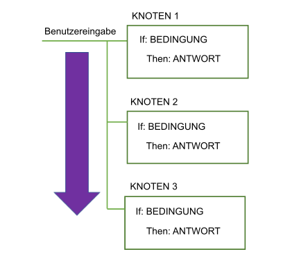
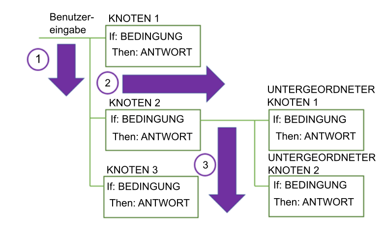

---

copyright:
  years: 2015, 2018
lastupdated: "2018-02-09"

---

{:shortdesc: .shortdesc}
{:new_window: target="_blank"}
{:tip: .tip}
{:pre: .pre}
{:codeblock: .codeblock}
{:screen: .screen}
{:javascript: .ph data-hd-programlang='javascript'}
{:java: .ph data-hd-programlang='java'}
{:python: .ph data-hd-programlang='python'}
{:swift: .ph data-hd-programlang='swift'}
{:table: .aria-labeledby="caption"}

# Dialogmodule im Überblick
{: #dialog-overview}

Das Dialogmodul verwendet die Absichten und Entitäten, die in der Benutzereingabe angegeben sind, sowie Kontext aus der Anwendung, um mit dem Benutzer zu interagieren und letztendlich eine sinnvolle Antwort zu liefern.
{: shortdesc}

Die Antwort könnte die Antwort auf eine Frage wie beispielsweise `Wo kann ich tanken?` oder die Ausführung eines Befehls sein, z. B. das Einschalten des Radios. Entweder geben die Absicht und die Entität genug Informationen an, damit die korrekte Antwort ermittelt werden kann, oder das Dialogmodul kann vom Benutzer eine weitere Eingabe erfragen, die benötigt wird, um richtig zu antworten. Fragt ein Benutzer beispielsweise `Wo bekomme ich etwas zu essen?`, dann kann es sein, dass geklärt werden muss, ob er beispielsweise ein Restaurant, ein Lebensmittelgeschäft oder einen Take-Away-Imbiss sucht. Sie können weitere Details in einer Textantwort abfragen und einen oder mehrere untergeordnete Knoten erstellen, um die neue Eingabe zu verarbeiten.

<iframe class="embed-responsive-item" id="youtubeplayer" type="text/html" width="640" height="390" src="https://www.youtube.com/embed/oQUpejt6d84?rel=0" frameborder="0" webkitallowfullscreen mozallowfullscreen allowfullscreen> </iframe>

Das Dialogmodul wird im Tool '{{site.data.keyword.conversationshort}}' grafisch als Baumstruktur dargestellt. Erstellen Sie für jede Absicht, die Ihr Dialog verarbeiten soll, eine Verzweigung. Eine Verzweigung besteht aus mehreren Knoten.

## Dialogmodulknoten

Jeder Dialogmodulknoten enthält mindestens eine Bedingung und eine Antwort.



- Bedingung: Gibt die Informationen an, die in der Benutzereingabe für diesen Knoten im Dialogmodul enthalten sein müssen, damit der Knoten ausgelöst wird. Die Informationen können eine bestimmte Absicht, ein Entitätswert oder ein Wert für eine Kontextvariable sein. Weitere Informationen enthält der Abschnitt [Bedingungen](dialog-runtime.html#conditions).
- Antwort: Die verbale Äußerung, mit der der Service dem Benutzer antwortet. Die Antwort kann ebenfalls so konfiguriert werden, dass programmgestützte Aktionen ausgeführt werden. Weitere Informationen enthält der Abschnitt [Antworten](#responses).

Ein Knoten ist mit einer IF-THEN-Konstruktion vergleichbar; falls diese Bedingung zutrifft, wird diese Antwort zurückgegeben.

Der folgende Knoten wird beispielsweise ausgelöst, wenn die Funktion für die Verarbeitung natürlicher Sprache des Service feststellt, dass die Benutzereingabe die Absicht `#cupcake-menu` enthält. Als Ergebnis der Knotenauslösung reagiert der Service mit einer entsprechenden Antwort.



Ein einzelner Knoten mit einer Bedingung und einer Antwort kann einfache Benutzeranforderungen abwickeln. Meistens haben Benutzer jedoch kompliziertere Fragen oder benötigen Hilfe bei komplexeren Aufgaben. Durch das Hinzufügen von untergeordneten Knoten können Sie den Benutzer auffordern, alle weiteren Informationen anzugeben, die der Service benötigt.



## Dialogmodulablauf

Das Dialogmodul, das Sie erstellen, wird durch den Service vom ersten bis zum letzten Knoten nacheinander verarbeitet.



Wenn der Service beim Durcharbeiten der Baumstruktur eine Bedingung findet, die erfüllt ist, löst er den entsprechenden Knoten aus. Anschließend bewegt er sich an dem ausgelösten Knoten entlang, um die Benutzereingabe auf etwaige untergeordnete Knotenbedingungen zu überprüfen. Die Überprüfung der untergeordneten Knoten erfolgt wieder vom ersten bis zum letzten Knoten.

Der Service setzt die Durcharbeitung der Baumstruktur für das Dialogmodul vom ersten bis zum letzten Knoten, entlang aller ausgelösten Knoten, dann vom ersten bis zum letzten untergeordneten Knoten und entlang aller ausgelösten untergeordneten Knoten fort, bis der letzte Knoten in der verfolgten Verzweigung erreicht ist.



Wenn Sie damit beginnen, das Dialogmodul zu erstellen, müssen Sie festlegen, welche Verzweigungen Sie aufnehmen wollen und wo sie platziert sein sollen. Die Reihenfolge der Verzweigungen ist wichtig, da Knoten vom ersten bis zum letzten Knoten ausgewertet werden. Der erste Stammknoten, mit dessen Bedingung die Eingabe übereinstimmt, wird verwendet. Knoten, die in der Baumstruktur unter ihm liegen, werden nicht ausgelöst.

Wenn der Service das Ende einer Verzweigung erreicht oder in der Gruppe der untergeordneten Knoten, die momentan ausgewertet wird keine Bedingung finden kann, die mit 'true' ausgewertet wird, springt er zurück Ausgangsebene der Baumstruktur. Dann beginnt der Service erneut, die Stammknoten vom ersten bis zum letzten Knoten zu verarbeiten. Wenn keine der Bedingungen mit 'true' ausgewertet wird, wird die Antwort vom letzten Knoten der Baumstruktur zurückgegeben, der in der Regel eine Sonderbedingung `anything_else` enthält.

Sie können den standardmäßigen Ablauf (vom ersten bis zum letzten Knoten) unterbrechen, indem Sie anpassen, welche Aktion nach der Verarbeitung eines Knotens ausgeführt wird. Sie können einen Knoten beispielsweise so konfigurieren, dass nach seiner Verarbeitung direkt zu einem anderen Knoten gesprungen wird, selbst wenn sich der andere Knoten in der Baumstruktur weiter oben befindet. Weitere Details finden Sie unter [Nächste Schritte definieren](dialog-overview.html#jump-to).

Ihre Vorgehensweise beim Konfigurieren der Abschweifungseinstellungen für jeden Knoten kann Auswirkungen darauf haben, wie Benutzer während der Laufzeit durch die Knoten navigieren. Wenn Sie abgehende Abschweifungen von den meisten Knoten zulassen, können die Benutzer leichter von einem Knoten zum nächsten und wieder zurück springen. Weitere Informationen enthält der Abschnitt [Abschweifungen](dialog-runtime.html#digressions).

## Bedingungen
{: #conditions}

Ein Knotenbedingung legt fest, ob dieser Knoten im Dialog verwendet wird. Antwortbedingungen bestimmen, welche Antwort für einen Benutzer angezeigt wird.

- [Artefakte für Bedingungen](dialog-overview.html#condition-artifacts)
- [Details zur Bedingungssyntax](dialog-overview.html#condition-syntax)
- [Tipps zur Verwendung von Bedingungen](dialog-overview.html#condition-tips)

### Artefakte für Bedingungen
{: #condition-artifacts}

Zum Definieren einer Bedingung können Sie eines oder mehrere der folgenden Artefakte in einer beliebigen Kombination verwenden:

- **Kontextvariable**: Der Knoten wird verwendet, wenn der Ausdruck der Kontextvariablen, die Sie angeben, mit 'true' ausgewertet wird. Verwenden Sie die Syntax `$variablenname:wert` oder `$variablenname == 'wert'`. Beispiel: `$city:Boston` prüft, ob die Kontextvariable `$city` den Wert `Boston` enthält. Wenn dieser Wert vorhanden ist, wird der Knoten oder die Antwort verarbeitet.

  Verwenden Sie den Wert einer Kontextvariablen nicht zum Definieren einer Knoten- oder Antwortbedingung in demselben Dialogmodulknoten, in dem Sie den Wert der Kontextvariablen festlegen.
  {: tip}

  Weitere Informationen zu Kontextvariablen finden Sie unter [Konextvariablen](dialog-runtime.html#context).

- **Entität**: Der Knoten wird verwendet, wenn ein Wert oder Synonym für die Entität in der Benutzereingabe erkannt wird. Verwenden Sie die Syntax `@entitätsname`. Beispiel: `@city` überprüft, ob Städtenamen, die für die Entität '@city' definiert sind, in der Benutzereingabe erkannt wurden. Wenn dies der Fall ist, wird der Knoten oder die Antwort verarbeitet.

  Erstellen Sie unbedingt einen Peerknoten, der den Fall abwickelt, dass keiner der Werte bzw. keines der Synonyme für die Entität erkannt werden.
  {: tip}

  Weitere Informationen zu Entitäten finden Sie unter [Entitäten definieren](entities.html).

- **Entitätswert**: Der Knoten wird verwendet, wenn der Entitätswert in der Benutzereingabe erkannt wird. Verwenden Sie die Syntax `@entitätsname:wert` und geben Sie einen für die Entität definierten Wert an (kein Synonym). Beispiel: `@city:Boston` prüft, ob der angegebene Städtename (`Boston`) in der Benutzereingabe erkannt wurde.

  Wenn es sich bei der Entität um eine Musterentität mit Erfassungsgruppen handelt, können Sie nach einer Übereinstimmung mit einem bestimmten Wert der Gruppe suchen. Sie können zum Beispiel die folgende Syntax verwenden: `@us_phone.groups[1] == '617'`.
  Weitere Informationen finden Sie unter [Werte von Musterentitäten in Kontextvariablen speichern](dialog-runtime.html#context-pattern-entities).

  Wenn Sie in einem Peerknoten überprüfen möchten, ob eine Entität vorhanden ist, ohne einen bestimmten Wert für sie anzugeben, achten Sie darauf, den Knoten, der diesen bestimmten Entitätswert prüft, vor dem Peerknoten anzuordnen, der nur das Vorhandensein der Entität prüft. Andernfalls wird dieser Knoten niemals ausgelöst.{: tip}

- **Absicht**: Die einfachste Bedingung ist eine einzelne Absicht. Der Knoten wird verwendet, wenn die Benutzereingabe dieser Absicht entspricht. Verwenden Sie die Syntax `#absichtsname`. `#wetter` überprüft beispielsweise, ob in der Benutzereingabe die Absicht `wetter` erkannt wird. Wenn dies der Fall ist, wird der Knoten verarbeitet.

  Weitere Informationen zu Absichten finden Sie unter [Absichten definieren](intents.html).

- **Sonderbedingung**: Dies sind Bedingungen, die mit dem Service bereitgestellt werden und die Sie zur Ausführung von allgemeinen Dialogmodulfunktionen verwenden können.

| Bedingungssyntax     | Beschreibung |
|----------------------|-------------|
| `anything_else`      | Sie können diese Bedingung am Ende eines Dialogmoduls verwenden, damit sie verarbeitet wird, wenn die Benutzereingabe mit keinen anderen Dialogmodulknoten übereinstimmt. Durch diese Bedingung wird der Knoten **Anything else** ausgelöst. |
| `conversation_start` | Wie **welcome** wird diese Bedingung während der ersten Dialogmodulphase mit 'true' ausgewertet. Anders als **welcome** wird sie unabhängig davon mit 'true' ausgewertet, ob die erstmalige Anforderung aus der Anwendung eine Benutzereingabe enthält oder nicht. Ein Knoten mit der Bedingung **conversation_start** kann verwendet werden, um am Anfang des Dialogmoduls Kontextvariablen zu initialisieren oder andere Tasks auszuführen. |
| `false`              | Diese Bedingung wird immer mit 'false' ausgewertet. Sie können sie am Anfang einer Verzweigung verwenden, die sich noch in der Entwicklung befindet, um ihre Verwendung zu verhindern, oder als Bedingung für einen Knoten, der eine allgemeine Funktion bereitstellt und nur als Ziel einer Aktion **Springen zu** dient. |
| `irrelevant`         | Diese Bedingung wird mit 'true' ausgewertet, wenn die Eingabe des Benutzers vom Service '{{site.data.keyword.conversationshort}}' als irrelevant eingestuft wird. |
| `true`               | Diese Bedingung wird immer mit 'true' ausgewertet. Sie können sie am Ende einer Liste von Knoten oder Antworten verwenden, um alle Antworten abzufangen, die keiner der vorherigen Bedingungen entsprechen. |
| `welcome`            | Diese Bedingung wird in der ersten Runde des Dialogmoduls (am Anfang des Dialogs) und nur dann mit 'true' ausgewertet, wenn die erstmalige Anforderung von der Anwendung keine Benutzereingabe enthält. Bei allen nachfolgenden Dialogmodulrunden wird sie mit 'false' ausgewertet. Der Knoten **Welcome** wird durch diese Bedingung ausgelöst. Ein Knoten mit dieser Bedingung dient normalerweise dazu, den Benutzer zu begrüßen. Beispielsweise durch Ausgeben einer Nachricht wie  `Willkommen bei unserer Pizza-Bestellapp`.|
{: caption="Sonderbedingungen" caption-side="top"}

### Details zur Bedingungssyntax
{: #condition-syntax}

Verwenden Sie eine der folgenden Syntaxoptionen, um gültige Ausdrücke in Bedingungen zu erstellen:

- Verwenden Sie Kurzbefehle, um Absichten, Entitäten und Kontextvariablen zu referenzieren. Weitere Informationen finden Sie unter [Auf Objekte zugreifen und Objekte auswerten](expression-language.html).

- Spring Expression Language (SpEL): Diese Ausdruckssprache unterstützt die Abfrage und Bearbeitung eines Objektgraphs zur Laufzeit. Weitere Informationen finden Sie auf der Seite zu [Spring Expression Language (SpEL) ](http://docs.spring.io/spring/docs/current/spring-framework-reference/html/expressions.html){: new_window}.

Sie können reguläre Ausdrücke verwenden, um Werte für Bedingungen zu überprüfen. Verwenden Sie beispielsweise die Methode `String.find`, um eine übereinstimmende Zeichenfolge zu suchen. Weitere Informationen enthält der Abschnitt [Methoden](dialog-methods.html).

### Tipps zur Verwendung von Bedingungen
{: #condition-tips}

- **Auf Werte mit Sonderzeichen überprüfen**: Wenn Sie überprüfen möchten, ob eine Entität oder Kontextvariable einen Wert enthält, in dem ein Sonderzeichen, z. B. ein Hochkomma (') vorkommt, müssen Sie den Wert, den Sie überprüfen möchten, in runde Klammern einschließen. Beispiel: Um zu überprüfen, ob eine Entität oder Kontextvariable den Namen `O'Reilly` enthält, müssen Sie den Namen in runde Klammern einschließen.

  `@person:(O'Reilly)` and `$person:(O'Reilly)`

  Der Service wandelt diese gekürzten Verweise in die folgenden vollständigen SpEL-Ausdrücke um:

  `entities['person']?.contains('O''Reilly')` and `context['person'] == 'O''Reilly'`

  **Hinweis**: SpEL verwendet ein zweites Hochkomma als Escapezeichen für das Hochkomma in dem Namen.

- **Auf Zahlenwerte überprüfen**: Achten Sie bei der Verwendung von numerischen Variablen darauf, dass die Variablen Werte besitzen. Falls eine Variable keinen Wert besitzt, wird sie bei einem Vergleich numerischer Werte so behandelt, als ob sie einen Nullwert (0) enthält.

  Wenn Sie beispielsweise den Wert einer Variablen mit der Bedingung `@preis < 100`überprüfen und die Entität '@preis' null ist, wird die Bedingung mit `true` ausgewertet, weil 0 kleiner als 100 ist, obwohl nie ein Preis festgelegt wurde. Um die Überprüfung von Nullvariablen zu verhindern, verwenden Sie eine Bedingung wie `@preis AND @preis < 100`. Falls `@price` keinen Wert besitzt, gibt diese Bedingung richtigerweise 'false' zurück.

- **Auf Absichten mit einem bestimmten Muster im Absichtsnamen überprüfen**: Sie können eine Bedingung verwenden, die nach Absichten sucht, die mit einem bestimmten Muster übereinstimmen. Beispiel: Um alle erkannten Absichten zu suchen, deren Absichtsnamen mit 'User_' beginnen, können Sie eine Syntax wie die folgende in der Bedingung verwenden: 

  `intents[0].intent.startsWith("User_")`

  Dabei werden jedoch alle erkannten Absichten berücksichtigt, auch solche mit einem niedrigeren Konfidenzwert als 0,2. Überprüfen Sie zusätzlich, dass Absichten, die Watson aufgrund des Konfidenzwerts als irrelevant einstuft, nicht zurückgegeben werden. Um dies zu erreichen, ändern Sie die Bedingung wie folgt:

  `!irrelevant && intents[0].intent.startsWith("User_")`

- **Auswirkungen der unscharfen Suche auf die Entitätserkennung**: Wenn Sie eine Entität als Bedingung verwenden und die unscharfe Suche aktiviert ist, wird `@entitätsname` nur dann mit 'true' ausgewertet, wenn die Konfidenz der Übereinstimmung größer als 30 % ist. Also nur, wenn `@entitätsnname.confidence > .3` zutrifft.

- **Mehrere Entitäten in der Eingabe verarbeiten**: Wenn Sie nur den Wert der ersten erkannten Instanz eines Entitätstyps auswerten möchten, können Sie die Syntax `@entität == 'bestimmter_wert'` anstelle des Formats `@entität:(bestimmter_wert)` verwenden.

  Wenn Sie beispielsweise die Syntax `@gerät == 'Klimaanlage'` verwenden, werten Sie nur den Wert der ersten erkannten Entität `@gerät` aus. Die Verwendung von `@gerät:(Klimaanlage)` wird jedoch auf `entity['gerät'].contains('Klimaanlage')` erweitert, was immer dort zu einer Übereinstimmung führt, wo mindestens eine Entität `@gerät` mit dem Wert 'Klimaanlage' in der Benutzereingabe erkannt wird.

## Antworten
{: #responses}

Die Dialogmodulantwort definiert, wie dem Benutzer geantwortet wird.

Zur Beantwortung können Sie die folgenden Antworttypen verwenden:

- [Einfache Textantwort](#simple-text)
- [Bedingte Antworten](#multiple)
- [Komplexe Antwort](#complex)
- [Multimedia-Antwort](#multimedia)

### Einfache Textantwort
{: #simple-text}

Wenn Sie eine Textantwort angeben wollen, geben Sie einfach den Text ein, den der Service für den Benutzer anzeigen soll.


Wenn Sie in der Antwort eine E-Mail-Adresse angeben, müssen Sie das Et-Zeichen (`@`) mit einen Backslash (`\`) als Escapezeichen versehen. Beispiel: `Senden Sie Ihr Feedback an feedback\@example.com.`. Ein Nummernzeichen (`#`) in der Antwort muss ebenfalls mit einem Escapezeichen versehen werden. Beispiel: `Wir sind die \#1 im Verkauf von Hummerbrötchen in Maine.` Entitätsnamen beginnen mit `@` und Absichtsnamen beginnen mit `#`. Durch das Hinzufügen von Escapezeichen wird verhindert, dass der Service den Antworttext falsch interpretiert.
{: tip}

#### Varianten hinzufügen
{: #variety}

Wenn Benutzer Ihren Dialogservice häufig nutzen, ist es für sie möglicherweise langweilig, immer dieselben Begrüßungen und Antworten zu erhalten.  Durch das Hinzufügen von *Varianten* zu Ihren Antworten können Sie im Dialog dieselbe Bedingung unterschiedlich beantworten lassen.

<iframe class="embed-responsive-item" id="youtubeplayer" type="text/html" width="640" height="390" src="https://www.youtube.com/embed/nAlIW3YPrAs?rel=0" frameborder="0" webkitallowfullscreen mozallowfullscreen allowfullscreen> </iframe>

Im folgenden Beispiel unterscheiden sich die Antworten, die der Service auf Fragen zu Filialstandorten gibt, von einer Interaktion zur nächsten Interaktion:


Sie können auswählen, ob die Antwortvarianten nacheinander oder ein einer Zufallsreihenfolge verwendet werden sollen. Standardmäßig werden Antworten turnusmäßig nacheinander verwendet, so als ob sie aus einer sortierten Liste ausgewählt würden.

### Bedingte Antworten
{: #multiple}

Ein einzelner Dialogmodulknoten kann unterschiedliche Antworten bereitstellen, die jeweils durch eine andere Bedingung ausgelöst werden.  Verwenden Sie diese Lösung, wenn Sie mehrere Szenarios in einem einzigen Knoten abdecken wollen.

<iframe class="embed-responsive-item" id="youtubeplayer" type="text/html" width="640" height="390" src="https://www.youtube.com/embed/KcvVQAsnhLM?rel=0" frameborder="0" webkitallowfullscreen mozallowfullscreen allowfullscreen> </iframe>

Der Knoten besitzt weiterhin eine Hauptbedingung, also die Bedingung für die Verwendung des Knotens und die Verarbeitung der Bedingungen und Antworten, die er enthält.

Im folgenden Beispiel verwendet der Service Informationen, die zuvor über den Standort des Benutzers erfasst wurden, um die Antwort anzupassen und Informationen zu der Filiale bereitzustellen, die für den Benutzer am nächsten liegt. Weitere Informationen zum Speichern von Informationen, die vom Benutzer erfasst wurden, finden Sie unter [Kontextvariablen](dialog-runtime.html#context).


Dieser einzelne Knoten bietet jetzt die äquivalente Funktion von vier separaten Knoten.

Wenn Sie bedingte Antworten für einen Knoten hinzufügen möchten, klicken Sie auf **Anpassen** und dann auf das Umschaltsteuerelement **Mehrere Antworten**, um es auf den Wert **Ein** zu setzen.

Die Bedingungen werden, ebenso wie Knoten, nacheinander ausgewertet.  Achten Sie darauf, dass Ihre Bedingungen und Antworten in der richtigen Reihenfolge aufgeführt sind.  Falls Sie die Reihenfolge ändern müssen, wählen Sie eine Bedingung aus und verschieben Sie sie mithilfe der angezeigten Pfeile in der Liste nach oben oder unten. Wenn Sie den Kontext aktualisieren möchten, müssen Sie dies im JSON-Editor für jede einzelne Antwort tun. Es gibt keinen gemeinsamen JSON-Editor für alle Antworten. Wenn Sie dem Knoten eine Aktion **Springen zu** zugeordnet haben, erfolgt diese Aktion erst, nachdem alle Antworten verarbeitet sind.
{: tip}

### Komplexe Antwort
{: #complex}

Um eine komplexere Antwort anzugeben, können Sie den JSON-Editor verwenden und die Antwort in der Eigenschaft `"output":{}` angeben.

Wenn Sie einen Kontextvariablenwert in die Antwort einbeziehen wollen, geben Sie ihn mit der Syntax `$variablenname` an. Weitere Informationen finden Sie unter [Kontextvariablen](dialog-runtime.html#context).

```json
{
  "output": {
    "text": "Hallo $user"
  }
}
```
{: codeblock}

Um mehrere Anweisungen anzugeben, die in separaten Zeilen angezeigt werden sollen, definieren Sie die Ausgabe als JSON-Array.

```json
{
  "output": {
    "text": ["Hallo!", "Wie geht's?"]
  }
}
```
{: codeblock}

Der erste Satz wird in einer Zeile angezeigt, der zweite Satz wird darunter in einer neuen Zeile angezeigt.

Um ein komplexeres Verhalten zu implementieren, können Sie den Ausgabetext als komplexes JSON-Objekt definieren. Beispielsweise können Sie mit einem komplexen Objekt in der JSON-Ausgabe das Verhalten nachahmen, das beim Hinzufügen von Antwortvarianten zum Knoten erreicht wird. Sie können die folgenden Eigenschaften in das komplexe Objekt einbeziehen:

- **values**: Ein JSON-Array aus Zeichenfolgen, das mehrere Versionen des Ausgabetextes enthält, den dieser Dialogmodulknoten zurückgeben kann. Die Reihenfolge, in der die Werte im Array zurückgegeben werden, richtet sich nach dem Attribut `selection_policy`.

- **selection_policy**: Die folgenden Werte sind gültig:

    - **random**: Das System wählt den Ausgabetext zufällig im Array `values` aus und wiederholt die einzelnen Einträge nicht fortlaufend. Beispiel: In 'output.text' sind drei Werte enthalten. Bei den ersten drei Malen wird ein Wert zufällig ausgewählt, aber nicht wiederholt. Nachdem alle Ausgabewerte verwendet wurden, wählt das System einen anderen Wert zufällig aus und wiederholt den Prozess.

        ```json
        {
            "output":{
                "text":{
                    "values":["Hallo.","Hi.","Hallöchen!"],
                    "selection_policy":"random"
                }
            }
        }
        ```
        {: codeblock}

    Das System gibt eine Begrüßung aus diesen drei Optionen zurück, die es zufällig auswählt. Wenn die Antwort das nächste Mal ausgelöst wird, wird eine andere Begrüßung aus der Liste angezeigt. Die Begrüßung wird wieder zufällig gewählt, lediglich mit der Einschränkung, dass die zuvor verwendete Begrüßung nicht wiederholt wird.

    - **sequential**: Das System gibt bei der ersten Auslösung des Dialogmodulknotens den ersten Ausgabetext zurück, bei der zweiten Auslösung den zweiten Ausgabetext usw.

        ```json
        {
            "output":{
                "text":{
                    "values":["Hallo.", "Hi.","Hallöchen!"],
                    "selection_policy":"sequential"
                }
            }
        }
        ```
        {: codeblock}

- **append**: Gibt an, ob ein Wert an ein Array angehängt werden soll oder die Werte im Array mit dem neuen Wert bzw. den neuen Werten überschrieben werden sollen. Bei der Einstellung 'false' wird die in zuvor ausgeführten Dialogmodulknoten erfasste Ausgabe durch den Textwert überschrieben, der in diesem speziellen Knoten angegeben ist.

    ```json
    {
        "output":{
            "text":{
                "values": ["Hallo."],
                "append":false
            }
        }
    }
    ```
    {: codeblock}

    In diesem Fall wird der gesamte andere Ausgabetext durch diesen Ausgabetext überschrieben.

Das Standardverhalten geht von `selection_policy = random` und `append = true` aus. Wenn das Wertarray mehr als ein Element enthält, wird der Ausgabetext unter den Elementen zufällig ausgewählt.

### Multimedia-Antwort
{: #multimedia}

Wenn Sie beabsichtigen, das Dialogmodul über den {{site.data.keyword.conversationshort}}-Connector in Slack oder Facebook Messenger zu integrieren, können Sie Antworten für den Dialogmodulknoten angeben, die Multimedia-Elemente oder interaktive Elemente wie per Mausklick steuerbare Schaltflächen einbeziehen.

Weitere Informationen enthält der Abschnitt [Multimedia-Antworten](dialog-multimedia.html).

## Nächste Schritte definieren
{: #jump-to}

Nachdem die angegebene Antwort ausgegeben wurde, können Sie den Service anweisen, eine der folgenden Aktionen auszuführen:

- **Auf Benutzereingabe warten**: Der Service wartet, bis der Benutzer als Reaktion auf die Antwort eine neue Eingabe bereitstellt. Beispielsweise kann die Antwort eine Frage enthalten, die der Benutzer mit 'Ja' oder 'Nein' beantworten muss. Das Dialogmodul wird erst dann fortgesetzt, wenn der Benutzer eine weitere Eingabe bereitgestellt hat.
- **Benutzereingabe überspringen**: Verwenden Sie diese Option, wenn Sie das Warten auf eine Benutzereingabe umgehen und stattdessen direkt mit dem ersten untergeordneten Knoten des aktuellen Dialogmodulknotens fortfahren möchten.

  **Hinweis**: Der aktuelle Knoten muss über mindestens einen untergeordneten Knoten verfügen, damit diese Option zur Verfügung steht.

- **Zu anderem Dialogmodulknoten springen**: Verwenden Sie diese Option, wenn Sie das Warten auf eine Benutzereingabe umgehen möchten und der Dialog direkt mit einem ganz anderen Dialogmodulknoten fortgesetzt werden soll. Mit einer Aktion *Springen zu* können Sie den Ablauf von mehreren Positionen in der Baumstruktur beispielsweise zu einem allgemeinen Dialogmodulknoten weiterleiten.

  **Hinweis**: Der Zielknoten, zu dem gesprungen werden soll, muss vorhanden sein, damit Sie die Aktion 'Springen zu' so konfigurieren können, dass dieser Knoten verwendet wird.

### Aktion 'Springen zu' konfigurieren
{: #jump-to-config}

Falls Sie auswählen, dass zu einem anderen Knoten gesprungen werden soll, müssen Sie angeben, ob das Ziel der Aktion die **Antwort** oder die **Bedingung** des ausgewählten Dialogmodulknotens ist.

- **Antwort**: Falls die Anweisung auf den Antwortteil des ausgewählten Dialogmodulknotens abzielt, wird sie sofort ausgeführt. Dies bedeutet, dass das System den Bedingungsteil des ausgewählten Dialogmodulknotens nicht auswertet und den Antwortteil des ausgewählten Dialogmodulknotens unmittelbar ausführt.

  Die Verwendung der Antwort als Ziel ist hilfreich, wenn mehrere Dialogmodulknoten verkettet werden sollen. Die Antwort wird so verarbeitet, als ob die Bedingung dieses Dialogmodulknotens mit 'true' ausgewertet würde. Falls der ausgewählte Dialogmodulknoten eine weitere Aktion **Springen zu** enthält, wird diese Aktion ebenfalls sofort ausgeführt.

- **Bedingung**: Falls die Anweisung auf den Bedingungsteil des ausgewählten Dialogmodulknotens abzielt, überprüft der Service zunächst, ob die Bedingung des Zielknotens mit 'true' ausgewertet wird.
    - Wird die Bedingung mit 'true' ausgewertet, verarbeitet das System diesen Knoten sofort.
    - Wird die Bedingung nicht mit 'true' ausgewertet, setzt das System den Auswertungsprozess bei einer Bedingung des nächsten gleichgeordneten Knotens des Zielknotens fort und wiederholt diesen Prozess, bis ein Dialogmodulknoten mit einer Bedingung gefunden wird, die mit 'true' ausgewertet wird.
    - Wenn das System alle gleichgeordneten Knoten verarbeitet hat und keine Bedingung mit 'true' ausgewertet wird, kommt die  Basisstrategie für Rückübertragung zum Einsatz und das Dialogmodul wertet die Knoten auf der Basisebene der Baumstruktur des Dialogmoduls aus.

    Die Verwendung der Bedingung als Ziel ist von Nutzen, wenn die Bedingungen von Dialogmodulknoten verkettet werden sollen. Beispielsweise kann es sein, dass zuerst überprüft werden soll, ob die Eingabe eine Absicht enthält (z. B. `#einschalten`), und in diesem Fall dann überprüft werden soll, ob die Eingabe Entitäten enthält (z. B. `@scheinwerfer`), `@radio` oder `@scheibenwischer`). Die Verkettung von Bedingungen hilft Ihnen bei der Strukturierung von umfangreicheren Baumstrukturen in Dialogmodulen.

## Weitere Informationen

Informationen zu der vom Dialogmodul verwendeten Ausdruckssprache sowie zu Methoden, Systementitäten und anderen nützlichen Details finden Sie im Abschnitt **Referenzinformationen** im Navigationsbereich.
