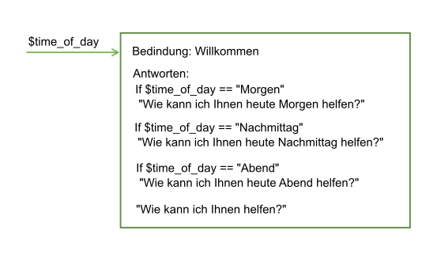
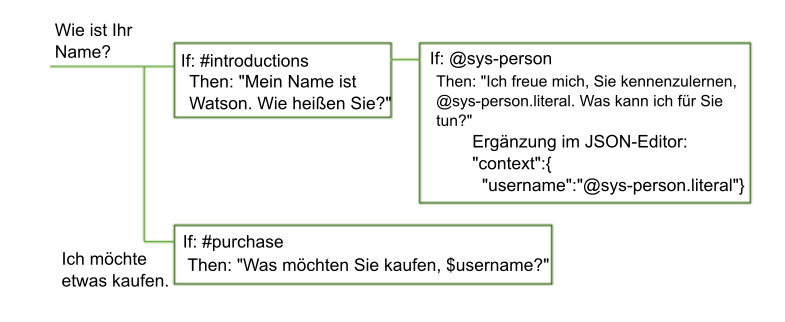

---

copyright:
  years: 2015, 2018
lastupdated: "2018-02-16"

---

{:shortdesc: .shortdesc}
{:new_window: target="_blank"}
{:tip: .tip}
{:pre: .pre}
{:codeblock: .codeblock}
{:screen: .screen}
{:javascript: .ph data-hd-programlang='javascript'}
{:java: .ph data-hd-programlang='java'}
{:python: .ph data-hd-programlang='python'}
{:swift: .ph data-hd-programlang='swift'}

# Informationen zur Verarbeitung des Dialogmoduls
{: #dialog-runtime}

Machen Sie sich damit vertraut, wie Ihr Dialogmodul verarbeitet wird, wenn eine Person während der Laufzeit mit Ihrer Instanz des bereitgestellten Service '{{site.data.keyword.conversationshort}}' interagiert.
{: shortdesc}

## Ablauf eines Dialogmodulaufrufs
{: message-anatomy}

Jede Äußerung eines Benutzers wird als API-Aufruf '/message' an das Dialogmodul übergeben. Dazu gehören auch Benutzeräußerungen, die auf Dialogmodulanfragen zum Eingeben von Informationen antworten. Da manche Abonnementpläne eine festgelegte Anzahl von API-Aufrufen beinhalten, sollten Sie wissen, woraus ein Aufruf besteht. Ein einzelner API-Aufruf '/message' entspricht einer einzelnen Dialogmodulrunde, die aus einer Eingabe des Benutzers und der zugehörigen Antwort des Dialogmoduls besteht.

Der Hauptteil des API-Aufrufs '/message' mit zugehöriger Anforderung und Antwort enthält die folgenden Objekte:

- `context`: Enthält die Variablen, die als persistent definiert werden sollen. Um Informationen von einem Aufruf an den nächsten zu übergeben, muss der Anwendungsentwickler den Antwortkontext des vorherigen API-Aufrufs zusammen mit dem jeweils nachfolgenden API-Aufruf übergeben. Das Dialogmodul kann zum Beispiel den Benutzernamen erfassen und in den nachfolgenden Knoten über diesen Namen auf den Benutzer verweisen.

  ```json
  {
    "context" : {
      "user_name" : "<? @sys-person.literal ?>"
    }
  ```
  {: codeblock}

  Weitere Informationen dazu enthält der Abschnitt [Informationen in mehreren Dialogrunden beibehalten](dialog-runtime.html#context).

- `input`: Die vom Benutzer übermittelte Textzeichenfolge. Die Textzeichenfolge kann maximal 2.048 Zeichen umfassen.

  ```json
  {
    "input": {
      "text" : "Welche Filiale liegt in Ihrer Nähe?"
    }
  ```
  {: codeblock}

- `output`: Die Antwort des Dialogmoduls, die dem Benutzer angezeigt werden soll. In diesem Abschnitt können Sie Objekte (z. B. Variablen) definieren, die nicht dauerhaft festgelegt werden sollen. Wenn Sie beispielsweise eine Kontextvariable namens `temp` permanent löschen möchten, die an anderer Stelle in dem Dialogmodul definiert ist, können Sie dafür den folgenden Ausdruck verwenden.

  ```json
  {
  "output": {
    "text" : {},
    "deleted_variable" : "<? context.remove('temp') ?>"
  ```
  {: codeblock}

  Weitere Informationen zum Ausgabeobjekt finden Sie im Abschnitt [Komplexe Antwort](dialog-overview.html#complex).

Weitere Informationen zum API-Aufruf '/message' enthält die [API-Referenz ](https://www.ibm.com/watson/developercloud/conversation/api/v1/){: new_window}.

## Informationen in mehreren Dialogrunden beibehalten
{: #context}

Das Dialogmodul ist statusunabhängig. Dies bedeutet, dass es keine Informationen von einer Interaktion mit dem Benutzer bis zur nächsten aufbewahrt. Für die Aufbewahrung von Informationen, die von der Anwendung benötigt werden, ist der Anwendungsentwickler zuständig. Die Anwendung muss das Kontextobjekt in der Antwort der Nachrichten-API suchen, speichern und im Kontextobjekt zusammen mit der nächsten API-Anforderung '/message' übergeben, die im Rahmen des Dialogablaufs abgesetzt wird. 

Die einfachste Methode zum Aufbewahren der Informationen ist das Speichern des gesamten Kontextobjekts im Arbeitsspeicher der Clientanwendung (z. B. in einem Web-Browser). Wenn es sich um eine komplexe Anwendung handelt oder wenn die Anwendung personenbezogene Daten übergeben und speichern muss, können Sie die Informationen in einer Datenbank speichern bzw. abrufen.

Die Anwendung kann Informationen an das Dialogmodul übergeben, die vom Dialogmodul an die Anwendung zurückgegeben oder an den nächsten Knoten weitergegeben werden können. Zu diesem Zweck werden im Dialogmodul Kontextvariablen verwendet.

Eine Kontextvariable ist eine Variable, die Sie in einem Knoten definieren und für die Sie optional einen Wert angeben. Weitere Knoten oder eine weitere Anwendungslogik können anschließend den Wert der Kontextvariablen festlegen oder ändern.

Sie können für die Werte von Kontextvariablen Bedingungen festlegen, indem Sie eine Kontextvariable aus einer Bedingung eines Dialogmodulknotens heraus referenzieren, um festzulegen, ob ein Knoten ausgeführt wird. Außerdem können Sie eine Kontextvariable aus Antwortbedingungen eines Dialogmodulknotens heraus referenzieren, um abhängig von dem Wert, den ein externer Service oder der Benutzer angegeben hat, unterschiedliche Antworten anzuzeigen.

### Kontext aus der Anwendung heraus übergeben
{: #context-from-app}

Zum Übergeben von Informationen aus der Anwendung an das Dialogmodul legen Sie eine Kontextvariable fest und übergeben Sie die Kontextvariable an das Dialogmodul.

Beispiel: Ihre Anwendung kann eine Kontextvariable '$time_of_day' festlegen und an das Dialogmodul übergeben, das anhand der Informationen die Begrüßung anpassen kann, die für den Benutzer angezeigt wird.



In diesem Beispiel weiß der Dialogknoten, dass die Anwendung die Variable auf einen der Werte *morning*, *afternoon* oder *evening* festlegt. Er kann jeden Wert überprüfen und je nach dem vorhandenen Wert die passende Begrüßung zurückgeben. Falls die Variable nicht übergeben wurde oder einen Wert besitzt, der mit keinem der erwarteten Werte übereinstimmt, wird für den Benutzer eine allgemeinere Begrüßung angezeigt.

### Kontext von Knoten zu Knoten übergeben
{: #context-node-to-node}

Das Dialogmodul kann auch Kontextvariablen hinzufügen, um Informationen von einem Knoten zu einem anderen Knoten zu übergeben oder um die Werte von Kontextvariablen zu aktualisieren. Sobald das Dialogmodul Informationen vom Benutzer anfordert und erhält, können die Informationen protokolliert und später im Dialog referenziert werden.

Beispielsweise kann in einem Knoten der Benutzer nach seinem Namen gefragt werden und der Benutzer in einem späteren Knoten mit seinem Namen angesprochen werden.



In diesem Beispiel wird die Systementität '@sys-person' verwendet, um den Namen des Benutzers aus der Eingabe zu extrahieren, falls der Benutzer einen Namen angibt. Im JSON-Editor wird die Kontextvariable 'username' definiert und auf den Wert '@sys-person' gesetzt. In einem nachfolgenden Knoten wird die Kontextvariable '$username' in die Antwort einbezogen, um den Benutzer mit seinem Namen anzusprechen.

## Kontextvariable definieren
{: #context-var-define}

Definieren Sie eine Kontextvariable, indem Sie ein Name/Wert-Paar für die Variable in einem der folgenden Editoren definieren:

- **Kontexteditor**: Zeigt ein Feld **Variable** und ein zugehöriges Feld **Wert** in der Bearbeitungsansicht für Knoten an, in denen Sie den Namen und den Wert für die Kontextvariable angeben können.

  **Hinweis**: Diese Felder werden in den von Ihnen hinzugefügten Knoten automatisch angezeigt. Für Knoten, die mit einer früheren Version des Service erstellt wurden, müssen Sie den Kontexteditor öffnen, damit die Felder hinzugefügt werden.

- **JSON-Editor**: Dieser Editor bietet einen Einblick in den zugrunde liegenden JSON-Inhalt, der zusammen mit der API-Anforderung '/message' an den Service '{{site.data.keyword.conversationshort}}' übergeben wird. Sie können Kontextvariablen definieren, indem Sie Name/Wert-Paare zum Abschnitt `"context":{}` des JSON-Hauptteils hinzufügen.

Die Name/Wert-Paare müssen die folgenden Voraussetzungen erfüllen:

- Der `name` kann beliebige Groß- und Kleinbuchstaben, numerische Zeichen (0-9) und Unterstreichungszeichen enthalten.

  **Hinweis**: Sie können auch andere Zeichen (z. B. Punkte und Bindestriche) im Namen verwenden. In diesem Fall müssen Sie jedoch die Variable im nachfolgenden Code jeweils mit einem der folgenden Verfahren referenzieren:

  - **context['variablenname']**

      Vollständige Syntax des SpEL-Ausdrucks:
  - **$(variablenname)**

      Kurzformsyntax, bei der der Variablenname in runde Klammern eingeschlossen wird.
    Weitere Details finden Sie im Abschnitt [Auf Objekte zugreifen und Objekte auswerten](expression-language.html#shorthand-syntax-for-context-variables).

- Der `wert` kann ein beliebiger unterstützter JSON-Typ sein (z. B. eine einfache Zeichenfolgevariable, eine Zahl oder ein JSON-Array). Wenn Sie die Kontextvariable mit dem JSON-Editor definieren, können Sie auch ein JSON-Objekt als Wert angeben.

Die folgende Tabelle veranschaulicht das Definieren von Name/Wert-Paaren in Editorfeldern für Kontextvariablen:

| Variable       | Wert              |
|:---------------|--------------------|
| dessert        | Kuchen               |
| toppings_array | ["Zwiebel","Oliven"] |
| age            | 18                 |

Das folgende JSON-Beispiel definiert Werte für die Zeichenfolge '$dessert', das Array '$toppings_array' und die Kontextvariable '$age' mit dem Typ 'Zahl':

```json
{
  "context": {
    "dessert": "Kuchen",
    "toppings_array": ["Zwiebel", "Oliven"],
    "age": 18
  }
}
```
{: codeblock}

So definieren Sie eine Kontextvariable:

1.  Definieren Sie die Kontextvariable in dem Abschnitt des Knotens, der die Uhrzeit angibt, die Sie beim Auswerten des Dialogmodulknotens als Wert für die Variable verwenden möchten. 

    **Hinweis**: Alle vorhandene Kontextvariablenwerte, die für diesen Knoten definiert sind, werden in einer Gruppe mit zugehörigen Feldern für **Variable** und **Wert** angezeigt. Wenn diese Felder nicht in der Bearbeitungsansicht des Knotens angezeigt werden sollen, müssen Sie den Kontexteditor schließen. Verwenden Sie zum Schließen des Editors dasselbe Menü wie zum Öffnen des Editors. In den folgenden Schritten wird beschrieben, wie Sie auf dieses Menü zugreifen können.

    - Um eine Kontextvariable hinzuzufügen, die nach dem Verarbeiten der Knotenantwort festgelegt oder geändert wird, fügen Sie die Kontextvariable im Antwortabschnitt hinzu.

      Klicken Sie auf das Symbol **Optionen**  , das der Antwort zugeordnet ist, und wählen Sie dann mithilfe der folgenden Optionen einen Editor aus:

      - **JSON-Editor öffnen**
      - **Kontexteditor öffnen**

      

      Wenn die Einstellung **Mehrere Antworten** für den Knoten auf **Ein** gesetzt ist, müssen Sie zuerst auf das Symbol **Antwort bearbeiten**  klicken.

      

    - Um eine Kontextvariable hinzuzufügen, die festgelegt oder aktualisiert wird, wenn eine Slotbedingung erfüllt ist, klicken Sie auf das Symbol **Slot bearbeiten** . Klicken Sie im Menü **Optionen**  im Header der Ansicht *Slot konfigurieren* auf die Option **JSON-Editor öffnen**. (Weitere Informationen zu Slots finden Sie unter [Information mit Slots erfassen](dialog-slots.html).)

      **Hinweis**: Gegenwärtig steht keine Methode zur Verfügung, um mit dem Kontexteditor Kontextvariablen zu definieren, die in dieser Phase der Auswertung des Dialogmodulknotens festgelegt werden.

      

    - Um eine Kontextvariable hinzuzufügen, die verarbeitet wird, wenn eine Antwortbedingung für einen Slot erfüllt ist, klicken Sie auf das Symbol **Slot bearbeiten** . Klicken Sie auf das Symbol **Optionen**  und wählen Sie anschließend **Bedingte Antworten aktivieren** aus. Klicken Sie auf das Symbol **Antwort bearbeiten**  neben der Antwort, der Sie die Kontextvariable zuordnen möchten. Klicken Sie auf das Symbol **Optionen**  im Antwortteil und wählen Sie dann mit einer der folgenden Optionen den gewünschten Editor aus:

      - **JSON-Editor öffnen**
      - **Kontexteditor öffnen**

      
1.  Um die Kontextvariable im Kontexteditor zu definieren, geben Sie das Name/Wert-Paar für die Variable in den Feldern **Variable** und **Wert** an.
1.  Um die Kontextvariable im JSON-Editor zu definieren, führen Sie die folgenden zusätzlichen Schritte aus:

    - Fügen Sie einen Block `"context":{}` hinzu, falls keiner vorhanden ist.

      ```json
      {
        "context":{},
      "output":{}
    }
      ```
      {: codeblock}

    - Fügen Sie im Block 'context' ein Name/Wert-Paar für jede Kontextvariable hinzu, die Sie definieren wollen.

      ```json
      {
        "context":{
          "name": "wert"
      },
        "output": {}
      }
      ```
      {: codeblock}

    In diesem Beispiel wird eine Variable namens `new_variable` in einem Kontextblock hinzugefügt, der bereits eine Variable enthält.

    ```json
    {
      "context":{
        "existing_variable": "value",
        "new_variable":"value"
      }
    }
    ```
    {: codeblock}

    Um die Kontextvariable anschließend zu referenzieren, verwenden Sie die Syntax `$name`. Hierbei steht *name* für den Namen der von Ihnen definierten Kontextvariablen. Beispiel: `$new_variable`.

## Häufige Aufgaben für Kontextvariablen
{: #context-common-tasks}

Verwenden Sie `input.text`, um die gesamte Zeichenfolge zu speichern, die vom Benutzer eingegeben wurde:

| Variable | Wert            |
|----------|------------------|
| repeat   | `<?input.text?>` |

```json
{
  "context": {
    "repeat": "<?input.text?>"
      }
}
```
{: codeblock}

Verwenden Sie die folgende Syntax, um den Wert einer Entität in einer Kontextvariablen zu speichern:

| Variable | Wert            |
|----------|------------------|
| place    | @place           |

```json
{
  "context": {
    "place": "@place"
      }
}
```
{: codeblock}

Mit jedem der beiden Editoren können Sie ein JSON-Objekt zu einer Kontextvariablen hinzufügen. Der folgende Ausdruck definiert ein Objekt 'full_name' mit einer Gruppe von Werten für Vorname (first) und Nachname (last), die zusammen den vollständigen Namen einer Person ergeben.

| Variable      | Wert            |
|---------------|------------------|
| full_name     | { "first":"Paul", "last":"Smith" } |

```json
{
  "context": {
    "full_name": {
      "first":"Paul",
      "last":"Smith"
      }
  }
}
```
{: codeblock}

Wenn Sie `$full_name.first` in der Antwort angeben, wird `Paul` angezeigt.

Um den Wert einer Zeichenfolge zu speichern, die Sie aus der Benutzereingabe extrahiert haben, können Sie einen SpEL-Ausdruck angeben, der mithilfe der Methode 'extract' einen regulären Ausdruck auf die Benutzereingabe anwendet. Der folgende Ausdruck extrahiert eine Zahl aus der Benutzereingabe und speichert sie in der Kontextvariablen `$number`.

| Variable | Wert                               |
|----------|-------------------------------------|
| number   | `<?input.text.extract('[\d]+',0)?>` |

```json
{
  "context": {
     "number": "<?input.text.extract('[\\d]+',0)?>"
  }
}
```
{: codeblock}

Beim Definieren eines regulären Ausdrucks im JSON-Editor müssen Sie für jeden umgekehrten Schrägstrich in dem Ausdruck einen zweiten umgekehrten Schrägstrich als Escapezeichen eingeben (`\\`). Im Editor für Kontextvariablen muss beim Definieren von regulären Ausdrücken kein Escapezeichen für umgekehrte Schrägstriche eingegeben werden.
{: tip}

Um den Wert einer Musterentität zu speichern, fügen Sie '.literal' an den Entitätsnamen an. Die Verwendung dieser Syntax stellt sicher, dass der exakte Textbereich aus der Benutzereingabe, der dem angegebenen Muster entspricht, in der Variablen gespeichert wird.

| Variable | Wert            |
|----------|------------------|
| email    | @email.literal   |

```json
{
  "context": {
    "email": "<? @email.literal ?>"
  }
}
```
{: codeblock}

## Kontextvariable löschen
{: #context-delete}

Um eine Kontextvariable zu löschen, setzen Sie die Variable auf null.

```json
{
  "context": {
    "order_form": null
  }
}
```
{: codeblock}

Wenn Sie alle Spuren der Kontextvariablen löschen möchten, können Sie die Variable mithilfe der Methode 'JSONObject.remove(string)' aus dem Kontextobjekt löschen. Dabei müssen Sie für den Löschvorgang eine Variable verwenden. Definieren Sie die neue Variable in der Nachrichtenausgabe, damit sie nicht über den aktuellen Aufruf hinaus gespeichert bleibt.

```json
{
  "output": {
    "text" : {},
    "deleted_variable" : "<? context.remove('order_form') ?>"
  }
}
```
{: codeblock}

Alternativ können Sie die Kontextvariable in Ihrer Anwendungslogik löschen.

### Reihenfolge der Ausführung
{: #context-order-of-ops}

Die Reihenfolge, in der Sie die Kontextvariablen definieren, hat keinen Einfluss auf die Reihenfolge, in der die Variablen durch den Service ausgewertet werden. Der Service wertet die als Name/Wert-Paare im JSON-Format definierten Variablen in einer Zufallsreihenfolge aus. Legen Sie in der ersten Kontextvariablen keinen Wert fest, den Sie unbedingt in der zweiten Variablen verwenden müssen, weil nicht garantiert ist, dass die erste Kontextvariable in Ihrer Liste vor der zweiten ausgeführt wird. Verwenden Sie beispielsweise nicht zwei Kontextvariablen, um Logik zu implementieren, die eine Zufallszahl zwischen 0 und einem höheren Wert zurückgibt und dann an den Knoten übergibt.

```json
"context": {
    "upper": "<? @sys-number.numeric_value + 1?>",
    "answer": "<? new Random().nextInt($upper) ?>"
}
```
{: codeblock}

Mit einem etwas komplexeren Ausdruck können Sie sicherstellen, dass die Auswertung des Wertes der Kontextvariablen '$upper' nicht zwingend vor der Auswertung der Kontextvariablen '$answer' erfolgen muss.

```json
"context": {
    "answer": "<? new Random().nextInt(@sys-number.numeric_value + 1) ?>"
}
```
{: codeblock}

### Werte von Musterentitäten speichern
{: #context-pattern-entities}

Fügen Sie '.literal' an den Entitätsnamen an, um den Wert einer Musterentität in einer Kontextvariablen zu speichern. Die Verwendung dieser Syntax stellt sicher, dass der exakte Textbereich aus der Benutzereingabe, der dem angegebenen Muster entspricht, in der Variablen gespeichert wird.

```json
{
  "context": {
    "email": "<? @email.literal ?>"
  }
}
```
{: codeblock}

Um den Text aus einer einzelnen Gruppe in einer Musterentität mit definierten Gruppen zu speichern, geben Sie die Arraynummer der Gruppe an, die Sie speichern möchten. Angenommen, das Entitätsmuster für die Entität '@phone_number' ist wie folgt definiert (beachten Sie, dass die Klammern Mustergruppen einschließen):

`\b((958)|(555))-(\d{3})-(\d{4})\b`

Um nur die Ortsnetzkennzahl der in der Benutzereingabe angegebenen Telefonnummer zu speichern, können Sie die folgende Syntax verwenden:

```json
{
  "context": {
    "area_code": "<? @phone_number.groups[1] ?>"
  }
}
```
{: codeblock}

Die Gruppen werden durch den regulären Ausdruck begrenzt, der zum Definieren des Gruppenmusters verwendet wird. Angenommen, die Benutzereingabe, die mit dem in der Entität `@phone_number` definierten Muster übereinstimmt, lautet wie folgt: `958-234-3456`. In diesem Fall werden die folgenden Gruppen erstellt:

| Gruppennummer | Wert in der Regex-Engine  | Wert im Dialogmodul   | Erläuterung |
|--------------|---------------------|----------------|-------------|
| groups[0]    | `958-234-3456`      | `958-234-3456` | Die erste Gruppe ist immer die vollständige übereinstimmende Zeichenfolge |
| groups[1]    | `((958)`l`(555))`   | `958`          | Zeichenfolge, die dem regulären Ausdruck für die erste definierte Gruppe, d. h. `((958)`l`(555))`, entspricht |
| groups[2]    | `(958)`             | `958`          | Übereinstimmung mit der Gruppe, die als erster Operand im Ausdruck OR `((958)`l`(555))` enthalten ist |
| groups[3]    | `(555)`             | `null`         | Keine Übereinstimmung mit der Gruppe, die als zweiter Operand im Ausdruck OR `((958)`l`(555))` enthalten ist |
| groups[4]    | `(\d{3})`           | `234`          | Zeichenfolge, die mit dem für die Gruppe definierten regulären Ausdruck übereinstimmt |
| groups[5]    | `(\d{4})`           | `3456`         | Zeichenfolge, die mit dem für die Gruppe definierten regulären Ausdruck übereinstimmt |
{: caption="Gruppendetails" caption-side="top"}

Als Hilfe für die Entscheidung, welche Gruppennummer zum Erfassen des für Sie relevanten Eingabeabschnitts verwendet werden soll, können Sie Informationen zu allen Gruppen auf einmal extrahieren. Erstellen Sie mit der folgenden Syntax eine Kontextvariable, die ein Array aller gruppierten Übereinstimmungen mit Musterentitäten zurückgeben:

```json
{
  "context": {
    "array_of_matched_groups": "<? @phone_number.groups ?>"
  }
}
```
{: codeblock}

Geben Sie in der Anzeige 'Ausprobieren' einige Testwerte mit Telefonnummern ein. Für die Eingabe `958-123-2345` setzt dieser Ausdruck `$array_of_matched_groups` auf den Wert `["958-123-2345","958","958",null,"123","2345"]`.

Anschließend können Sie alle Werte in dem mit 0 beginnenden Array zählen, um die entsprechende Gruppennummer abzurufen.

| Array-Elementwert | Array-Elementnummer |
|---------------------|----------------------|
| "958-123-2345"      | 0 |
| "958"               | 1 |
| "958"               | 2 |
| null                | 3 |
| "123"               | 4 |
| "2345"              | 5 |
{: caption="Array-Elemente" caption-side="top"}

Beispiel: Es ist leicht zu erkennen, dass mit der Gruppe 5 die letzten vier Stellen der Telefonnummer erfasst werden können.

Verwenden Sie die folgende Syntax, um die JSONArray-Struktur zurückzugeben, die zum Darstellen der gruppierten Musterentität erstellt wird:

```json
{
  "context": {
    "json_matched_groups": "<? @phone_number.groups_json ?>"
  }
}
```
{: codeblock}

Dieser Ausdruck legt für `$json_matched_groups` das folgende JSON-Array fest:

```json
[
  {"group": "group_0","location": [0, 12]},
  {"group": "group_1","location": [0, 3]},
  {"group": "group_2","location": [0, 3]},
  {"group": "group_3"},
  {"group": "group_4","location": [4, 7]},
  {"group": "group_5","location": [8, 12]}
]
```
{: codeblock}

**Hinweis**: `location` ist eine Entitätseigenschaft, die durch eine relative Zeichenposition mit der Basis null angibt, wo der erkannte Entitätswert im Eingabetext beginnt und endet.

Wenn Sie erwarten, dass die Eingabe zwei Telefonnummern enthält, können Sie auf zwei Telefonnummern prüfen. Verwenden Sie gegebenenfalls die folgende Syntax, um beispielsweise die Ortsnetzkennzahl der zweiten Nummer zu erfassen.

```json
{
  "context": {
    "second_areacode": "<? entities['phone_number'][1].groups[1] ?>"
  }
}
```
{: codeblock}

Wenn die Eingabe aus der Zeichenfolge `Ich möchte meine Rufnummer von 958-234-3456 in 555-456-5678 ändern` besteht, dann ist `$second_areacode` gleich `555`.

## Wert einer Kontextvariablen aktualisieren
{: #context-update}

Falls ein Knoten den Wert einer Kontextvariablen festlegt, die bereits festgelegt ist, wird der vorherige Wert überschrieben.

### Komplexes JSON-Objekt aktualisieren

Vorherige Werte werden bei allen JSON-Typen überschrieben, jedoch mit Ausnahme von JSON-Objekten. Falls die Kontextvariable einen komplexen Typ wie beispielsweise ein JSON-Objekt besitzt, wird die Variable mithilfe der JSON-Prozedur 'merge' aktualisiert. Die Operation 'merge' fügt neu definierte Eigenschaften hinzu und überschreibt alle vorhandenen Eigenschaften des Objekts.

Im folgenden Beispiel ist die Kontextvariable 'name' als komplexes Objekt definiert:

```json
{
  "context": {
    "complex_object": {
      "user_firstname" : "Paul",
      "user_lastname" : "Pan",
      "has_card" : false
    }
  }
}
```
{: codeblock}

Ein Dialogmodulknoten aktualisiert das JSON-Objekt für die Kontextvariable mit den folgenden Werten:

```json
{
  "complex_object": {
    "user_firstname": "Peter",
    "has_card": true
  }
}
```
{: codeblock}

Dies ergibt den folgenden Kontext:

```json
{
  "complex_object": {
    "user_firstname": "Peter",
    "user_lastname": "Pan",
    "has_card": true
  }
}
```
{: codeblock}

Weitere Informationen zu Methoden, die Sie an Objekten ausführen können, finden Sie im Abschnitt [Methoden in der Ausdruckssprache](dialog-methods.html#objects).

### Arrays aktualisieren

Falls die Kontextdaten des Dialogmoduls ein Array von Werten enthalten, können Sie das Array aktualisieren, indem Sie Werte anhängen, einen Wert entfernen oder alle Werte ersetzen.

Wählen Sie eine der folgenden Aktionen aus, um das Array zu aktualisieren. Bei allen Fällen ist das Array vor der Aktion, die Aktion selbst und das Array nach Anwendung der Aktion dargestellt.

- **Anhängen**: Um Werte am Ende des Arrays hinzuzufügen, verwenden Sie die Methode `append`.

    Ausgangspunkt ist der folgende Laufzeitkontext des Dialogmoduls:

    ```json
    {
      "context": {
        "toppings_array": ["Salami", "Paprika"]
      }
    }
    ```
    {: codeblock}

    Nehmen Sie die folgende Aktualisierung vor:

    ```json
    {
      "context": {
        "toppings_array": "<? $toppings_array.append('Ketchup', 'Tomaten') ?>"
      }
    }
    ```
    {: codeblock}

    Ergebnis:

    ```json
    {
      "context": {
        "toppings_array": ["Salami", "Paprika", "Ketchup", "Tomaten"]
      }
    }
    ```
    {: codeblock}

- **Entfernen**: Um ein Element zu entfernen, verwenden Sie die Methode `remove` und geben Sie den Wert oder die Position des Elements im Array an.

    - Beim **Entfernen mit Wertangabe** wird ein Element anhand seines Wertes aus dem Array entfernt.

        Ausgangspunkt ist der folgende Laufzeitkontext des Dialogmoduls:

        ```json
        {
          "context": {
            "toppings_array": ["Salami", "Paprika"]
      }
        }
        ```
        {: codeblock}

        Nehmen Sie die folgende Aktualisierung vor:

        ```json
        {
          "context": {
            "toppings_array": "<? $toppings_array.removeValue('Salami') ?>"
          }
        }
        ```
        {: codeblock}

        Ergebnis:

        ```json
        {
          "context": {
            "toppings_array": ["Paprika"]
          }
        }
        ```
        {: codeblock}

    - Beim **Entfernen mit Positionsangabe** wird ein Element anhand seiner Indexposition aus dem Array entfernt.

        Ausgangspunkt ist der folgende Laufzeitkontext des Dialogmoduls:

        ```json
        {
          "context": {
            "toppings_array": ["Salami", "Paprika"]
      }
        }
        ```
        {: codeblock}

        Nehmen Sie die folgende Aktualisierung vor:

        ```json
        {
          "context": {
            "toppings_array": "<? $toppings_array.remove(0) ?>"
          }
        }
        ```
        {: codeblock}

        Ergebnis:

        ```json
        {
          "context": {
            "toppings_array": ["Paprika"]
          }
        }
        ```
        {: codeblock}

- **Überschreiben**: Um die Werte in einem Array zu überschreiben, legen Sie einfach die neuen Werte für das Array fest.

    Ausgangspunkt ist der folgende Laufzeitkontext des Dialogmoduls:

        ```json
        {
          "context": {
            "toppings_array": ["Salami", "Paprika"]
      }
        }
        ```
        {: codeblock}

    Nehmen Sie die folgende Aktualisierung vor:

        ```json
        {
          "context": {
            "toppings_array": ["Ketchup", "Tomaten"]
          }
        }
        ```
        {: codeblock}

    Ergebnis:

        ```json
        {
          "context": {
            "toppings_array": ["Ketchup", "Tomaten"]
          }
        }
        ```
        {: codeblock}

Weitere Informationen zu Methoden, die Sie für Arrays ausführen können, finden Sie im Abschnitt [Methoden in der Ausdruckssprache](dialog-methods.html#arrays).

## Abschweifungen
{: #digressions}

Ein Abschweifung tritt auf, wenn ein Benutzer mitten in einem Dialogablauf zum Erreichen eines bestimmten Ziels das Thema wechselt, um einen Dialogablauf einzuleiten, der ein anderes Ziel erreichen soll. Das Dialogmodul hat stets die Fähigkeit des Benutzers unterstützt, das Thema zu wechseln. Falls keiner der Knoten im gegenwärtig verarbeiteten Dialogmodulzweig dem Ziel der letzten Benutzereingabe entspricht, springt die Konversation zurück zur Baumstruktur und überprüft die Stammknotenbedingungen auf eine entsprechende Übereinstimmung. Die für jeden Knoten verfügbaren Abschweifungseinstellungen bieten Ihnen die Möglichkeit, dieses Verhalten noch genauer anzupassen.

Mit den Abschweifungseinstellungen können Sie den Dialog zurück zu dem Dialogablauf leiten, der durch die Abschweifung unterbrochen wurde. Beispiel: Während der Benutzer ein neues Telefon bestellt, wechselt er das Thema und erkundigt sich über Tablet-Computer. Ihr Dialogmodul kann die Frage zu Tablet-Computern beantworten und den Benutzer anschließend wieder an die Stelle zurückleiten, an der er den Prozess für die Telefonbestellung verlassen hat. Durch die Möglichkeit, nach Abschweifungen zum ursprünglichen Prozess zurückzukehren, können die Benutzer den Dialogablauf während der Ausführung besser kontrollieren. Sie können das Thema wechseln, dem Dialogablauf für das neue Thema bis zum Ende folgen und danach zu der Stelle zurückkehren, die Sie zuvor im ursprünglichen Thema erreicht hatten. Auf diese Weise kann der Dialogablauf noch besser ein tatsächliches Gespräch zwischen Menschen nachbilden.

Die folgende Abbildung erläutert an einem Modell für die Benutzerschnittstelle der Dialogmodul-Baumstruktur das Konzept der Abschweifung. Sie zeigt die Interaktionen eines Benutzers mit Dialogmodulknoten, die Abschweifungen zulassen und danach zum vorherigen Dialogablauf zurückkehren. Der Benutzer beginnt mit dem Angeben der Informationen für eine Tischreservierung zum Abendessen. Beim Ausfüllen der Slots im Knoten '#reservation' stellt der Benutzer eine Frage zu vegetarischen Menüangeboten. Das Dialogmodul beantwortet die neue Frage des Benutzers, indem es unter den Stammknoten einen Knoten mit entsprechenden Informationen ausfindig macht (einen Knoten, der sich auf die Absicht '#cuisine' bezieht). Anschließend wird der vorherige Dialog fortgesetzt, indem die Anfrage für den nächsten leeren Slot des ursprünglichen Dialogmodulknotens angezeigt wird.


### Vorbemerkungen

Legen Sie beim Testen des gesamten Dialogmoduls fest, an welchen Stellen es sinnvoll ist, Abschweifungen und das anschließende Fortsetzen des ursprünglichen Dialogablaufs zuzulassen. Die folgenden Steuerelemente für Abschweifungen werden automatisch auf die Knoten angewendet. Sie sollten nur Maßnahmen ergreifen, wenn Sie dieses Standardverhalten ändern möchten.

- Jeder Stammknoten in Ihrem Dialogmodul ist standardmäßig so ausgelegt, dass er als Ziel für Abschweifungen dienen kann. Untergeordnete Knoten können nicht das Ziel einer Abschweifung sein.
- Knoten mit Slots sind so konfiguriert, dass sie keine abgehenden Abschweifungen zulassen. Alle anderen Knoten sind so konfiguriert, dass abgehende Abschweifungen zulässig sind. In den folgenden Situationen kann der Dialog jedoch nicht von einem Knoten abschweifen:

  - Mindestens ein untergeordneter Knoten des aktuellen Knotens enthält die Bedingung `anything_else` oder `true`

    Diese speziellen Bedingungen werden immer mit 'true' ausgewertet. Aufgrund dieses bekannten Verhaltens werden diese Knoten häufig in Dialogmodulen verwendet, um einen übergeordneten Knoten zu veranlassen, einen bestimmten untergeordneten Knoten als nächstes auszuwerten. Um eine Unterbrechung der Logik des bestehenden Dialogablaufs zu vermeiden, ist in diesem Fall keine Abschweifung zulässig. Abgehende Abschweifungen von einem solchen Knoten sind erst möglich, wenn Sie die Bedingung des untergeordneten Knotens ändern.

  - Die Knotenkonfiguration ermöglicht das Springen zu einem anderen Knoten oder das Überspringen der Benutzereingabe nach der Verarbeitung des Knotens

    Der Abschnitt für den letzten Schritt in einem Knoten gibt an, was nach der Verarbeitung des Knotens geschehen soll. Wenn die Konfiguration des Dialogmoduls den direkten Übergang zu einem anderen Knoten vorsieht, dann soll damit häufig das Einhalten einer bestimmten Abfolge gewährleistet werden. Wenn der Knoten so konfiguriert ist, dass die Benutzereingabe übersprungen wird, dann bedeutet dies, dass der Dialog gezwungen wird, den ersten untergeordneten Knoten nach dem aktuellen Knoten der Abfolge zu verarbeiten. Um das Unterbrechen der bestehenden Dialogablauflogik zu vermeiden, ist in solchen Fällen keine Abschweifung zulässig. Um abgehende Abschweifungen von diesem Knoten zu ermöglichen, müssen Sie die Angaben im Abschnitt für den letzten Schritt ändern.

### Abschweifungen anpassen
{: #enable-digressions}

Der Anfang und das Ende einer Abschweifung wird nicht von Ihnen definiert. Der Verlauf einer Abschweifung während der Ausführungszeit steht allein im Ermessen des Benutzers. Sie geben lediglich an, wie jeder Knoten an einer vom Benutzer veranlassten Abschweifung teilnehmen bzw. nicht teilnehmen soll. Für jeden Knoten konfigurieren Sie Folgendes:

- Ob eine abgehende Abschweifung von dem Knoten ausgehen darf
- Ob eine Abschweifung, die an anderer Stelle beginnt, den Knoten als Ziel nutzen darf
- Ob eine Abschweifung, die an anderer Stelle beginnt und den Knoten als Ziel nutzt, nach Beendigung des abzweigenden Dialogablaufs zum unterbrochenen Dialogablauf zurückkehren muss

Führen Sie die folgenden Schritte aus, um das Abschweifungsverhalten für einen einzelnen Knoten zu ändern:

1.  Klicken Sie auf den Knoten, um die zugehörige Bearbeitungsansicht zu öffnen.

1.  Klicken Sie auf **Anpassen** und dann auf die Registerkarte **Abschweifungen**.

    Die Konfigurationsoptionen unterscheiden sich je nachdem, ob der von Ihnen bearbeitete Knoten ein Stammknoten, ein untergeordneter Knoten, ein Knoten mit untergeordneten Elementen oder ein Knoten mit Slots ist.

    **Von diesem Knoten abgehende Abschweifung**

    Wenn die oben aufgelisteten Situationen nicht zutreffen, haben Sie die folgenden Auswahlmöglichkeiten:

    - **Alle Knotentypen**: Wählen Sie aus, ob Benutzer Abschweifungen, die vom aktuellen Knoten abgehen, ausführen können, bevor das Ende der aktuellen Dialogmodulverzweigung erreicht ist.

    - **Alle Knoten mit untergeordneten Elementen**: Wählen Sie aus, ob der Dialog nach einer Abschweifung zum aktuellen Knoten zurückkehren soll, wenn die Antwort des aktuellen Knotens bereits angezeigt wurde und die zugehörigen untergeordneten Knoten für das Ziel des Knotens nebensächlich sind. Setzen Sie das Umschaltsteuerelement *Zurückspringen nach Abweichungen zulassen, die nach der Antwort dieses Knotens ausgelöst wurden* auf **Nein**, um zu verhindern, dass zum aktuellen Dialogmodulknoten zurückgekehrt und die Verarbeitung der zugehörigen Verzweigung fortgesetzt wird.

      Angenommen, der Benutzer fragt `Verkaufen Sie Cupcakes?` und die Antwort `Wir bieten Cupcakes in verschiedenen Geschmacksrichtungen und Größe an` wird angezeigt, bevor der Benutzer das Thema wechselt. In diesem Fall möchten Sie vielleicht nicht, dass wieder die vorherige Stelle im Dialogmodul aufgerufen wird. Dies gilt insbesondere, wenn die untergeordneten Knoten nur potenzielle Nachfragen des Benutzers verarbeiten und gefahrlos ignoriert werden können.

      Wenn der Knoten jedoch auf die zugehörigen untergeordneten Knoten zurückgreift, um die Frage zu beantworten, kann es sinnvoll sein, dafür zu sorgen, dass der Dialog zur vorherigen Stelle zurückkehrt und die Verarbeitung der Knoten in der aktuellen Verzweigung fortsetzt. Angenommen, die ursprüngliche Antwort lautet: `Wir bieten Cupcakes in allen Geschmacksrichtungen und Größen an. Welche Menüangebote möchten Sie sehen: glutenfreie, laktosefreie oder normale?` Wenn der Benutzer an dieser Stelle das Thema wechselt, kann es wünschenswert sein, dass der Dialog zu einer vorherigen Stelle zurückkehrt, damit der Benutzer einen Menütyp weiter verfolgen und die gewünschte Information abrufen kann.

    - **Knoten mit Slots**: Wählen Sie aus, ob Benutzer Abschweifungen von dem Knoten ausführen können, bevor alle Slots gefüllt sind. Setzen Sie das Umschaltsteuerelement *Abgehende Abschweifungen beim Füllen von Slots zulassen* auf **Ja**, um abgehende Abschweifungen zu aktivieren.

      Wenn Abschweifungen aktiviert sind und das Dialogmodul nach der Abschweifung zurückkehrt, wird die Anfrage für den nächsten leeren Slot angezeigt, damit der Benutzer weitere Informationen angeben kann. Wenn Abschweifungen inaktiviert sind, werden alle Benutzereingaben ignoriert, die keine Werte zum Füllen von Slots enthalten. Sie können jedoch nicht angeforderte Fragen einplanen, die Benutzer bei der Interaktion mit dem Knoten möglicherweise stellen werden, indem Sie entsprechende Slot-Handler definieren. Weitere Informationen enthält der Abschnitt [Slots hinzufügen](dialog-slots.html#add-slots).

      Die folgende Abbildung zeigt, wie abgehende Abschweifungen von dem Knoten mit Slots namens  '#reservation' (dargestellt in der vorherigen Abbildung) konfiguriert werden.

      

    - **Knoten mit Slots**: Wählen Sie aus, ob der Benutzer nur abgehende Abschweifungen erstellen kann, wenn anschließend zum aktuellen Knoten zurückgekehrt wird, indem Sie das Kontrollkästchen **Nur Abschweifungen von Slots zu Knoten, die die Rückkehr zulassen** auswählen.

      Wenn diese Option aktiviert ist, ignoriert das Dialogmodul bei der Suche nach einem Knoten zum Beantworten der abschweifenden Frage des Benutzers alle Stammknoten, deren Konfiguration die Rückkehr nach der Abschweifung nicht zulässt. Wählen Sie dieses Kontrollkästchen aus, um zu verhindern, dass die Benutzer den Knoten verlassen, bevor das Füllen der erforderlichen Slots abgeschlossen ist.

    **Abschweifungen zu diesem Knoten**

    Mit den folgenden Auswahlmöglichkeiten können Sie das Verhalten von Abschweifungen zu einem Zielknoten festlegen:

    - Verhindern, dass Benutzer zu einem Zielknoten abschweifen. Weitere Informationen finden Sie im Abschnitt [Abschweifungen zu Stammknoten inaktivieren](#diable-digressions).

    - Wenn Abschweifungen zu dem Knoten aktiviert sind, wählen Sie aus, ob das Dialogmodul zu dem Dialogablauf zurückkehren muss, von dem die Abschweifung abzweigt. Wenn diese Option aktiviert ist, kehrt der Dialogablauf zu dem unterbrochenen Knoten zurück, nachdem die Verzweigung des aktuellen Knotens vollständig verarbeitet wurde. Damit das Dialogmodul nach der Verarbeitung der Abzweigung zurückkehrt, wählen Sie **Nach Abschweifung zurückkehren** aus.

    Das folgende Bild zeigt, wie Abschweifungen zum Knoten '#cuisine' (dargestellt in einer vorherigen Abbildung) konfiguriert werden.

    

1.  Klicken Sie auf **Anwenden**.

1.  Testen Sie in der Anzeige 'Ausprobieren' das Ausführungsverhalten der Abschweifung.

    Auch in diesem Fall können Sie den Anfang und das Ende der Abschweifung nicht definieren. Es liegt im Ermessen des Benutzers, wo und wann Abschweifungen auftreten. Sie können lediglich Einstellungen dafür festlegen, wie ein einzelner Knoten an einer Abschweifung teilnimmt. Da Abschweifungen nicht vorhersehbar sind, ist nur schwer abzuschätzen, wie Ihre Konfigurationsvorgaben sich auf den Dialog insgesamt auswirken. Um die tatsächlichen Auswirkungen Ihrer Vorgaben zu überprüfen, müssen Sie das Dialogmodul testen.

Die Knoten '#reservation' und '#cuisine' stellen zwei Dialogmodulverzweigungen dar, die an einer einzelnen benutzergesteuerten Abschweifung teilnehmen können. Die für jeden einzelnen Knoten definierten Abschweifungseinstellungen ermöglichen diese Art von Abschweifung während der Laufzeit.


### Abschweifungen zu Stammknoten inaktivieren
{: #disable-digressions}

Wenn ein Dialogablauf zu einem Stammknoten abschweift, wird dabei der Ablauf des Dialogmoduls eingehalten, das für den betreffenden Knoten konfiguriert ist. D. h., es wird gegebenenfalls eine Reihe untergeordneter Knoten verarbeitet, bevor das Ende der Knotenverzweigung erreicht ist, und anschließend wird (sofern die Konfiguration dies vorsieht) der unterbrochene Dialogablauf fortgesetzt. Beim Testen des Dialogmoduls stellen Sie womöglich fest, dass ein Stammknoten zu häufig oder an nicht erwarteten Stellen ausgelöst wird, oder dass das zugehörige Dialogmodul zu komplex ist und den Benutzer zu weit vom ursprünglichen Kurs wegführt und daher nicht für eine temporäre Abschweifung geeignet ist. Wenn Sie Abschweifungen zu dem betreffenden Dialogmodul verhindern möchten, können Sie den Stammknoten so konfigurieren, dass er nicht als Ziel für Abschweifungen verwendet werden kann.

Führen Sie die folgenden Schritte aus, um Abschweifungen zu einem Stammknoten zu inaktivieren:

1.  Klicken Sie auf den Stammknoten, um ihn zum Bearbeiten zu öffnen.
1.  Klicken Sie auf **Anpassen** und dann auf die Registerkarte **Abschweifungen**.
1.  Setzen Sie das Umschaltsteuerelement *Abschweifungen zu diesem Knoten zulassen* auf **Aus**.
1.  Klicken Sie auf **Anwenden**.

Wenn Sie Abschweifungen zu mehreren Stammknoten verhindern möchten, ohne jeden Knoten einzeln zu bearbeiten, können Sie die betreffenden Knoten zu einem Ordner hinzufügen. Auf der Seite *Anpassen* für den Ordner können Sie das Umschaltsteuerelement *Abschweifungen zu diesem Knoten zulassen* auf **Aus** setzen, um diese Einstellung gleichzeitig auf alle Knoten anzuwenden. Weitere Informationen enthält der Abschnitt [Dialogmodul in Ordnern zusammenfassen](dialog-build.html#folders).

### Designaspekte
{: #digression-design-considerations}

- **Häufige Nutzung von Rückgriffsknoten vermeiden**: Viele Entwickler von Dialogmodulen fügen einen Knoten mit einer Bedingung `true` oder `anything_else` am Ende jeder Dialogmodulverzweigung ein, um zu verhindern, dass Benutzer in der Verzweigung stecken bleiben. Dabei wird eine generische Nachricht zurückgegeben, wenn die Benutzereingabe keinem von Ihnen vorgesehenen Verlauf entspricht, der durch einen bereitgestellten Dialogmodulknoten verarbeitet werden kann. Dialogabläufe, die dieses Designkonzept verwenden, lassen jedoch keine abgehende Abschweifung zu.

  Überprüfen Sie für alle Verzweigungen, die dieses Konzept verwenden, ob es hilfreich wäre, abgehende Abschweifungen von den einzelnen Verzweigungen zuzulassen. Wenn die Benutzereingabe keiner von Ihnen eingeplanten Eingabe entspricht, liegt möglicherweise eine Übereinstimmung mit einem ganz anderen Dialogablauf in Ihrer Baumstruktur vor. Anstatt mit einer generischen Nachricht zu antworten, können Sie den weiteren Verlauf des Dialogmoduls nutzen, um eine Antwort auf die Frage des Benutzers zu finden. Außerdem kann der Stammknoten `Anything else` auf Eingaben reagieren, die von keinem anderen Stammknoten beantworten werden können.

- **Sprünge zu einem Endknoten wiederholt in Betracht ziehen**: In vielen Dialogmodulen wird zum Abschluss eine Standardfrage wie `Ist Ihre Frage damit beantwortet?` gestellt. Benutzer können keine Abschweifungen von Knoten erstellen, die so konfiguriert sind, dass sie zu einem anderen Knoten springen. Mit anderen Worten: Wenn alle Endknoten Ihrer Verzweigungen so konfiguriert sind, dass sie zu einem gemeinsamen Endknoten springen, dann sind keine Abschweifungen möglich. Ziehen Sie in Betracht, die Benutzerzufriedenheit durch Metriken oder mit anderen Methoden zu überwachen.

- **Potenzielle Abschweifungsketten testen**: Wenn ein Benutzer von einem aktuellen Konten zu einem anderen Knoten abschweift, der abgehende Abschweifungen zulässt, kann der Benutzer potenziell auch von dem anderen Knoten abschweifen und dieses Verhaltensmuster einmal oder mehrere Male wiederholen. Wenn alle Knoten in der Abschweifungskette für die Rückkehr nach der Abschweifung konfiguriert sind, wird der Benutzer anschließend zum aktuellen Dialogmodulknoten zurückgeführt. Szenarios mit Abschweifungen sollten jedoch mehrmals getestet werden, um festzustellen, ob die einzelnen Knoten wie erwartet funktionieren.

- **Bevorzugte Verarbeitung des aktuellen Knotens berücksichtigen**: Beachten Sie, dass Knoten außerhalb des aktuellen Ablaufs nur als Abschweifungsziele in Betracht kommen, wenn der aktuelle Ablauf die Benutzereingabe nicht abwickeln kann. In einem Knoten mit Slots, der abgehende Abschweifungen zulässt, ist es umso wichtiger, deutlich zu machen, welche Informationen vom Benutzer anzugeben sind. Außerdem sollten entsprechende Bestätigungsnachrichten angezeigt werden, nachdem vom Benutzer ein Wert eingegeben wurde.

  Beim Füllen von Slots kann jeder beliebige Slot gefüllt werden. Es kann daher vorkommen, dass in einem Slot unerwartet eine Benutzereingabe erfasst wird. Angenommen, Sie verfügen über einen Knoten mit Slots zum Erfassen der erforderlichen Informationen für eine Tischreservierung zum Abendessen. In einem der Slots wird die Datumsangabe erfasst. Möglicherweise stellt der Benutzer beim Angeben der Reservierungsdetails die Frage `Wie sind die Wetteraussichten für morgen?` Ein vorhandener Stammknoten mit der Bedingung '#forecast' könnte diese Benutzerfrage beantworten. Da die Benutzereingabe jedoch das Wort `morgen` enthält und gegenwärtig der Knoten mit Slots für eine Tischreservierung verarbeitet wird, geht der Service davon aus, dass der Benutzer das Datum für die Reservierung angeben oder ändern möchte. *Der aktuelle Knoten wird immer bevorzugt behandelt.* Wenn Sie eine eindeutige Bestätigungsnachricht definieren (z. B. `OK, die Reservierung wird für morgen vorgenommen.` kann der Benutzer das vorliegende Missverständnis leichter erkennen und korrigieren.

  Wenn der Benutzer jedoch beim Füllen der Slots einen Wert angibt, der von keinem der Slots erwartet wird, kann es vorkommen, dass der Wert zu einem ganz anderen Stammknoten passt, zu dem der Benutzer gar nicht abschweifen wollte.

  Führen Sie zahlreiche Testläufe durch, um das Abschweifungsverhalten genau auf Ihre Erfordernisse abzustimmen.

- **Abschweifung anstelle von Slot-Handler verwenden**: Verwenden Sie für allgemeine Fragen, die jederzeit von Benutzern gestellt werden können, einen Stammknoten, der als Abschweifungsziel genutzt werden kann, Eingaben verarbeitet und dann zu der ursprünglichen Stelle im Ablauf zurückkehrt. Beziehen Sie beim Einrichten von Dialogmodulknoten mit Slots möglichst schon vorab zugehörige Fragen ein, die Benutzer beim Füllen der Slots stellen könnten und beantworten Sie diese Fragen, indem Sie entsprechende Handler zum Knoten hinzufügen.

  Beispiel: Wenn der Knoten mit Slots Informationen zum Ausfüllen eines Versicherungsanspruchs erfasst, kann es sinnvoll sein, Handler für häufig gestellte Fragen zu Versicherungen hinzuzufügen. Für Fragen zum Anfordern von Hilfe, zu den Standorten von Filialen oder zur Geschichte des Unternehmens sollten Sie jedoch jeweils einen Knoten der Stammebene verwenden.
