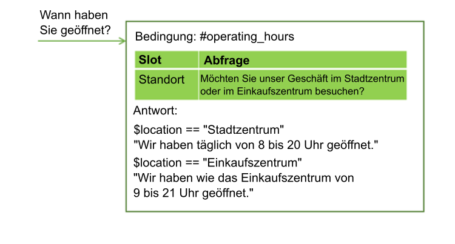
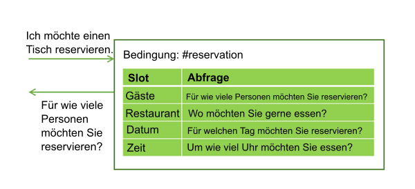
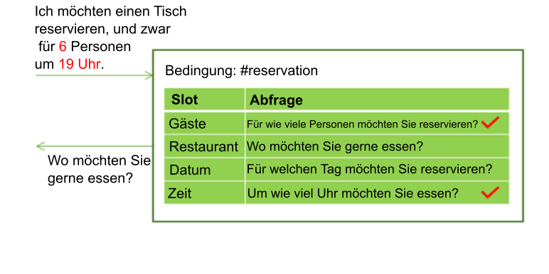
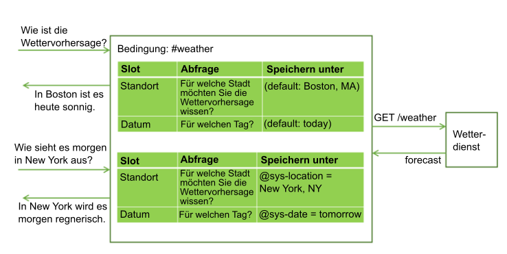
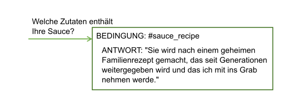

---

copyright:
  years: 2015, 2018
lastupdated: "2018-02-16"

---

{:shortdesc: .shortdesc}
{:new_window: target="_blank"}
{:tip: .tip}
{:pre: .pre}
{:codeblock: .codeblock}
{:screen: .screen}
{:javascript: .ph data-hd-programlang='javascript'}
{:java: .ph data-hd-programlang='java'}
{:python: .ph data-hd-programlang='python'}
{:swift: .ph data-hd-programlang='swift'}
{:table: .aria-labeledby="caption"}

# Informationen mit Slots erfassen
{: #dialog-slots}

Um in einem Knoten mehrere Einzelinformation von einem Benutzer zu erfassen, fügen Sie Slots zu einem Dialogmodulknoten hinzu. Slots erfassen Informationen in dem Moment, in dem sie vom Benutzer eingegeben werden. Details, die der Benutzer direkt angibt, werden gespeichert; der Service fragt nur nach den Details, die nicht angegeben wurden.

<iframe class="embed-responsive-item" id="youtubeplayer" type="text/html" width="640" height="390" src="https://www.youtube.com/embed/ES4GHcDsSCI?rel=0" frameborder="0" webkitallowfullscreen mozallowfullscreen allowfullscreen> </iframe>

## Gründe für das Hinzufügen von Slots
{: #why-add-slots}

Mit Slots können Sie Informationen abrufen, die Sie benötigen, um eine präzise Antwort für den Benutzer anzuzeigen. Wenn ein Benutzer beispielsweise nach Ladenöffnungszeiten fragt, sich diese jedoch je nach Filiale unterscheiden, könnten Sie vor der Beantwortung eine Nachfrage über den Standort der Filiale stellen, die der Benutzer besuchen möchte. Anschließend können Sie Antwortbedingungen hinzufügen, die die bereitgestellten Informationen zum Standort berücksichtigen.



Mithilfe von Slots können Sie mehrere Einzelinformation erfassen, die Sie benötigen, um eine komplexe Task für einen Benutzer auszuführen, beispielsweise eine Reservierung für ein Abendessen in einem Restaurant.



Der Benutzer gibt möglicherweise bereits direkt Werte für mehrere Slots an. Die Eingabe könnte beispielsweise die folgende Information enthalten: `Wir kommen mit 6 Personen um 19:00 Uhr zum Essen.` Diese Eingabe enthält zwei der fehlenden erforderlichen Werte, nämlich die Anzahl der Gäste und die Uhrzeit für die Reservierung. Der Service erkennt und speichert beide Angaben jeweils im entsprechenden Slot. Anschließend gibt er die Frage aus, die dem nächsten leeren Slot zugeordnet ist.



Slots versetzen den Service in die Lage, Nachfragen zu stellen, ohne das Ziel des Benutzers erneut darlegen zu müssen. Wenn ein Benutzer beispielsweise nach der Wettervorhersage fragt, könnte eine Nachfrage über das Wetter an einem anderen Ort oder an einem anderen Tag gestellt werden. Falls Sie die erforderlichen Variablen für die Vorhersage (z. B. Ort und Datum) in Slots speichern und der Benutzer eine erneute Frage mit neuen Werten für die Variablen stellt, können Sie die Slotwerte mit den neu angegebenen Werten überschreiben und eine Antwort geben, die die neuen Informationen berücksichtigt. (Weitere Informationen zum Aufrufen eines externen Service über ein Dialogmodul enthält der Abschnitt [Programmgesteuerte Aufrufe über einen Dialogmodulknoten absetzen](dialog-actions.html)).



Die Verwendung von Slots erzeugt einen natürlicheren Dialogmodulablauf zwischen dem Benutzer und dem Service. Außerdem ist ihre Verwaltung einfacher als der Versuch, die Informationen mithilfe von vielen separaten Knoten zu erfassen.

## Slots hinzufügen
{: #add-slots}

1.  Ermitteln Sie, welche Einzelinformationen Sie erfassen wollen. Wenn beispielsweise jemand eine Pizza bestellen möchte, könnten Sie die folgenden Informationen erfassen wollen:

    - Lieferzeitpunkt
    - Größe

1.  Wenn Sie noch nicht mit den Erstellen eines Dialogmoduls begonnen haben, befolgen Sie die Anweisungen im Abschnitt [Dialogmodul erstellen](dialog-build.html), um ein Dialogmodul zu  erstellen.

1.  Klicken Sie in der Bearbeitungsansicht für Dialogmodulknoten auf **Anpassen** und klicken Sie dann auf das Umschaltsteuerelement neben **Slots**, um es auf **Ein** zu setzen.

    **Hinweis**: Weitere Informationen zum Kontrollkästchen **Alles abfragen** finden Sie unter [Alle Eingabe auf einmal abfragen](dialog-slots.html#slots-prompt-for-everything).

1.  **Fügen Sie für jede benötigte Einzelinformation einen Slot hinzu**. Geben Sie für jeden Slot die folgenden Details an:

    - **Überprüfen auf**: Geben Sie den Typ der Information an, die Sie aus der Antwort des Benutzers auf die Abfrage des Slots extrahieren wollen. ?In den meisten Fällen wird dies eine Überprüfung auf Entitätswerte sein. In dem angezeigten Bedingungsbuilder werden Entitäten vorgeschlagen, die Sie überprüfen können. Sie können auch nach einer Absicht suchen. Geben Sie dazu einfach den Namen der Absicht in das Feld ein. Mit den Operatoren AND und OR können Sie hier auch komplexere Bedingungen definieren.

      **Wichtig**: Der Wert für *Überprüfen auf* wird zunächst als Bedingung verwendet und später als Wert für die Kontextvariable, die Sie im Feld *Speichern unter* angeben. Wenn Sie die Speicherungsmethode für den Wert ändern möchten, können Sie den Wert zum Beispiel neu formatieren und dann den Ausdruck für das Neuformatieren des Werts direkt in das Feld **Überprüfen auf** eingeben.

      Wenn für die Entität beispielsweise reguläre Ausdrücke definiert sind, fügen Sie nach dem Hinzufügen des Entitätsnamens `.literal` an. Bearbeiten Sie nach dem Auswählen des Listeneintrags `@email` beispielsweise das Feld **Überprüfen auf** so, dass es die Zeichenfolge `@email.literal` enthält. Durch das Hinzufügen der Eigenschaft `.literal` wird angegeben, dass exakt der vom Benutzer eingegebene Text erfasst werden soll, der anhand des Musters als E-Mail-Adresse erkannt wurde. Nehmen Sie diese Syntaxänderung direkt im Feld **Überprüfen auf** vor.

      **Warnung**: Wenn Sie vor dem Speichern einen komplexen Ausdruck auf den Wert anwenden möchten, können Sie den JSON-Editor öffnen, um den komplexen SpEL-Ausdruck zu definieren. Der komplexe Ausdruck, den Sie im JSON-Editor definieren, wird jedoch nicht im Feld **Überprüfen auf** reflektiert, wenn Sie den JSON-Editor beenden. Wenn Sie das Feld **Überprüfen auf** nach dem Definieren des komplexen Ausdrucks durch Anklicken in den Fokus nehmen, wird der Ausdruck entfernt.

      Vermeiden Sie eine Überprüfung auf Kontextvariablenwerte. Da der Wert, nach dem Sie suchen, auch gespeichert wird, wenn Sie eine Kontextvariable in der Bedingung verwenden, kann die Verwendung dieses Werts im Kontext zu nicht erwartetem Verhalten führen. Versuchen Sie nicht, nur dann einen optionalen Slot zum Anzeigen einer Antwort zu verwenden, wenn eine angegebene Kontextvariable festgelegt ist. Wenn die Variable festgelegt ist, wird die Antwort für den Slot 'Gefunden', die Sie für den optionalen Slot definieren, zusammen mit den von allen anderen Slots zurückgegebenen Antworten immer wieder angezeigt.{: tip}

    - **Speichern unter**: Geben Sie einen Namen für die Kontextvariable an, in der der relevante Wert aus der Benutzerantwort auf die Abfrage des Slots gespeichert werden soll. Geben Sie keine Kontextvariable an, die bereits zuvor im Dialogmodul verwendet wurde und daher möglicherweise bereits einen Wert besitzt. Die Abfrage für den Slot wird nur dann angezeigt, wenn die Kontextvariable für den Slot keinen Wert aufweist.

    - **Abfrage**: Schreiben Sie eine Anweisung, mit der die vom Benutzer benötigte Einzelinformation eruiert wird. Nachdem diese Abfrage angezeigt wurde, wird der Dialog angehalten und der Service wartet darauf, dass der Benutzer antwortet.

    - Wenn in Abhängigkeit davon, ob der Benutzer als Antwort auf die erste Slot-Anfrage die erforderliche Information angibt, verschiedene Folgeanweisungen angezeigt werden sollen, können Sie den Slot bearbeiten (durch Klicken auf das Symbol **Slot bearbeiten** ) und die Folgeanweisungen definieren:

      - **Gefunden**: Wird angezeigt, wenn der Benutzer die erwartete Information angibt.

      - **Nicht gefunden**: Wird angezeigt, wenn die vom Benutzer angegebene Information nicht verständlich ist oder nicht im erwarteten Format bereitgestellt wurde. Wenn der Slot erfolgreich gefüllt wird oder die Benutzereingabe verständlich ist und durch einen Slot-Handler verarbeitet wird, wird diese Anweisung nicht angezeigt.

      Informationen zum Definieren von Bedingungen und zugehörigen Aktionen für die Antworten für 'Gefunden' und 'Nicht gefunden' finden Sie unter [Bedingungen zu Antworten für 'Gefunden' und 'Nicht gefunden' hinzufügen](dialog-slots.html#slot-handler-next-steps).

    Diese Tabelle zeigt Beispielslotwerte für einen Knoten, der Benutzer beim Bestellen einer Pizza hilft, indem zwei Einzelinformationen (Pizzagröße und Lieferzeitpunkt) erfasst werden.

    <table>
    <caption>Beispielslots für Pizzabestellung</caption>
    <tr>
      <th>Überprüfen auf</th>
      <th>Speichern unter</th>
      <th>Abfrage</th>
      <th>Folgeaktion, falls gefunden</th>
      <th>Folgeaktion, falls nicht gefunden</th>
    </tr>
    <tr>
      <td>@size</td>
      <td>$size</td>
      <td>Wie groß soll die bestellte Pizza sein?</td>
      <td>Sie möchten eine $size Pizza.</td>
      <td>Welche Größe meinen Sie? Wir bieten kleine, mittlere und große Pizzas an.</td>
    </tr>
    <tr>
      <td>@sys-time</td>
      <td>$time</td>
      <td>Um wie viel Uhr soll die Pizza bei Ihnen sein?</td>
      <td>Die Lieferung soll um $time erfolgen.</td>
      <td>Wann soll die Pizza geliefert werden? Wir benötigen mindestens eine halbe Stunde für die Zubereitung.</td>
    </tr>
    </table>

1.  **Einen Slot unter bestimmten Bedingungen als optional konfigurieren oder inaktivieren**. Sie können für einen Slot die folgenden Optionen konfigurieren:

    - **Optional**: Um einen Slot als optional zu konfigurieren, fügen Sie einen Slot ohne Anfrage hinzu. Der Service gibt keine Anfrage an den Benutzer aus, aber er sucht in der Benutzereingabe nach der Information und speichert den Wert, wenn er vom Benutzer bereitgestellt wird. Beispiel: Sie wollen einen Slot hinzufügen, der Informationen zu Nahrungsmittelunverträglichkeiten erfasst, falls der Benutzer etwas in dieser Hinsicht angibt. Generell sollen jedoch nicht alle Benutzer danach gefragt werden, weil dies in vielen Fällen irrelevant ist.

       <table>
       <caption>Optionaler Slot</caption>
       <tr>
          <th>Information</th>
          <th>Überprüfen auf</th>
          <th>Speichern unter</th>
       </tr>
       <tr>
          <td>Weizenallergie</td>
          <td>@dietary</td>
          <td>$dietary</td>
      </tr>
      </table>

      Falls Sie einen Slot als optional definieren, referenzieren Sie seine Kontextvariable nur dann im Antworttext auf Knotenebene, wenn Sie sie so formulieren können, dass sie auch dann sinnvoll ist, wenn kein Wert für den Slot angegeben wird. Sie könnten zum Beispiel eine Zusammenfassung wie `Ich bestelle eine $size $dietary Pizza, die um $time geliefert wird` formulieren. Der resultierende Text ist auch dann sinnvoll, wenn die Informationen zu Nahrungsmittelunverträglichkeiten (z. B. `glutenfrei` oder `laktosefrei`) nicht angegeben werden. Das Ergebnis lautet entweder `Ich bestelle eine große glutenfreie Pizza, die um 15:00 Uhr geliefert wird` oder `Ich bestelle eine große Pizza, die um 15:00 Uhr geliefert wird`.
      {: tip}

    - **Bedingt**: Wenn ein Slot nur unter bestimmten Bedingungen akiviert werden soll, können Sie eine Bedingung für den Slot hinzufügen. Angenommen, Slot 1 fragt nach dem Startzeitpunkt für eine Besprechung, Slot 2 erfasst die Dauer der Besprechung und Slot 3 erfasst, wann die Besprechung endet. In diesem Fall kann es sinnvoll sein, Slot 3 (die Frage nach dem Ende der Besprechung) nur zu aktivieren, wenn für Slot 2 kein Wert bereitgestellt wird. Um einen bedingten Slot zu konfigurieren, bearbeiten Sie den Slot und wählen Sie dann im Menü **Mehr**  die Option **Bedingung aktivieren** aus. Definieren Sie die Bedingung, die erfüllt sein muss, damit der Slot aktiviert wird.

      Die Bedingung kann auf dem Wert für eine Kontextvariable eines vorherigen Slots basieren, da die Slots in der Reihenfolge ihrer Auswertung aufgelistet werden. Verwenden Sie als Basis jedoch nur den Wert einer Slotkontextvariablen, von dem Sie sicher wissen, dass er zum Zeitpunkt der Slotauswertung vorhanden ist. Deklarieren Sie beispielsweise den vorherige Slot als erforderlich.{: tip}
1.  **Halten Sie die Benutzer beim Thema.** Sie können optional Slot-Handler definieren, die Antworten auf Fragen bereitstellen, die Benutzer während der Interaktion stellen könnten, die jedoch für den Zweck des Knotens nur eine untergeordnete Bedeutung haben.

    Beispiel: Der Benutzer fragt nach dem Rezept der Tomatensauce oder nach Ihrer Bezugsquelle für die Zutaten. Um solche vom Thema abweichenden Fragen zu verarbeiten, klicken Sie auf den Link **Handler verwalten** und fügen Sie dann eine Bedingung und eine Antwort für jede antizipierte Frage hinzu.

    

    Nachdem die vom Thema abweichende Frage beantwortet wurde, wird die Anfrage angezeigt, die dem aktuellen leeren Slot zugeordnet ist.

    Diese Bedingung wird ausgelöst, falls der Benutzer während des Ablaufs des Dialogmodulknotens zu irgendeinem Zeitpunkt eine Eingabe bereitstellt, die mit den Bedingungen des Handlers übereinstimmt. Dies gilt so lange, bis die Antwort auf Knotenebene angezeigt wird. Informationen zu weiteren Methoden für die Verwendung des Slot-Handlers finden Sie unter [Anforderungen zur Prozessbeendigung verarbeiten](dialog-slots.html#slots-node-level-handler).
1.  **Fügen Sie die Antwort auf Knotenebene hinzu.** Die Antwort auf Knotenebene wird erst ausgeführt, nachdem alle erforderlichen Slots gefüllt wurden. Sie können eine Antwort hinzufügen, die die gesammelten Informationen zusammenfasst. Beispiel: `Ihre $size Pizza wird um $time geliefert. Guten Appetit!`

    Wenn Sie verschiedene Antworten für bestimmte Bedingungen definieren möchten, klicken Sie auf **Anpassen** und dann auf das Umschaltsteuerelement **Mehrere Antworten**, um es auf **Ein** zu setzen. Weitere Informationen zu bedingten Antworten finden Sie unter [Bedingte Antworten](dialog-overview.html#multiple).
1.  **Fügen Sie Logik hinzu, die die Kontextvariablen von Slots zurücksetzt**. Wenn Sie Antworten von Benutzern für einzelne Slots erfassen, werden sie in Kontextvariablen gespeichert. Die Kontextvariablen können Sie verwenden, um die Informationen an einen anderen Knoten oder zur weiteren Verwendung an eine Anwendung bzw. einen externen Service zu übergeben. Nachdem die Informationen übergeben wurden, müssen Sie die Kontextvariablen jedoch auf null setzen, damit der Knoten zurückgesetzt wird und von Neuem Informationen erfassen kann. Die Kontextvariablen können innerhalb des aktuellen Knotens nicht auf null gesetzt werden, weil der Service den Knoten erst dann verlässt, wenn die erforderlichen Slots gefüllt wurden. Stattdessen kann eine der folgenden Methoden sinnvoll sein:

    - Fügen Sie zur externen Anwendung eine Verarbeitung hinzu, die die Variablen auf null setzt.
    - Fügen Sie einen untergeordneten Knoten hinzu, der die Variablen auf null setzt.
    - Fügen Sie einen übergeordneten Knoten hinzu, der die Variablen auf null setzt und dann zum Knoten mit Slots springt.

Probieren Sie es aus! Führen Sie die im [Lernprogramm](tutorial-slots.html) beschriebenen Schritte aus.

## Tipps zur Verwendung von Slots
{: #slots-tips}

Die folgenden Sloteigenschaften sind hilfreich beim Überprüfen und Festlegen von Werten in Slotkontextvariablen.

| Eigenschaftsname         | Beschreibung |
|------------------------|-------------|
| `all_slots_filled`     | Wird nur als 'true' ausgewertet, wenn alle Kontextvariablen für alle Slots im betreffenden Knoten festgelegt wurden. Ein Beispiel für die Verwendung finden Sie unter [Anzeige einer nicht benötigten Antwort auf die Bedingung für 'Gefunden' verhindern](dialog-slots.html#slots-stifle-found-responses). |
| `event.current_value`  | Aktueller Wert der Kontextvariablen für diesen Slot. Ein Beispiel für die Verwendung dieser Eigenschaft und der Eigenschaft 'event.previous_value' finden Sie unter [Kontextvariablenwert in einem Slot ersetzen](dialog-slots.html#slots-found-handler-event-properties).|
| `event.previous_value` | Vorheriger Wert der Kontextvariablen für diesen Slot. |
| `has_skipped_slots`    | Ist 'true', wenn ein Slot oder Slot-Handler verarbeitet wurde, der mit einer Schrittfunktion zum Überspringen von Slots konfiguriert ist. Weitere Informationen zu Optionen für nächste Schritte in Slots finden Sie unter [Bedingungen zu Antworten für 'Gefunden' und 'Nicht gefunden' hinzufügen](dialog-slots.html#slot-handler-next-steps). Weitere Informationen zu Optionen für nächste Schritte für Slot-Handler finden Sie unter [Anforderungen zur Prozessbeendigung verarbeiten](dialog-slots.html#slots-node-level-handler). |
| `slot_in_focus`        | Legt fest, dass die Slotbedingung nur auf den aktuellen Slot angewendet wird. Weitere Details finden Sie unter [Bestätigung anfordern](dialog-slots.html#slots-get-confirmation). |
{: caption="Sloteigenschaften" caption-side="top"}

Ziehen Sie für die Verarbeitung allgemeiner Tasks die folgenden Konzepte in Betracht.

- [Alle Angaben auf einmal abfragen](dialog-slots.html#slots-prompt-for-everything)
- [Mehrere Werte erfassen](dialog-slots.html#slots-multiple-entity-values)
- [Werte neu formatieren](dialog-slots.html#slots-reformat-values)
- [Bestätigung anfordern](dialog-slots.html#slots-get-confirmation)
- [Kontextvariablenwert in einem Slot ersetzen](dialog-slots.html#slots-found-handler-event-properties)
- [Unklarheiten bei Zahlen verhindern](dialog-slots.html#slots-avoid-number-confusion)
- [Bedingungen zu Antworten für 'Gefunden' und 'Nicht gefunden' hinzufügen](dialog-slots.html#slot-handler-next-steps)
- [Nach mehreren Fehlversuchen fortfahren](dialog-slots.html#slots-stop-trying-after-3)
- [Anzeige einer nicht benötigten Antwort auf die Bedingung für 'Gefunden' verhindern](dialog-slots.html#slots-stifle-found-responses)
- [Anforderungen zur Prozessbeendigung verarbeiten](dialog-slots.html#slots-node-level-handler)

### Alle Angaben auf einmal abfragen
{: #slots-prompt-for-everything}

Nehmen Sie für den gesamten Knoten eine Anfangsabfrage auf, die den Benutzern klar angibt, welche Informationen von ihnen angegeben werden sollen. Wenn zuerst diese Abfrage angezeigt wird, erhalten die Benutzer die Gelegenheit, alle Details auf einmal anzugeben und nicht auf Abfragen für alle Einzelinformationen warten zu müssen.

Wenn der Knoten beispielsweise ausgelöst wird, weil ein Kunde ein Pizza bestellen möchte, können Sie mit der folgenden einleitenden Anfrage antworten: `Ich kann Ihre Pizzabestellung aufnehmen. Bitte sagen Sie mir, wie groß die Pizza sein soll und um wie viel Uhr sie geliefert werden soll.`

Falls der Benutzer bereits einen Teil dieser Informationen in der ersten Anforderung angegeben hat, wird die Abfrage nicht angezeigt. Ein Beispiel hierfür wäre eine Benutzereingabe wie `Ich möchte eine große Pizza bestellen`. Wenn der Service die Eingabe analysiert, erkennt er `groß` als Pizzagröße und füllt den Slot **Größe** mit dem angegebenen Wert. Da einer der Slots gefüllt ist, überspringt er das Anzeigen der Anfangsabfrage, damit nicht erneut nach Informationen zur Pizzagröße gefragt wird. Stattdessen werden die Abfragen für alle übrigen Slots mit fehlenden Informationen angezeigt.

Wählen Sie im Fenster 'Anpassen', in dem Sie die Funktion 'Slots' aktiviert haben, das Kontrollkästchen **Alles abfragen** aus, um die Anfangsabfrage zu aktivieren. Diese Einstellung fügt das Feld **Zuerst diese Frage ausgeben, falls noch keine Slots gefüllt sind** zum Knoten hinzu, in dem Sie den Text eingeben können, der alle Angaben vom Benutzer anfordert.

### Mehrere Werte erfassen
{: #slots-multiple-entity-values}

Sie können eine Liste von Elementen abfragen und in einem Slot speichern.

Beispiel: Sie wollen die Benutzer fragen, womit die Pizza belegt sein soll. Hierzu definieren Sie eine Entität (@toppings) und die zulässigen Werte für die Entität (Pepperoni, Käse, Pilze usw.). Fügen Sie einen Slot hinzu, der den Benutzer nach dem Belag fragt. Verwenden Sie die Eigenschaft 'values' des Entitätstyps,  um mehrere Werte (falls angegeben) zu erfassen.

<table>
<caption>Slot für mehrere Werte</caption>
<tr>
  <th>Überprüfen auf</th>
  <th>Speichern unter</th>
  <th>Abfrage</th>
  <th>Folgeaktion, falls gefunden</th>
  <th>Folgeaktion, falls nicht gefunden</th>
</tr>
<tr>
  <td>@toppings.values</td>
  <td>$toppings</td>
  <td>'Mit welchem Belag?'</td>
  <td>Eine gute Wahl.</td>
  <td>Welchen Belag möchten Sie? Wir haben ...</td>
</tr>
</table>

Um den vom Benutzer angegebenen Belag später zu referenzieren, verwenden Sie die Syntax `<? $entity-name.join(',') ?>`, in der jedes Element im Array 'toppings' aufgelistet wird und die Werte durch ein Komma getrennt sind. Beispiel: `Ich bestelle für Sie eine $size Pizza mit <? $toppings.join(',') ?> Die Lieferung soll um $time erfolgen.`

### Werte neu formatieren
{: #slots-reformat-values}

Da Sie Informationen vom Benutzer abfragen und seine Eingabe in Antworten referenzieren müssen, kann es sinnvoll sein, die Werte neu zu formatieren, damit sie in einem benutzerfreundlicheren Format angezeigt werden.

Beispiel: Zeitwerte werden im Format `hh:mm:ss` gespeichert. Sie können den JSON-Editor für den Slot verwenden, um den Zeitwert beim Speichern neu zu formatieren, damit stattdessen das Format `Stunde:Minuten AM/PM` verwendet wird:

```json
{
  "context":{
    "time": "<? @sys-time.reformatDateTime('h:mm a') ?>"
  }
}
```
{: codeblock}

Weitere Vorschläge für eine Neuformatierung enthält der Abschnitt [Methoden für die Verarbeitung von Werten](dialog-methods.html).

### Bestätigung anfordern
{: #slots-get-confirmation}

Fügen Sie einen Slot hinzu, der vom Benutzer die Bestätigung anfordert, dass die erfassten Informationen richtig und vollständig sind. Der Slot kann nach Antworten suchen, die mit der Absicht '#yes' oder '#no' übereinstimmen.

<table>
<caption>Bestätigungsslot</caption>
<tr>
  <th>Überprüfen auf</th>
  <th>Speichern unter</th>
  <th>Abfrage</th>
  <th>Folgeaktion, falls gefunden</th>
  <th>Folgeaktion, falls nicht gefunden</th>
</tr>
<tr>
  <td>#yes || #no</td>
  <td>$confirmation</td>
  <td>Ich bestelle für Sie eine `$size` Pizza zur Lieferung um `$time`. Soll ich fortfahren?</td>
  <td>Ihre Pizza ist unterwegs!</td>
  <td>Siehe *Komplexe Antwort*</td>
</tr>
</table>

**Komplexe Antwort**: Da Benutzer möglicherweise bereits an anderen Stellen im Dialogmodul bejahende oder verneinende Äußerungen gemacht haben (z. B. *Oh ja, wir möchten, dass die Pizza um 17:00 Uhr geliefert wird*. oder *Heute kommen keine Gäste, also lieber eine kleine Pizza*), verwenden Sie die Eigenschaft `slot_in_focus`, um in der Slotbedingung deutlich zu machen, dass Sie ausschließlich nach einer bejahenden oder verneinenden Antwort auf die Anfrage für diesen Slot suchen.

```json
(#yes || #no) && slot_in_focus
```
{: codeblock}

Die Eigenschaft `slot_in_focus` wird immer in einen booleschen Wert ('true' oder 'false') ausgewertet. Nehmen Sie sie daher nur in eine Bedingung auf, für die Sie ein boolesches Ergebnis wünschen. Verwenden Sie sie beispielsweise nicht in Slotbedingungen, die auf einen Entitätstyp überprüfen und dann den Entitätswert speichern.
{: tip}

Machen Sie in der Abfrage für **Nicht gefunden** deutlich, dass Sie vom Benutzer eine zustimmende oder ablehnende Antwort (Ja oder Nein) erwarten. 

```json
{
  "output":{
    "text": {
      "values": [
        "Antworten Sie mit 'Ja', um zu bestätigen, dass die Bestellung
         so durchgeführt werden soll, oder mit 'Nein', wenn sie nicht durchgeführt werden soll."
      ]
    }
  }
}
```
{: codeblock}

Fügen Sie in der Abfrage für **Gefunden** eine Bedingung hinzu, die überprüft, ob eine ablehnende Antwort (#no) gegeben wurde. Wenn eine solche Antwort gefunden wird, fragen Sie erneut alle Informationen ab und setzen Sie die zuvor gespeicherten Kontextvariablen zurück.

```json
{
  "conditions": "#no",
  "output":{
    "text": {
      "values": [
        "Versuchen wir es noch einmal. Bitte sagen Sie mir, wie groß die Pizza sein soll und um wie viel Uhr sie geliefert werden soll..."
      ]
    }
  },
  "context":{
    "size": null,
    "time": null,
    "confirmation": null
  }
}
```
{: codeblock}

### Kontextvariablenwert in einem Slot ersetzen
{: #slots-found-handler-event-properties}

Wenn ein Benutzer vor dem Verlassen eines Knotens mit Slots zu irgendeinem Zeitpunkt einen neuen Wert für einen Slot angibt, wird der neue Wert in der Kontextvariablen des Slots gespeichert und ersetzt den zuvor angegebenen Wert. Mithilfe von speziellen Eigenschaften, die für die Bedingung für 'Gefunden' definiert werden, kann Ihr Dialogmodul explizit bestätigen, dass diese Ersetzung stattgefunden hat.

- `event.previous_value`: Vorheriger Wert der Kontextvariablen für diesen Slot
- `event.current_value`: Aktueller Wert der Kontextvariablen für diesen Slot

Beispiel: Das Dialogmodul fragt nach dem Ziel für eine Flugreservierung. Der Benutzer gibt `Paris` an. Sie legen für die Kontextvariable '$destination' des Slots den Wert *Paris* fest. Anschließend sagt der Benutzer: `Bitte warten Sie. Ich möchte stattdessen nach Madrid fliegen`. Falls Sie die Bedingung für 'Gefunden' wie folgt konfigurieren, kann Ihr Dialogmodul diese Art von Änderung problemlos verarbeiten.

When user responds, if @destination is found:

```json
Condition: (event.previous_value != null) &&
           (event.previous_value != event.current_value)
    Response: Ok, updating destination from
    <? event.previous_value ?> in <? event.current_value ?>.
Antwort: OK, Ihr Ziel ist $destination.
```
{: codeblock}

Diese Slotkonfiguration versetzt das Dialogmodul in die Lage, auf die Zieländerung des Benutzers mit der Aussage `OK, ich ändere das Ziel von Paris in Madrid` zu reagieren.

### Unklarheiten bei Zahlen verhindern
{: #slots-avoid-number-confusion}

Einige Werte, die von Benutzer bereitgestellt werden, können als verschiedene Entitätstypen erkannt werden.

Beispiel: Es gibt zwei Slots, in denen derselbe Werttyp gespeichert wird, z. B. das Anreise- und das Abreisedatum. Erstellen Sie in Ihren Slotbedingungen Logik, um solche ähnlichen Werte voneinander zu unterscheiden.

Der Service kann außerdem mehrere Entitätstypen in einer einzigen Benutzereingabe erkennen. Wenn ein Benutzer beispielsweise eine Währung angibt, wird sie sowohl als Entitätstyp '@sys-currency' (Systementität für Währung) als auch als Entitätstyp '@sys-number' (Systementität für Zahl) erkannt. Durch ein paar Tests im Fenster *Ausprobieren* können Sie sich einen Eindruck davon verschaffen, wie das System verschiedene Benutzereingaben interpretiert, und Logik in Ihren Bedingungen erstellen, die mögliche Fehlinterpretationen verhindert.

In der für die Funktion 'Slots' eindeutigen Logik wird bei Erkennung von zwei Entitäten in einer einzigen Benutzereingabe diejenige mit dem größeren Umfang verwendet. Wenn ein Benutzer beispielsweise *2. Mai* eingibt, erkennt der Service '{{site.data.keyword.conversationshort}}' zwar beide Entitäten '@sys-date' (05022017) und '@sys-number' (2) im Text, aber nur die Entität mit dem größeren Umfang (@sys-date) wird registriert und auf einen Slot angewendet.
{: tip}

### Bedingungen zu Antworten für 'Gefunden' und 'Nicht gefunden' hinzufügen
{: #slot-handler-next-steps}

Für jeden Slot können Sie bedingte Antworten mit zugeordneten Aktionen verwenden, um die benötigten Informationen beim Benutzer abzufragen. Führen Sie dazu die folgenden Schritte aus:

1.  Klicken Sie auf das Symbol **Slot bearbeiten**  für den Slot, zu dem Sie bedingte Antworten für 'Gefunden' und 'Nicht gefunden' hinzufügen möchten.
1.  Wählen Sie im Menü **Mehr**  die Option **Bedingte Antworten aktivieren** aus.
1.  Geben Sie die Bedingung ein und die Antwort, die angezeigt werden soll, wenn die Bedingung erfüllt ist.

    **Beispiel für 'Gefunden'**: Der Slot erwartet die Uhrzeit für eine Tischreservierung. Sie können '@sys-time' im Feld *Überprüfen auf* verwenden, um diese Information zu erfassen. Um zu verhindern, dass eine ungültige Zeitangabe gespeichert wird, können Sie beispielsweise durch Hinzufügen einer bedingten Antwort überprüfen, ob die angegebene Zeit vor der letzten Reservierungszeit des Restaurants liegt.`@sys-time.after('21:00:00')` -  Die zugehörige Antwort könnte wie folgt lauten: *Unsere späteste Reservierungszeit ist 21:00 Uhr.*

    **Beispiel für 'Nicht gefunden'**: Der Slot erwartet eine Entität '@location', für die eine bestimmte Gruppe von Städten zulässig ist, in denen es Restaurants dieser Restaurantkette gibt. Die Bedingung für 'Nicht gefunden' könnte eine Überprüfung für '@sys-location' durchführen, wenn der Benutzer eine vorhandene Stadt angibt, in der die Kette jedoch keine Restaurants hat. Eine entsprechende Antwort könnte wie folgt lauten: *An diesem Ort haben wir keine Restaurants*.

1.  Wenn Sie die weiteren Schritte für den Fall anpassen möchten, dass die Bedingung erfüllt ist, klicken Sie auf das Symbol **Antwort bearbeiten** .

    Als nächste auszuführende Aktion bei Antworten für 'Gefunden' (sie werden angezeigt, wenn der Benutzer einen Wert bereitstellt, der mit dem im Feld 'Überprüfen auf' angegebenen Werttyp übereinstimmt) können Sie eine der folgenden Aktionen auswählen:

      - **Fortfahren (Standardaktion)**: Gibt an, dass der Service mit dem nächsten leeren Slot fortfahren soll, nachdem die Antwort angezeigt wurde. Versichern Sie dem Benutzer in der zugehörigen Antwort, dass seine Eingabe verstanden wurde. Beispiel: *OK. Sie möchten für $date reservieren.*
      - **Slot löschen und erneut abfragen**: Wenn Sie im Feld *Überprüfen auf* eine Entität verwenden, die den falschen Wert aufnehmen könnte, fügen Sie Bedingungen zum Abfangen potenzieller Missverständnisse hinzu und verwenden Sie diese Aktion, um den aktuellen Slotwert zu löschen und nach dem korrekten Wert zu fragen.
      - **Zur Antwort springen**: Wenn die von Ihnen definierte Bedingung erfüllt ist und danach keine weiteren Slots in diesem Knoten gefüllt werden müssen, wählen Sie diese Aktion aus, um die verbleibenden Slots zu überspringen und direkt mit der Antwort auf Knotenebene fortzufahren. Sie könnten beispielsweise eine Bedingung hinzufügen, die überprüft, ob der Benutzer weniger als 16 Jahre alt ist. Wenn dies zutrifft, könnten die weiteren Slots übersprungen werden, in denen nach Verstößen des Benutzers gegen die Straßenverkehrsordnung gefragt wird.

    Als auszuführende Aktion bei Antworten für 'Nicht gefunden' (sie werden angezeigt, wenn der Benutzer keinen gültigen Wert bereitstellt) können Sie eine der folgenden Aktionen auswählen:

      - **Auf Benutzereingabe warten (Standardaktion)**: Der Dialog wird angehalten und der Service wartet auf die Antwort des Benutzers. Im einfachsten Fall kann der Text, den Sie hier angeben, die Art der Information, die Sie vom Benutzer benötigen, genauer beschreiben. Wenn Sie diese Aktion mit einer bedingten Antwort verwenden, formulieren Sie in der bedingten Antwort eindeutig, was an der Benutzerantwort nicht korrekt war und wie eine korrekte Antwort aussehen sollte.
      - **Abfrage wiederholen**: Nach dem Anzeigen der Antwort für 'Nicht gefunden' wiederholt der Service die Abfrage für den Slot und wartet die Antwort des Benutzers ab. Wenn Sie diese Aktion mit einer bedingten Antwort verwenden, kann die zugehörige Antwort nur erläutern, was an der Antwort des Benutzers nicht korrekt war. Es muss nicht erneut ausgeführt werden, welche Art von Information der Benutzer bereitstellen soll (dies geht in der Regel aus der Abfrage für den Slot hervor).

        Wenn Sie diese Option auswählen, sollten Sie in Betracht ziehen, mindestens eine Variante der Antwort für 'Nicht gefunden' hinzuzufügen, damit nicht zweimal derselbe Text für den Benutzer angezeigt wird. Nutzen Sie die Gelegenheit, um mit anderen Worten zu erläutern, welche Information der Benutzer in welchem Format bereitstellen soll.{: tip}

      - **Diesen Slot überspringen**: Gibt an, dass der Service das Füllen des aktuellen Slots überspringen und mit der Abfrage für den nächsten leeren Slot fortfahren soll. Diese Option eignet sich besonders, wenn Sie einen Slot als optional definieren und zusätzlich eine Abfrage für die Benutzereingabe anzeigen möchten. Angenommen, eine Entität '@seating' erfasst die Reservierungswünsche für ein Restaurant (z. B. *Draußen*, *Neben dem offenen Kamin*, *Privat* usw.). Sie können einen Slot hinzufügen, der den Benutzer nach besonderen Wünschen fragt (z. B. *Wünschen Sie einen besonderen Platz?*) und die Entität `@seating.values` überprüft. Wenn eine gültige Antwort gegeben wird, werden die geäußerten Wünsche in der Entität `$seating_preferences` gespeichert. Wenn Sie diese Aktion jedoch als nächsten Schritt nach der Antwort für 'Nicht gefunden' auswählen, versucht der Service nicht erneut, diesen Slot zu füllen, wenn der Benutzer keine gültige Antwort angibt.
      - **Zur Antwort springen**: Wenn die von Ihnen definierte Bedingung erfüllt ist und danach keine weiteren Slots in diesem Knoten gefüllt werden müssen, wählen Sie diese Aktion aus, um die verbleibenden Slots zu überspringen und direkt mit der Antwort auf Knotenebene fortzufahren. Angenommen, nach dem Erfassen der Fluginformationen für einen Hinflug wird die folgende Abfrage des Slots angezeigt: *Möchten Sie Tickets für den Hin- und Rückflug kaufen?* In diesem Fall kann die Bedingung für 'Nicht gefunden' prüfen, ob '#No' vorhanden ist. Wenn '#No' gefunden wird, können Sie diese Option verwenden, um die übrigen Slots zum Erfassen der Informationen für den Rückflug zu überspringen und direkt mit der Antwort für die Knotenebene fortzufahren.

    Klicken Sie auf **Zurück**, um zur Bearbeitungsansicht für den Slot zurückzukehren.
1.  Um eine weitere bedingte Antwort hinzuzufügen, klicken Sie auf **Antwort hinzufügen** und geben Sie die Bedingung und die zugehörige Antwort ein, die angezeigt werden soll, wenn die Bedingung erfüllt ist.

    Fügen Sie mindestens eine Antwort hinzu, die in jedem Fall angezeigt wird. Sie können das Bedingungsfeld für diese universelle Antwort leer lassen. Der Service füllt das leere Bedingungsfeld automatisch mit der Sonderbedingung `true`.

1.  Klicken Sie auf **Speichern**, um Ihre Änderungen zu speichern, schließen Sie die Bearbeitungsansicht für den Slot und kehren Sie zur Bearbeitungsansicht für den Knoten zurück.

### Nach mehreren Fehlversuchen fortfahren
{: #slots-stop-trying-after-3}

Sie können Benutzern durch bedingte Antworten für 'Nicht gefunden' die Möglichkeit zum Beenden eines Slots einräumen, wenn es den Benutzern nach mehreren Versuchen nicht gelungen ist, den Slot korrekt zu füllen. Öffnen Sie in der universellen Antwort den JSON-Editor und fügen Sie einen Zähler für die Kontextvariable hinzuzufügen, der überwacht, wie oft die Antwort für 'Nicht gefunden' zurückgegeben wird. Sorgen Sie in einem vorherigen Knoten dafür, dass der Anfangswert des Zählers für die Kontextvariable auf 0 gesetzt wird.

In diesem Beispiel fragt der Service nach der gewünschten Pizzagröße. Nachdem der Benutzer die Frage dreimal falsch beantwortet hat, gibt der Service eine Größe (mittel) für die Variable vor. (Sie können einen Bestätigungsslot einfügen, damit der Benutzer die Größe während der Bestätigungsabfrage für die Details der Bestellung jederzeit korrigieren kann.)

```json
Check for: @size
Save as: $size
Catchall Not found condition:
{
  "output": {
    "text": {
      "values": [
        'Wie groß soll die Pizza sein? Die Pizzen gibt es in klein, mittel und groß.'
      ],
      "selection_policy": "sequential"
    }
  },
"context": {
    "counter": "<? context['counter'] + 1 ?>"
  }
}
```
{: codeblock}

Um nach drei Versuchen eine andere Antwort zu ermöglichen, fügen Sie eine weitere Bedingung für 'Nicht gefunden' wie die folgende hinzu:
```json
{
  "conditions": "$counter > 1",
  "output": {
    "text": {
      "values": [
        "Wir liefern Ihnen eine mittelgroße Pizza."
      ]
    }
  },
"context": {
    "size": "medium"
  }
  ```
  {: codeblock}

Da diese Bedingung genauer ist als die Bedingung 'true' der universellen Antwort, müssen Sie sie vor die ursprüngliche bedingte Antwort verschieben (andernfalls würde sie nie ausgelöst). Wählen Sie die bedingte Antwort aus und verschieben Sie sie mit dem Aufwärtspfeil nach oben.

### Anzeige einer nicht benötigten Antwort auf die Bedingung für 'Gefunden' verhindern
{: #slots-stifle-found-responses}

Falls Sie bei mehreren Slots Antworten auf die Bedingung für 'Gefunden' angeben und ein Benutzer gleichzeitig Werte für mehrere Slots bereitstellt, wird die Antwort auf die Bedingung für 'Gefunden' für mindestens einen der Slots angezeigt. Wahrscheinlich ist es aber sinnvoller, die Antworten auf die Bedingung für 'Gefunden' für alle Slots oder gar keine Antwort zurückzugeben.

Um das Anzeigen von Antworten auf die Bedingung für 'Gefunden' zu verhindern, können Sie für jede entsprechende Antwort eine der folgenden Aktionen ausführen:

- Fügen Sie eine Bedingung zur Antwort hinzu, die ihre Ausgabe verhindert, falls bestimmte Slots gefüllt sind. Sie können beispielsweise eine Bedingung wie `!($size && $time)`  hinzufügen, die das Anzeigen der Antwort verhindert, falls beide Kontextvariablen '$size' und '$time' bereitgestellt wurden.
- Fügen Sie die Bedingung `!all_slots_filled` zur Antwort hinzu. Diese Einstellung verhindert die Ausgabe der Antwort, falls alle Slots gefüllt sind. Verwenden Sie diese Methode nicht, wenn Sie einen Bestätigungsslot einsetzen. Auch der Bestätigungsslot ist ein Slot und in der Regel werden Sie das Anzeigen der Antworten auf die Bedingung für 'Gefunden' verhindern wollen, bevor der eigentliche Bestätigungsslot gefüllt wird.

### Anforderungen zur Prozessbeendigung verarbeiten
{: #slots-node-level-handler}

Fügen Sie mindestens einen Slot-Handler hinzu, der erkennen kann, wenn ein Benutzer den Knoten verlassen möchte.

Beispiel: In einem Knoten, der Informationen zur Planung eines Termins in einem Tiersalon erfasst, können Sie einen Slot-Handler hinzufügen, der auf die Absicht '#cancel' reagiert und Äußerungen wie <q>Vergessen Sie's! Ich habe meine Meinung geändert.</q> erkennt.

1.  Füllen Sie im JSON-Editor für den Handler alle Kontextvariablen für Slots mit Pseudowerten, um zu verhindern, dass der Knoten weiter nach fehlenden Angaben fragt. Fügen Sie in der Antwort des Handlers beispielsweise eine Nachricht wie die folgende hinzu: `Gut, dann hören wir hier auf. Es wird kein Termin geplant.`
1.  Wählen Sie unter den folgenden Optionen aus, welche Aktion der Service als nächstes ausführen soll:

    - **Abfrage wiederholen (Standardaktion)**: Zeigt die Abfrage für den Slot an, der vom Benutzer bearbeitet wurde, bevor er die abweichende Frage stellte.
    - **Aktuellen Slot überspringen**: Zeigt die Abfrage für den Slot an, der auf den Slot folgt, der vom Benutzer bearbeitet wurde, bevor er die abweichende Frage stellte. Außerdem unternimmt der Service keine weiteren Versuche, den übersprungenen Slot zu füllen.
    - **Zur Antwort springen**: Überspringt die Abfragen für alle weiteren leeren Slots, einschließlich des Slots, der vom Benutzer bearbeitet wurde, bevor er die abweichende Frage stellte.

1.  Fügen Sie in der Antwort auf Knotenebene eine Bedingung hinzu, die überprüft, ob eine der Kontextvariablen für Slots einen Pseudowert enthält. Falls ja, wird eine abschließende Nachricht wie die folgende angezeigt: `Wenn Sie später erneut einen Termin vereinbaren möchten, helfe ich Ihnen gerne weiter.` Wird kein Pseudowert gefunden, wird eine Standardzusammenfassungsnachricht für den Knoten wie die folgende angezeigt: `Ich reserviere einen Termin für Ihre(n) $animal um $time am $date.`

Das folgende JSON-Beispiel definiert einen Slot-Handler für das Beispiel mit der Pizzabestellung. Beachten Sie, dass alle Kontextvariablen auf Pseudowerte gesetzt werden, wie oben bereits beschrieben. Die Kontextvariable `$size` wird auf den Wert `dummy` gesetzt. Der Wert für '$size' löst die Antwort auf Knotenebene aus, d. h. die entsprechende Nachricht wird angezeigt und der Knoten mit Slots wird beendet.

```json
{
"conditions": "#stornieren",
 "output": {
   "text": {
     "values": [
       "Gut, wir hören hier auf. Es wird keine Pizzalieferung vereinbart."
     ],
    "selection_policy": "sequential"
    }
  },
"context": {
   "time": "12:00:00",
   "size": "dummy",
   "confirmation":"true"
}
}
```
{: codeblock}

**Wichtig**: Berücksichtigen Sie die Logik, die in den Bedingungen verwendet wird, deren Auswertung vor dieser Bedingung erfolgt, damit Sie darin eindeutige Bedingungen erstellen können. Wenn eine Benutzereingabe empfangen wird, werden die Bedingungen in der folgenden Reihenfolge ausgewertet:

- Bedingungen für 'Gefunden' auf der aktuellen Slotebene
- Slot-Handler in der aufgelisteten Reihenfolge
- Bedingungen für 'Nicht gefunden' auf der aktuellen Slotebene

Fügen Sie Bedingungen, die immer mit 'true' ausgewertet werden (z. B. die Sonderbedingungen `true` oder `anything_else`) mit großer Vorsicht als Slot-Handler hinzu. Falls der Slot-Handler für einen Slot mit 'true' ausgewertet wird, wird die Bedingung für 'Nicht gefunden' komplett übersprungen. Die Verwendung eines Slot-Handlers, der immer mit 'true' ausgewertet wird, verhindert somit tatsächlich, dass die Bedingung für 'Nicht gefunden' für jeden Slot ausgewertet wird.
{: tip}

Beispiel: Ihr Tiersalon bietet Pflege für alle Tiere mit Ausnahme von Katzen an. Für den Slot 'Tier' könnten Sie auf die Idee kommen, die folgende Slotbedingung zu verwenden, um das Speichern von `Katze` im Slot 'Tier' zu verhindern:

```json
Check for @tier && !@tier:katze, then save it as $tier.
```
{: codeblock}

Um die Benutzer darüber zu informieren, das keine Pflege für Katzen angeboten wird, könnten Sie den folgenden Wert in der Bedingung für 'Nicht gefunden' des Slots 'Tier' angeben:

```json
If @tier:katze then, "Tut mir leid. Wir bieten keine Pflege für Katzen an."
```
{: codeblock}

Obwohl dies logisch ist, wird diese Bedingung für 'Nicht gefunden' jedoch wahrscheinlich nie ausgelöst, wenn Sie außerdem einen Slot-Handler '#exit' definieren. Dies liegt an der Reihenfolge der Bedingungsauswertung. Stattdessen können Sie die folgende Slotbedingung verwenden:

```json
Check for @tier, then save it as $tier.
```
{: codeblock}

Zur Reaktion auf die mögliche Antwort `Katze` fügen Sie den folgenden Wert zur Bedingung für 'Gefunden' hinzu:

```json
If @tier:katze then, "Tut mir leid. Wir bieten keine Pflege für Katzen an."
```
{: codeblock}

Setzen Sie im JSON-Editor bei der Bedingung für 'Gefunden' den Wert der Kontextvariablen '$tier' zurück, weil er gegenwärtig 'Katze' lautet, was nicht der Fall sein soll.

```json
{
  "output":{
    "text": {
      "values": [
        "Tut mir leid. Wir bieten keine Pflege für Katzen an."
      ]
    }
  },
  "context":{
    "animal": null
  }
}
```
{: codeblock}

## Beispiele für Slots

Im [Community-Respository für Conversation ](https://github.com/watson-developer-cloud/community/tree/master/conversation){: new_window} in GitHub können Sie auf JSON-Dateien zugreifen, die verschiedene gängige Einsatzszenarien für Slots implementieren.

Um ein Beispiel zu untersuchen, laden Sie eine der JSON-Beispieldateien herunter und importieren Sie sie als neuen Arbeitsbereich. Auf der Registerkarte 'Dialogmodul' können Sie sich die Dialogmodulknoten ansehen und so feststellen, wie Slots implementiert werden, um unterschiedliche Anwendungsfälle abzuwickeln.
