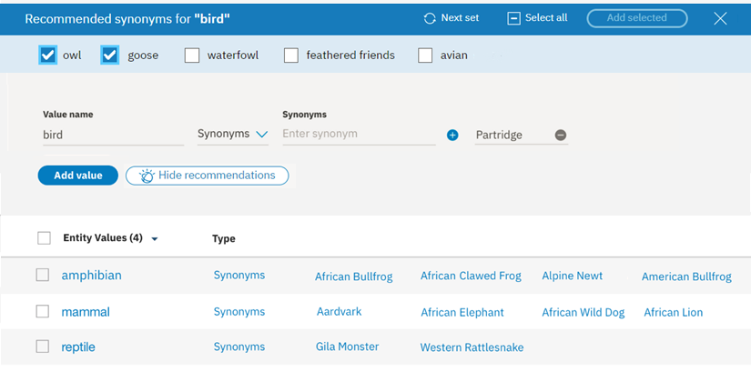
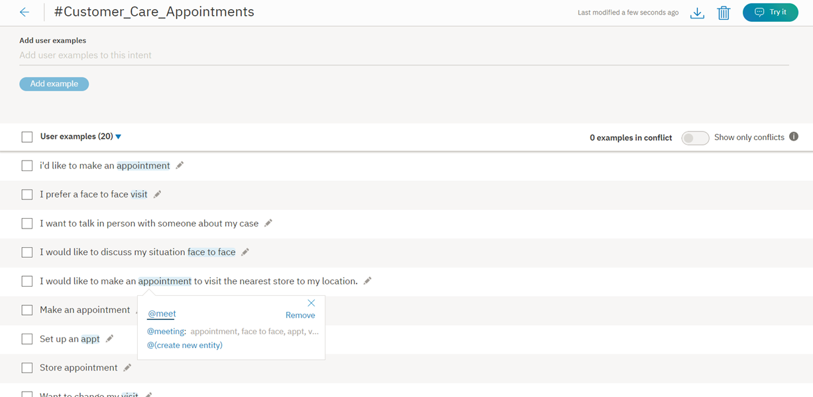

---

copyright:
  years: 2015, 2019
lastupdated: "2019-02-28"

subcollection: assistant

---

{:shortdesc: .shortdesc}
{:new_window: target="_blank"}
{:deprecated: .deprecated}
{:important: .important}
{:note: .note}
{:tip: .tip}
{:pre: .pre}
{:codeblock: .codeblock}
{:screen: .screen}
{:javascript: .ph data-hd-programlang='javascript'}
{:java: .ph data-hd-programlang='java'}
{:python: .ph data-hd-programlang='python'}
{:swift: .ph data-hd-programlang='swift'}

# Entitäten erstellen
{: #entities}

***Entitäten*** stellen Informationen in der Benutzereingabe dar, die für die Intention des Benutzers von Bedeutung sind. 

Wenn eine Absicht als Verb betrachtet wird (die Aktion, die der Benutzer ausführen möchte) ist eine Entität das Substantiv (das Objekt oder der Kontext für die Aktion). Wenn die *Absicht* beispielsweise darin besteht, eine Wettervorhersage abzurufen, werden die entsprechenden *Entitäten* für Ort und Datum benötigt, damit die Anwendung die gewünschte Vorhersage zurückgeben kann.

Durch das Erkennen von Entitäten in der Benutzereingabe können hilfreiche und zielgerichtete Antworten konfiguriert werden. Angenommen, Sie verfügen über die Absicht `#buy_something` (etwas einkaufen). Wenn die Absicht `#buy_something` durch die Anfrage eines Benutzers ausgelöst wird, soll die Antwort des Assistenten widerspiegeln, welches *Etwas* der Kunde kaufen möchte. Sie können eine Entität `@product` hinzufügen und diese Entität anschließend verwenden, um aus der Benutzereingabe Informationen zu dem Produkt zu extrahieren, an dem der Kunde interessiert ist. (Das Präfix `@` vor dem Entitätsnamen unterstützt die eindeutige Identifizierung des Elements als eine Entität.)

Schließlich können Sie mehrere Antworten zur Baumstruktur Ihres Dialogmoduls hinzufügen, deren Wortlaut entsprechend dem in der Benutzereingabe erkannten Wert für `@product` variieren kann.

<iframe class="embed-responsive-item" id="youtubeplayer" title="Mit Entitäten arbeiten" type="text/html" width="640" height="390" src="https://www.youtube.com/embed/o-uhdw6bIyI" frameborder="0" webkitallowfullscreen mozallowfullscreen allowfullscreen> </iframe>

## Entitätsauswertung im Überblick
{: #entities-described}

Der Service erkennt Entitäten in der Benutzereingabe mithilfe der folgenden Auswertungsmethoden: 

### Wörterverzeichnisbasierte Methode
{: #entities-dictionary-overview}

Der Service sucht in der Benutzereingabe nach Begriffen, die mit den von Ihnen für die Entität definierten Werten, Synonymen oder Mustern übereinstimmen. 

- **Synonymentität**: Sie definieren eine Begriffskategorie in Form einer Entität (`color`) und anschließend mindestens einen Wert in dieser Kategorie (`blue`). Für jeden Wert geben Sie mehrere Synonyme an (`aqua`, `navy`). Sie können Synonyme zum Hinzufügen auch aus Empfehlungen auswählen, die vom Service bereitgestellt werden. 

    Während der Laufzeit erkennt der Service Begriffe in der Benutzereingabe, die genau mit den Werten oder Synonymen übereinstimmen, die Sie für die Entität definiert haben, als Erwähnungen der betreffenden Entität.
- **Musterentität**: Sie definieren ein Begriffskategorie in Form einer Entität (`contact_info`) und anschließend mindestens einen Wert in dieser Kategorie (z. B. `email`). Für jeden Wert geben Sie einen regulären Ausdruck an, der das Textmuster für Erwähnungen dieses Werttyps definiert. Für einen Wert der Entität `email` können Sie beispielsweise einen regulären Ausdruck angeben, der ein Muster `text@text.com` definiert.

    Während der Laufzeit sucht der Service in der Benutzereingabe nach Mustern, die mit Ihrem regulären Ausdruck übereinstimmen, und identifiziert alle gefundenen Übereinstimmungen als Erwähnungen der betreffenden Entität.
- **Systementität**: Vordefinierte Synonymentitäten, die IBM für Sie bereitstellt. Diese Entitäten decken häufig verwendete Kategorien wie Zahlen, Datumsangaben und Zeitangaben ab. Sie müssen eine Systementität einfach nur aktivieren, damit sie verwendet werden kann.

### Kontextbasierte Methode
{: #entities-annotations-overview}

Wenn Sie eine kontextbasierte Entität definieren, wird ein Modell mit dem *annotierten Begriff* trainiert und mit dem *Kontext*, in dem der Bergriff in dem von Ihnen annotierten Satz verwendet wird. Anhand dieses neuen kontextbasierten Entitätsmodells kann der Service eine Konfidenzbewertung berechnen, die angibt, mit welcher Wahrscheinlichkeit ein Wort oder Ausdruck eine Instanz einer Entität ist. Diese Berechnung basiert auf der Verwendung dieses Worts oder Ausdrucks in der Benutzereingabe.

- **Kontextbasierte Entität**: Zuerst definieren Sie eine Begriffskategorie als eine Entität (`product`). Als Nächstes öffnen Sie die Seite *Absichten*, durchsuchen Ihre vorhandenen Benutzerbeispiele für Absichten nach Erwähnungen der Entität und kennzeichnen die Erwähnungen. Beispiel: Sie rufen die Absicht `#buy_something` auf und finden ein Benutzerbeispiel mit dem Wortlaut `Ich möchte eine Tasche von Coach kaufen`. Sie können die Angabe `Tasche von Coach` als Erwähnung der Entität `@product` kennzeichnen.

    Für Trainingszwecke wird der von Ihnen annotierte Begriff `Tasche von Coach` als Wert für die Entität `@product` hinzugefügt. 

    Während der Laufzeit werden Begriffe vom Service allein auf der Basis des Kontexts ausgewertet, in dem sie in diesem Satz verwendet werden. Wenn die Struktur einer Benutzeranfrage, in der der Begriff erwähnt wird, mit der Struktur eines Benutzerbeispiels für die Absicht übereinstimmt, in dem eine Erwähnung markiert ist, dann interpretiert der Service den Begriff als Erwähnung dieses Entitätstyps. Angenommen, die Benutzereingabe enthält die Äußerung `Ich möchte eine Gucci-Tasche kaufen`. Aufgrund der Ähnlichkeit der Satzstruktur mit dem Benutzerbeispiel, das Sie annotiert haben (`Ich möchte eine Tasche von Coach kaufen`), erkennt der Service `Gucci-Tasche` als eine Erwähnung der Entität `@product`.

    Wenn ein kontextbasiertes Entitätsmodell für eine Entität verwendet wird, sucht der Service *nicht* nach exakten Text- oder Musterentsprechungen für die Entität in der Benutzereingabe, sondern legt den Fokus auf den Kontext des Satzes, in dem die Entität erwähnt wird.

    Wenn Sie Entitätswerte mithilfe von Annotationen definieren möchten, fügen Sie mindestens 10 Annotationen pro Entität hinzu, damit das kontextbasierte Entitäsmodell über einen hinreichenden Datenbestand verfügt, um verlässliche Ergebnisse zu liefern. 

## Entitäten erstellen
{: #entities-creating-task}

Zum Erstellen von Entitäten verwenden Sie das {{site.data.keyword.conversationshort}}-Tool.

1.  Öffnen Sie Ihren Dialogskill im {{site.data.keyword.conversationshort}}-Tool und klicken Sie anschließend auf die Registerkarte **Entitäten**. Falls die Registerkarte **Entitäten** nicht angezeigt wird, öffnen Sie die Seite über das Menü .

1.  Klicken Sie auf **Entität hinzufügen**.

    Sie können auch auf **Systementitäten verwenden** klicken und dann eine Auswahl in einer Liste allgemeiner Entitäten treffen, die durch {{site.data.keyword.IBM_notm}} bereitgestellt werden und auf einen beliebigen Anwendungsfall angewendet werden können. Weitere Details hierzu finden Sie unter [Systementitäten aktivieren](#entities-enable-system-entities).

1.  Geben Sie im Feld **Entitätsname** einen beschreibenden Namen für die Entität ein.

    Der Entitätsname kann Buchstaben (in Unicode), Ziffern, Unterstreichungszeichen und Bindestriche enthalten. Beispiel:
    - `@standort`
    - `@option_für_menü`
    - `@produkt`

    Fügen Sie keine Leerzeichen in den Namen ein. Der Name darf nicht länger als 64 Zeichen sein. Außerdem darf der Name nicht mit der Zeichenfolge `sys-` beginnen, die für Systementitäten reserviert ist.

    Das Tool fügt automatisch das Zeichen @ in den Entitätsnamen ein, d. h. Sie müssen dieses Zeichen nicht manuell einfügen.
    {: tip}

1.  Klicken Sie auf **Entität erstellen**.

    

1.  Wählen Sie aus, ob der Service mit der wörterverzeichnisbasierten oder mit der kontextbasierten Methode nach Erwähnungen der Entität suchen soll, und führen Sie dann die entsprechende Prozedur aus. 

    **Wählen Sie für jede von Ihnen erstellte Entität genau einen Entitätstyp aus, der verwendet werden soll.** Sobald Sie eine Annotation für eine Entität hinzufügen, wird das kontextbasierte Modell initialisiert und als primäre Methode zum Analysieren der Benutzereingabe verwendet, um Erwähnungen dieser Entität zu finden. Der Kontext, in dem die Erwähnung in der Benutzereingabe verwendet wird, hat Vorrang vor allen möglicherweise vorhandenen exakten Übereinstimmungen. Weitere Informationen zur Auswertung der einzelnen Typen enthält der Abschnitt [Entitätsauswertung im Überblick](#entities-described).

    - [Wörterverzeichnisbasierte Entitäten](#entities-create-dictionary-based)
    - [Kontextbasierte Entitäten](#entities-create-annotation-based)

## Wörterverzeichnisbasierte Entitäten hinzufügen
{: #entities-create-dictionary-based}

Für wörterverzeichnisbasierte Entitäten definieren Sie bestimmte Begriffe, Synonyme oder Muster. Während der Laufzeit findet der Service Entitätserwähnungen nur, wenn ein Begriff in der Benutzereingabe genau (oder annähernd, wenn die unscharfe Suche aktiviert ist) mit dem Wert oder mit einem der zugehörigen Synonyme übereinstimmt.

1.  Geben Sie im Feld **Wertname** den Text für einen möglichen Wert für die Entität ein und drücken Sie die `Eingabetaste`. Ein Entitätswert kann eine beliebige Zeichenfolge mit einer Länge von bis zu 64 Zeichen sein.

    **Wichtig:** Verwenden Sie in Entitätsnamen oder -werten keine vertraulichen oder persönlichen Daten. Es kann sein, dass die Namen und Werte in einer App in URLs zu sehen sind.

1.  Wenn der Service Begriffe mit einer ähnlichen Syntax wie die von Ihnen angegebenen Entitätswerte und Synonyme erkennen soll, die keine exakte Entsprechung sein müssen, setzen Sie das Umschaltsteuerelement **Unscharfe Suche** auf 'Ein'.

    Dieses Feature ist für Sprachen verfügbar, die im Abschnitt [Unterstützte Sprachen](/docs/services/assistant?topic=assistant-language-support) aufgeführt sind.

    **Unscharfe Suche**
    {: #entities-fuzzy-matching}

    Für die unscharfe Suche stehen die folgenden Komponenten zur Verfügung: 

    - *Normalformenreduktion*: Das Feature erkennt die Stammform von Entitätswerten, die mehrere grammatikalische Formen besitzen. Der Stamm von 'Bananen' lautet beispielsweise 'Banane', der Stamm von 'laufend' ist 'laufen'.
    - *Rechtschreibfehler*: Das Feature kann die Benutzereingabe der entsprechenden Entität trotz einer falschen Schreibweise oder leichten syntaktischen Abweichungen zuordnen. Wenn Sie beispielsweise *Giraffe* als Synonym einer Entität für ein Tier definieren und die Benutzereingabe die Begriffe *giraffes* oder *girafe* enthält, kann die unscharfe Suche den Begriff korrekt der Entität für das Tier zuordnen.
    - *Suche mit teilweiser Übereinstimmung*: Bei der Suche mit teilweiser Übereinstimmung schlägt das Feature automatisch auf Teilzeichenfolgen basierende Synonyme vor, die in den benutzerdefinierten Entitäten enthalten sind, und ordnet eine im Vergleich zur exakten Übereinstimmung mit der Entität geringere Konfidenzbewertung zu.

    In der englischen Sprache verhindert die unscharfe Suche die Erfassung einiger allgemeiner und gültiger englischer Wörter als grobe Übereinstimmung für eine bestimmte Entität. Dieses Feature verwendet Wörter aus dem englischen Standardwörterbuch. Wenn Sie einen Entitätswert bzw. ein Synonym 'Englisch' definieren, ordnet die unscharfe Suche nur den von Ihnen definierten Entitätswert bzw. das von Ihnen definierte Synonym zu. Bei der unscharfen Suche wird der Begriff `unsicher` möglicherweise dem Begriff `Versicherung` zugeordnet. Wenn Sie jedoch `unsicher` als Wert bzw. Synonym für eine Entität wie `@option` definiert haben, wird `unsicher` immer der Entität `@option` zugeordnet und nicht dem Begriff `Versicherung`.
    {: note}

    Ihre Einstellungen für die unscharfe Suche wirken sich nicht auf die Synonymempfehlungen aus. Auch wenn die unscharfe Suche aktiviert ist, werden ausschließlich Synonyme für den von Ihnen angegebenen exakten Wert vorgeschlagen und nicht für den Wert und für leichte Abwandlungen des Werts.

1.  Sobald Sie einen Wertnamen eingegeben haben, können Sie anschließend für diesen Entitätswert Synonyme hinzufügen oder bestimmte Muster definieren, indem Sie entweder `Synonyme` oder `Muster` im Dropdown-Menü *Typ* auswählen.

    

    **Hinweis:** Sie können *entweder* Synonyme oder Muster für einen einzelnen Entitätswert hinzufügen, jedoch nicht beides. 

    ***Synonyme***
    {: #entities-synonyms}

    - Geben Sie in das Feld **Synonyme** beliebige Synonyme für den Entitätswert ein. Ein Synonym kann eine beliebige Zeichenfolge mit einer Länge von bis zu 64 Zeichen sein.

      

      Der {{site.data.keyword.conversationshort}}-Service kann darüber hinaus Synonyme für Ihre Entitätswerte empfehlen. Die Empfehlungsfunktion findet zugehörige Synonyme basierend auf der kontextbezogenen Ähnlichkeit durch Extrahierung aus einem großen Datenbestand, der umfangreiche Quellen mit geschriebenem Text enthält. Dabei kommen Verarbeitungsverfahren für natürliche Sprache zum Einsatz, um Wörter zu finden, die Ähnlichkeit mit den vorhandenen Synonymen in Ihrem Entitätswert haben. 

    - Klicken Sie auf **Empfehlungen anzeigen**.

    - Der {{site.data.keyword.conversationshort}}-Service schlägt mehrere Empfehlungen für Synonyme vor. Die Begriffe werden zwar in Kleinschreibung angezeigt, aber der Service erkennt Erwähnungen der Synonyme unabhängig von der Klein- oder Großschreibung. 

      Je größer die Kohärenz Ihrer Entitätswertsynonyme, umso relevanter und zutreffender die Empfehlungen. Wenn Sie beispielsweise über mehrere Wörter verfügen, die sich auf ein Thema beziehen, dann führen diese zu besseren Vorschlägen als ein oder zwei zufällig ausgewählte Wörter. {: tip}

      

    - Wählen Sie alle Synonyme aus, die Sie einbeziehen möchten, und klicken Sie anschließend auf **Ausgewählte hinzufügen**.

      Sie müssen auf die Schaltfläche **Ausgewählte hinzufügen** für alle Synonyme klicken, die Sie zum Hinzufügen ausgewählt haben. Wenn Sie mit der nächsten Gruppe fortfahren, ohne auf diese Schaltfläche zu klicken, gehen Ihre Auswahlen verloren. 

      

    - Der {{site.data.keyword.conversationshort}}-Service fügt diese Synonyme zu Ihrer Entität hinzu und schlägt weitere Synonyme vor. 

      Wenn Sie keine weiteren Synonymempfehlungen erhalten, kann dies daran liegen, dass Ihre Entität bereits gut definiert ist oder Inhalte enthält, die von der Empfehlungsfunktion derzeit nicht verarbeitet werden können.
      {: tip}

      Wenn Sie ein empfohlenes Synonym nicht auswählen, wird es vom System wie ein Begriff behandelt, der für Sie nicht von Interesse ist. Außerdem wird die nächste Gruppe mit Empfehlungen geändert, die angezeigt wird, wenn Sie auf `Ausgewählte hinzufügen` oder `Nächste Gruppe` klicken. Diese Situation tritt nur beim Auswählen von Synonymen auf, da der Service Informationen zu übersprungenen Synonymen ausschließlich für diesen Zweck verwendet. {: note}

      

      Fügen Sie nach Bedarf weitere Synonyme hinzu. Nachdem Sie alle gewünschten Empfehlungen akzeptiert haben, klicken Sie auf das Symbol **X**, um die Anzeige zu schließen.

    ***Muster***
    {: #entities-patterns}

    - Im Feld **Muster** können Sie bestimmte Muster für einen Entitätswert definieren. Ein Muster **muss** im Feld als regulärer Ausdruck eingegeben werden.

      - Für jeden Entitätswert kann es höchstens 5 Muster geben.
      - Jedes Muster (d. h. jeder reguläre Ausdruck) ist auf 512 Zeichen begrenzt. 

      
      {: #entities-pattern-entities}

      Wie im Beispiel für die Entität *ContactInfo* angegeben, können die Muster für die Werte für Telefon, E-Mail und Website wie folgt definiert werden:
      - Telefon
        - `localPhone`: `(\d{3})-(\d{4})`, z. B. 426-4968
        - `fullUSphone`: `(\d{3})-(\d{3})-(\d{4})`, z. B. 800-426-4968
        - `internationalPhone`: `^(\(?\+?[0-9]*\)?)?[0-9_\- \(\)]*$`, z. B. +44 1962 815000
      - `email`: `\b[A-Za-z0-9._%+-]+@[A-Za-z0-9.-]+\.[A-Za-z]{2,}\b`, z. B. name@ibm.com
      - `website`: `(https?:\/\/)?([\da-z\.-]+)\.([a-z\.]{2,6})([\/\w \.-]*)*\/?$`, z. B. https://www.ibm.com

      Bei der Verwendung von Musterentitäten ist es häufig erforderlich, den Text, der mit dem Muster übereinstimmt, innerhalb der Baumstruktur für das Dialogmodul in einer Kontextvariablen (oder Aktionsvariablen) zu speichern. Weitere Informationen enthält der Abschnitt [Kontextvariable definieren](/docs/services/assistant?topic=assistant-dialog-runtime#dialog-runtime-context-var-define).

      Beispiel: Sie wollen einen Benutzer nach seiner E-Mail-Adresse fragen. Die Bedingung des Dialogmodulknotens enthält eine Bedingung ähnlich wie `@contactInfo:email`. Um die vom Benutzer eingegebene E-Mail-Adresse als Kontextvariable zuzuordnen, kann die folgende Syntax verwendet werden, um die Musterübereinstimmung im Antwortteil des Dialogmodulknotens zu erfassen:

      <table>
      <caption>Muster speichern</caption>
        <tr>
          <th>Variable</th>
          <th>Wert</th>
        </tr>
        <tr>
          <td>email</td>
          <td>`<? @contactInfo.literal ?>`</td>
        </tr>
      </table>

      ***Erfassungsgruppen***
      {: #entities-capture-group}

      Bei regulären Ausdrücken wird jeder Teil eines Musters, der in runde Klammern eingeschlossen ist, als eine Gruppe erfasst. Die Entität `@ContactInfo` verfügt beispielsweise über einen Musterwert mit dem Namen `fullUSphone`, der drei Erfassungsgruppen enthält: 

      - `(\d{3})` - Ortsnetzkennzahl der USA
      - `(\d{3})` - Präfix
      - `(\d{4})` - Durchwahlnummer

      Die Gruppierung kann beispielsweise hilfreich sein, wenn der Service '{{site.data.keyword.conversationshort}}' Benutzer nach ihrer Telefonnummer fragen und in der zugehörigen Antwort nur die Ortsnetzkennzahl der bereitgestellten Telefonnummer verwenden soll.

      Um die vom Benutzer eingegebene Ortsnetzkennzahl als Kontextvariable zuzuordnen, kann die folgende Syntax verwendet werden, um die Gruppenübereinstimmung im Antwortteil des Dialogmodulknotens zu erfassen:

      <table>
      <caption>Erfassungsgruppe speichern</caption>
        <tr>
          <th>Variable</th>
          <th>Wert</th>
        </tr>
        <tr>
          <td>area_code</td>
          <td>`<? @ContactInfo.groups[1] ?>`</td>
        </tr>
      </table>

      Weitere Informationen zur Verwendung von Erfassungsgruppen in Ihrem Dialogmodul enthält der Abschnitt [Entitätsmustergruppen in der Eingabe erkennen und speichern](/docs/services/assistant?topic=assistant-dialog-tips#dialog-tips-get-pattern-groups).

      Bei der vom Service '{{site.data.keyword.conversationshort}}' eingesetzten Musterabgleichsengine bestehen einige Einschränkungen hinsichtlich der Syntax. Dies ist notwendig, um Leistungsprobleme zu verhindern, die bei Verwendung anderer Engines für reguläre Ausdrücke auftreten könnten.

      - Entitätsmuster dürfen Folgendes nicht enthalten:
        - Positive Wiederholungen (z. B. `x*+`)
        - Rückverweise (z. B. `\g1`)
        - Bedingte Verzweigungen (z. B. `(?(cond)true)`)
      - Wenn eine Musterentität mit einem Unicode-Zeichen beginnt oder endet und Wortgrenzen enthält (z. B. `\bš\b`), kann das Muster die Wortgrenze nicht ordnungsgemäß berücksichtigen. Im vorliegenden Beispiel wird für die Eingabe `š zkouška` als Übereinstimmung `Group 0: 6-7 š` (`š zkou`_**`š`**_`ka`) zurückgegeben und nicht die korrekte Übereinstimmung `Group 0: 0-1 š` (_**`š`**_ `zkouška`).

      Die Engine für reguläre Ausdrücke basiert grob auf der Java-Engine für reguläre Ausdrücke. Der Service '{{site.data.keyword.conversationshort}}' erzeugt einen Fehler, wenn Sie versuchen, ein nicht unterstütztes Muster über die API oder in der Toolbenutzerschnittstelle des Service '{{site.data.keyword.conversationshort}}' hochzuladen.

1.  Klicken Sie auf **Wert hinzufügen** und wiederholen Sie den Prozess, um weitere Entitätswerte hinzuzufügen.

1.  Nachdem Sie das Hinzufügen von Entitätswerten abgeschlossen haben, klicken Sie auf den , um das Erstellen der Entität abzuschließen.

Die von Ihnen erstellte Entität wird zur Registerkarte **Entitäten** hinzugefügt. Das System beginnt nun damit, sich selbst mit den neuen Daten zu trainieren.

## Kontextbasierte Entitäten hinzufügen
{: #entities-create-annotation-based}

Kontextbasierte Entitäten sind Entitäten, deren Vorkommen Sie in Beispielsätzen annotieren, damit der Service erkennen kann, in welchem Kontext die Entität normalerweise verwendet wird. 

Beim Trainieren eines kontextbasierten Entitätsmodells können Sie von Ihren Absichtsbeispielen profitieren, die sofort verfügbare Sätze zum Annotieren bereitstellen. 

Die Verwendung der Benutzerbeispiele für eine Absicht beim Definieren kontextbasierter Entitäten hat keine Auswirkung auf die Klassifizierung der betreffenden Absicht. Entitätserwähnungen, die Sie annotieren, werden ebenfalls als Synonyme zu dieser Entität hinzugefügt. Außerdem werden Synonymerwähnungen in Benutzerbeispielen für Absichten bei der Absichtsklassifizierung verwendet, um einen schwachen Bezug zwischen einer Absicht und einer Entität herzustellen.
{: note}

1.  Öffnen Sie Ihren Skill im {{site.data.keyword.conversationshort}}-Tool und klicken Sie anschließend auf die Registerkarte **Absichten**. Falls die Registerkarte **Absichten** nicht angezeigt wird, öffnen Sie die Seite über das Menü .

1.  Klicken Sie auf eine Absicht, um sie zu öffnen.

    Im vorliegenden Beispiel definiert die Absicht `#place_order` die Bestellfunktion für ein Online-Einzelhandelsgeschäft.

    

1.  Überprüfen Sie die Absichtsbeispiele auf potenzielle Entitätserwähnungen. Heben Sie eine potenzielle Entitätserwähnung in den Beispielen für Absichten hervor. 

    Im vorliegenden Beispiel ist `computer` die Entitätserwähnung.

    

    Das Symbol 'Bearbeiten'  wird verwendet, um ein Benutzerbeispiel für eine Absicht zu bearbeiten. Diese Funktion gehört nicht zum Hinzufügen von Annotationen.{: tip}

1.  Ein Feld 'Suche' wird geöffnet, das Sie zum Suchen nach der Entität verwenden können, die von einem hervorgehobenen Wort oder Ausdruck erwähnt wird. 

    

    Im vorliegenden Beispiel liefert der Suchbegriff `prod` Übereinstimmungen für die Entität `@product`.

    

    Wenn Entitätswerte für die Entität vorhanden sind, werden diese nur für Informationszwecke angezeigt. Sie sind im Begriff, eine Annotation für die Entität hinzuzufügen und nicht für einen bestimmten Entitätswert. 

    Wenn Sie dem Modell beibringen möchten, dass die Erwähnung ein Synonym für einen vorhandenen Entitätswert ist, können Sie der Erwähnung einen bestimmten Entitätswert zuordnen. {: important}

    So ordnen Sie der Erwähnung einen bestimmten Entitätswert zu: 

    1.  Geben Sie den vollständigen Entitätsnamen und -wert in das Suchfeld ein. Geben Sie zum Beispiel `@product:IT` ein.
    1.  Wenn der Entitätswert im Dropdown-Menü angezeigt wird, wählen Sie ihn aus. 

1.  Wählen Sie die Entität aus, zu der Sie die Annotation hinzufügen möchten. 

    Im vorliegenden Beispiel wird `computer` als eine Annotation für die Entität `@product` hinzugefügt.

    Erstellen Sie *mindestens* 10 Annotationen für jede kontextbasierte Entität; für die Verwendung in einer Produktionsumgebung wird eine noch höhere Anzahl von Annotationen empfohlen. {: important}

1.  Wenn keine der Entitäten geeignet ist, können Sie eine neue Entität erstellen, indem Sie **@(create new entity)** auswählen.

1.  Wiederholen Sie diesen Vorgang für jede Entitätserwähnung, die Sie annotieren möchten. 

    Stellen Sie sicher, dass jede Erwähnung eines Entitätstyps annotiert wird, der in den von Ihnen bearbeiteten Benutzerbeispielen vorkommt. Weitere Details enthält der Abschnitt [Es kommt darauf an, was nicht annotiert wird](#entities-counter-examples).
    {: important}

1.  Klicken Sie nun auf die Annotation, die Sie eben erstellt haben. Ein Feld mit dem Text `Wechseln zu <entity-name>` wird geöffnet. Durch Klicken auf den Link können Sie die Entität direkt aufrufen.

    

    Die Annotation wird zu der Entität hinzugefügt, der sie zugeordnet wurde, und das System beginnt damit, sich selbst mit den neuen Daten zu trainieren.

    Der Begriff, den Sie annotiert haben, wird als neuer Wörterverzeichniswert zu der Entität hinzugefügt. Wenn Sie den annotierten Begriff einem vorhandenen Entitätswert zugeordnet haben, wird der Begriff als Synonym für diesen Entitätswert hinzugefügt und nicht als unabhängiger Entitätswert.
    {: important}

1.  Um alle Erwähnungen anzuzeigen, die Sie für eine bestimmte Entität annotiert haben, klicken Sie auf der Konfigurationsseite der Entität auf die Registerkarte **Annotation**.

    

    Kontextbasierte Entitäten können Werte verstehen, die Sie nicht explizit definiert haben. Das System erstellt Prognosen für zusätzliche Entitätswerte auf der Grundlage Ihrer annotierten Benutzerbeispiele und verwendet diese Werte zum Trainieren anderer Entitäten. Alle ähnlichen Benutzerbeispiele werden zur Ansicht *Annotation* hinzugefügt, damit Sie erkennen können, wie sich diese Option auf das Trainieren auswirkt. {: note}

    Wenn Ihre kontextbasierten Entitäten nicht dieses erweiterte Verständnis von Entitätswerten verwenden sollen, wählen Sie alle Benutzerbeispiele für die betreffende Entität in der Ansicht *Annotation* aus und klicken Sie anschließend auf **Löschen**.

Im folgenden Video wird dargestellt, wie Entitätserwähnungen annotiert werden. 

<iframe class="embed-responsive-item" id="youtubeplayer0" title="Entitätserwähnungen annotieren" type="text/html" width="640" height="390" src="https://www.youtube.com/embed/3WjzJpLsnhQ" frameborder="0" webkitallowfullscreen mozallowfullscreen allowfullscreen> </iframe>

Wenn Sie ein Lernprogramm zum Definieren kontextbasierter Entitäten durcharbeiten möchten, bevor Sie eigene Entitäten hinzufügen, rufen Sie das [Lernprogramm: Kontextbasierte Entitäten definieren](https://www.ibm.com/cloud/garage/demo/try-watson-assistant-contextual-entities){: new_window} auf.

### Es kommt darauf an, was nicht annotiert wird
{: #entities-counter-examples}

Wenn ein annotiertes Beispiel für eine Absicht vorliegt und ein anderes Wort in diesem Beispiel mit dem Wert oder mit einem Synonym derselben Entität übereinstimmt, der bzw. das *nicht* annotiert ist, dann hat die fehlende Annotation Auswirkungen. Das Modell lernt auch aus dem Kontext des Begriffs, den Sie nicht annotiert haben. Das bedeutet, wenn Sie einen Begriff in einem Benutzerbeispiel als Erwähnung einer Entität beschriften, dann sollten Sie auch alle anderen maßgeblichen Erwähnungen beschriften. 

1.  Die Absicht `#Customer_Care_Appointments` enthält zwei Beispiele für die Absicht mit dem Wort `visit`.

    

1.  Im ersten Beispiel möchten Sie das Wort `visit` als Entitässwert der Entität `@meeting` annotieren. Dadurch wird `visit` äquivalent zu anderen Entitätswerten für `@meeting` wie `appointment` (etwa in den Sätzen 'I'd like do make an appointment' oder 'I'd like to schedule a visit').

    

1.  Im zweiten Beispiel wird das Wort `visit` nicht im Kontext eines Treffens verwendet. In diesem Fall können Sie das Wort `appointment` in dem Beispiel für die Absicht auswählen und als Entitätswert der Entität `@meeting` annotieren. Das Modell lernt aus der Tatsache, dass das Wort `visit` im selben Beispiel nicht annotiert ist.

    

## Systementitäten aktivieren
{: #entities-enable-system-entities}

Der Service '{{site.data.keyword.conversationshort}}' bietet eine Reihe von *Systementitäten*. Hierbei handelt es sich um allgemeine Entitäten, die Sie für jede beliebige Anwendung nutzen können. Durch die Aktivierung einer Systementität kann Ihr Skill schnell mit Trainingsdaten gefüllt werden, die in vielen Anwendungsfällen vorkommen.

Mithilfe von Systementitäten kann ein breites Spektrum von Werten für die Objekttypen erkannt werden, die durch die Entitäten dargestellt werden. Beispielsweise ergibt die Systementität `@sys-number` eine Übereinstimmung für jeden numerischen Wert, was auch ganze Zahlen, Dezimalbrüche oder sogar Zahlwörter beinhaltet.

Systementitäten werden zentral verwaltet, weshalb alle etwaigen  Aktualisierungen automatisch verfügbar sind. Systementitäten können nicht geändert werden.

1.  Klicken Sie auf der Registerkarte 'Entitäten' auf **Systementitäten**.

    

1.  Blättern Sie die Liste der Systementitäten durch, um die für Ihre Anwendung nützlichen Entitäten auszuwählen.
    - Weitere Informationen zu einer Systementität (inklusive Beispiele für übereinstimmende Eingaben) können Sie anzeigen, indem Sie in der Liste auf die Entität klicken.
    - Details zu den verfügbaren Systementitäten enthält der Abschnitt [Systementitäten](/docs/services/assistant?topic=assistant-system-entities).

1.  Klicken Sie auf das Umschaltsteuerelement neben einer Systementität, um sie zu aktivieren bzw. zu inaktivieren.

Nachdem Sie Systementitäten aktiviert haben, beginnt der Service '{{site.data.keyword.conversationshort}}' mit dem erneuten Training. Nach Abschluss des Trainings können Sie die Entitäten verwenden.

## Begrenzungen für Entitäten
{: #entities-limits}

Die Anzahl der Entitäten, Entitätswerte und Synonyme, die Sie erstellen können, richtet sich nach Ihrem {{site.data.keyword.conversationshort}}-Serviceplan:

| Serviceplan      | Entitaten pro Skill | Entitätswerte pro Skill | Entitätssynonyme pro Skill |
|-------------------|-------------------:|------------------------:|--------------------------:|
| Premium           |               1000 |                 100.000 |                   100.000 |
| Plus              |               1000 |                 100.000 |                   100.000 |
| Standard          |               1000 |                 100.000 |                   100.000 |
| Lite              |                 25 |                 100.000 |                   100.000 |
{: caption="Serviceplandetails" caption-side="top"}

Systementitäten, die Sie für die Verwendung aktivieren, werden in die Zählung der Gesamtwerte für die Nutzung Ihres Plans einbezogen.

| Serviceplan | Kontextbasierte Entitäten und Annotationen |
|--------------|------------------------------------:|
| Premium      |        30 kontextbasierte Entitäten mit 3000 Annotationen |
| Plus         |        20 kontextbasierte Entitäten mit 2000 Annotationen |
| Standard     |        20 kontextbasierte Entitäten mit 2000 Annotationen |
| Lite         |        10 kontextbasierte Entitäten mit 1000 Annotationen |
{: caption="Serviceplandetails (Fortsetzung)" caption-side="top"}

## Entitäten bearbeiten
{: #entities-edit}

Sie können auf jede Entität in der Liste klicken, um sie zu öffnen und zu bearbeiten. Sie können Entitäten umbenennen oder löschen sowie Werte, Synonyme oder Muster hinzufügen, bearbeiten bzw. löschen.

Wenn Sie den Entitätstyp von `synonym` in `pattern` ändern oder umgekehrt, werden die vorhandenen Werte zwar umgewandelt, aber sie sind in der vorliegenden Form möglicherweise nicht hilfreich.
{: note}

## Entitäten suchen
{: #entities-search}

Verwenden Sie die Suchfunktion, um Entitätsnamen, -werte und -synonyme zu finden.

1.  Klicken Sie auf der Seite **Entitäten** auf das Symbol 'Suche'.

    

    Nach Systementitäten kann nicht gesucht werden.
    {: note}

1.  Geben Sie einen Suchbegriff oder -ausdruck ein.

    

Entitäten, die Ihren Suchbegriff enthalten, und entsprechende Beispiele werden angezeigt.

  

## Entitäten exportieren
{: #entities-export}

Sie können mehrere Entitäten in eine CSV-Datei exportieren, um sie später zu importieren und für eine andere {{site.data.keyword.conversationshort}}-Anwendung zu verwenden.

- Informationen zum Muster sind im CSV-Export enthalten. Jede Zeichenfolge mit `/` als Begrenzungszeichen wird als Muster eingestuft (im Unterschied zu einem Synonym).
- Annotationen, die kontextbasierten Entitäten zugeordnet sind, werden nicht exportiert. Sie müssen den gesamten Dialogskill exportieren, um den Entitätswert und alle zugeordneten Annotationen zu erfassen. 

1.  Wählen Sie die gewünschten Entitäten aus und klicken Sie anschließend auf **Exportieren**.

    

## Entitäten importieren
{: #entities-import}

Bei einer großen Anzahl von Entitäten kann es einfacher sein, diese aus einer CSV-Datei zu importieren, als sie einzeln im {{site.data.keyword.conversationshort}}-Tool zu definieren.

Entitätsannotationen werden beim Importieren einer CSV-Datei mit Entitäten nicht berücksichtigt. Sie müssen den gesamten Dialogskill importieren, um die zugeordneten Annotationen für eine kontextbasierte Entität in diesem Skill beizubehalten. Wenn Sie nur Entitäten exportieren und importieren, werden alle kontextbasierten Entitäten, die Sie exportiert haben, nach dem Importieren als wörterverzeichnisbasierte Entitäten behandelt.
{: note}

1.  Erfassen Sie die Entitäten in einer CSV-Datei oder exportieren Sie sie aus einem Tabellenkalkulationsprogramm in eine CSV-Datei. Jede Zeile in der Datei muss das folgende erforderliche Format aufweisen:

    ```
    <entität>,<wert>,<synonyme>
    ```
    {: screen}

    Hierbei steht &lt;entität&gt; für den Namen der Entität, &lt;wert&gt; für einen Wert für die Entität und &lt;synonyme&gt; für eine durch Kommas getrennte Liste von Synonymen für diesen Wert.

    ```
    wochentag,Montag,Mo
    wochentag,Dienstag,Di,Die
    wochentag,Mittwoch,Mi
    wochentag,Donnerstag,Do,Don
    wochentag,Freitag,Fr
    wochentag,Samstag,Sa,Sonnabend
    wochentag,Sonntag,So
    monat,Januar,Jan
    monat,Februar,Feb
    monat,März,Mär
    monat,April,Apr
    monat,Mai
    ```
    {: screen}

    Beim Importieren einer CSV-Datei werden auch Muster importiert. Jede Zeichenfolge mit `/` als Begrenzungszeichen wird als Muster eingestuft (im Unterschied zu einem Synonym).

    ```
    ContactInfo,localPhone,/(\d{3})-(\d{4})/
    ContactInfo,fullUSphone,/(\d{3})-(\d{3})-(\d{4})/
    ContactInfo,internationalPhone,/^(\(?\+?[0-9]*\)?)?[0-9_\- \(\)]*$/
    ContactInfo,email,/\b[A-Za-z0-9._%+-]+@[A-Za-z0-9.-]+\.[A-Za-z]{2,}\b/
    ContactInfo,website,/(https?:\/\/)?([\da-z\.-]+)\.([a-z\.]{2,6})([\/\w \.-]*)*\/?$/
    ```
    {: screen}

    Speichern Sie die CSV-Datei in UTF-8-Codierung und ohne Byteanordnungsmarkierung. Die maximale Größe der CSV-Datei beträgt 10 MB. Wenn Ihre CSV-Datei größer ist, können Sie sie in mehrere Dateien aufteilen und diese dann separat importieren.  Öffnen Sie Ihren Dialogskill im {{site.data.keyword.conversationshort}}-Tool und klicken Sie anschließend auf die Registerkarte **Entitäten**. {: tip}

1.  Klicken Sie auf das Symbol  und ziehen Sie dann eine Datei. Suchen Sie alternativ auf Ihrem Computer nach einer Datei und wählen Sie sie aus. Die Datei wird validiert und importiert. Anschließend beginnt das System damit, sich selbst mit den neuen Daten zu trainieren.

Sie können die importierten Entitäten auf der Registerkarte 'Entitäten' anzeigen. Möglicherweise müssen Sie die Seite aktualisieren, damit die neuen Entitäten angezeigt werden.

## Entitäten löschen
{: #entities-delete}

Sie können eine gewünschte Anzahl von Entitäten auswählen, um sie anschließend zu löschen.

**WICHTIG**: Beim Löschen von Entitäten werden auch alle zugehörigen Werte, Synonyme oder Muster gelöscht. Diese Einträge können später nicht mehr abgerufen werden. Alle Dialogmodulknoten, die diese Entitäten referenzieren, müssen manuell aktualisiert werden, damit der gelöschte Inhalt nicht mehr referenziert wird.

1.  Wählen Sie die Entitäten aus, die Sie löschen möchten, und klicken Sie anschließend auf **Löschen**.

    
