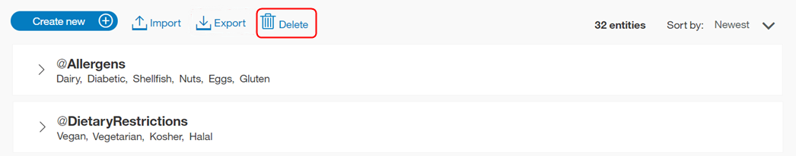
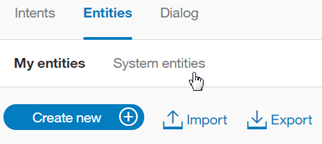

---

copyright:
  years: 2015, 2018
lastupdated: "2018-01-30"

---

{:shortdesc: .shortdesc}
{:new_window: target="_blank"}
{:tip: .tip}
{:pre: .pre}
{:codeblock: .codeblock}
{:screen: .screen}
{:javascript: .ph data-hd-programlang='javascript'}
{:java: .ph data-hd-programlang='java'}
{:python: .ph data-hd-programlang='python'}
{:swift: .ph data-hd-programlang='swift'}

# Entitäten definieren
{: #entities}

***Entitäten*** stellen eine Objektklasse oder einen Datentyp dar, die/der für den Zweck eines Benutzers relevant ist. Durch die Erkennung der Entitäten, die in der Benutzereingabe erwähnt werden, kann der Service '{{site.data.keyword.conversationshort}}' die entsprechenden Aktionen auswählen, die zur Erfüllung einer Absicht erforderlich sind.

<iframe class="embed-responsive-item" id="youtubeplayer" type="text/html" width="640" height="390" src="https://www.youtube.com/embed/kAZ9m-oCKxM" frameborder="0" webkitallowfullscreen mozallowfullscreen allowfullscreen> </iframe>

## Begrenzungen für Entitäten
{: #entity-limits}

Die Anzahl der Entitäten, Entitätswerte und Synonyme, die Sie erstellen können, richtet sich nach Ihrem {{site.data.keyword.conversationshort}}-Serviceplan:

| Serviceplan      | Entitäten pro Arbeitsbereich | Entitätswerte pro Arbeitsbereich | Entitätssynonyme pro Arbeitsbereich |
|-------------------|-----------------------:|----------------------------:|--------------------------------:|
| Standard/ Premium |                          1000 |                            100.000 |                              100.000 |
| Lite              |                            25 |                            100.000 |                              100.000 |

Systementitäten, die Sie für die Verwendung aktivieren, werden in die Zählung der Gesamtwerte für die Nutzung Ihres Plans einbezogen.

## Entitäten erstellen
{: #creating-entities}

Zum Erstellen von Entitäten verwenden Sie das {{site.data.keyword.conversationshort}}-Tool.

1.  Öffnen Sie Ihren Arbeitsbereich im {{site.data.keyword.conversationshort}}-Tool und klicken Sie auf die Registerkarte **Entitäten**. Falls die Registerkarte **Entitäten** nicht angezeigt wird, öffnen Sie die Seite über das Menü .

1.  Klicken Sie auf **Entität hinzufügen**.

    Sie können auch auf **Systementitäten verwenden** klicken und dann eine Auswahl in einer Liste allgemeiner Entitäten treffen, die durch {{site.data.keyword.IBM_notm}} bereitgestellt werden und auf einen beliebigen Anwendungsfall angewendet werden können. Weitere Details hierzu finden Sie unter [Systementitäten aktivieren](#enable_system_entities).

1.  Geben Sie im Feld **Entitätsname** einen beschreibenden Namen für die Entität ein.

    Der Entitätsname kann Buchstaben (in Unicode), Ziffern, Unterstreichungszeichen und Bindestriche enthalten. Beispiel:
    - `@standort`
    - `@option_für_menü`
    - `@produkt`

    Geben Sie das Zeichen `@` nicht ein, wenn Sie Entitätsnamen im {{site.data.keyword.conversationshort}}-Tool erstellen. Entitätsnamen dürfen keine Leerzeichen enthalten und nicht länger als 64 Zeichen sein. Außerdem dürfen Entitätsnamen nicht mit der Zeichenfolge `sys-` beginnen, die für Systementitäten reserviert ist.
    {: tip}

1.  Wählen Sie **Entität erstellen** aus.

    

1.  Geben Sie im Feld **Wertname** den Text für einen möglichen Wert für die Entität ein und drücken Sie die `Eingabetaste`. Ein Entitätswert kann eine beliebige Zeichenfolge mit einer Länge von bis zu 64 Zeichen sein.

    > **Wichtig:** Verwenden Sie in Entitätsnamen oder -werten keine vertraulichen oder persönlichen Daten. Es kann sein, dass die Namen und Werte in einer App in URLs zu sehen sind.

1.  Klicken Sie auf die Schaltfläche **Unscharfe Suche**, um diese Funktion zu aktivieren bzw. zu inaktivieren. Die unscharfe Suche, also die Suche nach groben Übereinstimmungen, ist standardmäßig inaktiviert. Dieses Feature ist für Sprachen verfügbar, die im Abschnitt [Unterstützte Sprachen](lang-support.html) aufgeführt sind.
 {: #fuzzy-matching}

    Durch eine Aktivierung der unscharfen Suche können Sie die Fähigkeit des Service verbessern, Benutzereingabeterms mit einer Syntax zu erkennen, die Ähnlichkeit mit der Entität hat, ohne dass jedoch eine exakte Übereinstimmung erforderlich ist. Eine unscharfe Suche besteht aus drei Komponenten, nämlich aus der Normalformenreduktion (auch 'Stemming' genannt), aus Rechtschreibfehlern und aus der Suche mit teilweiser Übereinstimmung:
    - *Normalformenreduktion*: Das Feature erkennt die Stammform von Entitätswerten, die mehrere grammatikalische Formen besitzen. Der Stamm von 'Bananen' lautet beispielsweise 'Banane', der Stamm von 'laufend' ist 'laufen'.
    - *Rechtschreibfehler*: Das Feature kann die Benutzereingabe der entsprechenden Entität trotz einer falschen Schreibweise oder leichten syntaktischen Abweichungen zuordnen. Wenn Sie beispielsweise *Giraffe* als Synonym einer Entität für ein Tier definieren und die Benutzereingabe die Begriffe *giraffes* oder *girafe* enthält, kann die unscharfe Suche den Begriff korrekt der Entität für das Tier zuordnen.
    - *Suche mit teilweiser Übereinstimmung*: Bei der Suche mit teilweiser Übereinstimmung schlägt das Feature automatisch auf Teilzeichenfolgen basierende Synonyme vor, die in den benutzerdefinierten Entitäten enthalten sind, und ordnet eine im Vergleich zur exakten Übereinstimmung mit der Entität geringere Konfidenzbewertung zu.

    **Hinweis**: Bei englischer Sprache verhindert die unscharfe Suche die Erfassung einiger allgemeiner gültiger englischer Wörter als grobe Übereinstimmung für eine bestimmte Entität. Dieses Feature verwendet Wörter aus dem englischen Standardwörterbuch. Wenn Sie einen Entitätswert bzw. ein Synonym 'Englisch' definieren, ordnet die unscharfe Suche nur den von Ihnen definierten Entitätswert bzw. das von Ihnen definierte Synonym zu. Bei der unscharfen Suche wird der Begriff `unsicher` möglicherweise dem Begriff `Versicherung` zugeordnet. Wenn Sie jedoch `unsicher` als Wert bzw. Synonym für eine Entität wie `@option` definiert haben, wird `unsicher` immer der Entität `@option` zugeordnet und nicht dem Begriff `Versicherung`.

1.  Sobald Sie einen Wertnamen eingegeben haben, können Sie anschließend für diesen Entitätswert Synonyme hinzufügen oder bestimmte Muster definieren, indem Sie entweder `Synonyme` oder `Muster` im Dropdown-Menü *Typ* auswählen.

    

    > **Hinweis:** Sie können *entweder* Synonyme *oder* Muster für einen einzelnen Entitätswert hinzufügen, jedoch nicht beides.

    - Geben Sie im Feld **Synonyme** beliebige Synonyme für den Entitätswert ein. Ein Synonym kann eine beliebige Zeichenfolge mit einer Länge von bis zu 64 Zeichen sein.

      

    - Im Feld **Muster** können Sie bestimmte Muster für einen Entitätswert definieren. Ein Muster **muss** im Feld als regulärer Ausdruck eingegeben werden.

      
      {: #pattern-entities}

      Wie im Beispiel für die Entität *ContactInfo* angegeben, können die Muster für die Werte für Telefon, E-Mail und Website wie folgt definiert werden:
      - Telefon
        - `localPhone`: `(\d{3})-(\d{4})`, z. B. 426-4968
        - `fullUSphone`: `(\d{3})-(\d{3})-(\d{4})`, z. B. 800-426-4968
        - `internationalPhone`: `^(\(?\+?[0-9]*\)?)?[0-9_\- \(\)]*$`, z. B. +44 1962 815000
      - `email`: `\b[A-Za-z0-9._%+-]+@[A-Za-z0-9.-]+\.[A-Za-z]{2,}\b`, z. B. name@ibm.com
      - `website`: `(https?:\/\/)?([\da-z\.-]+)\.([a-z\.]{2,6})([\/\w \.-]*)*\/?$`, z. B. https://www.ibm.com

      Bei der Verwendung von Musterentitäten ist es häufig erforderlich, den Text, der mit dem Muster übereinstimmt, innerhalb der Baumstruktur für das Dialogmodul in einer Kontextvariablen (oder Aktionsvariablen) zu speichern.

      Beispiel: Sie wollen einen Benutzer nach seiner E-Mail-Adresse fragen. Die Bedingung des Dialogmodulknotens enthält eine Bedingung ähnlich wie `@contactInfo:email`. Um die vom Benutzer eingegebene E-Mail-Adresse als Kontextvariable zuzuordnen, kann die folgende Syntax verwendet werden, um die Musterübereinstimmung im Antwortteil des Dialogmodulknotens zu erfassen:

      ```json
      {
          "context" : {
              "email": "<? @contactInfo.literal ?>"
          }
      }
      ```
      {: screen}
      {: #capture-group}

      *Erfassungsgruppen*: Bei regulären Ausdrücken wird jeder Teil eines Musters, der in runde Klammern eingeschlossen ist, als eine Gruppe erfasst. Der Entitätswert `fullUSphone` enthält beispielsweise drei erfasste Gruppen:

        - `(\d{3})` - Ortsnetzkennzahl der USA
        - `(\d{3})` - Präfix
        - `(\d{4})` - Durchwahlnummer

      Die Gruppierung kann beispielsweise hilfreich sein, wenn der Service '{{site.data.keyword.conversationshort}}' Benutzer nach ihrer Telefonnummer fragen und in der zugehörigen Antwort nur die Ortsnetzkennzahl der bereitgestellten Telefonnummer verwenden soll.

      Um die vom Benutzer eingegebene Ortsnetzkennzahl als Kontextvariable zuzuordnen, kann die folgende Syntax verwendet werden, um die Gruppenübereinstimmung im Antwortteil des Dialogmodulknotens zu erfassen:

        ```json
        {
            "context" : {
                "area_code": "<? @fullUSphone.groups[1] ?>"
            }
        }
        ```
       {: screen}

      Weitere Informationen zur Verwendung von Erfassungsgruppen während der Laufzeit des Dialogmoduls finden Sie unter [Werte von Musterentitäten in Kontextvariablen speichern](dialog-overview-context-groups.html).

      Bei der vom Service '{{site.data.keyword.conversationshort}}' eingesetzten Musterabgleichsengine bestehen einige Einschränkungen hinsichtlich der Syntax. Dies ist notwendig, um Leistungsprobleme zu verhindern, die bei Verwendung anderer Engines für reguläre Ausdrücke auftreten könnten.
        - Entitätsmuster dürfen Folgendes nicht enthalten:
          - Positive Wiederholungen (z. B. `x*+`)
          - Rückverweise (z. B. `\g1`)
          - Bedingte Verzweigungen (z. B. `(?(cond)true)`)
        - Wenn eine Musterentität mit einem Unicode-Zeichen beginnt oder endet und Wortgrenzen enthält (z. B. `\bš\b`), kann das Muster die Wortgrenze nicht ordnungsgemäß berücksichtigen. Im vorliegenden Beispiel wird für die Eingabe `š zkouška` als Übereinstimmung `Group 0: 6-7 š` (`š zkou`_**`š`**_`ka`) zurückgegeben und nicht die korrekte Übereinstimmung `Group 0: 0-1 š` (_**`š`**_ `zkouška`).

      Die Engine für reguläre Ausdrücke basiert grob auf der Java-Engine für reguläre Ausdrücke. Der Service '{{site.data.keyword.conversationshort}}' erzeugt einen Fehler, wenn Sie versuchen, ein nicht unterstütztes Muster über die API oder in der Toolbenutzerschnittstelle des Service '{{site.data.keyword.conversationshort}}' hochzuladen.

1.  Klicken Sie auf **Wert hinzufügen** und wiederholen Sie den Prozess, um weitere Entitätswerte hinzuzufügen.

1.  Nachdem Sie die Entitätswerte hinzugefügt haben, wählen Sie den  aus, um das Erstellen der Entität abzuschließen.

### Ergebnisse

Die von Ihnen erstellte Entität wird zur Registerkarte **Entitäten** hinzugefügt. Das System beginnt nun damit, sich selbst mit den neuen Daten zu trainieren.

## Entitäten bearbeiten

Sie können auf jede Entität in der Liste klicken, um sie zu öffnen und zu bearbeiten. Sie können Entitäten umbenennen oder löschen sowie Werte, Synonyme oder Muster hinzufügen, bearbeiten bzw. löschen.

> **Hinweis**: Wenn Sie den Entitätstyp von `synonym` (Synonym) in `pattern` (Muster) ändern oder umgekehrt, werden die vorhandenen Werte zwar umgewandelt, aber sie sind in der vorliegenden Form möglicherweise nicht hilfreich.

## Entitäten suchen

Verwenden Sie die Suchfunktion, um Entitätsnamen, Werte und Synonyme zu finden.

1.  Wählen Sie die Registerkarte **Entitäten** in der Navigationsleiste und anschließend *Meine Entitäten* aus.

    

    **Hinweis**: Nach Systementitäten kann nicht gesucht werden.

1.  Wählen Sie das Symbol 'Suche'  aus.

1.  Geben Sie einen Suchbegriff oder -ausdruck ein.

    

    **Hinweis**: Beim ersten Suchvorgang wird ein Index erstellt. Gegebenenfalls weist eine Nachricht darauf hin, dass Sie warten müssen, bis die Indexierung des Inhalts abgeschlossen ist.

### Ergebnisse

Entitäten, die Ihren Suchbegriff enthalten, und entsprechende Beispiele werden angezeigt. Wählen Sie ein Ergebnis aus, damit es zum Bearbeiten geöffnet wird.

  

## Entitäten importieren

Bei einer großen Anzahl von Entitäten kann es einfacher sein, diese aus einer CSV-Datei zu importieren, als sie einzeln im {{site.data.keyword.conversationshort}}-Tool zu definieren.

1.  Erfassen Sie die Entitäten in einer CSV-Datei oder exportieren Sie sie aus einem Tabellenkalkulationsprogramm in eine CSV-Datei. Jede Zeile in der Datei muss das folgende erforderliche Format aufweisen:

    ```
    <entität>,<wert>,<synonyme>
    ```
    {: screen}

    Hierbei steht &lt;entität&gt; für den Namen der Entität, &lt;wert&gt; für einen Wert für die Entität und &lt;synonyme&gt; für eine durch Kommas getrennte Liste von Synonymen für diesen Wert.

    ```
    wochentag,Montag,Mo
    wochentag,Dienstag,Di,Die
    wochentag,Mittwoch,Mi
    wochentag,Donnerstag,Do,Don
    wochentag,Freitag,Fr
    wochentag,Samstag,Sa,Sonnabend
    wochentag,Sonntag,So
    monat,Januar,Jan
    monat,Februar,Feb
    monat,März,Mär
    monat,April,Apr
    monat,Mai
    ```
    {: screen}

    Beim Importieren einer CSV-Datei werden auch Muster importiert. Jede Zeichenfolge mit `/` als Begrenzungszeichen wird als Muster eingestuft (im Unterschied zu einem Synonym).

    ```
    ContactInfo,localPhone,/(\d{3})-(\d{4})/
    ContactInfo,fullUSphone,/(\d{3})-(\d{3})-(\d{4})/
    ContactInfo,internationalPhone,/^(\(?\+?[0-9]*\)?)?[0-9_\- \(\)]*$/
    ContactInfo,email,/\b[A-Za-z0-9._%+-]+@[A-Za-z0-9.-]+\.[A-Za-z]{2,}\b/
    ContactInfo,website,/(https?:\/\/)?([\da-z\.-]+)\.([a-z\.]{2,6})([\/\w \.-]*)*\/?$/
    ```
    {: screen}

    Speichern Sie die CSV-Datei in UTF-8-Codierung und ohne Byteanordnungsmarkierung. Die maximale Größe der CSV-Datei beträgt 10 MB. Wenn Ihre CSV-Datei größer ist, können Sie sie in mehrere Dateien aufteilen und diese dann separat importieren.  Öffnen Sie Ihren Arbeitsbereich im {{site.data.keyword.conversationshort}}-Tool und klicken Sie auf die Registerkarte **Entitäten**.
    {: tip}

1.  Klicken Sie auf das Symbol  und ziehen Sie dann eine Datei. Suchen Sie alternativ auf Ihrem Computer nach einer Datei und wählen Sie sie aus. Die Datei wird validiert und importiert. Anschließend beginnt das System damit, sich selbst mit den neuen Daten zu trainieren.

### Ergebnisse

Sie können die importierten Entitäten auf der Registerkarte 'Entitäten' anzeigen. Möglicherweise müssen Sie die Seite aktualisieren, damit die neuen Entitäten angezeigt werden.

## Entitäten exportieren
{: #export_entities}

Sie können mehrere Entitäten in eine CSV-Datei exportieren, um sie später zu importieren und für eine andere {{site.data.keyword.conversationshort}}-Anwendung zu verwenden.

Beim Exportieren einer CSV-Datei werden Muster unterstützt. Jede Zeichenfolge mit `/` als Begrenzungszeichen wird als Muster eingestuft (im Unterschied zu einem Synonym).{: tip}

1.  Wählen Sie die gewünschten Entitäten aus und wählen Sie dann **Exportieren** aus.

    

## Entitäten löschen
{: #delete_entities}

Sie können eine gewünschte Anzahl von Entitäten auswählen, um sie anschließend zu löschen.

**WICHTIG**: Beim Löschen von Entitäten werden auch alle zugehörigen Werte, Synonyme oder Muster gelöscht. Diese Einträge können später nicht mehr abgerufen werden. Alle Dialogmodulknoten, die diese Entitäten referenzieren, müssen manuell aktualisiert werden, damit der gelöschte Inhalt nicht mehr referenziert wird.

1.  Wählen Sie die gewünschten Entitäten aus und wählen Sie dann **Löschen** aus.

    

## Systementitäten aktivieren
{: #enable_system_entities}

Der Service '{{site.data.keyword.conversationshort}}' bietet eine Reihe von *Systementitäten*. Hierbei handelt es sich um allgemeine Entitäten, die Sie für jede beliebige Anwendung nutzen können. Durch die Aktivierung einer Systementität kann Ihr Arbeitsbereich schnell mit Trainingsdaten gefüllt werden, die für viele Anwendungsfällen gängig sind.

Mithilfe von Systementitäten kann ein breites Spektrum von Werten für die Objekttypen erkannt werden, die durch die Entitäten dargestellt werden. Beispielsweise ergibt die Systementität `@sys-number` eine Übereinstimmung für jeden numerischen Wert, was auch ganze Zahlen, Dezimalbrüche oder sogar Zahlwörter beinhaltet.

Systementitäten werden zentral verwaltet, weshalb alle etwaigen  Aktualisierungen automatisch verfügbar sind. Systementitäten können nicht geändert werden.

1.  Klicken Sie auf der Registerkarte 'Entitäten' auf **Systementitäten**.

    

1.  Blättern Sie die Liste der Systementitäten durch, um die für Ihre Anwendung nützlichen Entitäten auszuwählen.
    - Weitere Informationen zu einer Systementität (inklusive Beispiele für übereinstimmende Eingaben) können Sie anzeigen, indem Sie in der Liste auf die Entität klicken.
    - Details zu den verfügbaren Systementitäten enthält der Abschnitt [Systementitäten](system-entities.html).

1.  Klicken Sie auf das Umschaltsteuerelement neben einer Systementität, um sie zu aktivieren bzw. zu inaktivieren.

### Ergebnisse

Nachdem Sie Systementitäten aktiviert haben, beginnt der Service '{{site.data.keyword.conversationshort}}' mit dem erneuten Training. Nach Abschluss des Trainings können Sie die Entitäten verwenden.
