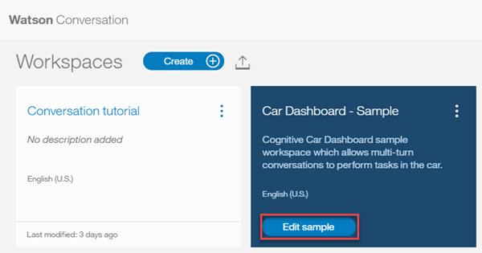

---

copyright:
  years: 2015, 2018
lastupdated: "2018-02-16"

---

{:shortdesc: .shortdesc}
{:new_window: target="_blank"}
{:tip: .tip}
{:pre: .pre}
{:codeblock: .codeblock}
{:screen: .screen}
{:javascript: .ph data-hd-programlang='javascript'}
{:java: .ph data-hd-programlang='java'}
{:python: .ph data-hd-programlang='python'}
{:swift: .ph data-hd-programlang='swift'}
{:download: .download}

# Lernprogramm 'Einführung'
{: #getting-started}

In diesem kurzen Lernprogramm stellen wir Ihnen das {{site.data.keyword.conversationshort}}-Tool vor und führen Sie durch die Erstellung Ihres ersten Dialogs.
{: shortdesc}

## Vorbemerkungen
{: #prerequisites}

Als Ausgangspunkt benötigen Sie eine Serviceinstanz.

<!-- Remove the text marked `download` after there's no g-s tab in the catalog dashboard -->

Sie haben Ihre Serviceinstanz erstellt. Klicken Sie auf **Verwalten** und danach auf **Starttool**. Fahren Sie mit Schritt 2 fort.
{: download tip}

Falls Sie bereits mit dem Service '{{site.data.keyword.conversationshort}}' eine Serviceinstanz erstellt haben, sind alle Voraussetzungen vorhanden. Fahren Sie mit Schritt 1 fort.

1.  Rufen Sie die Seite {{site.data.keyword.watson}} Developer Console [Services ](https://console.{DomainName}/developer/watson/services){: new_window} auf.
1.  Wählen Sie {{site.data.keyword.conversationshort}} aus, klicken Sie auf **Services hinzufügen** und registrieren Sie sich entweder für ein kostenloses {{site.data.keyword.Bluemix_notm}}-Konto oder melden Sie sich an.
1.  Ändern Sie den Projektnamen in `conversation-tutorial` und klicken Sie dann auf **Projekt erstellen**.

<!-- Remove this text after dedicated instances have the developer console: begin -->

Wenn Sie {{site.data.keyword.Bluemix_dedicated_notm}} verwenden, erstellen Sie Ihre Serviceinstanz auf der Seite [{{site.data.keyword.conversationshort}} ](https://console.{DomainName}/catalog/services/conversation/){: new_window} im Katalog.

<!-- Remove this text after dedicated instances have the developer console: end -->

## Schritt 1: Tool starten
{: #launch-tool}

Nachdem Sie ein Projekt erstellt haben, das den Service '{{site.data.keyword.conversationshort}}' enthält, wird die Seite mit den Projektdetails angezeigt. Starten Sie von dort aus das {{site.data.keyword.conversationshort}}-Tool.

Klicken Sie auf das **Starttool** für {{site.data.keyword.conversationshort}} unter **Services**.

<!-- To do: Add screenshot for developer console -->

Geben Sie nach der Aufforderung zum Anmelden bei dem Tool Ihre {{site.data.keyword.Bluemix_notm}}-Berechtigungsnachweise ein.

Wenn keine Seite mit Projektdetails für den Service '{{site.data.keyword.conversationshort}}' angezeigt wird, rufen Sie die Seite {{site.data.keyword.watson}} Developer Console [Projekte ](https://console.{DomainName}/developer/watson/projects) auf und wählen Sie das Projekt aus.
{: tip}

<!-- Remove this text after dedicated instances have the developer console: begin -->

{{site.data.keyword.Bluemix_dedicated_notm}}: Wählen Sie Ihre Serviceinstanz im Dashboard aus, um das Tool zu starten.

<!-- Remove this text after dedicated instances have the Developer Console: end -->

## Schritt 2: Arbeitsbereich erstellen
{: #create-workspace}

Ihr erster Schritt mit dem {{site.data.keyword.conversationshort}}-Tool ist die Erstellung eines Arbeitsbereichs.

Ein [*Arbeitsbereich*](configure-workspace.html) ist ein Container für die Artefakte, die den Dialogablauf definieren.

1.  Klicken Sie im {{site.data.keyword.conversationshort}}-Tool auf **Erstellen**.
1.  Ordnen Sie Ihrem Arbeitsbereich den Namen `{{site.data.keyword.conversationshort}} tutorial` zu. Wenn das Dialogmodul, das Sie erstellen möchten, eine andere Sprache als Englisch verwenden soll, wählen Sie die gewünschte Sprache in der Liste aus. Klicken Sie auf **Erstellen**. Anschließend wird die Registerkarte **Absichten** Ihres neuen Arbeitsbereichs angezeigt.

## Schritt 3: Absichten erstellen
{: #create-intents}

Eine [Absicht](intents.html) gibt den Zweck für die Eingabe eines Benutzers an. Absichten sind in etwa mit den Aktionen vergleichbar, die Benutzer mit einer Anwendung ausführen.

In diesem Beispiel werden der Einfachheit halber nur zwei Absichten definiert, eine für die Begrüßung und eine für die Verabschiedung.

1.  Vergewissern Sie sich, dass die Registerkarte 'Absichten' angezeigt wird. (Falls Sie den Arbeitsbereich gerade erstellt haben, sollte dies schon der Fall sein.)
1.  Klicken Sie auf **Absicht hinzufügen**.
1.  Weisen Sie der Absicht den Namen `hello` zu und klicken Sie dann auf **Absicht erstellen**.
1.  Geben Sie `hello` im Feld **Benutzerbeispiel hinzufügen** ein und drücken Sie anschließend die **Eingabetaste**.

   *Beispiele* teilen dem Service '{{site.data.keyword.conversationshort}}' mit, welche Arten von Benutzereingaben mit der Absicht übereinstimmen sollen. Je mehr Beispiele Sie angeben, desto genauer kann der Service die Benutzerabsichten erkennen.
1.  Fügen Sie vier weitere Beispiele hinzu:
    - `good morning`
    - `greetings`
    - `hi`
    - `howdy`

1.  Klicken Sie auf das Symbol **Schließen** , um das Erstellen der Absicht '#hello' abzuschließen.
1.  Erstellen Sie eine weitere Absicht namens '#goodbye' mit diesen fünf Beispielen:
    - `bye`
    - `farewell`
    - `goodbye`
    - `I'm done`
    - `see you later`

Sie haben zwei Absichten ('#hello' und '#goodbye') erstellt und Beispiele für Benutzereingaben angegeben, um {{site.data.keyword.watson}} für die Erkennung dieser Absichten in der Eingabe Ihrer Benutzer zu trainieren.

## Schritt 4: Absichten aus einem Katalog hinzufügen
{: #add-catalog}

Fügen Sie von IBM erstellte Trainingsdaten zu Ihrem Arbeitsbereich hinzu, indem Sie Absichten aus einem Katalog hinzufügen. Geben Sie Ihrem Assistenten insbesondere Zugriff auf den Katalog `Geschäftsinformationen`, damit Ihr Dialogmodul auf Benutzeranfragen nach Ansprechpartnern im Unternehmen antworten kann.

1.  Klicken Sie im {{site.data.keyword.conversationshort}}-Tool auf die Registerkarte **Katalog**.
1.  Suchen Sie in der Liste den Eintrag **Geschäftsinformationen** und klicken Sie dann auf **Zu Bot hinzufügen**.
1.  Öffnen Sie die Registerkarte **Absichten**, um die Absichten und die zugehörigen Beispieläußerungen zu überprüfen, die zu Ihren Trainingsdaten hinzugefügt wurden. Sie sind daran zu erkennen, dass der Absichtsname mit dem Präfix `#Business_Information_` beginnt. In einem späteren Schritt werden Sie die Absicht `#Business_Information_Contact_Us` zu Ihrem Dialogmodul hinzufügen.

Sie haben Ihre Trainingsdaten erfolgreich durch vordefinierte Inhalte erweitert, die von IBM bereitgestellt wurden.

## Schritt 5: Ein Dialogmodul erstellen
{: #build-dialog}

Ein [Dialogmodul](dialog-build.html) definiert den Ablauf des Dialogs in Form einer logischen Baumstruktur. Für jeden Knoten der Baumstruktur gibt es eine Bedingung, die ihn auf Basis der Benutzereingabe auslöst.

Sie erstellen jetzt ein einfaches Dialogmodul, das die Absichten '#hello' und '#goodbye' jeweils mit einem einzigen Knoten abwickelt.

### Startknoten hinzufügen

1.  Klicken Sie im {{site.data.keyword.conversationshort}}-Tool auf die Registerkarte **Dialogmodul**.
1.  Klicken Sie auf **Erstellen**. Es werden zwei Knoten angezeigt:
    - **Welcome**: Enthält eine Begrüßung, die für Ihre Benutzer angezeigt wird, wenn sie den Bot aktivieren.
    - **Anything else**: Enthält Ausdrücke, die als Antworten für die Benutzer ausgegeben werden, wenn ihre Eingabe nicht erkannt wird.

    
1.  Klicken Sie auf den Knoten **Welcome**, um ihn in der Editoransicht zu öffnen.
1.  Ersetzen Sie die Standardantwort durch den Text `Welcome to the {{site.data.keyword.conversationshort}} tutorial!`.

    
1.  Klicken Sie auf , um die Bearbeitungsansicht zu schließen.

Sie haben jetzt einen Dialogmodulknoten erstellt, der durch die Bedingung `welcome` ausgelöst wird. Dies ist eine Sonderbedingung, die angibt, dass ein Benutzer einen neuen Dialog gestartet hat. Ihr Knoten gibt an, dass das System beim Beginn eines neuen Dialogs mit der Willkommensnachricht antworten soll.

### Startknoten testen

Sie können Ihr Dialogmodul jederzeit testen, um es zu überprüfen. Diesen Test führen Sie jetzt aus.

- Klicken Sie auf das Symbol , um das Fenster 'Ausprobieren' zu öffnen. Daraufhin sollte Ihre Willkommensnachricht angezeigt werden.

    

### Knoten zur Verarbeitung von Absichten hinzufügen

Als Nächstes fügen Sie zwischen dem Knoten `Welcome` und dem Knoten `Anything else` weitere Knoten zur Verarbeitung von Absichten hinzu.

1.  Klicken Sie auf das Symbol 'Mehr'  im Knoten **Welcome** und wählen Sie dann die Option **Knoten darunter hinzufügen** aus.
1.  Geben Sie die Zeichenfolge `#hello` im Feld **Bedingung eingeben** für diesen Knoten ein. Wählen Sie anschließend die Option **#hello** aus.
1.  Fügen Sie die Antwort `Good day to you.` hinzu.
1.  Klicken Sie auf , um die Bearbeitungsansicht zu schließen.

   
1.  Klicken Sie auf das Symbol 'Mehr'  in diesem Knoten und wählen Sie dann die Option **Knoten darunter hinzufügen** aus. Geben Sie im Peerknoten die Bedingung `#Business_Information_Contact_Us` an.
1.  Fügen Sie den folgenden Text als Antwort hinzu.

    `Call us at 800-426-4968 or give us your feedback at https://www.ibm.com/scripts/contact/contact/us/en.`
1.  Klicken Sie auf das Symbol 'Mehr'  in diesem Knoten und wählen Sie dann **Knoten darunter hinzufügen** aus, um einen weiteren Peerknoten zu erstellen. Geben Sie beim Peerknoten die Bedingung `#goodbye` an und als Antwort `OK. See you later!` als Antwort ein.

### Erkennung der Absicht testen

Sie haben ein einfaches Dialogmodul erstellt, um Eingaben für die Begrüßung und die Verabschiedung zu erkennen und darauf zu antworten. Nun ermitteln Sie, wie gut es funktioniert.

1.  Klicken Sie auf das Symbol , um das Fenster 'Ausprobieren' zu öffnen. Dort wird Ihre Willkommensnachricht angezeigt.
1.  Geben Sie unten im Fenster das Wort `Hello` ein und drücken Sie die Eingabetaste. Die Ausgabe macht deutlich, dass die Absicht '#hello' erkannt wurde, und die passende Antwort (`Good day to you.`) wird angezeigt.
1.  Testen Sie die folgenden Eingaben:
    - `bye`
    - `howdy`
    - `see ya`
    - `good morning`
    - `sayonara`

   
1.  Geben Sie `Who can I call if I have questions?` ein und drücken Sie die Eingabetaste. Die Ausgabe macht deutlich, dass die Absicht `#Business_Information_Contact_Us` erkannt wurde, und die von Ihnen hinzugefügte Antwort wird angezeigt.

{{site.data.keyword.watson}} kann Ihre Absichten sogar dann erkennen, wenn die Eingabe nicht exakt mit den von Ihnen aufgenommenen Beispielen übereinstimmt. Das Dialogmodul ermittelt anhand von Absichten den Zweck der Benutzereingabe unabhängig vom eigentlichen Wortlaut und antwortet dann auf die von Ihnen vorgegebene Weise.

### Ergebnis der Dialogmodulerstellung

Das war's schon. Sie haben einen einfachen Dialog mit zwei Absichten und ein Dialogmodul zu ihrer Erkennung erstellt.

## Schritt 6: Beispielarbeitsbereich prüfen
{: #review-sample-workspace}

Im Beispielarbeitsbereich können Sie sich ähnliche wie die gerade von Ihnen erstellten Absichten und viele weitere Absichten sowie ihre Verwendung in einem komplexen Dialogmodul ansehen.

1.  Rufen Sie wieder die Seite 'Arbeitsbereiche' auf.
   Hierzu können Sie im Navigationsmenü auf die Schaltfläche  klicken.
1.  Klicken Sie auf der Kachel mit dem Arbeitsbereich **Car Dashboard - Sample** auf die Schaltfläche **Beispiel bearbeiten**.

    

## Nächste Schritte
{: #next-steps}

Dieses Lernprogramm hat ein einfaches Beispiel behandelt. Für eine echte Anwendung müssen Sie einige weitere relevante Absichten, einige Entitäten und ein komplexeres Dialogmodul erstellen.

- Probieren Sie das [Lernprogramm](tutorial.html) für Fortgeschrittene aus. Dort erfahren Sie, wie Sie Entitäten hinzufügen und den Zweck eines Benutzers abklären.
- Führen Sie die [Bereitstellung](deploy.html) Ihres Arbeitsbereichs durch, indem Sie ihn mit einer Front-End-Benutzerschnittstelle, einer Social-Media-Plattform oder einem Nachrichtenkanal verbinden.
- Probieren Sie die [Beispielapps](sample-applications.html) aus.
