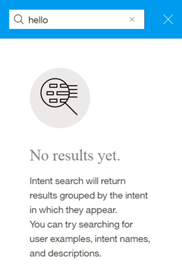

---

copyright:
  years: 2015, 2018
lastupdated: "2018-01-30"

---

{:shortdesc: .shortdesc}
{:new_window: target="_blank"}
{:tip: .tip}
{:pre: .pre}
{:codeblock: .codeblock}
{:screen: .screen}
{:javascript: .ph data-hd-programlang='javascript'}
{:java: .ph data-hd-programlang='java'}
{:python: .ph data-hd-programlang='python'}
{:swift: .ph data-hd-programlang='swift'}

# Absichten definieren
{: #intents}

***Absichten*** sind Zwecke oder Ziele, die in der Eingabe eines Kunden ausgedrückt werden, beispielsweise die Beantwortung einer Frage oder die Verarbeitung einer Rechnungszahlung. Indem der Service '{{site.data.keyword.conversationshort}}' die in einer Kundeneingabe ausgedrückte Absicht erkennt, kann er den korrekten Dialogmodulablauf für ihre Beantwortung auswählen.
{: shortdesc}

<iframe class="embed-responsive-item" id="youtubeplayer" type="text/html" width="640" height="390" src="https://www.youtube.com/embed/6HAZpBHqX8M" frameborder="0" webkitallowfullscreen mozallowfullscreen allowfullscreen> </iframe>

## Begrenzungen für Absichten
{: #intent-limits}

Die Anzahl der Absichten und Beispiele, die Sie erstellen können, richtet sich nach Ihrem {{site.data.keyword.conversationshort}}-Serviceplan:

| Serviceplan     | Absichten pro Arbeitsbereich | Beispiele pro Arbeitsbereich |
|------------------|----------------------:|-----------------------:|
| Standard/Premium |                 2,000 |                 25.000 |
| Lite             |                   100 |                 25.000 |

## Absichten erstellen
{: #creating-intents}

Zum Erstellen von Absichten verwenden Sie das {{site.data.keyword.conversationshort}}-Tool.

1.  Öffnen Sie Ihren Arbeitsbereich im {{site.data.keyword.conversationshort}}-Tool und wählen Sie dann die Registerkarte **Absichten** in der Navigationsleiste aus. Falls die Registerkarte **Absichten** nicht angezeigt wird, öffnen Sie die Seite über das Menü .

1.  Wählen Sie **Neue erstellen** aus.

1.  Geben Sie im Feld **Name der Absicht** einen Namen für die Absicht ein.
    - Der Name der Absicht kann Buchstaben (in Unicode), Ziffern, Unterstreichungszeichen, Bindestriche und Punkte enthalten.
    - Der Name kann aus `..` oder einer beliebigen anderen Zeichenfolge ausschließlich mit Zeichen bestehen.
    - Namen von Absichten dürfen keine Leerzeichen enthalten und nicht länger als 128 Zeichen sein. Beispiele für Namen von Absichten:
        - `#wetterlage`
        - `#rechnung_zahlen`
        - `#eskalation_an_agenten`

    Das Tool bezieht automatisch das Zeichen `#` in den Namen einer Absicht ein; Sie müssen das Zeichen also nicht selbst hinzufügen.
    {: tip}

    Geben Sie eine Beschreibung der Absicht in das Feld **Beschreibung** ein.

1.  Wählen Sie **Absicht erstellen** aus, um den Namen der Absicht zu speichern.

    

1.  Geben Sie als nächstes im Feld **Benutzerbeispiele hinzufügen** den Text eines Benutzerbeispiels für die Absicht ein. Ein Beispiel kann bis zu 1024 Zeichen lang sein. Mögliche Beispiele für die Absicht `#rechnung_zahlen`:
    - `Ich muss meine Rechnung zahlen.`
    - `Kontostand ausgleichen`
    - `Zahlung vornehmen`

    **Entitäten und Synonyme als Beispiele für Absichten referenzieren**

    Wenn Sie Entitäten definiert haben oder definieren möchten, die dieser Absicht entsprechen, referenzieren Sie die Entitäten oder ihre zugeordneten Synonyme in einigen Beispielen. Dies fördert den Aufbau einer Beziehung zwischen der Absicht und den Entitäten.

    
    {: #entity-as-example}

    *Wichtig*:

      - Die Beispieldaten für Absichten sollen repräsentativ und typisch für die von Benutzern bereitgestellten Daten sein. Beispiele können aus tatsächlichen Benutzereingaben extrahiert oder von Fachleuten des betreffenden Gebiets gesammelt werden. Wichtig ist, dass die Daten repräsentativ und zuverlässig sind.
      - Sowohl die Trainings- als auch die Testdaten (für Auswertungszwecke) sollen die Verteilung der Absichten im tatsächlichen Gebrauch widerspiegeln. Generell gilt: Für häufiger verwendete Absichten werden mehr Beispiele angegeben und sie werden in den Antworten stärker berücksichtigt.
      - Die Interpunktion im Beispieltext soll dem üblichen Sprachgebrauch entsprechen. Wenn Sie der Meinung sind, dass manche Benutzer Ihre Absichten durch Beispiele mit Interpunktion ausdrücken und andere Benutzer nicht, dann schließen Sie beide Versionen ein. Je mehr unterschiedliche Musterbeispiele vorliegen, umso besser die Antwort.

    **Eine Entität als Beispiel für eine Absicht direkt referenzieren**

    Sie können in Ihren Beispielen für eine Absicht auch direkt auf Entitäten verweisen. Angenommen, Sie verfügen über eine Entität namens `@PhoneModelName` mit den darin enthaltenen Werten *Galaxy S8*, *Moto Z2*, *LG G6* und *Google Pixel 2*. Beim Erstellen der Absicht `#order_phone` könnten Sie die folgenden Trainingsdaten bereitstellen:
    - Bieten Sie das `@PhoneModelName` an?
    - Helfen Sie mir, ein `@PhoneModelName` zu bestellen.
    - Haben Sie das `@PhoneModelName` vorrätig?
    - Das `@PhoneModelName` zu meiner Bestellung hinzufügen.

    

    **Hinweis**: Gegenwärtig können Sie nur von Ihnen definierte geschlossene Entitäten direkt referenzieren (Musterwerte werden ignoriert). Sie können keine [Systementitäten](system-entities.html) verwenden.

    Wenn Sie eine Entität (z. B. `@PhoneModelName`) als Beispiel für eine Absicht *anywhere* in Ihren Trainingsdaten referenzieren, wird dadurch der Wert einer direkten Referenz (z. B. *Galaxy S8*) in einem Beispiel für eine Absicht an jeder anderen Position ausgeschlossen. Daraufhin wird für alle Absichten das Konzept 'Entität als Beispiel für Absicht' verwendet. Es ist nicht möglich, dieses Konzept nur für eine bestimmte Absicht zu verwenden.

    In der Praxis bedeutet dies: Wenn Sie bisher die meisten Absichten unter Verwendung direkter Referenzen (z. B. *Galaxy S8*) trainiert haben und jetzt für eine einzige Absicht Entitätsreferenzen verwenden (z. B. `@PhoneModelName`), dann wirkt sich das auf alle Ihre vorherigen Trainingsvorgänge aus. Wenn Sie sich entschließen, Referenzen des Typs `@Entity` zu verwenden, müssen Sie alle vorher verwendeten, direkten Referenzen ausnahmslos durch Referenzen des Typs `@Entity` ersetzen.

    **Hinweis**: Das Definieren einer Beispielabsicht mit einer Entität (`@Entity`), für die 10 Werte definiert sind, bedeutet **nicht**, dass diese Beispielabsicht zehnmal angegeben wird. Der Servcie '{{site.data.keyword.conversationshort}}' ordnet dieser einen Beispielabsichtsyntax keine derart hohe Gewichtung zu.

    **Wichtig**: Namen von Absichten und Beispieltext für Absichten können bei der Interaktion zwischen einer Anwendung und dem Service über URLs zugänglich gemacht werden. Verwenden Sie in diesen Artefakten keine vertraulichen oder persönlichen Daten.

    Aktivieren Sie **Beispiel hinzufügen**, um das Beispiel zu speichern.

1.  Wiederholen Sie diesen Prozess, um weitere Beispiele hinzuzufügen. Mit der Tabulatortaste können Sie zwischen den einzelnen Beispielen wechseln. Geben Sie für jede Absicht mindestens fünf Beispiele an. Je mehr Beispiele Sie angeben, desto präziser kann die Anwendung arbeiten.

1.  Nachdem Sie Beispiele hinzugefügt haben, wählen Sie den  aus, um das Erstellen der Absicht abzuschließen.

### Ergebnisse

Die von Ihnen erstellte Absicht wird zur Registerkarte 'Absichten' hinzugefügt. Das System beginnt nun damit, sich selbst mit den neuen Daten zu trainieren.

## Absichten bearbeiten

Sie können jede Absicht in der Liste öffnen und sie bearbeiten. Hierbei können Sie die folgenden Änderungen vornehmen:

- Sie können die Absicht umbenennen.
- Sie können die Absicht löschen.
- Sie können Beispiele hinzufügen, bearbeiten oder löschen.
- Sie können ein Beispiel in eine andere Absicht verschieben.

Mit der Tabulatortaste können Sie vom Namen der Absicht zu den einzelnen Beispielen springen und die Beispiele bei Bedarf bearbeiten.

Um ein Beispiel zu verschieben oder zu löschen, wählen Sie es mithilfe des Kontrollkästchens aus und wählen Sie dann **Verschieben** oder **Löschen** aus.

  

## Absichten suchen

Verwenden Sie die Suchfunktion, um Benutzerbeispiele, Namen von Absichten und Beschreibungen zu finden.

1.  Wählen Sie die Registerkarte **Absichten** in der Navigationsleiste aus.

    

1.  Wählen Sie das Symbol 'Suche' aus: 

1.  Geben Sie einen Suchbegriff oder -ausdruck ein.

    

    **Hinweis**: Beim ersten Suchvorgang wird ein Index erstellt. Gegebenenfalls weist eine Nachricht darauf hin, dass Sie warten müssen, bis die Indexierung des Inhalts abgeschlossen ist.

### Ergebnisse

Absichten, die Ihren Suchbegriff enthalten, und entsprechende Beispiele werden angezeigt. Wählen Sie ein Ergebnis aus, damit es zum Bearbeiten geöffnet wird.

  

## Absichten und Beispiele importieren

Bei einer großen Anzahl von Absichten und Beispielen kann es einfacher sein, diese aus einer CSV-Datei zu importieren, als sie einzeln im {{site.data.keyword.conversationshort}}-Tool zu definieren.

1.  Erfassen Sie die Absichten und Beispiele in einer CSV-Datei oder exportieren Sie sie aus einem Tabellenkalkulationsprogramm in eine CSV-Datei. Jede Zeile in der Datei muss das folgende erforderliche Format aufweisen:

    ```
    <beispiel>,<absicht>
    ```
    {: screen}

    Hierbei steht `<example>` für den Text eines Benutzerbeispiels und `<intent>` für den Namen der Absicht, zu der das Beispiel gehören soll. Beispiel:

    ```
    Ich möchte Informationen zur aktuellen Wetterlage.,wetterlage
    Regnet es?,wetterlage
    Wie hoch ist die Temperatur?,wetterlage
    Wo ist Ihre nächste Filiale?,filialsuche
    Haben Sie einen Laden in Berlin?,filialsuche
    ```
    {: screen}

    > **Wichtig:** Speichern Sie die CSV-Datei in UTF-8-Codierung und ohne Byteanordnungsmarkierung.

1.  Öffnen Sie Ihren Arbeitsbereich im {{site.data.keyword.conversationshort}}-Tool und wählen Sie dann die Registerkarte **Absichten** in der Navigationsleiste aus. Falls die Registerkarte **Absichten** nicht angezeigt wird, öffnen Sie die Seite über das Menü .

1.  Wählen Sie das Symbol *Importieren*  aus. Ziehen Sie anschließend eine Datei oder suchen auf Ihrem Computer nach einer Datei und wählen Sie sie aus. Die Datei wird validiert und importiert. Anschließend beginnt das System damit, sich selbst mit den neuen Daten zu trainieren.

    

    > **Wichtig:** Die maximale Größe der CSV-Datei beträgt 10 MB. Wenn Ihre CSV-Datei größer ist, können Sie sie in mehrere Dateien aufteilen und diese dann einzeln importieren.

### Ergebnisse

Sie können die importierten Absichten und die entsprechenden Beispiele auf der Registerkarte **Absichten** einsehen. Möglicherweise müssen Sie die Seite aktualisieren, damit die neuen Absichten und Beispiele angezeigt werden.

## Absichten exportieren
{: #export_intents}

Sie können mehrere Absichten in eine CSV-Datei exportieren, um sie später zu importieren und für eine andere {{site.data.keyword.conversationshort}}-Anwendung wiederzuverwenden.

1.  Wählen Sie in der Liste auf der Registerkarte 'Absichten' die gewünschten Absichten aus und wählen Sie dann *Exportieren* aus.

    

## Absichten löschen
{: #delete_intents}

Sie können eine gewünschte Anzahl von Absichten auswählen, um sie anschließend zu löschen.

**WICHTIG**: Beim Löschen von Absichten werden auch alle zugehörigen Beispiele gelöscht. Diese Einträge können später nicht mehr abgerufen werden. Alle Dialogmodulknoten, die diese Absichten referenzieren, müssen manuell aktualisiert werden, damit der gelöschte Inhalt nicht mehr referenziert wird.

1.  Wählen Sie in der Liste auf der Registerkarte 'Absichten' die gewünschten Absichten aus und wählen Sie dann *Löschen* aus.

    

## Absichten testen
{: #testing-your-intents}

Nachdem Sie die neuen Absichten erstellt haben, können Sie das System testen und feststellen, ob es Ihre Absichten wie erwartet erkennt.

1.  Wählen Sie im {{site.data.keyword.conversationshort}}-Tool das Symbol  aus.

1.  Geben Sie im Fenster *Ausprobieren* eine Frage oder eine andere Textzeichenfolge ein und drücken Sie die Eingabetaste, um zu ermitteln, welche Absicht erkannt wird. Sollte die falsche Absicht erkannt werden, können Sie Ihr Modell verbessern, indem Sie den entsprechenden Text als Beispiel zur passenden Absicht hinzufügen.

    Falls Sie kürzlich Änderungen im Arbeitsbereich vorgenommen haben, wird möglicherweise in einer Nachricht darauf hingewiesen, dass das System noch mit dem erneuten Training beschäftigt ist. Wenn diese Nachricht ausgegeben wird, warten Sie mit dem Test, bis das Training abgeschlossen ist:
    {: tip}

    

    Die Antwort gibt Aufschluss darüber, welche Absicht aus Ihrer Eingabe erkannt wurde.

    

1.  Falls das System nicht die richtige Absicht erkannt hat, können Sie sie korrigieren. Zur Korrektur der erkannten Absicht wählen Sie die angezeigte Absicht und anschließend die richtige Absicht in der Liste aus. Nachdem Sie die Korrektur übergeben haben, trainiert sich das System automatisch selbst, um die neuen Daten zu integrieren.

    

1.  Falls sich die Eingabe nicht auf Ihre Anwendung bezieht, können Sie dies angeben. Wählen Sie die angezeigte Absicht und dann die Option **Als irrelevant markieren** aus.

    

Wenn Ihre Absichten nicht korrekt erkannt werden, kann es sinnvoll sein, die folgenden Änderungen vorzunehmen:

- Fügen Sie den nicht erkannten Text als Beispiel zur entsprechenden Absicht hinzu.
- Verschieben Sie vorhandene Beispiele von einer Absicht zu einer anderen Absicht.
- Denken Sie darüber nach, ob Ihre Absichten zu ähnlich sind, und definieren Sie sie entsprechend neu.

## Absolute Bewertung und Option 'Als irrelevant markieren'

Seit Februar 2017 wird zur Bewertung der Absichtskonfidenz und zur Rückgabe von Absichten ein neuer Algorithmus eingesetzt. Außerdem können Sie Absichten als *irrelevant* markieren. Diese Änderungen machen möglicherweise ein [Upgrade des Arbeitsbereichs ](upgrading.html){: new_window} erforderlich.

### Absolute Bewertung

Der Service '{{site.data.keyword.conversationshort}}' bewertet nun die Konfidenz jeder Absicht separat und nicht in Relation zu anderen Absichten. Dies bietet die Flexibilität, dass mehrere Absichten zurückgegeben werden können. Außerdem bedeutet es, dass das System möglicherweise auch gar keine Absichten zurückgibt. Wenn die häufigste Absicht einen niedrigen Konfidenzwert (kleiner als 0,2) unter allen Absichten in Bezug auf die Benutzereingabe aufweist, wird sie von der API dennoch in die Array-Ausgabe für Absichten einbezogen, aber Bedingungen für diese Absicht (#intent) geben 'false' zurück. Wenn Sie Fälle ermitteln möchten, in denen keine Absichten mit hoher Konfidenz erkannt wurden, können Sie `irrelevant` als Bedingung verwenden.

Wenn sich die Konfidenzbewertung von Absichten ändert, müssen Ihre Dialogmodule möglicherweise neu strukturiert werden. Beispiel: Sie haben für Ihr Dialogmodul eine Absicht als Bedingung festgelegt, für die eine geringe Konfidenz festgestellt wird. In diesem Fall ist die Antwort des Systems nicht mehr richtig.

### Als irrelevant markieren
{: #mark-irrelevant}

Ob dieses Feature verfügbar ist, können Sie im Abschnitt [Unterstützte Sprachen](lang-support.html) ermitteln.

Nach einem Upgrade Ihres Arbeitsbereichs können Sie in der Anzeige *Ausprobieren* die [Eingabe testen](#testing-your-intents), um die Änderungen festzustellen. Mit der Option **Als irrelevant markieren** können Sie angeben, dass die Eingabe für Ihre Anwendung nicht relevant ist.

Wenn Sie eine Absicht wie beispielsweise '#ohne_bedeutung' für Eingaben definiert haben, die den Rahmen sprengen oder unpassend sind, löschen Sie die Absicht und testen Sie Ihren Arbeitsbereich, indem Sie die Eingaben als irrelevant markieren.

**Wichtig**: Als irrelevant markierte Eingaben werden im Arbeitsbereich gespeichert und in die Trainingsdaten einbezogen. Nehmen Sie diese Änderung nur dann vor, wenn Sie dies wirklich beabsichtigen.

- Auf die Eingaben können Sie später im Tool nicht mehr zugreifen; auch eine Änderung ist dann nicht mehr möglich.
- Der Tag **Irrelevant** kann nur entfernt werden, indem dieselbe Eingabe in der Anzeige *Ausprobieren* verwendet und dann die Absicht geändert wird.
