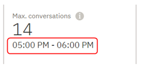

---

copyright:
  years: 2015, 2019
lastupdated: "2019-02-21"

subcollection: assistant

---

{:shortdesc: .shortdesc}
{:new_window: target="_blank"}
{:deprecated: .deprecated}
{:important: .important}
{:note: .note}
{:tip: .tip}
{:pre: .pre}
{:codeblock: .codeblock}
{:screen: .screen}
{:javascript: .ph data-hd-programlang='javascript'}
{:java: .ph data-hd-programlang='java'}
{:python: .ph data-hd-programlang='python'}
{:swift: .ph data-hd-programlang='swift'}

# Übersicht über Metriken
{: #logs-overview}

Die Übersichtsseite bietet eine Zusammenfassung der Interaktionen zwischen Benutzern und Ihrem virtuellen Assistenten. Sie können den Umfang des Datenverkehrs für einen bestimmten Zeitraum ebenso einsehen wie die Absichten und Entitäten, die in Benutzerdialogen am häufigsten erkannt wurden.
{: shortdesc}

Anhand der Metriken können Sie Fragen wie die folgenden beantworten: 

* An welchen Tagen des letzten Monats fanden die meisten bzw. die wenigsten Dialoge statt?
* Wie viele Dialog fanden im letzten Monat durchschnittlich pro Woche statt?
* Welche Absichten traten in der vergangenen Woche am häufigsten auf?
* Welche Entitätswerte wurden im Februar am häufigsten erkannt?

Wählen Sie zum Anzeigen von Metrikdaten die Option **Übersicht** in der Navigationsleiste aus.

  

## Steuerelemente
{: #logs-overview-controls}

Mit den folgenden Steuerelementen können Sie die Daten filtern: 

- Filter für *Absichten* und *Entitäten*: Verwenden Sie einen dieser Filter aus der Dropdown-Liste, um Daten zu eine bestimmte Absicht oder Entität in Ihrem Skill anzuzeigen. 

  **Wichtig**: Die Filter für Absichten und Entitäten werden aus den Absichten und Entitäten des ***Skills*** und nicht aus dem Inhalt der Datenquelle gefüllt. Wenn Sie eine andere [Datenquelle ausgewählt](/docs/services/assistant?topic=assistant-logs#logs-deploy-id) haben als den Skill, wird eine Absicht oder Entität aus Ihrer Datenquelle nur als Option in den Filtern angezeigt, wenn die betreffende Absicht oder Entität auch im Skill enthalten ist. 

- *Daten aktualisieren*: Hiermit können Sie die Statistik auf der Seite 'Übersicht' sofort aktualisieren. Auf der Seite 'Übersicht' ist angegeben, wann die angezeigten Daten zum letzten Mal aktualisiert worden sind. Sie können die Option **Daten aktualisieren** auswählen, wenn Sie annehmen, dass möglicherweise neuere Daten verfügbar sind.

  Die Statistikdaten stellen den externen Datenverkehr (Benutzer- oder API-Aufrufe) dar, der mit Ihrem Assistenten interagiert hat. Interaktionen, die über die Anzeige *Ausprobieren* im Tool erfolgt sind, werden nicht berücksichtigt.

- *Steuerelement für Zeitraum*: Mit diesem Steuerelement können Sie den Zeitraum festlegen, für den Daten angezeigt werden. Dieses Steuerelement wirkt sich auf alle Daten aus, die auf der Seite angezeigt werden, also nicht nur auf die Anzahl der Dialoge, die im Diagramm dargestellt sind, sondern auch auf die mit dem Diagramm angezeigte Statistik und die Listen der häufigsten Absichten und Entitäten.

  Die Statistikdaten können einen längeren Zeitraum abdecken als die Dauer, für die Protokolle der Dialoge aufbewahrt werden.
  {: note}

  

  Sie können auswählen, ob Daten für einen einzelnen Tag, eine Woche, einen Monat oder ein Quartal angezeigt werden sollen. In jedem Fall werden die Datenpunkte im Diagramm an einen passenden Messzeitraum angepasst. Wenn Sie beispielsweise ein Diagramm für einen Tag anzeigen, werden die Daten in stündlichen Werten dargestellt. Zeigen Sie hingegen ein Diagramm für eine Woche an, werden die Daten jeweils nach Tag angezeigt. Eine Woche reicht von Sonntag bis Samstag. Zeitperioden können nicht angepasst werden; Sie können also keine Woche definieren, die von Donnerstag bis zum folgenden Mittwoch reicht, oder einen Monat, der an einem anderen Datum als dem Monatsersten beginnt.

  Wenn Sie zum Beispiel die Anzeige für einen einzelnen Tag auswählen, wird die für jeden Dialog angegebene Zeit an die lokale Zeitzone Ihres Browsers angepasst. Diese Zeitangabe kann von der Zeitmarke abweichen, die beim Anfordern desselben Dialogprotokolls über einen API-Aufruf angezeigt wird. Für API-Protokollaufrufe wird immer die UTC-Zeit verwendet.

    

## Diagramme und Statistiken
{: #logs-overview-graphs}

Protokolldaten für Ihre Anwendung werden auf mehreren Scorecards für Statistikdaten bereitgestellt: 

* *Dialoge insgesamt*: Die Gesamtzahl der Dialoge zwischen aktiven Benutzern und Ihrer Anwendung in dem ausgewählten Zeitraum, wie im zugehörigen Diagramm dargestellt.

  Ein einzelner Dialog ist ein Austausch mit Nachrichten, die ein aktiver Benutzer an Ihre Anwendung sendet, und die Ihre Anwendung als Antwort zurückgibt.

  **Wichtig**: Als 'Dialog' gilt jede *beliebige* Gruppe von Nachrichten, die von einer Anwendung oder einem Bot empfangen bzw. gesendet wird. Falls der Dialog vom Service mit der Nachricht 'Hallo, wie kann ich Ihnen helfen?' eingeleitet wurde und der Benutzer den Browser beendet hat, ohne zu antworten, wird dieser Dialog in die Gesamtzahl der Dialoge einbezogen.

* *Durchschn. Nachr. pro Dialog*: Die Gesamtzahl der empfangenen Nachrichten im ausgewählten Zeitraum, geteilt durch die Gesamtzahl der Dialoge im ausgewählten Zeitraum, wie im zugehörigen Diagramm dargestellt. 
* *Max. Anzahl Dialoge*: Die maximale Anzahl der Dialoge für einen einzelnen Datenpunkt innerhalb des ausgewählten Zeitraums. 
* *Vermindertes Verständnis*: Die Anzahl der Einzelnachrichten, bei denen das Verständnis vermindert war. Solche Nachrichten sind nicht durch eine Absicht klassifiziert und enthalten keine bekannten Entitäten. Diese Angabe kann zur Erkennung von potenziellen Problemen bei Dialogen hilfreich sein.

Detaillierte Diagramme liefern zusätzliche Informationen: 

* *Dialoge insgesamt*: Die Gesamtzahl der Dialoge zwischen aktiven Benutzern und Ihrer Anwendung in dem ausgewählten Zeitraum. 

  Während das Diagramm ***Dialoge*** angezeigt wird, können Sie auf einen einzelnen Datenpunkt klicken, um den zugehörigen Zahlenwert anzuzeigen, wie in der folgenden Abbildung gezeigt:

  

* *Durchschn. Nachr. pro Dialog*: Die Gesamtzahl der empfangenen Nachrichten im ausgewählten Zeitraum, geteilt durch die Gesamtzahl der Dialoge im ausgewählten Zeitraum.
* *Nachrichten insgesamt*: Die Gesamtzahl der empfangenen Nachrichten von aktiven Benutzern im ausgewählten Zeitraum.
* *Aktive Benutzer*: Die Anzahl der eindeutigen Benutzer, die im ausgewählten Zeitraum einen Dialog mit Ihrer Anwendung geführt haben.
* *Durchschn. Anzahl Dialoge pro Benutzer*: Die Gesamtzahl der Dialoge im ausgewählten Zeitraum, geteilt durch die Gesamtzahl der eindeutigen Benutzer im ausgewählten Zeitraum.

  Für Statistiken über *Aktive Benutzer* und *Durchschn. Anzahl Dialoge pro Benutzer* ist ein eindeutiger Parameter `user_id` erforderlich. Weitere Informationen enthält der Abschnitt [Benutzermetriken aktivieren](/docs/services/assistant?topic=assistant-logs-resources#logs-resources-user-id).
  {: important}

## Häufigste Absichten und Entitäten
{: #logs-overview-tops}

Sie können auch die Absichten und Entitäten anzeigen, die während des angegebenen Zeitraums am häufigsten erkannt wurden.

* *Häufigste Absichten*: Absichten werden in einer einfachen Liste angezeigt. Hier sehen Sie nicht nur, wie oft eine Absicht erkannt wurde. sondern Sie können durch Auswählen einer Absicht auch die Seite **Benutzerdialoge** mit den nach ausgewähltem Datumsbereich und ausgewählter Absicht gefilterten Daten öffnen.

* *Häufigste Entitäten*: Die entsprechenden Entitäten werden ebenfalls in einer Liste angezeigt. Für jede Entität können Sie in der Spalte **Werte** eine Auswahl treffen, um eine Liste der häufigsten Werte anzuzeigen, die im angegebenen Zeitraum für diese Entität ermittelt wurden. Außerdem können Sie eine Entität auswählen, um die Seite **Benutzerdialoge** mit den nach ausgewähltem Datumsbereich und ausgewählter Entität gefilterten Daten zu öffnen. 

Der Abschnitt [Aus Dialogen lernen](/docs/services/assistant?topic=assistant-logs) enthält Tipps zum Bearbeiten von Absichten und Entitäten auf der Basis von Erkenntnissen, die Sie beim Überprüfen der vom Service erkannten Absichten und Entitäten gewinnen. 
