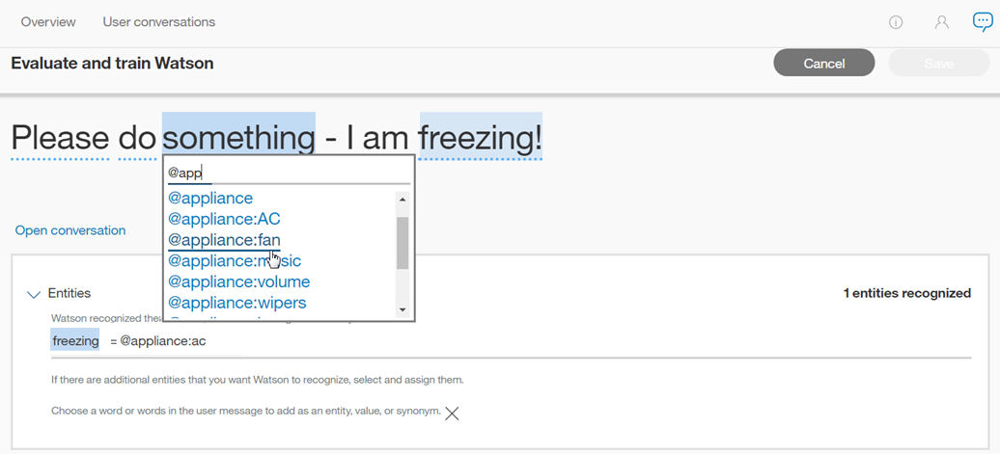
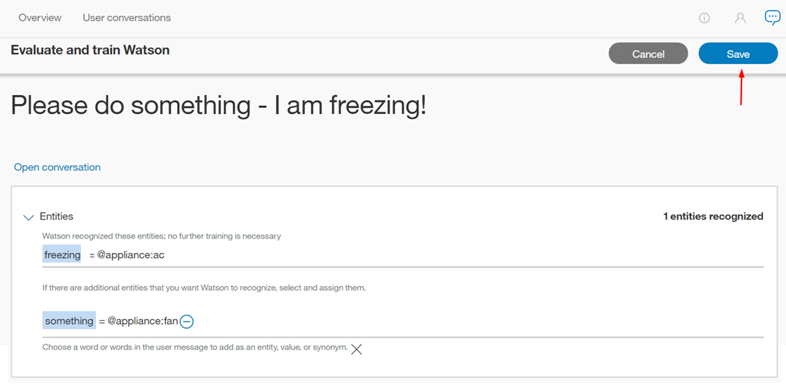

---

copyright:
  years: 2015, 2018
lastupdated: "2018-02-13"

---

{:shortdesc: .shortdesc}
{:new_window: target="_blank"}
{:tip: .tip}
{:pre: .pre}
{:codeblock: .codeblock}
{:screen: .screen}
{:javascript: .ph data-hd-programlang='javascript'}
{:java: .ph data-hd-programlang='java'}
{:python: .ph data-hd-programlang='python'}
{:swift: .ph data-hd-programlang='swift'}

# Mit Dialogen arbeiten
{: #logs_convo}

Um eine Liste der Interaktionen zwischen Benutzern und Ihrem Arbeitsbereich zu öffnen, wählen Sie in der Navigationsleiste die Option **Benutzerdialoge** aus. Falls die Option **Benutzerdialoge** nicht angezeigt wird, öffnen Sie die Seite über das Menü .
{: shortdesc}

Wenn Sie die Seite **Benutzerdialoge** öffnen, wird standardmäßig die Ansicht mit der Ergebnisliste für den letzten  Tag angezeigt; an erster Position befinden sich hierbei die neuesten Ergebnisse. Verfügbar sind die häufigste Absicht (#intent), alle erkannten Entitätswerte (@entity), die in einer Nachricht verwendet wurden, und der Nachrichtentext. Für nicht erkannte Absichten wird der Wert *Irrelevant* angezeigt. Falls eine Entität nicht erkannt oder nicht angegeben wurde, wird der Wert *Keine Entitäten gefunden* angezeigt.

Wichtig: Auf der Seite **Benutzerdialoge** wird die Gesamtzahl der *verbalen Äußerungen* zwischen Benutzern und Ihrem Arbeitsbereich angezeigt. Eine verbale Äußerung ist eine einzelne Nachricht, die ein Benutzer an den Arbeitsbereich sendet. Jeder Dialog kann aus vielen verbalen Äußerungen bestehen. Daher weicht die Zahl der Ergebnisse auf dieser Seite **Benutzerdialoge** von der Anzahl der Dialoge ab, die auf der Seite [Übersicht](logs_oview.html)  angezeigt wird.

## Begrenzungen für Protokolle
{: #log-limits}

Die Dauer des Zeitraums, für den Nachrichten aufbewahrt werden, richtet sich nach Ihrem {{site.data.keyword.conversationshort}}-Serviceplan:

  Serviceplan                         | Chatnachrichtenspeicherung
  ------------------------------------ | ------------------------------------
  Premium                              | Letzte 90 Tage
  Standard                             | Letzte 30 Tage
  Lite                                 | Letzte 7 Tage

## Datenquelle auswählen
{: #select-source}

Auf der Seite **Benutzerdialoge** werden standardmäßig Daten zu verbalen Äußerungen für den aktuellen Arbeitsbereich angezeigt. Es kann hilfreich sein, einen Arbeitsbereich mithilfe von verbalen Äußerungen zu verbessern, die an andere Arbeitsbereiche in Ihrer Instanz gesendet wurden. Beispiel: Wenn Sie über mehrere Versionen von Produktions- und Entwicklungsarbeitsbereichen verfügen, können Sie dieselben Äußerungsdaten verwenden, um beliebige dieser Arbeitsbereiche zu verbessern.

Beim Wechsel zu einer anderen Datenquelle sucht der Service '{{site.data.keyword.conversationshort}}' in den Äußerungen nach einem Element mit der Bezeichnung `Bereitstellungs-ID`. Bereitstellungs-IDs sind eindeutige Kennungen in der API des Service '{{site.data.keyword.conversationshort}}', die Sie zu Ihren Nachrichten-API-Aufrufen hinzufügen. Weitere Informationen zum Hinzufügen von Bereitstellungs-IDs zu Nachrichtenaufrufen finden Sie unter [Verbesserungen für mehrere Arbeitsbereiche](logs.html#deploy_id).

So füllen Sie den Abschnitt 'Verbessern' unter Verwendung von Äußerungen mit einer angegebenen Bereitstellungs-ID:

1.  Wählen Sie **Datenquelle:** aus
    
1.  Wählen Sie eine Bereitstellung aus
    
1.  Klicken Sie auf **Daten anzeigen**

Die ausgewählte Datenquelle wird angezeigt.

**Hinweis:** Während unter **Datenquelle:** nun die Quelle der Äußerungen angezeigt wird, die Sie zum Verbessern dieses Arbeitsbereichs verwenden, wird oben auf der Seite weiterhin der Arbeitsbereich angezeigt, auf den Sie die Änderungen anwenden.

Im vorliegenden Beispiel ist die Seite 'Verbessern' mit den Äußerungen gefüllt, in deren Nachrichten-API-Aufrufen die Bereitstellungs-ID `HelpDesk-Production` angegeben war. Wenn jedoch die Äußerung *Testeingabe* zur Absicht **#No** hinzugefügt wurde, würde durch Klicken auf **Speichern** die Äußerung *Testeingabe* als ein Beispiel für `#No` im Arbeitsbereich `HelpDesk-Development` hinzugefügt.

## Verbale Äußerungen filtern

Sie können verbale Äußerungen mithilfe der Optionen *Benutzeranweisungen suchen*, *Absichten*, *Entitäten* und *Letzte* n *Tage* filtern:

*Benutzeranweisungen suchen*: Geben Sie in der Suchleiste ein Wort ein. Hiermit werden die Eingaben des Benutzers durchsucht, jedoch nicht die Antworten Ihres Arbeitsbereichs.

*Absichten*: Wählen Sie das Dropdown-Menü aus und geben Sie im Eingabefeld eine Absicht ein oder treffen Sie eine Auswahl in der gefüllten Liste. Sie können mehrere Absichten auswählen, wodurch die Ergebnisse unter Verwendung aller ausgewählten Absichten gefiltert werden; die Auswahl von *Irrelevant* ist ebenfalls möglich.

*Entitäten*: Wählen Sie das Dropdown-Menü aus und geben Sie im Eingabefeld einen Entitätsnamen ein oder treffen Sie eine Auswahl in der gefüllten Liste. Sie können mehrere Entitäten auswählen, wodurch die Ergebnisse unter Verwendung aller ausgewählten Entitäten gefiltert werden. Falls Sie nach Absicht *und* Entität filtern, enthalten die Ergebnisse diejenigen Nachrichten, die beide Werte aufweisen. Sie können die Ergebnisse auch durch Auswahl von *Keine Entitäten gefunden* filtern.

Möglicherweise dauert es etwas, bis verbale Äußerungen aktualisiert werden. Warten Sie nach einer Benutzerinteraktion mit Ihrem Arbeitsbereich mindestens 30 Minuten, bevor Sie versuchen, eine Filterung für diesen Inhalt vorzunehmen.

## Einzelne verbale Äußerung anzeigen
Sie können jeden Eintrag für eine Äußerung einblenden, um festzustellen, was der Benutzer im Dialog geäußert und wie Ihr Arbeitsbereich geantwortet hat. Wählen Sie hierzu die Option **Dialog öffnen** aus. Sie werden in diesem Dialog automatisch zu der verbalen Äußerung geführt, die Sie ausgewählt haben.

Anschließend können Sie die Klassifizierung(en) für die ausgewählte verbale Äußerung anzeigen.

## Absicht korrigieren

1.  Um eine Absicht zu korrigieren, wählen Sie das Bearbeitungssymbol  neben der ausgewählten Absicht (#abc) aus.
1.  Wählen Sie in der angezeigten Liste die korrekte Absicht für diese Eingabe aus.
    - Beginnen Sie mit der Eingabe im Eingabefeld. Daraufhin wird die Liste der Absichten gefiltert.
    - In diesem Menü können Sie auch die Option **Als irrelevant markieren** auswählen. (Weitere Informationen enthält der Abschnitt [Als irrelevant markieren](intents.html#mark-irrelevant).) Sie können auch die Option **Nicht für Absicht trainieren** auswählen; in diesem Fall wird diese verbale Äußerung nicht als Beispiel für das Training gespeichert.

    
1.  Wählen Sie **Speichern** aus.

    

    **Hinweis**: Der Service '{{site.data.keyword.conversationshort}}' unterstützt das Hinzufügen von Benutzereingaben als Beispiele zu einer Absicht *wie vorgegeben*. Wenn Sie Entitätsreferenzen (@entity) als Beispiele in Ihren Trainingsdaten für Absichten verwenden und eine Äußerung, die Sie speichern möchten, einen Entitätswert oder ein Synonym aus Ihren Trainingsdaten enthält, dann müssen Sie die Äußerung später bearbeiten. Bearbeiten Sie nach dem Speichern die Äußerung auf der Seite 'Absichten' und ersetzen Sie die von ihr referenzierte Entität. Weitere Informationen finden Sie unter [Eine Entität als Beispiel für eine Absicht direkt referenzieren](intents.html#entity-as-example).

## Entitätswert oder Synonym hinzufügen

1.  Um einen Entitätswert oder ein Synonym hinzuzufügen, wählen Sie das Bearbeitungssymbol  neben der ausgewählten Entität (@xyz) aus.
1.  Wählen Sie **Entität hinzufügen** aus.

    
1.  Wählen Sie nun in der unterstrichenen Benutzereingabe ein Wort oder einen Ausdruck aus.

    
1.  Wählen Sie eine Entität aus, zu der der hervorgehobene Ausdruck als Wert hinzugefügt werden soll.
    - Beginnen Sie mit der Eingabe im Eingabefeld. Daraufhin wird die Liste der Entitäten und Werte gefiltert.
    - Um den hervorgehobenen Ausdruck als Synonym für einen vorhandenen Wert hinzuzufügen, wählen Sie den Eintrag mit dem Format `@entität:wert` in der Dropdown-Liste aus.

    
1.  Wählen Sie **Speichern** aus.

    
