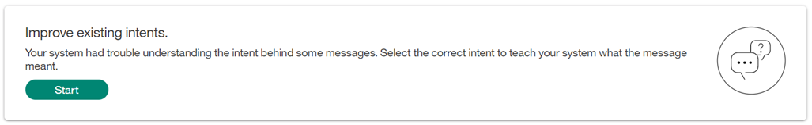

---

copyright:
  years: 2015, 2018
lastupdated: "2018-02-13"

---

{:shortdesc: .shortdesc}
{:new_window: target="_blank"}
{:tip: .tip}
{:pre: .pre}
{:codeblock: .codeblock}
{:screen: .screen}
{:javascript: .ph data-hd-programlang='javascript'}
{:java: .ph data-hd-programlang='java'}
{:python: .ph data-hd-programlang='python'}
{:swift: .ph data-hd-programlang='swift'}

# Empfehlungen
Auf dieser Seite sind Empfehlungen für die Verbesserung Ihres Systems angegeben.
{: shortdesc}

Dieses Feature ist nur in der Betaversion verfügbar.
{: tip}

Dieses Feature ist nur für Benutzer der Kategorie 'Premium' verfügbar.
{: tip}

Basierend auf einer Analyse der Dialoge, die Benutzer mit Ihrem Arbeitsbereich durchgeführt haben, und unter Berücksichtigung der aktuellen Trainingsdaten und Antwortsicherheit Ihres Systems werden Aktionen angezeigt, mit denen Sie Ihren Arbeitsbereich schnell und effektiv verbessern können.

<iframe class="embed-responsive-item" id="youtubeplayer" type="text/html" width="640" height="390" src="https://www.youtube.com/embed/scMu66AvZtY" frameborder="0" webkitallowfullscreen mozallowfullscreen allowfullscreen> </iframe>

Empfehlungen werden nachts generiert und benötigen eine große Menge an Benutzernachrichten (z. B. mehr als 50).
{: tip}

## Vorhandene Absichten verbessern
Für diese Empfehlungen werden einzelne Ausdrücke berücksichtigt, die von Benutzern eingegeben wurden und die das System nicht erkannt hat. Die Ausdrücke werden angezeigt, damit Sie für jeden Ausdruck eine Absicht auswählen können. Dies hilft Ihrem Arbeitsbereich dabei, die Äußerungen der Benutzer besser zu verstehen.

Klicken Sie auf **Start**, um mit der Erkennung von Absichten zu beginnen.

Wenn Sie die Seite **Vorhandene Absichten verbessern** aufrufen oder verlassen, zeigt der Fortschrittsanzeiger, wie viele Ausdrücke aller für den Tag vorhandenen Ausdrücke Sie in der aktuellen Sitzung bearbeitet haben. Bitte beachten Sie, dass nach dem Verlassen und einem erneuten Aufrufen der Seite der Fortschrittsanzeiger wieder bei null (`leer`) beginnt. Dies bedeutet jedoch nicht, dass Ihre bisherige Arbeit verloren ist, sie wird lediglich für den Fortschritt der aktuellen Sitzung nicht gezählt.

Wählen Sie die beste Absicht für einen Ausdruck in der bereitgestellten Liste aus oder wählen Sie die Option *Als irrelevant markieren* aus. Die Ausdrücke werden zu Absichten als Beispiele (also als Trainingsdaten) hinzugefügt, sobald Sie auf **Speichern** klicken.

Mit der Schaltfläche *Weiter mit nächstem Ausdruck* können Sie den aktuellen Ausdruck überspringen und mit dem nächsten Ausdruck fortfahren. Der übersprungene Ausdruck wird nicht erneut angezeigt, wenn Sie die Seite **Vorhandene Absichten verbessern** verlassen und an diesem Tag erneut öffnen. An Folgetagen kann er jedoch angezeigt werden.

