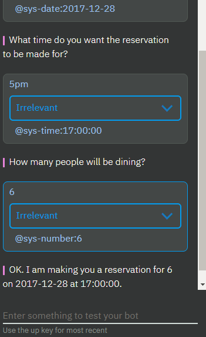

---

copyright:
  years: 2015, 2019
lastupdated: "2019-02-28"

subcollection: assistant

---

{:shortdesc: .shortdesc}
{:new_window: target="_blank"}
{:deprecated: .deprecated}
{:important: .important}
{:note: .note}
{:tip: .tip}
{:pre: .pre}
{:codeblock: .codeblock}
{:screen: .screen}
{:javascript: .ph data-hd-programlang='javascript'}
{:java: .ph data-hd-programlang='java'}
{:python: .ph data-hd-programlang='python'}
{:swift: .ph data-hd-programlang='swift'}

# Lernprogramm: Knoten mit Slots zu einem Dialogmodul hinzufügen
{: #tutorial-slots}

In diesem Lernprogramm fügen Sie Slots zu einem Dialogmodulknoten hinzu, um mehrere Einzelinformationen von einem Benutzer in einem einzelnen Knoten zu erfassen. Der Knoten, den Sie erstellen, erfasst die erforderlichen Informationen für eine Tischreservierung in einem Restaurant.
{: shortdesc}

## Lernziele
{: #tutorial-slots-objectives}

Sobald Sie dieses Lernprogramm abgeschlossen haben, wissen Sie, wie Sie Folgendes ausführen:

- Erforderliche Absichten und Entitäten für Ihr Dialogmodul definieren
- Slots zu einem Dialogmodulknoten hinzufügen
- Den Knoten mit Slots testen

### Dauer
{: #tutorial-slots-duration}

Für dieses Lernprogramm benötigen Sie ungefähr 30 Minuten.

### Voraussetzung
{: #tutorial-slots-prereqs}

Arbeiten Sie das [Lernprogramm 'Einführung'](/docs/services/assistant?topic=assistant-getting-started) durch, bevor Sie mit diesem Lernprogramm beginnen. Sie verwenden den von Ihnen erstellten {{site.data.keyword.conversationshort}}-Lernprogrammskill und fügen Knoten zu dem einfachen Dialogmodul hinzu, das Sie im Rahmen der Einführungsübung erstellt haben.

Falls gewünscht, können Sie auch einen neuen Dialogskill starten. Erstellen Sie den Skill, bevor Sie mit diesem Lernprogramm beginnen.
{: note}

## Schritt 1: Absichten und Beispiele hinzufügen
{: #tutorial-slots-add-intent}

Fügen Sie auf der Registerkarte 'Absichten' eine Absicht hinzu. Eine Absicht ist der Zweck oder das Ziel, der bzw. das in der Benutzereingabe zum Ausdruck kommt. Sie fügen eine Absicht '#reservation' hinzu, die angibt, dass der Benutzer einen Tisch in einem Restaurant reservieren möchte.

1.  Klicken Sie auf der Seite **Absichten** des Lernprogrammskills auf **Absicht hinzufügen**.
1.  Fügen Sie den folgenden Namen für die Absicht hinzu und klicken Sie dann auf **Absicht erstellen**:

    ```json
    reservation
    ```
    {: screen}

    Die Absicht '#reservation' wird hinzugefügt. Durch das vorangestellte Nummernzeichen (`#`) vor dem Namen wird 'reservation' als Absicht gekennzeichnet. Diese Namenskonvention macht die Absicht für Sie und andere Benutzer als solche erkennbar. Bislang sind noch keine Beispieläußerungen der Benutzer für die Absicht zugeordnet.
1.  Geben Sie im Feld **Benutzerbeispiele hinzufügen** die folgende Äußerung ein und klicken Sie dann auf **Beispiel hinzufügen**:

    ```json
    Ich möchte einen Tisch reservieren.
    ```
    {: screen}

1.  Fügen Sie die folgenden weiteren Beispiele hinzu, die Watson bei der Erkennung der Absicht `#reservation` helfen.

    ```json
    Ich möchte einen Tisch zum Abendessen reservieren.
    Können wir zu dritt einen Tisch zum Mittagessen reservieren?
    Haben Sie noch freie Plätze am nächsten Mittwoch um 19:00 Uhr?
    Gibt es einen freien Tisch für 4 Personen am Donnerstagabend?
    Ich möchte morgen zum Brunch kommen.
    Kann ich einen Tisch reservieren?
    ```
    {: screen}

1.  Klicken Sie auf das Symbol **Schließen** , um das Hinzufügen der Absicht `#reservation` und der zugehörigen Beispieläußerungen abzuschließen.

## Schritt 2: Entitäten hinzufügen
{: #tutorial-slots-add-entity}

Eine Entitätsdefinition enthält eine Reihe von *Entitätswerten* mit Ausdrücken, die häufig im Kontext einer bestimmten Absicht verwendet werden. Durch das Definieren von Entitäten können Sie den Service darin unterstützen, Stichwörter in der Benutzereingabe zu erkennen, die auf bestimmte Absichten hinweisen. In diesem Schritt aktivieren Sie Systementitäten zum Erkennen von Zeit-, Datums- und Zahlenangaben.

1.  Klicken Sie auf **Entitäten**, um die Seite 'Entitäten' zu öffnen.
1.  Aktivieren Sie Systementitäten, die das Erkennen von Datums-, Zeit- und Zahlenangaben in der Benutzereingabe ermöglichen. Klicken Sie auf die Registerkarte **Systementitäten** und aktivieren Sie die folgenden Entitäten:

    - `@sys-time`
    - `@sys-date               `
    - `@sys-number               `

Sie haben die Systementitäten '@sys-date', '@sys-time' und '@sys-number' erfolgreich aktiviert. Diese Entitäten können nun in Ihrem Dialogmodul verwendet werden.

## Schritt 3: Dialogmodulknoten mit Slots hinzufügen
{: #tutorial-slots-add-dialog-with-slots}

Ein Dialogmodulknoten stellt den Beginn eines Dialogthreads zwischen dem Service und einem Benutzer dar. Er enthält eine Bedingung, die erfüllt sein muss, damit der Knoten von dem Service verarbeitet wird. Außerdem muss er mindestens eine Antwort enthalten. Beispiel: Eine Knotenbedingung sucht nach der Absicht `#hello` in der Benutzereingabe und antwortet mit `Hallo. Was kann ich für Sie tun?` Dies ist das einfachste Beispiel für einen Dialogmodulknoten mit nur einer Bedingung und einer einzigen Antwort. Sie können komplexe Dialogmodule definieren, indem Sie bedingte Antworten zu einem einzelnen Knoten hinzufügen oder untergeordnete Knoten, die den Austausch mit dem Benutzer verlängern, sowie viele weitere Elemente. (Weitere Informationen zu komplexen Dialogmodulen bietet das Lernprogramm [Komplexes Dialogmodul erstellen](/docs/services/assistant?topic=assistant-tutorial).)

Der Knoten, den Sie in diesem Schritt hinzufügen, enthält Slots. Slots stellen ein strukturiertes Format bereit, mit dem Sie innerhalb eines Knotens mehrere Einzelinformationen von einem Benutzer abfragen und speichern können. Slots sind ein besonders geeignetes Werkzeug, wenn Sie zum Ausführen einer Aufgabe ganz bestimmte Einzelinformationen vom Benutzer benötigen. Weitere Informationen enthält der Abschnitt [Informationen mit Slots erfassen](/docs/services/assistant?topic=assistant-dialog-slots).

Der Knoten, den Sie hinzufügen, sammelt die erforderlichen Informationen, um einen Tisch in einem Restaurant zu reservieren.

1.  Klicken Sie auf die Registerkarte **Dialogmodule**, um die Baumstruktur der Dialogmodule zu öffnen.
1.  Klicken Sie auf das Symbol 'Mehr'  im Knoten **#General_Greetings** und wählen Sie anschließend die Option **Knoten darunter hinzufügen** aus.
1.  Beginnen Sie mit der Eingabe von `#reservation` im Bedingungsfeld und wählen Sie dann diesen Eintrag in der Liste aus.
    Dieser Knoten wird ausgewertet, wenn die Benutzereingabe der Absicht `#reservation` entspricht.
1.  Klicken Sie auf **Anpassen** und dann auf das Umschaltsteuerelement **Slots**, um es einzuschalten****). Klicken Sie anschließend auf **Anwenden**.

    
1.  Definieren Sie die folgenden Slots:

    <table>
    <caption>Slotdetails</caption>
    <tr>
      <th>Überprüfen auf</th>
      <th>Speichern unter</th>
      <th>Anfragen, falls nicht vorhanden</th>
    </tr>
    <tr>
      <td>@sys-date</td>
      <td>$date</td>
      <td>An welchem Tag möchten Sie reservieren?</td>
    </tr>
    <tr>
      <td>@sys-time</td>
      <td>$time</td>
      <td>Für welche Uhrzeit möchten Sie reservieren?</td>
    </tr>
    </tr>
    <tr>
      <td>@sys-number</td>
      <td>$guests</td>
      <td>Wie viele Personen werden zum Essen kommen?</td>
    </tr>
    </table>

1.  Geben Sie die folgende Antwort an: `OK. Ich reserviere Ihnen einen Tisch für $guests Personen am $date um $time.`

    

1.  Klicken Sie auf , um die Bearbeitungsansicht für den Knoten zu schließen.

## Schritt 4: Dialogmodul testen
{: #tutorial-slots-test}

1.  Wählen Sie das Symbol  aus, um den Chatbereich zu öffnen.
1.  Geben Sie Folgendes ein: `Ich möchte einen Tisch reservieren`.

    Der Assistent erkennt die Absicht '#reservation' und antwortet mit der Abfrage für den ersten Slot (`An welchem Tag möchten Sie reservieren?`).

1.  Geben Sie `Freitag` ein.

    Der Assistent erkennt den Wert und verwendet ihn als Eingabe für die Kontextvariable '$date' im ersten Slot. Danach wird die Abfrage für den nächsten Slot angezeigt (`Für welche Uhrzeit möchten Sie reservieren?`).

1.  Geben Sie `17:00 Uhr` ein.

    Der Assistent erkennt den Wert und verwendet ihn als Eingabe für die Kontextvariable '$time' im zweiten Slot. Danach wird die Abfrage für den nächsten Slot angezeigt (`Wie viele Personen werden zum Essen kommen?`).

1.  Geben Sie `6` ein.

    Der Assistent erkennt den Wert und verwendet ihn als Eingabe für die Kontextvariable '$guests' für den dritten Slot. Nachdem alle Slots gefüllt sind, wird die folgende Antwort des Knotens angezeigt: `OK. Ich reserviere Ihnen einen Tisch für 6 Personen am 2017-12-29 um 17:00:00 Uhr.`



Es hat funktioniert. Glückwunsch! Sie haben erfolgreich einen Knoten mit Slots erstellt.

## Zusammenfassung
{: #tutorial-slots-summary}

In diesem Lernprogramm haben Sie einen Knoten mit Slots zum Erfassen der erforderlichen Informationen für eine Tischreservierung in einem Restaurant erstellt.

## Nächste Schritte
{: #tutorial-slots-next-steps}

Verbessern Sie die Funktionalität für Benutzer, die mit dem Knoten interagieren. Arbeiten Sie das nachfolgende Lernprogramm durch ([Einen Knoten mit Slots verbessern](/docs/services/assistant?topic=assistant-tutorial-slots-complex)). Darin geht es um einfache Verbesserungen wie das Umformatieren der Werte für Datum (2017-12-28) und Uhrzeit (17:00:00), die vom System zurückgegeben werden. Darüber hinaus werden komplexere Aufgaben wie die folgende behandelt: Was soll geschehen, wenn der Benutzer für einen Slot Werte eingibt, die Ihr Dialogmodul nicht erwartet?
