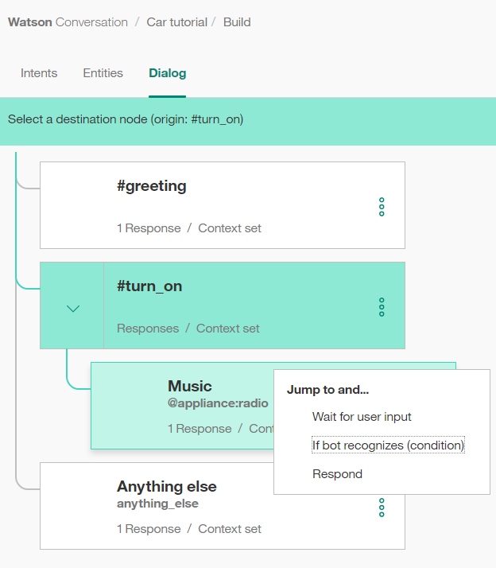
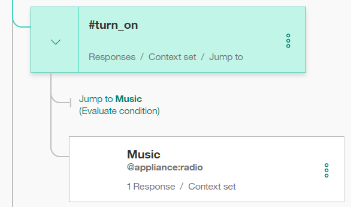
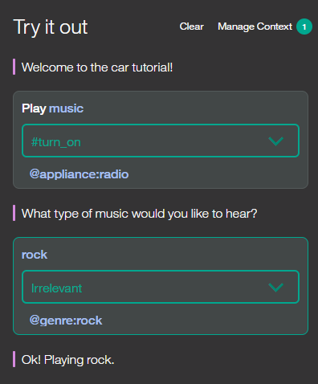

---

copyright:
  years: 2015, 2018
lastupdated: "2018-01-24"

---

{:shortdesc: .shortdesc}
{:new_window: target="_blank"}
{:tip: .tip}
{:pre: .pre}
{:codeblock: .codeblock}
{:screen: .screen}
{:javascript: .ph data-hd-programlang='javascript'}
{:java: .ph data-hd-programlang='java'}
{:python: .ph data-hd-programlang='python'}
{:swift: .ph data-hd-programlang='swift'}

# Lernprogramm: Komplexes Dialogmodul erstellen
{: #tutorial}

In diesem Lernprogramm erstellen Sie mit dem Service '{{site.data.keyword.conversationshort}}' ein Dialogmodul, das Benutzern die Interaktion mit einem Dashboard für ein kognitives Automobil ermöglicht.
{: shortdesc}

## Lernziele

Sobald Sie dieses Lernprogramm abgeschlossen haben, wissen Sie, wie Sie Folgendes ausführen:

- Entitäten definieren
- Dialogmodul planen
- Knoten- und Antwortbedingungen in einem Dialogmodul verwenden

### Dauer
Für dieses Lernprogramm benötigen Sie ungefähr zwei bis drei Stunden.

### Voraussetzung

Arbeiten Sie das [Lernprogramm 'Einführung'](getting-started.html) durch, bevor Sie mit diesem Lernprogramm beginnen. 

Sie verwenden den von Ihnen erstellten {{site.data.keyword.conversationshort}}-Lernprogrammarbeitsbereich und fügen Knoten zum dem einfachen Dialogmodul hinzu, das Sie im Rahmen der Einführungsübung erstellt haben.

## Schritt 1: Absichten und Beispiele hinzufügen
{: #intents}

Fügen Sie auf der Registerkarte 'Absichten' eine Absicht hinzu. Eine Absicht ist der Zweck oder das Ziel, der/das in der Benutzereingabe zum Ausdruck kommt.

1.  Klicken Sie auf der Seite 'Absichten' des {{site.data.keyword.conversationshort}}-Lernprogrammarbeitsbereichs auf **Absicht hinzufügen**.
1.  Fügen Sie den folgenden Namen für die Absicht hinzu und klicken Sie dann auf **Absicht erstellen**:

    ```
    turn_on
    ```
    {: codeblock}

    Dem von Ihnen angegebenen Namen der Absicht wird das Zeichen `#` vorangestellt. Die Absicht `#turn_on` besagt, dass der Benutzer ein Gerät wie beispielsweise das Radio, die Frontscheibenwischer oder die Scheinwerfer einschalten möchte.
1.  Geben Sie im Feld **Benutzerbeispiele hinzufügen** die folgende Äußerung ein und klicken Sie dann auf **Beispiel hinzufügen**:

    ```
    I need lights
    ```
    {: codeblock}

1.  Fügen Sie die folgenden fünf weiteren Beispiele hinzu, die Watson bei der Erkennung der Absicht `#turn_on` helfen.

    ```
    Play some tunes
    Turn on the radio
    turn on
    Air on please
    Crank up the AC
    Turn on the headlights
    ```
    {: codeblock}

1.  Klicken Sie auf das Symbol **Schließen** , um das Hinzufügen der Absicht `#turn_on` abzuschließen.

Sie verfügen nun über drei Absichten: die Absicht `#turn_on`, die Sie soeben hinzugefügt haben, sowie die Absichten `#hello` und `#goodbye`, die im *Lernprogramm 'Einführung'* hinzugefügt wurden, das Sie als vorausgesetzten Schritt durchgearbeitet haben. Jede Absicht enthält eine Reihe von Beispieläußerungen, die das Training von Watson zur Erkennung von Absichten in der Benutzereingabe unterstützen.

## Schritt 2: Entitäten hinzufügen
{: #entities}

Eine Entitätsdefinition enthält eine Reihe von *Entitätswerten*, die zum Auslösen von unterschiedlichen Antworten verwendet werden können. Für jeden Entitätswert kann es mehrere *Synonyme* geben, die unterschiedliche Möglichkeiten für die Angabe desselben Wertes in der Benutzereingabe definieren.

Erstellen Sie Entitäten, die in der Benutzereingabe mit der Absicht '#turn_on' auftreten könnten, um anzugeben, was der Benutzer einschalten möchte.

1.  Klicken Sie auf die Registerkarte **Entitäten**, um die Seite 'Entitäten' zu öffnen.
1.  Klicken Sie auf **Entität hinzufügen**.
1.  Fügen Sie den folgenden Entitätsnamen hinzu und drücken Sie die Eingabetaste:

    ```
    appliance
    ```
    {: codeblock}

    Dem von Ihnen angegebenen Entitätsnamen wird das Zeichen `@` vorangestellt. Die Entität `@appliance` stellt ein Gerät im Fahrzeug dar, das ein Benutzer möglicherweise einschalten möchte.
1.  Fügen Sie den folgenden Wert zum Feld **Wertname** hinzu:

    ```
    radio
    ```
    {: codeblock}

    Der Wert stellt ein bestimmtes Gerät dar, das der Benutzer möglicherweise einschalten möchte.
1.  Fügen Sie im Feld **Synonyme** andere Möglichkeiten zum Angeben des Geräts 'Radio' hinzu. Drücken Sie die **Tabulatortaste**, um den Fokus auf das Feld zu setzen, und geben Sie dann die folgenden Synonyme ein. Drücken Sie nach jedem Synonym die **Eingabetaste**.

    ```
    music
    tunes
    ```
    {: codeblock}

1.  Klicken Sie auf **Wert hinzufügen**, um das Definieren des Werts `radio` für die Entität `@appliance` abzuschließen.
1.  Fügen Sie weitere Gerätetypen hinzu.

    - Wert: `headlights`. Synonym: `lights`.
    - Wert: `air conditioning`. Synonyme: `air` und `AC`.

1.  Klicken Sie auf das Umschaltsteuerelement, um die unscharfe Suche für die Entität `@appliance` zu **aktivieren**.
    Diese Einstellung hilft dem Service dabei, Verweise auf Entitäten in der Benutzereingabe auch dann zu erkennen, wenn die Entität in der Benutzereingabe nicht mit genau der hier verwendeten Syntax angegeben ist.
1.  Klicken Sie auf das Symbol **Schließen** , um das Hinzufügen der Entität `@appliance` abzuschließen.
1.  Wiederholen Sie die Schritte 2 bis 8, um die Entität '@`genre`' mit aktivierter unscharfer Suche sowie den folgenden Werten und Synonymen zu erstellen:

    - Wert: `classical`. Synonym: `symphonic`.
    - Wert: `rhythm and blues` Synonym: `r&b`.
    - Wert: `rock`. Synonyme: `rock & roll`, `rock and roll` und `pop`.

Sie haben somit die Entitäten `@appliance` (für ein Gerät, das der Bot einschalten kann) und `@genre` (für eine Musikrichtung, die der Benutzer auswählen kann) definiert.

Sobald die Benutzereingabe empfangen wird, erkennt der Service '{{site.data.keyword.conversationshort}}' sowohl die Absichten als auch die Entitäten. Jetzt können Sie ein Dialogmodul definieren, das anhand von Absichten und Entitäten die richtige Antwort auswählt.

## Schritt 3: Komplexes Dialogmodul erstellen
{: #complex-dialog}

In diesem komplexen Dialogmodul erstellen Sie Dialogmodulverzweigungen, die die oben definierte Absicht '#turn_on' verarbeiten.

### Stammknoten für '#turn_on' hinzufügen
Erstellen Sie eine Dialogmodulverzweigung zur Beantwortung der Absicht '#turn_on'. Erstellen Sie als Erstes den Stammknoten:

1.  Klicken Sie auf das Symbol  im Knoten **#hello** und wählen Sie die Option **Knoten darunter hinzufügen** aus.
1.  Beginnen Sie mit der Eingabe von `#turn_on` im Bedingungsfeld und wählen Sie dann diesen Eintrag in der Liste aus.
    Diese Bedingung wird durch jede Eingabe ausgelöst, die der Absicht '#turn_on' entspricht.
1.  Geben Sie in diesem Knoten keine Antwort ein. Klicken Sie auf , um die Bearbeitungsansicht für den Knoten zu schließen.

### Szenarios
Das Dialogmodul muss ermitteln, welches Gerät der Benutzer einschalten möchte. Zu diesem Zweck erstellen Sie mehrere Antworten, die auf zusätzlichen Bedingungen basieren.

Aufgrund der von Ihnen definierten Absichten und Entitäten gibt es drei mögliche Szenarios:

**Szenario 1**: Der Benutzer möchte Musik hören. In diesem Fall muss der Bot die Musikrichtung abfragen.

**Szenario 2**: Der Benutzer möchte ein anderes verfügbares Gerät einschalten. In diesem Fall wiederholt der Bot den Namen des angeforderten Geräts in einer Nachricht, die besagt, dass das Gerät eingeschaltet wird.

**Szenario 3**: Der Benutzer gibt keinen erkennbaren Gerätenamen an. In diesem Fall muss der Bot um eine Erläuterung bitten.

Fügen Sie Knoten, die diese Szenariobedingungen in dieser Reihenfolge überprüfen, hinzu, damit das Dialogmodul zuerst die speziellste Bedingung auswertet.

### Szenario 1 verarbeiten

Fügen Sie Knoten hinzu, die das Szenario 1 verarbeiten, bei dem der Benutzer Musik einschalten möchte. Als Reaktion muss der Bot nach der Musikrichtung fragen.

#### Fügen Sie einen untergeordneten Knoten hinzu, der überprüft, ob es sich beim Gerätetyp um das Radio handelt.

1.  Klicken Sie auf das Symbol  im Knoten **#turn_on** und wählen Sie die Option **Untergeordneten Knoten hinzufügen** aus.
1.  Geben Sie im Bedingungsfeld `@appliance:radio` ein.
    Diese Bedingung wird mit 'true' ausgewertet, wenn die Entität '@appliance' den Wert `radio` oder eines seiner Synonyme aufweist, die auf der Registerkarte 'Entitäte' definiert wurden.
1.  Geben Sie im Antwortfeld die Zeichenfolge `What kind of music would you like to hear?` ein.
1.  Benennen Sie den Knoten mit `Music`.
1.  Klicken Sie auf , um die Bearbeitungsansicht für den Knoten zu schließen.

#### Sprung vom Knoten '#turn_on' zum Knoten 'Music' hinzufügen

Definieren Sie vom Knoten `#turn on` einen Sprung direkt zum Knoten `Music`, der ohne Anforderung einer weiteren Benutzereingabe ausgeführt wird. Hierzu verwenden Sie eine Aktion **Springen zu**.

1.  Klicken Sie auf das Symbol  im Knoten **#turn_on** und wählen Sie die Option **Springen zu** aus.
1.  Wählen Sie den untergeordneten Knoten **Music** und anschließend die Einstellung **Bei Erkennung durch Bot (Bedingung)** aus, um anzugeben, dass die Bedingung des Knotens 'Music' verarbeitet werden soll.



Den Zielknoten (also den Knoten, der das Ziel der Aktion 'Springen zu' sein soll) müssen Sie erstellt haben, bevor Sie die Aktion **Springen zu** hinzufügen.

Nachdem Sie die Beziehung 'Springen zu' erstellt haben, wird in der Baumstruktur ein neuer Eintrag angezeigt:



#### Untergeordneten Knoten zur Prüfung der Musikrichtung hinzufügen

Jetzt fügen Sie einen Knoten hinzu, der die Abfrage einer Musikrichtung beim Benutzer verarbeitet.

1.  Klicken Sie auf das Symbol  im Knoten **Music** und wählen Sie die Option **Untergeordneten Knoten hinzufügen** aus.
    Dieser untergeordnete Knoten wird nur dann ausgewertet, wenn der Benutzer die Frage beantwortet hat, welche Art von Musik er hören möchte. Da vor diesem Knoten eine Benutzereingabe erforderlich ist, muss keine Aktion **Springen zu** verwendet werden.
1.  Fügen Sie die Angabe `@genre` im Bedingungsfeld hinzu.  Diese Bedingung wird immer dann mit 'true' ausgewertet, wenn ein gültiger Wert für die Entität '@genre' erkannt wird.
1.  Geben Sie `OK! Playing @genre.` als Antwort ein. In dieser Antwort wird der vom Benutzer angegebene Wert für die Musikrichtung wiederholt.

#### Knoten zur Verarbeitung von nicht erkannten Musikrichtungen in Benutzerantworten hinzufügen

Fügen Sie einen Knoten hinzu, der antwortet, wenn der Benutzer keinen erkannten Wert für '@genre' angibt.

1.  Klicken Sie auf das Symbol  im Knoten *@genre* und wählen Sie die Option **Knoten darunter hinzufügen** aus, um einen Peerknoten zu erstellen.
1.  Geben Sie `true` im Bedingungsfeld ein.
    Die Bedingung 'true' ist eine Sonderbedingung. Sie gibt an, dass dieser Knoten immer mit 'true' ausgewertet werden soll, falls er im Ablauf des Dialogmoduls erreicht wird. (Sofern der Benutzer einen gültigen Wert für '@genre' bereitstellt, wird dieser Knoten in keinem Fall erreicht.)
1.  Geben Sie `I'm sorry, I don't understand. I can play classical, rhythm and blues, or rock music.` als Antwort ein.

Jetzt sind alle Fälle berücksichtigt, bei denen der Benutzer darum bittet, Musik einzuschalten.

#### Dialogmodul für Musik testen

1.  Wählen Sie das Symbol  aus, um den Chatbereich zu öffnen.
1.  Geben Sie `Play music` ein.
    Der Bot erkennt die Absicht '#turn_on' sowie die Entität '@appliance:music' und antwortet mit der Frage nach einer Musikrichtung.

1.  Geben Sie einen gültigen Wert für '@genre' ein (z. B. `rock`).
    Der Bot erkennt die Entität '@genre' und antwortet entsprechend.

    

1.  Geben Sie erneut `Play music` ein, aber dieses Mal mit einer ungültigen Antwort auf die Frage nach der Musikrichtung. Der Bot antwortet, dass er Sie nicht verstanden hat.

### Szenario 2 verarbeiten

Sie fügen nun Knoten hinzu, die das Szenario 2 verarbeiten, bei dem der Benutzer ein anderes gültiges Gerät einschalten möchte. In diesem Fall wiederholt der Bot den Namen des angeforderten Geräts in einer Nachricht, die besagt, dass das Gerät eingeschaltet wird.

#### Untergeordneten Knoten zur Überprüfung des Geräts hinzufügen

Fügen Sie einen Knoten hinzu, der ausgelöst wird, wenn vom Benutzer ein anderer gültiger Wert für '@appliance' bereitgestellt wird.
Bei den anderen Werten von '@appliance' fragt der Bot nicht nach einer weiteren Eingabe. Er gibt lediglich eine positive Antwort zurück.

1.  Klicken Sie auf das Symbol 'Mehr'  im Knoten **Music** und wählen Sie dann die Option **Knoten darunter hinzufügen** aus, um einen Peerknoten zu erstellen, der nach der Auswertung der Bedingung '@appliance:music' ausgewertet wird.
1.  Geben Sie `@appliance` als Knotenbedingung ein.
    Diese Bedingung wird ausgelöst, wenn die Benutzereingabe andere erkannte Werte für die Entität '@appliance' als 'music' enthält.
1.  Geben Sie `OK! Turning on the @appliance.` als Antwort ein.
    In dieser Antwort wird der vom Benutzer angegebene Wert für das Gerät wiederholt.

#### Dialogmodul mit anderen Geräten testen

1.  Wählen Sie das Symbol  aus, um den Chatbereich zu öffnen.
1.  Geben Sie `lights on` ein.

    Der Bot erkennt die Absicht '#turn_on' sowie die Entität '@appliance:headlights' und antwortet mit `OK, turning on the headlights`.

    

1.  Geben Sie `turn on the air` ein.

    Der Bot erkennt die Absicht '#turn_on' sowie die Entität '@appliance:(air conditioning)' und antwortet mit `OK, turning on the air conditioning`.

1.  Probieren Sie Varianten aller unterstützten Befehle auf der Grundlage der Beispiele für die verbalen Äußerungen und Entitätssynonyme aus, die Sie definiert haben.

### Szenario 3 verarbeiten

Nun fügen Sie einen Peerknoten hinzu, der ausgelöst wird, wenn der Benutzer keinen gültigen Gerätetyp angibt.

1.  Klicken Sie auf das Symbol 'Mehr'  im Knoten **@appliance** und wählen Sie dann die Option **Knoten darunter hinzufügen** aus, um einen Peerknoten zu erstellen, der nach der Auswertung der Bedingung '@appliance' ausgewertet wird.
1.  Geben Sie `true` im Bedingungsfeld ein.
    (Sofern der Benutzer einen gültigen Wert für '@appliance' bereitstellt, wird dieser Knoten in keinem Fall erreicht.)
1.  Geben Sie `I'm sorry, I'm not sure I understood you. I can turn on music, headlights, or air conditioning` als Antwort ein.

#### Weitere Tests durchführen

1.  Probieren Sie zum Testen des Dialogmoduls weitere Varianten für verbale Äußerungen aus.

    Falls der Bot nicht die richtige Absicht erkennt, können Sie ihn direkt über das Chatfenster erneut trainieren. Wählen Sie den Pfeil neben der falschen Absicht aus und wählen Sie dann in der Liste die richtige Absicht aus.

    

Optional können Sie sich den Arbeitsbereich **Car Dashboard - Sample** ansehen. Dort ist derselbe Anwendungsfall mit einem längeren Dialogmodul und zusätzlicher Funktionalität weiter ausgearbeitet.

1.  Klicken Sie auf die Schaltfläche **Zurück zu Arbeitsbereichen**  im Navigationsmenü.

1.  Klicken Sie auf der Kachel **Car Dashboard - Sample** auf **Beispiel bearbeiten**.

## Nächste Schritte
{: #deploy}

Nachdem Sie Ihren Arbeitsbereich erstellt und getestet haben, können Sie ihn jetzt bereitstellen, indem Sie eine Verbindung zu einer Benutzerschnittstelle herstellen. Hierzu stehen Ihnen verschiedene Verfahren zur Verfügung.

### In Slack testen

Mit dem Testbereitstellungstool können Sie Ihren Arbeitsbereich in nur wenigen Schritten als Chat-Bot in einem Slack-Kanal [bereitstellen](test-deploy.html). Diese Option stellt den schnellsten und einfachsten Weg zur Bereitstellung eines Arbeitsbereichs für Testzwecke dar, ist jedoch mit einigen Einschränkungen verbunden.

### Eigene Front-End-Anwendung erstellen

Mit den Watson-SDKs können Sie eine [eigene Front-End-Anwendung erstellen](develop-app.html), die Ihren Arbeitsbereich mithilfe der REST-API von {{site.data.keyword.conversationshort}} verbindet.

### In Social-Media- oder Nachrichtenkanälen bereitstellen

Mit dem [BotKit-Framework](integrations.html) können Sie eine Botanwendung erstellen, die bei Social-Media- und Nachrichtenkanälen wie Slack, Facebook und Twilio integriert werden kann.
